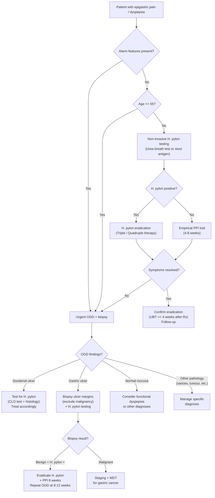

## Differential Diagnosis of Peptic Ulcer Disease

When a patient presents with **epigastric pain** — the cardinal symptom of PUD — your job is not to jump straight to "peptic ulcer." The epigastrium is a crossroads: the stomach, duodenum, pancreas, biliary tree, oesophagus, and even the heart all refer pain here. A systematic differential diagnosis ensures you don't miss a life-threatening mimic and guides your investigation strategy.

The approach below is organised by the **presenting complaint** a PUD patient might have, because PUD presents in three main clinical scenarios:
1. **Dyspepsia / epigastric pain** (most common — the "uncomplicated" presentation)
2. **Upper GI bleeding** (haematemesis / melaena — the most common complication)
3. **Acute abdomen** (perforation, peritonitis)

---

### 1. Differential Diagnosis of Dyspepsia / Epigastric Pain

This is the presentation where the patient walks into clinic or ED with epigastric discomfort, burning, postprandial fullness, or early satiety — and you are considering PUD as one of many possibilities.

#### 1.1 Gastroduodenal Causes

| Diagnosis | Key Distinguishing Features | Why It Mimics PUD |
|:---|:---|:---|
| **Functional dyspepsia** (~60% of all dyspepsia) [2] | Symptoms ≥ 3 months, onset ≥ 6 months ago; NO structural disease on OGD; diagnosis of exclusion | Identical symptom profile (epigastric pain/burning, early satiety, postprandial fullness). The difference is that OGD is normal — there is no mucosal break |
| **Gastritis / Duodenitis** (erosive) [1][3] | Drug-induced (aspirin/NSAIDs), alcohol-induced, stress-induced; bleeding is typically self-limited; diagnosis by OGD showing mucosal erythema/erosions without a true ulcer | Erosions cause similar burning pain and can bleed, but they do not breach the muscularis mucosae — i.e., they are superficial |
| ***Gastric malignancy*** (adenocarcinoma, lymphoma, GIST) [3][5] | Constitutional symptoms (weight loss, anorexia, cachexia); ***dysphagia, early satiety, persistent epigastric pain***; palpable mass; Virchow's node; anaemia | A malignant gastric ulcer can look identical to a benign GU at endoscopy — this is why **all GU must be biopsied** |
| **Dieulafoy's lesion** [3] | Idiopathic dilated aberrant submucosal vessel eroding normal overlying mucosa; MC in gastric fundus; presents with acute UGIB rather than chronic pain | Presents as UGIB, can be missed on OGD if not actively bleeding |
| **Gastric outlet obstruction** [3] | Non-bilious projectile vomiting of undigested food, succussion splash; ***malignant until proven otherwise*** (80% malignant — CA stomach MC, CA head of pancreas; 20% benign — PUD-related pyloric stenosis is 2nd MC) | GOO can be a complication of PUD itself, but also caused by periampullary/pancreatic malignancy |
| ***Gastric volvulus*** [3] | **Borchardt's triad**: severe epigastric pain, retching without vomiting, inability to pass NG tube; usually secondary to rolling hiatal hernia | Acute upper abdominal pain mimicking perforated PUD |

#### 1.2 Oesophageal Causes

| Diagnosis | Key Distinguishing Features | Why It Mimics PUD |
|:---|:---|:---|
| ***Gastro-oesophageal reflux disease (GERD)*** [2] | Retrosternal burning (heartburn), regurgitation, worse lying flat/bending; relieved by antacids/PPIs; water brash | Heartburn can be perceived as "epigastric pain"; both respond to PPIs, causing diagnostic confusion |
| **Oesophagitis / oesophageal ulcers** (erosive, infective, pill) [1] | Odynophagia; Hx of GERD, immunosuppression (HSV, Candida), or causative medications (bisphosphonates, tetracycline, KCl) | Retrosternal/epigastric pain; can cause UGIB |
| **Oesophageal malignancy** | Progressive dysphagia (solids → liquids), weight loss, anaemia | Late-stage CA oesophagus can cause epigastric pain and UGIB |

#### 1.3 Hepatobiliary & Pancreatic Causes

| Diagnosis | Key Distinguishing Features | Why It Mimics PUD |
|:---|:---|:---|
| **Biliary colic** [6] | RUQ/epigastric pain after fatty meals, lasting 30 min–6 hours then resolving completely; no fever, no peritoneal signs | Epigastric component can be mistaken for PUD; but biliary colic is **colicky** (waxes/wanes), resolves spontaneously, and is precipitated specifically by fatty meals |
| **Acute cholecystitis** [6] | RUQ pain > 6 hours, fever, Murphy's sign, ↑ WCC, ↑ CRP | Pain more RUQ than epigastric; peritoneal signs present; does NOT resolve spontaneously (unlike biliary colic and unlike DU pain which is relieved by food) |
| ***Acute pancreatitis*** [7] | Epigastric pain **radiating to the back**, relieved by sitting up/leaning forward; nausea/vomiting; ↑ amylase/lipase ( > 3× ULN); Hx of gallstones or alcohol | The back radiation and posture relief are key distinguishing features. PUD can also radiate to the back (posterior penetration into the pancreas), but pancreatitis pain is more constant and severe |
| **Chronic pancreatitis** [2] | Chronic epigastric pain radiating to the back; steatorrhoea; weight loss; pancreatic calcifications on imaging | Chronic pain mimicking chronic PUD; Hx of alcohol use or recurrent acute pancreatitis |
| **Pancreatic / periampullary malignancy** | Painless obstructive jaundice; weight loss; Courvoisier sign; new-onset diabetes | Late-stage disease causes epigastric pain |

#### 1.4 Cardiac Causes (Must Not Miss!)

| Diagnosis | Key Distinguishing Features | Why It Mimics PUD |
|:---|:---|:---|
| ***Acute myocardial infarction (especially inferior MI)*** [5][7] | Chest tightness/pressure, diaphoresis, dyspnoea; ECG changes; troponin elevation; risk factors (DM, HTN, smoking, hyperlipidaemia) | Inferior MI (RCA territory) can present as **isolated epigastric pain** with nausea/vomiting — the diaphragmatic surface of the heart refers pain to the epigastrium via the phrenic nerve and shared T5–T9 dermatomes. **Always do an ECG in any patient > 50 with acute epigastric pain** |
| **Pericarditis** | Pleuritic chest pain worse lying flat, relieved sitting forward; pericardial rub; diffuse ST elevation | Epigastric component may dominate |

<Callout title="Don't Kill Your Patient" type="error">
A middle-aged patient presenting to ED with acute epigastric pain, nausea, and diaphoresis could have an inferior MI, not just a peptic ulcer. **Always get an ECG** before attributing epigastric pain to a GI cause, especially in patients with cardiovascular risk factors. This is a classic exam trap and a real-life killer.
</Callout>

#### 1.5 Other / Systemic Causes

| Diagnosis | Key Distinguishing Features |
|:---|:---|
| **Medications** [2] | NSAIDs, glucocorticoids, ampicillin, erythromycin, iron supplements, K⁺ supplements, bisphosphonates — can cause dyspepsia without frank ulceration |
| **Metabolic** [2] | Hypercalcaemia (stimulates gastrin → ↑ acid; also causes constipation, "stones, bones, groans, moans"); hyperkalaemia |
| **Diabetic ketoacidosis (DKA)** [5] | Abdominal pain, nausea/vomiting, Kussmaul breathing, fruity breath, hyperglycaemia, ketones | 
| **Mesenteric ischaemia** [5] | "Pain out of proportion to examination"; post-prandial pain ("intestinal angina"); AF, vascular risk factors |
| **Irritable bowel syndrome** | Chronic abdominal pain relieved by defecation; altered bowel habit; no alarm features |

---

### 2. Differential Diagnosis When PUD Presents as UGIB

When PUD bleeds, it enters the differential of **all causes of upper GI bleeding**. The lecture slides list these ***in descending order of frequency*** [1]:

> ***Causes of upper GI bleeding in descending order of frequency*** [1]:
> 1. ***Duodenal or gastric ulcer*** (most common)
> 2. ***Gastritis***
> 3. ***Esophageal or gastric varices***
> 4. ***Mallory-Weiss syndrome***
> 5. ***Benign or malignant gastric tumour***

Expanding on each, organised by anatomical site [1][3][4]:

**Oesophageal causes:**
- ***Oesophagitis*** (erosive — GERD-related, infective, pill-induced)
- ***Oesophageal varices*** — complication of portal hypertension / liver cirrhosis; presents with massive haematemesis; look for stigmata of chronic liver disease (spider naevi, caput medusae, ascites, jaundice) [4]
- ***Mallory-Weiss syndrome*** — longitudinal mucosal laceration at the GOJ following forceful retching/vomiting; the history of **preceding forceful vomiting followed by haematemesis** is the key clue (contrast with Boerhaave syndrome which is a full-thickness perforation) [1][3]
- Oesophageal malignancy

**Gastric causes:**
- ***PUD — most common cause*** [1]
- ***Gastritis*** (drug-induced, alcohol-induced, stress-induced) — inflammation without a true ulcer; bleeding typically self-limited [1]
- ***Portal hypertensive gastropathy*** — friable mucosa with mosaic "snakeskin" pattern on OGD; bleeding from ectatic mucosal vessels rupturing; associated with portal hypertension [1][4]
- ***Gastric varices*** — often fundal; more difficult to manage endoscopically than oesophageal varices
- ***Dieulafoy's lesion*** — aberrant dilated submucosal artery; MC in gastric fundus; can cause massive bleeding from a normal-appearing mucosal surface [3]
- ***Gastric malignancy*** (adenocarcinoma, lymphoma, GIST) [1]

**Duodenal causes:**
- Duodenal ulcer (part of PUD)
- Duodenitis
- Duodenal malignancy
- ***Haemobilia*** (bleeding from the biliary tree into the duodenum — associated with cholangiocarcinoma, liver biopsy, hepatic artery aneurysm) [3]

**Other:**
- ***Aorto-enteric fistula*** — must consider in any patient with a **history of aortic graft repair** who presents with UGIB; classically a "herald bleed" (small initial bleed) followed by catastrophic exsanguination; CT aortogram is diagnostic [3][4]
- ***Angiodysplasia / AV malformation*** — dilated, tortuous submucosal vessels; can occur anywhere but often in stomach and duodenum in the upper GIT; diagnosed endoscopically [1]
- ***Haemosuccus pancreaticus*** — bleeding from the pancreatic duct, usually in patients with chronic pancreatitis, pseudocysts, or pancreatic tumours [1]

<Callout title="Mnemonic — UGIB Differential by Site">
**"VEGaS MaD"** — Varices, Erosive oesophagitis/gastritis, Gastric ulcer, Stomach tumour, Mallory-Weiss, angioDysplasia. Plus always think PUD (most common) and aorto-enteric fistula (most dangerous to miss).
</Callout>

---

### 3. Differential Diagnosis When PUD Presents as Acute Abdomen (Perforation)

***Perforated peptic ulcer (PPU)*** presents as sudden-onset severe generalised abdominal pain with peritonism. The differential overlaps with the **life-threatening causes of acute abdomen** [5]:

- ***Perforated viscus*** (PPU is most common; also perforated appendix, diverticular perforation, colonic perforation)
- ***Ruptured AAA*** — pulsatile abdominal mass, back pain, hypotension; in an elderly male with known AAA
- ***Acute mesenteric ischaemia*** — pain out of proportion to examination; AF; metabolic acidosis
- ***Acute intestinal obstruction***
- ***Severe acute pancreatitis***
- ***Ruptured HCC*** — in patient with known chronic liver disease
- ***Medical causes***: DKA, acute MI, Addisonian crisis [5]
- ***Obstetric causes***: ruptured ectopic pregnancy, placental abruption [5]

A specific clinical pearl for appendicitis: ***Valentino's sign*** — gastric/duodenal content from a PPU tracks down the right paracolic gutter to the RIF, mimicking acute appendicitis. The clue is that pain started in the epigastrium before migrating to the RIF (in appendicitis, pain starts peri-umbilical then migrates to the RIF, but the initial pain is visceral and vague, not the "thunderclap" epigastric pain of PPU) [5].

---

### 4. Clinical Approach to Differentiating PUD from Key Mimics

The history alone can narrow down the differential substantially. Here are the key discriminating questions:

**Relationship to food:**
- ***DU***: pain relieved by food, recurs 2–5 hours later ("hunger pain") [2][5]
- ***GU***: pain worsened by food [2][5]
- ***Biliary colic***: pain precipitated by **fatty** meals specifically [5]
- ***Pancreatitis***: pain worsened by food, relieved by leaning forward [5]
- ***Functional dyspepsia***: variable relationship, no consistent pattern

**Character and radiation:**
- ***PUD***: burning/gnawing epigastric pain; back radiation if penetrating posteriorly [2]
- ***Pancreatitis***: band-like epigastric pain radiating to back [7]
- ***Biliary colic***: RUQ/epigastric pain radiating to right shoulder/scapula
- ***MI***: crushing/pressure chest pain radiating to jaw/left arm; diaphoresis

**Red flags mandating urgent OGD** [2]:
- Age ≥ 55 with new dyspepsia
- Weight loss, dysphagia, odynophagia
- GI bleeding or iron-deficiency anaemia
- Persistent vomiting
- Palpable mass or lymphadenopathy
- Family history of upper GI cancer
- Jaundice

---

### 5. Diagnostic Algorithm — Approach to the Patient with Suspected PUD

<Callout title="The 'Test and Treat' Strategy" type="idea">
In patients < 55 **without** alarm features, current guidelines recommend a **"test and treat"** approach: non-invasive *H. pylori* testing (urea breath test or stool antigen), and if positive, eradication therapy. If negative, an empirical PPI trial. OGD is reserved for those who fail initial management or have alarm features. This avoids unnecessary endoscopy in the majority of young dyspeptic patients [2].
</Callout>

---

### 6. Summary Table — Key Differentials of PUD by Presentation

| Presentation | Top Differentials to Consider | "Must Not Miss" |
|:---|:---|:---|
| **Epigastric pain / dyspepsia** | Functional dyspepsia, GERD, gastritis, biliary colic, pancreatitis, gastric malignancy | **Inferior MI**, gastric cancer |
| **UGIB** | ***PUD (MC)***, gastritis, oesophageal/gastric varices, Mallory-Weiss, gastric tumour | **Aorto-enteric fistula** (Hx of aortic graft), variceal bleed (liver disease) |
| **Acute abdomen (perforation)** | PPU, ruptured AAA, mesenteric ischaemia, acute pancreatitis, ruptured HCC | **Ruptured AAA**, mesenteric ischaemia, MI |
| **GOO** | Gastric cancer (MC, 80%), PUD-related pyloric stenosis (2nd MC benign cause), CA head of pancreas | **Malignant GOO** — malignant until proven otherwise [3] |

---

<Callout title="High Yield Summary">

1. **PUD is the most common cause of UGIB** — but always consider varices (liver disease), Mallory-Weiss (Hx of forceful vomiting), malignancy (constitutional symptoms), and aorto-enteric fistula (Hx of aortic graft).
2. **Functional dyspepsia accounts for ~60% of dyspepsia** — diagnosis of exclusion after OGD is normal.
3. **Always do an ECG** in acute epigastric pain to exclude inferior MI — the single most dangerous mimic.
4. **Gastric ulcers must always be biopsied** to exclude malignancy — a malignant gastric ulcer looks identical to a benign one.
5. **GOO is malignant until proven otherwise** (80% malignant, 20% benign).
6. **Valentino's sign**: PPU fluid tracking to RIF mimicking appendicitis.
7. **Aorto-enteric fistula**: any patient with Hx of aortic graft + UGIB → CT aortogram urgently.
8. **"Test and treat"** strategy for young patients without alarm features — non-invasive H. pylori testing before endoscopy.
9. UGIB differentials by site: **Oesophagus** (varices, oesophagitis, Mallory-Weiss, CA), **Stomach** (PUD, gastritis, Dieulafoy, portal hypertensive gastropathy, varices, CA), **Duodenum** (DU, duodenitis, haemobilia, CA).

</Callout>

---

<ActiveRecallQuiz
  title="Active Recall - Differential Diagnosis of PUD"
  items={[
    {
      question: "A 65-year-old man with a history of aortic graft repair presents with a small-volume haematemesis followed 12 hours later by massive GI haemorrhage and shock. What is the most important diagnosis to exclude and what investigation would you order?",
      markscheme: "Aorto-enteric fistula. Order an urgent CT aortogram. The 'herald bleed' (initial small bleed) followed by massive exsanguination is the classic presentation. This occurs because the aortic graft erodes into the duodenum (usually D3/D4)."
    },
    {
      question: "List the causes of UGIB in descending order of frequency as per lecture slides.",
      markscheme: "1. Duodenal or gastric ulcer (most common), 2. Gastritis, 3. Oesophageal or gastric varices, 4. Mallory-Weiss syndrome, 5. Benign or malignant gastric tumour."
    },
    {
      question: "A 52-year-old man presents to ED with sudden severe epigastric pain, nausea, and diaphoresis. His abdomen is soft with mild epigastric tenderness. What non-GI diagnosis must you exclude first and how?",
      markscheme: "Acute inferior myocardial infarction. Perform an ECG immediately. Inferior MI refers pain to the epigastrium via shared T5-T9 dermatomes and phrenic nerve irritation of the diaphragmatic heart surface."
    },
    {
      question: "What is Valentino's sign and what is its clinical significance?",
      markscheme: "Valentino's sign is when gastric or duodenal content from a perforated peptic ulcer tracks down the right paracolic gutter to the right iliac fossa, mimicking acute appendicitis. Its significance is that it can lead to misdiagnosis; the clue is that pain began as a sudden severe epigastric pain before localising to the RIF."
    },
    {
      question: "Explain the 'test and treat' strategy for dyspepsia. In which patients is it appropriate and when should you proceed directly to OGD?",
      markscheme: "Test and treat: non-invasive H. pylori testing (urea breath test or stool antigen) in patients aged less than 55 WITHOUT alarm features. If positive, give eradication therapy. If negative, give empirical PPI trial. Proceed directly to OGD if: age 55 or above, any alarm features (weight loss, dysphagia, GI bleeding, anaemia, persistent vomiting, palpable mass, lymphadenopathy, family history of upper GI cancer, jaundice), or failure of initial test-and-treat strategy."
    }
  ]}
/>

## References

[1] Lecture slides: GC 198. Profuse vomiting of fresh blood and in shock severe upper GI bleeding.pdf (p7 — Causes of upper GI bleeding in descending order of frequency)
[2] Senior notes: felixlai.md (Dyspepsia sections pp. 327–330; PUD sections pp. 386–390; UGIB differential diagnosis pp. 334–337)
[3] Senior notes: maxim.md (UGIB differential diagnosis p. 52; Benign diseases of stomach — PUD, GOO, Dieulafoy, gastric volvulus pp. 127–132)
[4] Senior notes: felixlai.md (Portal hypertensive gastropathy and variceal haemorrhage pp. 450–451)
[5] Senior notes: maxim.md (Acute abdomen differential diagnosis pp. 43–44; Appendicitis differential — Valentino's sign p. 180)
[6] Senior notes: felixlai.md (Biliary colic vs acute cholecystitis differential pp. 555)
[7] Senior notes: felixlai.md (Acute pancreatitis — clinical manifestation and differential diagnosis pp. 579–580)
