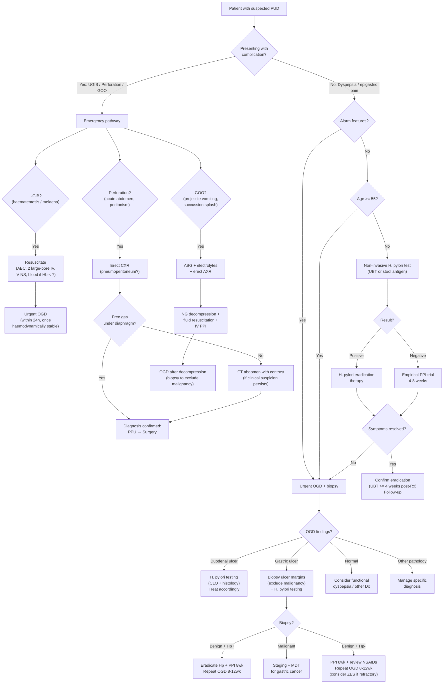

## Diagnostic Criteria, Diagnostic Algorithm & Investigation Modalities for Peptic Ulcer Disease

---

### 1. "Diagnostic Criteria" — Does PUD Have Formal Criteria?

Unlike conditions such as rheumatoid arthritis or heart failure, PUD does not have a set of formal "diagnostic criteria" with point scores. Instead, the diagnosis rests on a straightforward principle:

> **The gold standard for diagnosing PUD is direct visualisation of the ulcer on oesophago-gastro-duodenoscopy (OGD) with biopsy** [2][3].

That said, the clinical approach follows a structured algorithm driven by two key questions:
1. **Does this patient need an OGD now, or can we test-and-treat?** (determined by the presence or absence of alarm features)
2. **Once an ulcer is found, what is the aetiology?** (determined by *H. pylori* testing, drug history, and biopsy findings)

Additionally, when PUD presents as a complication — UGIB, perforation, or GOO — the diagnostic pathway shifts to an **emergency investigation algorithm** (covered below).

---

### 2. Master Diagnostic Algorithm

The following algorithm integrates the approach to **dyspepsia/suspected PUD** and the **emergency PUD complication** pathways into one unified flowchart.

<Callout title="The Two Gatekeeper Questions">
**Question 1 — Is this an emergency?** If the patient has UGIB, peritonism, or GOO → emergency pathway (resuscitate first, investigate second).

**Question 2 — Are there alarm features?** If yes → straight to OGD. If no and age < 55 → "test and treat" with non-invasive *H. pylori* testing. This avoids unnecessary endoscopy in the majority of young dyspeptic patients [2].
</Callout>

---

### 3. Alarm Features Mandating Urgent OGD [2]

These "red flags" indicate possible malignancy or serious pathology — bypass the "test and treat" approach and proceed directly to endoscopy:

- ***Age ≥ 55 with new-onset dyspepsia***
- ***Family history of upper GI cancer***
- ***Jaundice***
- ***Unintended weight loss***
- ***Dysphagia***
- ***Odynophagia***
- ***GI bleeding*** (haematemesis, melaena, haematochezia)
- ***Unexplained iron-deficiency anaemia***
- ***Persistent vomiting***
- ***Palpable mass or lymphadenopathy*** [2]

> **High Yield**: The alarm features are commonly tested. Remember them by the mnemonic **"VBAD FLaG"** — **V**omiting (persistent), **B**leeding (GI), **A**naemia (IDA), **D**ysphagia/odynophagia, **F**amily history of upper GI cancer, **L**oss of weight, **a**ge ≥ 55, **G**land (lymphadenopathy/mass).

---

### 4. Investigation Modalities — Detailed Breakdown

We now cover every investigation relevant to PUD, organised into **bedside tests → blood tests → H. pylori testing → imaging → endoscopy → special tests**, with the rationale and key findings for each.

---

#### 4.1 Bedside Tests

| Test | What It Tells You | Key Findings in PUD |
|:---|:---|:---|
| **Vital signs** | Haemodynamic status — detect shock from haemorrhage | Tachycardia, hypotension, postural drop (Class II–IV haemorrhagic shock) |
| **PR examination** | Detect melaena or haematochezia | Tarry black stool on glove = melaena → suggests UGIB. Fresh blood = consider massive UGIB or LGIB |
| ***Urinalysis*** [8] | Exclude urological causes of abdominal pain | Normal in PUD. Haematuria → ureteric colic; nitrites/leucocytes → UTI |
| ***Pregnancy test*** [8] | Exclude ectopic pregnancy in women of childbearing age presenting with abdominal pain | Must be done in all females of reproductive age with acute abdomen |
| **NG tube aspirate** (if UGIB suspected) | Confirm upper GI source; assess ongoing bleeding | Coffee-ground or bloody aspirate confirms UGIB. Clear aspirate does NOT exclude UGIB (pyloric spasm can prevent reflux of duodenal blood into the stomach) |

#### 4.2 Blood Tests [2][5][8]

| Test | Rationale | Key Findings / Interpretation |
|:---|:---|:---|
| ***CBC with differentials*** [2][8] | Baseline Hb; detect anaemia; WCC for infection/inflammation | **Microcytic hypochromic anaemia** → iron-deficiency anaemia from chronic occult blood loss [2]. Note: in acute haemorrhage, initial Hb may be **normal** because both plasma and red cells are lost simultaneously — Hb drops only after haemodilution (fluid shifts or IV fluid resuscitation) |
| ***Clotting profile*** (PT/INR, APTT) [8] | Coagulopathy assessment; guide transfusion | Prolonged in liver disease, warfarin use, DIC. Affects management of bleeding ulcer |
| ***Type and screen / cross-match*** [8] | Prepare for blood transfusion | Always group & save in UGIB; cross-match 2–4 units if actively bleeding |
| ***LRFT*** (liver + renal function) [5][8] | Liver disease (portal hypertension → variceal DDx); renal function for contrast safety and drug dosing | ***Elevated urea:creatinine ratio ( > 100:1)*** → classic for UGIB. Why? Haemoglobin in the GI tract is digested → amino acids are absorbed → hepatic urea synthesis ↑. Also, hypovolaemia → ↓ renal perfusion → ↑ urea reabsorption. Creatinine is unaffected → ratio rises [5] |
| ***Amylase / lipase*** [8] | Exclude acute pancreatitis (key differential) | > 3× ULN suggests pancreatitis rather than PUD. However, a perforated posterior DU penetrating the pancreas can also mildly elevate amylase |
| ***CRP*** [8] | Inflammatory marker; raised in perforation, peritonitis | Non-specific but supports inflammatory/infective process |
| ***ABG + lactate*** [8] | Assess shock severity; detect metabolic acidosis from tissue hypoperfusion; detect GOO metabolic picture | **Metabolic acidosis** (raised lactate) → haemorrhagic shock or mesenteric ischaemia. ***Hypochloraemic hypokalaemic metabolic alkalosis*** → GOO from prolonged vomiting [3] |
| ***Glucose*** [8] | Exclude DKA (epigastric pain differential) | Hyperglycaemia + ketoacidosis = DKA |
| ***Calcium / phosphate*** [8] | Hypercalcaemia can cause dyspepsia and also stimulates gastrin → acid ↑; associated with MEN1 (ZES) | ↑ Ca²⁺ → think MEN1 (hyperparathyroidism + ZES + pituitary adenoma) |
| ***ECG + cardiac enzymes*** [8] | Exclude acute MI (inferior MI mimics PUD) | ST changes in leads II, III, aVF → inferior MI; troponin rise |

<Callout title="The Urea:Creatinine Ratio in UGIB" type="idea">
A ***urea:creatinine ratio > 100:1*** (when both are in mmol/L) is a simple bedside clue that the bleeding source is **upper** GI. The mechanism is two-fold:
1. **Protein digestion**: blood (haemoglobin = protein) is digested in the GI tract → amino acids absorbed → liver converts to urea → serum urea rises.
2. **Pre-renal AKI**: hypovolaemia from blood loss → ↓ GFR → ↑ urea reabsorption in the proximal tubule (but creatinine is not reabsorbed).
Both mechanisms selectively raise urea while creatinine stays relatively stable [5].
</Callout>

---

#### 4.3 *H. pylori* Testing — The Cornerstone of Aetiological Diagnosis [2]

***ALL patients diagnosed with peptic ulcer disease by endoscopy should undergo testing for H. pylori infection*** [2]. This is non-negotiable. The choice of test depends on whether an OGD is being performed.

##### 4.3.1 Invasive Tests (Require OGD — 3 Biopsy Specimens) [2]

| Test | Specimen | Mechanism | Sensitivity/Specificity | Key Points |
|:---|:---|:---|:---|:---|
| ***Rapid urease test (CLO test)*** | 1 biopsy specimen | Biopsy placed in urea-containing medium with pH indicator. *H. pylori* urease cleaves urea → **NH₃** → alkaline pH → **colour change from yellow to pink** [2] | Sens ~90–95%, Spec ~95–100% | Fast (result in 1–24 hours). **First-line invasive test**. False negatives if: recent PPI use (↓ bacterial load), recent antibiotics, active bleeding (blood dilutes the specimen) |
| ***Histological examination*** | 2 biopsy specimens | Microscopic identification of *H. pylori* organisms + assessment of mucosal pathology (gastritis, atrophy, intestinal metaplasia, dysplasia) [2] | Sens ~95%, Spec ~99% | Gold standard for detecting associated mucosal changes. Special stains (Giemsa, Warthin-Starry, immunohistochemistry) improve detection. Also identifies malignancy on GU biopsy |
| **Bacterial culture + antibiotic sensitivity** | Biopsy specimen | Culture in microaerophilic conditions | Sens ~70–80%, Spec 100% | ***Only indicated in treatment-refractory cases*** [2] — to guide antibiotic selection based on resistance patterns. Slow (takes days). Important in Hong Kong where clarithromycin resistance is rising (~20–30%) |

**Biopsy site**: ***Antrum*** is the preferred site because *H. pylori* density is highest there (the organism avoids acid-secreting parietal cells concentrated in the fundus/body) [2]. However, **an additional biopsy from the gastric body should be taken** to increase sensitivity, because *H. pylori* can migrate proximally following acid suppression therapy or partial eradication [2].

<Callout title="False Negatives in H. pylori Testing" type="error">
**PPIs, antibiotics, and bismuth** must be stopped at least **2 weeks (PPIs)** or **4 weeks (antibiotics/bismuth)** before testing to avoid false negatives. PPIs raise intragastric pH → *H. pylori* shifts to a coccoid (dormant) form → reduced urease activity → negative CLO test/UBT. Active UGIB can also cause false negatives (blood dilutes the specimen and alkalinises the micro-environment).
</Callout>

##### 4.3.2 Non-Invasive Tests (No OGD Required) [2]

| Test | Mechanism | Sensitivity/Specificity | Key Points |
|:---|:---|:---|:---|
| ***Urea breath test (UBT)*** | Patient ingests urea labelled with ¹³C (non-radioactive, more expensive) or ¹⁴C (radioactive, cheaper — avoid in pregnant women and young children). If *H. pylori* is present, its urease cleaves the labelled urea → labelled **CO₂** is absorbed into the blood → exhaled and detected in breath samples [2] | Sens ~95–97%, Spec ~95–97% | **Best non-invasive test for both initial diagnosis and confirmation of eradication**. Must stop PPI ≥ 2 weeks before. ¹⁴C not preferred in pregnancy/children due to radiation |
| ***Stool antigen detection test (SAT)*** | Detects *H. pylori* antigens in stool using monoclonal antibodies | Sens ~92–95%, Spec ~92–95% | Good alternative to UBT; useful in children and when UBT is unavailable. Also valid for confirming eradication. Must stop PPI ≥ 2 weeks before |
| ***Serology (IgG antibodies)*** | Detects anti-*H. pylori* IgG antibodies in blood | Sens ~85–90%, Spec ~80–85% | **Cannot distinguish active infection from past exposure** — antibodies persist for months-years after eradication. Therefore NOT recommended for confirming eradication or for use in populations with declining *H. pylori* prevalence. Main use: epidemiological studies. Not affected by PPI/antibiotics |
| **Urine antibody detection test** [2] | Detects anti-*H. pylori* antibodies in urine | Lower accuracy than UBT/SAT | Convenient but less reliable; not widely used for clinical decisions |

**Key principle for choosing the test:**
- **OGD being done?** → CLO test + histology (always)
- **No OGD needed (test-and-treat strategy)?** → UBT (preferred) or SAT
- **Confirming eradication post-treatment?** → UBT (best) or SAT, performed **≥ 4 weeks after completing eradication therapy** and **≥ 2 weeks after stopping PPI**
- **Serology** → almost never the right answer in clinical practice (cannot confirm active infection or eradication)

---

#### 4.4 Imaging Studies

##### 4.4.1 Erect Chest X-ray (CXR) [2][5][8]

**Primary role**: Detect ***pneumoperitoneum*** (free gas under the diaphragm) in suspected **perforated peptic ulcer (PPU)**.

**Mechanism**: When an anterior ulcer perforates, gastric/duodenal gas escapes into the peritoneal cavity. Free gas rises to the highest point in an erect patient → collects under the diaphragm → visible as a **crescent of radiolucency between the liver and the right hemidiaphragm** (or under the left hemidiaphragm).

**Key points:**
- ***Sensitivity ~75–80%*** — so a **negative erect CXR does NOT exclude perforation**. If clinical suspicion remains, proceed to CT.
- As little as 1 mL of free gas can be detected on an erect CXR if the film quality is good.
- **Also look for**: left-sided pleural effusion (pancreatitis DDx), pneumomediastinum (Boerhaave syndrome DDx), cardiomediastinal abnormalities (cardiac DDx).
- ***Loss of liver dullness on percussion (Jobert sign)*** is the clinical correlate of pneumoperitoneum.

##### 4.4.2 Erect and Supine Abdominal X-ray (AXR) [5][8]

| Finding | Significance |
|:---|:---|
| **Dilated gastric bubble** | GOO — gastric distension from obstruction |
| **Hourglass stomach** (enlarged gastric bubble + dilated proximal duodenum + lack of distal small bowel gas) | Classic GOO appearance [3] |
| **Air-fluid levels** | If in small bowel → intestinal obstruction (DDx) |
| **Pancreatic calcifications** | Chronic pancreatitis (DDx for epigastric pain) |
| **Calcified mass in RUQ** | Bouveret syndrome (large gallstone impacted in duodenum causing GOO) [3] |

##### 4.4.3 CT Abdomen and Pelvis with Contrast [5][8]

The workhorse investigation when CXR is negative but perforation is suspected, or when the clinical picture is unclear.

| Role | Key Findings |
|:---|:---|
| **Confirm PPU when CXR is negative** | Extraluminal free gas (even tiny amounts), discontinuity of bowel wall, localised fluid collection, mesenteric fat stranding |
| **Diagnose complications** | Penetration into pancreas (fat stranding around pancreas), abscess formation, GOO (transition point), aorto-enteric fistula |
| **Exclude differential diagnoses** | Pancreatitis (peripancreatic inflammation/necrosis), ruptured AAA (retroperitoneal haematoma), mesenteric ischaemia (bowel wall thickening, portal venous gas), malignancy |
| **GOO assessment** [3] | Better for identifying malignant causes (CA head of pancreas, periampullary tumour) |

<Callout title="When to Order CT vs Go Straight to Surgery" type="idea">
If the patient has **florid peritoneal signs** (board-like rigidity, rebound, absent bowel sounds) **AND free gas on erect CXR** → proceed directly to ***exploratory laparotomy*** without CT [5]. CT is for equivocal cases where the diagnosis is uncertain or to plan the surgical approach.
</Callout>

##### 4.4.4 Barium Meal and Small Bowel Follow-Through [2]

- ***NOT routinely done nowadays*** due to: (1) widespread OGD availability, (2) desire to limit radiation exposure, (3) inability to biopsy, (4) lower sensitivity than OGD [2].
- Historical significance: could demonstrate an ulcer crater as a "niche" (barium collecting in the ulcer) with surrounding mucosal folds radiating towards it (benign) vs irregular shouldering/mass effect (malignant).
- Current niche use: **water-soluble contrast study** (Gastrografin, not barium) may be used if perforation is suspected but CT is unavailable — barium is contraindicated in suspected perforation because barium peritonitis is lethal.

---

#### 4.5 Oesophago-Gastro-Duodenoscopy (OGD) — The Gold Standard [2][3][9]

***OGD is both diagnostic and therapeutic*** — this is the single most important investigation in PUD [2][9].

##### 4.5.1 Indications for OGD in Suspected PUD [2][9]

- **Dyspepsia WITH alarm features** → urgent OGD
- **Age ≥ 55 with new-onset dyspepsia** → OGD
- **UGIB** → ***urgent OGD within 24 hours*** once haemodynamically stabilised [1]
- **Failure of test-and-treat strategy** → OGD
- **Follow-up of gastric ulcer** → repeat OGD to confirm healing and exclude missed malignancy [2]
- **GOO** → OGD after NG decompression to biopsy and identify cause [3]

##### 4.5.2 Contraindications [9]

- **Known or suspected perforation** — gas insufflation during endoscopy can worsen a sealed-off perforation → free perforation → peritonitis [5]
- **Recent myocardial infarction** [9]
- **Haemodynamic instability** (relative) — stabilise first, then scope

<Callout title="AVOID Endoscopy in Acute Abdomen with Suspected Perforation" type="error">
***A sealed-off perforation may be converted to a free perforation by gas insufflation during endoscopy*** [5]. If peritonism and pneumoperitoneum are present, go straight to surgery — not the endoscopy suite.
</Callout>

##### 4.5.3 Diagnostic Findings on OGD

**A. Ulcer Morphology — Benign vs Malignant** [2]

This is critically important because it guides whether a gastric ulcer needs biopsy (spoiler: it always does).

| Feature | ***Benign Ulcer*** | ***Malignant Ulcer*** |
|:---|:---|:---|
| **Edges** | ***Smooth, regular, rounded*** [2] | ***Irregular, raised, thickened, or rolled*** [2] |
| **Base** | ***Flat, smooth, often filled with white/yellow fibrinous exudate*** [2] | Necrotic, irregular, may contain mass |
| **Surrounding folds** | Radiate symmetrically towards the crater (like spokes of a wheel) | ***Nodular, clubbed, fused, or amputated*** — folds do not radiate smoothly [2] |
| **Mass effect** | Absent | ***Ulcerated mass protruding into lumen*** [2] |

> **High Yield**: Even if an ulcer "looks" benign endoscopically, you **must biopsy all gastric ulcers** — visual assessment alone misses ~5% of gastric cancers presenting as "benign-looking" ulcers. Take **multiple biopsies from the ulcer rim** (at least 4–6 from different quadrants) [2][3].

**B. Forrest Classification — Stigmata of Recent Haemorrhage (SRH)** [2]

When a bleeding ulcer is found, the endoscopic appearance predicts rebleeding risk and guides therapy.

| Forrest Class | ***Stigmata of Recent Haemorrhage*** | Prevalence | ***Rebleeding Risk*** | ***Action*** |
|:---|:---|:---|:---|:---|
| ***Ia*** | ***Spurting haemorrhage*** | ~10% | 55–100% | ***Endoscopic therapy required*** |
| ***Ib*** | ***Oozing haemorrhage*** | ~10% | ~50% | ***Endoscopic therapy required*** |
| ***IIa*** | ***Non-bleeding visible vessel (NBVV)*** | ~25% | 40–50% | ***Endoscopic therapy required*** |
| ***IIb*** | ***Adherent clot*** | ~10% | 20–30% | ***Endoscopic therapy required*** (after vigorous flushing to reveal underlying vessel\*) [3] |
| ***IIc*** | ***Flat pigmented spot*** | ~10% | ~10% | **Low risk — PPI alone** |
| ***III*** | ***Clean base*** | ~35% | ~5% | ***Low risk — start feeding, early discharge*** [1] |

\* ***Need to remove adherent clot by vigorous flushing to reveal underlying vessels*** [3]

**Key principle:**
- ***High risk (Forrest I and IIa, IIb)***: Endoscopic therapy required + post-OGD IV PPI infusion [1][3]
- ***Low risk (Forrest IIc and III)***: Acid suppression alone is adequate — ***clean base: start feeding, early discharge*** [1]

**C. Endoscopic Therapeutic Modalities for Bleeding Ulcers** [1][3]

***Dual therapy*** (combination of two modalities) is the standard for bleeding ulcers [3]:

| Modality | Mechanism | Details |
|:---|:---|:---|
| ***Injection therapy: Adrenaline 1:10,000*** [1][3] | ***Tamponade*** (volume effect compresses the vessel) + ***vasoconstriction*** + ***platelet aggregation*** | Injected in 4 quadrants around the bleeding point. **Adrenaline alone is insufficient** — must combine with a second modality |
| ***Thermal therapy: Heater probe*** [1][3] | ***Coaptive effect*** — simultaneous **pressure** (compresses the vessel) + **heat** (coagulates the vessel wall, sealing it) | Most effective thermal method. Apply firm pressure then activate heat |
| ***Mechanical therapy: Metal clip*** [1][3] | Physically grasps and closes the bleeding vessel | More **prolonged action** than thermal methods; useful for discrete vessels |
| ***Mechanical therapy: Haemospray*** [1][3] | ***Mechanical barrier*** + ***absorbent*** (absorbs water from blood → concentrates clotting factors) — "雲南白藥 principle" | Sprayed onto the bleeding surface; useful for **large-area oozing** where clips/thermal are impractical |

<Callout title="Why Dual Therapy?">
Adrenaline injection alone reduces rebleeding by ~15–20%, but adding a second modality (thermal or mechanical) reduces it by ~60–70%. The adrenaline provides temporary haemostasis by tamponade and vasoconstriction, while the heater probe or clip provides **definitive vessel sealing**. This is why ***dual therapy (adrenaline + heater probe OR clip)*** is the standard [1][3].
</Callout>

**D. Limitations of Endoscopic Haemostasis** [3]

Endoscopy may fail when:
- ***Massive bleeding obscuring the view*** — cannot visualise the bleeding point
- ***Large bleeding artery ( > 3.2 mm diameter)*** — too large for clip or thermal coagulation
- ***Large ulcer ( > 2 cm)*** — difficult to access the bleeding vessel [3]

In these cases → **surgical or interventional radiology (TAE)** [3].

##### 4.5.4 Follow-Up OGD [2]

| Ulcer Type | Follow-Up OGD Needed? | Rationale |
|:---|:---|:---|
| ***Gastric ulcer*** | ***Yes — always, until complete healing is confirmed*** | Risk of **missed gastric cancer** due to sampling error at initial biopsy. Healing of the ulcer reassures that the lesion is likely benign [2]. Repeat at **8–12 weeks** |
| **Uncomplicated duodenal ulcer** | ***Not necessary if asymptomatic*** | Majority of DU are benign; malignancy risk is essentially zero [2] |
| **Complicated duodenal ulcer** | ***Yes — until complete healing confirmed*** | Ensure ulcer has healed to prevent recurrent complications [2] |
| ***Non-healing GU after 12 weeks*** | ***Mandatory — consider surgery even if biopsy is benign*** | Failure to heal despite adequate treatment raises strong suspicion for malignancy or ZES [2][3] |

> **High Yield**: A ***non-healing gastric ulcer after 3 months (12 weeks) of medical therapy indicates need for elective surgery*** even if initial biopsy was benign — due to the risk of sampling error missing an underlying malignancy [2][3].

---

#### 4.6 Post-OGD PPI Infusion Protocol [1][3]

For patients who receive endoscopic therapy for **Forrest Class Ia, Ib, IIa, or IIb ulcer bleeding**:

***IV esomeprazole (or pantoprazole) 80 mg stat bolus → 8 mg/hour continuous infusion for 72 hours*** [3]

**Why this protocol?**
- Platelet aggregation and clot stability are **pH-dependent** — platelet function is optimal at pH > 6.0. Below pH 5.4, platelet aggregation is abolished; below pH 4, fibrin clots dissolve (pepsin-mediated fibrinolysis).
- High-dose IV PPI maintains **intragastric pH > 6** for a sustained period → stabilises the haemostatic clot over the bleeding vessel → reduces rebleeding.
- After 72 hours, switch to oral PPI (e.g., esomeprazole 40 mg daily).

<Callout title="PPI Infusion Is for Ulcer Bleeding ONLY" type="error">
***Post-OGD PPI infusion is indicated for endoscopic treatment of Forrest Class Ia, Ib, IIa, IIb ulcer bleeding*** [3]. It is ***NOT efficacious for variceal bleeding*** — for variceal patients, only give oral PPI to reduce post-banding ulcers [3].
</Callout>

---

#### 4.7 Risk Stratification Scores [5]

Two major scores are used to stratify patients with UGIB:

| Parameter | ***Glasgow-Blatchford Score (GBS)*** | ***Rockall Score*** |
|:---|:---|:---|
| **When used** | **Pre-endoscopy** (does NOT require OGD findings) | **Post-endoscopy** (includes OGD findings) |
| **Components** | Clinical + Lab: Hb, urea, BP, pulse, melaena, syncope, liver disease, heart failure | Clinical (***A***ge, ***B***P, ***C***omorbidities) + Endoscopic (***D***iagnosis, ***E***vidence of bleeding) — "ABCDE" [5] |
| **Purpose** | Identifies patients who **do NOT need intervention** (GBS = 0 → very low risk, can be discharged with outpatient OGD) | Predicts **mortality** after UGIB |
| **Key threshold** | GBS = 0 → safe for outpatient management | Higher score → higher mortality |

---

#### 4.8 Special Tests for Unusual / Refractory PUD

| Test | Indication | Key Findings |
|:---|:---|:---|
| ***Fasting serum gastrin level*** | Suspected **Zollinger-Ellison syndrome** (recurrent/refractory ulcers, unusual location, *H. pylori*-negative, NSAID-negative) | Markedly elevated gastrin ( > 1000 pg/mL) **in the presence of high gastric acid output** (to exclude PPI-induced or achlorhydria-induced hypergastrinaemia) [2] |
| **Secretin stimulation test** | Confirm ZES when gastrin is equivocal (100–1000 pg/mL) | IV secretin → paradoxical ↑ gastrin by > 120 pg/mL in ZES (normal: gastrin stays the same or decreases) |
| **Gastric acid output analysis** (BAO/MAO) | Suspected ZES or acid hypersecretory state | Basal acid output (BAO) > 15 mEq/h (or > 5 mEq/h post-surgery) suggests ZES |
| **CT/MRI abdomen** | Localise gastrinoma if ZES confirmed | Duodenal/pancreatic mass in the "gastrinoma triangle" (confluence of cystic duct, D2/D3 junction, and neck/body of pancreas) |
| **Somatostatin receptor scintigraphy (Octreoscan) or ⁶⁸Ga-DOTATATE PET/CT** | Localise gastrinoma (most sensitive) | Somatostatin receptor-positive tumour uptake |
| **Serum calcium, PTH** | Screen for MEN1 in ZES patients | ↑ Ca²⁺ + ↑ PTH → primary hyperparathyroidism as part of MEN1 |

---

### 5. Summary of Investigation Approach by Clinical Scenario

| Scenario | First-Line Investigations | Key Investigation | What You're Looking For |
|:---|:---|:---|:---|
| **Uncomplicated dyspepsia, no alarm features, age < 55** | Non-invasive *H. pylori* test (UBT or SAT) | UBT | Active *H. pylori* infection → eradicate |
| **Dyspepsia WITH alarm features or age ≥ 55** | OGD + biopsy | OGD | Ulcer morphology (benign vs malignant), *H. pylori* status, other pathology |
| **Acute UGIB** | ***CBC, clotting, X-match, LRFT, VBG*** [5][8] → urgent OGD | OGD within 24h | Forrest classification → guide therapy; identify source |
| **Suspected perforation** | ***Erect CXR*** [2][5][8] → CT if CXR negative | Erect CXR (free gas) | Pneumoperitoneum; if positive + peritonism → surgery |
| **Suspected GOO** | ***ABG + electrolytes*** [3] → AXR → OGD after decompression | ABG: hypoCl hypoK metabolic alkalosis; OGD: biopsy to exclude malignancy | Metabolic derangement; benign vs malignant obstruction |
| **Refractory/recurrent PUD, H. pylori-negative, NSAID-negative** | Fasting serum gastrin + gastric acid output | Fasting serum gastrin | ZES (gastrinoma); MEN1 screen |

---

<Callout title="High Yield Summary">

1. **OGD is the gold standard** for diagnosing PUD — both diagnostic and therapeutic [2][9].
2. **Alarm features → urgent OGD**. No alarm features and age < 55 → **"test and treat"** with non-invasive *H. pylori* testing [2].
3. ***ALL patients with endoscopy-diagnosed PUD must be tested for H. pylori*** — CLO test (1 biopsy) + histology (2 biopsies) from the **antrum** (+ body to increase sensitivity) [2].
4. **Stop PPIs ≥ 2 weeks and antibiotics ≥ 4 weeks** before *H. pylori* testing to avoid false negatives.
5. **UBT is the best non-invasive test** for both diagnosis and confirmation of eradication [2].
6. **Serology cannot distinguish active from past infection** — do NOT use it to confirm eradication.
7. **Forrest classification** guides endoscopic therapy: Class I and IIa/IIb → endoscopic dual therapy + IV PPI infusion. Class IIc and III → PPI alone, early discharge [1][2].
8. ***Dual endoscopic therapy***: adrenaline injection + heater probe/clip. Adrenaline alone is insufficient [1][3].
9. ***Post-OGD IV PPI infusion*** (80 mg bolus → 8 mg/h × 72h) — stabilises clot by maintaining pH > 6. For ulcer bleeding ONLY, not varices [3].
10. **All gastric ulcers must be biopsied** (multiple from rim). Follow-up OGD mandatory until healing confirmed. **Non-healing GU > 12 weeks → surgery** even if biopsy benign [2][3].
11. **Erect CXR** for suspected PPU — sensitivity ~75–80%; if negative but clinical suspicion persists → CT [2][5].
12. **Elevated urea:creatinine ratio > 100:1** is a clue to UGIB [5].
13. **Glasgow-Blatchford Score**: pre-endoscopy; GBS = 0 → safe outpatient management. **Rockall Score**: post-endoscopy; predicts mortality [5].
14. **Avoid endoscopy in suspected perforation** — gas insufflation can convert a sealed-off perforation to free perforation [5].

</Callout>

---

<ActiveRecallQuiz
  title="Active Recall - PUD Diagnostic Criteria, Algorithm & Investigations"
  items={[
    {
      question: "A patient undergoes OGD for UGIB and a duodenal ulcer is found with an adherent clot (Forrest IIb). What is the rebleeding risk, what should you do with the clot, and what endoscopic therapy is indicated?",
      markscheme: "Rebleeding risk approximately 20-30%. The adherent clot should be removed by vigorous flushing to reveal the underlying vessel. If a vessel is found, perform dual endoscopic therapy (adrenaline injection plus heater probe or clip). Follow with IV PPI infusion (80mg bolus then 8mg/h for 72 hours)."
    },
    {
      question: "Why must PPIs be stopped at least 2 weeks before H. pylori testing? What is the mechanism of the false negative?",
      markscheme: "PPIs raise intragastric pH, which causes H. pylori to shift to a dormant coccoid form with reduced urease activity and reduced bacterial density. This leads to false negative results on urease-dependent tests (CLO test, urea breath test). The organisms may also migrate from the antrum to the body, further reducing detection at the standard antral biopsy site."
    },
    {
      question: "A 60-year-old man has a gastric ulcer that appears benign on initial OGD and biopsy. After 12 weeks of PPI therapy, repeat OGD shows the ulcer has not healed. What is the next step and why?",
      markscheme: "The next step is elective surgical excision (partial gastrectomy). A non-healing gastric ulcer after 12 weeks of adequate medical therapy raises strong suspicion for underlying malignancy despite negative initial biopsy, due to the risk of sampling error. Also consider excluding Zollinger-Ellison syndrome."
    },
    {
      question: "Explain the two mechanisms by which the urea:creatinine ratio becomes elevated in UGIB.",
      markscheme: "Mechanism 1 - Protein digestion: blood (haemoglobin) in the GI tract is digested, amino acids are absorbed, and the liver converts them to urea, raising serum urea. Mechanism 2 - Pre-renal AKI: hypovolaemia from blood loss reduces GFR and increases proximal tubular urea reabsorption. Creatinine is unaffected by either mechanism, so the ratio rises above 100:1."
    },
    {
      question: "What are the components of the Glasgow-Blatchford Score and the Rockall Score? When is each used and what does each predict?",
      markscheme: "Glasgow-Blatchford Score: pre-endoscopy, uses clinical and lab parameters (Hb, urea, BP, pulse, melaena, syncope, liver disease, heart failure). Does NOT require endoscopy. Identifies low-risk patients suitable for outpatient management (GBS equals 0). Rockall Score: post-endoscopy, uses clinical parameters (Age, BP, Comorbidities) plus endoscopic findings (Diagnosis, Evidence of bleeding) in an ABCDE framework. Predicts mortality risk."
    },
    {
      question: "Why is endoscopy contraindicated in a patient with suspected perforated peptic ulcer and peritonism?",
      markscheme: "Gas insufflation during endoscopy can convert a sealed-off perforation into a free perforation, causing worsening peritoneal contamination and peritonitis. If free gas on erect CXR plus florid peritoneal signs are present, proceed directly to exploratory laparotomy without endoscopy."
    }
  ]}
/>

## References

[1] Lecture slides: GC 198. Profuse vomiting of fresh blood and in shock severe upper GI bleeding.pdf (p18 — ulcer bleed stops spontaneously 70–80%; p19 — general guideline algorithm; p24 — bleeding peptic ulcer: clean base, therapeutic endoscopy, PPI; p29 — choice of additional procedure)
[2] Senior notes: felixlai.md (PUD sections pp. 386–391 — overview, classification, etiology, diagnosis, H. pylori testing, OGD findings, Forrest classification, follow-up endoscopy; Dyspepsia sections pp. 327–330 — alarm features, test-and-treat algorithm)
[3] Senior notes: maxim.md (Benign diseases of stomach pp. 127–131 — PUD classification, surgical management, GOO, perforation post-op management; UGIB therapeutic endoscopy p. 53 — dual therapy, adrenaline, heater probe, haemospray, clip, PPI infusion, Forrest classification)
[5] Senior notes: maxim.md (UGIB pp. 52–53 — pre-endoscopy management, bloods, risk stratification GBS and Rockall; Acute abdomen pp. 43–45 — investigations, imaging, avoid endoscopy for acute abdomen)
[8] Lecture slides: GC 195. Lower and diffuse abdominal pain RLQ problems; pelvic inflammatory disease; peritonitis and abdominal emergencies.pdf (p12 — investigations: bedside tests, blood tests, imaging, endoscopy)
[9] Senior notes: felixlai.md (OGD indications and contraindications pp. 76–77)
