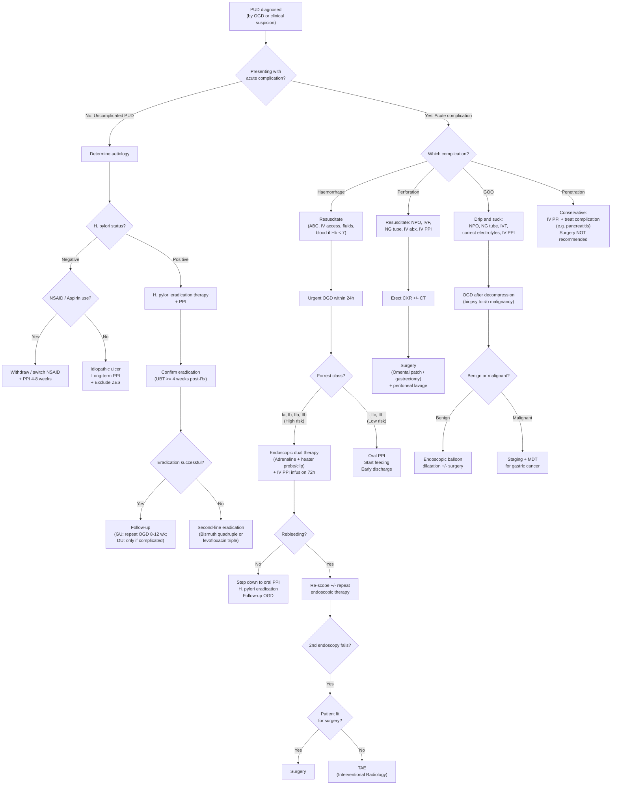
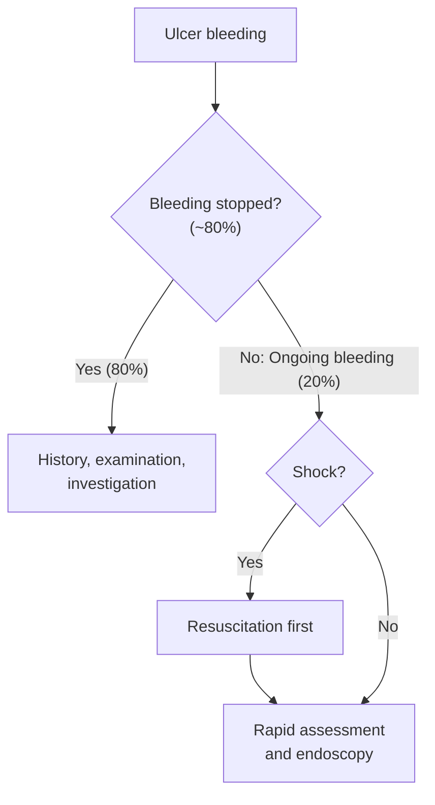

## Management of Peptic Ulcer Disease — Algorithm & Treatment Modalities

The management of PUD is best understood as a series of **concentric layers**, moving from the most common scenario (uncomplicated ulcer treated medically) outward to the rarest (surgical emergency). At every step, the question is: **What is the aetiology, and what is the complication?** — because treatment is entirely driven by these two answers.

---

### 1. Master Management Algorithm

---

### 2. Management of Uncomplicated PUD

#### 2.1 General Principles

The three pillars of uncomplicated PUD management are:
1. **Remove the cause** (*H. pylori* eradication, NSAID withdrawal)
2. **Heal the ulcer** (acid suppression with PPI)
3. **Prevent recurrence** (confirm eradication, prophylaxis if NSAIDs cannot be stopped)

#### 2.2 Supportive Measures [2]

**A. Medication Alteration**

- ***NSAID users*** [2]:
  - **Switch to less ulcerogenic NSAIDs or COX-2 selective inhibitors** — COX-2 inhibitors (e.g., celecoxib) spare COX-1-mediated prostaglandin synthesis in the gastric mucosa, preserving the mucosal barrier. Why does this work? Because the ulcer is caused by systemic COX-1 inhibition reducing PGE₂; removing the offending agent allows prostaglandin levels to recover.
  - **Withdraw NSAIDs during PPI treatment** — healing is dramatically impaired if the causative agent continues [2].
  
- ***Aspirin users*** [2]:
  - ***Bleeding peptic ulcer: Resume aspirin with PPI treatment once haemostasis is secured*** — the rationale is to **minimise cardiovascular risk**. Studies show that withholding aspirin for > 7 days after ulcer haemostasis is associated with increased cardiovascular events (MI, stroke) without significant benefit in reducing rebleeding [2][3].
  - ***Non-bleeding peptic ulcer: Continue aspirin with PPI treatment*** — no need to stop aspirin if the ulcer is not actively bleeding [2].

- ***Antithrombotic management principles*** [3]:
  - ***Withhold all antithrombotics stat +/- reversal agents*** in acute bleeding
  - ***Resume aspirin after OGD; clopidogrel 5–7 days later*** [3] — aspirin is resumed early because its cardiovascular benefit outweighs the small rebleeding risk once endoscopic haemostasis is achieved.

<Callout title="Aspirin in Bleeding PUD — Don't Be Afraid to Restart" type="error">
A common mistake is to permanently stop aspirin after a bleeding ulcer. This **increases mortality** from cardiovascular events. The correct approach is: achieve haemostasis → restart aspirin with PPI cover as soon as possible (typically within 3–7 days). The PPI provides the ulcer protection while aspirin provides the cardiovascular protection [2][3].
</Callout>

**B. Lifestyle Modification** [2]
- **Smoking cessation** — smoking impairs mucosal blood flow, reduces bicarbonate secretion, promotes duodenogastric reflux, and delays ulcer healing. It also increases recurrence rates even after successful *H. pylori* eradication.
- **Limit alcohol intake** — alcohol is a direct mucosal irritant and stimulates acid secretion.

---

#### 2.3 Medical Treatment — Acid Suppression

##### Proton Pump Inhibitors (PPIs) — First-Line Acid Suppression

PPIs are the backbone of PUD treatment. Understanding their mechanism from first principles:

**Mechanism**: PPIs are **prodrugs** that are absorbed in the small intestine, enter the systemic circulation, and accumulate in the acidic canaliculi of parietal cells (the only cells with pH < 2 in the body). In this acidic environment, they are converted to their active form (a sulphenamide), which **irreversibly binds to and inhibits the H⁺/K⁺-ATPase (proton pump)** — the final common pathway of acid secretion, regardless of what stimulus triggered it (gastrin, histamine, or acetylcholine).

- **"Proton pump"** → the H⁺/K⁺-ATPase that pumps H⁺ into the gastric lumen in exchange for K⁺
- **"Inhibitor"** → irreversible covalent binding → acid secretion only returns when new proton pumps are synthesised (~24–48 hours)

**Why PPIs are superior to H₂ blockers**: H₂ receptor antagonists (e.g., ranitidine, famotidine) only block the **histamine-mediated** pathway of acid secretion. PPIs block the **final common pathway** regardless of stimulus → more complete and prolonged acid suppression.

| PPI | Dose for Ulcer Healing | Notes |
|:---|:---|:---|
| Omeprazole | 20 mg OD | First PPI developed |
| ***Esomeprazole*** | 20–40 mg OD | S-isomer of omeprazole; marginally better bioavailability |
| ***Pantoprazole*** | 40 mg OD | Available IV — ***used for IV PPI infusion*** (80 mg stat → 8 mg/h × 72h) [1][3] |
| Lansoprazole | 30 mg OD | — |
| Rabeprazole | 20 mg OD | Fastest onset; less dependent on CYP2C19 metabolism |

**Duration of PPI therapy:**
- **DU**: 4 weeks (8 weeks if large or complicated)
- **GU**: 8 weeks (because GU heal more slowly; also need to confirm healing on follow-up OGD)
- **NSAID-related ulcers**: 8 weeks (or longer if NSAID cannot be stopped)

**PPI side effects** (important for long-term use):
- ↑ Risk of *Clostridioides difficile* infection (acid suppression allows gut colonisation)
- ↑ Risk of community-acquired pneumonia (acid suppression allows oropharyngeal bacterial overgrowth → aspiration)
- ↓ Calcium and magnesium absorption → osteoporosis risk with long-term use
- Vitamin B12 deficiency (acid needed for B12 release from food proteins)
- Theoretical CYP2C19 interaction with clopidogrel (mainly omeprazole) — consider pantoprazole instead

##### H₂ Receptor Antagonists (H₂RAs)

- **Mechanism**: Competitive, reversible blockade of H₂ histamine receptors on parietal cells → ↓ histamine-stimulated acid secretion
- ***H₂ blocker and PPI hasten healing of ulcers*** [1]
- Less effective than PPIs; now used mainly as adjunct or when PPIs are contraindicated
- Examples: famotidine (preferred since ranitidine was withdrawn due to NDMA contamination)

##### Other Agents

| Agent | Mechanism | Use in PUD |
|:---|:---|:---|
| **Misoprostol** | Synthetic PGE₁ analogue → replaces NSAID-depleted prostaglandins → ↑ mucus, ↑ bicarbonate, ↑ mucosal blood flow, ↓ acid secretion | Prophylaxis of NSAID-induced ulcers. **Contraindicated in pregnancy** (uterotonic → can cause abortion) |
| **Sucralfate** | Polymerises in acidic pH → forms a viscous gel that binds to ulcer base → physical barrier against acid/pepsin | Rarely used now; useful in stress ulcer prophylaxis in ICU |
| **Bismuth subsalicylate/subcitrate** | Coats ulcer base + direct bactericidal activity against *H. pylori* + stimulates PG/bicarbonate secretion | Component of bismuth quadruple therapy |
| **Antacids** (aluminium/magnesium hydroxide) | Directly neutralise gastric acid | Symptomatic relief only; do NOT heal ulcers; Al causes constipation, Mg causes diarrhoea |

---

#### 2.4 Medical Treatment — *H. pylori* Eradication

This is the single most important treatment for *H. pylori*-positive PUD. Successful eradication reduces ulcer recurrence from ~80% to < 5% per year.

##### First-Line Regimens

**A. Standard PPI-Based Triple Therapy** (14 days)

| Component | Drug | Dose | Rationale |
|:---|:---|:---|:---|
| PPI | Omeprazole / Esomeprazole / etc. | Standard dose BD | ↑ Intragastric pH → improves antibiotic stability and efficacy (clarithromycin is degraded at low pH); ↑ *H. pylori* growth rate (replicating bacteria are more susceptible to antibiotics) |
| Antibiotic 1 | ***Amoxicillin*** | 1 g BD | Bactericidal; disrupts cell wall synthesis. Low resistance rates |
| Antibiotic 2 | ***Clarithromycin*** | 500 mg BD | Bacteriostatic (inhibits 50S ribosomal subunit → protein synthesis). Most potent anti-*H. pylori* antibiotic, but **resistance is rising** (20–30% in Hong Kong) |

**B. Bismuth Quadruple Therapy** (14 days) — preferred if clarithromycin resistance > 15% or as second-line

| Component | Drug | Dose | Rationale |
|:---|:---|:---|:---|
| PPI | Standard dose BD | — | Acid suppression |
| **Bismuth** | Bismuth subcitrate / subsalicylate | QDS | Direct bactericidal; coats ulcer; disrupts *H. pylori* cell membrane |
| **Metronidazole** | 400 mg TDS–QDS | Anaerobe-active; creates toxic free radicals within *H. pylori* |
| **Tetracycline** | 500 mg QDS | Inhibits 30S ribosome → protein synthesis; broad spectrum |

<Callout title="Choosing First-Line Therapy in Hong Kong">
In Hong Kong, clarithromycin resistance has risen to ~20–30%. Current guidelines therefore increasingly favour **bismuth quadruple therapy** as first-line, or recommend **susceptibility-guided therapy** where culture results are available. If clarithromycin resistance is < 15% in the local population, standard triple therapy remains acceptable. Always check local resistance data [2].
</Callout>

##### Second-Line Regimen (after first-line failure)

**Levofloxacin-based Triple Therapy** (14 days):
- PPI (standard dose BD) + Amoxicillin (1 g BD) + **Levofloxacin** (500 mg OD)
- Levofloxacin is a fluoroquinolone with high activity against Gram-negative bacilli including *H. pylori*, with lower resistance rates than clarithromycin in many populations

**Or**: If first-line was triple therapy → use bismuth quadruple therapy as second-line (and vice versa).

##### Third-Line / Salvage (after two failures)

- ***Bacterial culture with antibiotic sensitivity testing*** should be performed [2] — this is the **only** indication for culture in routine PUD management
- **Susceptibility-guided therapy** based on resistance patterns
- Consider rifabutin-based regimens (rifabutin + amoxicillin + PPI) as a last resort

##### Confirming Eradication [2]

- ***Urea breath test (UBT)*** is the preferred test for confirming eradication
- Performed **≥ 4 weeks after completing eradication therapy** AND **≥ 2 weeks after stopping PPI**
- Stool antigen test is an acceptable alternative
- Serology is **NOT** valid for confirming eradication (antibodies persist for months)

---

#### 2.5 Prevention of PUD by Aetiology [2]

This is a high-yield topic — the prevention strategy depends entirely on the underlying cause:

| Aetiology | Prevention Strategy | Key Points |
|:---|:---|:---|
| ***H. pylori ulcers*** | H. pylori eradication | ***Maintenance acid suppression with PPI is NOT necessary*** after successful eradication [2] — once the cause is removed, the ulcer does not recur |
| ***NSAID ulcers*** | **Review need for NSAIDs**; avoid in patients with high GI risk or prior complicated PUD; ***add PPI or misoprostol as prophylaxis*** with NSAIDs or **switch to COX-2 inhibitor** [2] | ***High GI risk*** defined as ≥ 2 of: age > 65, previous PUD, high-dose NSAIDs, concomitant aspirin/corticosteroids/anticoagulants [2] |
| ***Aspirin ulcers*** | **Review need for aspirin**; ***add PPI as prophylaxis*** with aspirin use [2] | PPI co-prescription is standard for all patients on aspirin with ANY additional GI risk factor |
| ***Idiopathic ulcers*** | ***Maintenance acid suppression therapy with PPI long-term*** [2] | Since no removable cause is identified, continuous PPI is needed to prevent recurrence |

<Callout title="H. pylori Ulcers Do NOT Need Maintenance PPI">
After successful *H. pylori* eradication, maintenance PPI is **unnecessary** [2]. The ulcer recurrence rate drops to < 5%/year. This distinguishes *H. pylori* ulcers from NSAID and idiopathic ulcers, where ongoing acid suppression is needed.
</Callout>

---

### 3. Management of Complicated PUD

#### 3.1 Haemorrhage — The Most Common and Deadly Complication

***Haemorrhage is the leading cause of death from peptic ulcer*** [3].

##### Step 1: Resuscitation [1][3][5]

This follows the **ABC approach** — treat the patient, not the endoscopy report:

- ***Airway***: Cuffed endotracheal (ET) tube + NG tube if massive haematemesis or impaired consciousness — to **prevent aspiration** [5]
- ***Breathing***: O₂ supplementation [5]
- ***Circulation*** [5]:
  - ***NPO***
  - ***2 large-bore IV cannulae*** (at least 16G, preferably 14G — in the antecubital fossae)
  - ***IV normal saline 2L fast run*** to maintain BP/pulse + urine output
  - ***Blood transfusion***: **Hb < 7 g/dL in low-risk patients; Hb < 9 g/dL in high-risk patients** (e.g. elderly, CAD) [5]
  - ***Closely monitor pulse, BP, I/O*** [5]
  - ***Withhold anticoagulants and antiplatelets*** (balance thrombotic risk when considering reversal) [3][5]
  - FFP for coagulopathy; platelets for thrombocytopenia [5]

***Ulcer bleed stops spontaneously in approximately 70–80%*** of cases [1]. The key is to **identify patients in shock** and those with **ongoing bleeding** [1].

##### Step 2: Pre-Endoscopy Management [3][5]

- Bloods: CBC, clotting, cross-match, LRFT, VBG
- ***Pre-endoscopic PPI***: ***IV esomeprazole 80 mg stat → 8 mg/h infusion until OGD*** — however, HO handbook states this is ***only if early endoscopy cannot be arranged*** [5]. The rationale is that raising intragastric pH stabilises any forming clot, potentially downgrading the Forrest class before endoscopy.
- Risk stratification: Glasgow-Blatchford Score (pre-endoscopy) / Rockall Score (post-endoscopy) [5]
- ***Arrange early upper endoscopy within 24 hours after initial stabilisation*** [5]

##### Step 3: Endoscopic Therapy [1][2][3]

***Acute treatment depends on diagnosis → bleeding peptic ulcer*** [1]:

**Forrest Class determines management:**

| Risk | Forrest Class | Management |
|:---|:---|:---|
| ***High risk*** | ***Ia (spurting), Ib (oozing), IIa (visible vessel), IIb (adherent clot)*** | ***Endoscopic dual therapy + IV PPI infusion*** |
| ***Low risk*** | ***IIc (flat pigmented spot), III (clean base)*** | ***Oral PPI; clean base → start feeding, early discharge*** [1] |

***Therapeutic endoscopy modalities*** [1][3]:

| Method | Modality | Mechanism |
|:---|:---|:---|
| ***Injection method*** | ***Adrenaline 1:10,000*** [1][3] | ***Tamponade*** (volume effect compresses vessel) + ***vasoconstriction*** (α₁-adrenergic) + ***platelet aggregation*** (promotes haemostasis). **Must NOT be used alone** — only provides temporary haemostasis; must combine with thermal or mechanical method |
| ***Thermal method*** | ***Heater probe*** [1][3] | ***Coaptive effect***: firm **pressure** applied to the vessel wall + **heat** delivered simultaneously → coagulates and seals the vessel. The pressure component is key — it apposes the vessel walls before the heat fuses them |
| ***Mechanical method*** | ***Metal clip*** [1][3] | Physically grasps and occludes the bleeding vessel. More **prolonged action** than thermal methods. Particularly good for discrete visible vessels |
| ***Mechanical method*** | ***Haemospray*** [3] | Inorganic powder that acts as a ***mechanical barrier*** + ***absorbent*** (absorbs water from blood → concentrates clotting factors → promotes haemostasis) — the "雲南白藥 principle." Used for **large-area oozing** where clips or heater probe are impractical |

***Dual therapy*** (adrenaline injection + heater probe or clip) is the standard — ***injection therapy should NOT be used as monotherapy*** since it is associated with a high rate of recurrent bleeding compared to other modalities [2][3].

##### Step 4: Post-OGD Management [3]

- ***Post-OGD PPI infusion: pantoprazole/esomeprazole 80 mg stat, then 8 mg/h for 72 hours*** [3]
  - ***Indicated for endoscopic treatment of Forrest Class Ia, Ib, IIa, IIb ulcer bleeding*** [3]
  - Rationale: ***higher pH stabilises clot since platelet function depends on normal pH*** — platelet aggregation is abolished at pH < 5.4; fibrin clots dissolve at pH < 4 (pepsin-mediated fibrinolysis) [3]
  - ***NOT efficacious for variceal bleeding*** — only give oral PPI to reduce post-banding ulcers [3]
- Post-endoscopic monitoring of Hb count to identify rebleeding [2]
- Signs of rebleeding: ***haematemesis, fresh melaena, tachycardia, falling Hb trend, blood in NG tube*** [2]
- After stabilisation: *H. pylori* eradication + review NSAID use

##### Step 5: When Endoscopy Fails → Surgery or TAE

***Indications for surgery for bleeding ulcer*** [1][2]:

- ***Therapeutic endoscopist not available*** [1]
- ***Massive bleeding*** (cannot visualise bleeding point) [1]
- ***Failed endoscopic therapy*** [1]
- ***Rebleed after endoscopic therapy*** [1]
- Haemodynamic instability despite vigorous fluid resuscitation [2]
- Continuous slow bleeding with transfusion > 3 units per day [2]

***Surgical approach*** [1][3]:

> ***Surgery = Plication of bleeder + additional procedure*** [1]

The "plication of bleeder" means **suture ligation of the bleeding vessel** (e.g., GDA in posterior DU). The "additional procedure" depends on the ulcer type and surgeon's judgment:

| ***Type of ulcer*** | ***Choice of additional procedure*** [1] |
|:---|:---|
| ***DU*** | ***V + P*** (truncal **Vagotomy** + **Pyloroplasty**) [1] — vagotomy reduces acid secretion; pyloroplasty is needed because vagotomy paralyses the pylorus (loss of vagal-mediated pyloric relaxation) → without pyloroplasty, the stomach cannot empty |
| ***GU*** | ***Partial gastrectomy*** [1] — because any gastric ulcer may harbour malignancy, the ulcer must be resected (not just over-sewn) [3] |

***Factors determining the choice of additional procedure*** [1]:
- ***Condition of patient*** (haemodynamic stability, comorbidities)
- ***Experience of surgeon***
- ***Type of ulcer*** (DU vs GU)

***Transcatheter Arterial Embolisation (TAE)*** [2][3]:
- Alternative to surgery when the patient is **unfit for surgery** or as a bridge
- Interventional radiology performs angiography of the coeliac trunk and SMA → identifies contrast extravasation → selective cannulation of the bleeding vessel → angiographic coiling from distal to proximal until extravasation ceases [2]
- ***Equally effective as surgery in patients who failed therapeutic endoscopy*** and associated with fewer complications [2]
- Reduces need for surgery without increasing overall mortality [2]
- ***Limitations of endoscopic haemostasis*** that trigger surgical/TAE referral [3]:
  - ***Massive bleeding obscuring view***
  - ***Large bleeding artery ( > 3.2 mm)***
  - ***Large ulcer ( > 2 cm)*** [3]

---

#### 3.2 Perforation

***Most common site: anterior wall of D1*** [3].

##### Management Algorithm [3]

**Step 1: Resuscitation**
- ***NPO***
- ***IV fluids***
- ***NG tube decompression*** (may have co-existing GOO) [3]
- ***IV broad-spectrum antibiotics*** (e.g., augmentin) — to cover the bacterial peritonitis that develops within 6 hours [3]
- ***IV PPI / H₂ blocker*** (suppress acid production, limit ongoing chemical peritonitis) [3]

**Step 2: Surgery** [3]

***Treatment options: H. pylori eradication + surgery + peritoneal lavage ( > 6L NS) after repair*** [3]

| Ulcer Size/Type | Surgical Approach |
|:---|:---|
| ***Small DU or GU ( < 2 cm)*** | ***Laparoscopic or open (Graham) omental patch repair*** [3]. The omentum is a "biological plug" — a pedicled flap of omentum is sewn over the perforation to seal it. Alternatives if omentum is not available: falciform ligament, jejunal serosal patch [3] |
| ***Large DU*** | ***Distal gastrectomy + Billroth II reconstruction*** +/- controlled duodenostomy (especially if difficult duodenal stump) [3] |
| ***Large GU*** | ***Wedge excision or partial gastrectomy + Billroth II reconstruction*** [3] — must resect because any GU could be malignant |

***Biopsy ulcer edge for ALL gastric ulcers to rule out malignancy*** [3]

**Indications to convert laparoscopic to open** [3]:
- ***Haemodynamically unstable*** → shorter operative time with open
- ***Large defect ( > 1 cm)*** → difficult laparoscopic suturing
- ***Gross contamination*** → limited laparoscopic peritoneal lavage capacity

**Post-operative management** [3]:
- NPO until no signs of leakage and return of bowel function
- Complete full course of antibiotics
- Continue PPI until follow-up OGD
- ***FU OGD 6–8 weeks after surgery*** to confirm healing and check *H. pylori* status [3]

**Prognosis: Boey's Score** (3 points) [3]:

| Risk Factor | Points |
|:---|:---|
| Time from perforation to admission > 24 hours | 1 |
| Pre-op SBP < 100 mmHg | 1 |
| ≥ 1 systemic illness (heart disease, liver disease, renal disease, DM) | 1 |
| **Mortality**: Score 0 = 0%, Score 1 = 10%, Score 2 = 45.5%, Score 3 = 100% | |

---

#### 3.3 Gastric Outlet Obstruction (GOO)

GOO results from **chronic scarring and fibrosis at the pylorus/D1** from repeated ulcer-healing cycles, or from acute oedema and spasm during active ulceration. Prolonged obstruction can lead to **gastric atony** (the dilated stomach loses its contractile ability) [2].

***GOO is malignant until proven otherwise*** — 80% malignant (gastric cancer is the most common cause), 20% benign (PUD-related pyloric stenosis is the 2nd most common overall cause) [3].

##### Management [2][3]

**Step 1: Medical ("Drip and Suck")** [2][3]
- ***NPO***
- ***Nasogastric (NG) tube*** — decompress the stomach, relieve vomiting
- ***Fluid resuscitation***
- ***Correction of electrolyte abnormality*** [2]:
  - ***Normal saline + KCl*** — prolonged vomiting causes ***hypochloraemic hypokalaemic metabolic alkalosis*** [2]
  - Why NS specifically? Because this is a **chloride-responsive alkalosis** — the kidneys need chloride to excrete excess bicarbonate; until Cl⁻ is replaced, the alkalosis cannot correct
- ***IV PPI*** — antisecretory agents remain the mainstay of initial treatment (e.g., ***pantoprazole***) [2]

**Step 2: OGD after decompression** [3]
- Once the stomach is adequately decompressed → OGD to **biopsy the pylorus** and establish whether GOO is benign (PUD) or malignant [3]

**Step 3: Definitive Treatment** [2][3]

| Cause | Treatment |
|:---|:---|
| **Benign (PUD-related)** | ***Endoscopic balloon dilatation*** [2] +/- duodenal stenting; if fails or recurs → ***surgery*** |
| **Malignant** | Curative: treat underlying CA; Palliative: surgical bypass (gastrojejunostomy) or endoscopic self-expandable metal stent (SEMS) [3] |

**Surgical options for benign GOO** [2][3]:
- ***GU***: Antrectomy with Billroth I/II reconstruction [2]
- ***DU***: Truncal vagotomy + Antrectomy with Billroth I/II reconstruction [2]
- Alternative: Bypass (gastrojejunostomy), pyloroplasty [3]

---

#### 3.4 Penetration [2]

- **Penetration** = ulcer erodes through the bowel wall **without** free perforation — the adjacent organ "seals" the defect, preventing spillage into the peritoneal cavity [2]
- Occurs in descending order of frequency: ***Pancreas > Lesser omentum > Biliary tract > Liver > Greater omentum > Mesocolon > Colon > Vascular structures*** [2]
- Leads to complications such as **pancreatitis** (most common — posterior DU penetrating into pancreas) or **cholangitis**
- Clinical clue: pain becomes **more intense, longer-lasting, localised to the back**, and is **NOT relieved by food or antacids** (unlike uncomplicated DU) [2]
- ***Surgical treatment is NOT recommended*** [2] — manage conservatively with IV PPI and treat the secondary complication (e.g., pancreatitis). Surgery is only considered if the penetration leads to uncontrollable haemorrhage or fistula formation.

---

### 4. Indications for Elective Surgery in PUD [2][3]

Surgery is ***rarely required now*** [3] due to effective medical therapy, but indications persist:

| Indication | Rationale |
|:---|:---|
| ***Complicated PUD*** (haemorrhage, perforation, GOO) | Emergency or semi-elective depending on clinical scenario [2][3] |
| ***Refractory to medical treatment*** | ***Zollinger-Ellison syndrome (gastrinoma) should be excluded before performing elective surgery for PUD*** [2] — ZES causes refractory ulcers but is treated medically (high-dose PPI) or by tumour resection, not by acid-reducing surgery |
| ***Suspicious of malignancy*** | ***Non-healing GU after 12 weeks of medical therapy indicates need for elective surgery even if biopsy is benign*** [2] — due to sampling error risk |

### 5. Surgical Options for PUD — Summary Table [3]

| Ulcer Type | Surgical Options | Principle |
|:---|:---|:---|
| **DU** (acid reduction) | ***Highly selective vagotomy (HSV)***: nerve of Latarjet preserved, but technically difficult | Denervate parietal cell mass only; preserve antral motility → no drainage needed |
| | ***Truncal vagotomy + drainage (pyloroplasty or gastrojejunostomy)***: nerve of Latarjet sacrificed | Denervate entire stomach → pyloric dysfunction → must add drainage procedure |
| | ***Gastrectomy (antrectomy / distal gastrectomy) + reconstruction (Billroth II > Roux-en-Y)*** | Remove antral G cells (↓ gastrin) + acid-secreting mucosa |
| **GU** (prevent malignancy) | ***Type I***: distal gastrectomy + Billroth II | Resect ulcer to exclude/treat possible malignancy |
| | ***Type II / III***: truncal vagotomy + antrectomy + Billroth II | Acid-hypersecretory types — need acid reduction + ulcer resection |
| | ***Type IV***: subtotal gastrectomy (extending to ulcer) + Billroth I / II / Roux-en-Y | High lesser curvature ulcer near GOJ — technically challenging, requires extensive resection |

**Reconstruction Types (brief explanation):**
- **Billroth I** (gastroduodenostomy): stomach remnant anastomosed directly to duodenum — most physiological, but limited by tension if too much stomach is resected
- **Billroth II** (gastrojejunostomy): stomach remnant anastomosed to jejunum (side-to-side) — more versatile, less anastomotic tension; preferred for most PUD surgery [3]
- **Roux-en-Y**: Y-shaped jejunal limb; bile is diverted away from the gastric remnant → reduces bile reflux gastritis. Used when bile reflux is a concern (e.g., Type IV GU, revision surgery)

---

### 6. Post-Gastrectomy Syndromes (Important for Exams)

Understanding these complications is essential because they explain why surgery is a last resort:

| Syndrome | Mechanism | Features |
|:---|:---|:---|
| **Dumping syndrome** (early) | Rapid emptying of hyperosmolar gastric contents into small bowel → fluid shifts into the lumen → hypovolaemia + bowel distension | 15–30 min after meals: nausea, cramping, diarrhoea, dizziness, diaphoresis, tachycardia |
| **Dumping syndrome** (late) | Rapid glucose absorption → exaggerated insulin release → reactive hypoglycaemia | 1–3 hours after meals: tremor, diaphoresis, confusion |
| **Bile reflux gastritis** (alkaline reflux) | Loss of pyloric sphincter → bile refluxes into gastric remnant → chronic gastritis | Burning epigastric pain, bilious vomiting, NOT relieved by antacids. Roux-en-Y revision may be needed |
| **Afferent loop syndrome** (Billroth II) | Obstruction/kinking of the afferent limb → bile/pancreatic juice accumulates → sudden decompression | Sudden bilious vomiting that relieves pain; abdominal distension |
| **Nutritional deficiencies** | Loss of absorptive surface + loss of intrinsic factor (parietal cells) + reduced mixing | Iron deficiency (reduced acid → reduced Fe²⁺ absorption), B12 deficiency, calcium/vitamin D malabsorption → osteoporosis |
| **Marginal (stomal) ulcer** | Ulcer at the surgical anastomotic site | Recurrent epigastric pain; check for retained antrum, incomplete vagotomy, or *H. pylori* |

---

<Callout title="High Yield Summary">

1. **Uncomplicated PUD management = remove the cause + heal the ulcer + prevent recurrence.**
2. ***H. pylori* eradication** is the most important treatment for *H. pylori*-positive PUD. Standard triple therapy (PPI + amoxicillin + clarithromycin × 14 days) or bismuth quadruple therapy. Confirm eradication with UBT ≥ 4 weeks post-Rx.
3. ***H. pylori* ulcers do NOT need maintenance PPI** after successful eradication [2]. NSAID and idiopathic ulcers DO.
4. **Aspirin in bleeding PUD**: resume with PPI cover once haemostasis secured — do NOT permanently stop [2][3].
5. ***Ulcer bleed stops spontaneously in ~70–80%*** [1]. Identify shock and ongoing bleeding.
6. **Endoscopic dual therapy** (adrenaline + heater probe/clip) for Forrest Ia, Ib, IIa, IIb. ***Injection therapy alone is NOT sufficient*** [2][3].
7. ***Post-OGD IV PPI infusion*** (80 mg stat → 8 mg/h × 72h) for high-risk ulcer bleeding. NOT for varices [3].
8. ***Clean base (Forrest III): start feeding, early discharge*** [1].
9. ***Surgery for bleeding ulcer***: plication of bleeder + additional procedure. ***DU: V+P; GU: partial gastrectomy*** [1].
10. **TAE** is an alternative to surgery if patient is unfit; equally effective with fewer complications [2].
11. ***Perforation***: Small — omental patch; Large DU — gastrectomy + Billroth II; Large GU — wedge excision/gastrectomy. **Always biopsy GU edges** [3].
12. ***GOO***: Drip and suck → OGD + biopsy → malignant until proven otherwise [3].
13. ***Penetration***: surgery NOT recommended; treat conservatively [2].
14. **Elective surgery indications**: complicated PUD, refractory to medical Rx (exclude ZES first), non-healing GU > 12 weeks [2][3].
15. **Boey's Score** for PPU prognosis: delay > 24h, SBP < 100, systemic illness (0–3 points) [3].

</Callout>

---

<ActiveRecallQuiz
  title="Active Recall - PUD Management"
  items={[
    {
      question: "A patient has a bleeding duodenal ulcer successfully treated endoscopically. They were on aspirin for secondary prevention of MI. When should aspirin be resumed and why?",
      markscheme: "Resume aspirin with PPI cover once haemostasis is secured (typically within 3-7 days). Withholding aspirin beyond 7 days significantly increases cardiovascular events (MI, stroke) without meaningfully reducing rebleeding risk. PPI provides ulcer protection while aspirin provides cardiovascular protection."
    },
    {
      question: "Explain the mechanism of post-OGD IV PPI infusion (80mg stat then 8mg/h for 72 hours) in bleeding peptic ulcer. For which Forrest classes is it indicated?",
      markscheme: "High-dose IV PPI maintains intragastric pH above 6, which is critical because platelet aggregation is abolished below pH 5.4 and fibrin clots dissolve below pH 4 due to pepsin-mediated fibrinolysis. By keeping pH above 6, the haemostatic clot over the bleeding vessel is stabilised. Indicated for Forrest Class Ia (spurting), Ib (oozing), IIa (visible vessel), and IIb (adherent clot) ulcer bleeding. NOT indicated for variceal bleeding."
    },
    {
      question: "What are the indications for surgery in a bleeding peptic ulcer, and what is the choice of additional procedure for DU vs GU?",
      markscheme: "Indications: therapeutic endoscopist not available, massive bleeding, failed endoscopic therapy, rebleed after endoscopic therapy, haemodynamic instability despite resuscitation, or continuous slow bleeding needing more than 3 units per day. DU: vagotomy plus pyloroplasty (V+P). GU: partial gastrectomy (because gastric ulcers may harbour malignancy)."
    },
    {
      question: "After successful H. pylori eradication for a duodenal ulcer, does the patient need maintenance PPI? What about for an idiopathic ulcer?",
      markscheme: "H. pylori ulcer: maintenance PPI is NOT necessary after successful eradication, because removing the cause reduces annual recurrence to less than 5%. Idiopathic ulcer: long-term maintenance PPI IS necessary because no removable cause has been identified and the ulcer will recur without ongoing acid suppression."
    },
    {
      question: "A patient with a perforated duodenal ulcer (small, less than 2cm) undergoes laparoscopic repair. Describe the surgical procedure and the required post-operative follow-up.",
      markscheme: "Procedure: Graham omental patch repair (pedicled omentum sewn over the perforation) plus peritoneal lavage with more than 6 litres of normal saline plus H. pylori eradication therapy. Post-op: NPO until no signs of leakage and return of bowel function, complete full course of antibiotics, continue PPI until follow-up OGD, and perform follow-up OGD at 6-8 weeks to confirm healing and check H. pylori status. Biopsy ulcer edge if gastric ulcer."
    },
    {
      question: "What is the Boey Score for perforated peptic ulcer? A patient presents 30 hours after perforation with SBP 85 mmHg and diabetes. What is their score and predicted mortality?",
      markscheme: "Boey Score has 3 components, 1 point each: time from perforation to admission greater than 24 hours (1 point), pre-op SBP less than 100 mmHg (1 point), any systemic illness including heart disease, liver disease, renal disease, or DM (1 point). This patient scores 3 out of 3 (delayed presentation + hypotension + DM). Predicted mortality is 100%."
    }
  ]}
/>

## References

[1] Lecture slides: GC 198. Profuse vomiting of fresh blood and in shock severe upper GI bleeding.pdf (p18 — ulcer bleed stops spontaneously 70–80%; p19 — general guideline algorithm; p23 — acute treatment depends on diagnosis; p24 — bleeding peptic ulcer: clean base, therapeutic endoscopy, PPI infusion; p28 — surgery for bleeding ulcer: indications; p29 — choice of additional procedure: DU V+P, GU partial gastrectomy)
[2] Senior notes: felixlai.md (PUD treatment pp. 391–398 — indications for surgery, supportive treatment, medical treatment, H. pylori eradication, complications management, prevention; UGIB treatment pp. 340–341 — general management, medications, surgery)
[3] Senior notes: maxim.md (Benign diseases of stomach — PUD surgical management, PUD complications pp. 127–131; UGIB therapeutic endoscopy — dual therapy, PPI infusion, antithrombotic management p. 53; Perforation — Boey's score, post-op management pp. 128–130)
[5] Senior notes: maxim.md (UGIB initial management — resuscitation, pre-endoscopy management, risk stratification pp. 52–53)
