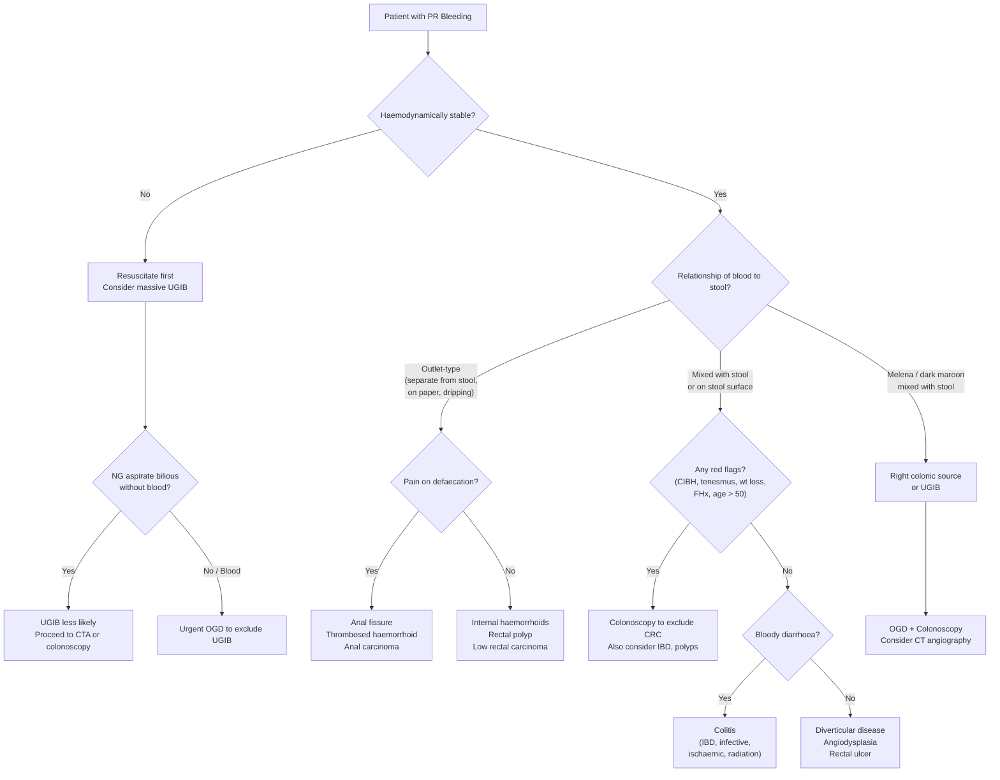
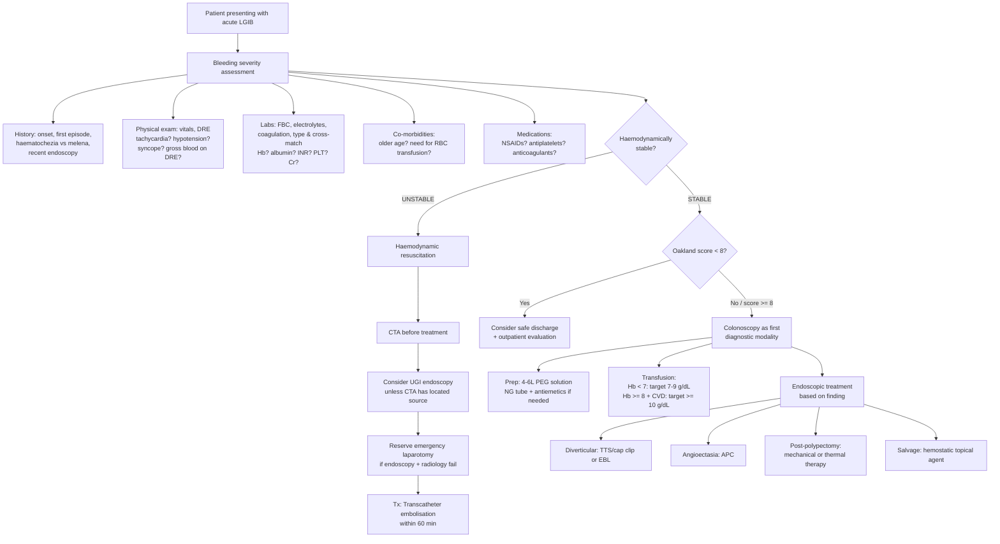

## Differential Diagnosis of Per Rectal Bleeding

The differential diagnosis of PR bleeding is one of those topics where a structured approach pays enormous dividends. You need a mental framework — think anatomically from bottom (anus) upwards, or think by pathological mechanism (anatomical/structural, vascular, inflammatory, neoplastic, iatrogenic). Both work; the key is being systematic so you never miss a diagnosis.

Let me walk you through this the way I'd think on a ward round: "Where is the blood coming from, and what's the mechanism?"

---

### 1. Organising Framework

The causes can be grouped by **anatomical level** and by **pathological mechanism**. The following table integrates both, and I've included approximate proportions to give you a sense of the clinical landscape [1][2][9].

| Anatomical Level | Category | Cause | Approximate Proportion of LGIB |
|---|---|---|---|
| **Upper GI** (proximal to lig. of Treitz) | — | ***Peptic ulcer, variceal bleed*** | ***< 10%*** (but must always consider!) |
| **Small bowel** | Anatomical | ***Meckel's diverticulum***, jejunoileal diverticula | ~5% total |
| | Vascular | Angiodysplasia, haemangioma | |
| | Neoplastic | Small bowel tumours (GIST, carcinoid, lymphoma) | |
| | Inflammatory | Crohn's disease, TB enteritis | |
| | Drug-related | ***NSAID-induced small bowel ulcers*** | |
| | Vascular | ***Aortoenteric fistula*** | |
| **Large bowel** (colon) | Anatomical | ***Diverticular bleeding (17–40%)*** | Vast majority |
| | Vascular | ***Angiodysplasia (2–30%)*** | |
| | Neoplastic | ***Colorectal carcinoma, large polyps, post-polypectomy bleeding*** | 7–33% |
| | Inflammatory | ***IBD (UC > Crohn's)***, ***infective colitis*** (C. diff, CMV, amoebic, TB), ***ischaemic colitis***, ***radiation proctocolitis*** | 9–11% |
| **Anorectal** | Structural | ***Haemorrhoids***, ***anal fissure***, rectal prolapse | ~10% |
| | Vascular | ***Rectal varices*** (portal HTN) | |
| | Neoplastic | ***Anal carcinoma*** | |
| | Ulcerative | ***Rectal ulcer (acute haemorrhagic)*** | |

> ***Items marked with * can present with heavy bleeding*** [2]

<Callout title="Never Forget Upper GI Bleeding" type="error">
***Up to 10–15% of patients presenting with apparent haematochezia actually have a massive upper GI source*** [2][9]. In any haemodynamically unstable patient with PR bleeding, you MUST consider UGI bleeding and have a low threshold for upper endoscopy (OGD) or at least NG tube aspiration (bile-stained aspirate without blood → UGI bleed less likely). This is perhaps the single most important point in the differential diagnosis of PR bleeding.
</Callout>

---

### 2. Differential Diagnosis Decision Flowchart

The following mermaid diagram walks through the clinical reasoning when a patient presents with PR bleeding, helping you narrow the differential based on key discriminating features:

---

### 3. Detailed Differential Diagnosis by Cause

I'm going to walk through each differential systematically, focusing on the **distinguishing features** that help you tell them apart at the bedside. Think of this as "What would make me suspect Diagnosis X over Diagnosis Y?"

#### 3.1 Anorectal Causes

##### 3.1.1 Haemorrhoids

- ***Fresh outlet-type bleed, perianal mass / pain, constipation, risk factors (e.g. pregnancy)*** [3]
- **Distinguishing features:** Blood is bright red, drips into toilet bowl or stains tissue paper, typically occurs *during or immediately after* defaecation. Internal haemorrhoids → painless; thrombosed external → painful blue/purple perianal mass [3][9]
- **Why it bleeds:** Engorgement of anal vascular cushions → arterial bleeding from the arteriolar component of the cushion (this is why the blood is bright red, not dark venous blood) [3]
- **Trap:** Haemorrhoids are so common (4.4% prevalence) that they may coexist with a more sinister pathology. ***Never attribute PR bleeding solely to haemorrhoids without excluding other sources, especially in patients with red flags*** [1][3]

##### 3.1.2 Anal Fissure

- ***History of constipation; severe sharp pain upon defecation*** [9]
- **Distinguishing features:** The key discriminator is **pain** — tearing, burning pain that occurs during and may persist for hours after defaecation. Blood is typically a small amount, bright red, on paper or stool surface [1]
- **Why it hurts so much:** The tear is below the dentate line → somatic innervation (inferior rectal nerve) → exquisite pain. Internal sphincter spasm perpetuates the cycle [1]
- **Typical vs atypical:** Single posterior midline fissure = typical/primary. Multiple, lateral, or anterior fissures → think secondary causes (Crohn's, TB, HIV, anal SCC) [1]

##### 3.1.3 Anal Carcinoma

- ***Presented with bleeding, pain and anal mass*** [5]
- ***Risk factors: anal intercourse, sexually transmitted diseases, infection with HPV*** [5]
- **Distinguishing features:** Persistent, progressive symptoms. A palpable mass on DRE. Inguinal lymphadenopathy (lymphatic drainage below dentate line → superficial inguinal LN). Usually in patients with risk factors (HPV, HIV, immunosuppression) [3][5]

##### 3.1.4 Rectal Ulcer (Acute Haemorrhagic)

- ***More common in Asia; elderly, critically ill, bedridden patients*** [5]
- ***Sudden severe painless bleeding ± shock*** [5]
- **Distinguishing features:** The clinical context is key — this is a patient in ICU or nursing home, not an ambulatory outpatient. Diagnosis made by ***bedside proctoscopy*** revealing a bleeding ulcer [5]
- Also consider **solitary rectal ulcer syndrome (SRUS)** — associated with rectal prolapse and chronic straining; presents with mucus, blood, and tenesmus

##### 3.1.5 Rectal Varices

- Due to ***portal hypertension*** → portosystemic shunt between superior and inferior rectal veins [2]
- **Distinguishing features:** Clinical context of **chronic liver disease** (jaundice, spider naevi, ascites, splenomegaly). ***Often presents with severe bleeding*** [2]. Must differentiate from haemorrhoids — rectal varices are submucosal venous channels in the rectum proper, whereas haemorrhoids are vascular cushions in the anal canal
- **Why it bleeds:** High portal pressure → distension of collateral veins → thin-walled varices → rupture

##### 3.1.6 Rectal Prolapse

- Prolapsing mass with **concentric circular folds** (cf. haemorrhoids which have radial folds)
- Can cause PR bleeding from mucosal trauma/ulceration
- Usually in ***elderly women*** with pelvic floor dysfunction [1]

---

#### 3.2 Colonic Causes

##### 3.2.1 Diverticular Bleeding

- ***Painless, usually profuse haematochezia (not chronic)*** [2][9]
- ***DDx: angiodysplasia, severe colitis, rectal ulcer, small bowel bleeding, UGIB*** [8]
- **Distinguishing features:** Sudden onset of painless, often profuse bleeding in an elderly patient. No preceding change in bowel habit, no constitutional symptoms, no fever (diverticular bleeding ≠ diverticulitis) [1][2]
- Blood may be ***dark/maroon-coloured if right-sided*** (common in Asia) ***or bright red if left-sided*** [1][9]
- ***Bleeding stops spontaneously in 80–85%*** but ***rebleeding ~20–30%*** [2][5][8]
- ***~17% of patients with diverticulosis*** will bleed [2][8]
- **Key differentiator from angiodysplasia:** Diverticular bleeding is **arterial** (from ruptured vasa recta) → tends to be **more profuse**. Angiodysplasia is **venous** → tends to be **less severe but more intermittent** [1][2]

<Callout title="Diverticular Bleeding vs Diverticulitis">
***Diverticular bleeding and diverticulitis rarely coexist*** [9]. Bleeding = arterial (vasa recta rupture into diverticulum). Diverticulitis = obstruction by faecolith → bacterial overgrowth → inflammation. A patient presenting with PR bleeding + fever + LLQ/RLQ pain + leucocytosis is more likely to have diverticulitis (which may cause minor bleeding) or another diagnosis, not "diverticular bleeding" in the classic sense.
</Callout>

##### 3.2.2 Angiodysplasia

- ***Usually in elderly, may be associated with vascular malformations (e.g. HHT) and aortic stenosis*** [2][9]
- ***Painless, less severe than diverticular but tends to be intermittent*** [2][9]
- **Distinguishing features:** Recurrent episodes of painless bleeding in an elderly patient; often presents as **occult bleeding** with iron-deficiency anaemia and FOBT +ve rather than massive haematochezia [1]
- **Associations to look for:**
  - ***Aortic stenosis (Heyde syndrome)*** — acquired type 2A vWD from shear-induced degradation of high-MW vWF multimers across the stenotic valve [2][3]
  - ***Hereditary Haemorrhagic Telangiectasia (Osler-Weber-Rendu)*** — look for telangiectasias on lips, oral mucosa, fingertips [2]
  - ***ESRD, von Willebrand disease*** [3]
- **Colonoscopy appearance:** ***cherry red spots*** [3]
- **Angiography appearance:** ***"mother-in-law phenomenon"*** (early filling, delayed emptying — the lesion fills quickly and empties slowly, like a mother-in-law who comes early and stays late) [3]

##### 3.2.3 Colorectal Carcinoma (CRC)

- ***> 50y, male, smoker, FHx, Hx of IBD, polyps and colorectal CA*** [2][9]
- ***Alternating diarrhoea and constipation, pencil-thin stools, tenesmus*** [2][9]
- ***Loss of appetite, loss of weight, malaise*** [2][9]
- ***Intractable pain, jaundice/LUQ pain, dyspnoea, bone pain*** (metastatic features) [9]
- **Distinguishing features:** PR bleeding that is **low-grade and intermittent** (not massive and acute), associated with **progressive** change in bowel habit and constitutional symptoms [2]. May present with iron-deficiency anaemia or FOBT +ve only. **This is the one you must not miss** [2][9]

**Right-sided vs Left-sided CRC — different presentations:**

| Feature | ***Right (proximal) colon*** | ***Left (distal) colon / Rectosigmoid*** |
|---|---|---|
| Bleeding | ***Occult bleeding → iron-deficiency anaemia*** (4× higher mean daily blood loss) | ***Haematochezia with altered blood*** |
| Bowel habit | ***Less commonly changes*** (liquid stools, spacious lumen) | ***Alternating diarrhoea and constipation; pencil-thin stools*** |
| Obstruction | Less common | ***More common*** (narrower lumen, harder stools) |
| Mass | ***Right-sided abdominal mass*** | Less likely palpable |
| Other | Late presentation | ***Tenesmus*** (rectal tumours), mucus, early morning bloody diarrhoea |

[4][10]

> The mnemonic **"Right side bleeds, Left side blocks"** captures this nicely [10].

##### 3.2.4 Colitis (IBD, Infective, Ischaemic, Radiation)

All forms of colitis can cause PR bleeding, but they have distinct patterns:

| Type | ***Key Distinguishing Features*** | Mechanism of Bleeding |
|---|---|---|
| **IBD** | ***Usually bloody diarrhoea; extra-intestinal manifestations*** (arthritis, episcleritis, erythema nodosum); ***bleeding more common in UC than Crohn's*** [2][9] | Chronic mucosal inflammation → friable, ulcerated mucosa |
| **Infective** | ***Fever, chills, rigors, N/V, diarrhoea, pain; TOCC history; immunosuppression (CMV colitis); previous TB exposure/infection, BCG vaccination status*** [9]; recent antibiotics (C. difficile) | Mucosal invasion by pathogen → ulceration |
| **Ischaemic** | ***CVS risk factors, acute MI, stroke*** [9]; sudden cramping pain → bleeding within 24h; watershed area involvement (splenic flexure, rectosigmoid) | Mucosal ischaemia → necrosis → reperfusion haemorrhage |
| **Radiation** | ***Hx of abdominal irradiation*** [9]; delayed onset (months to years after RT); telangiectasia on endoscopy | Obliterative endarteritis → chronic mucosal ischaemia → telangiectasia formation |

<Callout title="IBD vs Infective Colitis" type="error">
***IBD should not be misdiagnosed as infectious or ischaemic colitis since therapy is different*** [1]. IBD requires immunosuppressive therapy (steroids, azathioprine, biologics), whereas infective colitis requires antimicrobials, and ischaemic colitis is largely supportive. Always send stool cultures and C. difficile toxin before committing to a diagnosis of IBD.
</Callout>

##### 3.2.5 Post-Polypectomy Bleeding

- ***Iatrogenic*** — occurs after colonoscopic polypectomy [5]
- Can be immediate (during procedure) or delayed (up to 2 weeks post-procedure)
- Important to ask about **recent endoscopy/polypectomy** in the history [2][5]
- Usually self-limiting but may require endoscopic re-intervention

---

#### 3.3 Small Bowel Causes

These account for ~5% of LGIB but are important to consider when upper and lower endoscopy are negative ("obscure GI bleeding") [2].

| Cause | Distinguishing Features |
|---|---|
| ***Meckel's diverticulum*** | Young patient (usually < 30y); painless PR bleeding (often maroon/dark red); contains ectopic gastric mucosa → acid secretion → ulceration of adjacent ileum; diagnosed by Tc-99m pertechnetate scan ("Meckel's scan" — detects ectopic gastric mucosa) [2] |
| **Angiodysplasia / haemangioma** | Similar to colonic angiodysplasia; diagnosed by capsule endoscopy or double-balloon enteroscopy |
| **Small bowel tumours** | GIST, carcinoid, lymphoma, adenocarcinoma; may present with obscure bleeding or intermittent obstruction |
| ***NSAID-induced small bowel ulcers*** | History of chronic NSAID use; ***NSAID-induced enteropathy is a separate phenomenon from peptic ulcers*** and causes mucosal disruption by a different mechanism (direct topical injury + COX inhibition → reduced mucosal prostaglandins) [9] |
| **Crohn's disease / TB enteritis** | Small bowel Crohn's → skip lesions, strictures; TB → ileocaecal involvement, caseating granulomas |
| ***Aortoenteric fistula*** | **Surgical emergency.** History of prior aortic graft surgery. "Herald bleed" (self-limiting small bleed) followed by catastrophic haemorrhage. Communication between aorta and duodenum (most common) or jejunum [2] |

---

#### 3.4 Upper GI Causes Presenting as PR Bleeding

- ***Melena, haematemesis, coffee ground vomitus*** [9]
- ***Should be considered especially in severe haematochezia (10–15% from UGI)*** [2][9]
- Common culprits: **peptic ulcer disease** (commonest cause of UGIB), **variceal bleeding** (in the context of chronic liver disease)
- **Key discriminators for UGIB:** Preceding epigastric pain (PUD), history of GERD, liver disease stigmata, NSAID/anticoagulant use, preceding forceful vomiting (Mallory-Weiss), raised BUN/creatinine ratio (digested blood = protein load → ↑urea production)

---

### 4. History-Taking Framework for the Differential Diagnosis

To systematically work through the differential at the bedside, here is a structured approach based on the lecture slides and senior notes [2][5][9]:

#### Step 1: Characterise the Bleeding

| Question | What It Differentiates |
|---|---|
| **When did it start?** First episode? | Acute vs chronic; recurrent diverticular bleeding vs new CRC |
| **Amount and colour?** | Bright red outlet = anorectal; dark/maroon mixed = right colon/SB; melena = UGIB/right colon |
| ***Haematochezia? Melena?*** | Determines level of source |
| ***Blood relationship to stool?*** | Separate/outlet → anorectal; mixed → proximal to sigmoid; cyclic → endometriosis [3] |
| **Recent endoscopy / polypectomy?** | Post-polypectomy bleeding [5] |

#### Step 2: Associated Symptoms

| Symptom Cluster | Likely Diagnosis |
|---|---|
| Pain on defaecation + small bright red bleed | Anal fissure |
| Painless profuse haematochezia, elderly | Diverticular disease / angiodysplasia |
| ***Change in bowel habit + tenesmus + mucus*** | ***CRC (red flag)*** [5] |
| Bloody diarrhoea + extra-intestinal manifestations | IBD |
| Fever + diarrhoea + TOCC | Infective colitis |
| Cramping pain → bleeding within 24h, CVS risk factors | Ischaemic colitis |
| Post-pelvic RT | Radiation proctitis |
| ***Constitutional symptoms (wt loss, fatigue, anorexia)*** | ***Malignancy*** [5] |
| Portal HTN stigmata + severe bleeding | Rectal varices |

#### Step 3: Risk Factor Assessment

| Risk Factor | Points Towards |
|---|---|
| ***Older age ( > 50? or > 40?)*** [5] | CRC, diverticular disease, angiodysplasia, ischaemic colitis |
| ***Family history*** [5] | CRC (especially HNPCC/Lynch, FAP) |
| NSAIDs / antiplatelets / anticoagulants | Drug-related bleeding (peptic ulcer, NSAID enteropathy), ↑severity of any bleeding source [9] |
| Pregnancy, constipation, chronic cough | Haemorrhoids |
| HPV, HIV, anal intercourse | Anal carcinoma |
| Chronic liver disease, alcohol | Rectal varices, coagulopathy |
| Prior pelvic RT | Radiation proctitis |
| CVS disease, AF, recent MI/surgery | Ischaemic colitis |
| ***Immunosuppression*** | CMV colitis, opportunistic infections [9] |

#### Step 4: Complications / Severity Assessment

- ***Shock: extreme thirst, confusion, pallor, oliguria*** [9]
- ***Symptomatic anaemia: SOB on exertion, postural dizziness, syncope, chest pain, palpitation, lethargy or fatigue*** [9]

#### Step 5: Important Comorbidities and Drug History

- ***Cardiopulmonary disease*** (more susceptible to hypoxaemia) [9]
- ***HF or RF*** (predispose to fluid overload with resuscitation) [9]
- ***Bleeding disorders, e.g. liver disease*** [9]
- ***Drug history: NSAIDs (small bowel ulcers), antiplatelets, anticoagulants*** [9]

---

### 5. Clinical Approach Algorithm (Lecture Slide-Based)

The lecture slides present a clear algorithm for the ***patient presenting with acute LGIB*** [5]:

***Key points from the lecture algorithm*** [5]:
- ***Haemodynamically unstable → CTA before any treatment*** (to localise the bleeding source)
- ***Consider UGI endoscopy unless CTA has already located the bleeding site***
- ***Reserve emergency laparotomy for patients in whom endoscopy and radiology have failed***
- ***Transcatheter embolisation within 60 minutes*** for unstable patients
- ***Haemodynamically stable → consider safe hospital discharge if Oakland score < 8***
- ***Colonoscopy as first diagnostic modality for stable patients***
- ***Bowel preparation: 4–6L PEG-based solution; NG tube and antiemetics can be used if needed***
- ***Transfusion targets: Hb < 7 g/dL → transfuse to target 7–9 g/dL; if Hb ≥ 8 g/dL with CVD → target ≥ 10 g/dL***
- ***Endoscopic treatment: diverticular → TTS/cap-mounted clip or EBL; angioectasia → APC; post-polypectomy → mechanical or thermal therapy; salvage → hemostatic topical agent***

---

### 6. Key Differentiating Features — Quick Reference Table

| Feature | Diverticular | Angiodysplasia | CRC | Haemorrhoids | Fissure | Ischaemic Colitis | IBD |
|---|---|---|---|---|---|---|---|
| **Age** | > 60 | > 65 | > 50 | Any (< 50 most common) | Young adults | > 60 | 15–40 |
| **Pain** | Painless | Painless | Usually painless | Painless (internal) | Severe tearing | Cramping | Cramping |
| **Volume** | ***Profuse*** | Moderate / occult | Low-grade, intermittent | Small, outlet | Small | Moderate | Variable |
| **Colour** | Bright or maroon | Variable | Dark or occult | Bright red | Bright red | Fresh or dark | Bloody mucus |
| **Stool relationship** | Separate | Separate or mixed | Mixed | Separate / coating | On paper | With diarrhoea | With diarrhoea |
| **Key association** | Diverticulosis on imaging | Aortic stenosis, HHT | FHx, polyps, IBD | Constipation, pregnancy | Constipation | CVS disease, AF | Extra-intestinal |
| **Natural history** | Self-limiting 80–85% | Self-limiting 85–90% | Progressive | Chronic / recurrent | Heals (acute) or chronic | Usually transient | Chronic relapsing |

---

### 7. "Mimics" and Diagnostic Pitfalls

A few important traps to be aware of:

1. **Haemorrhoids masking CRC:** As stated above, never stop at haemorrhoids. If the patient has any red flags → colonoscopy [1][3]
2. **UGIB presenting as haematochezia:** In a shocked patient with brisk PR bleeding, the source may be a bleeding peptic ulcer or ruptured oesophageal varix. The NG tube aspirate trick: if it returns **bile without blood**, UGIB is less likely (but not excluded — a duodenal ulcer can bleed without refluxing into the stomach) [2][9]
3. **Diverticulitis vs Diverticular bleeding:** These are different pathological processes that ***rarely coexist*** [1][9]
4. **IBD misdiagnosed as infective colitis:** Always send stool cultures first, but ***therapy is fundamentally different*** — immunosuppression for IBD vs antimicrobials for infection [1]
5. **Right-sided CRC missed because no obvious PR bleeding:** Right-sided tumours present with ***occult bleeding and anaemia*** rather than visible haematochezia — a normal-looking stool doesn't exclude CRC [4][10]

---

<Callout title="High Yield Summary">

1. **Structure your differential anatomically:** Anorectal → Colonic → Small bowel → Upper GI.

2. ***Always consider UGIB*** in severe haematochezia — 10–15% of apparent LGIB is from upper GI source.

3. ***Commonest cause of massive LGIB = diverticular bleeding*** (painless, profuse, self-limiting in 80–85%, arterial from ruptured vasa recta).

4. ***Angiodysplasia*** = venous, less profuse, more intermittent, elderly, associations with aortic stenosis (Heyde syndrome) and HHT.

5. ***CRC red flags:*** Change in bowel habit, tenesmus, pencil-thin stools, constitutional symptoms, FHx, age > 50. "Right side bleeds, left side blocks."

6. ***Haemorrhoids:*** Most common cause < 50y. Outlet-type bright red bleeding. Internal = painless; thrombosed external = painful. ***Always exclude coexisting CRC.***

7. ***Anal fissure:*** Severe tearing pain on defaecation. Posterior midline. Atypical location → think secondary cause.

8. ***Ischaemic colitis:*** Cramping pain → bleeding within 24h. Watershed areas. Non-occlusive (95%) in elderly with CVS disease.

9. ***For unstable patients:*** CTA → consider UGI endoscopy → transcatheter embolisation → emergency laparotomy as last resort.

10. ***For stable patients:*** Oakland score assessment → colonoscopy (with bowel prep) as first diagnostic modality.

</Callout>

---

<ActiveRecallQuiz
  title="Active Recall - Differential Diagnosis of PR Bleeding"
  items={[
    {
      question: "A 78-year-old woman on warfarin presents with sudden profuse painless maroon-coloured PR bleeding. Her BP is 85/50, HR 120. Name the three most likely diagnoses and explain why you must consider an upper GI source.",
      markscheme: "Three most likely: (1) Diverticular bleeding (commonest cause of massive LGIB, painless, profuse, maroon = right-sided source common in Asia), (2) Angiodysplasia, (3) Upper GI bleed (peptic ulcer or variceal). Must consider UGIB because 10-15% of apparent haematochezia originates from proximal to the ligament of Treitz, especially in haemodynamically unstable patients. Warfarin increases bleeding risk from any source."
    },
    {
      question: "Explain the pathophysiological difference between diverticular bleeding and angiodysplasia bleeding that accounts for their different clinical severity.",
      markscheme: "Diverticular bleeding is arterial (rupture of vasa recta draped over the diverticulum dome) leading to profuse, high-pressure bleeding. Angiodysplasia bleeding is venous (dilated tortuous submucosal veins lacking smooth muscle wall) leading to lower-pressure, less severe but more intermittent bleeding. This explains why diverticular bleeding tends to be more massive while angiodysplasia often presents as occult bleeding with iron-deficiency anaemia."
    },
    {
      question: "A 55-year-old man presents with intermittent PR bleeding, alternating constipation and diarrhoea, and 5kg weight loss over 3 months. What is the most likely diagnosis and what clinical features differentiate right-sided from left-sided colorectal cancer?",
      markscheme: "Most likely CRC. Right-sided: occult bleeding with IDA (4x higher daily blood loss), right abdominal mass, less bowel habit change (liquid stools, spacious lumen). Left-sided: overt haematochezia, alternating diarrhoea/constipation, pencil-thin stools, tenesmus (rectal), obstructive symptoms more common (narrow lumen, hard stools). Mnemonic: Right bleeds, Left blocks."
    },
    {
      question: "According to the lecture algorithm, outline the initial management approach for a haemodynamically UNSTABLE patient with acute LGIB, and contrast it with the approach for a STABLE patient.",
      markscheme: "UNSTABLE: (1) Haemodynamic resuscitation, (2) CTA before any treatment to localise source, (3) Consider UGI endoscopy unless CTA has located the source, (4) Transcatheter embolisation within 60 minutes, (5) Emergency laparotomy reserved for failure of endoscopy and radiology. STABLE: (1) Oakland score assessment - if less than 8, consider safe discharge with outpatient evaluation, (2) Colonoscopy as first diagnostic modality with 4-6L PEG bowel prep, (3) Transfuse if Hb less than 7 (target 7-9) or if Hb 8+ with CVD (target 10+), (4) Endoscopic treatment based on finding."
    },
    {
      question: "Name four differential diagnoses for bloody diarrhoea as a cause of PR bleeding and give one distinguishing clinical feature for each.",
      markscheme: "(1) UC - extra-intestinal manifestations (arthritis, erythema nodosum, episcleritis); (2) Infective colitis - fever, TOCC history, recent antibiotics (C. difficile); (3) Ischaemic colitis - sudden cramping abdominal pain preceding bleeding by less than 24h, CVS risk factors, watershed area involvement; (4) Radiation proctitis - history of prior pelvic radiotherapy, delayed onset months to years later, telangiectasia on endoscopy."
    }
  ]}
/>

## References

[1] Senior notes: felixlai.md (Lower GI Bleeding, Hemorrhoids, Anal Fissures, Diverticulitis sections)
[2] Senior notes: Ryan Ho Fundamentals.pdf (Section 3.3.6 Lower GI Bleeding, p281–285)
[3] Senior notes: maxim.md (LGIB, Haemorrhoids, Angiodysplasia, Anal Carcinoma sections)
[4] Senior notes: Ryan Ho GI.pdf (Section 3.3.6 Colorectal Tumours, p163–165)
[5] Lecture slides: GC 186. Lower and diffuse abdominal painfresh blood in stool.pdf (p8, p9, p12, p13, p18, p19, p38)
[8] Lecture slides: Diverticular diseases - Dr. J Tsang.pdf (p8)
[9] Senior notes: Ryan Ho GI.pdf (Section B. Approach to Lower GI Bleeding, p107–111)
[10] Senior notes: Ryan Ho GI.pdf (p165 — Clinical features: right side bleeds, left side blocks)
