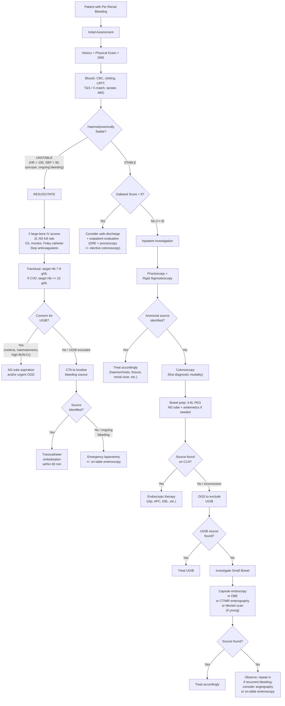

## Diagnostic Criteria, Diagnostic Algorithm, and Investigation Modalities for Per Rectal Bleeding

PR bleeding is not a single diagnosis — it's a presentation. There is no single "diagnostic criterion" the way you have for, say, rheumatic fever. Instead, the diagnostic approach is about **systematically localising the source** and **identifying the underlying pathology**. Think of it as a three-step mission that the senior notes describe perfectly [2][9]:

> **1. Save the patient** (resuscitation and stabilisation)
> **2. Find the bleeding** (localisation of bleeding site)
> **3. Stop the bleeding** (endoscopy, angiography, surgery)

Let me walk you through each component of the diagnostic workup from first principles.

---

## 1. Initial Assessment and Severity Stratification

Before you reach for any investigation, you need to answer one critical question: **Is this patient haemodynamically stable?** This determines your entire diagnostic pathway.

### 1.1 History (Diagnostic Pointers)

This was covered in detail in the DDx section, but the key diagnostic history points are [1][9]:

| History Element | Diagnostic Implication |
|---|---|
| ***Nature of blood and relationship to stool*** | Blood mixed with faeces = above sigmoid; blood on surface = anus/rectum; blood on toilet paper = anal margin; blood after defaecation = anus (haemorrhoids); blood by itself = torrential (diverticular, angiodysplasia) [9] |
| ***Colour of blood*** | Bright red = distal source; dark/maroon = proximal colon or SB; melena = UGIB or right colon with slow transit [1][9] |
| ***Hx of recent endoscopy / polypectomy*** | Post-polypectomy bleeding [1] |
| ***Red flags*** | Change in bowel habit, tenesmus, mucus, constitutional symptoms, FHx, age > 50 → investigate for CRC [5] |

### 1.2 Physical Examination

| Component | What You're Looking For | Why |
|---|---|---|
| ***Vitals: BP/P, RR, postural BP*** | Tachycardia, hypotension, postural drop | Quantify blood loss — Class II shock (15–30% blood loss) shows tachycardia before hypotension; Class III ( > 30%) shows both [2][9] |
| ***Temperature*** | Fever → infective/inflammatory colitis. ***↓ Body temperature can cause ↓ efficiency of clotting factors*** — prevent hypothermia [2][9] |
| ***General examination*** | Pallor, tachycardia (anaemia); dehydration (CRT, dry tongue); extra-abdominal manifestations of IBD [2][9] |
| ***Abdominal examination*** | Mass, tenderness — ***usually normal*** in LGIB [9] |
| ***Digital rectal examination + proctoscopy*** | ***Confirm haematochezia; look for anorectal pathologies (haemorrhoids, fissure-in-ano, masses)*** [2][5][9] |

### 1.3 Severity Scoring — The Oakland Score

***The lecture slides reference the Oakland score for risk stratification of stable patients*** [5]:

The **Oakland Score** predicts the probability of safe discharge in patients with acute LGIB. It uses 7 variables:

| Variable | Points |
|---|---|
| Age | 0–2 |
| Sex | 0–1 |
| Previous LGIB hospitalisation | 0–1 |
| DRE findings | 0–2 |
| Heart rate | 0–2 |
| Systolic BP | 0–2 |
| Haemoglobin | 0–6 |

- ***Oakland score < 8 → consider safe hospital discharge and outpatient evaluation*** [5]
- Oakland score ≥ 8 → warrants inpatient investigation and management

> **Why does this matter?** Many patients with PR bleeding (e.g. young patient with a small amount of bright red blood on paper from an obvious fissure) do NOT need admission. The Oakland score helps you formalise that clinical judgement.

---

## 2. Laboratory Investigations

### 2.1 Immediate Blood Tests

| Test | What It Tells You | Interpretation Pearls |
|---|---|---|
| ***CBC: Hb, haematocrit*** | Baseline Hb; severity of blood loss | ***Hb will often be at normal baseline initially*** — the patient is losing whole blood (both plasma and cells in proportion). ***Hb declines as blood is diluted by fluid during resuscitation*** (haemodilution). So an initial "normal" Hb does NOT exclude significant bleeding [1][9] |
| ***Type and cross-match*** | ***Indicated for haemodynamically unstable patients*** — prepare blood products [1][9] |
| ***Clotting profile (PT/INR, aPTT)*** | ***Look for coagulopathy*** — liver disease, warfarin use, DIC [1][9] |
| ***LFT*** | ***Look for chronic liver disease*** (portal HTN → rectal varices) and liver metastasis; ***albumin to assess nutritional status*** [1][9] |
| ***RFT*** | ***Hydration status, pre-renal failure, electrolyte imbalance***. Chronic renal disease → low Hb at baseline (↓ erythropoietin), interpret CBC with caution [1][9] |
| **BUN-to-creatinine ratio** (or urea-to-creatinine ratio) | ***Normal ratio ( < 20:1 for BUN:Cr; < 100:1 for urea:Cr) in acute LGIB*** with normal renal perfusion. ***An elevated ratio suggests UGIB*** — because digested blood is a protein load → bacteria convert it to urea → ↑ BUN/urea disproportionately to creatinine [1] |
| **Lactate, ABG** | Assess tissue perfusion and acid-base status in shock [3] |

<Callout title="The BUN:Cr Ratio Trick" type="idea">
An elevated BUN-to-creatinine ratio ( > 20:1) in a patient with apparent PR bleeding is a clue that the source may actually be **upper GI**. The mechanism: blood is digested → amino acids are absorbed → hepatic conversion to urea → ↑BUN. Creatinine is unaffected. This is a simple, cheap bedside clue that the "lower GI bleed" may actually be an upper GI bleed presenting with haematochezia [1].
</Callout>

### 2.2 Other Baseline Tests

| Test | Purpose |
|---|---|
| ***CEA*** | ***Low sensitivity (~30%) for colorectal cancer*** [5][11]. NOT a diagnostic test for CRC — its main roles are prognostication, treatment monitoring, and detection of recurrence post-operatively. An elevated CEA in PR bleeding may prompt further investigation but a normal CEA does NOT exclude cancer [11] |
| **Stool tests** | ***Amoeba histolytica*** (amoebic dysentery); ***Clostridium difficile toxin*** (pseudomembranous colitis); stool culture for bacterial pathogens (Salmonella, Shigella, Campylobacter); FOBT/FIT for occult bleeding [1] |
| **Iron profile** | Iron-deficiency anaemia pattern (↓ ferritin, ↓ serum iron, ↑ TIBC, ↓ transferrin saturation) → suggests chronic occult bleeding (right-sided CRC, angiodysplasia) [11] |

---

## 3. Diagnostic Algorithm — Master Flowchart

The following comprehensive algorithm integrates the lecture slide algorithm [5] with the senior notes approach [2][3][9]. The fundamental branch point is **haemodynamic stability**.

<Callout title="Key Algorithm Principles from Lecture Slides" type="idea">

***For UNSTABLE patients*** [5]:
- ***CTA before any treatment*** to localise source
- ***Consider UGI endoscopy unless CTA has already located the site***
- ***Reserve emergency laparotomy for patients in whom endoscopy and radiology have failed***
- ***Transcatheter embolisation within 60 minutes***

***For STABLE patients*** [5]:
- ***Consider safe hospital discharge if Oakland score < 8***
- ***Colonoscopy as the first diagnostic modality***
- ***Prepare with 4–6L of PEG-based solution; NG tube and antiemetics if needed***
- ***Transfusion: Hb < 7 g/dL → target 7–9 g/dL; Hb ≥ 8 g/dL + CVD → target ≥ 10 g/dL***

</Callout>

---

## 4. Investigation Modalities — Detailed Breakdown

### 4.1 Bedside Investigations

#### 4.1.1 Digital Rectal Examination (DRE)

- The absolute first "investigation" — costs nothing, takes 30 seconds
- ***Confirm haematochezia; look for anorectal pathologies*** [9]
- What you can find: stool colour (fresh blood, melena, normal), palpable mass (rectal CA — note distance from anal verge), anal tone assessment, prostate/rectovaginal septum, tenderness, induration [3]

#### 4.1.2 Proctoscopy

- ***Exclusion of bleeding from anorectal disorders*** [1][2]
- Visualises the anal canal and lower rectum (~7–8 cm)
- Best way to diagnose **internal haemorrhoids** (1st/2nd degree may not be palpable on DRE) at 3, 7, 11 o'clock positions [3]
- ***Bedside proctoscopy may reveal bleeding ulcer*** in acute haemorrhagic rectal ulcer [5]
- ***For intermittent/episodic PR bleeding: bedside examination with proctoscopy for anorectal pathology*** [5]

#### 4.1.3 Rigid Sigmoidoscopy (25 cm reach)

| Feature | Detail |
|---|---|
| **Reach** | Up to sigmoid colon (~25 cm from anal verge) |
| **Indications** | Anorectal pathology (biopsy within reach), assess true height of rectal tumour, lower resection margin planning, conservative treatment of sigmoid volvulus [3] |
| **Advantages** | No sedation required, quick, office procedure |
| **Limitations** | Limited reach, cannot assess proximal colon |

#### 4.1.4 NG Tube Aspiration

- ***Bile-stained aspiration without blood → bleeding from upper GI tract excluded*** [2][9]
- Why bile must be present: if the aspirate is clear (no bile), it may mean the tube tip is not in the duodenum — a duodenal source could still be bleeding distally without refluxing into the stomach
- A bloody aspirate = UGIB confirmed → proceed to OGD
- **Limitation:** Cannot definitively exclude a duodenal source if aspirate is non-bilious and non-bloody

---

### 4.2 Endoscopic Investigations

#### 4.2.1 Colonoscopy (CLN)

This is the **cornerstone investigation** for PR bleeding in haemodynamically stable patients.

| Aspect | Detail |
|---|---|
| **Diagnostic yield** | ***75–90%*** [2][9] |
| **Timing** | ***Should be performed early*** (to obtain a diagnosis before bleeding stops) [2][9]. For acute LGIB in stable patients, aim for colonoscopy within 24 hours of presentation |
| **Bowel preparation** | ***4–6L of PEG-based solution*** [5]; ***↑ diagnostic yield but does not ↑ morbidity*** [2][9]; ***NG tube and antiemetics can be used if needed*** [5]; ***NOT feasible in unstable patients*** [9] |
| **Scope** | ***Usually also intubate the ileocaecal valve to exclude distal small bowel bleeding*** [9] |
| **Failure to localise** | ***8–12% failure rate*** [2][9] |

**Advantages** [1]:
- ***Localisation of bleeding is accurate regardless of the aetiology or rate of bleeding***
- ***Ability to collect pathological specimens for diagnosis*** (biopsy)
- ***Ability for therapeutic intervention***

**Disadvantages** [1]:
- ***Requires bowel preparation and has poor visualisation in unprepared colon***
- ***Risks of sedation in an acutely bleeding patient***
- Low diagnostic yield in massive bleeding (poor visualisation from blood obscuring the field) [3]

**Key Endoscopic Findings by Diagnosis:**

| Diagnosis | Endoscopic Appearance |
|---|---|
| **Diverticular bleeding** | Active bleeding, non-bleeding visible vessel, or adherent clot located in a diverticulum (***but definite diverticular sources only identified in ~21%*** [9]); multiple diverticula visible |
| **Angiodysplasia** | ***Cherry red spots*** — flat or slightly raised, well-demarcated, red vascular lesions typically in caecum/ascending colon [3] |
| **CRC** | Endoluminal mass (exophytic or polypoid), may have bleeding (oozing/frank) from friable, necrotic, or ulcerative surface; may be circumferential ("apple-core") [11] |
| **UC** | ***Extensive ulceration of mucosa; surface is irregular, friable, erythematous, with loss of normal vascular markings***; continuous involvement starting from rectum [1] |
| **Crohn's colitis** | Skip lesions, aphthous ulcers, cobblestone mucosa, strictures |
| **Ischaemic colitis** | Segmental involvement (watershed areas); oedematous folds, ischaemic ulcers, necrosis of colonic wall; submucosal haemorrhage ("thumbprinting" appearance) [1] |
| **Radiation proctitis** | ***Vascular telangiectasia*** on mucosal surface; pallor, friability [2] |
| **Polyps** | Pedunculated or sessile mucosal projections; post-polypectomy sites may show ulcer base with visible vessel |

***Endoscopic therapeutic modalities*** (especially effective for angiodysplasia and diverticular disease) [2][5][9]:

| Therapy | Best Used For | Mechanism |
|---|---|---|
| ***TTS / cap-mounted clip*** | ***Diverticular bleeding*** [5] | Mechanical compression of bleeding vessel |
| ***Endoscopic band ligation (EBL)*** | ***Diverticular bleeding*** [5] | Band strangulates tissue containing bleeding vessel |
| ***Argon plasma coagulation (APC)*** | ***Angioectasia (angiodysplasia)*** [3][5] | Non-contact thermal coagulation using ionised argon gas — ablates superficial vascular malformations |
| **Adrenaline injection** (1:10,000) | Initial haemostasis (any source) | Vasoconstricton + tamponade effect; ***not used alone*** [3] |
| **Bipolar diathermy / heat probe** | Visible vessel | Thermal coagulation of vessel wall |
| ***Mechanical or thermal therapy*** | ***Delayed post-polypectomy bleeding*** [5] |
| ***Haemostatic topical agent*** | ***Salvage treatment*** [5] | Haemostatic powder (e.g. TC-325/Hemospray) applied to bleeding surface |

**Stigmata of recent haemorrhage (SRH)** — endoscopic findings that indicate the diverticulum or lesion has recently bled and may re-bleed [3]:
- Active bleeding (spurting or oozing)
- Non-bleeding visible vessel
- Adherent clot

> These are the same Forrest classification concepts used in UGIB, adapted for LGIB.

#### 4.2.2 Upper Endoscopy (OGD)

- ***Indicated if bleeding source is not identified on colonoscopy*** [1]
- ***Generally prefer OGD before colonoscopy*** if there is any clinical suspicion of UGIB [2][9]
- In the lecture algorithm: ***for unstable patients, consider UGI endoscopy unless CTA has already located the site of bleeding*** [5]
- Critical in patients with haemodynamic instability + haematochezia (10–15% will have UGIB source)

#### 4.2.3 Flexible Sigmoidoscopy (60 cm reach)

| Feature | Detail |
|---|---|
| **Reach** | Up to descending colon (~60 cm) [3] |
| **Indications** | ***Fresh PR bleed without alarming symptoms***; may be considered for patients < 40y as initial investigation [3] |
| **Preparation** | Low residue diet 3 days before, clear fluid diet 1 day before, Fleet enema ×2 [3] |
| **Advantages** | No sedation required, quick (~10 min), can do polypectomy |
| **Limitations** | Cannot visualise proximal colon (misses right-sided pathology); ***considered inadequate for diagnosis alone with gradual shift towards proximal tumours*** [11] |

<Callout title="Why Full Colonoscopy Over Flexible Sigmoidoscopy?" type="error">
Right-sided colonic pathology (diverticular disease in Asia, right-sided CRC — which is becoming more common worldwide, caecal angiodysplasia) will be MISSED by flexible sigmoidoscopy. ***Synchronous tumours occur in 3–5% of CRC patients (30% for polyps)*** [11], so you need to scope the entire colon. Flexible sigmoidoscopy alone is only appropriate for low-risk patients (young, no red flags, typical outlet-type bleeding).
</Callout>

---

### 4.3 Radiological Investigations

#### 4.3.1 CT Angiography (CTA)

| Feature | Detail |
|---|---|
| **Principle** | IV contrast-enhanced CT with arterial phase timing; extravasation of contrast into bowel lumen indicates active bleeding |
| **Indication** | ***Haemodynamically unstable patient — CTA before any treatment*** [5]; or when colonoscopy is non-diagnostic/not feasible |
| **Sensitivity** | Detects bleeding rates as low as 0.3–0.5 mL/min (better than conventional angiography) |
| **Advantages** | ***Widely available, fast, minimally invasive*** [1]; can localise bleeding to guide subsequent intervention (embolisation or surgery); also shows non-vascular pathology (tumour, diverticulitis, etc.) |
| **Disadvantages** | ***Lacks therapeutic capability*** [1]; ***requires radiation exposure*** and ***IV contrast*** (risk of contrast nephropathy and allergy) [1] |
| **Key finding** | Active contrast extravasation into bowel lumen = positive CTA |

> **Why CTA before colonoscopy in unstable patients?** An unstable patient cannot tolerate bowel preparation or the prolonged sedation required for colonoscopy. CTA is fast (minutes), requires no bowel prep, and can be done simultaneously with resuscitation. It provides a "roadmap" for subsequent transcatheter embolisation or surgery.

#### 4.3.2 Mesenteric Angiography (Conventional / DSA)

| Feature | Detail |
|---|---|
| **Principle** | ***Selective catheterisation of SMA, IMA, and coeliac artery by Seldinger technique***; look for ***extravasation of contrast*** [2][9][12] |
| **Sensitivity** | ***Detects bleeding rate of 0.5–1.0 mL/min*** [1]; diagnostic yield 27–67% [12] |
| **Advantages** | ***Localisation of bleeding site is very accurate*** [1]; ***allows therapeutic embolisation*** (injection of intra-arterial vasopressin or transcatheter embolisation) [1]; ***can diagnose non-bleeding lesions*** (angiodysplasia, SB tumours) [12]; can be done intra-operatively to guide surgery [12]; ***can specifically pinpoint the bleeding vessel*** (cf RBC scan) [12] |
| **Disadvantages** | ***Not sensitive for slow or intermittent bleeding*** [12]; ***embolisation carries risk of intestinal ischaemia*** [12]; invasive; requires interventional radiology expertise |
| **Key findings** | Contrast extravasation = active bleeding; early-filling vein with delayed emptying (***"mother-in-law phenomenon"***) = angiodysplasia [3]; anomalous vitelline artery branch of SMA = Meckel's diverticulum [9] |

#### 4.3.3 Radionuclide Imaging (Nuclear Medicine Scans)

Two main techniques — both are **screening tools** to confirm and localise bleeding, particularly useful for intermittent or obscure bleeding [1][13]:

| Feature | ***99mTc Sulphur Colloid Scan*** | ***99mTc-Labelled RBC Scan*** |
|---|---|---|
| **Principle** | IV injection of radionuclide-labelled colloid; extravasation into bowel lumen detected | IV injection of 99mTc-labelled autologous RBCs; serial imaging over hours for extravasation |
| **Sensitivity** | Requires active bleeding; cannot detect intermittent bleeding | ***Detects intermittent bleeding at 0.1–0.4 mL/min*** [1][13] — more sensitive than angiography |
| **Delayed imaging** | Not possible (colloid is rapidly cleared by RES) | ***Delayed images up to 24h → can detect intermittent bleeding*** [13] |
| **Localisation** | ***Poor localisation of bleeding site*** [1] | ***Poor localisation*** (blood moves within bowel lumen between images) [1] |
| **Therapeutic capability** | ***No therapeutic value*** [1] | ***No therapeutic value*** [1] |
| **Main role** | Rapid screening | ***Preferred over angiography for initial detection of GI bleeding*** due to higher sensitivity and less invasiveness [13] |

**Diagnostic criteria for a positive RBC scan** [13]:
- ***Activity conforms to intestinal anatomy***
- ***Intensity increases with time***
- ***Activities move (anterograde or retrograde) within the bowels***

> **Why is the RBC scan preferred over angiography for initial detection?** Because it is ***more sensitive*** (0.1–0.4 mL/min vs 0.5–1.0 mL/min), ***less invasive***, and can image over 24 hours to catch intermittent bleeding [13]. However, its poor localisation means that if positive, you often still need angiography or colonoscopy to pinpoint the exact source.

#### 4.3.4 Meckel's Scan (99mTc Pertechnetate Scan)

| Feature | Detail |
|---|---|
| **Principle** | 99mTc-pertechnetate is taken up by gastric mucosa (both orthotopic and ectopic). Ectopic gastric mucosa in a Meckel's diverticulum will accumulate the tracer |
| **Indication** | ***Young patients*** with suspected Meckel's diverticulum as cause of PR bleeding [9][12] |
| **Sensitivity** | ~85% in children, lower in adults |
| **Key finding** | Focal uptake in the right lower quadrant that appears simultaneously with gastric uptake |

#### 4.3.5 CT Colonography (Virtual Colonoscopy)

| Feature | Detail |
|---|---|
| **Principle** | Spiral CT with IV contrast + air insufflation + intraluminal (enema) contrast → computer-generated 3D "fly-through" of the colon simulating colonoscopy [11] |
| **Indication** | ***When caecum cannot be reached by colonoscopy*** (incomplete colonoscopy due to obstruction/intolerance) [11] |
| **Advantages** | Non-invasive, similar diagnostic accuracy for tumours > 1 cm, provides extraluminal information [11] |
| **Disadvantages** | ***High radiation dose, not therapeutic*** (still needs colonoscopy for biopsy), requires mechanical bowel prep (stools can simulate polyps) [11] |

#### 4.3.6 Double-Contrast Barium Enema (DCBE)

| Feature | Detail |
|---|---|
| **Principle** | Barium + air insufflation → double contrast outlines mucosal surface |
| **Classic finding** | ***"Apple-core" lesion*** — near-circumferential involvement of bowel walls by CRC [11] |
| **Status** | ***Largely superseded by CT colonography*** — risk of barium peritonitis if perforation; lower diagnostic accuracy [11] |

#### 4.3.7 Plain Radiographs (AXR, CXR)

| Film | Findings and Significance |
|---|---|
| **AXR** | Dilated bowel loops (obstruction from CRC); ***thumbprinting*** (submucosal haemorrhage/oedema in ischaemic colitis); ***pneumatosis intestinalis*** (advanced ischaemia — gas in bowel wall); free air (perforation) |
| **CXR** | ***Free gas under diaphragm*** (perforation — e.g. perforated diverticulitis); lung metastases (CRC staging) |

---

### 4.4 Investigations for Obscure / Small Bowel Bleeding

When "top and tail" (OGD + colonoscopy) are both negative, the bleeding is termed **obscure GI bleeding** — and the source is most commonly in the **small bowel** [2][3][9].

| Investigation | Indication | Key Features |
|---|---|---|
| ***Wireless capsule endoscopy*** | Intermittent/stopped SB bleeding | Swallowed camera capsule transmits images; non-invasive; ***contraindicated if intestinal obstruction*** — do CT/MR enterography beforehand [3]; diagnostic yield ~60% for obscure OGIB |
| ***Double-balloon enteroscopy (DBE)*** | Intermittent SB bleeding, therapeutic intent | ***Scope with 2 inflated balloons, advances into SB from mouth or anus*** [3]; allows biopsy and therapy; more invasive |
| **CT / MR enterography** | SB pathology (tumour, Crohn's, radiation enteritis) | Non-invasive; good for mural and extramural lesions; ***segmental inflammation, bowel thickening, mucosal hyperenhancement*** [9] |
| **Enteroclysis** | SB neoplasm detection | ***Intubation of DJ flexure under fluoroscopy → injection of barium, methylcellulose, and water (double contrast)*** [3]; low yield (~10%), cannot detect vascular lesions [9] |
| ***Meckel's scan*** | Young patients | As above — 99mTc pertechnetate for ectopic gastric mucosa [12] |
| ***Intra-operative enteroscopy*** | Last resort, ongoing bleeding | Enteroscope through enterotomy at middle of SB → go both directions → plicate or excise lesions seen [12] |

**Approach to obscure bleeding** [9][12]:

| Clinical Scenario | Approach |
|---|---|
| ***Ongoing bleeding + unstable*** | Emergency exploratory laparotomy + on-table inspection/enteroscopy [12] |
| ***Ongoing bleeding + stable*** | Mesenteric angiogram (faster) or RBC scan (more sensitive); enteroscopy seldom done in ongoing bleeding (risk of prolonged sedation) [12] |
| ***Stopped bleeding*** | Meckel's scan (young); CT abdomen (older → exclude solid organ malignancies first); capsule endoscopy / enteroscopy if above negative [12] |

---

## 5. Summary: Which Investigation for Which Scenario?

| Clinical Scenario | First-Line Investigation | Second-Line | Third-Line |
|---|---|---|---|
| **Stable, intermittent outlet-type bleeding, young** | ***DRE + Proctoscopy*** [5] → Flexible sigmoidoscopy | Colonoscopy if red flags | — |
| **Stable, LGIB with red flags** | ***Colonoscopy (with bowel prep)*** [5] | OGD if CLN negative | SB investigations |
| **Unstable, massive haematochezia** | ***CTA*** [5] → transcatheter embolisation | OGD (if UGIB suspected) | Emergency laparotomy |
| **Suspected UGIB presenting as PR bleed** | ***OGD*** (or NG aspirate first) [2][9] | CTA if OGD negative | — |
| **Occult bleeding / IDA** | Colonoscopy + OGD ("top and tail") | Capsule endoscopy / CT enterography | DBE / enteroscopy |
| **Recurrent SB bleeding** | Capsule endoscopy / DBE [3] | Mesenteric angiography | On-table enteroscopy [12] |
| **Young patient, suspected Meckel's** | ***Meckel's scan*** [12] | Mesenteric angiography | Laparoscopic exploration |

---

## 6. Key Diagnostic Findings — Quick Reference Table

| Diagnosis | Key Investigation | Diagnostic Finding |
|---|---|---|
| **Haemorrhoids** | ***Proctoscopy*** | Engorged vascular cushions at 3, 7, 11 o'clock |
| **Anal fissure** | ***Inspection (spread buttocks)*** | Visible tear in posterior midline anoderm |
| **Diverticular bleeding** | Colonoscopy (+ angiography) | Active bleeding / visible vessel / adherent clot in diverticulum |
| **Angiodysplasia** | Colonoscopy | ***Cherry red spots*** (flat, well-demarcated, red vascular lesions) |
| | Mesenteric angiography | ***"Mother-in-law phenomenon"*** (early filling, delayed emptying) |
| **CRC** | ***Colonoscopy + biopsy (gold standard)*** [11] | Endoluminal mass, friable/necrotic/ulcerative; biopsy for histology |
| | DCBE | ***"Apple-core" lesion*** |
| **UC** | Colonoscopy + biopsy | Continuous inflammation from rectum, loss of vascular markings, friable mucosa, pseudopolyps |
| **Ischaemic colitis** | Colonoscopy; AXR | Segmental involvement at watershed areas; ***thumbprinting*** (AXR); oedematous folds with ischaemic ulcers |
| **Radiation proctitis** | Colonoscopy + biopsy | ***Vascular telangiectasia***; segmental pallor with friability |
| **Meckel's diverticulum** | ***Meckel's scan*** | Focal RLQ uptake synchronous with gastric uptake |
| **Active GI bleeding** | ***RBC scan*** | Activity conforming to intestinal anatomy, increasing with time, moving within bowels [13] |
| **Active GI bleeding** | ***CTA / Mesenteric angiography*** | Contrast extravasation into bowel lumen |

---

<Callout title="High Yield Summary">

1. ***Three principles: Save the patient → Find the bleeding → Stop the bleeding.***

2. **Haemodynamic status is the primary branch point** — unstable → CTA first; stable → colonoscopy first.

3. ***Oakland score < 8 → consider safe discharge with outpatient evaluation.***

4. **Initial bloods:** CBC (Hb may be falsely normal initially), clotting, LRFT, T&S. ***BUN:Cr ratio > 20:1 suggests UGIB.***

5. ***DRE + proctoscopy are mandatory bedside investigations*** for every patient with PR bleeding.

6. ***Colonoscopy = first-line diagnostic modality for stable LGIB*** (yield 75–90%); requires bowel prep (4–6L PEG); should be done early.

7. ***OGD must be considered*** when colonoscopy is negative or when UGIB is suspected (10–15% of haematochezia is UGIB).

8. ***CTA for unstable patients*** — fast, no prep needed, localises source for subsequent embolisation.

9. ***RBC scan > angiography for sensitivity*** (0.1–0.4 vs 0.5–1.0 mL/min) and can detect intermittent bleeding over 24h, but ***poor localisation and no therapeutic capability***.

10. ***Obscure GI bleeding (negative top-and-tail):*** Capsule endoscopy → DBE → CT/MR enterography → Meckel's scan (young) → on-table enteroscopy (last resort).

11. ***CEA has low sensitivity (~30%) for CRC*** — NOT a screening/diagnostic test; used for monitoring and recurrence detection.

</Callout>

---

<ActiveRecallQuiz
  title="Active Recall - Diagnosis of PR Bleeding"
  items={[
    {
      question: "A stable patient presents with acute LGIB. Outline the step-by-step diagnostic approach according to the lecture algorithm, including the role of the Oakland score.",
      markscheme: "1) Initial assessment: history, physical exam (incl DRE), bloods (CBC, clotting, LRFT, T+S). 2) Confirm haemodynamic stability. 3) Calculate Oakland score: if less than 8, consider safe discharge + outpatient evaluation. 4) If score >= 8: inpatient colonoscopy as first diagnostic modality. 5) Bowel prep: 4-6L PEG solution, NG tube + antiemetics if needed. 6) Transfuse if Hb < 7 (target 7-9) or if CVD present with Hb >= 8 (target >= 10). 7) If colonoscopy non-diagnostic: OGD to exclude UGIB. 8) If both negative: investigate small bowel (capsule endoscopy, DBE, CT enterography)."
    },
    {
      question: "Compare and contrast RBC scan and mesenteric angiography as diagnostic modalities for GI bleeding in terms of sensitivity, localisation accuracy, therapeutic capability, and ability to detect intermittent bleeding.",
      markscheme: "RBC scan: more sensitive (detects 0.1-0.4 mL/min vs 0.5-1.0 mL/min for angiography); can detect intermittent bleeding with delayed imaging up to 24h; less invasive. BUT poor localisation and no therapeutic capability. Angiography: less sensitive but more specific; excellent localisation (can pinpoint bleeding vessel); allows therapeutic embolisation/vasopressin injection; NOT sensitive for intermittent/slow bleeding; risk of intestinal ischaemia from embolisation. In practice: RBC scan often used as screening tool; if positive, proceed to angiography for precise localisation and treatment."
    },
    {
      question: "Explain why the initial Hb may be normal in a patient with acute massive PR bleeding, and describe the BUN-to-creatinine ratio trick for differentiating upper from lower GI sources.",
      markscheme: "Hb is initially normal because the patient is losing whole blood (plasma and RBCs in proportion), so the concentration (Hb) stays the same. Hb drops only after haemodilution occurs from IV fluid resuscitation or physiological transcapillary refill. BUN:Cr ratio: in UGIB, digested blood acts as a protein load — amino acids are absorbed and converted to urea by the liver, raising BUN disproportionately to creatinine (ratio > 20:1). In LGIB, blood is not digested so the ratio remains normal (< 20:1). An elevated ratio in a patient with apparent PR bleeding suggests UGIB."
    },
    {
      question: "Name the endoscopic appearance of angiodysplasia on colonoscopy and on mesenteric angiography. What are two important clinical associations with angiodysplasia?",
      markscheme: "Colonoscopy: cherry red spots (flat or slightly raised, well-demarcated red vascular lesions, typically in caecum/ascending colon). Angiography: 'mother-in-law phenomenon' (early filling, delayed emptying). Associations: (1) Aortic stenosis (Heyde syndrome - acquired type 2A vWD from shear degradation of high-MW vWF multimers), (2) Hereditary haemorrhagic telangiectasia (Osler-Weber-Rendu disease). Others: ESRD, von Willebrand disease."
    },
    {
      question: "List the three diagnostic criteria for a positive 99mTc-labelled RBC scan in GI bleeding.",
      markscheme: "(1) Activity conforms to intestinal anatomy, (2) Intensity increases with time, (3) Activities move (anterograde or retrograde) within the bowels. All three must be present to confirm active GI bleeding on the scan."
    }
  ]}
/>

## References

[1] Senior notes: felixlai.md (Lower GI Bleeding sections — History, Physical examination, Biochemical tests, Radiological tests)
[2] Senior notes: Ryan Ho Fundamentals.pdf (Section 3.3.6 Lower GI Bleeding, p281–285)
[3] Senior notes: maxim.md (LGIB, Angiodysplasia, Haemorrhoids, Flexible/Rigid Sigmoidoscopy sections)
[5] Lecture slides: GC 186. Lower and diffuse abdominal painfresh blood in stool.pdf (p19, p20, p38)
[9] Senior notes: Ryan Ho GI.pdf (Section B. Approach to Lower GI Bleeding, p108–111)
[11] Senior notes: maxim.md (CRC Investigations section); Senior notes: Ryan Ho GI.pdf (p166 — Diagnostic investigations for CRC)
[12] Senior notes: Ryan Ho GI.pdf (p48 — Mesenteric angiography; p162 — Meckel's diverticulum investigations)
[13] Senior notes: Ryan Ho Diagnostic Radiology.pdf (p62 — Red Blood Cell Scan)
