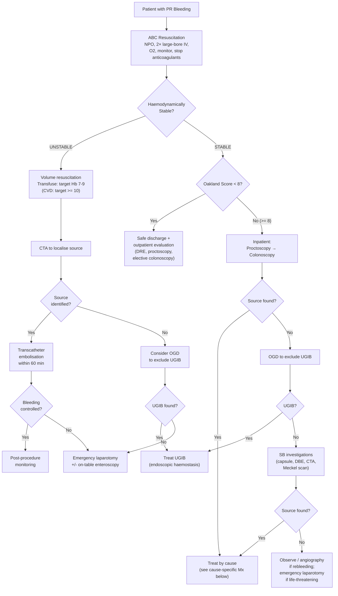

## Management of Per Rectal Bleeding

The management of PR bleeding follows the same three principles we established in the diagnostic section [2][9]:

> **1. Save the patient** — resuscitation and haemodynamic stabilisation
> **2. Find the bleeding** — localisation (covered in Dx section)
> **3. Stop the bleeding** — endoscopic, radiological, or surgical haemostasis

The specific therapeutic approach then depends on **two things**: (a) the haemodynamic status of the patient, and (b) the underlying cause of the bleeding. Let me walk you through this systematically.

---

## 1. Resuscitation — "Save the Patient"

This is universal for all causes and must happen **simultaneously** with diagnostic workup in any significant bleed. You don't wait for a diagnosis to start resuscitation.

### 1.1 Airway, Breathing, Circulation (ABC)

| Step | Action | Rationale |
|---|---|---|
| **A — Airway** | ***Intubate if decompensated (confused) or massive haematemesis*** [2][9] | Protects airway from aspiration of blood/vomitus; a confused patient has lost airway protective reflexes |
| **B — Breathing** | ***O₂ cannula to ↑ O₂-carrying capacity of blood*** [2][9] | Even with reduced Hb, maximising the O₂ saturation of remaining haemoglobin improves tissue oxygen delivery |
| **C — Circulation** | ***Large-bore IV cannula (14/16G at antecubital vein) with colloid/crystalloid infusion ± blood transfusion*** [2][9][14] | Large bore = faster flow rate (flow rate ∝ r⁴ by Hagen-Poiseuille equation — a 14G cannula delivers fluid ~4× faster than an 18G). Two access points ensure redundancy |

### 1.2 Initial Measures

- ***NPO (nil by mouth)*** — in case OGD or surgery is needed [1][3]
- ***Set up 2 large-bore IV access and give 2L IV NS full rate*** [3]
- ***Stop all anticoagulants*** [3] — but ***weigh against the thrombotic risk*** of the individual patient before complete reversal of anticoagulation [1]
- ***Monitor vitals*** — cardiac monitor, pulse oximetry [1][2]

### 1.3 Monitoring Haemodynamic Status

| Parameter | Target / Action | Why |
|---|---|---|
| ***Shock chart hourly*** | BP/P, RR, body temperature | ***↓ Body temperature can cause ↓ efficiency of clotting factors*** — actively prevent hypothermia [2][9] |
| ***Foley's catheter*** | ***Urine output ≥ 0.5 mL/kg/h*** [2][9] | UO is the best real-time marker of end-organ perfusion (renal perfusion reflects cardiac output) |
| ***Cardiac monitor, pulse oximetry*** | Continuous | Detect arrhythmias from electrolyte imbalance or myocardial ischaemia from anaemia |
| ***± CVP line*** | For PAWP monitoring | ***Consider if history of cardiac failure*** — to guide fluid resuscitation without causing pulmonary oedema [2][9] |

### 1.4 Blood Transfusion

***Transfusion triggers and targets from the lecture algorithm*** [5]:

| Clinical Scenario | Transfusion Trigger | Target Hb |
|---|---|---|
| ***No cardiovascular disease (CVD)*** | ***Hb < 7 g/dL*** | ***7–9 g/dL*** |
| ***CVD present*** | ***Hb ≥ 8 g/dL*** | ***≥ 10 g/dL*** |
| **Profuse / ongoing bleeding** | Transfuse regardless of Hb [2][9] | — |
| **Persistent haemodynamic instability despite crystalloid** | Transfuse [2][9] | — |
| **Symptomatic anaemia** | Transfuse [2][9] | — |
| **Acute MI / unstable angina with low Hb** | Transfuse [2][9] | — |

**Correction of coagulopathy** [1]:
- ***Fresh frozen plasma (FFP)*** for coagulopathy (INR > 1.5)
- ***Platelets*** for platelet dysfunction or thrombocytopenia (platelets < 50 × 10⁹/L in active bleeding)
- **Vitamin K** if warfarin-related coagulopathy (but takes 6–12h for effect)
- **Prothrombin complex concentrate (PCC)** for urgent warfarin reversal
- **Tranexamic acid** (antifibrinolytic) — may be considered although evidence in LGIB is limited [3]

<Callout title="Restrictive vs Liberal Transfusion" type="idea">
Why target Hb 7–9 rather than higher? The **TRIGGER trial** and subsequent evidence showed that a restrictive transfusion strategy (Hb 7 g/dL trigger) in GI bleeding reduces mortality compared to liberal transfusion (Hb 9 g/dL trigger). Over-transfusion can raise portal pressure (→ ↑risk of variceal rebleeding), cause volume overload (especially in cardiac patients), and has immunomodulatory effects. The exception is patients with **active CVD** who need higher Hb to maintain myocardial oxygen delivery.
</Callout>

---

## 2. Master Management Algorithm

---

## 3. Cause-Specific Management

### 3.1 Diverticular Bleeding

***"Treatment: endoscopic vs surgical resection"*** [5][8]

The management follows a stepwise escalation:

**Step 1: Conservative / Supportive**
- ***50% of diverticular bleeding stops spontaneously*** [3]; ***80–85% overall stop spontaneously*** [5][8]
- Fluid resuscitation and blood transfusion as needed [1]
- ***Lifestyle modification: high-fibre diet, bulk laxatives (e.g. methylcellulose), weight reduction*** [3]
- ***Avoid stimulant laxatives and NSAIDs*** (NSAIDs ↑ risk of diverticular bleeding via impaired platelet function and mucosal injury) [3]

**Step 2: Endoscopic Therapy** (colonoscopy to identify and treat)
- ***Indication: stigmata of recent haemorrhage*** (active bleeding, non-bleeding visible vessel, adherent clot) [3]
- ***Modalities*** [1][3][5]:
  - ***TTS / cap-mounted clip*** — mechanical compression of bleeding vessel [5]
  - ***Endoscopic band ligation (EBL)*** [5]
  - ***Adrenaline injection (1:10,000)*** — ***not used alone*** (temporary effect only; rebleeds after absorption ~1h) [3][9]
  - ***4-quadrant submucosal injection of adrenaline*** in bleeding diverticular vessel [1]
  - ***Bipolar coagulation*** for non-bleeding visible vessel [1]
- **Localisation of bleeding:** ***colonoscopy → angiography → on-table lavage and colonoscopy → subtotal colectomy if source still unidentified*** [3]

**Step 3: Angiographic Therapy** (if endoscopy fails or is not feasible)
- ***Embolisation or infusion of vasopressin*** by localising the site of bleeding [1]
- ***Transcatheter embolisation within 60 minutes*** for unstable patients [5]
- **Risk:** Intestinal ischaemia from embolisation (occluding blood supply to bowel wall) [12]

**Step 4: Surgical Resection** (last resort) [1][5][9]
- ***Reserved for patients in whom bleeding does not stop spontaneously and cannot be controlled with endoscopic or angiographic therapy*** [1]
- ***Indications for surgery (laparotomy)*** [1][2][9]:
  - ***Haemodynamic instability despite adequate resuscitation***
  - ***Massive blood transfusion ( > 6 units)***
  - ***Frequent re-bleeding***
  - ***On anticoagulant or antiplatelets*** (higher risk of ongoing bleeding)
- ***Procedures*** [2][9]:
  - ***With localisation: segmental colectomy*** — rebleeding rate 0–15%, mortality 0–13% [2]
  - ***Without localisation: subtotal/total colectomy*** if probable colonic cause — ***rebleeding rate 10–20%*** [5]; ***blind segmental resection has rebleeding rate up to 75%*** [2] — avoid this!
- ***Semi-elective resection after 2nd bleeding episode*** should be considered for recurrent diverticular bleeding [2]

**Operative approach for acute LGIB (from lecture slides)** [5]:
- ***For relatively stable patients, persistent bleeding after exhausting endoscopic and radiological interventions***
- ***For patients who don't respond to initial resuscitation***
- ***Consider upper endoscopy first if not been performed***
- ***Palpation of small bowel*** (tumour, diverticulum)
- ***On-table upper endoscopy and colonoscopy***
- ***On-table enteroscopy*** (diagnostic yield 80–92%) [5]
- ***Clamping of bowel segments*** (to isolate bleeding segment)
- ***Segmental resection if bleeding source identified, rebleeding rate 0–15%*** [5]
- ***If no source identified and probable colonic cause, subtotal or total colectomy*** (rebleeding rate 10–20%) [5]

<Callout title="Why Not Blind Segmental Resection?" type="error">
***Blind segmental resection (without pre-operative localisation) has a rebleeding rate of up to 75%*** [2]. This is because you may resect the wrong segment — the remaining colon still harbours the bleeding source. Always attempt to localise the bleeding before surgery. If you cannot localise it, a subtotal colectomy is safer than guessing.
</Callout>

---

### 3.2 Angiodysplasia

Stepwise escalation [1][3]:

| Step | Modality | Details |
|---|---|---|
| **Conservative** | Bed rest, tranexamic acid [3] | Most episodes (85–90%) self-limiting |
| **Endoscopic** | ***Argon plasma coagulation (APC)*** or monopolar electrocautery [3][5] | APC is the treatment of choice — delivers non-contact thermal energy via ionised argon gas; has ***lower energy depth than heat probe → lower risk of perforation*** → ideal for thin-walled vascular lesions [9][15] |
| **Interventional Radiology** | ***Mesenteric angiogram for super-selective catheterisation and embolisation*** [3] | When colonoscopy is non-diagnostic or endoscopic haemostasis fails |
| **Surgical** | ***Right hemicolectomy*** (most angiodysplasia is caecal/ascending colon) [3] | ***Only in selected patients due to high mortality***; indications: failed endoscopic + angiographic treatment; severe acute life-threatening GI bleed; multiple lesions that cannot be managed otherwise [3] |

> **Why APC for angiodysplasia?** Angiodysplasia lesions are superficial (submucosal), thin-walled vessels lacking smooth muscle. APC delivers controlled, shallow thermal energy → ablates the superficial malformation without burning deep into the bowel wall → minimises perforation risk. This is why it's specifically recommended for angiodysplasia over deeper thermal modalities [9][15].

---

### 3.3 Haemorrhoids

Management is guided by the **Goligher grading** of internal haemorrhoids [3]:

| Grade | Description | Management |
|---|---|---|
| **I** | Palpable, non-prolapsing, bleeding only | ***Lifestyle + medical*** |
| **II** | Prolapse with straining, ***spontaneous reduction*** | ***Lifestyle + medical + RBL*** |
| **III** | Prolapse requiring manual reduction | ***Lifestyle + medical + RBL + consider surgery*** |
| **IV** | Chronic prolapse, ***irreducible*** ± strangulated | ***Surgery*** |

#### 3.3.1 Lifestyle Modification [3]

| Measure | Rationale |
|---|---|
| ***High-fibre diet, increase fluid intake*** | Softens stool → reduces straining → reduces engorgement of anal cushions |
| ***Avoid prolonged sitting on toilet, avoid prolonged straining*** | Straining ↑ intra-abdominal pressure → ↑ venous congestion of haemorrhoidal plexus |
| ***Exercise, weight loss*** | ↓ chronic ↑ intra-abdominal pressure |
| ***Avoid spicy food*** | Reduces anal irritation |

#### 3.3.2 Medical Therapy [3]

| Agent | Mechanism |
|---|---|
| **Stool softeners, bulking agents** (e.g. Metamucil / psyllium) | ↑ stool bulk and softness → ↓ straining |
| **Topical antiseptic** (KMnO₄ sitz bath) | Reduces local infection/irritation |
| **Topical haemostatic** (e.g. Faktu) | Local haemostasis |
| **Topical astringent** (e.g. Anusol — contains zinc oxide, bismuth) | Shrinks swollen tissue, reduces mucous discharge |
| **Topical analgesics** | Pain relief |

#### 3.3.3 Office-Based Procedures

**Rubber Band Ligation (RBL)** [3]:
- ***Apply rubber bands to strangulate the pile by Barron's bander → ischaemic necrosis of piles → slough off within 10 days***
- ***Efficacy: 70% resolve, 30% recur***
- ***Administration: up to 3 bandings at ≥ 1 cm above dentate line*** (must be above dentate line because below = somatic innervation = excruciating pain)
- ***Indication: symptomatic Grade II/III internal haemorrhoids***
- ***Complications: pain, bleeding*** (7–10 days post-banding due to sloughing of ligated haemorrhoids)
- ***Contraindications: anticoagulant use, immunocompromised*** (risk of post-banding sepsis)

**Sclerotherapy ("Mitchell")** [3]:
- ***5% phenol in almond oil injected submucosally*** → creates fibrosis → obliterates vascular channels and fixes position
- ***Largely abandoned now:*** risk of allergy to nuts and intraprostatic injection [3]

**Haemorrhoidal Artery Ligation Operation (HALO)** [3]:
- ***May be Doppler-guided (DG-HALO)*** to identify feeding vessels
- ***Mainly for bleeding symptoms, indicated for Grade II/III haemorrhoids***
- ***Lowest post-op complications, but highest recurrence rate*** [3]

#### 3.3.4 Surgical Excision (Haemorrhoidectomy) [3]

***Indications:***
- ***Grade III/IV internal haemorrhoids***
- ***Symptomatic internal/external haemorrhoids refractory to other treatments***

***Approaches:***

| Approach | Description | Best For |
|---|---|---|
| ***Conventional haemorrhoidectomy*** | ***For internal ≥ grade III or external*** | Most cases requiring surgery |
| ***Open (Milligan-Morgan)*** | ***Open wound, heal by secondary intention*** | ***Preferred for acute gangrenous haemorrhoids*** (prevents further tissue oedema and necrosis) |
| ***Closed (Ferguson)*** | ***Close wound by continuous suture*** | ***More commonly used*** |
| ***Stapled haemorrhoidopexy*** | ***For internal only***, stapler excises ring of prolapsing mucosa | ***Less painful but higher recurrence rate; less favoured now due to poorer long-term outcomes*** |

- ***3-leaf clover excision*** pattern: avoid circumferential excision — ***prone to stenosis*** [3]
- ***Efficacy: 95% resolve*** [3]
- **Pre-op preparation:** stool softener, enema [3]
- **Position:** prone jackknife or lithotomy [3]
- **Anaesthesia:** perianal / spinal / general [3]

***Complications:***
- ***Pain (~100% due to internal anal sphincter spasm)*** [3]
- ***Urinary retention*** — caused by pain and anal spasm, fluid overload, rectal packing, drugs (narcotics, anticholinergics), pre-existing outflow tract obstruction [3]
- ***Faecal incontinence, anal fissure, anal stenosis*** [3]

#### 3.3.5 Acute Painful Anal Mass (Thrombosed Haemorrhoid) [3]

| Timing | Management |
|---|---|
| **Presents within 72h** | **Excision** under local anaesthesia (excise the entire thrombosed haemorrhoid — NOT just incision and drainage, which leads to recurrence) |
| **Presents after 72h** | Conservative management (sitz baths, analgesics, stool softeners) — the thrombus is already organising and will resolve spontaneously (leaving a skin tag) |

---

### 3.4 Anal Fissure

| Phase | Treatment | Mechanism |
|---|---|---|
| **Acute (< 6 weeks)** | ***Supportive:*** ↑ dietary fibre and water, stool softeners/laxatives, warm sitz baths (relax sphincter + ↑ blood flow to anal mucosa), topical analgesics (lidocaine jelly) [1] | Softens stool → ↓ trauma to anoderm; sitz bath → ↓ sphincter spasm → ↓ ischaemia → promotes healing |
| **Chronic ( > 6 weeks) / Failed conservative** | ***Topical vasodilators:*** topical nifedipine ointment or topical nitroglycerin (GTN) ointment [1] | Chemical sphincterotomy — relaxes internal anal sphincter smooth muscle → ↓ resting anal pressure → ↑ blood flow to ischaemic posterior midline → promotes healing |
| | ***Botulinum toxin type A injection*** [1] | Chemical denervation of internal anal sphincter → ↓ spasm for ~3 months → allows healing |
| | ***Lateral internal sphincterotomy*** [1] | Definitive surgical treatment — divides the internal anal sphincter (partially) → permanently ↓ resting anal tone → ↑ perfusion → heals the fissure. Risk: minor faecal incontinence |

> **Why lateral internal sphincterotomy is so effective:** The root cause of chronic fissure is **internal sphincter spasm** creating a vicious cycle of ischaemia and failed healing. By dividing part of the sphincter, you break this cycle. The operation has a > 95% healing rate. The trade-off is a small risk (~5–8%) of minor incontinence to flatus.

---

### 3.5 Rectal Ulcer (Acute Haemorrhagic)

***Treatment*** [5]:
- ***Packing of adrenaline-soaked gauze*** — direct tamponade + local vasoconstriction
- ***Suture plication*** — surgical closure of the bleeding ulcer
- ***Endoscopic electrocoagulation*** — thermal haemostasis of the bleeding vessel

---

### 3.6 Radiation Proctitis

***Treatment*** [5][2]:
- ***Blood transfusion*** (for anaemia from chronic bleeding)
- ***Sucralfate enema*** — cytoprotective; forms a barrier over ulcerated mucosa, promotes healing
- ***Steroid enema*** — reduces inflammation
- ***Argon plasma coagulation (APC)*** — ablates telangiectatic vessels (first-line endoscopic therapy)
- ***RFA*** (radiofrequency ablation)
- ***Formalin*** (4% formalin application) — causes chemical cauterisation of telangiectatic tissue
- ***Laser / infrared*** coagulation
- ***Stoma diversion*** — diverting proximal stoma to defunctionalise the rectum (last resort for intractable cases) [5]
- ***Proctectomy*** — rarely done, reserved for truly refractory cases [2]

---

### 3.7 Rectal Varices

| Step | Treatment | Rationale |
|---|---|---|
| 1 | ***Injection sclerotherapy (local)*** [2] | Obliterates variceal channels |
| 2 | ***TIPS (transjugular intrahepatic portosystemic shunt)*** | ***For uncontrolled bleeding*** [2] — ↓ portal pressure by creating a shunt between hepatic vein and portal vein within the liver |

---

### 3.8 Colorectal Cancer

- ***Endoscopic treatment has limited role*** for bleeding CRC [2] — the bleeding is from friable tumour surface, not a discrete vessel
- Definitive management is **oncological treatment** (surgical resection ± chemo/radiotherapy) — this is a separate major topic
- In the acute setting: supportive care, transfusion, and expedited staging workup

---

### 3.9 IBD-Related Bleeding

- ***Usually treat medically*** (5-ASA, steroids, immunomodulators, biologics) [2]
- ***May require emergency colectomy if life-threatening*** [2]
- Management of IBD is a large separate topic

---

### 3.10 Ischaemic Colitis

- **Mostly supportive:** IV fluids, bowel rest, broad-spectrum antibiotics (to prevent secondary bacterial translocation)
- **Surgery** indicated for: peritoneal signs (transmural necrosis/perforation), persistent bleeding, stricture formation
- Treat underlying cause (optimise cardiac output, hold vasopressors if possible)

---

## 4. Summary Table: Treatment Modalities by Cause

| Cause | 1st Line | 2nd Line | 3rd Line / Surgical |
|---|---|---|---|
| ***Diverticular bleeding*** | ***Endoscopic: TTS/cap clip or EBL*** [5] | ***Transcatheter embolisation*** [5] | ***Segmental colectomy (with localisation) or subtotal colectomy (without)*** [5] |
| ***Angiodysplasia*** | ***APC*** [3][5] | ***IR: super-selective embolisation*** [3] | ***Right hemicolectomy*** (selected cases only) [3] |
| ***Haemorrhoids (I–II)*** | Lifestyle + medical + RBL [3] | — | — |
| ***Haemorrhoids (III–IV)*** | ***Haemorrhoidectomy*** [3] | — | — |
| ***Anal fissure (acute)*** | Fibre, sitz bath, topical analgesics [1] | Topical GTN/nifedipine [1] | Lateral internal sphincterotomy [1] |
| ***Rectal ulcer*** | ***Adrenaline gauze packing*** [5] | ***Suture plication*** [5] | ***Endoscopic electrocoagulation*** [5] |
| ***Radiation proctitis*** | ***Sucralfate/steroid enema*** [5] | ***APC, formalin, laser*** [5] | ***Stoma diversion*** [5] |
| ***Rectal varices*** | ***Sclerotherapy*** [2] | ***TIPS*** [2] | — |
| ***CRC*** | Supportive + staging | Surgical resection ± chemo/RT [2] | — |
| ***IBD*** | Medical (5-ASA, steroids, biologics) [2] | ***Emergency colectomy if life-threatening*** [2] | — |
| ***Post-polypectomy*** | ***Mechanical (TTS/cap clip or EBL) or thermal treatment*** [5] | ***Haemostatic topical agent as salvage*** [5] | — |

---

## 5. Endoscopic Therapy — Detailed Mechanisms

Since endoscopic haemostasis is the cornerstone of LGIB management for many causes, here's a comprehensive breakdown of the modalities [3][9][15]:

| Modality | Mechanism | Best Indication | Key Points |
|---|---|---|---|
| **Adrenaline injection** (1:10,000) | Volume tamponade effect + vasoconstriction + platelet attraction for thrombosis [15] | Initial haemostasis (any bleeding source) | ***Stops bleeding in 90–95% but often rebleeds ~1h after absorption; NOT used alone*** [3][15] |
| ***APC*** | Non-contact thermal coagulation via ionised argon gas; superficial energy delivery | ***Angiodysplasia, radiation proctitis*** [5][15] | ***↓ Energy depth than heat probe → ↓ risk of perforation → ideal for thin-walled structures*** [15] |
| **Heat probe / bipolar diathermy** | Contact thermal coagulation melting vessel wall | Visible vessel in diverticulum or ulcer | Higher energy depth → ↑ risk of perforation cf APC |
| ***TTS clip / cap-mounted clip*** | Mechanical compression of bleeding vessel | ***Diverticular bleeding*** [5] | Through-the-scope (TTS) clips are standard; cap-mounted clips (e.g. Ovesco) are larger and can close bigger defects |
| ***Endoscopic band ligation (EBL)*** | Band strangulates tissue containing bleeding vessel → ischaemic necrosis | ***Diverticular bleeding*** [5] | Same principle as rubber band ligation for haemorrhoids/varices |
| ***Haemospray / haemostatic topical agent*** | Nanopowder with large surface area → contact activation of clotting cascade → haemostasis [15] | ***Salvage treatment when other modalities fail*** [5] | Temporary measure; powder washes off with ongoing bleeding |
| **Sclerotherapy** | Chemical thrombosis and fibrosis of vessels | Rectal varices, haemorrhoids (largely historical) | — |
| **Laser coagulation** | Focused thermal energy | Radiation telangiectasia | Less commonly used now (APC preferred) |

<Callout title="Dual Therapy Principle">
***Endoscopic treatment usually uses dual therapy*** — adrenaline injection PLUS another modality (thermal, mechanical, or topical) [3][15]. Adrenaline alone has a high rebleed rate. The second modality provides definitive haemostasis while adrenaline provides temporary control.
</Callout>

---

## 6. Interventional Radiology — Transcatheter Embolisation

***Transcatheter embolisation within 60 minutes*** for haemodynamically unstable patients [5]:

| Aspect | Detail |
|---|---|
| **Principle** | Selective catheterisation (Seldinger technique) → identify bleeding vessel by contrast extravasation → occlude vessel with embolic agents |
| **Embolic agents** | ***Gelfoam*** (temporary), ***PVA particles*** (permanent), ***coils*** (permanent), ***glue*** (permanent) [14] |
| **Indication** | Failed endoscopic haemostasis; unstable patient not amenable to colonoscopy; management of acute visceral bleeding [14] |
| **Advantage** | Can be done without bowel prep; definitive in many cases; avoids general anaesthesia of surgery |
| **Risk** | ***Intestinal ischaemia*** (occluding mesenteric vessel → downstream bowel wall necrosis); contrast nephropathy; access site haematoma [12] |
| **Contraindication** | Severe contrast allergy (relative); severe peripheral vascular disease precluding catheter access |

> **Why preferred over surgery in some cases?** Embolisation is less invasive, avoids general anaesthesia, preserves bowel length, and can be done rapidly in the angiography suite. However, it carries a risk of ischaemia, and if it fails, surgery is still needed.

---

## 7. Surgical Management — Indications and Procedures

***Surgery is required in ~15–20% of patients with acute lower GI bleed*** [2][9].

### 7.1 Indications for Surgery [2][5][9]

- ***Haemodynamic instability despite adequate resuscitation***
- ***Massive blood transfusion ( > 6 units)***
- ***Frequent re-bleeding***
- ***On anticoagulant or antiplatelets*** (higher risk of uncontrollable bleeding)
- ***Patients with LGIB due to pathology not amenable to endoscopic or radiological treatment*** [5]
- ***Patients who don't respond to initial resuscitation*** [5]

### 7.2 Operative Approach [5]

| Step | Action |
|---|---|
| 1 | ***Consider upper endoscopy first if not been performed*** |
| 2 | ***Palpation of small bowel*** (looking for tumour, diverticulum) |
| 3 | ***On-table upper endoscopy and colonoscopy*** |
| 4 | ***On-table enteroscopy*** (diagnostic yield ***80–92%***) |
| 5 | ***Clamping of bowel segments*** (to isolate the bleeding segment) |
| 6a | ***Segmental resection if bleeding source identified*** — rebleeding rate ***0–15%*** |
| 6b | ***If no source identified and probable colonic cause → subtotal or total colectomy*** — rebleeding rate ***10–20%*** |

### 7.3 Outcomes [2]

| Procedure | Rebleeding Rate | Mortality |
|---|---|---|
| ***Segmental resection with localisation*** | ***0–15%*** | 0–13% |
| ***Blind segmental resection*** | ***Up to 75%*** | Higher |
| ***Subtotal colectomy*** | 10–20% | 0–40% |

---

## 8. Special Scenarios

### 8.1 Anticoagulant / Antiplatelet Management

| Agent | Action in Acute Bleeding | Considerations |
|---|---|---|
| **Warfarin** | Hold; give IV Vitamin K ± FFP ± PCC for urgent reversal | Weigh thrombotic risk (mechanical valve, recent PE) against bleeding risk |
| **DOACs** (dabigatran, rivaroxaban, apixaban) | Hold; dabigatran → idarucizumab for reversal; factor Xa inhibitors → andexanet alfa (if available) or PCC | Short half-lives (12–17h); holding for 24–48h often sufficient |
| **Aspirin** | Generally continue in active CVD; may hold if bleeding is life-threatening and no recent coronary stent | Irreversible COX-1 inhibition → platelet dysfunction lasts 7–10 days; platelet transfusion if critical |
| **Clopidogrel / Dual antiplatelet therapy** | Discuss with cardiology; hold if life-threatening bleed; platelet transfusion if needed | Recent coronary stent ( < 6 months) → high risk of stent thrombosis if stopped |

### 8.2 Post-Polypectomy Bleeding [5]

***Endoscopic treatment:***
- ***Mechanical therapy (TTS/cap-mounted clip or EBL) or thermal treatment***
- ***Haemostatic topical agent as salvage treatment***

### 8.3 Meckel's Diverticulum [3][12]

| Clinical Status | Management |
|---|---|
| Symptomatic (bleeding) | ***Resect*** |
| | Narrow base → ***simple diverticulectomy*** (excision + suture at base) |
| | Broad base / ulceration at margin → ***segmental bowel resection + primary anastomosis*** |
| Asymptomatic, found on imaging | ***Do NOT resect*** |
| Asymptomatic, found during OT | Depends on age: child → resect; adult < 50y → resect if palpable, length > 2 cm, broad base > 2 cm; adult > 50y → do not resect [3] |

---

<Callout title="High Yield Summary">

1. ***Resuscitation is simultaneous with diagnosis:*** ABC, 2× large-bore IV, NPO, stop anticoagulants, O₂, monitor UO ≥ 0.5 mL/kg/h.

2. ***Transfusion targets:*** Hb < 7 → target 7–9 g/dL (no CVD); Hb ≥ 8 + CVD → target ≥ 10 g/dL. Correct coagulopathy with FFP/platelets.

3. ***Unstable patient:*** CTA → transcatheter embolisation within 60 min → emergency laparotomy if all else fails.

4. ***Stable patient:*** Oakland < 8 → discharge + outpatient. Oakland ≥ 8 → inpatient colonoscopy as first diagnostic/therapeutic modality.

5. ***Endoscopic therapy by cause:*** Diverticular → TTS/cap clip or EBL; Angiodysplasia → APC; Post-polypectomy → mechanical/thermal; Salvage → haemostatic topical agent.

6. ***Diverticular bleeding escalation:*** Conservative (80–85% self-limiting) → endoscopic → embolisation → segmental resection (with localisation) or subtotal colectomy (without).

7. ***Haemorrhoids by grade:*** I–II → lifestyle + medical ± RBL; III–IV → haemorrhoidectomy. RBL ≥ 1 cm above dentate line. Open Milligan-Morgan for gangrenous; Closed Ferguson for routine.

8. ***Anal fissure:*** Fibre + sitz bath → topical GTN/nifedipine → botox → lateral internal sphincterotomy.

9. ***Surgery for LGIB (~15–20%):*** Segmental resection with localisation (rebleed 0–15%) >> blind resection (rebleed 75%) >> subtotal colectomy without localisation (rebleed 10–20%).

10. ***On-table enteroscopy has diagnostic yield 80–92%*** — invaluable when all else fails intra-operatively.

</Callout>

---

<ActiveRecallQuiz
  title="Active Recall - Management of PR Bleeding"
  items={[
    {
      question: "A haemodynamically unstable patient with acute massive PR bleeding fails CTA-guided transcatheter embolisation. Outline the next steps in management according to the lecture algorithm.",
      markscheme: "1) Consider upper endoscopy (OGD) first if not yet performed to exclude UGIB. 2) Proceed to emergency laparotomy. 3) Palpate small bowel for tumours/diverticula. 4) On-table upper endoscopy and colonoscopy. 5) On-table enteroscopy (diagnostic yield 80-92%). 6) Clamp bowel segments to isolate bleeding source. 7) Segmental resection if source identified (rebleed 0-15%). 8) If no source found and probable colonic cause, subtotal or total colectomy (rebleed 10-20%)."
    },
    {
      question: "Describe the stepwise management of a patient with Grade III internal haemorrhoids who has failed rubber band ligation. Include the surgical options and their key differences.",
      markscheme: "Proceed to haemorrhoidectomy. Options: (1) Conventional - Closed (Ferguson): wound closed by continuous suture, more commonly used, standard for routine cases. (2) Open (Milligan-Morgan): wound left open, heals by secondary intention, preferred for acute gangrenous haemorrhoids to prevent further tissue oedema and necrosis. (3) Stapled haemorrhoidopexy: for internal only, less painful but higher recurrence, less favoured now. Pattern: 3-leaf clover excision to avoid circumferential excision (risk of stenosis). Efficacy 95%. Complications: pain (100% from IAS spasm), urinary retention, faecal incontinence, anal fissure, anal stenosis."
    },
    {
      question: "Explain why argon plasma coagulation is the preferred endoscopic modality for angiodysplasia and radiation proctitis, rather than heat probe or bipolar diathermy.",
      markscheme: "APC delivers non-contact thermal energy via ionised argon gas. It has lower energy depth than heat probe/bipolar diathermy, resulting in lower risk of perforation. This is critical because: (1) Angiodysplasia lesions are superficial submucosal vessels in thin-walled colon (caecum/ascending), and (2) Radiation proctitis involves atrophic, fibrotic mucosa that is already weakened. Deeper thermal modalities would risk perforating these vulnerable tissues. APC provides controlled, shallow ablation ideal for superficial vascular lesions."
    },
    {
      question: "State the transfusion targets for acute LGIB in patients with and without cardiovascular disease, and explain the rationale for a restrictive transfusion strategy.",
      markscheme: "Without CVD: transfuse if Hb < 7 g/dL, target 7-9 g/dL. With CVD: transfuse if Hb >= 8 g/dL with symptoms, target >= 10 g/dL. Restrictive strategy rationale: Evidence (TRIGGER trial and others) shows restrictive transfusion reduces mortality compared to liberal. Over-transfusion can: (1) raise portal pressure increasing variceal rebleeding risk, (2) cause volume overload especially in cardiac patients, (3) have immunomodulatory effects. Exception: CVD patients need higher Hb to maintain myocardial oxygen delivery and prevent demand ischaemia."
    },
    {
      question: "Compare segmental resection with localisation versus blind segmental resection versus subtotal colectomy in terms of rebleeding rates for acute LGIB requiring surgery.",
      markscheme: "Segmental resection WITH localisation: rebleeding 0-15%, mortality 0-13% - best outcome. Blind segmental resection WITHOUT localisation: rebleeding up to 75% - worst outcome, should be avoided because you may resect the wrong segment. Subtotal colectomy (without localisation): rebleeding 10-20%, mortality 0-40% - safer than blind segmental resection when source cannot be localised, as it removes the entire colon eliminating the bleeding source, but carries higher morbidity. Key principle: always attempt to localise before surgery."
    },
    {
      question: "A patient with chronic anal fissure has failed 8 weeks of topical GTN. What are the next two treatment options and their mechanisms of action?",
      markscheme: "(1) Botulinum toxin type A injection: causes chemical denervation of the internal anal sphincter by blocking acetylcholine release at the neuromuscular junction. Reduces sphincter spasm for approximately 3 months, breaking the vicious cycle of spasm-ischaemia-failed healing, allowing the fissure to heal. (2) Lateral internal sphincterotomy: definitive surgical treatment that partially divides the internal anal sphincter. Permanently reduces resting anal tone, increasing blood flow to the ischaemic posterior midline anoderm. Healing rate > 95%. Risk: minor faecal incontinence (5-8%, mainly to flatus)."
    }
  ]}
/>

## References

[1] Senior notes: felixlai.md (Lower GI Bleeding Treatment, Anal Fissure Treatment, Diverticulitis Treatment sections)
[2] Senior notes: Ryan Ho Fundamentals.pdf (Section 3.3.6 Lower GI Bleeding — Resuscitation and Management, p282–286)
[3] Senior notes: maxim.md (LGIB Acute Management, Haemorrhoids Management, Angiodysplasia Management, Diverticular Disease Management, Meckel's Diverticulum sections)
[5] Lecture slides: GC 186. Lower and diffuse abdominal painfresh blood in stool.pdf (p9, p12, p13, p38, p40)
[8] Lecture slides: Diverticular diseases - Dr. J Tsang.pdf (p7, p8)
[9] Senior notes: Ryan Ho GI.pdf (Section B. Approach to Lower GI Bleeding — Investigations and Management, p110–111)
[12] Senior notes: Ryan Ho GI.pdf (p48 — Mesenteric angiography, Operative approach; p162 — Meckel's diverticulectomy)
[14] Senior notes: Ryan Ho Critical Care.pdf (p21 — Management of Hypovolemic Shock); Senior notes: Ryan Ho Diagnostic Radiology.pdf (p85 — Transcatheter Embolization)
[15] Senior notes: Ryan Ho GI.pdf (p45 — Endoscopic Tx modalities); Senior notes: Ryan Ho Fundamentals.pdf (p255 — Endoscopic Tx modalities)
