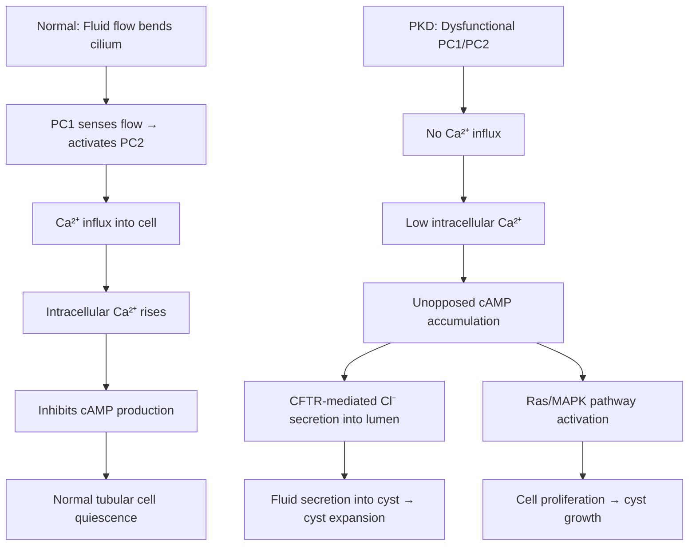
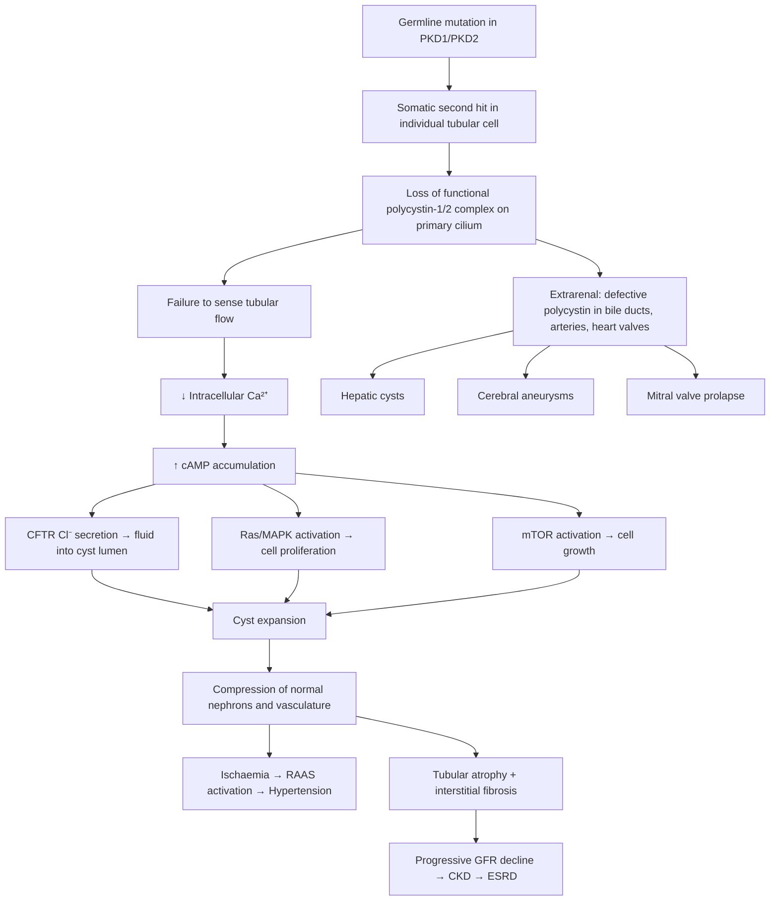

# Polycystic Kidney Disease (PKD)

## 1. Definition

Polycystic Kidney Disease (PKD) refers to a group of **inherited** disorders characterised by the progressive development of multiple fluid-filled, epithelial-lined cysts within the renal parenchyma, leading to massive bilateral kidney enlargement and eventual loss of renal function. The name itself tells you the condition: "poly" = many, "cystic" = cysts (fluid-filled sacs), "kidney disease."

There are two major forms:

1. **Autosomal Dominant Polycystic Kidney Disease (ADPKD)** — the "adult" form, the overwhelmingly more common type
2. **Autosomal Recessive Polycystic Kidney Disease (ARPKD)** — the "infantile" form, rare but severe

These are fundamentally different diseases at the genetic, pathological, and clinical level — they just happen to share the feature of renal cysts. Throughout these notes, the primary focus is on **ADPKD** unless otherwise stated, as it is the one you will encounter in clinical practice and exams far more frequently.

<Callout title="Key Conceptual Point">
  PKD is NOT the same as having "multiple simple renal cysts." Simple cysts are
  acquired, increase with age, and are benign. PKD is a genetic, progressive,
  systemic disorder with extrarenal manifestations. The distinction matters
  enormously for prognosis and management.
</Callout>

---

## 2. Epidemiology

### ADPKD

- **Incidence**: approximately **1 in 400 to 1 in 1,000** live births [1]
- **Most common inherited kidney disease** and the **4th leading cause of end-stage renal disease (ESRD)** worldwide
- Accounts for approximately **5–10% of all patients on renal replacement therapy (RRT)** globally
- **No racial predilection** — occurs equally across all ethnic groups
- Affects males and females equally (autosomal dominant inheritance — not sex-linked)
- Median age at ESRD: **~54 years for PKD1** mutations, **~74 years for PKD2** mutations [1]
- In **Hong Kong**, PKD is listed among the congenital/inherited causes of CKD, accounting for approximately **5%** of CKD cases [2]
- **_Cerebral aneurysms are found in 2–5% of the adult population but are significantly more prevalent in ADPKD patients (approximately 8–12%)_** [3]

### ARPKD

- **Incidence**: approximately **1 in 20,000** live births [1]
- Carrier frequency ~1 in 70
- Presents in the perinatal/neonatal period or childhood
- Significant perinatal mortality (up to 30–50%) due to pulmonary hypoplasia from oligohydramnios

> **High Yield**: ADPKD is one of the most common monogenic (single-gene) disorders in humans. It is more common than sickle cell disease, cystic fibrosis, haemophilia, and Down syndrome combined.

---

## 3. Risk Factors

Since PKD is a genetic disease, the primary "risk factor" is having the mutation. However, several factors influence **disease severity and rate of progression**:

| Factor                                           | Effect on Progression                                              | Mechanism                                                                             |
| ------------------------------------------------ | ------------------------------------------------------------------ | ------------------------------------------------------------------------------------- |
| **PKD1 mutation** (vs PKD2)                      | Earlier onset ESRD (~54 vs ~74 years)                              | PKD1 produces more severe cystogenesis due to greater loss of functional polycystin-1 |
| **Truncating PKD1 mutation** (vs non-truncating) | Worse prognosis                                                    | Complete loss of polycystin-1 function                                                |
| **Male sex**                                     | Slightly faster progression                                        | Possible hormonal influence (androgens may promote cyst growth)                       |
| **Hypertension**                                 | Accelerates CKD progression                                        | Activates RAAS → further cyst growth + renal fibrosis                                 |
| **Large kidney volume (TKV)**                    | Predictor of future GFR decline                                    | Directly reflects cyst burden                                                         |
| **Gross haematuria before age 30**               | Worse prognosis                                                    | Reflects more aggressive cystogenesis                                                 |
| **Proteinuria**                                  | Worse prognosis                                                    | Indicates more advanced parenchymal damage                                            |
| **Early onset of symptoms**                      | Worse prognosis                                                    | Reflects more aggressive disease                                                      |
| **Family history of early ESRD**                 | Increased risk                                                     | Shared genetic modifier effects                                                       |
| **High salt intake, caffeine**                   | May accelerate cyst growth                                         | cAMP stimulation (caffeine), volume expansion (salt)                                  |
| **_Smoking, obesity, hypertension_**             | Also risk factors for associated complications such as RCC and CVD | General cardiovascular risk factors that compound PKD morbidity [4][5]                |

<Callout title="Exam Pearl" type="idea">
The single most important prognostic factor in ADPKD is the **genotype**: PKD1 truncating > PKD1 non-truncating > PKD2. The second most important measurable predictor of progression is **total kidney volume (TKV)** on MRI.
</Callout>

---

## 4. Anatomy and Function (Relevant Normal Kidney Anatomy)

To understand PKD, you need to understand what cysts are replacing.

### Normal Kidney Structure

- Each kidney contains approximately **1 million nephrons**
- Each nephron consists of:
  - **Glomerulus** (filtration)
  - **Proximal convoluted tubule** (reabsorption of ~65% filtrate, glucose, amino acids, bicarbonate, phosphate)
  - **Loop of Henle** (countercurrent mechanism, concentration/dilution)
  - **Distal convoluted tubule** (fine-tuning of Na⁺, K⁺, Ca²⁺)
  - **Collecting duct** (final concentration via ADH, acid-base via intercalated cells)
- Renal blood supply: **renal artery → segmental → interlobar → arcuate → interlobular → afferent arteriole → glomerulus → efferent arteriole → peritubular capillaries/vasa recta**

### Why This Matters in PKD

- In **ADPKD**, cysts arise from **all segments** of the nephron (glomerulus through collecting duct). Only about **1–5% of nephrons** develop cysts, but these cysts expand progressively and compress surrounding normal parenchyma.
- In **ARPKD**, cysts arise specifically from the **collecting ducts** — they are characteristically fusiform (spindle-shaped) dilatations of the collecting ducts, giving a radial/medullary ray pattern on imaging.

### Relevant Extrarenal Anatomy

ADPKD is a **systemic ciliopathy** — the proteins involved (polycystin-1 and polycystin-2) are expressed in:

- **Bile ducts** → hepatic cysts
- **Pancreatic ducts** → pancreatic cysts
- **Seminal vesicles** → seminal vesicle cysts
- **Arachnoid membrane** → arachnoid cysts
- **Arterial walls** → **_cerebral aneurysms_** [3]
- **Cardiac valves** → mitral valve prolapse
- **Colonic wall** → colonic diverticula

---

## 5. Etiology and Pathophysiology

### 5.1 Genetic Basis

#### ADPKD (Autosomal Dominant)

| Gene                    | Chromosome             | Protein                              | Frequency         | Phenotype Severity     |
| ----------------------- | ---------------------- | ------------------------------------ | ----------------- | ---------------------- |
| **PKD1**                | **Chromosome 16p13.3** | **Polycystin-1** (PC1)               | **~85%** of ADPKD | More severe; ESRD ~54y |
| **PKD2**                | **Chromosome 4q21**    | **Polycystin-2** (PC2)               | **~15%** of ADPKD | Less severe; ESRD ~74y |
| **GANAB** / **DNAJB11** | Various                | Glucosidase IIα / HSP40 co-chaperone | Rare (< 1%)       | Milder phenotype       |

[1][2]

- Inheritance is **autosomal dominant** — each child of an affected parent has a **50% chance** of inheriting the disease
- However, **~10% of cases are de novo mutations** (no family history)
- Disease expression follows the **"two-hit" hypothesis** (Knudson's model, similar to retinoblastoma):
  - Every cell has **one normal allele and one mutant allele** (the germline mutation)
  - Cyst formation requires a **second somatic "hit"** (loss or mutation of the remaining normal allele) in individual tubular epithelial cells
  - This explains why only **1–5% of nephrons** develop cysts despite every cell carrying the germline mutation
  - It also explains the **variability** in cyst distribution and the **focal** nature of cyst development

<Callout title="Why PKD1 is worse than PKD2">
  Think of it this way: Polycystin-1 is the larger, more critical signaling
  molecule. With PKD1 mutations, the threshold for the "second hit" is lower
  (the remaining normal allele needs less damage to lose function), so more
  nephrons develop cysts earlier. PKD2 patients have a higher threshold, so they
  develop fewer cysts, later.
</Callout>

#### ARPKD (Autosomal Recessive)

| Gene      | Chromosome          | Protein                      | Feature                                              |
| --------- | ------------------- | ---------------------------- | ---------------------------------------------------- |
| **PKHD1** | **Chromosome 6p12** | **Fibrocystin / Polyductin** | Expressed in collecting ducts and biliary epithelium |

[1]

- Both alleles must be mutated → much rarer
- The severity of ARPKD depends on the nature of the mutations:
  - **Two truncating mutations** → usually lethal in utero or neonatal period
  - **At least one missense mutation** → milder phenotype, may survive to childhood/adolescence
- Always associated with **congenital hepatic fibrosis** (ductal plate malformation)

### 5.2 Pathophysiology — The Ciliopathy Model

This is the crucial concept. ADPKD is a **ciliopathy** — a disease of the **primary cilium**.

#### What Is the Primary Cilium?

- A **non-motile, antenna-like structure** projecting from the apical surface of almost every cell, including renal tubular epithelial cells
- It acts as a **mechanosensor** — detecting fluid flow in the tubular lumen
- When urine flows over the cilium, it bends → triggers an influx of **Ca²⁺** into the cell via the **polycystin-1/polycystin-2 complex**

#### The Polycystin-1/Polycystin-2 Complex

- **Polycystin-1 (PC1)**: a large transmembrane protein that acts as a **mechanoreceptor** on the primary cilium. It senses fluid flow and transduces the signal.
- **Polycystin-2 (PC2)**: a **calcium-permeable cation channel** (a member of the TRP channel family — Transient Receptor Potential). It is the effector that allows Ca²⁺ to enter the cell when PC1 is activated.
- Together, they form a **receptor-channel complex** on the primary cilium.

#### What Happens When the Complex Fails (in PKD)?

The key downstream consequences of dysfunctional polycystins are:

1. **↓ Intracellular Ca²⁺** → loss of the inhibitory brake on cAMP
2. **↑ cAMP (cyclic AMP)** → the central driver of cystogenesis:
   - **Stimulates fluid secretion** via CFTR (Cystic Fibrosis Transmembrane Conductance Regulator) chloride channels on the apical membrane → Cl⁻ secretion into the cyst lumen → Na⁺ and water follow osmotically → **cyst expansion**
   - **Stimulates cell proliferation** via the Ras/MAPK and mTOR pathways → **cyst wall growth**
3. **Altered cell polarity** — the Na⁺/K⁺-ATPase is mislocalized to the apical surface (normally basolateral) → further drives fluid secretion into the cyst
4. **Abnormal extracellular matrix remodeling** → fibrosis of surrounding tissue

<Callout title="Why Tolvaptan Works — The cAMP Connection" type="idea">
  Tolvaptan is a **vasopressin V2-receptor antagonist**. In renal collecting
  duct cells, ADH (vasopressin) binds V2 receptors → activates adenylyl cyclase
  → ↑cAMP. In PKD, this cAMP drives cyst growth. By blocking V2 receptors,
  tolvaptan **reduces cAMP** in collecting duct cells → slows cyst growth and
  fluid secretion. This is the basis of its use as the only approved
  disease-modifying therapy for ADPKD.
</Callout>

### 5.3 Cyst Growth and Renal Consequences

Once cysts form, they undergo **progressive, relentless expansion**:

- Cysts enlarge at an average rate of **~5% per year** in total kidney volume (TKV)
- Cysts compress adjacent normal nephrons → ischaemia, atrophy, and interstitial fibrosis
- **Renal function (GFR) is maintained** for a remarkably long time because the remaining nephrons undergo compensatory hyperfiltration
- GFR typically remains normal until kidney volume exceeds **~1500 mL** (normal ≈ 150–200 mL per kidney)
- Once GFR starts declining, it drops at approximately **4.4–5.9 mL/min/year**

This gives rise to the characteristic clinical pattern: **years of preserved GFR → then relatively rapid decline → ESRD**

### 5.4 Pathophysiology of Hypertension in ADPKD

Hypertension occurs in **~60% of ADPKD patients before any decline in GFR** — this is a crucial distinguishing feature from other CKD causes where hypertension is a late feature.

The mechanism is **intrarenal RAAS activation**:

- Expanding cysts compress adjacent renal vasculature → regional ischaemia
- Ischaemic juxtaglomerular cells sense ↓perfusion → secrete **renin**
- Renin → angiotensinogen → angiotensin I → angiotensin II → **vasoconstriction + aldosterone secretion → sodium and water retention → hypertension**
- This is essentially a form of **"intrarenal renal artery stenosis"** — multiple small areas of ischaemia from cyst compression

### 5.5 Pathophysiology of Extrarenal Manifestations

Because polycystin-1 and polycystin-2 are expressed ubiquitously, ADPKD is truly a **systemic disease**:

| Extrarenal Manifestation                | Prevalence                                             | Mechanism                                                                                                                             |
| --------------------------------------- | ------------------------------------------------------ | ------------------------------------------------------------------------------------------------------------------------------------- |
| **Hepatic cysts**                       | 83% by age 30-40; most common extrarenal manifestation | Same ciliopathy mechanism in bile duct epithelium; estrogen-dependent (more common/severe in women, especially multiparous)           |
| **Pancreatic cysts**                    | ~5–10%                                                 | Ciliopathy in pancreatic duct epithelium                                                                                              |
| **Seminal vesicle cysts**               | ~40% of males                                          | Ciliopathy in seminal vesicle epithelium → may contribute to infertility                                                              |
| **_Cerebral (intracranial) aneurysms_** | **_~8–12% (vs 2–5% general population)_**              | Defective polycystin in arterial wall smooth muscle → weakness of vessel wall, especially at bifurcations of the Circle of Willis [3] |
| **Mitral valve prolapse**               | ~25%                                                   | Defective connective tissue in valve leaflets                                                                                         |
| **Aortic root dilatation**              | ~8%                                                    | Connective tissue abnormality in aortic root                                                                                          |
| **Colonic diverticula**                 | Increased prevalence                                   | Connective tissue weakness in colonic wall                                                                                            |
| **Abdominal wall and inguinal hernias** | Increased prevalence                                   | Connective tissue weakness                                                                                                            |

---

## 6. Classification

### 6.1 By Inheritance Pattern

| Feature             | ADPKD                                       | ARPKD                                                                       |
| ------------------- | ------------------------------------------- | --------------------------------------------------------------------------- |
| Inheritance         | Autosomal dominant                          | Autosomal recessive                                                         |
| Gene(s)             | PKD1 (85%), PKD2 (15%)                      | PKHD1                                                                       |
| Protein             | Polycystin-1, Polycystin-2                  | Fibrocystin/Polyductin                                                      |
| Chromosome          | 16p13.3, 4q21                               | 6p12                                                                        |
| Age of presentation | Usually 30–50 years                         | Perinatal/neonatal/childhood                                                |
| Cyst origin         | All nephron segments                        | Collecting ducts only                                                       |
| Cyst morphology     | Spherical, variable size (mm to >10 cm)     | Fusiform, small, uniform; radial medullary ray pattern                      |
| Kidney size         | Massively enlarged (may reach >3 kg each)   | Enlarged but smoother contour                                               |
| Liver involvement   | Hepatic cysts (very common)                 | Congenital hepatic fibrosis (invariable) → portal hypertension, cholangitis |
| Other associations  | Cerebral aneurysm, MVP, colonic diverticula | Pulmonary hypoplasia (if severe, from oligohydramnios)                      |
| Prognosis           | ESRD in 50s–70s depending on genotype       | Many die in perinatal period; survivors develop portal HTN and CKD          |

### 6.2 ADPKD by Genotype

|                                   | PKD1          | PKD2        |
| --------------------------------- | ------------- | ----------- |
| Proportion                        | ~85%          | ~15%        |
| Mean age at diagnosis             | 30–35 years   | 45–50 years |
| Mean age at ESRD                  | ~54 years     | ~74 years   |
| Mean number of cysts at diagnosis | More          | Fewer       |
| Severity of hypertension          | Earlier onset | Later onset |
| Risk of cerebral aneurysm         | Similar       | Similar     |

### 6.3 Mayo Classification (for Risk Stratification)

The **Mayo Imaging Classification** uses **height-adjusted total kidney volume (htTKV)** on MRI to classify ADPKD patients into risk categories (Classes 1A–1E):

| Class  | htTKV growth rate (%/year) | Risk of GFR decline |
| ------ | -------------------------- | ------------------- |
| **1A** | < 1.5%                     | Low                 |
| **1B** | 1.5–3.0%                   | Low-intermediate    |
| **1C** | 3.0–4.5%                   | Intermediate        |
| **1D** | 4.5–6.0%                   | High                |
| **1E** | > 6.0%                     | Very high           |

> **High Yield**: Tolvaptan is indicated for patients with **rapidly progressive disease** (typically Mayo Class 1C–1E, or evidence of rapid GFR decline). The Mayo classification helps identify who will benefit most.

---

## 7. Clinical Features

### 7.1 Symptoms

The clinical features of ADPKD are dominated by the consequences of **progressive cyst enlargement** and **extrarenal manifestations**. Most patients are **asymptomatic until age 30–50**.

#### Renal Symptoms

| Symptom                                                           | Pathophysiological Basis                                                                                                                                                                                                                                                                                                                    |
| ----------------------------------------------------------------- | ------------------------------------------------------------------------------------------------------------------------------------------------------------------------------------------------------------------------------------------------------------------------------------------------------------------------------------------- |
| **Flank/loin pain or abdominal heaviness**                        | Progressive cyst enlargement stretches the **renal capsule** (richly innervated). Large kidneys may cause a dragging sensation. Pain can also be from cyst haemorrhage or infection.                                                                                                                                                        |
| **Acute severe flank pain**                                       | **Cyst haemorrhage** (sudden expansion of cyst stretches capsule) or **cyst rupture** (blood/fluid irritating perinephric tissue). Also consider renal stones.                                                                                                                                                                              |
| **Gross haematuria**                                              | **Cyst haemorrhage** rupturing into the collecting system; or passage of **renal stones**; or UTI. Occurs in ~42–50% of patients at some point.                                                                                                                                                                                             |
| **_Polyuria, nocturia, urinary frequency, increased thirst_** [1] | Early concentrating defect — expanding cysts disrupt the medullary architecture needed for the countercurrent concentrating mechanism (Loop of Henle and vasa recta are compressed). The kidneys lose the ability to concentrate urine → obligatory water loss → **nephrogenic diabetes insipidus-like picture** → compensatory polydipsia. |
| **Renal colic**                                                   | **Nephrolithiasis** — stones occur in ~20–30% of ADPKD patients. Two mechanisms: (1) urinary stasis in distorted collecting system; (2) low urinary citrate and low urinary pH (metabolic disturbances from tubular dysfunction). Most stones are **uric acid** or **calcium oxalate**.                                                     |
| **Recurrent UTIs**                                                | Urinary stasis in distorted collecting system + cyst fluid is an excellent culture medium. Cyst infections (particularly in females) are a major source of morbidity.                                                                                                                                                                       |
| **Early satiety, abdominal distension**                           | Massive renal (and hepatic) enlargement compresses the stomach and intestines → early satiety, bloating, and sometimes gastro-oesophageal reflux.                                                                                                                                                                                           |

#### Symptoms from Extrarenal Manifestations

| Symptom                                   | Pathophysiological Basis                                                                                                                                                                                                        |
| ----------------------------------------- | ------------------------------------------------------------------------------------------------------------------------------------------------------------------------------------------------------------------------------- |
| **Thunderclap headache**                  | **_Subarachnoid haemorrhage (SAH) from rupture of a cerebral (intracranial) aneurysm_** — ADPKD patients have ~5× the risk. Aneurysms are typically at the **Circle of Willis**, especially the anterior circulation (90%) [3]. |
| **Chronic headache**                      | May relate to unruptured intracranial aneurysm (mass effect), but also hypertension is very common and can cause headache.                                                                                                      |
| **Right upper quadrant pain/discomfort**  | **Hepatic cysts** — especially in women (estrogen-dependent); massive hepatic cyst burden can cause mechanical symptoms.                                                                                                        |
| **Recurrent cholangitis** (more in ARPKD) | In ARPKD, biliary dysgenesis and congenital hepatic fibrosis predispose to ascending cholangitis.                                                                                                                               |
| **Chest pain, palpitations**              | **Mitral valve prolapse** (~25%) → may cause atypical chest pain or palpitations from associated mitral regurgitation or arrhythmia.                                                                                            |

#### Symptoms from CKD Progression (Late)

As renal function declines, standard **uraemic symptoms** develop:

- Fatigue, malaise, anorexia, nausea, vomiting
- Pruritus (phosphate retention)
- Peripheral oedema, breathlessness (fluid overload)
- Muscle cramps, restless legs
- Cognitive impairment, confusion (uraemic encephalopathy in severe cases)

### 7.2 Signs

#### General Inspection

| Sign                                                    | Pathophysiological Basis                                                                                                                                                                                                                                    |
| ------------------------------------------------------- | ----------------------------------------------------------------------------------------------------------------------------------------------------------------------------------------------------------------------------------------------------------- |
| **Hypertension** (often the first clinical abnormality) | Intrarenal RAAS activation from cyst compression of renal vasculature → renin secretion → angiotensin II → vasoconstriction and aldosterone-mediated Na⁺/water retention. **Present in ~60% before any GFR decline.**                                       |
| **Pallor**                                              | Anaemia of CKD (↓erythropoietin production from destroyed renal interstitial cells). Note: ADPKD patients tend to have **less severe anaemia** than other CKD patients at the same GFR, because the cyst lining cells retain some EPO-producing capability. |

#### Abdominal Examination

| Sign                                           | Pathophysiological Basis                                                                                                                                                                                                                                       |
| ---------------------------------------------- | -------------------------------------------------------------------------------------------------------------------------------------------------------------------------------------------------------------------------------------------------------------- |
| **_Bilateral palpable, enlarged kidneys_** [6] | Progressive cyst growth → kidneys may reach **20–40 cm** in length (normal ~10–12 cm) and weigh up to **3–8 kg** each (normal ~150 g). Kidneys are **ballotable**, have an **irregular (bosselated/lobulated) surface**, and are **bimanually palpable**.      |
| **Hepatomegaly**                               | **_Polycystic liver_** — hepatic cysts are the most common extrarenal manifestation [6]. Liver may also have an irregular/bosselated surface. Liver function is usually preserved (unlike ARPKD where congenital hepatic fibrosis causes portal hypertension). |
| **Abdominal distension**                       | Massively enlarged kidneys ± hepatomegaly ± ascites (if nephrotic range proteinuria or portal HTN in ARPKD). [6]                                                                                                                                               |
| **Loin tenderness**                            | Cyst infection, cyst haemorrhage, or renal calculi.                                                                                                                                                                                                            |
| **Costovertebral angle tenderness**            | Pyelonephritis superimposed on structural abnormality.                                                                                                                                                                                                         |

<Callout title="Physical Examination Pearl">
  On abdominal examination of a patient with bilateral palpable kidneys, the
  differential diagnosis is limited. **The most common cause of bilaterally
  palpable kidneys in an adult is ADPKD.** Other causes include bilateral
  hydronephrosis, bilateral RCC (extremely rare), amyloidosis, lymphomatous
  infiltration, and diabetic nephropathy (early stages with hyperfiltration)
  [6].
</Callout>

#### Cardiovascular Examination

| Sign                                          | Pathophysiological Basis                                                                                                                 |
| --------------------------------------------- | ---------------------------------------------------------------------------------------------------------------------------------------- |
| **Elevated blood pressure**                   | As above — RAAS activation.                                                                                                              |
| **Mid-systolic click ± late systolic murmur** | **Mitral valve prolapse** — defective polycystin in valve connective tissue → myxomatous degeneration → leaflet prolapse during systole. |
| **Aortic regurgitation murmur** (rare)        | Aortic root dilatation from connective tissue abnormality.                                                                               |
| **Signs of left ventricular hypertrophy**     | Chronic hypertension → pressure overload → concentric LVH (sustained apical impulse, S4 gallop).                                         |

#### Other Signs

| Sign                                   | Pathophysiological Basis                                                                                                       |
| -------------------------------------- | ------------------------------------------------------------------------------------------------------------------------------ |
| **Inguinal or abdominal wall hernias** | Connective tissue defect + chronic increased intra-abdominal pressure from massive kidney/liver enlargement.                   |
| **AV fistula or Tenckhoff catheter**   | Evidence of renal replacement therapy if the patient has progressed to ESRD [6].                                               |
| **Transplant scar in iliac fossa**     | Post-renal transplantation [6].                                                                                                |
| **Peripheral oedema**                  | Fluid retention from CKD (late); or nephrotic syndrome (uncommon in PKD).                                                      |
| **Signs of uraemia** (late)            | Sallow complexion, excoriations from scratching (pruritus), uraemic frost (very late/severe — rarely seen in modern practice). |

#### Neurological Signs (If Complications)

| Sign                                               | Basis                                                                                                                   |
| -------------------------------------------------- | ----------------------------------------------------------------------------------------------------------------------- |
| **_CN III palsy (non-pupil-sparing, "surgical")_** | **_Posterior communicating artery aneurysm_** compressing CN III → ptosis, "down and out" eye, fixed dilated pupil [3]. |
| **Meningismus (neck stiffness, photophobia)**      | **_SAH from ruptured intracranial aneurysm_** [3].                                                                      |
| **Focal neurological deficits**                    | Mass effect from large unruptured aneurysm, or stroke from thromboembolic event.                                        |

---

## 8. Pathophysiology Summary Diagram

---

## 9. Key Differences: ADPKD vs ARPKD (Summary Table)

| Feature         | ADPKD                              | ARPKD                                                                        |
| --------------- | ---------------------------------- | ---------------------------------------------------------------------------- |
| Inheritance     | Autosomal dominant                 | Autosomal recessive                                                          |
| Gene            | PKD1, PKD2                         | PKHD1                                                                        |
| Protein         | Polycystin-1, Polycystin-2         | Fibrocystin                                                                  |
| Onset           | Adulthood (30–50 y)                | Perinatal/neonatal/childhood                                                 |
| Cyst origin     | All nephron segments               | Collecting ducts                                                             |
| Cyst appearance | Spherical, variable size           | Fusiform, small, radial pattern                                              |
| Kidney size     | Massively enlarged, bosselated     | Enlarged, smoother                                                           |
| Liver           | Hepatic cysts (function preserved) | **Congenital hepatic fibrosis** → **_portal hypertension, cholangitis_** [1] |
| CNS             | Cerebral aneurysms (~8–12%)        | Not typically                                                                |
| CVS             | MVP, aortic root dilatation        | Not typical                                                                  |
| Renal stones    | Common (~20–30%)                   | Less common                                                                  |
| Prognosis       | ESRD in 50s–70s                    | High perinatal mortality; survivors develop CKD + portal HTN                 |

---

<Callout title="High Yield Summary">

**Polycystic Kidney Disease — Key Points for Exams:**

1. **ADPKD** is the most common inherited kidney disease (1 in 400–1000). Autosomal dominant. PKD1 (85%, chromosome 16, worse) vs PKD2 (15%, chromosome 4, milder).
2. **Pathophysiology**: ciliopathy → dysfunctional polycystin-1/2 complex on primary cilium → ↓Ca²⁺ influx → ↑cAMP → fluid secretion (CFTR) and cell proliferation (Ras/MAPK, mTOR) → cyst growth.
3. **Two-hit hypothesis**: germline mutation + somatic second hit → explains why only 1–5% of nephrons form cysts.
4. **Clinical presentation**: flank pain, haematuria, hypertension (early, RAAS-mediated), UTIs, renal stones, bilateral palpable kidneys. Polyuria/nocturia from concentrating defect.
5. **Extrarenal**: hepatic cysts (most common), **_cerebral aneurysms (8–12%)_** [3], MVP, colonic diverticula.
6. **Hypertension** occurs early (60% before GFR decline) due to intrarenal RAAS activation from cyst compression of vasculature.
7. **ARPKD**: PKHD1 gene, collecting duct cysts, congenital hepatic fibrosis, presents perinatally.
8. **Tolvaptan** (V2 receptor antagonist) works by ↓cAMP in collecting duct cells → slows cyst growth.
9. **Screening**: first-degree relatives with renal ultrasound; cerebral aneurysm screening with MRA for high-risk patients (FHx of aneurysm/SAH).
10. **_ADPKD is a predisposing factor for cerebral aneurysm and SAH_** [3], and **_acquired cystic kidney disease (from chronic dialysis) is a risk factor for RCC_** [4][5].

</Callout>

---

<ActiveRecallQuiz
  title="Active Recall - Polycystic Kidney Disease (Pre-DDx/Dx/Mx)"
  items={[
    {
      question:
        "Name the two genes responsible for ADPKD, their chromosomes, proteins, and which has worse prognosis.",
      markscheme:
        "PKD1 on chromosome 16p13.3 encoding polycystin-1 (85%, ESRD ~54y, worse prognosis); PKD2 on chromosome 4q21 encoding polycystin-2 (15%, ESRD ~74y, better prognosis).",
    },
    {
      question:
        "Explain the two-hit hypothesis in ADPKD and why only 1-5% of nephrons develop cysts despite every cell carrying the mutation.",
      markscheme:
        "All cells carry one germline mutant allele. Cyst formation requires a second somatic hit (loss of the remaining normal allele) in individual tubular cells. Since this is a stochastic event, only a minority of nephrons lose both alleles and form cysts.",
    },
    {
      question:
        "What is the central molecular driver of cyst growth in ADPKD, and how does tolvaptan target this?",
      markscheme:
        "Elevated cAMP (from loss of polycystin-mediated Ca2+ influx which normally inhibits cAMP). cAMP drives fluid secretion via CFTR and cell proliferation via Ras/MAPK. Tolvaptan blocks vasopressin V2 receptors on collecting duct cells, reducing adenylyl cyclase activation and thus cAMP levels.",
    },
    {
      question:
        "Why does hypertension in ADPKD occur early (before GFR decline)?",
      markscheme:
        "Expanding cysts compress intrarenal blood vessels causing regional ischaemia. Juxtaglomerular cells sense reduced perfusion and secrete renin, activating RAAS (angiotensin II causes vasoconstriction; aldosterone causes Na/water retention). This is essentially intrarenal renal artery stenosis.",
    },
    {
      question:
        "List five extrarenal manifestations of ADPKD with their pathophysiological basis.",
      markscheme:
        "Hepatic cysts (ciliopathy in bile duct epithelium); cerebral aneurysms (defective polycystin in arterial wall, especially Circle of Willis); mitral valve prolapse (myxomatous degeneration from abnormal polycystin in valve tissue); pancreatic cysts (pancreatic duct ciliopathy); colonic diverticula (connective tissue weakness).",
    },
    {
      question:
        "A 35-year-old ADPKD patient presents with thunderclap headache and neck stiffness. What is the most likely diagnosis and why are ADPKD patients at risk?",
      markscheme:
        "Subarachnoid haemorrhage from ruptured intracranial aneurysm. ADPKD patients have 8-12% prevalence of cerebral aneurysms (vs 2-5% general population) due to defective polycystin expression in cerebral arterial walls causing vessel wall weakness, particularly at Circle of Willis bifurcations.",
    },
  ]}
/>

## References

[1] Senior notes: felixlai.md (Polycystic kidney disease section)
[2] Senior notes: Ryan Ho Urogenital.pdf (Section 5.2 Chronic Kidney Disease, p.99)
[3] Lecture slides: GC 109. Headache and loss of consciousness Acute stroke, subarachnoid haemorrhage and vascular malformation.pdf (p.14, slides 27–28)
[4] Lecture slides: GC 183. Common urological malignancies and their presentations - Nov 7.pdf (p.7 — RCC risk factors including chronic kidney disease and acquired cystic kidney disease)
[5] Senior notes: maxim.md (RCC risk factors section — PKD and acquired cystic diseases)
[6] Senior notes: Ryan Ho Fundamentals.pdf (p.115 — Abdominal examination, D/dx of palpable kidneys)
