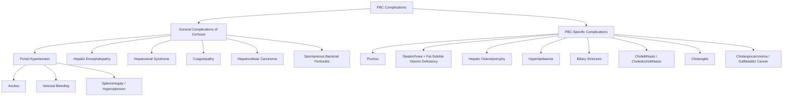

## Complications of Primary Biliary Cholangitis

### Organising Framework

Complications of PBC fall into two categories, exactly as the exam expects you to present them [1]:

1. **General complications of cirrhosis** — these occur once PBC has progressed to Stage 4 (cirrhosis) and are identical to complications of cirrhosis from *any* aetiology
2. **Specific complications of PBC** — unique to the cholestatic and autoimmune nature of PBC itself, and can occur *before* cirrhosis develops

Understanding this distinction is important because it tells you when to expect each complication and how to monitor for it. A patient with early PBC (Stage 1–2) may have severe pruritus and fat-soluble vitamin deficiency but will NOT have ascites or varices. A patient with PBC cirrhosis (Stage 4) can have ALL complications.

---

### Part A: General Complications of Cirrhosis

These occur when PBC progresses to **Stage 4 (cirrhosis)** [1]. The pathophysiology is the same as cirrhosis from any cause — the key driver is **architectural distortion of the liver** causing increased intrahepatic vascular resistance → **portal hypertension** → a cascade of downstream consequences, combined with **hepatocellular failure** → reduced synthetic and metabolic function.

#### 1. Portal Hypertension

Portal hypertension is the haemodynamic consequence of cirrhosis and is the root cause of most cirrhotic complications.

**Why does PBC cause portal hypertension?**
- Progressive fibrosis → regenerative nodules compress sinusoids and hepatic venules → increased intrahepatic vascular resistance
- Activated hepatic stellate cells contract around sinusoids → further increases resistance
- Portal pressure gradient > 5 mmHg = portal hypertension; > 10 mmHg = clinically significant (varices form); > 12 mmHg = variceal bleeding risk

##### a. Ascites

***Abdominal distension from ascites*** [1]

- **Pathophysiology**: Portal hypertension → splanchnic vasodilation (NO-mediated) → reduced effective arterial blood volume → RAAS activation + ADH secretion → sodium and water retention → fluid transudation into peritoneal cavity. Simultaneously, hypoalbuminaemia (reduced hepatic synthesis) reduces plasma oncotic pressure → further fluid shift.
- **Clinical correlation**: The case study patient had ***progressive abdominal swelling, which was only partially controlled by diuretics*** [1], requiring ***repeated hospital admission for paracentesis*** [1] — this represents refractory ascites, a transplant indication.
- **Complications of ascites**: Spontaneous bacterial peritonitis (SBP), abdominal discomfort, respiratory compromise, umbilical hernia
- **Management**: Sodium restriction, spironolactone ± furosemide, large-volume paracentesis with albumin replacement, TIPS for refractory cases, transplant

##### b. Variceal Bleeding

***Haematemesis from oesophageal variceal bleeding*** [1]

- **Pathophysiology**: Portal hypertension → blood seeks alternative routes to bypass the liver → portosystemic collaterals develop at sites of portal-systemic anastomosis:
  - **Oesophageal/gastric varices** (left gastric vein → oesophageal veins → azygos system)
  - **Rectal varices** (superior rectal → middle/inferior rectal veins)
  - **Caput medusae** (recanalised umbilical vein → epigastric veins)
  - **Retroperitoneal collaterals**
- Oesophageal varices are thin-walled and under high pressure → rupture → massive UGIB → haematemesis and/or melaena
- **Mortality**: 15–20% per bleeding episode, even with modern treatment
- **Surveillance**: OGD screening when cirrhosis diagnosed; repeat 1–3 yearly
- **Management**: Non-selective beta-blockers (propranolol/carvedilol) for primary prophylaxis; endoscopic band ligation + terlipressin for acute bleeding; TIPS if refractory

##### c. Splenomegaly and Hypersplenism

- **Pathophysiology**: Portal hypertension → congestion of splenic vein → splenic engorgement → splenomegaly → excessive sequestration and destruction of blood cells in the enlarged spleen → **pancytopenia** (thrombocytopenia most prominent, then leukopenia, then anaemia)
- Reduced thrombopoietin production by the diseased liver also contributes to thrombocytopenia

#### 2. Hepatic Encephalopathy

***Confusion from hepatic encephalopathy*** [1]

**Pathophysiology**: Two mechanisms work in concert:
1. **Hepatocellular failure** → liver cannot metabolise ammonia (via urea cycle) → hyperammonaemia
2. **Portosystemic shunting** → gut-derived toxins (ammonia, mercaptans, short-chain fatty acids, GABA-like substances) bypass the liver entirely via collaterals → reach the systemic circulation and cross the blood-brain barrier

Ammonia (NH₃) is lipophilic → crosses BBB → converted to glutamine by astrocytes → osmotic astrocyte swelling → cerebral oedema → impaired neurotransmission

**Clinical features** [1]:
- ***Drowsy to comatose*** [1]
- ***Flapping tremor (asterixis)*** [1] — caused by sudden involuntary loss of muscle tone during sustained posture; reflects impaired motor neuron function from neurotoxins
- ***Fetor hepaticus*** [1] — sweet, musty odour on breath from dimethyl sulphide, a mercaptan that is normally metabolised by the liver
- Constructional apraxia, day-night reversal, personality change (early)

**Grading (West Haven criteria)**:
- Grade 0: Subclinical (detectable only on psychometric testing)
- Grade 1: Mild confusion, altered sleep
- Grade 2: Drowsy, inappropriate behaviour, asterixis
- Grade 3: Somnolent but arousable, gross disorientation
- Grade 4: Coma

***Precipitating factors*** [1]:
- ***↑ Protein intake*** [1]
- ***GI bleeding*** [1] — provides a massive protein (haemoglobin) load to the gut
- ***Constipation*** [1] — prolongs ammonia absorption from gut
- ***Infection (especially SBP)*** [1]
- ***Over-diuresis*** [1] — hypovolaemia, hypokalaemia, metabolic alkalosis (alkalotic pH favours NH₃ over NH₄⁺ → more ammonia crosses BBB)
- ***Inappropriate paracentesis without adequate albumin infusion*** [1]
- ***Shunting procedures including TIPS*** [1]
- ***Drugs — hypnotics*** [1]

**The case study illustrates this perfectly**: the patient ***became drowsy after celebrating her daughter's marriage*** [1] — likely precipitated by increased protein intake at the celebration → diagnosed with ***"liver coma"*** [1] → managed with ***low protein diet and laxatives (lactulose)*** [1].

**Management** [1]:
- ***IV Dextrose drip — provide adequate calorie intake to prevent protein breakdown*** [1]
- ***Oral Lactulose — inducing bowel movements 2–4 times per day*** [1]
- Lactulose mechanism: ***Non-absorbable disaccharide → osmotic laxative → acidifies colonic pH → converts NH₃ to NH₄⁺ (trapped, non-absorbable) → faecal excretion*** [1]
- Rifaximin (non-absorbable antibiotic) — reduces ammonia-producing gut bacteria; used for secondary prophylaxis
- ***Identify and treat precipitating factor*** [1]

#### 3. Hepatorenal Syndrome (HRS)

- **Pathophysiology**: Advanced cirrhosis → severe splanchnic vasodilation → arterial underfilling → intense renal vasoconstriction (RAAS, sympathetic nervous system, ADH) → functional renal failure with structurally normal kidneys
- **Type 1 (HRS-AKI)**: Rapid deterioration (doubling of creatinine in < 2 weeks); often triggered by SBP; very poor prognosis without transplant
- **Type 2 (HRS-CKD)**: Slower progression; associated with refractory ascites
- **Management**: IV albumin + terlipressin (splanchnic vasoconstrictor → reverses the underfilling); definitive treatment is transplant

#### 4. Coagulopathy

- **Pathophysiology**: The liver synthesises virtually ALL coagulation factors (except vWF, which is endothelial, and factor VIII). In cirrhosis:
  - Reduced synthesis of factors II, V, VII, IX, X, fibrinogen
  - Reduced synthesis of natural anticoagulants (protein C, protein S, antithrombin) — so cirrhosis is actually a *rebalanced* haemostatic state, not simply "anticoagulated"
  - Vitamin K malabsorption (from cholestasis) further reduces factors II, VII, IX, X specifically
  - Thrombocytopenia from hypersplenism
- **Clinical manifestation**: Easy bruising, prolonged PT/INR, increased bleeding risk from procedures

#### 5. Hepatocellular Carcinoma (HCC)

***Patients with PBC and cirrhosis are at increased risk of HCC*** [1][2].

- **Pathophysiology**: Cirrhosis of any cause creates a pro-carcinogenic environment — chronic inflammation → regenerative nodules → dysplastic nodules → hepatocellular carcinoma. The cycle of cell death, inflammation, and regeneration → accumulation of somatic mutations → malignant transformation.
- PBC is listed as an autoimmune cause of cirrhosis leading to HCC, alongside AIH and PSC [2][9].
- ***Any cause of cirrhosis: infection (HBV, HCV), metabolic (ALD, NAFLD, Wilson's disease), immune (PBC, PSC)*** [2] can lead to HCC.
- **Risk**: Lower than HBV/HCV-related cirrhosis (~4% lifetime in PBC cirrhosis vs ~20–30% in HBV cirrhosis), but still significant enough to warrant surveillance
- **Surveillance**: AFP + USS every 6 months in all PBC patients with established cirrhosis
- HCC in PBC tends to present later in the disease course (only after cirrhosis is established), unlike HBV where HCC can occur without cirrhosis

<Callout title="HCC Risk in PBC — Don't Forget Surveillance" type="error">
A common oversight: students remember to screen for HCC in HBV/HCV cirrhosis but forget that ***PBC cirrhosis also carries HCC risk*** [1][2]. Once a PBC patient reaches Stage 4 (cirrhosis), they need the same AFP + USS surveillance every 6 months as any other cirrhotic patient.
</Callout>

#### 6. Spontaneous Bacterial Peritonitis (SBP)

- **Pathophysiology**: Ascites provides a culture medium for bacteria. In cirrhosis, gut barrier function is impaired (portal hypertensive enteropathy) + immune dysfunction (reduced complement, opsonisation defects) → bacterial translocation from gut to ascitic fluid → SBP
- **Organisms**: Most commonly E. coli, Klebsiella, Streptococcus pneumoniae (monomicrobial)
- **Diagnosis**: Ascitic fluid PMN count ≥ 250/mm³
- **Treatment**: IV ceftriaxone or cefotaxime + IV albumin
- ***SBP is a precipitant of hepatic encephalopathy*** [1] and a transplant indication [1]

---

### Part B: PBC-Specific Complications

These are complications that arise from the **cholestatic nature** of PBC itself and can occur at **any stage**, including before cirrhosis develops. They are unique to PBC (and other cholestatic diseases) rather than being generic cirrhotic complications.

#### 1. Pruritus

***Pruritus*** [1]

- **Pathophysiology**: Cholestasis → accumulation of pruritogens in blood and skin. The key mediators are now understood to include:
  - **Lysophosphatidic acid (LPA)** — produced by the enzyme **autotaxin** (ATX); serum ATX levels correlate best with itch severity
  - **Bile acids** — activate TGR5 receptors on cutaneous sensory nerve fibres → itch signalling
  - **Endogenous opioids** — cholestasis upregulates opioidergic tone → opioid-mediated itch (explains why opioid antagonists help)
  - **Histamine** — may play a minor role, but antihistamines are generally ineffective in cholestatic pruritus (this is NOT histamine-mediated itch)
- **Clinical features**: Worst at night, can precede jaundice by months to years, may be so severe as to cause excoriations and sleep deprivation → quality of life impairment that alone can justify transplant listing
- **Management**: Stepwise — cholestyramine → rifampicin → naltrexone → IBAT inhibitors → transplant (covered in detail in the Management section)

<Callout title="Pruritus Is Not Just a Symptom — It's a Complication">
Pruritus in PBC deserves special emphasis because it can be the **most debilitating** aspect of the disease. Unlike pruritus from dermatological causes, cholestatic pruritus does NOT respond to antihistamines (because the mechanism involves autotaxin/LPA and opioid pathways, NOT histamine). Don't prescribe cetirizine and hope for the best — use the specific cholestatic itch ladder.
</Callout>

#### 2. Steatorrhoea and Fat-Soluble Vitamin Deficiency

***Steatorrhoea (malabsorption of dietary fat) and vitamin deficiency*** [1]

**Pathophysiology** — trace this from first principles:

1. PBC destroys bile ducts → **cholestasis** → reduced bile acid secretion into duodenum
2. Bile acids are essential for **micellar solubilisation** of dietary fat (long-chain triglycerides and fat-soluble vitamins)
3. Without micelles → fat cannot be absorbed across the intestinal epithelium → **steatorrhoea** (pale, bulky, foul-smelling, floating stools)
4. Fat-soluble vitamins (A, D, E, K) are co-absorbed with fat in micelles → **malabsorption of all four fat-soluble vitamins**

***Lipid malabsorption — result of decreased biliary secretion of bile acids*** [1]

***Fat-soluble vitamins A, D, E, K deficiency*** [1]:
- ***Vitamin A and D deficiency are more common requiring supplementation*** [1]
- ***Measurement of serum vitamin A and calcidiol is required*** [1]

| Vitamin | Consequence of Deficiency | Why This Vitamin Is Specifically Affected | Screening/Monitoring |
|---|---|---|---|
| **A** (Retinol) | Night blindness, xerophthalmia, immune dysfunction | Requires micelles for absorption; liver stores eventually depleted | Serum retinol |
| **D** (Cholecalciferol) | Osteomalacia (bone softening), contributes to osteoporosis, muscle weakness | Requires micelles; also liver hydroxylation (25-OH-D) may be impaired in advanced disease | ***Serum calcidiol (25-OH-vitamin D)*** [1] |
| **E** (α-Tocopherol) | Peripheral neuropathy, spinocerebellar ataxia, haemolytic anaemia (rare) | Requires micelles; body stores are limited | Serum α-tocopherol |
| **K** (Phylloquinone) | Coagulopathy — ↑ PT/INR, easy bruising, bleeding | Requires micelles; very limited body stores (days to weeks) | PT/INR; response to parenteral vitamin K |

**Mnemonic — Fat-soluble vitamins**: **"A, D, E, K"** — "**A** **D**ark, **E**mpty **K**itchen" (A = vision/dark adaptation, D = bones, E = nerves, K = Koagulation)

#### 3. Hepatic Osteodystrophy

***Hepatic osteodystrophy (Osteopenia/Osteoporosis/Osteomalacia)*** [1]

***Metabolic bone disease includes osteopenia and osteoporosis or rarely osteomalacia*** [1]

**Pathophysiology** — this is a "double hit" mechanism:

1. **Osteoporosis** (reduced bone formation): ***Characteristic bone disorder in primary biliary cirrhosis which reflects the inhibitory effect of a retained toxin on the osteoblast which prevents it from functioning normally*** [1]. Retained bile acids, bilirubin, and other cholestatic toxins directly inhibit osteoblast activity → reduced bone formation → osteoporosis. This is the dominant mechanism in PBC.

2. **Osteomalacia** (defective mineralisation): Vitamin D malabsorption → reduced calcium absorption from gut → inadequate mineralisation of osteoid → soft bones. This is less common because most patients receive vitamin D supplementation, but it can occur if supplementation is inadequate.

**Clinical consequences**: Vertebral compression fractures, hip fractures, chronic bone pain, kyphosis
**Prevalence**: Osteoporosis occurs in 20–45% of PBC patients; increases with disease duration
**Risk factors for worse bone disease**: Post-menopausal women (oestrogen withdrawal + PBC effects = compounded risk), advanced cholestasis, low BMI, smoking, corticosteroid use (if overlap syndrome)

**Management** [1]:
- DEXA scan at diagnosis and every 2–3 years
- ***Calcium and vitamin D supplementation*** [1]
- ***Bisphosphonates — example: Alendronate*** [1] (if T-score ≤ −2.5 or fracture history)
- IV zoledronic acid if oesophageal varices contraindicate oral bisphosphonates
- Weight-bearing exercise, falls prevention

#### 4. Hyperlipidaemia

***Hyperlipidaemia*** [1]

***Increased cholesterol level in PBC do not increase atherosclerotic risk*** [1]

**Pathophysiology**:
- Bile is the major excretory route for cholesterol. Cholestasis → impaired cholesterol excretion → accumulation in blood
- Additionally, lipoprotein metabolism is altered: increased HDL, appearance of **lipoprotein-X (Lp-X)** — an abnormal lipoprotein unique to cholestasis
- Lp-X is measured by some assays as "LDL" but is NOT atherogenic
- ***Majority are elevation of HDL and lipoprotein-X which are anti-atherogenic*** [1]

**Clinical features**: Xanthelasma (yellowish periorbital plaques), xanthomata (lipid deposits in tendons, skin creases), grossly elevated total cholesterol (sometimes > 15 mmol/L)

***Treatment is not always needed and is indicated only if familial or other known risk factors are present*** [1]

<Callout title="Don't Panic About the Cholesterol!">
Serum cholesterol in PBC can be spectacularly high — sometimes 15–20 mmol/L. Junior doctors often panic and start statins. But the lipid profile is NOT atherogenic — it's predominantly HDL and Lp-X. These patients do NOT have increased cardiovascular mortality. Only treat hyperlipidaemia if there are **independent cardiovascular risk factors** (family history, diabetes, smoking, hypertension) on top of PBC.
</Callout>

#### 5. Biliary Strictures

***Biliary strictures — up to 60% of patients may develop a dominant stricture in intrahepatic or extrahepatic biliary tree*** [9]

- **Pathophysiology**: Chronic periductal inflammation and fibrosis → narrowing of bile ducts → stricture formation. Although PBC primarily affects small ducts, progressive disease can lead to fibrotic changes affecting larger ducts as well.
- **Clinical significance**: Strictures worsen cholestasis, predispose to stone formation and cholangitis, and can mimic malignant obstruction
- **Management**: MRCP to delineate anatomy; endoscopic dilatation/stenting if symptomatic; always exclude cholangiocarcinoma as the cause of a new dominant stricture

#### 6. Choledocholithiasis and Cholelithiasis

***Choledocholithiasis and cholelithiasis — due to cholesterol or pigment stones*** [9]

- **Pathophysiology**:
  - **Cholesterol stones**: Cholestasis alters bile composition → supersaturation of bile with cholesterol (reduced bile acid secretion tips the cholesterol saturation index)
  - **Pigment stones**: Altered bilirubin metabolism in chronic liver disease → increased unconjugated bilirubin in bile → calcium bilirubinate precipitation
- Gallstones occur in ~30–40% of PBC patients (higher than general population)
- Can cause biliary colic, acute cholecystitis, or choledocholithiasis → obstructive jaundice (confusing the picture with worsening PBC cholestasis)

#### 7. Cholangitis

***Cholangitis — develops spontaneously in patients with bile duct stones or obstructing strictures or in patients after undergoing endoscopic or surgical manipulation*** [9]

- **Pathophysiology**: Bile duct obstruction (from stones or strictures) → bile stasis → bacterial colonisation (ascending infection from duodenum) → acute cholangitis
- **Clinical features**: Charcot's triad (fever, RUQ pain, jaundice) or Reynolds' pentad (+ shock + confusion in suppurative cholangitis)
- **Organisms**: E. coli, Klebsiella, Enterococcus
- **Management**: IV antibiotics, biliary drainage (ERCP ± sphincterotomy for stone removal)

#### 8. Cholangiocarcinoma and Gallbladder Cancer

***Cholangiocarcinoma — high incidence necessitates screening including USG or MRCP with a measurement of serum CA19-9*** [9]

***Gallbladder cancer*** [9]

- **Pathophysiology**: Chronic biliary inflammation → epithelial metaplasia → dysplasia → carcinoma. The same chronic inflammatory milieu that drives duct destruction in PBC also creates a pro-carcinogenic environment in the biliary epithelium.
- **Risk**: Lower than in PSC (where cholangiocarcinoma risk is 10–15% lifetime), but still elevated compared to general population
- **Screening**: Regular USS or MRCP + serum CA 19-9 (though CA 19-9 is non-specific and can be elevated in any cholestatic state)
- **Suspect malignancy if**: Sudden clinical deterioration, rapidly rising bilirubin disproportionate to disease stage, new dominant stricture, rapid weight loss

<Callout title="Cholangiocarcinoma — PBC vs PSC Risk">
The risk of cholangiocarcinoma is much higher in **PSC** than PBC. However, PBC patients are NOT immune — screening is still recommended [9]. A sudden change in clinical trajectory in a stable PBC patient (especially worsening jaundice unresponsive to treatment, or a new stricture on imaging) should always prompt evaluation for cholangiocarcinoma.
</Callout>

---

### Part C: Complications Related to Associated Autoimmune Diseases

Because PBC clusters with other autoimmune diseases, complications of these associations should also be considered:

| Associated Disease | Prevalence | Potential Complications |
|---|---|---|
| **Sjögren's syndrome** | 40–65% [1] | Keratoconjunctivitis sicca (corneal damage from dryness), dental caries (reduced saliva), parotid gland enlargement, rarely lymphoma (MALT lymphoma) |
| **Hashimoto's thyroiditis** | 10–15% [1] | Hypothyroidism → fatigue (compounding PBC fatigue), weight gain, constipation, cognitive slowing |
| **Systemic sclerosis** | 5–10% [1] | Raynaud's phenomenon, oesophageal dysmotility (GERD, dysphagia — important because GERD + oesophageal varices = increased bleeding risk), pulmonary fibrosis, renal crisis |
| **Rheumatoid arthritis** | 5–10% [1] | Joint destruction, extra-articular manifestations |
| **Coeliac disease** | ~6% | Exacerbates malabsorption; gluten-free diet needed |
| **Renal tubular acidosis (Type 1)** | Rare | Non-anion-gap metabolic acidosis; nephrocalcinosis; worsens osteoporosis (chronic acidosis mobilises bone calcium) |

---

### Prognosis

***Factors associated with a poorer prognosis*** [1]:

| Prognostic Factor | Explanation |
|---|---|
| ***Unresponsive to ursodeoxycholic acid (UDCA)*** [1] | UDCA responders have near-normal life expectancy; non-responders progress to cirrhosis and transplant need |
| ***Presence of symptoms at the time of diagnosis*** [1] | Symptomatic patients have more advanced disease at baseline and a shorter time to complications |
| ***Elevated ALP and bilirubin levels*** [1] | Reflect ongoing cholestatic injury; bilirubin is the single strongest prognostic marker — rising bilirubin = severe ductopenia |
| ***Advanced histological stage*** [1] | Stage 3–4 at diagnosis = already significant fibrosis/cirrhosis with limited time before decompensation |
| ***Presence of anti-nuclear antibodies (ANA)*** [1] | ***Associated with more rapid progression*** [1]; anti-gp210 particularly associated with hepatic failure phenotype |

**Natural history without treatment**: Median survival from symptom onset to death or transplant was ~10–15 years before UDCA era. With UDCA, responders have survival comparable to general population. Non-responders still face progressive disease, but newer second-line agents (bezafibrate, elafibranor, seladelpar) are improving outcomes.

---

### Complications Summary Table

| Category | Complication | Pathophysiological Mechanism | When It Occurs |
|---|---|---|---|
| **Cirrhosis — Portal HT** | Ascites | ↑Portal pressure + hypoalbuminaemia + RAAS activation | Stage 4 |
| **Cirrhosis — Portal HT** | Variceal bleeding | Portosystemic collaterals at oesophageal plexus | Stage 4 |
| **Cirrhosis — Portal HT** | Splenomegaly/hypersplenism | Splenic congestion → sequestration → pancytopenia | Stage 3–4 |
| **Cirrhosis — Failure** | Hepatic encephalopathy | Failed ammonia clearance + portosystemic shunting | Stage 4 |
| **Cirrhosis — Failure** | Hepatorenal syndrome | Splanchnic vasodilation → renal vasoconstriction → functional renal failure | Stage 4 |
| **Cirrhosis — Failure** | Coagulopathy | ↓Clotting factor synthesis + vitamin K malabsorption + thrombocytopenia | Stage 3–4 |
| **Cirrhosis — Malignancy** | HCC | Chronic inflammation → regeneration → dysplasia → carcinoma | Stage 4 |
| **Cirrhosis — Infection** | SBP | Gut bacterial translocation into ascites + immune dysfunction | Stage 4 |
| **PBC-specific** | Pruritus | Autotaxin/LPA + bile acids + endogenous opioids in skin | Any stage |
| **PBC-specific** | Steatorrhoea + vitamin deficiency | ↓Bile acid secretion → ↓micellar fat absorption → ↓fat-soluble vitamins | Any stage |
| **PBC-specific** | Hepatic osteodystrophy | Retained toxins inhibit osteoblasts + vitamin D malabsorption | Any stage, worsens with duration |
| **PBC-specific** | Hyperlipidaemia | ↓Cholesterol excretion in bile; ↑HDL + Lp-X (NOT atherogenic) | Any stage |
| **PBC-specific** | Biliary strictures | Periductal inflammation → fibrosis → narrowing | Progressive |
| **PBC-specific** | Gallstones | Altered bile composition → cholesterol/pigment stone formation | Any stage |
| **PBC-specific** | Cholangitis | Stones/strictures → bile stasis → ascending bacterial infection | Any stage |
| **PBC-specific** | Cholangiocarcinoma | Chronic biliary inflammation → epithelial metaplasia → carcinoma | Late; requires screening |

---

<Callout title="High Yield Summary — Complications of PBC">

**Complications are divided into two groups** [1]:

**A. General complications of cirrhosis** (once Stage 4 reached):
- ***Portal hypertension → Ascites, variceal bleeding, splenomegaly/hypersplenism***
- ***Hepatic encephalopathy*** — precipitated by protein load, GI bleed, infection, over-diuresis, constipation, drugs
- ***HCC*** — surveillance with AFP + USS 6-monthly in all cirrhotic PBC patients
- Hepatorenal syndrome, coagulopathy, SBP

**B. PBC-specific complications** (can occur at any stage):
- ***Pruritus*** — most debilitating symptom; mediated by autotaxin/LPA, bile acids, endogenous opioids; NOT histamine
- ***Steatorrhoea + fat-soluble vitamin deficiency (A, D, E, K)*** — from ↓bile acid secretion → ↓micellar absorption; A and D most commonly deficient
- ***Hepatic osteodystrophy*** — osteoporosis (retained toxins inhibit osteoblasts) > osteomalacia (vitamin D deficiency); treat with calcium, vitamin D, bisphosphonates
- ***Hyperlipidaemia*** — ↑HDL and lipoprotein-X; NOT atherogenic; usually no treatment needed
- ***Biliary strictures, cholelithiasis, cholangitis*** — from altered bile composition and periductal fibrosis
- ***Cholangiocarcinoma*** — risk lower than PSC but still elevated; screen with USG/MRCP + CA 19-9

**Prognostic factors**: UDCA non-response, symptomatic presentation, elevated bilirubin, advanced stage, ANA positivity [1]

</Callout>

---

<ActiveRecallQuiz
  title="Active Recall - Complications of PBC"
  items={[
    {
      question: "List the two categories of PBC complications and give 3 examples of each.",
      markscheme: "Category 1 - General complications of cirrhosis: (1) Ascites, (2) Variceal bleeding, (3) Hepatic encephalopathy (also accept HCC, hepatorenal syndrome, SBP, coagulopathy). Category 2 - PBC-specific complications: (1) Pruritus, (2) Steatorrhoea with fat-soluble vitamin deficiency, (3) Hepatic osteodystrophy (also accept hyperlipidaemia, biliary strictures, cholelithiasis, cholangiocarcinoma)."
    },
    {
      question: "Explain from first principles why PBC causes steatorrhoea and how this leads to osteomalacia.",
      markscheme: "PBC destroys intrahepatic bile ducts leading to cholestasis and reduced bile acid secretion into the duodenum. Bile acids are essential for micellar solubilisation of dietary fat. Without micelles, long-chain fatty acids and fat-soluble vitamins cannot be absorbed. This causes steatorrhoea (fat malabsorption). Vitamin D (a fat-soluble vitamin) is malabsorbed, leading to reduced calcium absorption from the gut, inadequate mineralisation of bone osteoid, and osteomalacia (softening of bones)."
    },
    {
      question: "Why does hyperlipidaemia in PBC NOT increase atherosclerotic risk? What lipoproteins are elevated?",
      markscheme: "The elevated cholesterol in PBC is predominantly HDL (which is anti-atherogenic) and lipoprotein-X (Lp-X, an abnormal lipoprotein unique to cholestasis that is also not atherogenic). Lp-X may be measured as LDL by some assays but does not promote atherosclerosis. Therefore despite strikingly elevated total cholesterol, cardiovascular risk is not increased. Treatment is only indicated if independent cardiovascular risk factors are present."
    },
    {
      question: "Explain the dual mechanism of hepatic osteodystrophy in PBC (osteoporosis vs osteomalacia).",
      markscheme: "Osteoporosis (the dominant mechanism): retained cholestatic toxins (bile acids, bilirubin) directly inhibit osteoblast function, preventing normal bone formation. This leads to reduced bone density. Osteomalacia (less common): vitamin D malabsorption from cholestasis leads to reduced intestinal calcium absorption and inadequate mineralisation of bone osteoid, resulting in soft bones. Treatment addresses both: bisphosphonates for osteoporosis, calcium plus vitamin D supplementation for osteomalacia."
    },
    {
      question: "A PBC patient with known cirrhosis presents drowsy after a large meal. Arterial ammonia is elevated and she has a flapping tremor. Name the diagnosis, 4 precipitating factors, and outline the management.",
      markscheme: "Diagnosis: Hepatic encephalopathy. Precipitating factors (any 4 of): increased protein intake, GI bleeding, constipation, infection (especially SBP), over-diuresis, inappropriate paracentesis without albumin, TIPS, drugs (hypnotics/sedatives). Management: (1) IV dextrose drip to provide calories and prevent protein catabolism, (2) Oral lactulose to achieve 2-4 bowel movements per day (traps ammonia as NH4+ in gut), (3) Identify and treat precipitating factor, (4) Protein restriction short-term, (5) Rifaximin for secondary prophylaxis."
    },
    {
      question: "List 5 prognostic factors associated with poorer outcome in PBC.",
      markscheme: "(1) Unresponsive to ursodeoxycholic acid (UDCA), (2) Presence of symptoms at the time of diagnosis, (3) Elevated ALP and bilirubin levels (bilirubin is the single strongest prognostic marker), (4) Advanced histological stage (Stage 3-4 at diagnosis), (5) Presence of anti-nuclear antibodies (ANA), especially anti-gp210 which is associated with hepatic failure phenotype."
    }
  ]}
/>

## References

[1] Senior notes: felixlai.md (Primary Biliary Cholangitis — Complications section, pages 536–540; Case study Q2-Q7, pages 538–540; Prognosis section, page 537)
[2] Senior notes: maxim.md (Hepatocellular carcinoma — Risk factors section: PBC listed as immune cause of cirrhosis leading to HCC)
[8] Senior notes: felixlai.md (Liver Cirrhosis — Overview, Etiology, Complications sections, pages 440–446)
[9] Senior notes: felixlai.md (Primary Sclerosing Cholangitis — Complications section, pages 531–532; shared cholestatic complications listed under both PSC and PBC)
