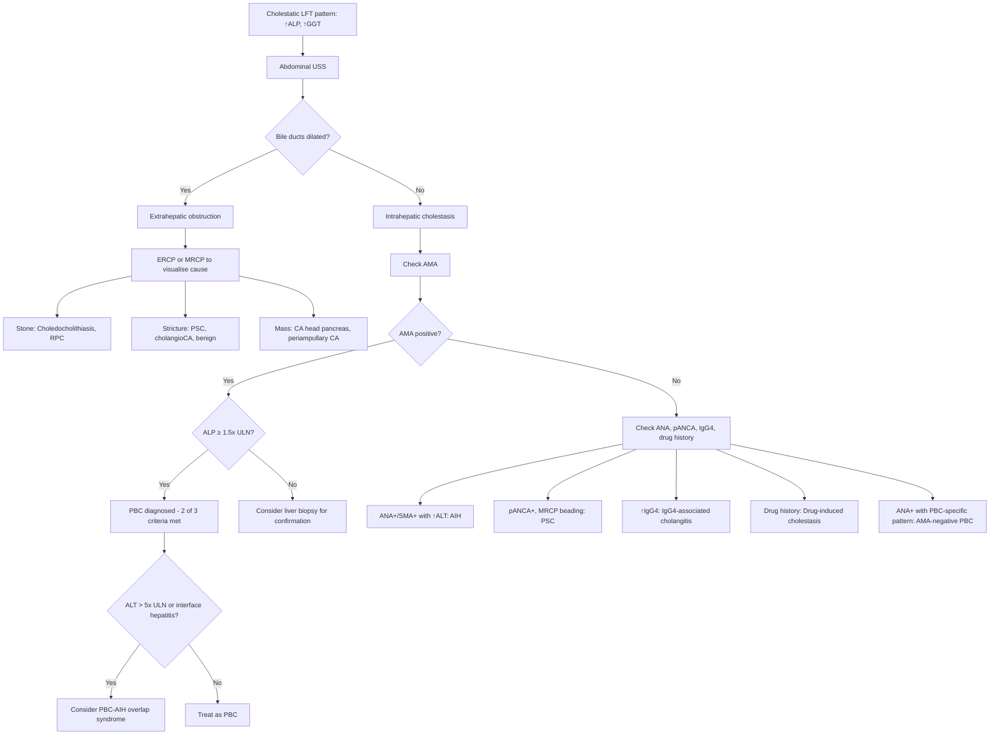

## Differential Diagnosis of Primary Biliary Cholangitis

### The Clinical Problem You're Actually Solving

Before we list differentials, let's understand *what clinical scenario* forces you to consider PBC in the first place. There are really **two clinical doorways** through which PBC enters your differential:

1. **The incidental cholestatic LFT pattern**: A middle-aged woman with raised ALP/GGT, normal or mildly raised transaminases, and no obvious biliary obstruction on ultrasound. What is this?
2. **The symptomatic cholestatic patient**: Pruritus ± fatigue ± jaundice, with or without hepatomegaly. What is causing this?

Both scenarios demand the same thought process: **systematically exclude other causes of cholestasis** — both intrahepatic and extrahepatic — before landing on PBC.

<Callout title="Fundamental Principle">
PBC is a diagnosis of **intrahepatic cholestasis**. The first and most critical step is to **exclude extrahepatic biliary obstruction** (stones, strictures, tumours) using imaging (USG ± MRCP). Only after extrahepatic obstruction is excluded do you work through the intrahepatic causes. This is why the diagnostic criteria for PBC explicitly state: ***"no extrahepatic biliary obstruction"*** [1].
</Callout>

---

### Framework: Differential Diagnosis by Clinical Presentation

The DDx of PBC maps onto three overlapping clinical scenarios. Let's work through each systematically.

#### Scenario 1: Cholestatic LFT Pattern (↑ ALP/GGT, normal-to-mild ↑ AST/ALT)

This is the most common way PBC presents — often as an incidental finding. Your differential here is essentially **"What causes a cholestatic biochemical pattern?"**

| Category | Condition | Key Distinguishing Features | Why It Mimics PBC |
|---|---|---|---|
| **Autoimmune biliary** | ***Primary Sclerosing Cholangitis (PSC)*** [3] | Male predominance (70%), ***STRONG association with UC*** [3], pANCA+, AMA−, MRCP shows "beading" of large ducts | Both cause chronic cholestasis with ↑ALP; both are autoimmune |
| **Autoimmune biliary** | **IgG4-associated cholangitis** (IgG4-SC) | Elderly males, elevated serum IgG4, associated with autoimmune pancreatitis, responds to steroids | Can cause strictures and cholestasis mimicking PSC or PBC |
| **Autoimmune hepatic** | **Autoimmune Hepatitis (AIH)** | Higher transaminases (ALT/AST > 5× ULN), +ve ANA/SMA/LKM, hypergammaglobulinaemia (IgG), interface hepatitis on biopsy | ANA can be positive in both PBC and AIH; ***PBC-AIH overlap syndrome*** exists [1] |
| **Drug-induced** | **Drug-induced cholestasis** | Temporal relationship with drug initiation (e.g., amoxicillin-clavulanate, erythromycin, chlorpromazine, OCPs, anabolic steroids, co-trimoxazole) | Can give identical cholestatic LFT pattern; AMA negative |
| **Infiltrative** | **Sarcoidosis** | Non-caseating granulomas in liver; may have pulmonary sarcoid, raised ACE, hypercalcaemia | Granulomatous hepatitis can mimic PBC histologically; AMA negative |
| **Infiltrative** | **Hepatic amyloidosis** | Massive hepatomegaly, raised ALP, systemic amyloidosis features | Cholestatic pattern with hepatomegaly |
| **Genetic** | **Benign recurrent intrahepatic cholestasis (BRIC)** | Episodic jaundice and pruritus with complete resolution between episodes; normal GGT (in BRIC type 1) | Pruritus + cholestasis in young patients |
| **Genetic** | **Progressive familial intrahepatic cholestasis (PFIC)** | Childhood onset; low GGT (type 1 and 2); genetic testing confirms | Paediatric; not a realistic DDx in middle-aged women |
| **Malignant** | ***Intrahepatic cholangiocarcinoma*** [7] | Mass lesion on imaging; CA 19-9 elevated; CK7+; older patients, weight loss | Can cause intrahepatic cholestasis; PSC is a risk factor |
| **Malignant** | ***HCC with intrahepatic bile duct compression*** [5] | AFP elevated; arterial enhancement on CT/MRI; cirrhotic background (usually HBV in HK) | Cholestasis from mass effect |
| **Vascular** | **Budd-Chiari syndrome** | Hepatic vein thrombosis; hepatomegaly, ascites, abdominal pain; diagnosed on Doppler USS or CT venography | Can cause abnormal LFTs with hepatomegaly |

#### Scenario 2: Obstructive Jaundice (Must Exclude Extrahepatic Causes)

When PBC progresses to cause frank jaundice, or when a patient presents with jaundice and cholestatic LFTs, you must exclude ***extrahepatic biliary obstruction*** [1][4][6]. This is the **"surgical vs medical jaundice"** question.

***Types of jaundice*** [6]:
- ***Pre-hepatic: Haemolysis (spherocytosis, G6PD deficiency, malaria, sickle cell anaemia)*** [6]
- ***Hepatic: hepatitis, cirrhosis, intrahepatic cholestasis, medications, Gilbert's syndrome*** [6]
- ***Post-hepatic: obstructive jaundice*** [6]

**Extrahepatic (post-hepatic) causes to exclude** [4]:

| Location | Benign Causes | Malignant Causes |
|---|---|---|
| **Intraluminal** | Choledocholithiasis (CBD stones), recurrent pyogenic cholangitis (RPC), blood clot, parasites | Tumour fragments in CBD |
| **Mural** | Benign strictures (iatrogenic, TB, autoimmune), PSC | ***Cholangiocarcinoma*** (especially Klatskin tumour at hilum) [7] |
| **Extramural** | Chronic pancreatitis, pancreatic pseudocyst, Mirizzi syndrome | ***Carcinoma of head of pancreas***, periampullary carcinoma, gallbladder carcinoma, hilar lymphadenopathy [4] |

<Callout title="Stone vs Tumour — Classic Exam Distinction" type="idea">
When facing obstructive jaundice, always differentiate stone from tumour [5]:

| Feature | Stone | Tumour |
|---|---|---|
| **Jaundice** | Intermittent (stone may pass) | Progressive |
| **Pain** | Painful (stone impaction at ampulla) | ***Painless*** (until advanced) |
| **Fever** | More likely (bile stasis → infection) | Less likely until late |
| **Constitutional symptoms** | Absent | LOW, LOA, night sweats |
| **Courvoisier's sign** | Negative (chronic fibrosed GB) | ***Positive (dilated GB)*** |

***Painless progressive obstructive jaundice in elderly is malignant biliary obstruction until proven otherwise*** [5].
</Callout>

#### Scenario 3: Pruritus + Fatigue in a Middle-Aged Woman

This is the classic symptomatic PBC presentation. The DDx here is narrower but still important:

| Condition | Key Distinguishing Features |
|---|---|
| **PBC** | AMA+, ↑ALP, middle-aged woman, autoimmune associations |
| **PSC** | AMA−, pANCA+, male, UC association, beaded ducts on MRCP |
| **Drug-induced cholestasis** | Drug history; resolves on withdrawal |
| **Intrahepatic cholestasis of pregnancy** | 3rd trimester; resolves post-partum; raised bile acids |
| **Cholestasis of sepsis** | Acutely unwell; infection source identified |
| **Pruritus of chronic kidney disease** | Uraemic pruritus; raised urea/creatinine; no cholestasis |
| **Dermatological causes of pruritus** | No cholestatic LFTs; skin lesion present (eczema, scabies, etc.) |
| **Lymphoma (Hodgkin's)** | B-symptoms; lymphadenopathy; pruritus without cholestasis |

---

### The Critical Differential: PBC vs PSC vs AIH vs Overlap

This is the **highest-yield** differential for exams. These three autoimmune liver diseases frequently overlap and must be distinguished:

| Feature | **PBC** | **PSC** [3] | **AIH** | **PBC-AIH Overlap** |
|---|---|---|---|---|
| **Sex** | F > > > M (9:1) | M > F (7:3) | F > M (4:1) | F > > M |
| **Age** | 30–65 | 30–40 | Any age (bimodal: young + perimenopause) | 30–65 |
| **Target** | Small intrahepatic ducts | Large intra/extrahepatic ducts | Hepatocytes (interface hepatitis) | Both ducts + hepatocytes |
| **LFT pattern** | Cholestatic (↑ALP) | Cholestatic (↑ALP) | Hepatitic (↑ALT/AST > 5× ULN) | Mixed |
| **AMA** | ***+ve (95%)*** [1] | Negative | Negative | Positive |
| **ANA** | +ve (70%) — multiple nuclear dots, rim-like pattern [1] | Variable | +ve (common) | Positive |
| **SMA** | Negative | Negative | +ve (common) | Variable |
| **pANCA** | Negative | ***+ve (30–80%)*** [3] | Variable | Variable |
| **IgM** | ↑↑ | ↑ | Normal | ↑ |
| **IgG** | Normal/mild ↑ | Normal | ↑↑ | ↑ |
| **Cholangiography** | Normal | Beading (strictures + dilatation) | Normal | Normal or beading |
| **Histology** | Granulomatous duct destruction | Onion-skin periductal fibrosis | Interface hepatitis, plasma cells | Features of both |
| **Disease association** | Sjögren's, thyroid, scleroderma | ***UC*** (majority of PSC patients) [3] | Other autoimmune diseases | Autoimmune spectrum |
| **Treatment** | UDCA ± OCA | UDCA (limited evidence); transplant | Steroids + azathioprine | UDCA + steroids ± azathioprine |
| **Cancer risk** | HCC (if cirrhosis) | ***Cholangiocarcinoma*** [3] | HCC (if cirrhosis) | Both |

<Callout title="PBC-AIH Overlap — Don't Miss It" type="error">
About 10% of PBC patients have concomitant features of AIH. ***Presence of ANA in PBC can cause confusion with autoimmune hepatitis or overlap syndrome (PBC plus autoimmune hepatitis)*** [1]. Suspect overlap when:
- A PBC patient has **disproportionately elevated transaminases** (ALT > 5× ULN)
- **Interface hepatitis** is seen on biopsy
- **IgG is elevated** (not just IgM)

This matters because overlap patients may need **immunosuppression** in addition to UDCA. ***Liver biopsy is indicated in patients if the diagnosis is in doubt or patient has evidence of autoimmune hepatitis*** [1].
</Callout>

---

### Differential Diagnosis Algorithm

The following flowchart illustrates the systematic approach to narrowing the DDx when PBC is suspected:

---

### Differential Diagnosis by Physical Examination Findings

***Physical Examination*** findings in obstructive jaundice to guide DDx [6]:

| Finding | Significance |
|---|---|
| ***Jaundice*** | Present in both intrahepatic and extrahepatic causes [6] |
| ***Stigmata of chronic liver disease*** | Points toward chronic hepatic cause (PBC cirrhosis, alcoholic liver disease, viral hepatitis) [6] |
| ***Pruritus*** (excoriations) | Cholestasis — any cause [6] |
| ***Courvoisier's law*** — palpable gallbladder in painless jaundice | ***Points towards malignant biliary obstruction*** (distal CBD/pancreatic head) rather than gallstones [6][4] — fibrosed GB from chronic cholelithiasis cannot distend |
| ***Troisier's sign (Virchow's node)*** | Left supraclavicular lymphadenopathy → metastatic GI malignancy [6] |
| ***Hepatomegaly*** | Many causes: PBC (progressive), HCC, metastatic disease, heart failure [6] |
| ***Sister Mary Joseph nodule*** | Periumbilical nodule → peritoneal metastasis from intra-abdominal malignancy [6] |
| ***Ascites*** | Peritoneal metastasis or decompensated cirrhosis [6] |
| **Hyperpigmentation** | Relatively specific to PBC (melanin deposition) |
| **Xanthelasma/xanthomata** | Cholestatic hyperlipidaemia — characteristic of PBC |
| **Kayser-Fleischer rings** | Wilson's disease (copper deposition in Descemet's membrane) — but note PBC can rarely cause copper retention too |

<Callout title="Courvoisier's Law — The Full Story" type="idea">
***"In painless jaundice if the gallbladder is palpable, it is unlikely to be due to gallstones"*** [4] — this ***points towards malignant biliary obstruction***. Why?
- **Gallstones** develop chronically → chronic cholecystitis → fibrosed, contracted gallbladder → **cannot distend** even if CBD is obstructed
- **Malignant obstruction** develops acutely → back-pressure dilates a previously normal gallbladder → **palpable**

**Exceptions** [4]:
- Double stones (one in CBD, one in cystic duct causing mucocele)
- RPC (pathology in bile duct, not GB → GB not fibrosed → can distend)
</Callout>

---

### HK-Relevant Differential Considerations

In Hong Kong specifically, certain diagnoses are more or less likely [2][4][5]:

| More Common in HK | Less Common in HK | Notes |
|---|---|---|
| **Chronic HBV → cirrhosis → HCC** | **PSC** (rare in Asia) | HBV is the dominant cause of cirrhosis in HK (~90%) [4] |
| **Recurrent pyogenic cholangitis (RPC)** — "Hong Kong disease" | **Alcoholic liver disease** (less than Western) | RPC associated with *Clonorchis sinensis*, intrahepatic pigment stones [5] |
| **Cholangiocarcinoma** (especially with RPC) | **Aflatoxin-related HCC** (not HK) | RPC is a risk factor for cholangioCA |
| **Drug-induced liver injury** (traditional Chinese medicine) | — | Important to ask about TCM use in HK patients |

PBC itself is **uncommon in HK** compared to Western populations but is increasingly diagnosed. When a middle-aged woman in HK presents with cholestatic LFTs and no biliary obstruction on USS, PBC should still be high on the differential — check AMA.

---

### Summary: The DDx "Cheat Sheet"

> **When you suspect PBC, you are really asking three questions:**
> 1. Is there **extrahepatic obstruction**? → USS ± MRCP to exclude stones, strictures, tumours
> 2. Is this a **different intrahepatic cholestatic disease**? → Check AMA (PBC), pANCA/MRCP (PSC), IgG4 (IgG4-SC), drug history
> 3. Is there **overlap with AIH**? → Check transaminases, IgG, consider biopsy if mixed picture

<Callout title="High Yield Summary — DDx of PBC">

**The differential diagnosis of PBC centres on excluding other causes of cholestasis:**

1. **Exclude extrahepatic obstruction FIRST** — USS/MRCP to rule out stones (choledocholithiasis, RPC), strictures (PSC, cholangioCA), and masses (CA pancreas, periampullary CA)

2. **Key intrahepatic DDx**: PSC (male, UC, pANCA+, beaded ducts), AIH (↑ALT, ANA/SMA+, ↑IgG, interface hepatitis), drug-induced cholestasis, IgG4-SC, sarcoidosis

3. **PBC-AIH overlap** (~10%): disproportionately raised transaminases + interface hepatitis in a patient with AMA+ cholestasis → needs combined treatment

4. **AMA-negative PBC** (~5%): look for PBC-specific ANA patterns (anti-sp100, anti-gp210)

5. **In HK**: always consider HBV-related disease, RPC, and cholangioCA in the differential of cholestatic liver disease

6. ***Physical signs that help differentiate***: Courvoisier's sign (malignant obstruction), Virchow's node/Sister Joseph nodule (metastatic GI malignancy), hyperpigmentation + xanthelasma (PBC-specific) [6]

</Callout>

---

<ActiveRecallQuiz
  title="Active Recall - Differential Diagnosis of PBC"
  items={[
    {
      question: "A 55-year-old woman has raised ALP, normal ALT, and AMA-positive serology. Her abdominal USS shows no bile duct dilatation. What is the most likely diagnosis, and what is the single most important thing the USS excluded?",
      markscheme: "Most likely diagnosis: Primary Biliary Cholangitis (PBC) - meets 2 of 3 criteria (raised ALP and AMA positive). The USS excluded extrahepatic biliary obstruction, which is a prerequisite for diagnosing PBC. Without excluding obstruction, you cannot make the diagnosis."
    },
    {
      question: "How do you distinguish PBC from PSC using five key features (sex, serology, imaging, associations, target ducts)?",
      markscheme: "PBC: Female (90-95%), AMA positive, normal cholangiogram (small ducts not visible), associated with Sjogren's/thyroid/scleroderma, targets small intrahepatic interlobular ducts. PSC: Male (70%), pANCA positive/AMA negative, MRCP shows beading (multifocal strictures and dilatations), strong association with ulcerative colitis, targets large intra- and extrahepatic ducts."
    },
    {
      question: "A PBC patient has ALT 8 times the upper limit of normal and elevated IgG. What should you suspect and what investigation would you request?",
      markscheme: "Suspect PBC-AIH overlap syndrome. Request liver biopsy to look for interface hepatitis and plasma cell infiltration. Also check for anti-smooth muscle antibody (SMA). This matters because overlap syndrome requires immunosuppression (steroids plus or minus azathioprine) in addition to UDCA."
    },
    {
      question: "Explain Courvoisier's law and state two exceptions. Why does the law work from first principles?",
      markscheme: "Courvoisier's law: In painless jaundice, if the gallbladder is palpable, it is unlikely to be due to gallstones - it points towards malignant biliary obstruction. Mechanism: Gallstones cause chronic cholecystitis leading to fibrosed contracted GB that cannot distend. Malignant obstruction develops acutely in a previously normal GB which can distend. Exceptions: (1) Double gallstones (CBD stone causing jaundice plus cystic duct stone causing mucocele), (2) Recurrent pyogenic cholangitis (pathology in duct not GB, so GB is not fibrosed and can distend)."
    },
    {
      question: "List three conditions in the differential of cholestatic LFTs that are particularly relevant to Hong Kong clinical practice.",
      markscheme: "1. Chronic HBV-related liver disease/HCC (most common cause of cirrhosis in HK at 90%). 2. Recurrent pyogenic cholangitis (RPC, aka Hong Kong disease) - intrahepatic pigment stones and strictures from Clonorchis sinensis. 3. Cholangiocarcinoma - especially in context of RPC as a risk factor. Also consider drug-induced liver injury from traditional Chinese medicine."
    }
  ]}
/>

## References

[1] Senior notes: felixlai.md (Primary Biliary Cholangitis section, pages 532–539)
[2] Senior notes: maxim.md (Hepatocellular carcinoma section — PBC as risk factor; Acute cholangitis — PBC as cause of strictures)
[3] Senior notes: felixlai.md (Primary Sclerosing Cholangitis section, pages 529–532)
[4] Senior notes: felixlai.md (Biliary Obstruction section, pages 499–501; Liver Cirrhosis section, pages 440–442)
[5] Senior notes: maxim.md (Obstructive Jaundice section; Recurrent Pyogenic Cholangitis section; Jaundice DDx table — stone vs tumour)
[6] Lecture slides: Malignant biliary obstruction.pdf (p2: Types of jaundice; p6: Physical Examination)
[7] Senior notes: felixlai.md (Cholangiocarcinoma section, pages 548–549)
