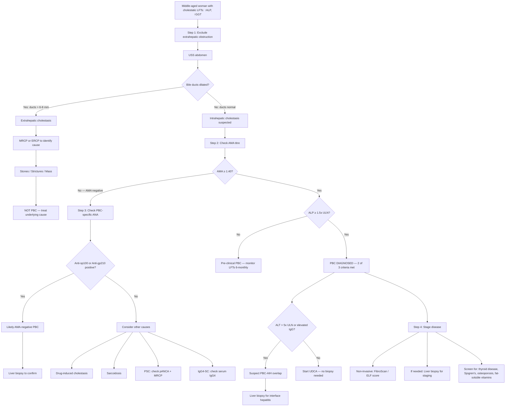

## Diagnostic Criteria for Primary Biliary Cholangitis

### The Logic Before the Criteria

Before memorising criteria, understand the *reasoning* behind them. PBC is an autoimmune disease that destroys small intrahepatic bile ducts. You cannot see these ducts on imaging (they're microscopic, < 100 µm). So the diagnosis rests on three pillars:

1. **Biochemistry** — Is there evidence of cholestasis? (↑ ALP)
2. **Serology** — Is there the autoimmune signature? (AMA)
3. **Histology** — Can we see the duct destruction directly? (Liver biopsy)

And critically, you must first **exclude** anything else that could explain the cholestasis — especially extrahepatic biliary obstruction and other liver diseases.

---

### Formal Diagnostic Criteria (AASLD/EASL Guidelines)

***Diagnosis of PBC is established if there is no extrahepatic biliary obstruction, no comorbidity affecting the liver, and ≥ 2 of the following 3 criteria are present*** [1]:

| Criterion | Detail | Rationale |
|---|---|---|
| **1. Cholestatic biochemistry** | ***ALP ≥ 1.5× upper limit of normal*** [1] | ALP ("alkaline phosphatase") is an enzyme concentrated on the canalicular membrane of bile duct epithelium. When bile ducts are damaged/obstructed, ALP is released into blood. A persistently elevated ALP of hepatic origin (confirmed by concurrent ↑GGT) is the biochemical hallmark of cholestasis. The 1.5× threshold distinguishes clinically significant cholestasis from non-specific mild elevations. |
| **2. Serology** | ***Presence of AMA at a titre of ≥ 1:40*** [1] | AMA targets PDC-E2 on the inner mitochondrial membrane. AMA is ~95% sensitive and ~98% specific for PBC. ***AMA M2 is particularly diagnostic*** [1] — the M2 subtype specifically recognises the lipoyl domain of PDC-E2. |
| **3. Histology** | ***Histological evidence of PBC: non-suppurative destructive cholangitis and destruction of interlobular bile ducts*** [1] | Direct visualisation of the hallmark "florid duct lesion" — lymphocytic and granulomatous inflammation centred on portal tract bile ducts, with epithelial damage and duct loss. "Non-suppurative" means there are NO neutrophils or pus (distinguishing it from ascending bacterial cholangitis). |

<Callout title="Practical Application of Diagnostic Criteria">
In practice, most PBC is diagnosed with just **criterion 1 + criterion 2** (raised ALP + positive AMA). ***Liver biopsy is often NOT required to establish the diagnosis*** [1] when these two are concordant. This is a key exam point — don't reflexively order a biopsy on every PBC patient.

The diagnosis requires meeting 2 out of 3 criteria, PLUS:
- **No extrahepatic biliary obstruction** (excluded by USS ± MRCP)
- **No other comorbidity affecting the liver** (excluded by history, viral serology, drug history, etc.)
</Callout>

### When Is Each Criterion Alone Insufficient?

| Scenario | Why It's Not Enough | What to Do |
|---|---|---|
| Raised ALP alone | Non-specific — could be bone disease, drug-induced, pregnancy, malignancy, extrahepatic obstruction | Confirm hepatic origin with GGT; check AMA; exclude obstruction with USS |
| AMA positive alone | ~0.5% of normal population are AMA+; AMA can be found in other autoimmune diseases | AMA alone without cholestatic biochemistry or histological evidence is insufficient — may represent "pre-clinical PBC" (these patients should be monitored as ~15–20% develop PBC within 5 years) |
| Biopsy showing duct destruction alone | Could be drug-induced ductopenia, sarcoidosis, graft-vs-host disease | Needs AMA or persistent ALP elevation to confirm PBC specifically |

---

### Special Diagnostic Scenarios

#### AMA-Negative PBC (~5% of cases)

About 5% of patients have classic PBC clinically and histologically but are ***AMA-negative***. In these patients:
- Check for ***PBC-specific ANA patterns*** [1]:
  - **Multiple nuclear dots** pattern (anti-sp100 antibodies)
  - **Rim-like / membranous** pattern (anti-gp210 antibodies)
- These ANA patterns have high specificity for PBC
- ***Liver biopsy becomes essential*** in AMA-negative suspected PBC to confirm histological features [1]
- The disease behaves identically to AMA-positive PBC

#### Suspected PBC-AIH Overlap

***Liver biopsy is indicated in patients if the diagnosis is in doubt, patient has evidence of autoimmune hepatitis, or if patient is not responding optimally with ursodeoxycholic acid*** [1].

Features suggesting overlap [1]:
- ALT > 5× ULN
- IgG > 2× ULN or positive anti-SMA
- Interface hepatitis on biopsy (moderate to severe)

The Paris criteria for PBC-AIH overlap require ≥ 2 of 3 PBC features AND ≥ 2 of 3 AIH features:

| PBC Features (need ≥ 2) | AIH Features (need ≥ 2) |
|---|---|
| ALP ≥ 2× ULN or GGT ≥ 5× ULN | ALT ≥ 5× ULN |
| AMA positive | IgG ≥ 2× ULN or anti-SMA positive |
| Florid duct lesion on biopsy | Moderate-to-severe interface hepatitis on biopsy |

<Callout title="ANA in PBC — A Prognostic, Not Just Diagnostic, Marker" type="error">
***Presence of ANA in PBC can cause confusion with autoimmune hepatitis or overlap syndrome*** [1]. But ANA positivity in PBC also carries prognostic significance: ***Presence of ANA is associated with more rapid progression of disease and a poorer prognosis*** [1]. So when you see ANA+ in a PBC patient, think:
1. Could this be overlap with AIH? → Check ALT, IgG, consider biopsy
2. This patient may have a worse prognosis regardless → Monitor more closely
</Callout>

---

## Diagnostic Algorithm

The following algorithm represents the systematic approach from initial suspicion to confirmed diagnosis:

<Callout title="The Three-Step Diagnostic Logic" type="idea">
Think of PBC diagnosis in three simple steps:
1. **Is it cholestasis?** → ↑ALP/GGT (yes) vs ↑ALT/AST predominantly (no — think hepatitic causes)
2. **Is it intrahepatic or extrahepatic?** → USS shows normal bile ducts (intrahepatic) vs dilated ducts (extrahepatic)
3. **Is it PBC specifically?** → AMA positive (yes, with high specificity) → diagnosis confirmed

***Diagnosis of PBC is suspected when LFT shows a cholestatic pattern (↑ ALP and GGT) and USG shows no evidence of biliary disease or a SOL*** [1].
</Callout>

---

## Investigation Modalities — Detailed Breakdown

### 1. Biochemical Tests

#### A. Liver Function Tests (LFT)

| Parameter | Expected Finding in PBC | Interpretation & Mechanism |
|---|---|---|
| ***ALP*** | ***Almost always elevated, often to striking levels, and is of hepatic origin*** [1] | ALP sits on the canalicular membrane of cholangiocytes and hepatocytes. Cholestasis causes detergent action of retained bile acids on cell membranes → ALP released into serum. It is the **single most characteristic biochemical abnormality** in PBC. Confirm hepatic origin by concurrent GGT elevation (bone ALP rises without GGT). |
| ***GGT*** | ***Elevated*** [1] | GGT (gamma-glutamyl transferase) is found on biliary epithelium. Elevation parallels ALP in cholestatic disease. Also induced by alcohol and certain drugs (enzyme inducer). In PBC, ↑GGT confirms the ↑ALP is of hepatobiliary rather than bone origin. |
| ***AST and ALT*** | ***Normal or slightly elevated*** [1] | Aminotransferases reflect hepatocyte injury. In PBC, the primary target is bile ducts, NOT hepatocytes (at least early on). So ALT/AST are only mildly raised. If ALT > 5× ULN → think PBC-AIH overlap. ***Serum aminotransferases may be normal or slightly elevated*** [1]. |
| ***Bilirubin*** | ***Normal in the early course of disease but becomes elevated as the disease progresses*** [1] | Early PBC → enough remaining bile ducts to handle bilirubin excretion → normal bilirubin. As ductopenia progresses → bilirubin cannot be excreted → rises. ***Conjugated and unconjugated bilirubin are both increased*** [1]. ***Elevated serum bilirubin is a poor prognostic sign*** [1] — it reflects severe, late-stage ductopenia. |
| ***Albumin*** | ***Hypoalbuminaemia in patients who have developed liver cirrhosis*** [1] | Albumin is synthesised by hepatocytes. In early PBC, hepatocyte function is preserved → normal albumin. In cirrhosis → synthetic failure → ↓albumin. Albumin half-life is ~20 days, so it reflects chronic (not acute) synthetic function. |

<Callout title="The LFT Pattern Tells the Story" type="idea">
PBC gives a **cholestatic** LFT pattern: ALP and GGT are disproportionately elevated compared to transaminases. This immediately separates it from **hepatitic** causes (viral hepatitis, AIH, Wilson's) where ALT/AST dominate. Think of it this way:
- **Cholestatic pattern** (↑↑ALP/GGT, ↔/↑ALT) → duct disease → PBC, PSC, drug-induced cholestasis, obstruction
- **Hepatitic pattern** (↑↑ALT/AST, ↔/↑ALP) → hepatocyte disease → viral, AIH, drug-induced hepatitis, Wilson's
- In cirrhosis from PBC, ALP is typically elevated but < 2–3× ULN due to late-stage ductopenia (fewer ducts = less ALP to release) [8]
</Callout>

#### B. Complete Blood Count (CBC)

***CBC with differentials*** [1]:
- ***Pancytopenia*** [1] in advanced disease — reflects **hypersplenism** from portal hypertension
  - ***Patients with PBC may have iron deficiency anaemia due to GI blood loss related to portal hypertension*** [1] — oesophageal or rectal variceal bleeding
  - ***Patients with liver cirrhosis may develop leukopenia and thrombocytopenia*** [1] — sequestration in enlarged spleen + decreased thrombopoietin production by diseased liver

#### C. Lipid Profile

***Serum lipids may be strikingly elevated in PBC*** [1]:
- ***Patients with early PBC often have mild elevations in LDL and VLDL and striking elevations in HDL*** [1]
- Why? Bile is the major route for cholesterol excretion. Cholestasis → cholesterol retention. Additionally, lipoprotein-X (Lp-X) — an abnormal lipoprotein — accumulates in cholestasis and is measured as "LDL" by some assays, artefactually inflating it.
- ***Increase in HDL explains why patients with PBC despite with striking hypercholesterolaemia do not appear to be at increased risk of death from atherosclerosis*** [1]
- Clinical pearl: Don't reflexively start statins for high cholesterol in PBC — the lipid profile is not atherogenic.

#### D. Clotting Profile

- **PT / INR** may be prolonged in two settings:
  1. **Early** — Vitamin K malabsorption from cholestasis → reduced synthesis of factors II, VII, IX, X (correctable with parenteral vitamin K)
  2. **Late** — Hepatic synthetic failure in cirrhosis → reduced production of ALL clotting factors (NOT correctable with vitamin K alone)
- Differentiating these two: give 10 mg IV vitamin K. If PT corrects → malabsorption. If PT does NOT correct → synthetic failure.

#### E. Immunoglobulins

| Immunoglobulin | Finding | Significance |
|---|---|---|
| **IgM** | ↑↑ (Polyclonal) | Characteristically elevated in PBC — possibly reflects chronic B-cell stimulation against mitochondrial antigens. This is fairly specific: ↑IgM + cholestasis strongly suggests PBC. |
| **IgG** | Normal to mild ↑ | If IgG is markedly elevated (> 2× ULN), consider AIH or PBC-AIH overlap |
| **IgG4** | Normal | If elevated, consider IgG4-associated cholangitis — important DDx |

---

### 2. Serological / Autoantibody Tests

#### A. Anti-Mitochondrial Antibody (AMA)

***Serological hallmark of PBC — 95% of patients are positive for AMA*** [1].

| Aspect | Detail |
|---|---|
| **Target antigen** | PDC-E2 (E2 subunit of pyruvate dehydrogenase complex) on inner mitochondrial membrane |
| **Sensitivity** | ~95% (5% of PBC is AMA-negative) |
| **Specificity** | ~98% (very few false positives) |
| **Diagnostic subtype** | ***AMA M2 is particularly diagnostic*** [1] — targets the lipoyl domain of PDC-E2 specifically |
| **Other AMA subtypes** | M4 (sulfite oxidase), M8 (outer mitochondrial membrane), M9 (glycogen phosphorylase) — less commonly tested; their presence may indicate more aggressive disease |
| **Testing method** | Indirect immunofluorescence (IIF) on HEp-2 cells or rat kidney substrate; confirmed by ELISA for M2 |
| **False negatives** | ~5% of true PBC — these are "AMA-negative PBC" patients; check PBC-specific ANA |
| **AMA in non-PBC** | AMA can rarely be positive in autoimmune hepatitis, drug-induced liver disease, or healthy individuals at low titre |

<Callout title="AMA — What 'M2' Actually Means">
The "M" in AMA stands for "mitochondrial," and the number refers to different mitochondrial antigen subtypes identified by immunofluorescence patterns. M2 is the most clinically relevant because it targets PDC-E2, the actual autoantigen in PBC. When an exam question says "AMA-M2 positive," this is essentially pathognomonic for PBC.
</Callout>

#### B. Anti-Nuclear Antibodies (ANA)

***Occurs in 70% of patients*** [1].

- ***Two immunofluorescence patterns are considered PBC-specific*** [1]:
  1. **Multiple nuclear dots pattern** — targeting anti-sp100 (a nuclear body protein)
  2. **Rim-like or membranous pattern** — targeting anti-gp210 (a nuclear pore glycoprotein)
- These patterns are distinct from the homogeneous or speckled ANA patterns seen in AIH or SLE
- ***Presence of ANA can cause confusion with autoimmune hepatitis or overlap syndrome*** [1]
- ***Presence of ANA is associated with more rapid progression of disease and a poorer prognosis*** [1]
- Anti-gp210 specifically is associated with hepatic failure phenotype (progressive jaundice)
- Anti-sp100 is more specific for PBC but has lower sensitivity

#### C. Other Autoantibodies to Check

| Antibody | Purpose | Expected in PBC |
|---|---|---|
| Anti-smooth muscle antibody (SMA) | Exclude AIH / overlap | Usually negative in PBC; positive suggests AIH component |
| Anti-LKM (liver-kidney microsomal) | Exclude AIH type 2 | Negative in PBC |
| pANCA | Exclude PSC | ***pANCA is typically negative in PBC; positive in PSC (30–80%)*** [3] |
| Serum IgG4 | Exclude IgG4-associated cholangitis | Normal in PBC; elevated in IgG4-SC |

---

### 3. Radiological Tests

#### A. Ultrasound (USS) Abdomen — FIRST-LINE Imaging

***USG abdomen — imaging to exclude extrahepatic biliary obstruction or space-occupying lesion in the liver*** [1].

| Finding | Interpretation |
|---|---|
| **Normal bile ducts** (CBD < 6 mm, < 8 mm post-cholecystectomy) | Excludes extrahepatic obstruction → supports intrahepatic cholestasis (PBC, PSC, drugs) |
| **Dilated bile ducts** (CBD > 8 mm) | Suggests extrahepatic obstruction → NOT PBC → proceed to MRCP or ERCP to identify cause [5] |
| **No space-occupying lesion** | Excludes HCC or metastases as cause of deranged LFTs |
| **Hepatomegaly** | May be seen in PBC; non-specific |
| **Splenomegaly** | Suggests portal hypertension from advanced fibrosis/cirrhosis |
| **Ascites** | Decompensated cirrhosis |
| **Surface nodularity / coarse echotexture** | Suggests established cirrhosis [8] |

The maxim notes describe the jaundice investigation flowchart [5]: cholestatic pattern on LFTs → abdominal USS → if bile ducts normal → ***"Intrahepatic cholestasis — PBC/PSC, Drugs → AMA, P-ANCA, MRCP, Liver biopsy"*** [5]. If bile ducts dilated → ***"Extrahepatic cholestasis → Visualise bile duct"*** [5].

<Callout title="Why USS First?">
USS is non-invasive, cheap, widely available, and answers the single most important question: **Are the bile ducts dilated?** If yes → extrahepatic obstruction (stones, tumour, stricture). If no → intrahepatic cause. This one finding pivots your entire diagnostic pathway. In PBC, bile ducts are always **normal** on USS because the disease targets microscopic ducts invisible to ultrasound.
</Callout>

#### B. Magnetic Resonance Cholangiopancreatography (MRCP)

***MRCP — imaging to exclude extrahepatic biliary obstruction*** [1].

| Role | Detail |
|---|---|
| **Primary purpose in PBC workup** | Exclude extrahepatic causes when USS is equivocal, or to definitively rule out PSC |
| **Expected finding in PBC** | **Normal biliary tree** — because PBC affects small ducts (< 100 µm) that are below MRCP resolution |
| **Expected finding in PSC** | ***Characteristic multifocal strictures that alternate with dilatation of intrahepatic or extrahepatic bile ducts resulting in "beaded" appearance*** [3] |
| **Advantages** | Non-invasive, no radiation, no contrast injection needed for biliary imaging, excellent at identifying duct anatomy |
| **When to order** | When USS cannot exclude obstruction; when PSC is in the differential; when AMA is negative and duct pathology must be excluded |

#### C. ERCP (Endoscopic Retrograde Cholangiopancreatography)

- **NOT routinely indicated in PBC diagnosis** — PBC is a small-duct disease; ERCP visualises large ducts
- ***Indicated in patients who are unable to undergo MRCP*** (e.g., implanted metal devices) or ***in patients with early PSC changes that may be missed by MRCP*** [3]
- ERCP carries procedural risks (pancreatitis, perforation, cholangitis) and should only be performed when therapeutic intervention (stone removal, stent placement) is anticipated

#### D. Transient Elastography (FibroScan)

- **Non-invasive assessment of liver fibrosis** — measures liver stiffness using ultrasound-based shear wave velocity [8]
- Increasingly used to **stage fibrosis** in PBC without biopsy
- Liver stiffness values:
  - < 7.1 kPa → minimal fibrosis (F0-F1)
  - 7.1–9.5 kPa → significant fibrosis (F2)
  - 9.5–12.5 kPa → advanced fibrosis (F3)
  - &gt; 12.5 kPa → cirrhosis (F4)
- Advantages: non-invasive, repeatable, good for monitoring progression
- Limitations: unreliable in obesity, ascites, acute hepatitis (inflammation falsely elevates stiffness)

---

### 4. Liver Biopsy

***Liver biopsy is often NOT required to establish the diagnosis of PBC but can provide useful information with regard to staging and prognosis*** [1].

#### Indications for Biopsy in PBC

***Indicated in patients if*** [1]:
1. ***The diagnosis is in doubt*** (e.g., AMA-negative, atypical features)
2. ***Patient has evidence of autoimmune hepatitis*** (elevated ALT/IgG → need to confirm/exclude overlap)
3. ***Patient is not responding optimally with ursodeoxycholic acid*** (to reassess staging and look for other pathology)
4. Need to assess fibrosis stage when non-invasive methods are inconclusive

#### Histological Findings and Staging

***Histological findings in PBC are staged on a scale of 0–4*** [1]:

| Stage | Name | Key Histological Features | Clinical Correlate |
|---|---|---|---|
| ***Stage 0*** | ***Normal*** | Normal liver architecture | Pre-clinical PBC (AMA+ only) |
| ***Stage 1*** | ***Portal*** | ***Inflammation and/or abnormal connective tissue confined to portal areas*** [1]; **Florid duct lesion**: lymphocytic and epithelioid granulomatous inflammation centred on interlobular bile ducts; duct epithelial damage and focal duct destruction | Often asymptomatic; detected on screening LFTs |
| ***Stage 2*** | ***Periportal*** | ***Inflammation and/or fibrosis confined to portal and periportal areas*** [1]; Ductular proliferation (reactive ductules); periportal hepatitis (interface hepatitis) | May develop early symptoms (pruritus, fatigue) |
| ***Stage 3*** | ***Septal*** | ***Bridging fibrosis*** [1] — fibrous septa linking portal tracts to each other or to central veins; progressive ductopenia (loss of bile ducts in > 50% of portal tracts) | More symptomatic; early features of portal hypertension |
| ***Stage 4*** | ***Cirrhosis*** | ***Cirrhosis*** [1] — regenerative nodules, complete architectural distortion, severe ductopenia | Decompensated liver disease; jaundice, ascites, varices |

The hallmark lesion — the **"florid duct lesion"** — is pathognomonic:
- A medium-sized interlobular bile duct is surrounded by a dense lymphocytic infiltrate
- Epithelioid granulomata may be seen around the damaged duct
- The duct epithelium shows degenerative changes (vacuolation, nuclear irregularity, eosinophilic change)
- "Non-suppurative" = NO neutrophils (this is immune-mediated destruction, not infection)

<Callout title="The Florid Duct Lesion vs Onion-Skin Fibrosis" type="error">
Don't confuse the histology of PBC with PSC:
- **PBC**: Florid duct lesion — granulomatous inflammation destroying small interlobular ducts. "Non-suppurative destructive cholangitis."
- **PSC**: Onion-skin periductal fibrosis — concentric layers of fibrosis around medium/large bile ducts. Very different pattern.

Both cause ductopenia eventually, but the mechanism and morphology differ completely.
</Callout>

---

### 5. Additional Investigations for Screening and Staging

Once PBC is diagnosed, additional tests are needed to assess disease complications and associated conditions:

| Investigation | Purpose | Rationale |
|---|---|---|
| **Thyroid function tests** | Screen for Hashimoto's thyroiditis | Associated in 10–15% [1]; check at diagnosis and periodically |
| **Schirmer's test / salivary flow** | Screen for Sjögren's syndrome | Associated in 40–65% [1]; ask about sicca symptoms |
| **DEXA scan** | Screen for osteoporosis | Hepatic osteodystrophy — retained toxins inhibit osteoblasts + vitamin D malabsorption [1] |
| **Serum vitamin A and calcidiol** | Screen for fat-soluble vitamin deficiency | ***Vitamin A and D deficiency are more common requiring supplementation; measurement of serum vitamin A and calcidiol is required*** [1] |
| **Serum vitamin K** (or PT/INR) | Screen for vitamin K deficiency | Coagulopathy from malabsorption |
| **Serum AFP + USS 6-monthly** | HCC surveillance (if cirrhotic) | ***Patients with PBC and cirrhosis are at increased risk of HCC*** [1] |
| **Upper GI endoscopy (OGD)** | Variceal screening (if cirrhotic) | Portal hypertension → oesophageal varices → risk of UGIB |
| **FibroScan or ELF score** | Non-invasive fibrosis staging | Monitor progression; assess need for transplant referral |

---

### 6. Prognostic Markers and Risk Stratification

***Factors associated with a poorer prognosis*** [1]:

| Factor | Explanation |
|---|---|
| ***Unresponsive to ursodeoxycholic acid (UDCA)*** | UDCA responders have near-normal life expectancy; non-responders progress to cirrhosis. Assessed at 1 year using criteria (see below). |
| ***Presence of symptoms at the time of diagnosis*** | Symptomatic patients have more advanced disease at baseline |
| ***Elevated ALP and bilirubin levels*** | Reflect severe cholestasis and ductopenia; bilirubin is the single strongest prognostic marker |
| ***Advanced histological stage*** | Stage 3–4 at diagnosis = already significant fibrosis/cirrhosis |
| ***Presence of anti-nuclear antibodies (ANA)*** | ***Associated with more rapid progression*** [1]; anti-gp210 particularly predicts hepatic failure |

#### Assessing UDCA Response (at 12 months)

Multiple criteria exist to define "UDCA response" — all assess whether the biochemistry has improved after 1 year of UDCA:

| Criteria | Definition of Response |
|---|---|
| **Barcelona criteria** | ALP decrease > 40% of baseline OR normalisation |
| **Paris-I criteria** | ALP < 3× ULN AND AST < 2× ULN AND bilirubin ≤ 1 mg/dL |
| **Paris-II criteria** (early disease) | ALP < 1.5× ULN AND AST < 1.5× ULN AND normal bilirubin |
| **Toronto criteria** | ALP < 1.67× ULN |
| **UK-PBC risk score** | Composite score using ALP, ALT/AST, bilirubin, albumin, platelet count at 12 months |
| **GLOBE score** | Uses age at diagnosis + bilirubin, ALP, albumin, platelet count after 1 year UDCA |

Non-responders require second-line therapy (obeticholic acid, bezafibrate) or transplant referral.

---

### Putting It All Together — Investigation Summary Table

| Investigation | Key Finding in PBC | When to Order |
|---|---|---|
| **LFT** | ↑↑ALP/GGT; ↔/↑ALT/AST; ↔/↑bilirubin (late) | Always — first-line |
| **AMA** | Positive ≥ 1:40 (95%); M2 subtype diagnostic | Always — diagnostic |
| **ANA** | Positive 70%; look for nuclear dots or rim pattern | Always — prognostic and for DDx of overlap |
| **Immunoglobulins** | ↑IgM; normal IgG (↑IgG → overlap) | Always |
| **USS abdomen** | Normal bile ducts; no SOL | Always — exclude extrahepatic obstruction |
| **MRCP** | Normal in PBC; beading in PSC | If USS equivocal or PSC suspected |
| **Liver biopsy** | Florid duct lesion; staging 0–4 | Only if diagnosis in doubt, AIH suspected, or suboptimal UDCA response |
| **FibroScan** | Liver stiffness correlates with fibrosis stage | Non-invasive staging and monitoring |
| **Lipid profile** | ↑↑Cholesterol (↑HDL, Lp-X) | Baseline; reassurance — NOT atherogenic |
| **CBC** | Pancytopenia in advanced disease | Baseline and monitoring |
| **TFTs** | Hypothyroidism (Hashimoto's) | Screen at diagnosis |
| **Vitamin A, 25-OH-D** | Deficiency from fat malabsorption | Screen at diagnosis |
| **DEXA** | Osteoporosis/osteopenia | Screen at diagnosis |
| **AFP + USS 6-monthly** | HCC surveillance | If cirrhosis established |

---

<Callout title="High Yield Summary — Diagnosis of PBC">

1. **Diagnostic criteria**: ≥ 2 of 3 — ***ALP ≥ 1.5× ULN***, ***AMA ≥ 1:40***, ***histological evidence*** — PLUS no extrahepatic obstruction [1]

2. **In practice**: Most diagnosed by **raised ALP + positive AMA** alone. ***Biopsy often NOT required*** [1].

3. **AMA-M2** is the serological hallmark (~95% sensitive, ~98% specific). In the 5% who are AMA-negative, look for **PBC-specific ANA** (anti-sp100, anti-gp210).

4. **USS is mandatory** to exclude extrahepatic obstruction. Normal ducts + ↑ALP + AMA+ = PBC.

5. **Biopsy indications**: diagnostic doubt, suspected AIH overlap, suboptimal UDCA response.

6. **Bilirubin is the strongest prognostic marker** — rising bilirubin = advanced ductopenia = poor prognosis.

7. **Always screen for**: thyroid disease, Sjögren's, osteoporosis, fat-soluble vitamin deficiency, and HCC (if cirrhotic).

8. **UDCA response at 12 months** determines prognosis and need for second-line therapy.

</Callout>

---

<ActiveRecallQuiz
  title="Active Recall - Diagnostic Criteria, Algorithm and Investigations for PBC"
  items={[
    {
      question: "State the 3 diagnostic criteria for PBC and explain how many are needed. What prerequisite must be met before applying these criteria?",
      markscheme: "3 criteria: (1) ALP at least 1.5x ULN, (2) AMA titre at least 1:40, (3) Histological evidence of non-suppurative destructive cholangitis and destruction of interlobular bile ducts. Need at least 2 of 3. Prerequisite: must exclude extrahepatic biliary obstruction (by USS) and no other comorbidity affecting the liver."
    },
    {
      question: "A 48-year-old woman has raised ALP, normal ALT, and is AMA-negative. What two specific ANA patterns would you look for to support a diagnosis of AMA-negative PBC?",
      markscheme: "Multiple nuclear dots pattern (anti-sp100 antibodies) and rim-like or membranous pattern (anti-gp210 antibodies). These are PBC-specific ANA patterns found in approximately 5% of PBC patients who are AMA-negative. Liver biopsy is also indicated in AMA-negative suspected PBC for histological confirmation."
    },
    {
      question: "Describe the expected LFT pattern in PBC and explain the pathophysiological reason for each abnormality. What does a rising bilirubin indicate?",
      markscheme: "Cholestatic pattern: markedly elevated ALP and GGT (release from damaged bile duct epithelium), normal to mildly elevated ALT/AST (hepatocytes not primary target early on), normal bilirubin early that rises as disease progresses (progressive ductopenia impairs bilirubin excretion). Rising bilirubin is the strongest poor prognostic sign reflecting severe ductopenia and advanced disease."
    },
    {
      question: "List 3 specific indications for performing a liver biopsy in PBC, and describe the pathognomonic histological lesion.",
      markscheme: "Indications: (1) Diagnosis is in doubt (e.g. AMA-negative), (2) Evidence of autoimmune hepatitis overlap (raised ALT, IgG), (3) Patient not responding optimally to UDCA. Pathognomonic lesion: 'Florid duct lesion' - lymphocytic and epithelioid granulomatous inflammation centred on interlobular bile ducts with non-suppurative destructive cholangitis. Granulomata surround damaged ducts; no neutrophils (non-suppurative)."
    },
    {
      question: "Why is hypercholesterolaemia in PBC NOT associated with increased atherosclerotic risk? What lipoprotein changes explain this?",
      markscheme: "Despite strikingly elevated total cholesterol, PBC patients have predominantly elevated HDL and lipoprotein-X (Lp-X). HDL is anti-atherogenic. Lp-X is an abnormal lipoprotein that accumulates in cholestasis and is measured as LDL by some assays but is NOT atherogenic. The majority of cholesterol elevation is from these anti-atherogenic fractions, explaining the lack of increased cardiovascular risk."
    },
    {
      question: "After diagnosing PBC, list 5 screening investigations you would order and the condition each screens for.",
      markscheme: "(1) TFTs - Hashimoto's thyroiditis (10-15%). (2) Schirmer's test or sicca symptom assessment - Sjogren's syndrome (40-65%). (3) DEXA scan - osteoporosis from hepatic osteodystrophy. (4) Serum vitamin A and 25-hydroxy-vitamin D - fat-soluble vitamin deficiency from malabsorption. (5) AFP and USS 6-monthly - HCC surveillance if cirrhosis is established."
    }
  ]}
/>

## References

[1] Senior notes: felixlai.md (Primary Biliary Cholangitis section, pages 532–539)
[3] Senior notes: felixlai.md (Primary Sclerosing Cholangitis section, pages 529–532)
[5] Senior notes: maxim.md (Obstructive Jaundice section — jaundice investigation flowchart; intrahepatic vs extrahepatic cholestasis algorithm)
[8] Senior notes: felixlai.md (Liver Cirrhosis — Diagnosis section, pages 442–446)
