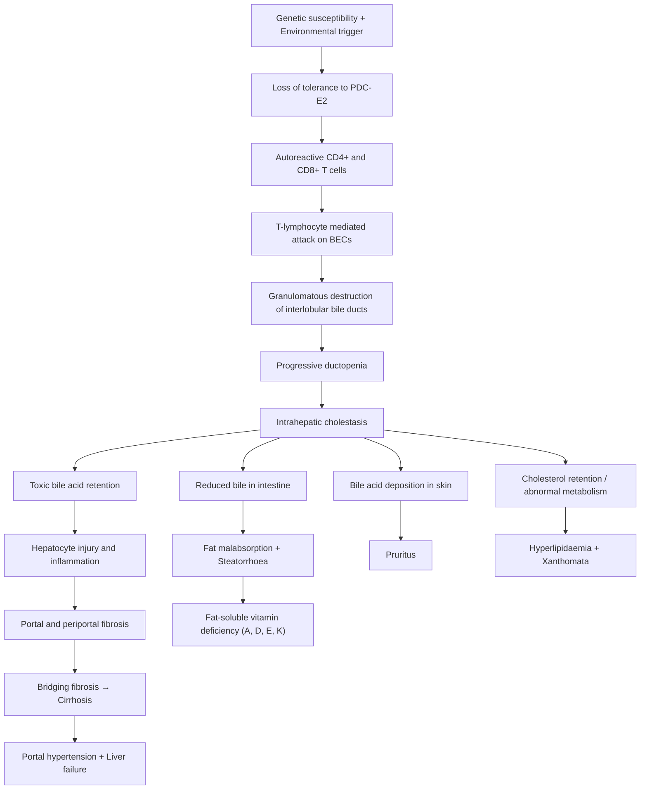
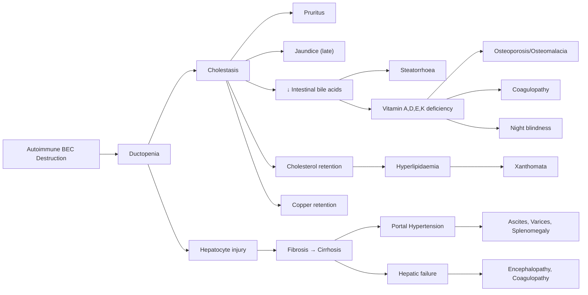

# Primary Biliary Cholangitis (PBC)

## Definition

Primary Biliary Cholangitis (PBC) — formerly called **Primary Biliary Cirrhosis** (the name was changed in 2015 to reflect the fact that most patients are now diagnosed before cirrhosis develops) — is a chronic, progressive, autoimmune cholestatic liver disease characterised by a **T-lymphocyte–mediated attack on small intrahepatic (interlobular) bile ducts** [1][2].

Let's break down the name:
- **Primary** → the disease arises *de novo* from autoimmune mechanisms, not secondary to stones, strictures, or external compression.
- **Biliary** → targets the **bile ducts** (specifically the small/medium intrahepatic interlobular bile ducts, < 100 µm).
- **Cholangitis** → "chol-" = bile, "-ang-" = vessel/duct, "-itis" = inflammation. So: inflammation of the bile ducts.

The sustained, granulomatous destruction of these bile ductules leads to progressive **cholestasis** (impaired bile flow), then **biliary fibrosis**, and ultimately **liver cirrhosis** and **liver failure** if untreated [1].

<Callout title="Key Concept">
PBC is an autoimmune destruction of *small* intrahepatic bile ducts (interlobular ducts). This is fundamentally different from Primary Sclerosing Cholangitis (PSC), which targets *large* intrahepatic and extrahepatic bile ducts with fibrotic stricturing. The distinction matters for diagnosis, associations, and management.
</Callout>

---

## Epidemiology

### Incidence and Prevalence
- **Global prevalence**: approximately 1.9–40.2 per 100,000 population (varies by region; highest in Northern Europe and North America) [3].
- Incidence appears to be increasing, partly due to earlier diagnosis from routine liver function testing.
- In Hong Kong and Asia, PBC is less common than in Western populations but is increasingly recognised. In HK, chronic Hepatitis B remains the dominant cause of liver cirrhosis (~90%), with PBC representing a small but important subset of biliary causes of cirrhosis [2][4].

### Age and Sex
- ***Extreme female predominance (90–95% female)*** [1][2].
  - Why? The precise reason is unclear, but leading hypotheses include:
    - **X-chromosome monosomy**: Enhanced X chromosome loss in lymphocytes of PBC patients → disinhibition of X-linked immune regulatory genes.
    - **Oestrogen effects on immune regulation**: Oestrogen modulates T-cell and B-cell function, potentially promoting loss of tolerance to mitochondrial antigens.
    - **Microchimerism**: Fetal cells persisting in maternal circulation post-pregnancy may trigger graft-vs-host–like immune reactions against biliary epithelium.
- ***Age of diagnosis: typically 30–65 years (middle-aged women)*** [1].
- Rarely diagnosed before 25 or after 70.

### Geographic Variation
- Highest prevalence in **Northern Europe** (UK, Scandinavia) and **North America**.
- Lower prevalence in Asia and Africa, though increasingly diagnosed.
- Clustering in families: first-degree relatives of PBC patients have a ~100-fold increased risk.

---

## Risk Factors

| Risk Factor | Mechanism / Explanation |
|---|---|
| **Female sex** | ~9:1 female-to-male ratio; X-chromosome and hormonal mechanisms |
| **Family history of PBC** | Concordance rate ~63% in monozygotic twins; strong genetic component |
| **HLA associations** | HLA-DRB1*08 (risk), HLA-DRB1*11 (protective) |
| **Other autoimmune diseases** | PBC clusters with other autoimmune conditions (see below) |
| **Recurrent urinary tract infections** | Molecular mimicry: *E. coli* pyruvate dehydrogenase complex (PDC-E2) shares epitopes with human mitochondrial PDC-E2, triggering cross-reactive autoimmunity |
| **Smoking** | Dose-dependent increased risk; mechanism may involve oxidative modification of mitochondrial antigens |
| **Environmental chemicals** | Xenobiotics (e.g., halogenated hydrocarbons, nail polish chemicals like 2-octynoic acid) can modify PDC-E2 → neoantigen formation → immune attack |
| **Prior pregnancies** | Related to microchimerism hypothesis |

<Callout title="Molecular Mimicry — The Key Pathogenetic Concept" type="idea">
The E2 subunit of the **pyruvate dehydrogenase complex** (PDC-E2), located on the inner mitochondrial membrane, is the primary autoantigen in PBC. Certain bacteria (especially *E. coli*) have PDC-E2 homologues. Repeated UTIs may trigger cross-reactive immune responses in genetically susceptible individuals → loss of tolerance → autoimmune destruction of biliary epithelial cells (which uniquely express PDC-E2 on their apical surface after apoptosis, unlike most other cell types where PDC-E2 is cleaved during apoptosis).
</Callout>

---

## Associated Medical Conditions

PBC is strongly associated with other autoimmune diseases. Think of PBC as part of an "autoimmune constellation" [1]:

| Associated Condition | Prevalence in PBC | Notes |
|---|---|---|
| ***Sjögren's syndrome*** | ***40–65%*** | Sicca symptoms (dry eyes, dry mouth); most common association |
| ***Hashimoto's thyroiditis*** | ***10–15%*** | Screen with TFT at diagnosis |
| **Systemic sclerosis (Scleroderma)** | ***5–10%*** | Especially CREST variant |
| **Rheumatoid arthritis** | ***5–10%*** | |
| **Coeliac disease** | ~6% | Screen if diarrhoea or malabsorption disproportionate to cholestasis |
| **Raynaud's phenomenon** | Common | Due to overlap with systemic sclerosis |
| **Autoimmune hepatitis (AIH)** | Overlap syndrome in ~10% | "PBC-AIH overlap" — important diagnostic consideration |
| **Renal tubular acidosis (Type 1)** | Rare | Autoimmune tubular damage |

<Callout title="High Yield — Autoimmune Associations" type="error">
A common exam pitfall: Students forget to screen for **thyroid disease** and **Sjögren's syndrome** in PBC. Always check TFT and ask about sicca symptoms. Sjögren's is the *most common* autoimmune association (up to 65%).
</Callout>

---

## Anatomy and Function — The Biliary System

To understand PBC, you must understand **which bile ducts are targeted** and why their destruction matters.

### Normal Bile Duct Anatomy

```
Hepatocytes → Bile canaliculi → Canals of Hering → Cholangioles → 
Interlobular bile ducts (< 100 µm) → Septal bile ducts → 
Intrahepatic bile ducts → Right and Left hepatic ducts → 
Common hepatic duct → (+ cystic duct) → Common bile duct → Ampulla of Vater
```

**PBC targets the small interlobular bile ducts** (those within the portal triads, < 100 µm diameter). These are lined by **biliary epithelial cells (BECs / cholangiocytes)**.

### Why Does Destroying Small Bile Ducts Cause Disease?

1. **Bile formation**: Hepatocytes produce bile and secrete it into canaliculi. Bile flows through the duct system to the intestine.
2. **Bile duct destruction** → bile cannot flow out of the liver → **cholestasis** (bile stasis within the liver).
3. **Retained bile acids** are toxic to hepatocytes → ongoing hepatocyte injury → inflammation → fibrosis → cirrhosis.
4. **Lack of bile in the intestine** → impaired fat emulsification → **steatorrhoea** → malabsorption of **fat-soluble vitamins (A, D, E, K)**.

### The Portal Triad

Each portal triad contains:
- Hepatic artery branch
- Portal vein branch
- **Bile duct** (interlobular) ← THIS is the target in PBC

The classic histological lesion of PBC — the **"florid duct lesion"** — shows lymphocytic infiltration and granulomatous destruction centred on these portal triad bile ducts.

---

## Etiology and Pathophysiology

### Etiology

PBC is an **autoimmune disease** of unknown precise aetiology, arising from a combination of:

1. **Genetic susceptibility**
   - HLA associations: HLA-DRB1*08 (susceptibility), HLA-DRB1*11, HLA-DRB1*13 (protective)
   - Non-HLA genes: IL-12A, IL-12RB2, STAT4, IRF5, CTLA-4, TNFSF15
   - Strong familial clustering; ~63% concordance in monozygotic twins

2. **Environmental triggers**
   - Molecular mimicry (bacterial PDC-E2, especially from *E. coli*)
   - Xenobiotics (halogenated compounds that modify PDC-E2 → neoantigen)
   - Smoking
   - Possibly hormonal factors (explaining female predominance)

3. **Loss of immune tolerance**
   - The central autoantigen is **PDC-E2** (E2 subunit of the pyruvate dehydrogenase complex), located on the inner mitochondrial membrane
   - In PBC, biliary epithelial cells (BECs) are unique: when BECs undergo apoptosis, **PDC-E2 remains immunologically intact on apoptotic blebs** (it is not glutathionylated/cleaved as in other cell types)
   - This intact PDC-E2 is presented to the immune system → T-cell and B-cell activation → autoimmune attack specifically on BECs

### Pathophysiology — Step by Step



### Immunopathology in Detail

1. **Humoral immunity**: 
   - **Anti-mitochondrial antibodies (AMA)** — specifically AMA-M2 targeting PDC-E2 — are the serological hallmark (present in ~95% of PBC patients) [1]
   - AMA are highly specific (~98%) but are NOT directly pathogenic; they are a marker of the underlying autoimmune process
   - Other AMA subtypes (M4, M8, M9) are less commonly tested

2. **Cellular immunity** (the actual effector mechanism):
   - **CD4+ T-helper cells** and **CD8+ cytotoxic T cells** infiltrate the portal tracts and directly attack BECs
   - The granulomatous inflammation around damaged ducts is the hallmark histological feature
   - **CD8+ T cells** are the primary effectors of BEC destruction

3. **Biliary epithelial cell (BEC) biology**:
   - BECs in PBC show increased apoptosis
   - Unique failure to cleave PDC-E2 during apoptosis → persistent antigen exposure
   - BECs also express MHC class II molecules and can act as antigen-presenting cells, amplifying the immune response
   - Progressive BEC loss → **ductopenia** (vanishing bile duct syndrome) → cholestasis

### The Cholestatic Cascade

Once bile ducts are destroyed and cholestasis develops:

| Consequence | Mechanism |
|---|---|
| **Pruritus** | Retained bile acids (and possibly lysophosphatidic acid via autotaxin) stimulate itch receptors in skin; pruritogens accumulate due to impaired biliary excretion |
| **Jaundice** | Both conjugated and unconjugated bilirubin accumulate; conjugated bilirubin regurgitates into blood from damaged bile ducts |
| **Steatorrhoea** | Reduced bile acid delivery to intestine → impaired micelle formation → fat malabsorption |
| **Vitamin A deficiency** | Fat-soluble vitamin malabsorption → night blindness, xerophthalmia |
| **Vitamin D deficiency** | Fat-soluble vitamin malabsorption → osteomalacia, contributes to osteoporosis |
| **Vitamin E deficiency** | Fat-soluble vitamin malabsorption → neurological dysfunction (rare) |
| **Vitamin K deficiency** | Fat-soluble vitamin malabsorption → coagulopathy (prolonged PT/INR) |
| **Hyperlipidaemia** | Cholesterol is normally excreted in bile; cholestasis → retained cholesterol; also ↑HDL and lipoprotein-X |
| **Xanthomata/Xanthelasma** | Deposition of lipid-laden macrophages in skin/tendons due to hyperlipidaemia |
| **Hyperpigmentation** | Melanin deposition (NOT bilirubin) — mechanism unclear but may relate to MSH-like peptides or bile acid–stimulated melanogenesis |
| **Hepatic osteodystrophy** | Retained toxins inhibit osteoblast function → osteoporosis; vitamin D malabsorption → osteomalacia |

<Callout title="Why Hyperpigmentation in PBC?" type="idea">
A common misconception: the skin darkening in PBC is NOT from jaundice/bilirubin. ***It is from melanin deposition*** [1]. The exact mechanism is debated, but it may involve bile acid–mediated stimulation of melanocyte activity or MSH-like peptide release. The pigmentation can be generalised but is often most prominent on sun-exposed areas.
</Callout>

---

## Classification

### Histological Staging (Ludwig / Scheuer Classification)

PBC is classically staged 0–4 based on liver biopsy [1][2]:

| Stage | Name | Histological Features |
|---|---|---|
| **Stage 0** | Normal | Normal liver histology |
| **Stage 1** | ***Portal stage*** | ***Inflammation and/or abnormal connective tissue confined to portal areas***; "florid duct lesion" — granulomatous destruction of interlobular bile ducts; lymphocytic infiltrate around damaged ducts |
| **Stage 2** | ***Periportal stage*** | ***Inflammation and/or fibrosis confined to portal and periportal areas***; proliferation of small bile ductules (ductular reaction); interface hepatitis may be seen |
| **Stage 3** | ***Septal stage*** | ***Bridging fibrosis*** — fibrous septa linking portal tracts; progressive ductopenia |
| **Stage 4** | ***Cirrhosis*** | ***Cirrhosis*** — regenerative nodules, complete architectural distortion |

<Callout title="Liver Biopsy in PBC" type="idea">
***Liver biopsy is often NOT required to establish the diagnosis of PBC*** [1] when ALP is elevated and AMA is positive. However, it ***is indicated if: the diagnosis is in doubt, there is evidence of autoimmune hepatitis overlap, or the patient is not responding optimally to ursodeoxycholic acid (UDCA)*** [1]. Biopsy also provides useful prognostic information through staging.
</Callout>

### Clinical Classification

Some clinicians also classify PBC by clinical stage:

1. **Pre-clinical** — AMA positive, normal LFTs, asymptomatic
2. **Asymptomatic** — AMA positive, abnormal LFTs (↑ALP), no symptoms
3. **Symptomatic** — pruritus, fatigue, jaundice
4. **Decompensated** — cirrhosis with portal hypertension, ascites, variceal bleeding, hepatic encephalopathy

### AMA-Negative PBC (~5%)

About 5% of patients have typical clinical, biochemical, and histological features of PBC but are **AMA-negative**. In these patients:
- PBC-specific **ANA** patterns (multiple nuclear dots [anti-sp100] or rim-like/membranous [anti-gp210]) are often present
- The disease behaves identically to AMA-positive PBC
- Previously termed "autoimmune cholangitis"

### PBC-AIH Overlap Syndrome

~10% of PBC patients have features of both PBC and autoimmune hepatitis (AIH):
- Elevated transaminases (ALT > 5× ULN) in addition to cholestatic pattern
- Interface hepatitis on biopsy
- May be ANA-positive
- Requires combined treatment (UDCA + immunosuppression)

---

## Clinical Features

***Asymptomatic at diagnosis in 50–60% of cases*** [1] — often detected incidentally through raised ALP on routine blood tests.

### Symptoms

| Symptom | Frequency | Pathophysiological Basis |
|---|---|---|
| ***Pruritus*** | Most common symptom (~70% of symptomatic patients) | Cholestasis → accumulation of pruritogens (bile acids, lysophosphatidic acid via autotaxin enzyme) → activation of itch receptors (TGR5, MRGPRX4) in skin nerve fibres. ***Worse at night*** [1]. Often ***precedes the development of jaundice*** [1]. Can be severely debilitating. |
| ***Fatigue*** | Very common (~80%) | Poorly understood; may involve central mechanisms (altered neurotransmission — serotonergic and corticotropin pathways), autonomic dysfunction, sleep disturbance from pruritus, and cytokine-mediated effects. Does NOT correlate with disease severity. Does NOT improve with liver transplantation in many cases. |
| ***Steatorrhoea*** | Variable | ***↓ Bile acid secretion into intestine*** [1] → impaired micelle formation → fat malabsorption → pale, bulky, foul-smelling, floating stools |
| **RUQ discomfort** | Common | Hepatomegaly → distension of Glisson's capsule (the liver itself has no pain fibres; pain comes from capsular stretch) |
| **Dry eyes and dry mouth (sicca symptoms)** | 40–65% | Associated Sjögren's syndrome → autoimmune destruction of lacrimal and salivary glands |
| **Arthralgia** | Variable | Associated autoimmune conditions (RA, Sjögren's) |
| **Weight loss** | Late feature | Fat malabsorption, anorexia from advanced liver disease |
| **Bone pain / fractures** | Late | Hepatic osteodystrophy (osteoporosis/osteomalacia from vitamin D deficiency and direct osteoblast inhibition) |
| **Night blindness** | Late | Vitamin A deficiency from fat malabsorption |
| **Easy bruising / bleeding** | Late | Vitamin K deficiency → impaired synthesis of clotting factors II, VII, IX, X |

<Callout title="Pruritus in PBC — More Than Just Bile Acids">
The mechanism of pruritus in cholestasis has evolved. While bile acids were the traditional explanation, current evidence implicates **autotaxin** (an enzyme that produces lysophosphatidic acid, LPA) as a key mediator. Serum autotaxin levels correlate with itch severity. This is why cholestyramine (a bile acid sequestrant) helps but doesn't fully relieve itch in all patients, and why **IBAT inhibitors** (ileal bile acid transporter inhibitors, e.g., linerixibat) and **opioid antagonists** (naltrexone) may also be effective.
</Callout>

### Signs

| Sign | Pathophysiological Basis |
|---|---|
| ***Jaundice*** | ***Typically a late manifestation*** [1]; reflects severe ductopenia and cholestasis → bilirubin accumulation. Both conjugated and unconjugated bilirubin elevated. ***Elevated serum bilirubin is a poor prognostic sign*** [1]. |
| ***Hyperpigmentation*** | ***Melanin deposition*** (NOT bilirubin) [1]. Diffuse, often more prominent in sun-exposed areas. Mechanism debated but may involve bile acid–stimulated melanogenesis. |
| ***Xanthomata and xanthelasma*** | ***Hyperlipidaemia*** [1] → lipid deposition. Xanthelasma = yellowish plaques around eyelids. Xanthomata = lipid deposits in tendons, skin creases. |
| ***Hepatomegaly*** | ***Becomes more common as PBC progresses*** [1]; initially due to cholestatic swelling, later due to fibrosis/cirrhosis with regenerative nodules |
| ***Splenomegaly*** | ***Becomes more common as PBC progresses*** [1]; reflects portal hypertension from progressive fibrosis/cirrhosis. ***Incidence appears to be decreasing probably because PBC is diagnosed in earlier stages than in the past*** [1]. |
| **Excoriations** | Secondary to scratching from severe pruritus |
| **Kayser-Fleischer–like rings** | Rare; copper deposition in Descemet's membrane (copper is normally excreted in bile; cholestasis → copper retention — but this does NOT indicate Wilson's disease) |
| **Spider angiomata** | Late; reflect hyperestrogenism from impaired hepatic oestrogen metabolism in cirrhosis |
| **Palmar erythema (liver palms)** | Late; hyperestrogenism in cirrhosis |
| **Ascites** | Late (decompensated cirrhosis); portal hypertension → increased hydrostatic pressure in splanchnic capillaries + hypoalbuminaemia → transudative fluid accumulation |
| **Peripheral oedema** | Late; hypoalbuminaemia + portal hypertension |

<Callout title="Physical Signs — Early vs Late" type="error">
A common exam mistake: listing jaundice and ascites as early features of PBC. In reality, ***jaundice is typically a late manifestation*** [1] and ascites only occurs with decompensated cirrhosis. The early signs are **excoriations** (from pruritus), **hyperpigmentation**, and possibly **xanthelasma**. If a patient has jaundice at presentation, the disease is already advanced and carries a worse prognosis.
</Callout>

### Signs in Decompensated PBC (Late Disease / Cirrhosis)

When PBC progresses to cirrhosis, all the general signs of chronic liver disease and portal hypertension may be seen [1][2]:

- **Ascites** — portal hypertension + hypoalbuminaemia
- **Variceal bleeding** — porto-systemic collaterals (oesophageal varices, rectal varices, caput medusae)
- **Hepatic encephalopathy** — failure of hepatic ammonia clearance + portosystemic shunting → ammonia and other neurotoxins reach the brain
- **Coagulopathy** — impaired synthesis of clotting factors + vitamin K malabsorption
- **Hepatorenal syndrome** — splanchnic vasodilation in cirrhosis → renal hypoperfusion → functional renal failure

<Callout title="Case Illustration — From the Felix Notes" type="idea">
The case in the senior notes [1] beautifully illustrates PBC progression: a 50-year-old woman with abnormal LFTs → pruritus → liver biopsy showing bile duct destruction → UDCA treatment → progressive ascites requiring paracentesis → hepatic encephalopathy after protein load → referral for liver transplantation. This represents the full natural history from diagnosis to decompensation.
</Callout>

---

## Key Differences: PBC vs PSC (High Yield Comparison)

Since PBC and PSC are the two major autoimmune biliary diseases, exam questions frequently test their differentiation:

| Feature | **PBC** | **PSC** |
|---|---|---|
| **Sex** | 90–95% Female | 70% Male |
| **Age** | 30–65 | 30–40 |
| **Target ducts** | Small intrahepatic interlobular ducts | Large intra- and extrahepatic ducts |
| **Associated disease** | Sjögren's, thyroid disease, scleroderma | ***Ulcerative colitis*** (70–80%) [3] |
| **Serological marker** | ***AMA*** (95% positive) | ***pANCA*** (80% positive); AMA negative |
| **Cholangiography** | Normal (small ducts not visible) | "Beading" — multifocal strictures and dilatations |
| **Histology** | Granulomatous duct destruction (florid duct lesion) | "Onion-skin" periductal fibrosis |
| **Cancer risk** | HCC (if cirrhosis) | ***Cholangiocarcinoma*** (10–15% lifetime risk) |
| **Treatment** | ***UDCA*** (proven benefit) | UDCA (less proven benefit); liver transplant |
| **Prognosis** | Better with UDCA; transplant if needed | Worse; high cholangioCA risk |

---

## Summary of Pathophysiology → Clinical Manifestation Connections



---

<Callout title="High Yield Summary">

**Primary Biliary Cholangitis (PBC) — Key Points for Exams:**

1. **Definition**: Autoimmune T-cell mediated destruction of **small intrahepatic interlobular bile ducts** → cholestasis → fibrosis → cirrhosis.

2. **Epidemiology**: ***90–95% female***, age ***30–65***, less common in HK than in Western populations.

3. **Autoantigen**: PDC-E2 (pyruvate dehydrogenase complex E2 subunit) on inner mitochondrial membrane.

4. **Serological hallmark**: ***AMA (anti-mitochondrial antibody) positive in ~95%***; AMA-M2 subtype is most specific.

5. **Key associations**: ***Sjögren's (40–65%)*** > Hashimoto's (10–15%) > Scleroderma (5–10%) > RA (5–10%).

6. **Clinical presentation**: ***50–60% asymptomatic at diagnosis***. When symptomatic: ***pruritus*** (most common, worse at night, precedes jaundice) and ***fatigue***. Jaundice is a **late** and **poor prognostic** sign.

7. **Physical signs**: Excoriations, ***hyperpigmentation (melanin, NOT bilirubin)***, ***xanthomata***, hepato-splenomegaly (late).

8. **Histological staging**: 0 (normal) → 1 (portal inflammation, florid duct lesion) → 2 (periportal) → 3 (bridging fibrosis) → 4 (cirrhosis).

9. **Diagnostic criteria**: ≥ 2 of: (a) ALP ≥ 1.5× ULN, (b) AMA ≥ 1:40, (c) Histological evidence. No extrahepatic biliary obstruction.

10. **Complications**: All complications of cirrhosis + specific: pruritus, steatorrhoea, fat-soluble vitamin deficiency, hepatic osteodystrophy, hyperlipidaemia, HCC risk.

11. **PBC vs PSC**: PBC = female, small ducts, AMA+, Sjögren's. PSC = male, large ducts, pANCA+, UC, cholangioCA risk.

</Callout>

---

<ActiveRecallQuiz
  title="Active Recall - Primary Biliary Cholangitis (Definition, Epidemiology, Pathophysiology, Clinical Features)"
  items={[
    {
      question: "What is the primary autoantigen in PBC, and why are biliary epithelial cells (BECs) specifically targeted?",
      markscheme: "Autoantigen = PDC-E2 (E2 subunit of pyruvate dehydrogenase complex) on inner mitochondrial membrane. BECs are specifically targeted because during apoptosis, BECs uniquely fail to cleave/glutathionylate PDC-E2, leaving it immunologically intact on apoptotic blebs - this exposes the antigen to the immune system, triggering T-cell mediated attack."
    },
    {
      question: "A 52-year-old woman presents with pruritus and raised ALP. She is AMA-negative. Can she still have PBC? What should you look for?",
      markscheme: "Yes - approximately 5% of PBC patients are AMA-negative. Look for PBC-specific ANA patterns: multiple nuclear dots (anti-sp100) and rim-like/membranous pattern (anti-gp210). If present with compatible biochemistry and histology, diagnosis of AMA-negative PBC (previously called autoimmune cholangitis) can be made."
    },
    {
      question: "Why does PBC cause hyperpigmentation, and how is this different from jaundice?",
      markscheme: "Hyperpigmentation in PBC is due to melanin deposition (not bilirubin). The mechanism may involve bile acid-stimulated melanogenesis or MSH-like peptide release. Jaundice is yellow discolouration from bilirubin deposition - typically a late feature of PBC. Hyperpigmentation can occur earlier and appears as generalised darkening especially in sun-exposed areas."
    },
    {
      question: "List 4 key differences between PBC and PSC (sex, target ducts, serology, disease association).",
      markscheme: "PBC: Female predominance (90-95%), small intrahepatic interlobular ducts, AMA positive (95%), associated with Sjogren's syndrome. PSC: Male predominance (70%), large intra- and extrahepatic ducts, pANCA positive (80%) / AMA negative, associated with ulcerative colitis (70-80%)."
    },
    {
      question: "Explain the pathophysiological cascade from bile duct destruction to steatorrhoea and vitamin deficiency in PBC.",
      markscheme: "T-cell mediated destruction of interlobular bile ducts → progressive ductopenia → intrahepatic cholestasis → reduced bile acid secretion into intestine → impaired micelle formation → fat malabsorption → steatorrhoea. Fat-soluble vitamins (A, D, E, K) require micelles for absorption → deficiency. Vitamin A deficiency causes night blindness, vitamin D deficiency causes osteomalacia, vitamin K deficiency causes coagulopathy."
    },
    {
      question: "What are the diagnostic criteria for PBC? Is liver biopsy always required?",
      markscheme: "Diagnosis requires no extrahepatic biliary obstruction AND at least 2 of 3: (1) ALP >= 1.5x ULN, (2) AMA titre >= 1:40, (3) histological evidence (non-suppurative destructive cholangitis, interlobular bile duct destruction). Liver biopsy is often NOT required if ALP is elevated and AMA is positive. Biopsy is indicated when diagnosis is in doubt, AIH overlap is suspected, or patient is not responding to UDCA."
    }
  ]}
/>

## References

[1] Senior notes: felixlai.md (Primary Biliary Cholangitis section, pages 532–539)
[2] Senior notes: maxim.md (Hepatocellular carcinoma section — PBC as risk factor for cirrhosis/HCC; Acute cholangitis section — PBC as cause of strictures)
[3] Senior notes: felixlai.md (Primary Sclerosing Cholangitis section, pages 529–532)
[4] Senior notes: felixlai.md (Liver Cirrhosis section — HBV as most common cause in HK, PBC as biliary cause)
