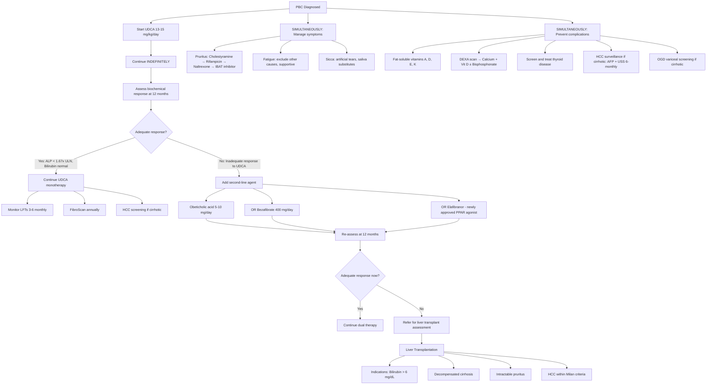

## Management of Primary Biliary Cholangitis

### Management Philosophy — First Principles

Before diving into individual treatments, understand the management framework. PBC is a chronic autoimmune disease that destroys bile ducts. You cannot regenerate destroyed bile ducts. So the management strategy is:

1. **Slow/halt disease progression** — UDCA and second-line agents to protect remaining ducts and reduce cholestatic injury
2. **Manage symptoms** — pruritus, fatigue, sicca symptoms
3. **Prevent and treat complications** — fat-soluble vitamin deficiency, osteoporosis, portal hypertension
4. **Replace the liver when it fails** — liver transplantation as definitive treatment for end-stage disease

The good news: with UDCA, patients who respond biochemically have a **near-normal life expectancy**. The challenge: ~40% do not adequately respond to UDCA and need escalation.

---

### Management Algorithm

---

### 1. Disease-Modifying Therapy

#### A. Ursodeoxycholic Acid (UDCA) — FIRST-LINE

***Ursodeoxycholic acid (UDCA)*** is the cornerstone and ***1st line therapy in treatment of PBC*** [1].

Let's break down the name: "urso-" = bear (originally isolated from bear bile — *Ursus* species), "deoxy-" = removal of an oxygen/hydroxyl group, "cholic acid" = bile acid. UDCA is a naturally occurring hydrophilic bile acid that constitutes only ~3% of the normal human bile acid pool.

| Aspect | Detail |
|---|---|
| **Dosage** | ***13–15 mg/kg/day*** [1], given orally, usually in divided doses (or single daily dose) |
| **Duration** | ***Should be continued indefinitely once started*** [1] — this is a lifelong therapy; it is the ***only treatment aimed at modifying the natural history of the disease*** [1] |
| **Mechanism of action** | ***Affects biliary composition and flow by an unknown mechanism*** [1]. However, several mechanisms are now understood: |

**Mechanisms of UDCA — explained from first principles:**

The problem in PBC is that toxic hydrophobic bile acids (chenodeoxycholic acid, lithocholic acid) accumulate in the liver due to cholestasis → these damage hepatocyte membranes and bile duct epithelium → worsen inflammation and fibrosis.

UDCA works by:

1. **Displacing toxic bile acids** — UDCA is hydrophilic ("water-loving"). When you flood the bile acid pool with UDCA (it becomes ~40–60% of the pool), it displaces hydrophobic toxic bile acids → reduced hepatocyte injury. Think of it as diluting poison with a harmless substance.

2. **Choleretic effect** — UDCA stimulates bicarbonate secretion by cholangiocytes (the "bicarbonate umbrella") → protects bile duct epithelium from bile acid toxicity → slows duct destruction.

3. **Anti-apoptotic** — UDCA inhibits mitochondrial membrane permeabilisation → reduces hepatocyte apoptosis triggered by toxic bile acids.

4. **Immunomodulatory** — UDCA reduces aberrant HLA class I expression on hepatocytes, reducing immune-mediated attack. It also decreases production of pro-inflammatory cytokines (IL-2, IL-4, IFN-γ).

5. **Stimulates biliary secretion** — Enhances canalicular transporter expression (BSEP, MRP2) → promotes bile acid excretion → reduces intracellular bile acid toxicity.

**Clinical significance** [1]:
- ***Decreases pruritus and improves LFT (bilirubin/ALP/GGT)*** [1]
- ***Increases survival, delays progression to end-stage liver disease and delays liver transplantation*** [1]
- UDCA responders have survival rates comparable to the age- and sex-matched general population
- **Does NOT reverse established cirrhosis** — it slows progression and may reverse early fibrosis

**Adverse effects** [1]:
- ***GI upset is the most common including abdominal pain and diarrhoea*** [1]
- Weight gain (~3 kg in first year)
- Very rarely: hair thinning
- Overall, UDCA is remarkably well-tolerated

**Contraindications:**
- Complete biliary obstruction (bile acid cannot reach the bile duct if there's complete blockage)
- Known hypersensitivity to UDCA or bile acids
- Caution in patients with calcified gallstones (theoretical risk of stone dissolution → complications, though this is more relevant to gallstone dissolution therapy)

<Callout title="UDCA — The Exam Must-Know" type="idea">
***Q3 from the case study: "Is there any specific drug treatment for PBC and how effective is it?"*** The answer is UDCA [1]:
- ***Affects biliary composition and flow by unknown mechanism***
- ***Results: Decreases pruritus, Improves liver function, Improves survival and delays liver transplantation*** [1]

The key exam point: UDCA is the ONLY disease-modifying therapy with proven survival benefit. It must be continued **indefinitely**. Response is assessed at **12 months**.
</Callout>

#### B. Assessing UDCA Response — The 12-Month Decision Point

After 12 months of UDCA at adequate dose, you must assess whether the patient has responded. This is THE critical management decision in PBC — it determines prognosis and need for second-line therapy.

| Criteria | Definition of Adequate Response | Notes |
|---|---|---|
| **Barcelona** | ALP decrease > 40% of baseline OR normalisation | Simple; widely used |
| **Paris-I** | ALP < 3× ULN AND AST < 2× ULN AND Bilirubin ≤ 1 mg/dL | For advanced disease |
| **Paris-II** | ALP < 1.5× ULN AND AST < 1.5× ULN AND normal bilirubin | For early disease |
| **Toronto** | ALP < 1.67× ULN | Simplest single-parameter criterion |
| **GLOBE score** | Composite: age + ALP + bilirubin + albumin + platelets at 12 months | Validated; predicts transplant-free survival |
| **UK-PBC score** | Composite: ALP + ALT/AST + bilirubin + albumin + platelets at 12 months | Most widely recommended in current guidelines (2024 EASL) |

**Why assess at 12 months?** UDCA takes time to reach steady-state effect on the bile acid pool and cholangiocyte protection. Assessing too early leads to false non-response.

**What proportion respond?** Approximately 60% of PBC patients show adequate biochemical response to UDCA. The remaining ~40% are "inadequate responders" who need escalation.

#### C. Obeticholic Acid (OCA) — SECOND-LINE

***Obeticholic acid — indicated in patients with an inadequate response to UDCA defined as ALP level > 2× upper limit of normal after 1 year of UDCA*** [1].

Let's break down the name: "obe-" = from obese/bile acid research, "ti-" = modification, "cholic acid" = bile acid. OCA is a semi-synthetic derivative of chenodeoxycholic acid, modified to be a potent **FXR agonist**.

| Aspect | Detail |
|---|---|
| **Mechanism** | Farnesoid X receptor (FXR) agonist. FXR is a nuclear receptor in hepatocytes and cholangiocytes that acts as a "bile acid sensor." When activated: (1) ↓ bile acid synthesis (via repression of CYP7A1), (2) ↑ bile acid export (via BSEP upregulation), (3) ↓ bile acid uptake (via NTCP downregulation), (4) anti-fibrotic and anti-inflammatory effects. Net result: reduced intrahepatic bile acid concentration → less cholestatic injury. |
| **Dosage** | Start 5 mg/day; titrate to 10 mg/day after 3 months if tolerated and ALP/bilirubin not normalised |
| **Indication** | Add-on to UDCA in inadequate responders; or monotherapy if UDCA-intolerant |
| **Clinical benefit** | Significant reduction in ALP and bilirubin; long-term outcome data less robust than UDCA |
| **Key adverse effect** | **Pruritus** — dose-dependent, often severe, affects ~70% of patients. This is ironic: you're treating a disease that causes pruritus with a drug that worsens pruritus. Mechanism: FXR activation in the ileum increases FGF19, which can promote pruritus. |
| **Contraindications** | **Decompensated cirrhosis (Child-Pugh B or C)** — OCA can worsen liver failure and has been associated with hepatic decompensation and death in cirrhotic patients. The FDA issued a **black box warning** in 2021 and OCA was withdrawn from the US market in 2024 for the PBC indication due to safety concerns in advanced disease, though it remains available in some jurisdictions under restricted use. |
| **Monitoring** | LFTs every 3 months; discontinue if signs of hepatic decompensation |

<Callout title="OCA Safety Concerns — Important Update" type="error">
In June 2024, the FDA requested withdrawal of OCA (Ocaliva) from the US market for PBC after a confirmatory trial failed to demonstrate clinical benefit and showed a concerning safety signal in advanced disease. However, OCA remains available in some countries (including potentially via special access in HK) and may still appear in exam questions. The key point: **OCA is contraindicated in decompensated cirrhosis** and must be used with caution. Current guidelines now favour **bezafibrate** or **elafibranor** as preferred second-line options.
</Callout>

#### D. Fibrates — EMERGING SECOND-LINE (Now Guideline-Recommended)

**Bezafibrate** and **fenofibrate** are PPARα agonists that have shown significant benefit in PBC:

| Aspect | Bezafibrate | Fenofibrate |
|---|---|---|
| **Mechanism** | PPARα agonist → (1) ↓ bile acid synthesis, (2) ↓ inflammation (NF-κB inhibition), (3) ↑ phospholipid secretion (protects biliary epithelium), (4) stimulates MDR3 transporter → enhanced biliary phospholipid secretion | Similar PPARα mechanism |
| **Dosage** | 400 mg/day (modified-release) | 200 mg/day (micronised) |
| **Evidence** | BEZURSO trial (2018) — significant improvement in ALP, bilirubin, pruritus, and composite endpoint; included in EASL 2024 guidelines as second-line | Smaller trials; less robust evidence than bezafibrate |
| **Key advantage** | May actually **improve pruritus** (unlike OCA which worsens it) | |
| **Adverse effects** | Myalgia, rhabdomyolysis (rare), hepatotoxicity (monitor LFTs), renal impairment | Similar; more hepatotoxic than bezafibrate |
| **Contraindications** | Severe renal impairment (eGFR < 30), decompensated cirrhosis, concurrent statin use increases myopathy risk | Same as bezafibrate |

#### E. Elafibranor — NEWEST APPROVED AGENT (2024)

**Elafibranor** ("ela" = selective, "fibr" = fibrate-like, "anor" = novel modulator) is a **dual PPARα/δ agonist** approved by the FDA in June 2024 for PBC patients with inadequate UDCA response.

| Aspect | Detail |
|---|---|
| **Mechanism** | Dual PPARα/δ agonist. PPARα activation → ↓ bile acid synthesis and inflammation (like fibrates). PPARδ activation → ↑ cholesterol efflux, anti-inflammatory effects in macrophages, improved insulin sensitivity. The dual action provides broader anti-cholestatic and anti-fibrotic effects. |
| **Dosage** | 80 mg orally once daily |
| **Evidence** | ELATIVE trial (2023) — significant ALP normalisation and bilirubin improvement vs placebo |
| **Indication** | Add-on to UDCA in inadequate responders; or monotherapy if UDCA-intolerant |
| **Advantage over OCA** | Better tolerated; does NOT worsen pruritus; no hepatotoxicity signal |
| **Adverse effects** | Nausea, diarrhoea, abdominal pain (mild); weight increase |
| **Contraindications** | Decompensated cirrhosis; pregnancy/lactation |

#### F. Seladelpar — Another PPAR-δ Selective Agonist

**Seladelpar** was approved by the FDA in August 2024 — a selective PPARδ agonist:
- 10 mg orally once daily
- ENHANCE trial showed significant biochemical response
- Well tolerated; may improve pruritus
- Now included in updated AASLD guidelines as second-line option

<Callout title="The Evolving Treatment Landscape — 2024-2026">
The PBC treatment landscape has changed dramatically since the reference notes were written. The current hierarchy (EASL 2024, AASLD 2024):

**First-line**: UDCA 13–15 mg/kg/day (unchanged)

**Second-line** (if inadequate UDCA response at 12 months):
- **Preferred**: Bezafibrate 400 mg/day (strongest evidence + improves pruritus)
- **Alternative**: Elafibranor 80 mg/day or Seladelpar 10 mg/day (newly approved PPARα/δ or PPARδ agonists)
- **Less preferred**: OCA (safety concerns; restricted availability)

**Third-line / refractory**: Liver transplantation
</Callout>

#### Summary: Disease-Modifying Therapy Decision Tree

| Step | Treatment | When | Key Points |
|---|---|---|---|
| **1st line** | ***UDCA 13–15 mg/kg/day*** [1] | At diagnosis; continue indefinitely | Only proven survival benefit; well tolerated |
| **2nd line** | Bezafibrate 400 mg/day OR Elafibranor 80 mg/day OR Seladelpar 10 mg/day | Inadequate UDCA response at 12 months | Add to UDCA (not replace it) |
| **2nd line (alternative)** | ***Obeticholic acid 5–10 mg/day*** [1] | Inadequate UDCA response | Worsens pruritus; contraindicated in decompensated cirrhosis; restricted availability post-2024 |
| **PBC-AIH overlap** | UDCA + Prednisolone ± Azathioprine | If overlap confirmed by Paris criteria | Immunosuppression needed for the AIH component |
| **End-stage** | Liver transplantation | Decompensated cirrhosis, intractable symptoms, HCC | Definitive; excellent outcomes; PBC can recur post-transplant (~20%) |

---

### 2. Symptom Management

#### A. Pruritus — Stepwise Approach

Pruritus is often the most debilitating symptom and can be present even before jaundice develops. Management follows a stepladder approach [1]:

**Step 1: Cholestyramine (First-line for pruritus)**

***Cholestyramine*** [1]:
- **Pharmacological category**: ***Resins*** [1] (bile acid sequestrant)
- **Mechanism**: ***↑ Excretion of bile acids in jejunum and ileum by chelating bile salts*** [1]. Cholestyramine is a positively-charged anion-exchange resin that binds negatively-charged bile acids in the intestinal lumen → prevents their enterohepatic recirculation → reduces serum bile acid levels → less pruritogen delivery to skin. Think of it as a "bile acid sponge" in the gut.
- **Dosage**: 4 g before and after breakfast (timing matters: give 4 hours apart from UDCA because cholestyramine will also bind UDCA and reduce its absorption)
- ***Adverse effects include dyspepsia, bloating, diarrhoea and constipation*** [1]
- Also reduces absorption of fat-soluble vitamins (A, D, E, K) — supplement as needed
- Can interfere with absorption of other medications (thyroid hormones, warfarin, digoxin) — take other drugs 1 hour before or 4–6 hours after cholestyramine

<Callout title="Cholestyramine — Timing Is Everything" type="error">
A critical practical point: cholestyramine binds UDCA in the gut and neutralises it. **Always separate dosing by at least 4 hours**. Give cholestyramine before breakfast, UDCA at lunchtime/evening. If you don't separate them, you're sabotaging your disease-modifying therapy.
</Callout>

**Step 2: Rifampicin (Second-line for pruritus)**

***Rifampicin*** [1]:
- **Category**: ***Enzyme-inducing antibiotic*** [1]
- **Mechanism**: ***Improves pruritus in cholestasis*** [1] through multiple mechanisms:
  - Induces hepatic microsomal enzymes (CYP3A4, CYP2C) → enhanced metabolism and detoxification of pruritogens
  - Activates PXR (pregnane X receptor) → upregulates bile acid export pumps (MRP2) → enhanced biliary excretion of pruritogens
  - May reduce serum autotaxin activity (the enzyme producing lysophosphatidic acid, a key pruritogen)
- **Dosage**: 150–300 mg/day (start low)
- ***Potentially hepatotoxic*** [1] — monitor LFTs every 2–4 weeks for the first 3 months; discontinue if transaminases rise significantly
- Also causes orange discolouration of urine, tears, sweat (warn patients)
- Drug interactions: potent CYP inducer → reduces efficacy of many drugs (OCP, warfarin, immunosuppressants)

**Step 3: Opioid Antagonists (Third-line for pruritus)**

***Naloxone/Naltrexone/Nalmefene*** [1]:
- ***Opioid antagonists*** [1]
- **Mechanism**: Cholestatic pruritus involves upregulation of endogenous opioid tone. Bile acids stimulate opioid receptor pathways → itch. Opioid antagonists block μ-opioid receptors → reduce itch signal transmission.
- ***Naloxone is given IV whereas naltrexone and nalmefene are given orally*** [1]
- **Dosage**: Naltrexone 25–50 mg/day orally (start at 12.5 mg to avoid opioid withdrawal-like reaction)
- **Side effects**: Initial opioid withdrawal-like syndrome (nausea, anxiety, dysphoria) — start at very low dose and titrate slowly; also potential hepatotoxicity
- Not first-line because of withdrawal reaction and limited efficacy data

**Step 4: IBAT Inhibitors / Other Agents (Fourth-line)**

- **Linerixibat / Maralixibat** — ileal bile acid transporter (IBAT) inhibitors. Block bile acid reabsorption in terminal ileum → increased faecal bile acid excretion → reduced enterohepatic circulation → less pruritogen load. Linerixibat showed benefit in the GLIMMER trial (2023).
- **Sertraline** (SSRI) — 75–100 mg/day; may modulate serotonergic itch pathways; modest evidence
- **UV-B phototherapy** — unclear mechanism; may alter cutaneous nerve fibres
- **Plasmapheresis / albumin dialysis (MARS)** — for severe refractory pruritus as bridge to transplant
- **Nasobiliary drainage** — temporary measure to physically divert bile in extreme cases

**Step 5: Liver Transplantation (Definitive for intractable pruritus)**

When pruritus is so severe that quality of life is unacceptable despite all medical therapy, this alone can be an indication for transplant listing.

| Step | Agent | Mechanism | Key Considerations |
|---|---|---|---|
| 1 | ***Cholestyramine*** | Bile acid sequestrant | Separate from UDCA by 4 hours; GI side effects |
| 2 | ***Rifampicin*** | Enzyme induction; PXR activation | Hepatotoxic — monitor LFTs; drug interactions |
| 3 | ***Naltrexone*** | Opioid antagonist | Withdrawal reaction; start low |
| 4 | Linerixibat | IBAT inhibitor | Newer; diarrhoea; emerging evidence |
| 5 | Liver transplant | Definitive | For truly intractable pruritus |

#### B. Fatigue

Fatigue in PBC is multifactorial and unfortunately **does NOT correlate with disease severity** and often **does NOT improve after transplantation**:
- Exclude and treat contributing causes: anaemia, hypothyroidism (check TFTs), depression, sleep disturbance from pruritus, adrenal insufficiency
- **No specific effective treatment** for PBC-related fatigue
- Supportive measures: regular exercise (shown to improve fatigue and quality of life), sleep hygiene, psychological support
- Modafinil has been trialled with limited benefit

#### C. Sicca Symptoms (Dry Eyes / Dry Mouth)

From associated Sjögren's syndrome (40–65%):
- **Artificial tears** (preservative-free) for dry eyes
- **Pilocarpine** (muscarinic agonist) — stimulates residual salivary gland function
- **Saliva substitutes** (methylcellulose-based) for dry mouth
- Regular dental check-ups (dry mouth → increased caries risk)
- Avoid anticholinergic medications (worsen dryness)

---

### 3. Dietary Modification and Nutritional Support

***Medium chain triglycerides (MCT)*** [1]:
- ***Symptomatic steatorrhoea due to bile acid insufficiency can be partially corrected by restricting dietary fat*** [1]
- ***MCTs are added or used for cooking if caloric supplementation is required to maintain body weight*** [1]
- ***MCT does not require bile acids for absorption to enterocytes and hence can be digested and absorbed into circulation despite low bile acid concentration*** [1]
- ***MCT is absorbed by diffusion and does not require micellar formation*** [1]

Why does this work from first principles?
- Normal dietary fats are long-chain triglycerides (LCTs, C14–C20) → require bile acid-dependent micellar solubilisation → absorbed via lymphatics → chylomicrons
- MCTs (C6–C12 fatty acids) are smaller → directly absorbed across enterocyte membrane by passive diffusion → enter portal circulation directly (NOT lymphatics)
- So when bile acids are deficient (as in PBC cholestasis), MCTs bypass the impaired step entirely

***Vitamin supplementation*** [1]:
- ***Vitamin A — oral supplement to compensate for deficiency*** [1]
- ***Vitamin D — prescribed to treat the hepatic osteodystrophy*** [1]
- ***Vitamin A and D deficiency are more common requiring supplementation*** [1]
- ***Measurement of serum vitamin A and calcidiol is required*** [1]
- Vitamin K — oral or parenteral if coagulopathy present (check PT/INR)
- Vitamin E — supplement if neurological symptoms or very low levels

| Vitamin | Deficiency Consequence | Supplement | Monitoring |
|---|---|---|---|
| **A** | Night blindness, xerophthalmia | 25,000–50,000 IU orally 2–3 times/week | Serum retinol levels |
| **D** | Osteomalacia, contributes to osteoporosis | Cholecalciferol 800–2000 IU/day (or higher if deficient) | Serum 25-OH-vitamin D (calcidiol) |
| **E** | Peripheral neuropathy, ataxia (rare) | 100–400 IU/day | Serum α-tocopherol |
| **K** | Coagulopathy (↑ PT/INR) | 10 mg orally or 10 mg IV if severe | PT/INR |

---

### 4. Management of Hepatic Osteodystrophy

***Hepatic osteodystrophy (Osteopenia/Osteoporosis/Osteomalacia)*** [1]:
- ***Metabolic bone disease includes osteopenia and osteoporosis or rarely osteomalacia*** [1]
- ***Characteristic bone disorder in PBC reflects the inhibitory effect of a retained toxin on the osteoblast which prevents it from functioning normally*** [1]

Treatment [1]:
- ***Calcium and vitamin D supplementation*** [1] — 1000–1200 mg calcium + 800–2000 IU vitamin D daily
- ***Bisphosphonates*** [1] — ***Example: Alendronate*** [1]
  - Mechanism: bisphosphonates ("bis" = two, "phosphonate" = phosphorus-containing) bind to hydroxyapatite in bone → taken up by osteoclasts → inhibit farnesyl pyrophosphate synthase (in the mevalonate pathway) → osteoclast apoptosis → reduced bone resorption
  - Indicated when T-score ≤ −2.5 (osteoporosis) or ≤ −1.5 with additional risk factors
  - Concern in PBC: oesophageal varices are a relative contraindication to oral bisphosphonates (risk of oesophageal ulceration) → use IV zoledronic acid instead if varices present
- Regular weight-bearing exercise
- DEXA scan every 2–3 years to monitor

<Callout title="Osteoporosis in PBC — A Double Hit">
PBC causes osteoporosis through two mechanisms:
1. **Vitamin D malabsorption** → less calcium absorption → osteomalacia
2. **Direct osteoblast inhibition** by retained cholestatic toxins (bilirubin, bile acids) → reduced bone formation → osteoporosis

This is why you treat with BOTH vitamin D (for the malabsorption) AND bisphosphonates (for the osteoblast inhibition). Calcium + vitamin D alone is insufficient if T-score shows osteoporosis.
</Callout>

---

### 5. Management of Hyperlipidaemia

***Hyperlipidaemia*** [1]:
- ***Increased cholesterol level in PBC does not increase atherosclerotic risk*** [1]
- ***Majority are elevation of HDL and lipoprotein-X which are anti-atherogenic*** [1]
- ***Treatment is not always needed and is indicated only if familial or other known risk factors are present*** [1]

Practical approach:
- Do NOT routinely start statins for elevated cholesterol in PBC
- If patient has additional cardiovascular risk factors (family history, diabetes, smoking, hypertension) → treat per standard lipid guidelines
- If statin indicated, use with caution (cholestasis can alter statin metabolism)

---

### 6. Surgical Treatment — Liver Transplantation

***Liver transplantation — indicated in patients with*** [1]:
- ***Serum bilirubin > 6 mg/dL*** [1] (reflects severe ductopenia with very poor prognosis)
- ***Decompensated liver cirrhosis*** [1]
- ***Anticipated death within a year due to*** [1]:
  - ***Treatment-resistant ascites and spontaneous bacterial peritonitis*** [1]
  - ***Recurrent variceal bleeding*** [1]
  - ***Hepatic encephalopathy*** [1]
  - ***HCC*** [1] (within Milan criteria: single lesion ≤ 5 cm OR up to 3 lesions each ≤ 3 cm)
- **Intractable pruritus** unresponsive to all medical therapy (quality of life indication)

| Aspect | Detail |
|---|---|
| **Timing** | Refer when MELD score ≥ 15 or MELD-Na ≥ 15; earlier if intractable symptoms |
| **Outcomes** | Excellent — 5-year survival ~80–85%; among the best outcomes for any liver transplant indication |
| **PBC recurrence post-transplant** | ~20–30% develop histological recurrence in the graft (usually mild, responds to UDCA); graft loss from recurrence is rare (~5% at 10 years) |
| **Type of transplant** | Deceased donor liver transplant (DDLT) preferred; living donor liver transplant (LDLT) in regions with organ shortage (relevant to HK — LDLT is more commonly performed at Queen Mary Hospital) |
| **Post-transplant management** | Standard immunosuppression (tacrolimus-based) + resume UDCA (to prevent/treat recurrence) + monitor AMA (may persist but does not predict recurrence) |

<Callout title="The Case Study Revisited" type="idea">
The case in the senior notes [1] illustrates transplant timing perfectly: 50-year-old woman → diagnosed PBC → started UDCA (***daily oral medication which was followed by some improvement of her liver function and pruritus*** [1]) → progressive ascites → hepatic encephalopathy → ***referred for liver transplantation assessment*** [1]. This patient has decompensated cirrhosis with ascites requiring paracentesis and encephalopathy — clear transplant indications.
</Callout>

---

### 7. Management of Complications of Cirrhosis in PBC

When PBC progresses to cirrhosis, management of complications is the same as for cirrhosis of any cause:

#### A. Ascites

- **First-line**: Sodium restriction (< 2 g/day = < 88 mmol/day) + Spironolactone (100–400 mg/day) ± Furosemide (40–160 mg/day)
- **Refractory**: Large-volume paracentesis (LVP) with albumin replacement (6–8 g albumin per litre drained), TIPS
- Mechanism: Portal hypertension → splanchnic vasodilation → reduced effective arterial blood volume → RAAS activation → sodium and water retention → ascites

#### B. Hepatic Encephalopathy

***Hepatic encephalopathy management*** [1]:
- ***IV Dextrose drip — provide adequate calorie intake to prevent protein breakdown*** [1]
- ***Oral Lactulose — as an enema with the aim of inducing bowel movements 2–4 times per day*** [1]
- ***No protein diet*** [1] (short-term; long-term moderate protein restriction 1–1.5 g/kg/day is preferred over complete restriction)
- ***Any treatable precipitating factor should be identified and treated*** [1]

***Lactulose mechanism*** [1]:
- ***Non-absorbable disaccharide*** [1]
- ***Acts as an osmotic diarrheal agent*** [1]
- ***Acted upon by lactobacilli in colon to form H₂ and CO₂*** [1]
- ***Acidic pH buffers NH₃ from gut-derived bacteria and in blood to form NH₄⁺*** [1]
  - NH₃ (ammonia) is lipophilic and crosses the blood-brain barrier → neurotoxic
  - NH₄⁺ (ammonium) is charged/hydrophilic and CANNOT cross → trapped in gut lumen → excreted in faeces
- ***Side effects: Flatulence, dehydration (from excessive diarrhoea), aversion to sweet taste*** [1]

Rifaximin (non-absorbable antibiotic) is added for secondary prophylaxis of encephalopathy.

***Precipitating factors for hepatic encephalopathy*** [1]:
- ***↑ Protein intake*** [1]
- ***GI bleeding*** (↑ protein from blood in gut + ↓ liver blood supply) [1]
- ***Constipation*** [1]
- ***Infection*** (especially ***spontaneous bacterial peritonitis***) [1]
- ***Over-diuresis*** (dehydration and electrolyte disturbance) [1]
- ***Inappropriate paracentesis without adequate albumin infusion*** [1]
- ***Shunting procedures including TIPS*** [1]
- ***Drugs — hypnotics*** [1]

#### C. Variceal Bleeding

- **Primary prophylaxis**: Non-selective beta-blockers (propranolol, carvedilol) or endoscopic band ligation
- **Acute bleeding**: Resuscitation → IV terlipressin + antibiotics → emergency OGD with band ligation → TIPS if refractory
- **Secondary prophylaxis**: Band ligation + non-selective beta-blocker

#### D. HCC Surveillance

***Patients with PBC and cirrhosis are at increased risk of HCC*** [1]:
- AFP + USS every 6 months
- CT/MRI if suspicious lesion identified

---

### Management Summary Table

| Management Domain | Intervention | Key Details |
|---|---|---|
| **Disease-modifying (1st line)** | ***UDCA 13–15 mg/kg/day*** | Lifelong; assess response at 12 months; proven survival benefit |
| **Disease-modifying (2nd line)** | Bezafibrate 400 mg/day or Elafibranor 80 mg/day or Seladelpar 10 mg/day or ***OCA 5–10 mg/day*** | Add to UDCA; OCA contraindicated in decompensated cirrhosis |
| **PBC-AIH overlap** | UDCA + Prednisolone ± Azathioprine | Immunosuppression for AIH component |
| **Pruritus** | ***Cholestyramine → Rifampicin → Naltrexone*** → IBAT inhibitor | Stepwise; separate cholestyramine from UDCA by 4 hours |
| **Dietary** | ***MCT for steatorrhoea; Vitamin A, D, (E, K) supplementation*** | MCT does not require bile acids for absorption |
| **Bone disease** | ***Calcium + Vitamin D + Alendronate*** | IV bisphosphonate if varices present |
| **Hyperlipidaemia** | Usually no treatment needed | Not atherogenic (↑HDL, Lp-X) |
| **Fatigue** | Supportive; exercise; exclude secondary causes | No specific effective therapy |
| **Sicca** | Artificial tears; pilocarpine; saliva substitutes | Sjögren's association |
| **Cirrhosis complications** | Standard management (ascites, encephalopathy, varices, HCC) | As for cirrhosis of any aetiology |
| **Definitive** | ***Liver transplantation*** | Bilirubin > 6, decompensated CLD, intractable pruritus, HCC |

---

<Callout title="High Yield Summary — Management of PBC">

1. **UDCA is THE first-line treatment**: ***13–15 mg/kg/day, continued indefinitely***. It is the ***only treatment that modifies the natural history*** of PBC, with proven survival benefit [1].

2. **Assess response at 12 months**: ~60% respond adequately. Non-responders need second-line therapy.

3. **Second-line**: Bezafibrate (PPARα agonist, 400 mg/day) is now preferred; elafibranor and seladelpar are newly approved PPARδ agonists. ***OCA*** [1] is an option but has safety concerns (worsens pruritus, contraindicated in decompensated cirrhosis).

4. **Pruritus management is stepwise**: ***Cholestyramine*** (bile acid sequestrant, separate from UDCA) → ***Rifampicin*** (enzyme inducer, hepatotoxic) → ***Naltrexone*** (opioid antagonist) → IBAT inhibitors → transplant [1].

5. **Nutritional support**: ***MCTs for steatorrhoea*** (bypass bile acid-dependent absorption); ***Vitamins A and D supplementation*** (most commonly deficient) [1].

6. **Bone disease**: ***Calcium + Vitamin D + Bisphosphonates (alendronate)*** [1].

7. **Liver transplantation**: ***Indicated for bilirubin > 6 mg/dL, decompensated cirrhosis, intractable symptoms, HCC***. Excellent outcomes (~85% 5-year survival). PBC can recur in graft (~20%) [1].

8. **Hepatic encephalopathy**: ***Lactulose*** (trap ammonia as NH₄⁺ in gut), ***dextrose*** (prevent catabolism), ***identify and treat precipitants*** [1].

</Callout>

---

<ActiveRecallQuiz
  title="Active Recall - Management of PBC"
  items={[
    {
      question: "State the first-line treatment for PBC, its dose, duration, and 3 proven clinical benefits.",
      markscheme: "UDCA (ursodeoxycholic acid) at 13-15 mg/kg/day, continued indefinitely (lifelong). Benefits: (1) Decreases pruritus and improves LFT (bilirubin, ALP, GGT), (2) Increases survival and delays progression to end-stage liver disease, (3) Delays need for liver transplantation. It is the only treatment that modifies the natural history of PBC."
    },
    {
      question: "Describe the stepwise management of pruritus in PBC (4 steps) and explain the mechanism of each agent.",
      markscheme: "Step 1: Cholestyramine - bile acid sequestrant resin that chelates bile salts in intestine reducing enterohepatic recirculation and serum bile acid levels. Step 2: Rifampicin - enzyme-inducing antibiotic that activates PXR, upregulates bile acid export pumps, and enhances metabolism of pruritogens (hepatotoxic - monitor LFTs). Step 3: Naltrexone - oral opioid antagonist that blocks mu-opioid receptors involved in cholestatic itch signalling. Step 4: IBAT inhibitors (e.g. linerixibat) - block ileal bile acid transporter reducing bile acid reabsorption and enterohepatic circulation."
    },
    {
      question: "A PBC patient on UDCA for 12 months still has ALP 3 times ULN with rising bilirubin. What are 3 second-line agents you could add, and what is the key contraindication for obeticholic acid?",
      markscheme: "Second-line agents: (1) Bezafibrate 400 mg/day (PPARalpha agonist, preferred), (2) Elafibranor 80 mg/day (dual PPARalpha/delta agonist), (3) Obeticholic acid 5-10 mg/day (FXR agonist). Key contraindication for OCA: decompensated cirrhosis (Child-Pugh B or C) - associated with worsening liver failure and death. FDA requested market withdrawal in 2024 due to safety concerns."
    },
    {
      question: "Explain why MCTs are useful in PBC-related steatorrhoea from first principles.",
      markscheme: "In PBC, cholestasis reduces bile acid delivery to the intestine. Normal dietary fats (long-chain triglycerides, LCTs) require bile acid-dependent micellar solubilisation for absorption. MCTs (medium-chain triglycerides, C6-C12) are smaller molecules that are absorbed directly across the enterocyte membrane by passive diffusion without requiring micellar formation or bile acids. They enter the portal circulation directly rather than lymphatics. Therefore MCTs bypass the impaired bile acid-dependent step and can provide calories despite bile acid deficiency."
    },
    {
      question: "List 4 indications for liver transplantation in PBC and state the expected 5-year survival and recurrence rate.",
      markscheme: "Indications: (1) Serum bilirubin greater than 6 mg/dL, (2) Decompensated cirrhosis (treatment-resistant ascites, SBP, recurrent variceal bleeding, hepatic encephalopathy), (3) HCC within Milan criteria, (4) Intractable pruritus unresponsive to all medical therapy. 5-year survival approximately 80-85%. PBC recurrence in graft occurs in approximately 20-30% (usually mild, responds to UDCA)."
    },
    {
      question: "Explain the mechanism of action of lactulose in hepatic encephalopathy and list 3 side effects.",
      markscheme: "Lactulose is a non-absorbable disaccharide that acts as an osmotic laxative. In the colon, lactobacilli break it down to form H2 and CO2, creating an acidic environment. The low pH converts ammonia (NH3, lipophilic, crosses BBB, neurotoxic) to ammonium (NH4+, charged, hydrophilic, cannot cross BBB), trapping it in the gut lumen for faecal excretion. Side effects: (1) Flatulence, (2) Dehydration from excessive diarrhoea, (3) Aversion to sweet taste."
    }
  ]}
/>

## References

[1] Senior notes: felixlai.md (Primary Biliary Cholangitis — Treatment section, pages 535–539; Case study and Q&A, pages 538–540)
[3] Senior notes: felixlai.md (Primary Sclerosing Cholangitis — Treatment section, pages 531–532)
[8] Senior notes: felixlai.md (Liver Cirrhosis section — causes, complications, pages 440–446)
