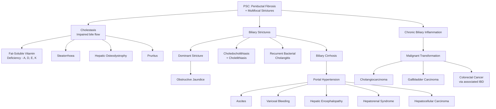

## Complications of Primary Sclerosing Cholangitis

### The Big Picture — Why PSC Is a Disease of Complications

PSC itself progresses silently in many patients for years. The morbidity and mortality come overwhelmingly from the **complications** of the disease rather than the primary pathology per se. Think of PSC as a slow-burning fire in the biliary tree: the strictures form quietly, but the consequences — cholestasis, cirrhosis, infection, and cancer — are what kill or debilitate patients.

Let's organise the complications into a logical framework that follows the pathophysiological cascade:

---

### I. Complications of Cholestasis

These complications arise because bile cannot flow properly through the strictured biliary tree. The retained bile and its constituents cause systemic damage.

#### 1. Steatorrhoea and Fat Malabsorption

***Steatorrhoea and vitamin deficiency result from decreased biliary secretion of bile acids*** [1][24].

**From first principles**: Bile salts are essential for the emulsification and absorption of dietary fats. They form mixed micelles with fatty acids and monoglycerides in the duodenal lumen, which are then absorbed across the enterocyte brush border. When bile salt delivery to the duodenum is reduced (because strictures impair bile flow), fat remains undigested in the gut lumen → **steatorrhoea** (greasy, foul-smelling, floating stools that are pale because of absent stercobilin).

- Fat malabsorption leads to caloric loss and weight loss
- The degree of steatorrhoea correlates with the severity of cholestasis

#### 2. Fat-Soluble Vitamin Deficiency (A, D, E, K)

***Leads to decreased absorption of fat-soluble vitamins A, D, E, K. Vitamin A and D deficiency are more common requiring supplementation*** [24].

Fat-soluble vitamins (mnemonic: **ADEK**) require bile salt-mediated micellar solubilisation for intestinal absorption. When bile salt delivery fails:

| Vitamin | Consequence of Deficiency | Pathophysiological Mechanism |
|:---|:---|:---|
| **Vitamin A** | Night blindness (nyctalopia), xerophthalmia, dry skin | Vitamin A (retinol) is essential for rhodopsin synthesis in retinal rods; without adequate bile salts, retinol cannot be absorbed from the gut |
| **Vitamin D** | Osteomalacia, osteoporosis (see hepatic osteodystrophy below), hypocalcaemia | Cholecalciferol (vitamin D3) requires bile salts for absorption. Deficiency → impaired intestinal calcium absorption → secondary hyperparathyroidism → bone resorption. The liver also hydroxylates vitamin D to 25-OH-vitamin D (calcidiol) — hepatic dysfunction further impairs this step |
| **Vitamin E** | Peripheral neuropathy, ataxia (spinocerebellar degeneration), haemolytic anaemia | Vitamin E (alpha-tocopherol) is a fat-soluble antioxidant; its deficiency leads to oxidative damage to neuronal membranes and red blood cells |
| **Vitamin K** | Coagulopathy (prolonged PT/INR, easy bruising, bleeding) | Vitamin K is a cofactor for hepatic gamma-carboxylation of clotting factors II, VII, IX, X and proteins C and S. ***Vitamin K deficiency leading to decreased absorption of fat-soluble vitamins due to obstructive jaundice*** [8] |

<Callout title="Clinical Pearl — Is It Malabsorption or Synthetic Failure?">

When you see a prolonged PT/INR in a PSC patient, always determine whether it's **vitamin K malabsorption** (reversible) or **hepatic synthetic failure** (irreversible without transplant):
- Give **IV vitamin K 10 mg** and recheck INR in 24–48 hours
- If INR **corrects** → malabsorption (bile salt deficiency)
- If INR **does NOT correct** → liver synthetic failure (the hepatocytes are too damaged to make clotting factors even with adequate substrate)

This distinction has major implications for prognosis and transplant timing.

</Callout>

#### 3. Hepatic Osteodystrophy

***Metabolic bone disease includes osteopenia and osteoporosis or rarely osteomalacia. Characteristic bone disorder which reflects the inhibitory effect of a retained toxin on the osteoblast*** [24].

This is a specific and important complication of chronic cholestatic liver disease (both PSC and PBC):

- **Osteoporosis** (reduced bone density, normal mineralisation) is **more common** than osteomalacia in PSC
  - Mechanism: retained bile constituents (e.g., bilirubin, lithocholic acid) directly inhibit osteoblast function → reduced bone formation. Additionally, vitamin D deficiency impairs calcium absorption → secondary hyperparathyroidism → bone resorption
- **Osteomalacia** (defective mineralisation of osteoid) is less common
  - Mechanism: severe vitamin D deficiency → insufficient calcium and phosphate incorporation into bone matrix
- **Clinical significance**: Vertebral compression fractures, pathological fractures, chronic back pain
- **Management**: DEXA scan at diagnosis and every 2–3 years; calcium + vitamin D supplementation; bisphosphonates if T-score ≤ −2.5; weight-bearing exercise

#### 4. Pruritus

Already discussed in the management section, but worth listing as a complication because it can be **severely debilitating**:
- Chronic pruritus → excoriations → skin infections → sleep deprivation → depression → markedly impaired quality of life
- Can be the primary reason for liver transplant referral even in the absence of advanced cirrhosis
- Mechanism: autotaxin-generated lysophosphatidic acid (LPA) rather than bile salt deposition in skin (old theory)

---

### II. Complications of Biliary Strictures

The strictures are the defining anatomical lesion of PSC, and they generate their own cascade of problems.

#### 1. Dominant Strictures

***Up to 60% of patients may develop a dominant stricture in intrahepatic or extrahepatic biliary tree*** [24].

A dominant stricture is defined as a luminal diameter ≤ 1.5 mm in the CBD or ≤ 1.0 mm in a hepatic duct. Why does this matter?

- Causes acute worsening of jaundice (increased bilirubin due to near-complete obstruction)
- Predisposes to recurrent bacterial cholangitis (bile stasis → bacterial overgrowth)
- **Must be investigated to exclude cholangiocarcinoma** — any new dominant stricture requires ERCP with brush cytology ± FISH
- Management: ERCP balloon dilatation ± short-term plastic stent

#### 2. Choledocholithiasis and Cholelithiasis

***Choledocholithiasis and cholelithiasis due to cholesterol or pigment stones*** [24].

**Why do PSC patients develop gallstones?**
- Bile stasis → supersaturation of bile with cholesterol → cholesterol stone nucleation
- Altered bile composition (reduced bile salt:cholesterol ratio) → lithogenic bile
- Pigment stones can also form from bilirubin precipitation in the setting of chronic biliary inflammation
- Stones can form within the gallbladder (cholelithiasis) or within the bile ducts themselves (choledocholithiasis)
- ***Bilirubin may fluctuate substantially, possibly indicating transient blockage of strictured bile ducts by biliary sludge or small stones*** [1]

#### 3. Recurrent Bacterial Cholangitis

***Cholangitis develops spontaneously in patients with bile duct stones or obstructing strictures or in patients after undergoing endoscopic or surgical manipulation*** [24].

**From first principles**: Normal bile is sterile. The sphincter of Oddi acts as a barrier preventing duodenal bacteria from ascending into the biliary tree. In PSC:
- Strictures cause bile stasis → stagnant bile is an excellent culture medium
- Endoscopic interventions (ERCP, stenting) disrupt the sphincter barrier → bacterial access
- ***Biliary stent in-situ serves as a nidus for infection*** [2]
- ***Pathogens: GNR (E. coli, Klebsiella) > Enterococcus; Pseudomonas if stent present*** [2]

Clinical presentation:
- ***Charcot's triad (50–70%): Fever, RUQ pain, jaundice*** [2]
- ***Reynolds pentad ( < 10%): Charcot's triad + shock + altered mental state*** [2] — this represents suppurative cholangitis with sepsis, a surgical emergency

**Why is recurrent cholangitis so dangerous in PSC?**
- Each episode causes further inflammation → additional scarring → worsening strictures → more stasis → more cholangitis → a vicious cycle
- ***Biliary sepsis*** with endotoxaemia, impaired reticuloendothelial function, and impaired cell-mediated immunity [8]
- Can precipitate acute hepatic decompensation

---

### III. Complications of Cirrhosis and Portal Hypertension

As PSC progresses, periductal fibrosis extends into the parenchyma → bridging fibrosis → regenerative nodules → **biliary cirrhosis**. Once cirrhosis is established, PSC patients develop the same complications as any cirrhotic patient:

***Liver cirrhosis is characterised by bridging fibrosis, distortion of hepatic architecture and formation of regenerative nodules*** [25].

#### 1. Portal Hypertension and Its Consequences

| Complication | Pathophysiological Mechanism | Clinical Manifestation |
|:---|:---|:---|
| **Ascites** | Sinusoidal portal hypertension → increased hydrostatic pressure in splanchnic capillaries + hypoalbuminaemia (reduced oncotic pressure) + splanchnic vasodilation → activation of RAAS → sodium and water retention → transudative ascites | ***Abdominal distension from ascites*** [1] |
| **Oesophageal variceal bleeding** | Portal hypertension → blood diverts through portosystemic collaterals → oesophageal and gastric submucosal veins dilate → varices → rupture when wall tension exceeds threshold (Laplace's law) | ***Haematemesis from oesophageal variceal bleeding*** [1] — a life-threatening emergency requiring urgent endoscopic band ligation |
| **Hepatic encephalopathy** | Portosystemic shunting → ammonia and other neurotoxins bypass hepatic detoxification → cross blood-brain barrier → astrocyte swelling (via glutamine synthesis) → cerebral oedema and impaired neurotransmission | ***Confusion from hepatic encephalopathy*** [1]. Can be precipitated by infection, GI bleeding, constipation, protein load, medications (sedatives, diuretics causing hyponatraemia/hypokalaemia) |
| **Splenomegaly / Hypersplenism** | Splenic congestion from portal hypertension → splenomegaly → increased sequestration and destruction of blood cells | Thrombocytopaenia, leukopenia, anaemia |
| **Hepatorenal syndrome (HRS)** | Splanchnic vasodilation → decreased effective arterial blood volume → renal vasoconstriction → progressive renal failure with avid sodium retention | Rising creatinine with no structural renal disease; type 1 HRS is rapidly progressive; type 2 is indolent |

> ***Signs and symptoms of hepatic decompensation: abdominal distension from ascites, confusion from hepatic encephalopathy, haematemesis from oesophageal variceal bleeding*** [1].

***Risk factors for decompensation of cirrhosis include bleeding, dehydration, infection, obesity, alcoholism, and medications*** [25].

#### 2. Hepatocellular Carcinoma (HCC)

***Patients with PSC and cirrhosis are at increased risk of HCC*** [1][24].

- HCC develops on the background of cirrhosis from any cause — PSC is no exception
- ***Any cause of cirrhosis — infection (HBV, HCV), metabolic (ALD, NAFLD, Wilson's disease), immune (PBC, PSC)*** — can lead to HCC [11][26]
- However, the HCC risk in PSC-cirrhosis is **lower** than in HBV/HCV-related cirrhosis
- Surveillance: USG + AFP every 6 months once cirrhosis is established (standard protocol)

---

### IV. Malignant Complications — The Cancers of PSC

This is arguably the most important section on complications because malignancy is the leading cause of death in PSC patients.

#### 1. Cholangiocarcinoma (CCA)

***Strong association with cholangiocarcinoma especially perihilar disease*** [9].

**Lifetime risk**: 10–20% (some studies report up to 25%). This makes PSC the **single strongest risk factor** for cholangiocarcinoma worldwide.

**Why does chronic biliary inflammation lead to cholangiocarcinoma?**
- Chronic inflammation → repeated cycles of cholangiocyte injury and regeneration → accumulation of genetic mutations (similar to the inflammation → dysplasia → carcinoma sequence seen in UC-CRC)
- Bile stasis → prolonged exposure of cholangiocytes to toxic bile constituents → DNA damage
- ***Cholangiocarcinoma is characterised by slow growth, high rate of local invasion, mucin production and tendency to invade perineural sheath and spread along nerves*** [9]
- ***Association with ulcerative colitis (common in Westerners) and recurrent pyogenic cholangitis (common in Orientals)*** [13]

**Key clinical features in PSC-associated CCA**:
- Often occurs early in the disease course — **~50% of CCAs in PSC are diagnosed within the first 1–2 years** of PSC diagnosis (sometimes simultaneously)
- ***Mostly occurs in patients > 50 years*** [13], but PSC-associated CCA can present earlier
- Typically **perihilar** (Klatskin tumour) — ***obstruction to just left or right hepatic duct alone will not cause obstructive jaundice*** [20]; obstruction at the bifurcation blocks both systems
- Presents as a new dominant stricture with rapidly progressive jaundice, weight loss, and rising CA 19-9

**Surveillance and detection**:
- Annual MRCP + serum CA 19-9
- Any new dominant stricture → ERCP with brush cytology ± FISH
- ***Tumour markers: CEA, CA 19-9 (may or may not be elevated, nonspecific)*** [13]
- ***FNAC or Trucut biopsy ONLY for unresectable cases*** [13]

**Prognosis**: Dismal. PSC-associated CCA has a worse prognosis than sporadic CCA. Most are unresectable at diagnosis. ***Hepatic resection is the treatment of choice (resectability rate about 20%)*** [13]. For selected patients with perihilar CCA arising in PSC, the **Mayo Protocol** (neoadjuvant chemoradiation + liver transplantation) offers 5-year survival of ~60–70%.

<Callout title="Cholangiocarcinoma — The Deadliest Complication" type="error">

Cholangiocarcinoma is the **leading cause of mortality** in PSC patients and the **most feared complication**. Key exam points:
- Lifetime risk 10–20%
- ~50% diagnosed within 1–2 years of PSC diagnosis
- Typically perihilar
- Any new dominant stricture = CCA until proven otherwise
- Brush cytology with FISH on ERCP for diagnosis
- CA 19-9 > 129 U/mL has ~80% sensitivity for CCA in PSC
- ***PSC is a risk factor for IBD-associated colorectal neoplasia*** [3] — don't confuse CCA screening with CRC screening; they are separate surveillance programmes

</Callout>

#### 2. Gallbladder Carcinoma

***Gallbladder cancer*** is an under-appreciated complication of PSC [24].

- PSC patients have a **higher prevalence of gallbladder mass lesions** — both benign (polyps, adenomyomatosis) and malignant
- ***Primary sclerosing cholangitis is a risk factor for gallbladder carcinoma*** [10][19]
- The threshold for cholecystectomy in PSC patients is **lower**: ***adenomatous polyps ≥ 1 cm (or 8 mm if underlying PSC)*** [19] — compared to 10 mm in the general population
- Surveillance: Annual USG abdomen to monitor gallbladder
- Any gallbladder mass lesion in a PSC patient should prompt cholecystectomy regardless of size

#### 3. Colorectal Cancer (CRC)

This is a complication of the PSC-IBD association rather than PSC directly, but it is one of the most clinically significant:

***PSC is a patient-specific risk factor for IBD-associated colorectal neoplasia*** [3].

**Why does PSC increase CRC risk above and beyond UC alone?**
- The prevailing hypothesis: altered bile acid metabolism in PSC → increased concentration of secondary bile acids (deoxycholic acid) in the colon → direct mitogenic and DNA-damaging effects on colonic epithelium → accelerated dysplasia-carcinoma sequence
- PSC-UC patients have a **4–5× higher CRC risk** than UC patients without PSC
- The colitis in PSC-UC is often **pancolitis** (extensive involvement), which itself is a CRC risk factor

**Surveillance**: ***Primary sclerosing cholangitis: yearly*** surveillance colonoscopy [3]. This is more frequent than standard IBD surveillance:

| Population | Surveillance Interval |
|:---|:---|
| ***PSC with IBD*** | ***Yearly colonoscopy*** from time of PSC diagnosis [3] |
| UC/CD without PSC | ***Started at a maximum 8 years after UC or Crohn's colitis***; then every 1–3 years depending on risk [3] |
| ***Ulcerative proctitis*** | ***Not considered at increased risk*** [3] |

> ***Ideally, surveillance colonoscopy should be performed when the disease is in remission*** [3].

- UDCA and 5-ASA (mesalazine) may have **chemopreventive** effects against CRC in PSC-UC, though evidence is not definitive
- If high-grade dysplasia or CRC is found → colectomy (total proctocolectomy with ileal pouch-anal anastomosis for UC; segmental resection may be considered in CD)

---

### V. Complications Related to PSC-IBD Interaction

PSC doesn't just coexist with IBD — it modifies the behaviour of IBD and vice versa:

| Aspect | Details |
|:---|:---|
| **IBD behaviour in PSC** | Tends to be **pancolitis with rectal sparing**, **backwash ileitis**, and **milder symptoms** — but paradoxically **higher CRC risk** |
| **PSC post-colectomy** | PSC can develop, progress, or even present for the first time **after** total colectomy — proving that the gut-liver axis aberration is self-sustaining once established |
| **Pouchitis** | PSC-UC patients who undergo ileal pouch-anal anastomosis (IPAA) have **higher rates of pouchitis** (inflammation of the ileal pouch) than UC patients without PSC |
| **IBD post-transplant** | IBD may flare after liver transplantation due to changes in immunosuppressive regimens; new-onset IBD can also occur |

---

### VI. Recurrence After Liver Transplantation

Even after definitive treatment (transplantation), PSC has a significant recurrence rate:

- **Recurrent PSC in the allograft**: ~20–25% at 5–10 years post-transplant
- Manifests as new biliary strictures in the transplanted liver with cholangiographic features identical to original PSC
- Must be distinguished from other causes of biliary strictures post-transplant: hepatic artery thrombosis (ischaemic cholangiopathy), chronic ductopenic rejection, ABO-incompatible graft
- Recurrence is more common in patients with concurrent IBD (supporting the gut-liver axis hypothesis)
- Recurrent PSC can lead to graft loss requiring re-transplantation

---

### Summary Table: All Complications at a Glance

| Category | Specific Complications |
|:---|:---|
| **Cholestasis-related** | Steatorrhoea, fat-soluble vitamin deficiency (A, D, E, K), hepatic osteodystrophy, pruritus |
| **Stricture-related** | ***Dominant strictures (~60%)*** [24], choledocholithiasis/cholelithiasis, recurrent bacterial cholangitis |
| **Cirrhosis-related** | ***Ascites, hepatic encephalopathy, variceal bleeding*** [1], hepatorenal syndrome, spontaneous bacterial peritonitis, HCC |
| **Malignancy** | ***Cholangiocarcinoma (10–20% lifetime)*** [9], ***gallbladder carcinoma*** [24], ***CRC (via IBD)*** [3], HCC (via cirrhosis) |
| **IBD-related** | CRC, pouchitis post-IPAA, IBD flare post-transplant |
| **Post-transplant** | Recurrent PSC in allograft (~20–25%), rejection, vascular complications |

---

<Callout title="High Yield Summary — Complications of PSC">

1. **Cholestasis complications**: Steatorrhoea, fat-soluble vitamin deficiency (A, D, E, K — mnemonic: ADEK), hepatic osteodystrophy (osteoporosis > osteomalacia), pruritus.

2. ***Dominant strictures develop in up to 60% of patients*** [24] — must always be investigated with ERCP brush cytology to exclude cholangiocarcinoma.

3. **Recurrent bacterial cholangitis**: Driven by bile stasis + strictures ± stent-related biofilm. ***Charcot's triad (fever, RUQ pain, jaundice)***; ***Reynolds pentad adds shock + confusion*** [2].

4. **Biliary cirrhosis → portal hypertension**: ***Ascites, variceal bleeding, hepatic encephalopathy*** [1], hepatorenal syndrome, HCC.

5. ***Cholangiocarcinoma is the leading cause of death*** in PSC — 10–20% lifetime risk, often perihilar, ~50% diagnosed within 1–2 years of PSC diagnosis. Surveillance: annual MRCP + CA 19-9.

6. ***Gallbladder carcinoma***: Lower threshold for cholecystectomy in PSC (polyps ≥ 8 mm vs 10 mm general population) [19].

7. ***CRC risk is 4–5× higher in PSC-UC*** than UC alone → ***yearly colonoscopy*** from PSC diagnosis [3].

8. **Vitamin K deficiency**: Give IV vitamin K → if INR corrects = malabsorption; if not = hepatic synthetic failure. This distinction guides transplant timing.

9. **Recurrent PSC post-transplant**: ~20–25% at 5–10 years; confirms immune-mediated pathogenesis.

10. **PSC modifies IBD**: Pancolitis with rectal sparing, milder symptoms but paradoxically higher CRC risk.

</Callout>

---

<ActiveRecallQuiz
  title="Active Recall - PSC Complications"
  items={[
    {
      question: "List the 4 fat-soluble vitamins deficient in PSC and one clinical consequence of each. Explain the shared mechanism of deficiency.",
      markscheme: "Vitamin A: night blindness. Vitamin D: osteoporosis/osteomalacia. Vitamin E: peripheral neuropathy. Vitamin K: coagulopathy (prolonged PT/INR). Shared mechanism: bile salt delivery to duodenum is reduced due to biliary strictures causing cholestasis. Fat-soluble vitamins require bile salt-mediated micellar solubilisation for intestinal absorption, so they cannot be absorbed."
    },
    {
      question: "A PSC patient presents with rapidly progressive jaundice, weight loss, and a rising CA 19-9. What complication do you suspect, what is the investigation of choice, and what is the lifetime risk?",
      markscheme: "Suspect cholangiocarcinoma (CCA), most likely perihilar. Investigation: ERCP with brush cytology plus FISH (fluorescence in situ hybridization) of the dominant stricture. Cross-sectional imaging (CT/MRI) for staging. Lifetime risk of CCA in PSC is 10-20%. Approximately 50% are diagnosed within the first 1-2 years of PSC diagnosis."
    },
    {
      question: "Why is the CRC surveillance protocol different for PSC-UC patients compared to UC patients without PSC? State the recommended intervals.",
      markscheme: "PSC-UC patients have 4-5x higher CRC risk than UC alone, likely due to altered bile acid metabolism increasing secondary bile acids (deoxycholic acid) in the colon causing direct mutagenic effects. PSC-UC: yearly colonoscopy from time of PSC diagnosis. UC without PSC: screening starts at maximum 8 years after diagnosis, then every 1-3 years depending on risk factors."
    },
    {
      question: "A PSC patient has a prolonged PT/INR. How do you determine whether this is due to vitamin K malabsorption or hepatic synthetic failure, and why does this distinction matter?",
      markscheme: "Give IV vitamin K 10 mg and recheck INR in 24-48 hours. If INR corrects: vitamin K malabsorption from cholestasis (treatable with supplementation). If INR does not correct: hepatic synthetic failure (hepatocytes too damaged to synthesise clotting factors even with adequate substrate). This distinction matters because synthetic failure indicates advanced cirrhosis and need for liver transplant assessment, while malabsorption is manageable with replacement."
    },
    {
      question: "Describe the vicious cycle of complications that biliary strictures create in PSC. Why does each episode of cholangitis worsen the long-term prognosis?",
      markscheme: "Strictures cause bile stasis, which provides a culture medium for ascending bacteria leading to cholangitis. Each episode of cholangitis causes further biliary inflammation, which heals with additional fibrosis, creating tighter or new strictures. Tighter strictures cause worse bile stasis, predisposing to more cholangitis. This vicious cycle (stricture, stasis, infection, inflammation, more stricture) accelerates progression to biliary cirrhosis and also increases the cumulative risk of malignant transformation to cholangiocarcinoma."
    },
    {
      question: "What is the rate of PSC recurrence after liver transplantation, and what must it be distinguished from?",
      markscheme: "Recurrent PSC in the allograft occurs in approximately 20-25% of patients at 5-10 years post-transplant. It manifests as new biliary strictures with cholangiographic features identical to original PSC. Must be distinguished from: (1) hepatic artery thrombosis causing ischaemic cholangiopathy, (2) chronic ductopenic rejection, (3) ABO-incompatible graft complications. Recurrence is more common in patients with concurrent IBD, supporting the gut-liver axis hypothesis."
    }
  ]}
/>

## References

[1] Senior notes: felixlai.md (PSC Complications section, felix:758–759)
[2] Senior notes: maxim.md (Acute cholangitis — clinical features and management, maxim:288)
[3] Lecture slides: Inflammatory bowel disease.pdf (p52 — CRC risk factors in IBD; p56 — surveillance intervals)
[8] Senior notes: maxim.md (Obstructive jaundice — pathophysiological disturbances, maxim:251)
[9] Senior notes: felixlai.md (Cholangiocarcinoma risk factors — PSC, felix:778–779)
[10] Senior notes: felixlai.md (Gallbladder cancer risk factors — PSC, felix:801)
[11] Senior notes: felixlai.md (HCC risk factors — autoimmune liver diseases including PSC, felix:682)
[13] Lecture slides: WCS 064 - A large liver - by Prof R Poon [20191108].doc.pdf (p5 — Cholangiocarcinoma)
[19] Senior notes: maxim.md (Gallbladder polyps management — 8 mm threshold in PSC, maxim:292)
[20] Senior notes: felixlai.md (Cholangiocarcinoma — biliary obstruction causing jaundice, felix:720)
[24] Senior notes: felixlai.md (PSC specific complications — detailed, felix:759)
[25] Senior notes: felixlai.md (Liver cirrhosis overview and causes, felix:636)
[26] Senior notes: maxim.md (HCC risk factors — any cause of cirrhosis including PSC, maxim:260)
