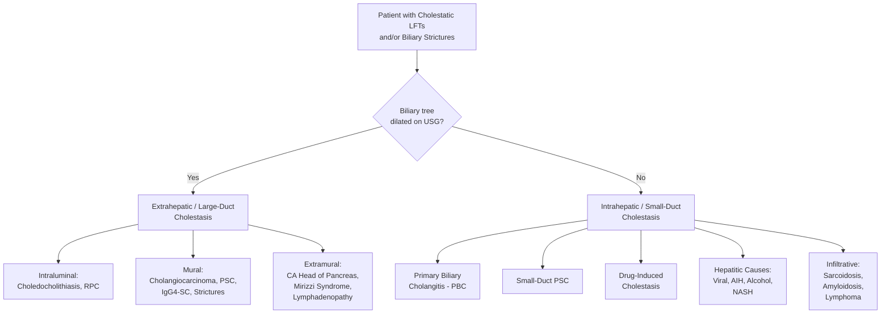
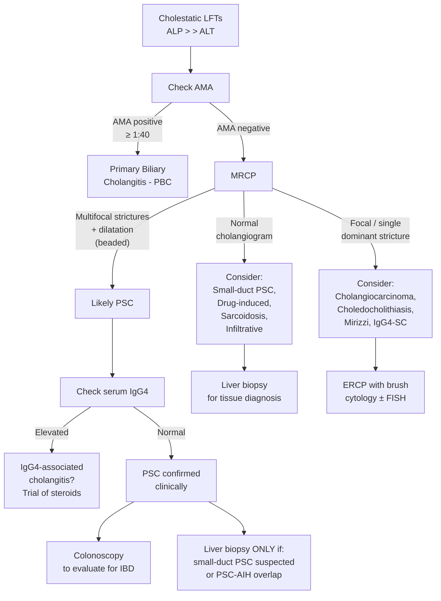

## Differential Diagnosis of Primary Sclerosing Cholangitis

### The Clinical Problem — Why Is the DDx Important?

Before we list the differentials, let's understand the clinical scenario you're actually working with. A patient with PSC typically presents with one or more of the following:

1. **Cholestatic liver biochemistry** — elevated ALP/GGT out of proportion to transaminases
2. **Biliary strictures on imaging** — multifocal strictures with segmental dilatation on MRCP/ERCP
3. **Clinical cholestasis** — jaundice, pruritus, dark urine, pale stools
4. **Known IBD** with incidental abnormal LFTs

The differential diagnosis therefore needs to address **two overlapping clinical questions**:
- What else causes a **cholestatic biochemical pattern**?
- What else causes **biliary strictures** on cholangiography?

These are not the same list, and the approach differs depending on which "entry point" brought the patient to your attention.

---

### Systematic Framework for the Differential

I like to organise this by thinking about **what level of the biliary tree is affected** and **what mechanism is causing the damage**. This mirrors how you'll actually reason at the bedside.

---

### Detailed Differential Diagnosis

#### A. Conditions That Mimic PSC on Cholangiography (Biliary Strictures)

These are the "secondary sclerosing cholangitis" mimics — conditions that produce a cholangiographic picture similar to PSC but have an **identifiable cause** [1][2].

| Condition | Key Distinguishing Features | Why It Mimics PSC |
|:---|:---|:---|
| ***IgG4-associated cholangitis (IAC)*** | ***Elevated serum IgG4 > 135 mg/dL; mostly elderly male***; associated with autoimmune pancreatitis type 1; dense IgG4+ plasma cell infiltrate on biopsy; ***responds to corticosteroids*** (PSC does not) [2] | Causes multifocal biliary strictures involving intrahepatic and extrahepatic ducts, can look identical to PSC on MRCP |
| **Recurrent pyogenic cholangitis (RPC)** | ***"Hong Kong disease"***; ***intrahepatic pigment stones and intrahepatic biliary obstruction***; ***usually starts in left intrahepatic ducts***; associated with parasitic infection (***Clonorchis sinensis***); equal M:F; peak in 30–40s [6][12] | Causes intrahepatic strictures with dilated ducts; but key difference: stones are present within bile ducts (brown pigment/calcium bilirubinate), strictures predominantly left-sided, history of recurrent cholangitis episodes |
| **Cholangiocarcinoma** | ***Adenocarcinoma of bile duct ( > 90%)***; ***association with ulcerative colitis (common in Westerners) and recurrent pyogenic cholangitis (common in Orientals)***; raised CA 19-9 (though non-specific); ***mostly occurs in patients > 50 years*** [9][13][14] | Can produce a dominant stricture that mimics PSC; in fact, cholangiocarcinoma can arise *within* PSC (10–20% lifetime risk). Any new dominant stricture in a PSC patient must be investigated with brush cytology |
| **Choledocholithiasis** | Intermittent obstructive jaundice with pain; stone visible on USG/MRCP; ***stone causes painful jaundice*** (vs painless in tumour) [8][15] | CBD stones can cause localised strictures from chronic inflammation, but the pattern is focal, not multifocal |
| **Surgical / ischaemic biliary trauma** | History of cholecystectomy, liver transplantation (hepatic artery thrombosis), or critical illness (ICU cholangiopathy) | Ischaemic injury to peribiliary vascular plexus → bile duct necrosis → strictures. Distribution often follows vascular territory rather than the "beaded" pattern of PSC |
| **HIV cholangiopathy** | Advanced HIV/AIDS (CD4 < 100); caused by opportunistic infections — CMV, Cryptosporidium, Microsporidium | Papillary stenosis + intrahepatic sclerosing cholangitis pattern; responds to HAART and treatment of opportunistic infection |
| **Recurrent pancreatitis** | History of recurrent acute pancreatitis; stricture typically involves distal CBD (intrapancreatic portion) | Chronic pancreatic inflammation → fibrosis around the intrapancreatic CBD → distal stricture. Focal, not multifocal |
| **Chronic bacterial cholangitis** | Recurrent biliary infections from structural abnormalities (post-surgical, biliary-enteric anastomosis) | Repeated infection → chronic inflammation → strictures. History is key |

<Callout title="RPC vs PSC — A Hong Kong Favourite" type="error">

This distinction is extremely high-yield for HKU exams:

| Feature | PSC | RPC |
|:---|:---|:---|
| Geography | Western > > Asian | ***Southeast Asia ("Hong Kong disease")*** [6] |
| Sex | Male predominance (2:1) | Equal M:F |
| Stones | Not a primary feature | ***Intrahepatic pigment/calcium bilirubinate stones*** — formed de novo in ducts |
| Duct preference | Both intrahepatic + extrahepatic | ***Left intrahepatic ducts predominantly*** |
| Stricture type | Multifocal, beaded, both intra- and extrahepatic | Focal areas of stricturing with stone-related dilatation |
| IBD association | 60–80% have UC | None |
| Parasites | Not associated | ***Clonorchis sinensis, Opisthorchis viverrini*** |
| Pathogenesis | Immune-mediated periductal fibrosis | ***Stasis + Stricturing + Recurrent infection*** cycle [6] |

</Callout>

---

#### B. Conditions That Mimic PSC Biochemically (Cholestatic LFT Pattern)

These conditions present with elevated ALP/GGT but may not produce biliary strictures visible on cholangiography.

| Condition | Key Distinguishing Features | Why It's in the DDx |
|:---|:---|:---|
| **Primary biliary cholangitis (PBC)** | ***Extreme female predominance (90–95%)***; age 30–65; ***AMA positive at titre ≥ 1:40***; targets ***small intralobular bile ducts*** (not visible on MRCP); associated with Sjögren's, scleroderma, Hashimoto's [16] | Both cause cholestatic LFTs (elevated ALP/GGT), pruritus, fatigue, and eventually cirrhosis. The cholangiogram is **normal** in PBC (small ducts not visible on MRCP). AMA is the key serological discriminator |
| **PSC-AIH overlap syndrome** | Features of both PSC (biliary strictures) and AIH (elevated transaminases > 5× ULN, positive ANA/SMA, interface hepatitis on biopsy); more common in children/young adults [1] | Important to recognise because it responds to immunosuppression (corticosteroids ± azathioprine), unlike pure PSC |
| **Drug-induced cholestasis** | Temporal association with offending drug; common culprits: amoxicillin-clavulanate, erythromycin, anabolic steroids, oral contraceptives, chlorpromazine | Drugs can cause bland cholestasis (no hepatocyte damage) or cholestatic hepatitis. No biliary strictures on imaging. Resolves with drug withdrawal |
| **Viral hepatitis (cholestatic phase)** | Acute hepatitis A/E can have a cholestatic phase; HBV/HCV can cause cholestatic flares; serology positive [15] | Transaminases usually markedly elevated (>10× ULN) alongside cholestatic enzymes — this is not the PSC pattern where ALP dominates |
| **Alcoholic hepatitis / Alcoholic liver disease** | History of heavy alcohol use; AST:ALT ratio > 2:1 ("De Ritis ratio"); elevated GGT; may have cholestatic pattern in severe cases [15] | Can cause cholestatic LFTs; history and the typical AST > ALT pattern differentiate |
| **Non-alcoholic steatohepatitis (NASH)** | Metabolic syndrome; obesity; USS shows fatty liver; liver biopsy shows steatohepatitis, ballooning | Occasionally presents with mildly elevated ALP; usually hepatitic pattern predominates |
| **Sarcoidosis** | Non-caseating granulomas; elevated ACE; bilateral hilar lymphadenopathy on CXR; granulomatous hepatitis | Hepatic sarcoidosis can produce cholestatic LFTs and even intrahepatic cholestasis mimicking PBC or small-duct PSC |
| **Infiltrative liver diseases** | Amyloidosis, lymphoma, metastatic disease; ALP markedly elevated | Infiltration of hepatic parenchyma → elevated ALP; imaging usually shows hepatomegaly ± focal lesions rather than biliary strictures |

---

#### C. Conditions That Overlap with PSC (the "Overlap Syndromes")

| Condition | Key Features |
|:---|:---|
| **PSC-AIH overlap** | ~5–10% of PSC patients; defined by elevated IgG, positive ANA or SMA, and **interface hepatitis** on liver biopsy superimposed on cholangiographic PSC. ***Reserved for patients with suspected small duct PSC or if an overlap syndrome with autoimmune hepatitis are suspected*** — this is when liver biopsy is indicated [1] |
| **IgG4-associated sclerosing cholangitis** | Can coexist with or mimic PSC; ***serum IgG4 is a characteristic marker of autoimmune pancreatitis but is also elevated in patients with PSC*** (~9–15% of PSC patients have elevated IgG4 without having true IgG4-SC) [1] |
| **Small-duct PSC** | Normal MRCP/ERCP but histological features of PSC on liver biopsy; presents with cholestatic LFTs ± IBD; better prognosis; ~20% progress to large-duct PSC |

---

#### D. Conditions That Cause Obstructive Jaundice at Specific Levels (Anatomical DDx)

This is how surgeons think about it — based on where the obstruction is on imaging [8][15]:

| Level of Obstruction | Differential Diagnoses |
|:---|:---|
| ***Hilum*** | ***CA Gallbladder, HCC, Klatskin's tumour, Mirizzi syndrome, Porta lymphadenopathy, PSC, RPC*** [8] |
| ***Mid-CBD*** | ***CA CBD, CA Head of pancreas, Lymphadenopathy*** [8] |
| ***Distal CBD*** | ***Bile duct strictures, Periampullary carcinoma, Choledochal cysts, Pancreatic cysts, Chronic pancreatitis*** [8] |

---

### The PSC vs PBC Comparison — High-Yield Table

This comparison comes up in virtually every hepatology exam. Know it cold.

| Feature | PSC | PBC |
|:---|:---|:---|
| **Sex** | Male (2:1) | ***Female (90–95%)*** [16] |
| **Age** | 30–40 | 30–65 |
| **Duct size affected** | Medium and large (intra + extrahepatic) | ***Small intralobular*** |
| **Cholangiogram** | "Beaded" strictures (MRCP/ERCP) | **Normal** (ducts too small to see) |
| **AMA** | ***Typically absent*** [1] | ***Positive ≥ 1:40 (>95%)*** [16] |
| **p-ANCA** | ***Positive (30–80%)*** [1] | Usually negative |
| **ANA/SMA** | Variable | May be positive (~50%) |
| **IgM** | ***Elevated (40–50%)*** [1] | Markedly elevated |
| **IBD association** | ***Strong (UC 60–80%)*** [1] | None |
| **Associated conditions** | UC, cholangiocarcinoma, CRC | ***Sjögren's, scleroderma, Hashimoto's, RA*** [16] |
| **Response to UDCA** | Controversial; does NOT alter natural history | Proven benefit; slows progression |
| **Histology** | "Onion-skin" periductal fibrosis | Non-suppurative destructive cholangitis (florid duct lesion) |
| **Malignancy risk** | Cholangiocarcinoma (10–20%), CRC, GB cancer | Low |
| **Liver transplantation** | Definitive treatment; but can recur post-transplant (~20%) | Definitive treatment; recurrence uncommon |

---

### Differentiating Stone vs Tumour in Obstructive Jaundice

When a PSC patient develops worsening jaundice, you need to determine whether it's from the PSC itself (dominant stricture), a superimposed stone, or — critically — a **cholangiocarcinoma**. The classic stone vs tumour distinction applies [8][15]:

| Feature | Stone | Tumour |
|:---|:---|:---|
| **Jaundice** | ***Intermittent*** (stone may pass) | ***Progressive*** |
| **Pain** | ***Painful*** (stone passing through ampulla) | ***Painless*** (until advanced); except ***CA pancreatic head: well innervated, spread to coeliac ganglion early*** [15] |
| **Fever/infection** | ***More likely*** (bile stasis → ascending infection) | Until late stage |
| **Constitutional symptoms** | Absent | ***LOW, LOA, night sweats*** [15] |
| **Courvoisier's sign** | Negative (chronic inflammation → fibrotic, non-distensible GB) | Positive if distal obstruction |

> ***"Painless progressive obstructive jaundice in elderly is malignant biliary obstruction until proven otherwise"*** [8].

<Callout title="Exam Trap — Dominant Stricture in PSC" type="error">
A dominant stricture in PSC does NOT automatically mean cholangiocarcinoma, but it **must** be investigated to exclude it. The approach: ERCP with **brush cytology** ± FISH (fluorescence in situ hybridization). CA 19-9 is supportive but non-specific (also elevated in benign cholestasis and other GI cancers). ***Cholangiocarcinoma is characterised by slow growth, high rate of local invasion, mucin production and tendency to invade perineural sheath and spread along nerves*** [9].
</Callout>

---

### History-Taking Clues to Narrow the Differential

When you're working up a patient and PSC is on your differential, these history points help you narrow down [8][15]:

| History Point | What It Helps Differentiate |
|:---|:---|
| ***PMH: IBD*** | Strongly supports PSC; ***IBD is a risk factor for PSC*** [15] |
| ***PMH: Gallstones*** | Choledocholithiasis, Mirizzi syndrome |
| ***PMH: Hepatitis B carrier*** | HCC with biliary invasion, or concurrent CLD |
| **PMH: Previous biliary surgery** | Iatrogenic stricture, secondary sclerosing cholangitis |
| **PMH: Autoimmune conditions** | PBC (Sjögren's, scleroderma); PSC-AIH overlap |
| **Drug history** | Drug-induced cholestasis |
| ***SH: Smoking, alcohol*** | Alcoholic liver disease; note smoking is protective for UC [15] |
| **SH: Raw freshwater fish consumption** | ***Clonorchis sinensis*** → RPC / cholangiocarcinoma risk [12] |
| **FH: CRC** | Lynch syndrome (increased cholangiocarcinoma risk) [9] |
| **Travel / origin** | Southeast Asia → RPC; Northern Europe → PSC more common |

---

### Approach to the Differential — Putting It All Together

<Callout title="The 3-Step Approach to Cholestatic LFTs">

1. **Check AMA** → If positive, think PBC
2. **If AMA negative → MRCP** → Multifocal strictures = PSC; normal = small-duct PSC or other intrahepatic cause
3. **Check IgG4** → Elevated = consider IgG4-associated cholangitis (treatable with steroids!)

Always **exclude secondary causes** (RPC, surgical trauma, choledocholithiasis, cholangiocarcinoma) before labelling someone with "primary" sclerosing cholangitis.

</Callout>

---

<Callout title="High Yield Summary — Differential Diagnosis">

1. **PSC is a diagnosis of exclusion** — you must rule out secondary sclerosing cholangitis (IgG4-SC, RPC, ischaemic, surgical, HIV cholangiopathy, stones, tumour).

2. **IgG4-associated cholangitis** is the most critical mimic to exclude because it responds to steroids. Always check serum IgG4.

3. **PBC vs PSC**: AMA positive = PBC; AMA negative + biliary strictures on MRCP = PSC. PBC affects small ducts (normal cholangiogram); PSC affects large ducts (beaded cholangiogram).

4. **RPC vs PSC** (Hong Kong context): RPC = intrahepatic pigment stones, left lobe predominance, parasitic association, no IBD link. PSC = immune-mediated, beaded bilateral strictures, UC association.

5. **Dominant stricture in PSC** must always be investigated to exclude **cholangiocarcinoma** — use ERCP with brush cytology ± FISH.

6. **Stone vs tumour**: Stone = intermittent, painful jaundice with fever. Tumour = progressive, painless jaundice with constitutional symptoms.

7. **PSC-AIH overlap** (~5–10%): suspect if transaminases markedly elevated; responds to immunosuppression — don't miss it.

8. ***Obstructive jaundice DDx by level***: Hilum (PSC, RPC, Klatskin's, HCC, Mirizzi, CA GB); Mid-CBD (CA CBD, CA pancreas head); Distal CBD (periampullary CA, choledochal cyst, chronic pancreatitis).

</Callout>

---

<ActiveRecallQuiz
  title="Active Recall - PSC Differential Diagnosis"
  items={[
    {
      question: "A 65-year-old male presents with obstructive jaundice and multifocal biliary strictures on MRCP. Serum IgG4 is markedly elevated. What is the most likely diagnosis, and how does management differ from PSC?",
      markscheme: "IgG4-associated cholangitis (sclerosing cholangitis). Key difference: responds to corticosteroid therapy, whereas PSC does not respond to immunosuppression. Associated with autoimmune pancreatitis type 1. Confirm with tissue biopsy showing dense IgG4-positive plasma cell infiltrate."
    },
    {
      question: "Compare and contrast PSC and RPC across five features: geography, sex, stone type, duct predilection, and IBD association.",
      markscheme: "PSC: Western predominance, male 2:1, no primary stones, both intra- and extrahepatic ducts (beaded), strong IBD/UC association (60-80%). RPC: Southeast Asia (Hong Kong disease), equal M:F, intrahepatic brown pigment/calcium bilirubinate stones formed de novo, left intrahepatic duct predominance, no IBD association."
    },
    {
      question: "A PSC patient develops rapidly progressive jaundice. How do you differentiate disease progression from superimposed cholangiocarcinoma?",
      markscheme: "Progressive painless jaundice with constitutional symptoms (LOW, LOA) raises suspicion for cholangiocarcinoma. Investigate with ERCP + brush cytology with FISH, CA 19-9 (supportive but non-specific), cross-sectional imaging (CT/MRI). PSC progression alone typically causes fluctuating jaundice. Any dominant stricture (duct diameter 1.5 mm or less in CBD, 1.0 mm or less in hepatic duct) must be biopsied."
    },
    {
      question: "What is the single most important serological test to differentiate PBC from PSC, and what additional investigation confirms PSC when this test is negative?",
      markscheme: "Anti-mitochondrial antibody (AMA): positive in PBC (95% or more), typically absent in PSC. When AMA is negative, perform MRCP - multifocal strictures alternating with dilatation (beaded appearance) confirms large-duct PSC. If MRCP is normal but cholestatic LFTs persist, liver biopsy is needed to diagnose small-duct PSC."
    },
    {
      question: "List 3 conditions that cause biliary strictures at the hilum and explain one distinguishing feature for each.",
      markscheme: "1) Klatskin tumour (perihilar cholangiocarcinoma): painless progressive jaundice, CA 19-9 elevated, mass on imaging. 2) PSC: multifocal beaded strictures (not just hilar), young male with UC, AMA negative. 3) Mirizzi syndrome: impacted gallstone in cystic duct/Hartmann pouch causing extrinsic compression of CHD; gallbladder contracted with stone on USG, abrupt change to normal CBD calibre below stone level."
    }
  ]}
/>

## References

[1] Senior notes: felixlai.md (Primary Sclerosing Cholangitis section, felix:756–757)
[2] Senior notes: maxim.md (Acute cholangitis section, maxim:288)
[6] Senior notes: maxim.md (Recurrent pyogenic cholangitis, maxim:290)
[8] Senior notes: maxim.md (Obstructive jaundice section, maxim:251–252)
[9] Senior notes: felixlai.md (Cholangiocarcinoma risk factors and pathogenesis, felix:778–779)
[12] Senior notes: felixlai.md (Recurrent pyogenic cholangitis, felix:752)
[13] Lecture slides: WCS 064 - A large liver - by Prof R Poon [20191108].doc.pdf (p5 — Cholangiocarcinoma)
[14] Senior notes: maxim.md (Cholangiocarcinoma, maxim:294)
[15] Senior notes: maxim.md (Obstructive jaundice — stone vs tumour, maxim:252)
[16] Senior notes: felixlai.md (Primary biliary cholangitis, felix:760)
