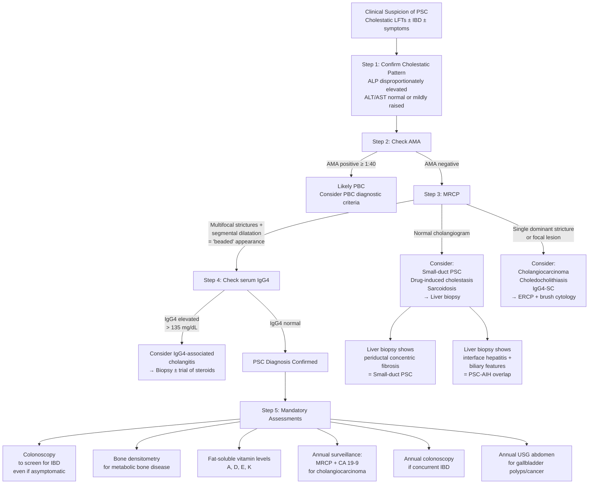

## Diagnostic Criteria for PSC

### The Fundamental Challenge

Here's the thing about PSC that makes it different from many other conditions: **there is no single pathognomonic test**. There is no "AMA for PBC" equivalent. The diagnosis is established by combining clinical, biochemical, cholangiographic, and sometimes histological data — and critically, **by excluding secondary causes of sclerosing cholangitis**. Think of it as a constructive diagnosis rather than a "one-test rules them all" diagnosis.

### EASL/AASLD Diagnostic Criteria (Current Guidelines)

The diagnosis of PSC is established when **ALL THREE** of the following are met:

| Criterion | Details | Why This Criterion Exists |
|:---|:---|:---|
| **1. Cholestatic biochemistry** | Elevated ALP (typically > 1.5× ULN) persisting for > 6 months | ALP elevation is the biochemical hallmark of biliary injury. It must be persistent — a transient ALP rise could be from many causes (e.g., drugs, pregnancy, bone disease). The 6-month threshold ensures chronicity |
| **2. Characteristic cholangiographic findings** | Multifocal strictures alternating with dilatation (the "beaded" pattern) on **MRCP** (preferred) or ERCP, involving intrahepatic and/or extrahepatic bile ducts | This is the **cornerstone** of diagnosis. The stricture-dilatation pattern is virtually diagnostic when combined with the right clinical context. ***MRCP is typically the 1st imaging modality due to non-invasiveness and comparable diagnostic accuracy to ERCP*** [1] |
| **3. Exclusion of secondary causes** | Must rule out: IgG4-associated cholangitis, ischaemic cholangiopathy, surgical/traumatic strictures, choledocholithiasis, cholangiocarcinoma, RPC, HIV cholangiopathy, congenital biliary anomalies | PSC is "primary" — by definition, it has no identifiable external cause. You cannot diagnose PSC without actively excluding the mimics [1] |

<Callout title="Small-Duct PSC — The Exception">

**Small-duct PSC** is diagnosed when a patient has:
- Cholestatic biochemistry (elevated ALP)
- **Normal** MRCP and ERCP (because the affected ducts are too small to visualise on cholangiography)
- ***Liver biopsy showing characteristic histological features*** of PSC (periductal concentric "onion-skin" fibrosis)
- Exclusion of PBC (AMA negative) and other causes

***Liver biopsy is reserved for patients with suspected small duct PSC or if an overlap syndrome with autoimmune hepatitis are suspected*** [1]. This is one of the few situations where biopsy is essential in PSC workup.

</Callout>

### Comparison: PSC vs PBC Diagnostic Criteria

Understanding both side-by-side helps cement why the approach differs:

| Feature | PSC Diagnosis | PBC Diagnosis |
|:---|:---|:---|
| **Biochemistry** | ALP > 1.5× ULN for > 6 months | ***ALP ≥ 1.5× ULN*** [16] |
| **Key serological test** | ***AMA typically absent*** [1]; p-ANCA supportive but not diagnostic | ***AMA positive ≥ 1:40*** (95% sensitive) [16] |
| **Imaging** | **MRCP/ERCP showing multifocal strictures** — this IS the diagnostic test | Normal cholangiogram (small ducts not visualised) |
| **Biopsy** | Not routinely needed (except small-duct PSC, overlap syndrome) | Needed only if AMA negative and ALP elevated — then biopsy shows ***non-suppurative destructive cholangitis*** [16] |
| **Diagnosis requires** | Cholangiography + exclusion of secondary causes | ≥ 2 of: ALP elevation, AMA positivity, histological evidence [16] |

---

## Diagnostic Algorithm

Here is the step-by-step clinical reasoning pathway. The key principle: **start with blood tests → serology → imaging → biopsy only if needed**.

<Callout title="The 5-Step Diagnostic Algorithm — Simplified" type="idea">

1. **Confirm cholestatic pattern** → ALP > > ALT
2. **Check AMA** → If positive = PBC; if negative → proceed
3. **MRCP** → Beaded strictures = PSC; normal = consider small-duct PSC (biopsy needed)
4. **Check IgG4** → Elevated = IgG4-SC (responds to steroids); normal = confirms PSC
5. **Mandatory workup** → Colonoscopy (IBD screen), bone density, fat-soluble vitamins, cancer surveillance

</Callout>

---

## Investigation Modalities — Detailed Breakdown

### A. Biochemical Tests (Blood Work)

#### 1. Liver Function Tests (LFT) — Cholestatic Pattern

| Parameter | Expected in PSC | Interpretation / Pathophysiological Basis |
|:---|:---|:---|
| **ALP** | ***↑ (predominantly elevated)*** | ALP is anchored to the canalicular membrane of hepatocytes and cholangiocytes. In cholestasis, bile acids solubilise ALP from the membrane → released into blood. Also, bile duct obstruction upregulates ALP gene expression. ***ALP is the predominantly elevated*** enzyme in PSC [1] |
| **GGT** | ***↑↑*** | GGT is present on the surface of cholangiocytes and hepatocytes. Like ALP, it is induced by cholestasis and also by alcohol. ***Elevation of GGT can confirm excess ALP is of hepatobiliary origin*** (as opposed to bone-origin ALP, which would have normal GGT) [17] |
| **AST / ALT** | ***Normal or mildly elevated (< 300 IU/L)*** | ***Serum aminotransferases are typically less than 300 IU/L*** [1]. Mild elevation reflects secondary hepatocyte damage from retained toxic bile acids. If markedly elevated ( > 5× ULN), suspect **PSC-AIH overlap** or concurrent viral hepatitis |
| **Bilirubin** | ***Normal or elevated; may fluctuate*** | ***Bilirubin may fluctuate substantially, possibly indicating transient blockage of strictured bile ducts by biliary sludge or small stones*** [1]. A steadily rising bilirubin is ominous — think cholangiocarcinoma or progressive disease |
| **Albumin** | ***Normal in early disease; decreased in advanced disease*** | ***Serum albumin is normal in patients with early stage disease but those with active IBD may have hypoalbuminaemia*** [1]. Half-life of albumin is ~20 days, so it reflects chronic synthetic function |
| **PT / INR** | Normal or prolonged | Prolonged in advanced disease due to: (a) impaired hepatic synthesis of clotting factors, and (b) vitamin K malabsorption from cholestasis. Always check if correctable with vitamin K — if it corrects, the issue is malabsorption, not synthetic failure |

> **Clinical Pearl**: A cholestatic pattern means ALP/GGT elevated *out of proportion* to ALT/AST. In PSC, the typical picture is ALP 3–10× ULN with ALT < 2× ULN. If the transaminases dominate, reconsider the diagnosis.

#### 2. Serology and Autoantibodies

| Test | Expected in PSC | Clinical Significance |
|:---|:---|:---|
| ***AMA (Anti-mitochondrial antibody)*** | ***Typically absent*** [1] | The single most important serological test to exclude PBC. ***AMA is typically absent in PSC and is required to help exclude primary biliary cholangitis*** [1]. If AMA is positive in a patient with biliary strictures, consider overlap syndrome or coexistent PBC |
| ***p-ANCA (Perinuclear ANCA)*** | ***Positive in 30–80%*** [1] | Atypical p-ANCA (target antigen: beta-tubulin isotype 5 or nuclear envelope proteins). Also positive in UC. Supportive but not diagnostic — it is **neither sensitive nor specific enough** to diagnose PSC alone. Think of it as a clue, not a proof |
| **ANA / SMA** | Variable (positive in ~25–50%) | If both are strongly positive with markedly elevated IgG and transaminases, suspect **PSC-AIH overlap syndrome** |
| ***Serum IgM*** | ***Elevated in 40–50%*** [1] | Non-specific polyclonal IgM elevation; also seen in PBC. Reflects chronic immune stimulation |
| **Hypergammaglobulinaemia** | ***Present in ~30%*** [1] | Polyclonal IgG elevation reflecting chronic hepatic immune activation and impaired clearance of gut-derived antigens by the diseased liver |
| ***Serum IgG4*** | Normal in most; elevated in ~9–15% | ***Serum IgG4 is a characteristic marker of autoimmune pancreatitis but is also elevated in patients with PSC*** [1]. Critical to distinguish true IgG4-associated cholangitis from PSC with incidentally elevated IgG4. If IgG4 > 4× ULN → strongly consider IgG4-SC → trial of corticosteroids |

<Callout title="The IgG4 Conundrum" type="error">

About 9–15% of PSC patients have mildly elevated IgG4 **without** having IgG4-associated cholangitis. Don't reflexively change the diagnosis based on IgG4 alone. Look at the whole picture:
- **Markedly elevated IgG4** ( > 4× ULN) + **autoimmune pancreatitis features** + **dense IgG4+ plasma cells on biopsy** = IgG4-SC
- **Mildly elevated IgG4** (1–2× ULN) + typical PSC cholangiogram + IBD = still PSC with incidentally elevated IgG4

The practical difference: IgG4-SC responds dramatically to corticosteroids; PSC does not.

</Callout>

#### 3. Tumour Markers

| Marker | Role in PSC | Interpretation |
|:---|:---|:---|
| **CA 19-9** | Screening for cholangiocarcinoma; annual monitoring | ***CA 19-9 may or may not be elevated and is nonspecific*** [13]. Sensitivity ~60–70% for cholangiocarcinoma. Also elevated in benign cholestasis, pancreatitis, other GI malignancies. A level > 129 U/mL in PSC has ~80% sensitivity and ~98% specificity for cholangiocarcinoma. Lewis-antigen-negative individuals (~7% of population) cannot produce CA 19-9 |
| **CEA** | Adjunctive; less useful than CA 19-9 | ***CEA may be elevated in cholangiocarcinoma but neither sensitive nor specific*** [17]. Primarily a CRC marker |
| **AFP** | To exclude HCC | ***AFP differentiates intrahepatic cholangiocarcinoma from HCC*** [17]. Should be normal in PSC unless HCC has developed on cirrhotic background |

#### 4. Additional Blood Tests

| Test | Purpose |
|:---|:---|
| **CBC with differentials** | Leukocytosis → suggests superimposed cholangitis. Thrombocytopaenia → suggests portal hypertension/hypersplenism or advanced cirrhosis. ***Check thrombocytopaenia when planning invasive procedures such as ERCP*** [17] |
| **Clotting profile** | ***Coagulopathy due to vitamin K deficiency from decreased absorption of fat-soluble vitamins due to obstructive jaundice*** [17][8] |
| **RFT (Renal function)** | Baseline before ERCP contrast; assess for hepatorenal syndrome in advanced disease |
| **CRP / ESR** | Inflammatory markers — elevated in acute cholangitis or disease flare |
| **Blood culture** | If febrile — ***blood culture is essential in suspected acute cholangitis*** [2] |
| **Fat-soluble vitamin levels (A, D, E, K)** | Chronic cholestasis → malabsorption of fat-soluble vitamins → monitor and replace |
| **HBV / HCV serology** | Exclude concurrent viral hepatitis as cause of abnormal LFTs |

---

### B. Imaging Modalities

#### 1. Ultrasound (USG) Abdomen — First-Line Screening

USG is typically the **first imaging test** obtained in a patient with cholestatic LFTs or jaundice. It is not diagnostic for PSC but provides critical screening information.

| Finding | Significance | Mechanism |
|:---|:---|:---|
| ***Bile duct wall thickening*** | Suggestive of inflammatory biliary disease | Periductal inflammation and fibrosis → thickened duct wall [1] |
| ***Focal bile duct dilatation*** | Dilatation between strictured segments | Bile stasis proximal to strictures → segmental dilatation [1] |
| ***Gallbladder wall thickening and enlargement*** | May reflect PSC-associated gallbladder inflammation | PSC increases risk of gallbladder carcinoma; any gallbladder abnormality needs follow-up [1] |
| ***Presence of gallstones*** | Exclude choledocholithiasis as cause of cholestasis | Gallstones coexist in ~25% of PSC patients [1] |
| **CBD diameter** | Normal CBD < 8 mm (< 0.8 cm); intrahepatic ducts normally not visible ( < 2–3 mm). ***CBD > 0.8 cm is pathological***. ***Intrahepatic duct normally not visible on USG*** [17] | If dilated → suggests obstruction; but in PSC, ductal calibre can vary due to alternating strictures and dilatation |
| **Liver parenchyma** | Heterogeneous echotexture in advanced disease; features of cirrhosis (irregular surface, caudate hypertrophy) | Progressive periportal fibrosis → cirrhosis |
| **Splenomegaly** | Suggests portal hypertension | Biliary cirrhosis → portal hypertension → splenic congestion |

> **Limitation**: USG has limited sensitivity for detecting intrahepatic strictures and cannot characterise the full extent of biliary disease. It is a **screening tool**, not a diagnostic one for PSC. The next step is always MRCP.

#### 2. Magnetic Resonance Cholangiopancreatography (MRCP) — The Gold Standard for Diagnosis

***MRCP is typically the 1st imaging modality due to non-invasiveness and comparable diagnostic accuracy to ERCP*** [1].

**How MRCP works** (from first principles): MRCP uses heavily **T2-weighted MRI sequences**. In T2-weighted imaging, stationary fluid (like bile in the biliary tree) appears **bright white** against a dark background. This creates a "cholangiogram" without injecting any contrast — the bile itself acts as the contrast agent. ***Non-contrast, T2-weighted*** imaging [18].

| Finding | Description | Clinical Significance |
|:---|:---|:---|
| ***Multifocal strictures alternating with dilatation*** | The hallmark "beaded" appearance: short, annular strictures with intervening dilated segments | ***Characteristic multifocal strictures that alternate with dilation of intrahepatic or extrahepatic bile ducts resulting in "beaded" appearance of bile duct*** [1]. This is the diagnostic finding |
| **Intrahepatic ± extrahepatic involvement** | ~70% have both; ~25% intrahepatic only; ~5% extrahepatic only | Pattern helps classify the subtype and plan management |
| **Pruned-tree appearance** | Loss of peripheral intrahepatic duct branches | Advanced disease: progressive fibrosis has obliterated small ducts → the peripheral arborisation is lost, giving the appearance of a pruned tree |
| **Diverticulum-like outpouchings** | Small outpouchings from bile duct wall | Represent areas of duct wall weakening between segments of fibrosis |
| **Dominant stricture** | Stricture ≤ 1.5 mm in CBD or ≤ 1.0 mm in hepatic duct | Must be investigated to exclude superimposed cholangiocarcinoma — ERCP with brush cytology indicated |
| **Gallbladder abnormalities** | Wall thickening, polyps, mass | PSC patients need annual USG for gallbladder surveillance; polyps ≥ 8 mm warrant cholecystectomy [19] |

**MRCP advantages over ERCP**:
- Non-invasive (no sedation, no endoscope, no contrast injection)
- No risk of post-procedure pancreatitis or ascending cholangitis
- ***Does NOT require contrast injection into ductal system unlike in ERCP and PTC*** [17]
- ***Superior to ERCP for assessing tumour anatomy and resectability*** [17]
- Can visualise ducts above a complete obstruction (ERCP can only image ducts below the scope)

**MRCP limitations**:
- Cannot perform therapeutic intervention (stenting, dilatation, brush cytology)
- May miss very early/subtle PSC changes (sensitivity ~80–90% vs ERCP as reference)
- Spatial resolution slightly inferior to ERCP

#### 3. Endoscopic Retrograde Cholangiopancreatography (ERCP)

***ERCP is indicated in patients who are unable to undergo MRCP such as those with implanted metal devices or in patients with early PSC changes that may be missed by MRCP*** [1].

In the PSC context, ERCP has shifted from a primary diagnostic tool to a **problem-solving and therapeutic** tool.

| Indication in PSC | What It Offers |
|:---|:---|
| **Dominant stricture evaluation** | ERCP allows brush cytology ± FISH (fluorescence in situ hybridisation) of the strictured segment to exclude cholangiocarcinoma |
| **Therapeutic dilatation** | Balloon dilatation of dominant strictures that cause symptomatic cholestasis or recurrent cholangitis |
| **Stent placement** | Short-term stenting of dominant strictures (usually for 2–4 weeks) to relieve obstruction |
| **Stone extraction** | Removal of biliary sludge or stones that have formed within dilated/strictured ducts |
| **Contraindication to MRCP** | Patients with ferromagnetic implants, cochlear implants, or certain cardiac devices |
| ***Early PSC changes*** | ***Indicated in patients with early PSC changes that may be missed by MRCP*** [1] — when clinical suspicion is high but MRCP is normal/equivocal |

**ERCP findings in PSC**:
- **Multiple short annular strictures** with intervening normal or dilated segments
- **"Band-like" strictures** — short, sharp, concentric narrowings
- **Diffuse involvement** — both intrahepatic and extrahepatic tree
- **Diverticulum-like outpouchings** — representing ectasia between strictured segments

**ERCP risks** (important because PSC patients may need multiple ERCPs over their lifetime):
- **Post-ERCP pancreatitis** (~3–5%)
- **Ascending cholangitis** — ***involves injection of contrast into bile duct and hence risk for ascending cholangitis in cases of impaired biliary drainage*** [17]
- Perforation (~0.5%)
- Haemorrhage (from sphincterotomy)
- ***Bacteraemia (thus antibiotic prophylaxis required)*** [18]

<Callout title="ERCP in PSC — When and Why" type="idea">

ERCP is **NOT** first-line for PSC diagnosis anymore — MRCP has replaced it. Use ERCP when you need to:
1. **Sample** a dominant stricture (brush cytology for cholangiocarcinoma)
2. **Treat** a dominant stricture (balloon dilatation ± short-term stenting)
3. **Investigate** when MRCP is equivocal or contraindicated

Always give **prophylactic antibiotics** before ERCP in PSC patients because their strictured, stagnant bile is a setup for post-procedural sepsis.

</Callout>

#### 4. Percutaneous Transhepatic Cholangiography (PTC)

***PTC is preferred to ERCP in stricture/obstruction at or above the level of confluence of hepatic ducts*** [18] — i.e., hilar-level disease where ERCP cannot access above the obstruction.

| Role in PSC | Details |
|:---|:---|
| **Diagnostic** | Visualisation of biliary tree above a complete hilar obstruction (where ERCP contrast cannot pass) |
| **Therapeutic** | Percutaneous transhepatic biliary drainage (PTBD) — inserting a catheter to decompress dilated intrahepatic ducts; placement of indwelling stents |
| **Sampling** | Brush cytology/biopsy of hilar strictures |

**Complications**: ***Bacteraemia (thus antibiotic prophylaxis required), haemobilia*** [18].

#### 5. CT Abdomen (with Contrast)

CT is not the primary diagnostic modality for PSC but plays important supporting roles:

| Role | Details |
|:---|:---|
| **Exclude malignancy** | Detect intrahepatic mass lesions (cholangiocarcinoma, HCC), lymphadenopathy, metastases |
| **Assess liver morphology** | Evaluate for cirrhosis (irregular surface, caudate lobe hypertrophy, segmental atrophy — particularly hypertrophy of caudate + left lateral segment with atrophy of right and left medial segments in advanced PSC) |
| **Vascular assessment** | Portal vein patency, hepatic artery involvement (relevant if transplant is being considered) |
| **Exclude RPC** | ***CT shows central dilated bile ducts with peripheral tapering, left lobe predilection, liver atrophy*** in RPC [6] |

#### 6. Liver Elastography (FibroScan / MR Elastography)

| Role | Details |
|:---|:---|
| **Non-invasive fibrosis assessment** | Measures liver stiffness as a surrogate for fibrosis stage. MR elastography is more accurate than transient elastography in biliary diseases because cholestasis itself can falsely elevate liver stiffness |
| **Prognostic value** | Higher stiffness correlates with more advanced fibrosis and worse outcomes |
| **Limitations** | Periductal fibrosis in PSC creates heterogeneous stiffness; may overestimate fibrosis compared to parenchymal liver diseases |

---

### C. Histological Examination (Liver Biopsy)

***Percutaneous liver biopsy may support diagnosis of PSC but is rarely diagnostic and is not routinely recommended*** [1].

#### When Is Biopsy Indicated?

| Indication | Rationale |
|:---|:---|
| **Suspected small-duct PSC** | Normal MRCP/ERCP but clinical and biochemical features suggest PSC → biopsy is the only way to see changes in small ducts |
| **Suspected PSC-AIH overlap** | Need to demonstrate interface hepatitis + biliary changes; directs immunosuppressive therapy |
| **Excluding other causes** | Sarcoidosis (granulomas), amyloidosis, drug reaction |
| **Staging fibrosis** | When non-invasive methods are inconclusive; guides prognosis and transplant timing |

#### Histological Findings

| Stage | Finding | What You See |
|:---|:---|:---|
| **Hallmark** | **Concentric periductal "onion-skin" fibrosis** | Rings of collagen concentrically layered around medium-sized bile ducts; seen in only ~30–40% of biopsy specimens (because the patchy distribution means biopsy may miss it) |
| **Stage 1 (Portal)** | Portal hepatitis, portal oedema, bile duct proliferation | Inflammation limited to portal tracts |
| **Stage 2 (Periportal)** | Periportal fibrosis, periportal hepatitis | Fibrosis extends beyond portal tracts |
| **Stage 3 (Septal)** | Septal fibrosis, bridging necrosis | Fibrous septa connecting portal tracts |
| **Stage 4 (Cirrhotic)** | Biliary cirrhosis | Regenerative nodules, complete architectural distortion |

> **Why is biopsy rarely diagnostic?** Because the hallmark onion-skin fibrosis is found in only ~30–40% of biopsy specimens due to sampling error — PSC is patchy and predominantly affects larger ducts that may not be captured in a needle biopsy of the liver parenchyma. This is why **cholangiography (MRCP/ERCP) is superior to biopsy** for diagnosing large-duct PSC.

---

### D. Colonoscopy — Mandatory in All PSC Patients

This deserves its own section because it's frequently overlooked:

- **All patients diagnosed with PSC should undergo colonoscopy with biopsies** to screen for IBD, even if they have no GI symptoms [1].
- Why? Because ~60–80% of PSC patients have UC, and the colitis in PSC-IBD is often **subclinical** (pancolitis with rectal sparing and minimal symptoms).
- ***Primary sclerosing cholangitis → yearly surveillance colonoscopy*** [3] — if IBD is confirmed, annual colonoscopy is mandated from the time of PSC diagnosis because of the markedly elevated CRC risk.
- If no IBD is found on initial colonoscopy, repeat colonoscopy every 5 years (because IBD can develop later).

---

### E. Bone Densitometry (DEXA Scan)

- Chronic cholestasis → vitamin D malabsorption → osteoporosis/osteomalacia
- **DEXA scan** at diagnosis and every 2–3 years to monitor bone mineral density
- Treat with calcium + vitamin D supplementation; bisphosphonates if T-score ≤ −2.5

---

## Summary: Complete Investigation Panel for Suspected PSC

| Category | Tests | Key Findings |
|:---|:---|:---|
| **Biochemistry** | LFT, albumin, bilirubin, PT/INR | Cholestatic pattern: ALP > > ALT; fluctuating bilirubin |
| **Serology** | AMA, p-ANCA, ANA, SMA, IgG4, IgM, IgG | AMA negative, p-ANCA positive, IgG4 normal |
| **Tumour markers** | CA 19-9, CEA, AFP | Baseline for cholangiocarcinoma surveillance |
| **Other bloods** | CBC, CRP, RFT, clotting, fat-soluble vitamins, HBV/HCV serology | Exclude differentials; assess synthetic function |
| **Imaging — Screening** | USG abdomen | Duct wall thickening, focal dilatation, gallstones, GB abnormalities |
| **Imaging — Diagnostic** | ***MRCP (1st line)*** | Multifocal "beaded" strictures |
| **Imaging — Therapeutic/Diagnostic** | ERCP (if dominant stricture, MRCP contraindicated, or need for intervention) | Strictures + brush cytology ± FISH for malignancy |
| **Imaging — Adjunctive** | CT abdomen, PTC (if hilar obstruction) | Exclude malignancy; assess liver morphology |
| **Histology** | Liver biopsy (only if small-duct PSC or overlap suspected) | Onion-skin periductal fibrosis |
| **Endoscopy** | Colonoscopy with biopsies | Screen for IBD; annual surveillance if IBD confirmed |
| **Bone health** | DEXA scan, vitamin D level | Screen for osteoporosis |

---

<Callout title="High Yield Summary — Diagnosis of PSC">

1. **PSC diagnosis requires**: Cholestatic biochemistry (ALP > 1.5× ULN for > 6 months) + characteristic cholangiographic findings (multifocal "beaded" strictures on MRCP) + exclusion of secondary causes.

2. ***MRCP is the first-line diagnostic imaging modality*** — non-invasive, no contrast injection, comparable accuracy to ERCP [1].

3. ***AMA is typically absent in PSC*** — its presence should prompt consideration of PBC or overlap syndrome [1].

4. ***Serum IgG4*** must be checked to exclude IgG4-associated cholangitis (which responds to steroids) [1].

5. ***Liver biopsy is NOT routinely needed*** — reserved for small-duct PSC (normal cholangiogram) or suspected PSC-AIH overlap [1].

6. **ERCP** is now primarily therapeutic/problem-solving — for dominant stricture evaluation (brush cytology), balloon dilatation, and stenting. Not first-line diagnostic.

7. ***PTC is preferred over ERCP for hilar-level obstruction*** [18].

8. **All PSC patients need colonoscopy** to screen for IBD, regardless of GI symptoms. If IBD present → annual colonoscopy for CRC surveillance.

9. **Tumour markers** (CA 19-9, CEA) are baseline and for surveillance — neither sensitive nor specific alone.

10. **Key biochemical pattern**: ALP 3–10× ULN, ALT < 2× ULN, fluctuating bilirubin, AMA negative, p-ANCA positive.

</Callout>

---

<ActiveRecallQuiz
  title="Active Recall - PSC Diagnostic Criteria, Algorithm and Investigations"
  items={[
    {
      question: "What are the 3 criteria required to diagnose PSC? Which single criterion is the cornerstone of diagnosis?",
      markscheme: "1) Cholestatic biochemistry (ALP > 1.5x ULN for > 6 months). 2) Characteristic cholangiographic findings (multifocal strictures alternating with dilatation - 'beaded' pattern on MRCP or ERCP). 3) Exclusion of secondary causes of sclerosing cholangitis. The cornerstone is the cholangiographic findings on MRCP."
    },
    {
      question: "Why is MRCP preferred over ERCP as the first-line imaging modality for diagnosing PSC? Name 2 situations where ERCP is still indicated.",
      markscheme: "MRCP is non-invasive, does not require contrast injection into the ductal system (uses T2-weighted sequences where bile itself appears bright), has comparable diagnostic accuracy, and avoids ERCP complications (pancreatitis, cholangitis, perforation). ERCP indicated for: 1) Dominant stricture evaluation with brush cytology to exclude cholangiocarcinoma. 2) Therapeutic intervention - balloon dilatation or stenting of symptomatic strictures. Also indicated when MRCP is contraindicated (ferromagnetic implants) or when early PSC changes may be missed by MRCP."
    },
    {
      question: "A patient with suspected PSC has a completely normal MRCP. What is your next diagnostic step and what histological finding would confirm the diagnosis?",
      markscheme: "Next step: Liver biopsy (percutaneous). This is one of the few indications for biopsy in PSC - suspected small-duct PSC. Histological hallmark: concentric periductal 'onion-skin' fibrosis around medium-sized bile ducts. Also check AMA is negative to exclude PBC, and exclude drug-induced cholestasis and sarcoidosis."
    },
    {
      question: "What mandatory non-hepatobiliary investigation must ALL patients with newly diagnosed PSC undergo, and why?",
      markscheme: "Colonoscopy with biopsies to screen for inflammatory bowel disease (IBD), even if the patient has no GI symptoms. Reason: 60-80% of PSC patients have underlying UC which is often subclinical (pancolitis with rectal sparing, minimal symptoms). If IBD confirmed, annual surveillance colonoscopy is required due to 4-5x increased CRC risk. If no IBD found, repeat colonoscopy every 5 years."
    },
    {
      question: "How do you use serum IgG4 levels in the diagnostic workup of PSC? What is the clinical significance of an elevated IgG4?",
      markscheme: "IgG4 is checked to exclude IgG4-associated cholangitis (IAC), which mimics PSC cholangiographically but responds to corticosteroids. About 9-15% of PSC patients have mildly elevated IgG4 without true IgG4-SC. Markedly elevated IgG4 (> 4x ULN) with features of autoimmune pancreatitis and dense IgG4-positive plasma cell infiltrate on biopsy = IgG4-SC. Mildly elevated IgG4 in a typical PSC picture with IBD = still PSC with incidental IgG4 elevation."
    },
    {
      question: "List 5 components of the annual surveillance programme for a patient with established PSC and concurrent UC.",
      markscheme: "1) Annual colonoscopy with biopsies for CRC surveillance. 2) Annual MRCP for cholangiocarcinoma surveillance. 3) Annual CA 19-9 for cholangiocarcinoma monitoring. 4) Annual USG abdomen for gallbladder polyps and cancer. 5) Bone densitometry (DEXA) every 2-3 years for osteoporosis. Also: fat-soluble vitamin levels, LFTs for disease progression."
    }
  ]}
/>

## References

[1] Senior notes: felixlai.md (Primary Sclerosing Cholangitis section, felix:756–757)
[2] Senior notes: maxim.md (Acute cholangitis section, maxim:288)
[3] Lecture slides: Inflammatory bowel disease.pdf (p52, p56 — CRC surveillance in PSC)
[6] Senior notes: maxim.md (Recurrent pyogenic cholangitis, maxim:290)
[8] Senior notes: maxim.md (Obstructive jaundice section, maxim:251–252)
[13] Lecture slides: WCS 064 - A large liver - by Prof R Poon [20191108].doc.pdf (p5 — Cholangiocarcinoma diagnosis)
[16] Senior notes: felixlai.md (Primary biliary cholangitis, felix:760–761)
[17] Senior notes: felixlai.md (Cholangiocarcinoma diagnosis, felix:780–782; MBO investigations, felix:723)
[18] Senior notes: maxim.md (HBP investigations — MRCP, PTC, ERCP, maxim:250–251)
[19] Senior notes: maxim.md (Gallbladder polyps management in PSC, maxim:292)
