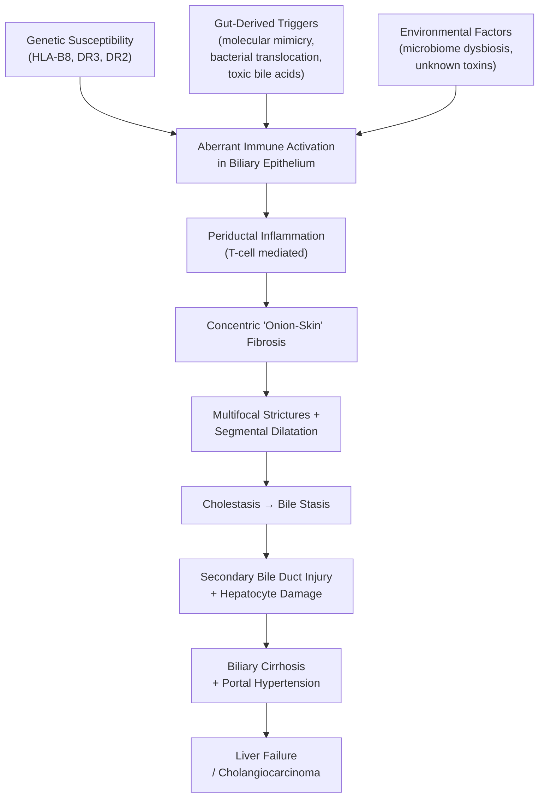

## Definition and Overview

Primary Sclerosing Cholangitis — let's break down the name first: "primary" = arising on its own (not secondary to another identifiable cause), "sclerosing" = scarring/fibrosis (Greek *skleros* = hard), "cholangitis" = inflammation of the bile ducts (Greek *chole* = bile, *angeion* = vessel, *-itis* = inflammation). So PSC is a **primary, idiopathic chronic progressive cholestatic liver disease** characterised by inflammation, obliterative fibrosis, and multifocal stricturing of both the intrahepatic and extrahepatic bile ducts, leading eventually to biliary cirrhosis, portal hypertension, and liver failure [1][2].

The key pathological hallmark is concentric periductal fibrosis ("onion-skin" fibrosis) around medium and large bile ducts, which progressively narrows and obliterates the lumen. This results in cholestasis (impaired bile flow), recurrent bacterial cholangitis, and ultimately end-stage liver disease. There is **no known cure** apart from liver transplantation.

> ***The term "primary" distinguishes PSC from secondary sclerosing cholangitis*** *— which has an identifiable cause such as surgical trauma, ischaemia, recurrent choledocholithiasis, IgG4-related disease, or recurrent pyogenic cholangitis* [1].

<Callout title="Key Concept">
PSC is an immune-mediated biliary disease of unknown aetiology that causes progressive stricturing of the biliary tree. Think of it as "autoimmune scarring of the bile ducts." It is the hepatobiliary manifestation most strongly associated with inflammatory bowel disease (IBD), particularly ulcerative colitis (UC).
</Callout>

---

## Epidemiology

### Incidence and Prevalence
- **Incidence**: ~0.5–1.3 per 100,000 per year in Northern European and North American populations (highest in Scandinavian countries, consistent with the Northern European "IBD belt") [2].
- **Prevalence**: ~6–16 per 100,000 in Western populations.
- ***Less primary sclerosing cholangitis with UC in Asian populations*** — PSC is considerably rarer in East and Southeast Asia, including Hong Kong [3][4]. The IBD lecture slides specifically note ***"Less primary sclerosing cholangitis with UC"*** and ***"Fewer extraintestinal manifestations"*** in Eastern populations compared to Western populations [3].

### Demographics
- **Sex**: Male predominance (~2:1, M:F), unlike PBC which overwhelmingly affects women. This is one of the distinguishing epidemiological features.
- **Age of onset**: Typically diagnosed at age 30–40 years (median ~40), though it can present at any age.
- **Earlier onset** is seen in patients with concomitant IBD, and in those with PSC-associated cholangiocarcinoma, diagnosis can come as early as the 3rd–4th decade [5].

### Geographic Variation (Hong Kong Context)
- In Hong Kong, PSC is uncommon compared to recurrent pyogenic cholangitis (RPC), which is the major biliary disease causing stricturing ("Hong Kong disease") [6].
- When biliary strictures are encountered in an Asian patient, the differential must prominently include RPC, IgG4-associated cholangitis, and parasitic cholangiopathy (Clonorchis sinensis) alongside PSC [2][6].

<Callout title="Exam Pearl" type="idea">
In Asia/Hong Kong, if you see a patient with biliary strictures, think RPC and parasitic causes first. PSC is a diagnosis of exclusion even more so in this population.
</Callout>

---

## Risk Factors

| Risk Factor | Mechanism / Explanation |
|:---|:---|
| **Inflammatory bowel disease (IBD)** — especially **UC** | ~60–80% of PSC patients have underlying UC; only ~5% of UC patients develop PSC. The link is hypothesised to involve gut-derived lymphocyte homing to the liver via aberrant expression of adhesion molecules (MAdCAM-1) on hepatic endothelium [1][2] |
| **Male sex** | 2:1 male predominance; reason unclear but suggests hormonal or genetic modulators |
| **Genetic susceptibility** | Strong HLA associations — particularly ***HLA-B8, HLA-DR3 (DRB1\*03:01), HLA-DR2 (DRB1\*15:01)***; first-degree relatives have increased risk |
| **Smoking** | Interestingly, smoking appears to be ***protective*** for UC (and by extension may modulate PSC risk), though data for PSC itself are less clear [7] |
| **Autoimmune predisposition** | Association with other autoimmune conditions (thyroid disease, type 1 DM, coeliac disease) |
| **Environmental triggers** | Proposed but unproven: gut microbiome dysbiosis, molecular mimicry, toxic bile acid intermediates |

<Callout title="IBD-PSC Association — Know This Cold" type="error">

- **Majority of PSC patients have UC** (~60–80%), and some have Crohn's colitis.
- **Only ~5% of UC patients have PSC** — so screening all IBD patients is not recommended [1].
- PSC can be diagnosed **before, concurrently with, or after** the diagnosis of IBD. In some cases, PSC is found years after colectomy for UC.
- IBD in PSC patients tends to be **pancolitis** with **rectal sparing** and relatively **mild colonic symptoms** — this is a classic exam trap.
- ***PSC is a risk factor for IBD-associated colorectal neoplasia*** [3] — this is why surveillance colonoscopy is yearly in PSC-UC patients.

</Callout>

---

## Anatomy and Function of the Biliary System (Relevant to PSC)

Understanding PSC requires knowing the biliary tree anatomy because the disease involves **both intrahepatic and extrahepatic ducts**, and the pattern of involvement dictates the clinical presentation and imaging findings.

### Hierarchy of the Biliary Tree (from small to large)
1. **Bile canaliculi** → formed between adjacent hepatocytes; bile is secreted here
2. **Canals of Hering** (cholangioles) → transitional zone between hepatocytes and bile duct epithelial cells (cholangiocytes); site of hepatic progenitor cells
3. **Interlobular bile ducts** (small intrahepatic ducts, < 100 μm) → within portal triads; **these are the target in PBC**
4. **Septal bile ducts** → medium-sized intrahepatic ducts
5. **Segmental bile ducts** → drain hepatic segments
6. **Right and Left hepatic ducts** → converge at the hepatic hilum
7. **Common hepatic duct (CHD)** → formed by confluence of R and L hepatic ducts
8. **Cystic duct** → joins from the gallbladder
9. **Common bile duct (CBD)** → CHD + cystic duct → empties into duodenum at ampulla of Vater

### Which Ducts Does PSC Affect?
- PSC characteristically affects **medium and large bile ducts** — both intrahepatic and extrahepatic.
- The inflammation and fibrosis occur **around** the ducts (periductal), leading to progressive luminal narrowing and stricture formation.
- This contrasts with PBC, which targets **small intrahepatic (interlobular) bile ducts**.

> A useful mnemonic: **P**SC = **P**lumbing (**l**arge ducts); **P**BC = **P**etite (small ducts).

### Functional Significance
- **Bile ducts transport bile** (containing bile salts, bilirubin, cholesterol, phospholipids) from hepatocytes to the duodenum.
- **Cholangiocytes** (bile duct epithelial cells) actively modify bile composition by secreting bicarbonate (the "bicarbonate umbrella") and water, and reabsorbing certain solutes.
- When ducts are strictured and scarred → **bile stasis** → cholestasis → secondary damage to hepatocytes → fibrosis → cirrhosis.
- Bile stasis also predisposes to **bacterial cholangitis** (ascending infection from duodenum), **gallstone formation**, and **fat-soluble vitamin malabsorption** (A, D, E, K).

---

## Aetiology and Pathophysiology

### Aetiology: Unknown, but Immune-Mediated

PSC is considered an **immune-mediated disease**, but it does not fit neatly into the classic "autoimmune" category because:
1. It has a **male predominance** (most autoimmune diseases are female-predominant)
2. It does **not respond well to immunosuppressive therapy** (unlike autoimmune hepatitis or PBC with UDCA)
3. **No single autoantibody** is pathognomonic

The current model involves a "multi-hit" hypothesis:

### Pathophysiological Mechanisms (Explained from First Principles)

#### 1. Gut-Liver Axis — The "Lymphocyte Homing" Hypothesis
This is the leading theory linking IBD to PSC:
- In IBD, activated T-lymphocytes in the gut mucosa express surface receptors including **α4β7 integrin** and **CCR9**, which normally home to the gut by binding to **MAdCAM-1** (mucosal addressin cell adhesion molecule-1) on gut endothelium.
- In PSC, the hepatic endothelium **aberrantly expresses MAdCAM-1** and the chemokine **CCL25** (normally a gut-specific chemokine). This "tricks" gut-primed T-cells into migrating to the liver and bile ducts.
- These misdirected lymphocytes then mount an immune attack on cholangiocytes → periductal inflammation.

**Why does this matter clinically?** It explains why PSC can persist or even develop after colectomy — once the aberrant homing pathway is established, it may be self-perpetuating.

#### 2. Toxic Bile Hypothesis
- Altered gut microbiome (common in IBD) → changes in bile acid metabolism → production of **hydrophobic, toxic bile acids**
- These toxic bile acids damage cholangiocyte membranes → inflammation → fibrosis
- Normally, cholangiocytes are protected by a "bicarbonate umbrella" — a layer of alkaline secretion on their apical surface. If this is disrupted (genetic polymorphisms in bile acid transporters or chloride channels like CFTR), bile acids can penetrate and damage cells.

#### 3. Genetic Susceptibility
- **HLA associations**: HLA-B8, HLA-DRB1*03:01 (DR3), HLA-DRB1*15:01 (DR2) — these are Class I and Class II MHC molecules that present antigens to T cells; specific alleles may present self-antigens (or cross-reactive microbial antigens) that trigger the immune response.
- Non-HLA genes: polymorphisms in genes related to bile acid transport (e.g., *ABCB4*), innate immunity, and T-cell regulation have been identified in GWAS studies.

#### 4. Periductal Fibrosis ("Onion-Skin" Lesion)
- The hallmark histological finding: **concentric rings of collagen deposited around bile ducts**, resembling the layers of an onion.
- This is driven by **activated portal fibroblasts and hepatic stellate cells** responding to chronic inflammation.
- As fibrosis progresses, the duct lumen narrows → stricture.
- Between strictures, bile backs up → duct dilatation → the classic **"beaded" appearance** on cholangiography.

#### 5. Cholestasis and Its Consequences
Once strictures form:
- **Bile stasis** → impaired excretion of bilirubin (→ jaundice), bile salts (→ pruritus, fat malabsorption), and cholesterol
- **Ascending bacterial infection** → recurrent cholangitis (because stagnant bile is an excellent culture medium)
- **Fat-soluble vitamin deficiency** (A, D, E, K) → night blindness, osteoporosis/osteomalacia, neuropathy, coagulopathy
- **Hepatocyte injury** from retained toxic bile acids → ongoing fibrosis → **biliary cirrhosis** → portal hypertension → liver failure

---

## Secondary Sclerosing Cholangitis: Causes to Exclude (Differential for "Sclerosing Cholangitis")

Before diagnosing PSC, you must exclude identifiable causes of a similar cholangiographic and histological picture [1]:

| Cause | Key Features |
|:---|:---|
| **IgG4-associated cholangitis (IAC)** | Elevated serum IgG4 ( > 135 mg/dL), associated with autoimmune pancreatitis (type 1); responds to corticosteroids (unlike PSC); dense IgG4-positive plasma cell infiltrate on biopsy [1] |
| **Recurrent pyogenic cholangitis (RPC)** | Intrahepatic pigment stones, strictures predominantly in left hepatic lobe, endemic in Southeast Asia ("Hong Kong disease"), associated with parasitic infection (Clonorchis sinensis) [6] |
| **Choledocholithiasis** | Stones in CBD causing intermittent obstruction |
| **Cholangiocarcinoma** | Can mimic PSC or complicate it; must be excluded especially if dominant stricture present |
| **Surgical / ischaemic biliary stricture** | History of hepatic artery thrombosis (post-transplant), biliary surgery, critical illness cholangiopathy |
| **HIV cholangiopathy** | AIDS-related; opportunistic infections (CMV, Cryptosporidium) causing biliary strictures |
| **Chronic bacterial cholangitis** | Recurrent infections from structural abnormalities |
| **Autoimmune hepatitis-PSC overlap** | Features of both AIH (elevated transaminases, positive ANA/SMA, interface hepatitis) and PSC; important to recognise because it responds to immunosuppression [1] |

<Callout title="IgG4 Cholangitis vs PSC" type="error">
This is a critical distinction: ***IgG4-associated cholangitis responds to corticosteroids*** while PSC does not. Always check serum IgG4 in a patient with sclerosing cholangitis. IgG4-associated disease has a ***more rapidly progressive course*** if untreated [1].
</Callout>

---

## Classification

### By Duct Involvement

| Type | Description | Notes |
|:---|:---|:---|
| **Classic PSC** | Involvement of large intrahepatic and/or extrahepatic ducts | Visible on MRCP/ERCP; most common form (~95%) |
| **Small-duct PSC** | Only small intrahepatic ducts involved | Normal cholangiogram; diagnosed on liver biopsy showing characteristic histology; better prognosis than classic PSC; may progress to large-duct PSC in ~20% |

### By Associated Conditions

| Type | Description |
|:---|:---|
| **PSC with IBD** | ~60–80% of cases; usually UC (pancolitis with rectal sparing); occasionally Crohn's colitis |
| **PSC without IBD** | ~20–40%; may have subclinical colonic inflammation on biopsy even without clinical IBD |
| **PSC-AIH overlap** | Features of both conditions; more common in children/young adults; responds to immunosuppression |

### By Cholangiographic Pattern
- **Intrahepatic only** (~25%)
- **Extrahepatic only** (~5%)
- **Both intrahepatic and extrahepatic** (~70%) — most common pattern

---

## Clinical Features

### Natural History
PSC is insidious. **Up to 50% of patients are asymptomatic at diagnosis** [1], often detected incidentally through abnormal liver function tests (particularly elevated ALP) during evaluation of IBD. The median time from diagnosis to liver transplantation or death is approximately **12–18 years** without transplantation.

---

### Symptoms (with Pathophysiological Basis)

| Symptom | Mechanism |
|:---|:---|
| **Pruritus** | Cholestasis → retained bile salts and pruritogens (lysophosphatidic acid, autotaxin) deposited in skin → stimulation of itch-mediating neurons. One of the earliest and most distressing symptoms. ***Pruritus is a common symptom resulting from cholestasis*** and can lead to ***severe excoriations*** [1] |
| **Fatigue** | Multifactorial: cholestasis-related central neurotransmitter changes (altered serotonergic/hypothalamic signalling), sleep disruption from pruritus, chronic inflammation. ***Fatigue is a common symptom in patients who are symptomatic*** [1] |
| **Right upper quadrant (RUQ) discomfort** | Hepatomegaly stretching Glisson's capsule; or biliary duct distension proximal to strictures [1] |
| **Jaundice** | Biliary obstruction from strictures → impaired bilirubin excretion → conjugated hyperbilirubinaemia. May fluctuate: ***Bilirubin may fluctuate substantially, possibly indicating transient blockage of strictured bile ducts by biliary sludge or small stones*** [1] |
| **Fever and rigors** | Episodes of **bacterial cholangitis**: bile stasis → ascending infection from duodenum → bacteraemia. Organisms: Gram-negative rods (E. coli, Klebsiella) > Enterococcus [2] |
| **Night sweats** | Part of ***constitutional symptoms*** along with fever, chills, and weight loss [1]; reflects systemic inflammatory burden |
| **Weight loss** | Chronic cholestasis → fat malabsorption (bile salts not reaching duodenum) → caloric loss in stool. Also cytokine-driven catabolism |
| **Steatorrhoea** | Impaired fat digestion due to reduced bile salt delivery to the duodenal lumen → foul-smelling, greasy, floating stools |
| **Dark urine (tea-coloured)** | Conjugated bilirubin is water-soluble → filtered by kidneys → dark urine when serum conjugated bilirubin is elevated [8] |
| **Pale stools (acholic)** | Reduced bilirubin reaching the gut (normally converted to stercobilin, which gives stool its brown colour) → pale/clay-coloured stools [8] |

### Asymptomatic Presentation
- ***Asymptomatic at diagnosis = 50%*** and ***detected as part of the evaluation of abnormal liver tests in patients with IBD*** [1].
- The typical scenario: a young male with known UC has routine blood work showing a persistently elevated ALP → MRCP → beaded bile ducts → PSC diagnosed.

---

### Signs (with Pathophysiological Basis)

| Sign | Mechanism |
|:---|:---|
| **Jaundice** (scleral icterus → generalised) | Conjugated hyperbilirubinaemia; clinically detectable when serum bilirubin > 50 μmol/L. ***Yellowing of sclera and skin*** [8] |
| **Excoriations** | Scratch marks from chronic pruritus due to cholestasis. ***Excoriations*** on examination [1] |
| **Hepatomegaly** | Cholestasis → bile duct dilatation and periportal inflammation/fibrosis → liver enlargement. ***Hepatomegaly*** [1] |
| **Splenomegaly** | Develops with portal hypertension from biliary cirrhosis → splenic congestion. ***Splenomegaly*** [1] |
| **Xanthomata / Xanthelasma** | Chronic cholestasis → impaired cholesterol excretion → hypercholesterolaemia → lipid deposition in skin (xanthomata) and periorbital tissue (xanthelasma) |
| **Signs of chronic liver disease** | As disease progresses to cirrhosis: spider naevi, palmar erythema, gynaecomastia, testicular atrophy, caput medusae, Dupuytren's contracture, leuconychia, clubbing |
| **Signs of portal hypertension** | Ascites (transudative, due to sinusoidal hypertension + hypoalbuminaemia), splenomegaly, caput medusae, oesophageal varices (detected on OGD, not on physical exam per se) |
| **Signs of fat-soluble vitamin deficiency** | Osteoporosis/bone tenderness (vitamin D → osteomalacia), bruising/bleeding (vitamin K → coagulopathy), night blindness (vitamin A), peripheral neuropathy (vitamin E) |
| **Stigmata of associated IBD** | Erythema nodosum, pyoderma gangrenosum, oral aphthous ulcers, peripheral arthropathy, sacroiliitis (if ankylosing spondylitis associated) |
| **Courvoisier's sign** | NOT expected in PSC (Courvoisier's sign = palpable non-tender gallbladder in painless obstructive jaundice; implies distal CBD obstruction by tumour, not intrahepatic/hilar disease) |

<Callout title="Clinical Pearl — Dominant Stricture">
A **dominant stricture** is defined as a stricture with a diameter of ≤1.5 mm in the common bile duct or ≤1.0 mm in a hepatic duct. It occurs in ~50% of PSC patients during their disease course. Clinically, a dominant stricture may cause:
- Acute worsening of jaundice
- New-onset or worsening pruritus
- Episodes of bacterial cholangitis
- Rapidly rising bilirubin

**This must raise concern for cholangiocarcinoma** superimposed on PSC — brush cytology at ERCP is required to exclude malignancy.
</Callout>

---

### Extra-Intestinal Associations and Associated Conditions

PSC doesn't exist in isolation. The associated conditions are high-yield:

| Association | Details |
|:---|:---|
| **Ulcerative colitis** | ~60–80% of PSC patients; ***strong association between PSC and UC*** [1]. UC in PSC tends to be pancolitis with rectal sparing, backwash ileitis, mild symptoms |
| **Crohn's disease** | ~10% of PSC patients have Crohn's colitis |
| **Cholangiocarcinoma** | Lifetime risk ~10–20%; ***PSC is the strongest risk factor for cholangiocarcinoma*** [5][9]. Risk is highest in the first 1–2 years after PSC diagnosis |
| ***Colorectal cancer*** | ***PSC is a risk factor for IBD-associated colorectal neoplasia*** [3]; CRC risk is 4–5× higher in PSC-UC than UC alone; annual colonoscopy recommended from time of PSC diagnosis |
| **Gallbladder carcinoma** | Increased risk; ***PSC is listed as a risk factor for gallbladder cancer*** [9][10]; gallbladder polyps ≥ 8 mm in PSC warrant cholecystectomy (lower threshold than general population's 10 mm) |
| **Hepatocellular carcinoma** | Risk is increased if cirrhosis develops; ***PSC is listed under autoimmune causes of HCC*** [11] |
| **Pancreatic carcinoma** | Slightly increased risk |
| **Metabolic bone disease** | Osteoporosis > osteomalacia; due to chronic cholestasis and fat-soluble vitamin D malabsorption |
| **Fat-soluble vitamin deficiency** | A, D, E, K — see above |

<Callout title="Cancer Surveillance in PSC" type="error">

This is critical for exams and real life:
1. **Cholangiocarcinoma**: Annual MRCP + CA 19-9 monitoring (though CA 19-9 has limited sensitivity/specificity); any dominant stricture → ERCP with brush cytology ± fluorescence in situ hybridization (FISH)
2. ***Colorectal cancer***: ***Primary sclerosing cholangitis → yearly surveillance colonoscopy*** [3] — this is a separate, more aggressive schedule than standard IBD surveillance. ***PSC is a disease-specific risk factor for IBD-associated colorectal neoplasia*** [3].
3. **Gallbladder cancer**: Annual ultrasound; cholecystectomy for polyps ≥ 8 mm (vs 10 mm in general population)

</Callout>

---

### Biochemical Features (Cholestatic Pattern) — Not Yet "Diagnosis," but Part of Clinical Assessment

These lab findings are part of the clinical picture that will lead you toward the diagnosis:

| Test | Finding | Explanation |
|:---|:---|:---|
| **ALP** | ***↑↑ (predominantly elevated)*** | ALP is released from damaged cholangiocytes and from the canalicular membrane under cholestatic conditions. ***ALP is the predominantly elevated*** enzyme [1] |
| **GGT** | ***↑↑*** | Co-elevated with ALP in cholestasis; GGT is induced by bile acids and alcohol |
| **AST / ALT** | ***Normal or mildly elevated*** | ***Serum aminotransferases are typically less than 300 IU/L*** [1]. If markedly elevated (>5× ULN), consider PSC-AIH overlap or concurrent hepatitis |
| **Bilirubin** | ***Normal or elevated; may fluctuate*** | ***Bilirubin may fluctuate substantially*** [1] — a transient rise may indicate biliary sludge or stone temporarily blocking a stricture |
| **Albumin** | ***Normal in early disease; low in advanced disease*** | ***Serum albumin is normal in patients with early stage disease but those with active IBD may have hypoalbuminaemia*** [1]; progressive decrease with advancing fibrosis/cirrhosis (impaired hepatic synthetic function) |
| **AMA** | ***Typically absent*** | ***AMA is typically absent in PSC*** — its presence suggests PBC or overlap syndrome [1] |
| **IgG4** | May be elevated in ~9–15% | Must check to exclude IgG4-associated cholangitis; ***IgG4-associated disease has a more rapidly progressive course and appears to be less likely to respond to corticosteroids*** (note: this is the opposite — IgG4 disease DOES respond to steroids; the notes seem to have an error; AASLD/EASL guidelines confirm IgG4-SC responds to steroids, while PSC does not) [1] |
| **Serum IgM** | ***↑ (40–50%)*** | Non-specific; also elevated in PBC |
| **Hypergammaglobulinaemia** | ***Present in ~30%*** | Polyclonal IgG elevation reflecting chronic immune activation |
| **p-ANCA** | ***Positive in 30–80%*** | Atypical perinuclear ANCA (pANCA); also seen in UC; not specific but supportive. The target antigen is likely beta-tubulin isotype 5 |
| **INR / PT** | Prolonged in advanced disease | Impaired hepatic synthesis of clotting factors (especially Factors II, VII, IX, X — vitamin K dependent) |

<Callout title="ALP Disproportionately Elevated" type="idea">
The classic biochemical pattern in PSC: **ALP is disproportionately elevated** relative to transaminases. If you see a young male with IBD and an ALP 3–10× ULN with near-normal ALT/AST, PSC should be at the top of your list.
</Callout>

---

## Summary of Pathophysiology → Clinical Feature Connections

| Pathophysiology | → | Clinical Feature |
|:---|:---|:---|
| Periductal fibrosis → strictures | → | Beaded bile ducts on imaging |
| Strictures → bile stasis | → | Cholestasis (elevated ALP, GGT, bilirubin) |
| Cholestasis → retained bile salts | → | Pruritus, excoriations |
| Cholestasis → impaired bilirubin excretion | → | Jaundice, dark urine, pale stools |
| Cholestasis → fat malabsorption | → | Steatorrhoea, weight loss, fat-soluble vitamin deficiency |
| Vitamin K deficiency | → | Coagulopathy (bruising, bleeding) |
| Vitamin D deficiency | → | Osteoporosis, osteomalacia |
| Bile stasis → ascending infection | → | Recurrent bacterial cholangitis (fever, rigors) |
| Progressive fibrosis → cirrhosis | → | Portal hypertension (ascites, varices, splenomegaly) |
| Cirrhosis → hepatocellular dysfunction | → | Hypoalbuminaemia, coagulopathy, encephalopathy |
| Chronic biliary inflammation | → | Cholangiocarcinoma risk (10–20% lifetime) |
| Immune-mediated + gut-liver axis | → | Association with IBD (UC >> CD) |
| IBD + PSC | → | Increased colorectal cancer risk |

---

<Callout title="High Yield Summary">

1. **Definition**: PSC is a chronic, progressive, immune-mediated cholestatic liver disease characterised by multifocal stricturing and fibrosis of intrahepatic and extrahepatic bile ducts, leading to biliary cirrhosis.

2. **Epidemiology**: Male predominance (2:1), age 30–40, much more common in Western/Northern European populations. ***Less common in Asia, including Hong Kong*** [3].

3. **IBD association**: ~60–80% have UC; only ~5% of UC patients develop PSC. IBD in PSC tends to be **pancolitis with rectal sparing**.

4. **Pathophysiology**: Gut-liver axis → aberrant lymphocyte homing (MAdCAM-1) → periductal "onion-skin" fibrosis → multifocal strictures → cholestasis → biliary cirrhosis.

5. **Clinical features**: 50% asymptomatic at diagnosis. Key symptoms: pruritus, fatigue, RUQ pain, fluctuating jaundice, recurrent cholangitis. Key signs: hepatomegaly, splenomegaly, excoriations, jaundice, signs of chronic liver disease.

6. **Biochemistry**: **Cholestatic pattern** — ALP disproportionately elevated, normal/mild AST/ALT elevation, AMA negative (distinguishes from PBC), p-ANCA often positive.

7. **Cancer risk**: Cholangiocarcinoma (10–20% lifetime), CRC (4–5× increased in PSC-UC → annual colonoscopy), gallbladder cancer.

8. **Exclude secondary causes**: IgG4-associated cholangitis (responds to steroids!), RPC, choledocholithiasis, HIV cholangiopathy, ischaemic cholangiopathy.

9. **No cure** except liver transplantation. UDCA is controversial and not proven to alter natural history.

</Callout>

---

<ActiveRecallQuiz
  title="Active Recall - PSC (Definition, Epidemiology, Pathophysiology, Clinical Features)"
  items={[
    {
      question: "A 35-year-old male with known ulcerative colitis presents with persistently elevated ALP (4x ULN) and normal ALT. What is the most likely diagnosis and what investigation would you perform first?",
      markscheme: "Most likely diagnosis: Primary Sclerosing Cholangitis (PSC). First investigation: MRCP (non-invasive, comparable diagnostic accuracy to ERCP). Expected finding: multifocal strictures alternating with dilatation giving a 'beaded' appearance of bile ducts."
    },
    {
      question: "Explain the gut-liver axis hypothesis that links IBD to PSC. What adhesion molecule is aberrantly expressed?",
      markscheme: "Gut-primed T-lymphocytes express alpha-4-beta-7 integrin and CCR9. Hepatic endothelium aberrantly expresses MAdCAM-1 (mucosal addressin cell adhesion molecule-1) and CCL25, causing gut-activated lymphocytes to home to the liver and attack bile duct epithelium (cholangiocytes), causing periductal inflammation and fibrosis."
    },
    {
      question: "How do you distinguish PSC from PBC on the basis of demographics, serology, and duct involvement?",
      markscheme: "PSC: Male predominance, AMA negative, p-ANCA positive (30-80%), large and medium bile ducts affected (intrahepatic and extrahepatic), associated with UC. PBC: Female predominance (90-95%), AMA positive (>95%), targets small interlobular bile ducts only, associated with Sjogren syndrome and scleroderma."
    },
    {
      question: "What is the hallmark histological finding in PSC, and why does it cause the characteristic 'beaded' appearance on cholangiography?",
      markscheme: "Hallmark: Concentric periductal 'onion-skin' fibrosis around medium and large bile ducts. This narrows the lumen causing strictures. Between strictures, bile backs up causing segmental dilatation. The alternating strictures and dilatations produce the 'beaded' appearance on MRCP or ERCP."
    },
    {
      question: "Name 3 malignancies that PSC patients are at increased risk for, and the recommended surveillance for each.",
      markscheme: "1) Cholangiocarcinoma (10-20% lifetime risk) - annual MRCP plus CA 19-9; ERCP with brush cytology for dominant strictures. 2) Colorectal cancer (4-5x increased in PSC-UC) - annual colonoscopy from time of PSC diagnosis. 3) Gallbladder cancer - annual ultrasound; cholecystectomy if polyp >= 8 mm (lower threshold than general population)."
    },
    {
      question: "Why is it critical to check serum IgG4 levels in a patient presenting with biliary strictures? What is the key management difference?",
      markscheme: "IgG4-associated cholangitis (IAC) can mimic PSC cholangiographically but responds to corticosteroid therapy, whereas PSC does not respond to immunosuppression. IAC is associated with autoimmune pancreatitis (type 1). Elevated serum IgG4 (>135 mg/dL) with dense IgG4-positive plasma cell infiltrate on biopsy supports the diagnosis. Missing IAC means missing a treatable condition."
    }
  ]}
/>

---

## References

[1] Senior notes: felixlai.md (Primary Sclerosing Cholangitis section, felix:756–757)
[2] Senior notes: maxim.md (Acute cholangitis section, maxim:288)
[3] Lecture slides: Inflammatory bowel disease.pdf (p5, p9, p52, p56)
[4] Lecture slides: Inflammatory bowel disease.pdf (p5 — East vs West comparison)
[5] Senior notes: felixlai.md (Cholangiocarcinoma epidemiology, felix:777)
[6] Senior notes: maxim.md (Recurrent pyogenic cholangitis, maxim:290)
[7] Senior notes: felixlai.md (UC risk factors — smoking protective, felix:975)
[8] Senior notes: maxim.md (Obstructive jaundice section, maxim:251–252)
[9] Senior notes: felixlai.md (Cholangiocarcinoma risk factors, felix:778)
[10] Senior notes: felixlai.md (Gallbladder cancer risk factors, felix:801)
[11] Senior notes: felixlai.md (HCC risk factors — autoimmune liver diseases, felix:682)
