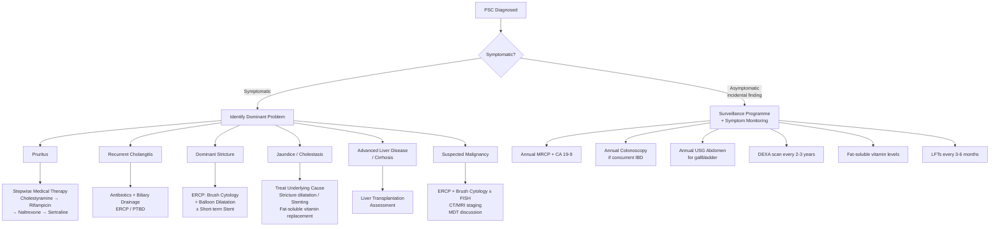
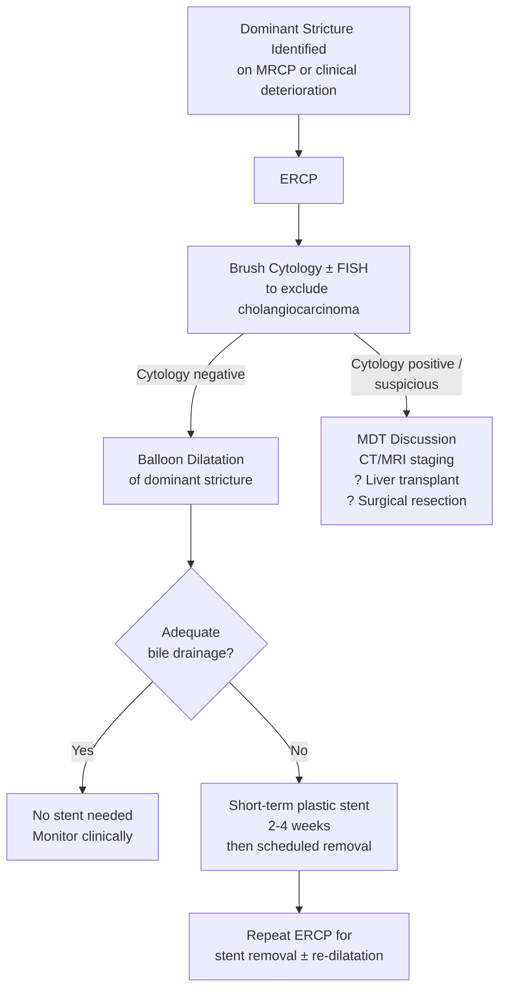

## Management of Primary Sclerosing Cholangitis

### The Harsh Reality — Setting the Scene

Let me be upfront about this: **PSC is one of the most frustrating diseases in hepatology to manage**. Why? Because:

1. There is **no proven medical therapy** that alters the natural history of the disease
2. ***NONE of the following agents are proven to alter the natural history of the disorder — Glucocorticoid, Cyclosporine, Methotrexate, Azathioprine, Tacrolimus*** [1]
3. ***UDCA is NOT generally recommended in PSC due to uncertain benefits*** [1]
4. The ***only definitive treatment is liver transplantation*** for advanced disease [1]

So the management of PSC is fundamentally about: **(a)** managing symptoms, **(b)** treating complications as they arise, **(c)** surveillance for malignancy, and **(d)** knowing when to refer for transplantation. Think of it as chronic disease management with serial troubleshooting, not curative treatment.

---

### Management Algorithm — Overview

---

### A. Medical Management

#### 1. Ursodeoxycholic Acid (UDCA) — The Controversial One

Let's break down the name: "urso" = bear (Latin *ursus*), "deoxy" = oxygen removed, "cholic acid" = a bile acid. UDCA was originally isolated from bear bile — it is a hydrophilic bile acid that constitutes only ~3% of the human bile acid pool.

**Mechanism of action** (theoretical in PSC):
- Replaces toxic hydrophobic bile acids in the bile acid pool → protects cholangiocytes from bile acid–mediated injury
- Stimulates biliary secretion (choleresis) → improves bile flow
- Has anti-inflammatory and immunomodulatory properties (reduces HLA class I expression on hepatocytes)
- Stabilises the "bicarbonate umbrella" on cholangiocyte apical membranes

**The evidence problem**:

| Dose | Outcome | Status |
|:---|:---|:---|
| **Standard dose (13–15 mg/kg/day)** | Improves liver biochemistry (ALP, bilirubin) but has **NOT** been shown to improve transplant-free survival, prevent progression to cirrhosis, or reduce cholangiocarcinoma risk in large RCTs | ***NOT generally recommended*** [1] |
| **High dose (28–30 mg/kg/day)** | Actually associated with **worse outcomes** — higher rates of serious adverse events (varices, death, need for transplant) in a landmark RCT (Lindor et al., *Hepatology* 2009) | **Contraindicated** |

<Callout title="UDCA in PSC — The Bottom Line" type="error">

***UDCA is NOT generally recommended in PSC due to uncertain benefits*** [1]. This is fundamentally different from PBC, where UDCA at 13–15 mg/kg/day is ***1st line therapy*** and has ***proven survival benefit*** [20].

**In PBC**: UDCA works → proven to delay progression and improve survival. Continue indefinitely.
**In PSC**: UDCA improves blood tests cosmetically but does NOT change outcomes. High-dose is harmful.

Some hepatologists still prescribe low-dose UDCA in PSC for symptomatic improvement of pruritus or biochemistry, but this is **not guideline-recommended** by AASLD (2010) or EASL (2022). It should not be presented as "treatment" in exams.

</Callout>

#### 2. Immunosuppressive Therapy — Why It Doesn't Work in PSC

This seems counterintuitive for an immune-mediated disease, so let me explain why:

- PSC is driven primarily by **innate immune mechanisms and fibrosis** rather than classic adaptive autoimmunity
- The periductal fibrosis, once established, is **self-perpetuating** — suppressing the immune system doesn't reverse scar tissue
- The gut-liver axis (aberrant lymphocyte homing via MAdCAM-1) is not effectively targeted by conventional immunosuppressants
- Unlike AIH, where interface hepatitis responds to steroids, the biliary-targeted injury in PSC follows a different pathway

| Agent | Mechanism | Result in PSC |
|:---|:---|:---|
| **Glucocorticoids** (Prednisolone) | Broad anti-inflammatory; suppresses T-cell activation | No benefit in PSC; significant side effects (osteoporosis, diabetes, weight gain). ***Exception***: Used in **PSC-AIH overlap** where the AIH component responds |
| **Azathioprine** | Purine antimetabolite; inhibits lymphocyte proliferation | No benefit alone or combined with steroids in PSC |
| **Methotrexate** | Folate antagonist; suppresses T-cell-mediated inflammation | No benefit; risk of hepatotoxicity (can itself cause hepatic fibrosis) |
| **Cyclosporine** | Calcineurin inhibitor; blocks T-cell activation via IL-2 pathway | No benefit in RCTs |
| **Tacrolimus** | Calcineurin inhibitor (more potent than cyclosporine) | Improves biochemistry but no evidence of histological or clinical benefit |
| **Mycophenolate mofetil** | Inhibits purine synthesis in lymphocytes | No benefit in PSC |

> ***NONE of the following agents are proven to alter the natural history of the disorder — Glucocorticoid, Cyclosporine, Methotrexate, Azathioprine, Tacrolimus*** [1].

<Callout title="The One Exception — PSC-AIH Overlap" type="idea">

PSC-AIH overlap syndrome (~5–10% of PSC patients) **does** respond to immunosuppression. If you identify interface hepatitis on biopsy with elevated IgG and positive ANA/SMA alongside typical PSC cholangiographic findings, treat the AIH component with:
- **Prednisolone** (induction) + **Azathioprine** (maintenance)
- Continue UDCA for the biliary component (though evidence is weak)

This is the only subset of "PSC" where immunosuppression is warranted.

</Callout>

#### 3. Emerging / Investigational Therapies (2024–2026)

While no agent has achieved regulatory approval specifically for PSC as of 2026, several are in advanced clinical trials and worth knowing:

| Agent | Mechanism | Status |
|:---|:---|:---|
| **Obeticholic acid (OCA)** | FXR (farnesoid X receptor) agonist; modulates bile acid homeostasis | Phase 3 trial (AESOP) completed; shown to reduce ALP but liver-related clinical outcomes pending. Already approved for PBC |
| **Nor-UDCA (norursodeoxycholic acid)** | Side-chain-shortened UDCA analogue; undergoes cholehepatic shunting → induces bicarbonate-rich choleresis | Phase 3 (NorUDCA PSC trial); showed significant ALP reduction vs placebo. Most promising pipeline agent |
| **Cilofexor** | Non-steroidal FXR agonist | Phase 2 showed modest ALP reduction |
| **Simtuzumab** | Anti-LOXL2 antibody (targets cross-linking enzyme in fibrosis) | Failed Phase 2 — no efficacy |
| **Vedolizumab** | Anti-α4β7 integrin (blocks gut lymphocyte homing to gut; already approved for UC/CD) | Paradoxically, by blocking α4β7, it may reduce hepatic lymphocyte recruitment. Case series show variable results; trials ongoing |
| **Vancomycin (oral)** | Alters gut microbiome; reduces secondary bile acid production | Small studies in paediatric PSC show dramatic ALP improvement. Adult data less convincing. Not guideline-recommended |

---

### B. Endoscopic Management — Dominant Stricture Management

This is where the **real procedural action** happens in PSC management. ***Patients with dominant stricture or cholangitis should undergo endoscopic therapy to dilate or stent the stricture to relief jaundice and pruritus*** [1].

#### What Is a Dominant Stricture?

A dominant stricture is a stenosis with luminal diameter ≤ 1.5 mm in the CBD or ≤ 1.0 mm in a hepatic duct. It occurs in ~50% of PSC patients during their disease course and represents a critical management inflection point because:
1. It causes clinically significant cholestasis (worsening jaundice, pruritus)
2. It predisposes to recurrent bacterial cholangitis
3. It must be investigated to **exclude cholangiocarcinoma** (10–20% lifetime risk)

#### Endoscopic Approach

| Procedure | Details | Why |
|:---|:---|:---|
| **Brush cytology** | Sweep a cytology brush across the strictured segment during ERCP; cells examined for dysplasia/malignancy | Cholangiocarcinoma complicating PSC can be very difficult to distinguish from benign stricture. Brush cytology has ~40–60% sensitivity; adding FISH (polysomy detection) improves sensitivity to ~60–70% |
| **Balloon dilatation** | Graduated dilation of the stricture using an inflatable balloon passed through the endoscope | First-line treatment for dominant strictures; avoids the complications of indwelling stents. Improves bile flow, relieves jaundice and pruritus |
| **Short-term plastic stent** | Placed only if dilatation alone fails to achieve adequate drainage; typically left for **2–4 weeks only** | Long-term stenting is **avoided** in PSC because indwelling stents promote bacterial biofilm formation → recurrent cholangitis → accelerated stricture progression. ***Biliary stent in-situ serves as nidus for infection*** [2] |

<Callout title="Stenting in PSC — Less Is More" type="error">

Unlike malignant biliary obstruction where permanent self-expanding metallic stents (SEMS) are used, PSC strictures should be managed with **balloon dilatation alone** whenever possible. If a stent is needed, use a **short-term plastic stent** (2–4 weeks) and schedule removal. Long-term stenting in PSC leads to:
- Stent occlusion → cholangitis
- Biofilm formation → recurrent infections
- Stricture worsening proximal and distal to stent

This is an important distinction from malignant biliary obstruction management where ***self-expandable metallic stents have longer patency*** [20].

</Callout>

#### Role of PTC (Percutaneous Transhepatic Cholangiography/Drainage)

***PTC is preferred to ERCP in stricture/obstruction at or above the level of confluence of hepatic ducts*** [18] — i.e., when the dominant stricture is at the hilum and ERCP cannot access above it.

| Indication | Details |
|:---|:---|
| Failed ERCP access | Cannot cannulate past hilar stricture |
| Bilateral intrahepatic strictures | Need to drain both systems separately |
| Alternative drainage route | When endoscopic approach is contraindicated (e.g., altered anatomy — ***Billroth II gastrectomy, Roux-en-Y*** [21]) |

---

### C. Management of Acute Cholangitis in PSC

PSC patients are prone to recurrent bacterial cholangitis because strictured, stagnant bile is an excellent culture medium. The management follows the same principles as acute cholangitis from any cause — ***RAD: Resuscitation, Antibiotics, Drainage*** [2].

| Step | Action | Details |
|:---|:---|:---|
| ***Resuscitation*** | ***NPO, IV fluids, monitor vitals and I/O*** [2] | Sepsis protocol; lactate, blood cultures before antibiotics |
| ***Antibiotics*** | ***IV Augmentin (mild) or IV Tazocin (severe) × 7 days*** [2] | Cover Gram-negatives (E. coli, Klebsiella) and anaerobes. ***Pathogens: GNR > Enterococcus; Pseudomonas if stent present*** [2] |
| ***Drainage*** | ***Urgent if Reynolds pentad or not responding to antibiotics for 24 hours*** [2] | ERCP with aspiration of pus/bile → balloon dilatation of causative stricture ± temporary stent. If ERCP fails → PTBD |

> ***Management of cholangitis: Resuscitation → Treat sepsis with intravenous antibiotic → Decompression of biliary system (Endoscopic vs percutaneous) → Definitive management*** [22].

**Key point for PSC-specific cholangitis**: The "definitive management" step differs from stone-related cholangitis. In choledocholithiasis, you remove the stone. In PSC, you dilate the stricture — but the underlying disease persists, so cholangitis tends to **recur**. Prophylactic antibiotics (e.g., ciprofloxacin) may be considered for patients with frequent episodes.

---

### D. Management of Symptoms

#### 1. Pruritus — Stepwise Approach

Pruritus in cholestasis is one of the most debilitating symptoms and the most common reason patients seek help. The itch is not caused by bile salts directly depositing in skin (an old theory) but by **autotaxin**-generated **lysophosphatidic acid (LPA)** acting on neural itch pathways.

| Step | Agent | Mechanism | Notes |
|:---|:---|:---|:---|
| **1st line** | **Cholestyramine** (4–16 g/day) | Bile acid sequestrant (anion-exchange resin); binds bile salts in gut lumen → prevents enterohepatic recirculation → reduces circulating pruritogens | Take 2–4 hours apart from other medications (including UDCA) because it binds other drugs. Unpalatable taste; GI side effects (constipation, bloating) |
| **2nd line** | **Rifampicin** (150–300 mg BD) | Induces hepatic microsomal enzymes (CYP3A4, CYP2C9) → enhances metabolism and biliary excretion of pruritogens; also has direct anti-inflammatory effects | Monitor LFTs — can cause drug-induced hepatitis (~5–12%); check LFTs at 2 weeks and monthly for 3 months. Colours urine/tears orange-red |
| **3rd line** | **Naltrexone** (25–50 mg/day) | Opioid receptor antagonist; cholestatic pruritus is partly mediated by endogenous opioids (increased opioidergic tone in cholestasis) | Start at low dose (12.5 mg) to avoid opioid withdrawal-like reaction (even in opioid-naive patients). Not a good choice if patient requires opioid analgesia |
| **4th line** | **Sertraline** (75–100 mg/day) | SSRI; mechanism in pruritus unclear but may modulate central itch processing via serotonergic pathways | Better tolerated than naltrexone; useful if concomitant depression |
| **Refractory** | **Plasmapheresis / albumin dialysis (MARS)** | Physically removes circulating pruritogens from blood | Temporary measure; used as bridge to liver transplantation |
| **Definitive** | **Liver transplantation** | Removes the diseased biliary tree; eliminates the source of cholestasis | The only treatment that definitively cures pruritus in PSC |

> **Mnemonic for pruritus stepladder**: **C**ome **R**unning **N**ow **S**ir → **C**holestyramine → **R**ifampicin → **N**altrexone → **S**ertraline

#### 2. Fatigue

- Most difficult symptom to treat — no specific effective therapy
- Exclude and treat contributing factors: anaemia, hypothyroidism, depression, sleep disruption from pruritus
- General measures: exercise, sleep hygiene, caffeine management
- Modafinil has been tried anecdotally but not evidence-based

#### 3. Fat-Soluble Vitamin Deficiency

| Vitamin | Deficiency Consequence | Replacement |
|:---|:---|:---|
| **Vitamin A** | Night blindness, dry eyes | Oral vitamin A 10,000–25,000 IU/day |
| **Vitamin D** | Osteoporosis, osteomalacia; ***hepatic osteodystrophy*** [20] | Oral cholecalciferol 1,000–4,000 IU/day; calcium supplementation; check 25-OH-vitamin D levels |
| **Vitamin E** | Peripheral neuropathy, ataxia | Oral vitamin E 400–800 IU/day |
| **Vitamin K** | Coagulopathy (prolonged PT/INR); ***vitamin K deficiency leading to decreased absorption of fat-soluble vitamins due to obstructive jaundice*** [8] | Oral phytomenadione 10 mg/day; IV if not absorbed orally or if urgent (pre-procedure) |

#### 4. Steatorrhoea

- ***Symptomatic steatorrhoea due to bile acid insufficiency can be partially corrected by restricting dietary fat*** [20]
- ***Medium-chain triglycerides (MCTs) do not require bile acids for absorption*** — they are absorbed by passive diffusion directly into portal circulation without requiring micellar formation [20]
- Pancreatic enzyme supplementation if concurrent pancreatic insufficiency

#### 5. Metabolic Bone Disease

- **Osteoporosis** is more common than osteomalacia in PSC
- DEXA scan at diagnosis → repeat every 2–3 years
- Management: Calcium + Vitamin D supplementation → bisphosphonates (alendronate/risedronate) if T-score ≤ −2.5
- Weight-bearing exercise; fall prevention

---

### E. Liver Transplantation — The Definitive Treatment

***Liver transplantation is the treatment of choice for patients with advanced liver disease due to PSC*** [1].

#### Indications for Liver Transplantation in PSC

| Indication | Details |
|:---|:---|
| **Decompensated cirrhosis** | ***Signs and symptoms of hepatic decompensation: abdominal distension from ascites, confusion from hepatic encephalopathy, haematemesis from oesophageal variceal bleeding*** [1] |
| **MELD score ≥ 15** | ***MELD score incorporates creatinine (hepatorenal syndrome), bilirubin, INR ± Na*** [20]; score > 15 indicates transplant benefit exceeds risk of surgery |
| **Recurrent bacterial cholangitis** | Uncontrollable despite endoscopic management; significantly impairs quality of life |
| **Intractable pruritus** | Refractory to all medical therapy; can be severely debilitating |
| **Cholangiocarcinoma (selected cases)** | Perihilar cholangiocarcinoma arising in PSC — **selected patients** may undergo neoadjuvant chemoradiation followed by liver transplantation (the "Mayo Protocol"). This is one of the few accepted transplant indications for cholangiocarcinoma |
| **Hepatocellular carcinoma** | Within transplant criteria (Milan/UCSF criteria) if cirrhosis has developed |

#### Transplant Outcomes in PSC

- **5-year survival**: ~85% (excellent — among the best outcomes for any transplant indication)
- **10-year survival**: ~70%
- **Recurrent PSC post-transplant**: Occurs in ~20–25% of cases; the disease can recur in the allograft, typically 3–5 years post-transplant. This confirms the immunological basis of the disease (it follows the patient, not the liver)

#### Contraindications

| Absolute | Relative |
|:---|:---|
| ***Active uncontrolled infection*** [20] | Advanced age ( > 65–70) |
| ***Active alcohol/substance abuse*** [20] | Severe cardiopulmonary disease |
| Unresectable extrahepatic malignancy | Morbid obesity (BMI > 40) |
| Irreversible multi-organ failure | Non-compliance with medical follow-up |
| Advanced cholangiocarcinoma (not meeting Mayo Protocol criteria) | HIV (well-controlled HIV is no longer an absolute contraindication) |

#### Pre-Transplant Considerations Specific to PSC

| Consideration | Details |
|:---|:---|
| **Cholangiocarcinoma screening** | Must actively exclude CCA before listing — annual MRCP + CA 19-9; ERCP with brush cytology if any dominant stricture |
| **CRC screening** | Active CRC or high-grade dysplasia may affect transplant eligibility |
| **IBD management** | IBD may flare or change course post-transplant (especially with immunosuppression); patients who have had colectomy pre-transplant may have pouch complications post-transplant |
| **Bone health** | Immunosuppression (especially corticosteroids) post-transplant accelerates osteoporosis in patients already at risk |

---

### F. Surgical Management (Non-Transplant)

Historically, biliary reconstructive surgery (e.g., hepaticojejunostomy) was attempted for PSC but is now **largely abandoned** because:
- It makes subsequent liver transplantation technically much more difficult (adhesions, altered anatomy)
- It does not alter disease progression
- It carries significant operative morbidity (bile leaks, stricture recurrence, cholangitis)

The only non-transplant surgical indication in PSC is **cholecystectomy** for:
- Gallbladder mass or polyp ≥ 8 mm — ***adenomatous polyps ≥ 1cm (or 8 mm if underlying PSC)*** [19]
- Gallbladder carcinoma
- Symptomatic cholelithiasis

---

### G. Cancer Surveillance — An Integral Part of Management

This is not optional — it is core management. PSC patients carry increased risk of cholangiocarcinoma, CRC, gallbladder carcinoma, and HCC.

| Cancer | Surveillance | Frequency | Rationale |
|:---|:---|:---|:---|
| **Cholangiocarcinoma** | MRCP + CA 19-9 | Annual | 10–20% lifetime risk; ***strong association with cholangiocarcinoma especially perihilar disease*** [9]. Any new dominant stricture → ERCP with brush cytology ± FISH |
| **Colorectal cancer** | Colonoscopy with chromoendoscopy and biopsies | ***Yearly*** if concurrent IBD [3] | ***PSC is a risk factor for IBD-associated colorectal neoplasia*** [3]. CRC risk 4–5× higher than UC alone. ***Primary sclerosing cholangitis: yearly*** surveillance colonoscopy [3] |
| **Gallbladder carcinoma** | USG abdomen | Annual | Cholecystectomy if mass or polyp ≥ 8 mm |
| **Hepatocellular carcinoma** | USG + AFP (if cirrhosis established) | Every 6 months | Standard HCC surveillance for cirrhosis from any cause |

---

### H. Management of Concurrent IBD

The IBD in PSC-UC has unique features and requires specific attention:

- **Colitis may be quiescent** despite significant liver disease — don't be falsely reassured
- **5-ASA (mesalazine)** is the mainstay for mild-to-moderate UC; some evidence suggests it may also be **chemopreventive for CRC** in PSC-UC
- **Immunosuppressants** (azathioprine, biologics) for moderate-to-severe IBD follow standard IBD protocols
- ***Elective surgery for debilitating extra-intestinal manifestations, except those independent of colitis activity — sacroiliitis, hepatobiliary complications*** [23] — meaning PSC itself is NOT an indication for colectomy (it doesn't improve after colectomy; it can even present after colectomy)
- Post-transplant: IBD can worsen (immunosuppressive regimens differ from IBD-specific ones); close monitoring needed

---

### Summary Table: Management at a Glance

| Clinical Scenario | Management |
|:---|:---|
| **Asymptomatic PSC** | Surveillance only (MRCP, colonoscopy, LFTs, vitamins, bone health) |
| **Pruritus** | Cholestyramine → Rifampicin → Naltrexone → Sertraline → Plasmapheresis → Transplant |
| **Dominant stricture** | ERCP: brush cytology (exclude CCA) + balloon dilatation ± short-term plastic stent |
| **Acute cholangitis** | ***RAD: Resuscitation → Antibiotics → Drainage*** [2] |
| **Fat-soluble vitamin deficiency** | Oral vitamin A, D, E, K supplementation |
| **Metabolic bone disease** | Calcium + Vitamin D; bisphosphonates if osteoporosis |
| **Steatorrhoea** | Low-fat diet + MCT supplementation |
| **PSC-AIH overlap** | Prednisolone + Azathioprine (the only subset where immunosuppression works) |
| **Advanced cirrhosis / decompensation** | Liver transplantation |
| **Cholangiocarcinoma in PSC** | Selected patients: neoadjuvant chemoradiation + liver transplant (Mayo Protocol); otherwise palliative stenting |
| **Concurrent IBD** | Standard UC/CD management; annual colonoscopy; 5-ASA as CRC chemoprevention |
| **Gallbladder polyp ≥ 8 mm** | Cholecystectomy |

---

<Callout title="High Yield Summary — Management of PSC">

1. **No proven medical therapy alters the natural history** of PSC. ***UDCA is NOT generally recommended; immunosuppressants (steroids, azathioprine, cyclosporine, methotrexate, tacrolimus) have all failed*** [1].

2. **Dominant strictures** are managed with **ERCP balloon dilatation** ± short-term plastic stent. Always perform **brush cytology** to exclude cholangiocarcinoma. Avoid long-term stenting.

3. **Acute cholangitis** follows ***RAD: Resuscitation → Antibiotics → Drainage*** [2]. Antibiotics: ***IV Augmentin (mild) or IV Tazocin (severe)*** [2].

4. **Pruritus** stepwise: Cholestyramine → Rifampicin → Naltrexone → Sertraline. Mnemonic: "**C**ome **R**unning **N**ow **S**ir."

5. ***Liver transplantation is the treatment of choice for advanced liver disease*** [1]. 5-year survival ~85%. PSC recurs in ~20% of allografts.

6. **PSC-AIH overlap** is the ONLY PSC variant that responds to immunosuppression (prednisolone + azathioprine).

7. **Cancer surveillance is mandatory**: Annual MRCP + CA 19-9 (CCA), ***yearly colonoscopy if IBD*** [3], annual USG (gallbladder), 6-monthly USG + AFP if cirrhotic (HCC).

8. **Fat-soluble vitamins** (A, D, E, K) must be supplemented. **Metabolic bone disease** needs DEXA and treatment.

9. ***Cholecystectomy for GB polyps ≥ 8 mm in PSC*** (lower threshold than general population's 10 mm) [19].

10. **Biliary reconstructive surgery is largely abandoned** — it makes subsequent transplantation harder without altering disease progression.

</Callout>

---

<ActiveRecallQuiz
  title="Active Recall - PSC Management"
  items={[
    {
      question: "A patient with PSC asks whether ursodeoxycholic acid will help prevent disease progression. What do you tell them, and how does this differ from PBC?",
      markscheme: "UDCA is NOT generally recommended in PSC as it has not been proven to improve transplant-free survival, prevent cirrhosis, or reduce cholangiocarcinoma risk despite improving biochemistry. High-dose UDCA (28-30 mg/kg/day) is actually harmful. This contrasts with PBC where UDCA at 13-15 mg/kg/day is first-line therapy with proven survival benefit, delaying progression to end-stage liver disease and need for transplant."
    },
    {
      question: "Describe the endoscopic management approach for a dominant stricture in PSC, including the critical investigation that must be performed.",
      markscheme: "ERCP with brush cytology plus or minus FISH to exclude cholangiocarcinoma (sensitivity improved from 40-60% with cytology alone to 60-70% with FISH). If cytology negative: balloon dilatation of the stricture. If dilatation alone does not achieve adequate drainage: short-term plastic stent (2-4 weeks only, then scheduled removal). Avoid long-term stenting as indwelling stent serves as nidus for infection and worsens strictures."
    },
    {
      question: "List the stepwise approach to managing cholestatic pruritus in PSC. For each agent, briefly explain its mechanism.",
      markscheme: "Step 1: Cholestyramine - bile acid sequestrant, binds bile salts in gut preventing enterohepatic recirculation. Step 2: Rifampicin - induces hepatic CYP enzymes enhancing metabolism and excretion of pruritogens. Step 3: Naltrexone - opioid antagonist, blocks endogenous opioid-mediated pruritus pathway. Step 4: Sertraline - SSRI, modulates central serotonergic itch processing. Refractory: plasmapheresis or liver transplantation."
    },
    {
      question: "What are the indications for liver transplantation in PSC, and what is the expected 5-year survival?",
      markscheme: "Indications: 1) Decompensated cirrhosis (ascites, encephalopathy, variceal bleeding). 2) MELD score 15 or above. 3) Recurrent bacterial cholangitis uncontrollable by endoscopic means. 4) Intractable pruritus refractory to medical therapy. 5) Selected cholangiocarcinoma (Mayo Protocol with neoadjuvant chemoradiation). 6) HCC within transplant criteria. Expected 5-year survival approximately 85%. Note: PSC recurs in the allograft in approximately 20-25% of cases."
    },
    {
      question: "Why does immunosuppressive therapy fail in PSC but succeed in PSC-AIH overlap? What specific immunosuppressive regimen is used in the overlap syndrome?",
      markscheme: "PSC is driven by innate immune mechanisms and established periductal fibrosis that is self-perpetuating. Conventional immunosuppressants cannot reverse scar tissue and do not effectively target the gut-liver axis (MAdCAM-1 mediated lymphocyte homing). PSC-AIH overlap has a superimposed adaptive autoimmune component (interface hepatitis) that responds to immunosuppression. Regimen: Prednisolone for induction plus Azathioprine for maintenance, same as standard AIH treatment."
    }
  ]}
/>

## References

[1] Senior notes: felixlai.md (PSC Treatment section, felix:758)
[2] Senior notes: maxim.md (Acute cholangitis management — RAD, maxim:288–289)
[3] Lecture slides: Inflammatory bowel disease.pdf (p52, p56 — CRC surveillance in PSC; yearly colonoscopy)
[8] Senior notes: maxim.md (Obstructive jaundice — biliary obstruction consequences, maxim:251)
[9] Senior notes: felixlai.md (Cholangiocarcinoma risk factors — PSC association, felix:778)
[18] Senior notes: maxim.md (HBP investigations — PTC preferred for hilar obstruction, maxim:250–251)
[19] Senior notes: maxim.md (Gallbladder polyps management — 8 mm threshold in PSC, maxim:292)
[20] Senior notes: felixlai.md (PBC treatment — UDCA, vitamin supplementation, liver transplant, felix:763; maxim liver transplant criteria, maxim:268)
[21] Lecture slides: GC 200. RUQ pain, jaundice and fever Cholecytitis and cholangitis Imaging of GI system.pdf (p14 — ERCP contraindications)
[22] Lecture slides: Malignant biliary obstruction.pdf (p15, p17 — Management of cholangitis and biliary obstruction)
[23] Senior notes: maxim.md (IBD surgical indications — EIM independent of colitis, maxim:190)
