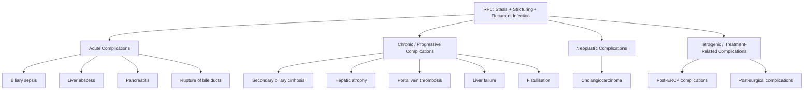

## Complications of Recurrent Pyogenic Cholangitis

The complications of RPC can be understood as the downstream consequences of the disease's vicious cycle — **stasis, stricturing, and recurrent infection** — playing out across different timescales. Some complications are **acute** (from each cholangitis flare), some are **chronic** (from cumulative damage over years), and one is **neoplastic** (the dreaded end-stage transformation). Additionally, there are complications arising from the **treatment itself** (iatrogenic) [1][2][17].

A helpful way to organise these is by category and by timeline:

---

## A. Acute Complications

These arise during or shortly after each cholangitis flare. They are direct consequences of **acute biliary obstruction + bacterial infection**.

### 1. Biliary Sepsis

| Aspect | Detail |
|---|---|
| **Definition** | Systemic infection originating from the infected biliary tree — bacteraemia progressing to sepsis and septic shock [1][2][17] |
| **Mechanism** | Biliary obstruction → biliary pressure rises ***above 25 cm H₂O*** → ***bacteria reflux into hepatic veins and lymphatics*** → ***bacteraemia and septic shock*** [16]. The obstructed biliary system becomes a pressurised reservoir of infected bile. Gram-negative endotoxin enters the systemic circulation → activates complement, coagulation cascades, and inflammatory mediators (TNF-α, IL-1, IL-6) → SIRS → sepsis → multiorgan dysfunction |
| **Clinical presentation** | ***Reynold's pentad***: Charcot's triad (fever + RUQ pain + jaundice) + ***shock*** (hypotension) + ***altered mental status*** (confusion) [6]. Present in < 10% of patients but carries very high mortality |
| **Why it's dangerous** | ***Excretion of antibiotics is impaired in biliary obstruction*** [16] — even appropriate antibiotics cannot reach adequate biliary concentrations. Without drainage, antibiotics alone cannot control the infection |
| **Management** | ***Urgent biliary drainage is mandatory*** [16] — ERCP (first-line) → PTBD → ECBD. Aggressive resuscitation, vasopressors if needed, broad-spectrum IV antibiotics |

<Callout title="Biliary Sepsis — The Most Feared Acute Complication">
Biliary sepsis is the leading cause of acute mortality in RPC. The combination of an obstructed, pressurised biliary system and polymicrobial infection creates a perfect storm for overwhelming sepsis. ***15% of patients will NOT respond to antibiotics*** [6] and require emergency drainage. Any RPC patient with Reynold's pentad should be treated as a surgical emergency.
</Callout>

### 2. Liver Abscess

| Aspect | Detail |
|---|---|
| **Definition** | Localised collection of pus within the hepatic parenchyma, arising from ascending biliary infection [8][17] |
| **Mechanism** | Infected bile under pressure → bacteria track along intrahepatic biliary radicles → penetrate into adjacent liver parenchyma → walled-off pus collection. ***Ascending biliary infection accounts for 20–30% of pyogenic liver abscesses*** [8], and RPC is a major cause in Southeast Asia |
| **Common organisms** | E. coli, Klebsiella pneumoniae (common in > 60 years + DM), Streptococcus milleri [8] |
| **Clinical features** | ***Swinging fever***, chills and rigors, septic-looking; ***tender hepatomegaly***; jaundice is ***not*** as prominent as in cholangitis alone (the abscess is primarily a parenchymal problem) [8] |
| **Diagnosis** | USG: hypoechoic/complex cystic mass, no vascularity. ***CT abdomen with contrast: double-target sign*** (rim-enhancing with central hypodensity), cluster sign [8]. ***Blood culture***, CRP for monitoring |
| **Can be distant** | ***Abscess formation at distant sites including lungs and brain*** [17] — haematogenous seeding from bacteraemia. If the patient develops neurological symptoms or respiratory deterioration during an RPC flare, think of metastatic abscess |
| **Management** | IV antibiotics (Augmentin or ceftriaxone + metronidazole for ≥ ***4–6 weeks*** [8]); percutaneous drainage (needle aspiration if < 5 cm, catheter if > 5 cm) [8]; address the underlying biliary obstruction |

<Callout title="Liver Abscess vs Acute Cholangitis — They Often Coexist" type="idea">
In RPC, liver abscess and acute cholangitis frequently coexist. Always perform USG/CT to **rule out liver abscess** when treating an RPC flare [1][7]. The management of the abscess (percutaneous drainage + prolonged antibiotics) is **in addition to** biliary drainage for the cholangitis — missing one while treating the other leads to treatment failure.
</Callout>

### 3. Acute Biliary Pancreatitis

| Aspect | Detail |
|---|---|
| **Definition** | Acute pancreatitis triggered by biliary stones/sludge impacting at the ampulla of Vater [2][17] |
| **Mechanism** | Stone or sludge from the intrahepatic/extrahepatic ducts migrates distally → impacts at the ampulla → obstructs the pancreatic duct → premature activation of pancreatic enzymes (trypsinogen → trypsin) within the pancreatic parenchyma → autodigestion → acute pancreatitis |
| **Why it occurs in RPC** | ***Result of passage of biliary stones*** [17]. Although RPC stones primarily form in intrahepatic ducts, fragments or sludge can migrate down into the CBD and impact at the ampulla. The disrupted sphincter from prior ERCPs also facilitates stone passage |
| **Clinical features** | Severe epigastric pain radiating to the back, nausea/vomiting, markedly elevated amylase/lipase ( > 3× ULN) |
| **Management** | Supportive (NPO, IV fluids, analgesia); early ERCP if concurrent cholangitis; address the underlying biliary pathology |

### 4. Rupture of Obstructed Bile Ducts

| Aspect | Detail |
|---|---|
| **Definition** | ***Rupture of obstructed pus-filled bile ducts into the peritoneum*** [17] |
| **Mechanism** | Severe obstruction → biliary pressure rises markedly → the wall of a pus-filled, dilated bile duct becomes necrotic from infection and ischaemia → perforation → infected bile and pus leak into the peritoneal cavity → **biliary peritonitis** |
| **Clinical features** | Sudden worsening of abdominal pain, generalised tenderness, guarding, board-like rigidity (peritonism), septic shock |
| **Diagnosis** | CT: free fluid in peritoneal cavity, discontinuity of bile duct wall |
| **Management** | Surgical emergency — peritoneal lavage + biliary drainage + antibiotics |

> This is a rare but catastrophic complication. The bile duct is essentially a pressurised tube of pus, and when it bursts, it contaminates the entire peritoneal cavity.

---

## B. Chronic / Progressive Complications

These develop insidiously over years from the cumulative effect of repeated obstruction, infection, and inflammation.

### 5. Secondary Biliary Cirrhosis

| Aspect | Detail |
|---|---|
| **Definition** | Cirrhosis (irreversible fibrosis with regenerative nodules) resulting from chronic, prolonged biliary obstruction [2][17] |
| **Mechanism** | Chronic biliary obstruction → persistent cholestasis → bile acids accumulate in hepatocytes → hepatocyte injury → periductal fibrosis → bridging fibrosis → cirrhosis. The bile acids are detergent molecules — when they cannot be excreted, they damage the hepatocyte membranes from within. Additionally, recurrent cholangitis episodes cause periductal inflammation and fibrosis that progressively extends into the parenchyma |
| **Timeline** | Takes years to decades of recurrent obstruction. This is why RPC patients who present at age 30–40 may develop cirrhosis by their 50s–60s if the disease is not adequately managed |
| **Consequences** | Portal hypertension (varices, ascites, splenomegaly), synthetic failure (hypoalbuminaemia, coagulopathy), hepatorenal syndrome, hepatic encephalopathy |
| **Clinical features** | Spider naevi, palmar erythema, ascites, splenomegaly, caput medusae, jaundice (now from hepatocellular failure rather than just obstruction) |
| **Key point** | This is a **preventable** complication — adequate biliary drainage and definitive surgery (hepatic resection + HJ) can arrest progression before cirrhosis develops |

### 6. Hepatic Atrophy

| Aspect | Detail |
|---|---|
| **Definition** | Volume loss of a hepatic lobe or segment due to chronic obstruction and parenchymal destruction [1][2] |
| **Mechanism** | Chronic obstruction of intrahepatic ducts in a particular segment → persistent cholestasis and ischaemia → hepatocyte death → parenchymal collapse → fibrotic replacement → volume loss. The contralateral lobe undergoes **compensatory hypertrophy** |
| **Predilection** | ***Left lobe*** (reflecting the left-sided predominance of RPC) [2] |
| **Imaging** | CT: small, atrophic left lobe with dilated ducts and stones; hypertrophied right lobe |
| **Significance** | An atrophic segment is non-functional, harbours infection and stones, and serves as a persistent source of sepsis. It is also at risk for malignant transformation. This is one of the key ***indications for hepatic resection*** [2] |

### 7. Portal Vein Thrombosis

| Aspect | Detail |
|---|---|
| **Definition** | Thrombosis within the portal vein or its branches [17] |
| **Mechanism** | Chronic periductal inflammation from recurrent cholangitis → inflammatory damage to the portal vein (which runs alongside the bile ducts in the portal triad) → endothelial injury → activation of coagulation cascade → thrombus formation. Additionally, biliary sepsis causes a systemic pro-coagulant state (DIC, sepsis-associated coagulopathy). Hepatic atrophy and fibrosis also reduce portal flow, promoting stasis (Virchow's triad: stasis + endothelial injury + hypercoagulability — all present in RPC) |
| **Consequences** | Worsens portal hypertension → variceal bleeding, ascites; can cause mesenteric ischaemia if extension occurs |
| **Diagnosis** | Doppler ultrasound; CT with contrast (filling defect in portal vein) |
| **Significance** | Complicates surgical planning — portal vein thrombosis may make hepatic resection more technically challenging or preclude it |

### 8. Liver Failure

| Aspect | Detail |
|---|---|
| **Definition** | End-stage hepatic decompensation [17] |
| **Mechanism** | Progressive biliary cirrhosis → loss of critical mass of functional hepatocytes → failure of synthetic, excretory, and detoxification functions. Additionally, recurrent sepsis causes cumulative hepatocyte damage |
| **Clinical features** | Jaundice (progressive, now hepatocellular), coagulopathy, hypoalbuminaemia, hepatic encephalopathy, ascites, hepatorenal syndrome |
| **Management** | Liver transplantation may be considered in advanced cases — though this is rarely performed for RPC specifically, as the disease is typically managed with resection and drainage before it reaches this stage |

### 9. Fistulisation

| Aspect | Detail |
|---|---|
| **Definition** | ***Formation of choledocho-duodenal fistula into gastrointestinal tract or abdominal wall*** [17] |
| **Mechanism** | Chronic inflammation from recurrent cholangitis → erosion through the bile duct wall into adjacent structures. The continuous cycle of infection and healing weakens the duct wall and surrounding tissues. Stones themselves can erode through the wall by pressure necrosis |
| **Types** | Choledocho-duodenal fistula (most common — bile duct erodes into duodenum); cholecysto-enteric fistula; fistula to abdominal wall (rare) |
| **Consequences** | Pneumobilia/aerobilia (air in biliary tree — from the GI tract entering through the fistula); may predispose to further ascending infection; rarely, gallstone ileus if a large stone passes through the fistula into the bowel |
| **Diagnosis** | Imaging: aerobilia on AXR/CT; contrast studies may demonstrate the fistula tract |

---

## C. Neoplastic Complication

### 10. Cholangiocarcinoma — The Most Important Long-Term Complication

This deserves special emphasis because it is the most feared long-term outcome and directly impacts surveillance strategy.

| Aspect | Detail |
|---|---|
| **Definition** | Malignant tumour of the bile duct epithelium — ***> 90% are adenocarcinoma*** [5][11] |
| **Mechanism** | Chronic inflammation → repeated epithelial injury and regeneration → accumulation of genetic mutations → ***dysplasia → carcinoma sequence***. This is analogous to the colitis-associated cancer sequence in UC. The bile duct epithelium in RPC is subjected to decades of: (1) direct bacterial damage, (2) bile acid-induced mutagenesis (retained bile acids are genotoxic), (3) parasitic-induced chronic inflammation (Clonorchis sinensis), (4) generation of reactive oxygen species (ROS) from chronic infection |
| **Epidemiological link** | ***Association with ulcerative colitis (common in Westerners) and recurrent pyogenic cholangitis (common in Orientals)*** [5]. ***Mostly occurs in patients > 50 years*** [5] |
| **Risk factors for cholangioCA in RPC** | Duration of disease (longer → higher risk); extent of stricturing; hepatolithiasis; Clonorchis infection; PSC overlap [11] |
| **Clinical red flags** | New or worsening progressive painless jaundice (different from the episodic painful jaundice of RPC flares); unexplained weight loss; anorexia; rising CA 19-9 on serial measurement; new hepatomegaly; ***RUQ pain, hepatomegaly, jaundice*** [5] |
| **Diagnosis** | ***Tumour markers: CEA and CA 19-9 (may or may not be elevated, nonspecific)*** [5]; ***USG, CT scan, MRI*** [5]; ***FNAC or Trucut biopsy (ONLY for unresectable cases)*** [5]; choledochoscopy with biopsy for histological confirmation |
| **Treatment** | ***Hepatic resection is the treatment of choice (resectability rate about 20%)*** [5]; ***other treatment: no proven effect*** [5]. The low resectability rate reflects the fact that cholangiocarcinoma is often diagnosed late, especially when superimposed on RPC (the symptoms of malignancy overlap with the symptoms of RPC flares) |
| **Prognosis** | Very poor — especially when diagnosed late. This underscores the importance of vigilant surveillance in all RPC patients |

<Callout title="Why RPC → Cholangiocarcinoma — The Molecular Rationale" type="idea">
The chronic inflammation-to-cancer pathway in RPC involves several molecular mechanisms:
1. **NF-κB activation** by bacterial endotoxin → chronic inflammatory signalling → promotes cell survival and proliferation
2. **Reactive oxygen species (ROS)** from activated neutrophils and macrophages → DNA damage → oncogenic mutations
3. **Bile acid genotoxicity** — retained bile acids (especially secondary bile acids) cause direct DNA damage and promote apoptosis resistance
4. **IL-6/STAT3 signalling** — upregulated in chronic cholangitis → drives cholangiocyte proliferation and survival
5. **Parasite-specific factors** — Clonorchis sinensis secretes excretory/secretory products that directly promote cell proliferation via the Wnt/β-catenin pathway

The cumulative effect over decades is a field change in the biliary epithelium — widespread dysplasia from which carcinoma eventually emerges.
</Callout>

<Callout title="Screening and Surveillance for Cholangiocarcinoma in RPC" type="error">
There is no universally standardised surveillance protocol, but the following approach is widely practiced in Hong Kong centres:
- **Regular USG** (every 6–12 months) — look for new masses, worsening strictures, change in biliary anatomy
- **Serial CA 19-9** — a rising trend (even if absolute value is within normal range) should prompt further investigation
- **Low threshold for CT/MRI** if any clinical change (new weight loss, worsening jaundice, failure to respond to usual treatment)
- **Choledochoscopy with biopsy** during any planned ERCP/PTBD procedure — direct visualisation and tissue sampling
- ***FNAC or Trucut biopsy should be performed ONLY for unresectable cases*** [5] — in potentially resectable tumours, percutaneous biopsy risks needle-tract seeding
</Callout>

---

## D. Iatrogenic / Treatment-Related Complications

RPC patients undergo frequent invasive procedures (ERCP, PTBD, surgery), each carrying its own complication profile.

### 11. Post-ERCP Complications

| Complication | Mechanism | Features | Management |
|---|---|---|---|
| ***Acute pancreatitis*** | Instrumentation near pancreatic duct orifice → traumatic oedema → pancreatic duct obstruction → enzyme activation | Epigastric pain post-procedure; elevated amylase/lipase | Conservative (NPO, IV fluids); usually self-limited |
| ***Perforation*** [6][15] | Sphincterotomy cuts through duodenal wall or bile duct wall | **Intraperitoneal**: free gas under diaphragm → ***requires surgery*** (will not seal). **Retroperitoneal**: no free gas under diaphragm, retroperitoneal gas → ***conservative treatment*** (will seal spontaneously) [6] | Surgery vs conservative based on type |
| ***Bleeding from papillotomy*** [15] | Electrocautery damages vessels at the sphincter during sphincterotomy | Haematemesis, melaena, haemobilia | Endoscopic haemostasis (adrenaline injection, cautery, clips); correct coagulopathy |
| **Cholangitis flare** | Instrumentation introduces organisms; incomplete drainage; stent occlusion | Fever, tachycardia post-ERCP | Check stent position (AXR); repeat drainage if needed; antibiotics |
| **Stent occlusion/migration** | Sludge/biofilm (plastic stents); tumour ingrowth (metallic stents); mechanical displacement | Recurrent jaundice, cholangitis | Stent exchange at scheduled intervals |

### 12. Post-PTBD Complications

| Complication | Mechanism |
|---|---|
| **Bacteraemia** | Needle traverses infected parenchyma → organisms enter bloodstream. ***Antibiotic prophylaxis required*** [14] |
| **Haemobilia** | Needle punctures a branch of the hepatic artery or portal vein (they travel together in the portal triad) → blood enters bile duct → haemobilia (blood in bile) |
| **Fluid and electrolyte loss** | External bile drainage → loss of bile salts, bicarbonate, and fluid → dehydration, electrolyte imbalance, malabsorption |
| **Bile leak / peritonitis** | Catheter dislodgement or tract disruption → bile leaks into peritoneal cavity |
| **Pneumothorax** | Right-sided approach may transgress the pleural space (the right intrahepatic approach is intercostal). This is why ***left hepatic duct access is preferred*** (subcostal, less painful, avoids pleura) [6] |

### 13. Post-Surgical Complications

| Complication | Mechanism |
|---|---|
| **Anastomotic stricture** | Fibrosis at the hepaticojejunostomy site → recurrent biliary obstruction → cholangitis. The ***most frequent long-term complication of Roux-en-Y hepaticojejunostomy*** is stenosis of the biliary-enteric anastomosis leading to jaundice, cirrhosis, or cholangitis [18] |
| **Bile leak** | Anastomotic leak or cut surface leak → biloma → infection |
| **Liver failure** (post-resection) | Insufficient future liver remnant after hepatic resection → post-hepatectomy liver failure |
| **Recurrent stone formation** | Even after resection, remaining ducts may develop new stones if the underlying stasis-infection cycle is not completely broken |
| **Wound infection / poor wound healing** | Cholestasis → impaired protein synthesis → impaired wound healing; nutritional deficiency; immunosuppression from sepsis |

---

## Summary: Complications by Timeline

| Timeline | Complications |
|---|---|
| **Acute (each flare)** | ***Biliary sepsis***, ***liver abscess*** (local and distant — lungs, brain), ***pancreatitis***, ***rupture of bile ducts*** |
| **Chronic (years)** | ***Secondary biliary cirrhosis***, ***hepatic atrophy***, ***portal vein thrombosis***, ***liver failure***, ***fistulisation*** |
| **Neoplastic (decades)** | ***Cholangiocarcinoma*** — the most important long-term complication |
| **Iatrogenic** | Post-ERCP (pancreatitis, perforation, bleeding, cholangitis), post-PTBD (haemobilia, bacteraemia), post-surgical (anastomotic stricture, bile leak, liver failure) |

---

<Callout title="High Yield Summary — Complications of RPC">

1. **Acute complications** arise from each cholangitis flare: ***biliary sepsis*** (Reynold's pentad — urgent drainage mandatory), ***liver abscess*** (ascending biliary infection; swinging fever, tender hepatomegaly; double-target sign on CT), ***pancreatitis*** (stone passage to ampulla), ***rupture*** of pus-filled bile ducts into peritoneum

2. **Chronic complications** arise from cumulative damage: ***secondary biliary cirrhosis*** (chronic cholestasis → fibrosis), ***hepatic atrophy*** (left lobe predominant; indication for resection), ***portal vein thrombosis*** (periductal inflammation + hypercoagulability), ***liver failure*** (end-stage), ***fistulisation*** (erosion into bowel/abdominal wall)

3. ***Cholangiocarcinoma*** is the most important long-term neoplastic complication — driven by chronic inflammation → dysplasia → carcinoma sequence. ***Associated with RPC in Orientals*** and ***PSC/UC in Westerners*** [5]. ***Hepatic resection is the treatment of choice (resectability rate ~20%)*** [5]. ***FNAC/biopsy ONLY for unresectable cases*** [5]

4. **Iatrogenic complications**: Post-ERCP (pancreatitis, perforation — distinguish intraperitoneal from retroperitoneal, bleeding); Post-PTBD (haemobilia, bacteraemia); Post-surgery (anastomotic stricture — most common long-term surgical complication)

5. **Key management principles**: Biliary drainage is mandatory for acute sepsis; percutaneous drainage for liver abscess; hepatic resection for atrophic segments and suspected cholangioCA; regular surveillance for malignancy

</Callout>

---

<ActiveRecallQuiz
  title="Active Recall - Complications of RPC"
  items={[
    {
      question: "List the 4 main acute complications of RPC and explain the pathophysiology of biliary sepsis from first principles.",
      markscheme: "Acute complications: (1) Biliary sepsis, (2) Liver abscess, (3) Pancreatitis, (4) Rupture of obstructed bile ducts. Biliary sepsis mechanism: Biliary obstruction raises ductal pressure above 25 cm H2O. At this pressure, bacteria reflux from bile into hepatic veins and lymphatics, causing bacteraemia. Gram-negative endotoxin activates systemic inflammatory response, leading to septic shock. Antibiotic excretion into bile is impaired by obstruction, so biliary drainage is mandatory.",
    },
    {
      question: "Explain why cholangiocarcinoma develops in RPC patients. What is the molecular pathway, and what clinical red flags should prompt investigation?",
      markscheme: "Chronic inflammation from recurrent bacterial and parasitic damage leads to repeated epithelial injury and regeneration. This drives a dysplasia-to-carcinoma sequence via NF-kB activation, ROS-mediated DNA damage, bile acid genotoxicity, and IL-6/STAT3 upregulation. Red flags: new progressive painless jaundice (different from episodic painful jaundice of RPC), unexplained weight loss, anorexia, rising CA 19-9 on serial measurements, new hepatomegaly.",
    },
    {
      question: "A post-ERCP patient develops severe abdominal pain. How do you distinguish intraperitoneal from retroperitoneal perforation, and how does management differ?",
      markscheme: "Intraperitoneal perforation: duodenal perforation. CXR shows free gas under diaphragm. Requires operative treatment because it will NOT seal spontaneously. Retroperitoneal perforation: bile duct perforation at ampulla (retroperitoneal portion of D2). NO free gas under diaphragm; retroperitoneal gas may be present on CT. Managed conservatively because it will seal spontaneously.",
    },
    {
      question: "What are the consequences of secondary biliary cirrhosis in RPC, and why is it considered a preventable complication?",
      markscheme: "Consequences: Portal hypertension (varices, ascites, splenomegaly), synthetic failure (hypoalbuminaemia, coagulopathy), hepatorenal syndrome, hepatic encephalopathy. It is preventable because adequate biliary drainage (ERCP/PTBD) and definitive surgery (hepatic resection + hepaticojejunostomy) can relieve chronic obstruction and arrest progressive fibrosis before cirrhosis develops.",
    },
    {
      question: "Why is hepatic atrophy an indication for surgical resection in RPC? What is the typical lobe affected and why?",
      markscheme: "An atrophic hepatic segment is non-functional, harbours stones and strictures, serves as a persistent source of infection and sepsis, and is at increased risk of malignant transformation (cholangioCA). The left lobe is typically affected due to anatomical factors: the left hepatic duct has a more acute drainage angle and longer intrahepatic course, promoting relative biliary stasis and making it more susceptible to stone formation and stricturing.",
    },
    {
      question: "Regarding cholangiocarcinoma complicating RPC, state the treatment of choice and its resectability rate. When is FNAC or Trucut biopsy indicated?",
      markscheme: "Hepatic resection is the treatment of choice. Resectability rate is approximately 20%. FNAC or Trucut biopsy is indicated ONLY for unresectable cases — in potentially resectable tumours, percutaneous biopsy risks needle-tract seeding and should be avoided.",
    },
  ]}
/>

## References

[1] Senior notes: felixlai.md (Recurrent pyogenic cholangitis — Complications section, p. 528)
[2] Senior notes: maxim.md (Recurrent pyogenic cholangitis — Complications, pp. 136–137)
[3] Senior notes: maxim.md (Clonorchis sinensis infection, p. 138)
[5] Lecture slides: WCS 064 - A large liver - by Prof R Poon [20191108].doc.pdf (p. 5, Cholangiocarcinoma — aetiology, diagnosis, treatment)
[6] Senior notes: felixlai.md (Acute cholangitis — Treatment and ERCP complications, pp. 522–525)
[7] Senior notes: maxim.md (Acute cholangitis — Acute management RAD, pp. 135–136)
[8] Senior notes: maxim.md (Liver abscess section, p. 125)
[11] Senior notes: felixlai.md (Cholangiocarcinoma — Etiology and risk factors, pp. 547–548)
[14] Senior notes: felixlai.md (PTBD section, pp. 504–505, 524)
[15] Lecture slides: GC 200. RUQ pain, jaundice and fever Cholecytitis and cholangitis Imaging of GI system.pdf (p. 14, ERCP complications)
[16] Lecture slides: Malignant biliary obstruction.pdf (p. 16, Cholangitis — biliary pressure, antibiotic excretion, drainage mandatory)
[17] Senior notes: felixlai.md (RPC — Complications, p. 528)
[18] Senior notes: felixlai.md (Biliary cysts — Complications of Roux-en-Y HJ, p. 544)
