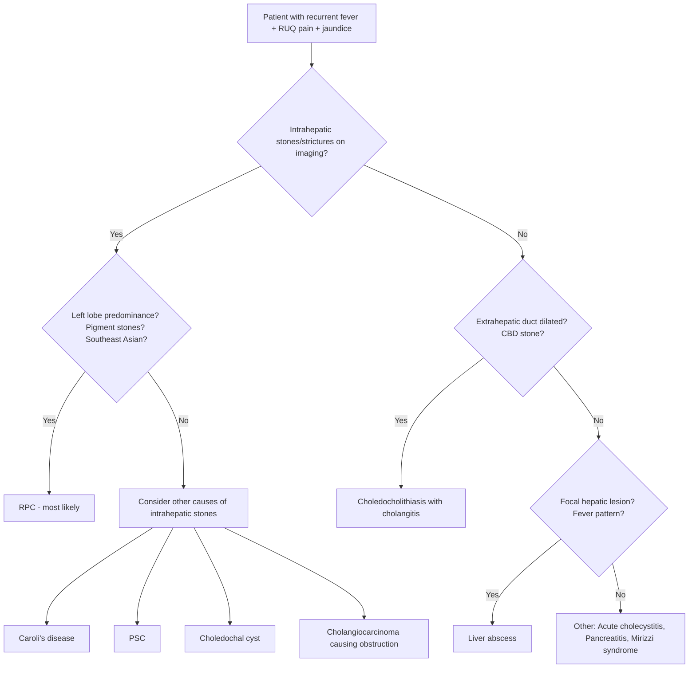

## Differential Diagnosis of Recurrent Pyogenic Cholangitis

The clinical presentation of RPC — recurrent episodes of **fever, RUQ pain, and jaundice** (Charcot's triad) — is shared by a number of hepatobiliary conditions. The differential diagnosis should be approached systematically. Think of it this way: any condition that causes **biliary obstruction + infection** or **biliary obstruction + inflammation** can mimic RPC. The key is figuring out *where* the obstruction is, *what* is causing it, and *whether* the pattern is truly recurrent with intrahepatic stones [1][2][6].

### Framework for Differential Diagnosis

The DDx of RPC is essentially the DDx of **recurrent cholangitis** and/or **intrahepatic biliary disease**. We can organise it by:

1. **Conditions presenting with Charcot's triad (fever + RUQ pain + jaundice)**
2. **Conditions causing intrahepatic biliary strictures and stones (mimicking the imaging pattern of RPC)**
3. **Conditions that are complications of or evolve from RPC itself**

---

### Differential Diagnosis Decision Framework

---

### Detailed Differential Diagnosis

#### 1. Choledocholithiasis with Acute Cholangitis (Most Common DDx)

This is the **single most important differential** and the most common cause of acute cholangitis worldwide [6][7].

| Feature | Choledocholithiasis + Cholangitis | RPC |
|---|---|---|
| **Stone origin** | Gallbladder → migrates to CBD | ***De novo in intrahepatic ducts*** [1][2] |
| **Stone type** | Usually cholesterol (mixed) | ***Brown pigment (Ca bilirubinate)*** [1] |
| **Gallbladder** | Often contains stones; may be fibrosed from chronic cholecystitis | Usually spared; ***NOT fibrosed*** (exception to Courvoisier's law) [4] |
| **Biliary strictures** | Not a primary feature | ***Hallmark feature*** — intrahepatic strictures with dilatation [1][2] |
| **Pattern** | Usually single episode or few recurrences; resolves after cholecystectomy + CBD clearance | ***Recurrent*** (1–2 episodes/year); persists even after stone clearance because strictures reform [2] |
| **Imaging** | CBD dilatation ± CBD stone; gallstones in GB | ***Intrahepatic ductal dilatation with focal stricturing***, left lobe predilection, ± hepatic atrophy [2] |
| **Geography** | Worldwide | ***Southeast Asia*** [1] |

**Why this distinction matters**: In choledocholithiasis, cholecystectomy + CBD clearance is usually curative. In RPC, the disease is in the intrahepatic ducts — simply removing CBD stones does NOT address the underlying strictures and intrahepatic stone burden. Missing RPC and treating it as simple choledocholithiasis leads to persistent recurrence [1][2].

<Callout title="How to Tell Them Apart" type="idea">
The key distinguishing features of RPC versus simple choledocholithiasis are: (1) **intrahepatic stones** (not just CBD), (2) **intrahepatic strictures**, (3) **left lobe predilection**, (4) **pigment stones** (not cholesterol), (5) **recurrent pattern despite treatment**, and (6) patient from **Southeast Asia**. If the imaging shows a clean gallbladder but intrahepatic ductal dilatation with strictures and stones — think RPC.
</Callout>

---

#### 2. Liver Abscess (Pyogenic or Amoebic)

Liver abscess can present very similarly to RPC, and indeed **liver abscess is also a complication of RPC** — so they can coexist [8][2].

| Feature | Liver Abscess | RPC |
|---|---|---|
| **Fever pattern** | ***Swinging fever***, chills and rigors, septic-looking [8] | Fever with or without chills; episodic pattern |
| **Jaundice** | ***Not significant*** (mainly parenchymal disease) [8] | Prominent (biliary obstruction) |
| **Hepatomegaly** | ***Tender hepatomegaly*** [8] | May have hepatomegaly but tenderness is RUQ-focused |
| **Key imaging finding** | USG: multiloculated cystic mass, no vascularity; ***CT: double-target sign*** (rim-enhancing with central hypodensity) [8] | USG/CT: dilated ducts with strictures and intrahepatic stones; atrophy |
| **Blood culture** | Often positive (Klebsiella, E. coli, Strep milleri) [8] | May be positive during acute episodes |
| **Amoebic abscess** | ***Bloody dysentery*** history; travel to endemic area; ***anchovy paste-like*** aspirate; ***no eosinophilia*** [8] | No dysentery |
| **Biliary stones** | Not a primary feature | Hallmark |

**Why this is important**: Liver abscess from RPC is caused by ***ascending biliary infection*** (20–30% of pyogenic liver abscess cases arise from biliary sources, including RPC, cholecystitis, and cholangitis) [8]. Always look for underlying RPC when you find a liver abscess in a Southeast Asian patient with intrahepatic duct abnormalities.

---

#### 3. Acute Cholecystitis

| Feature | Acute Cholecystitis | RPC |
|---|---|---|
| **Pain** | RUQ pain > 6 hours, positive **Murphy's sign** [9] | RUQ pain, but Murphy's sign typically negative (gallbladder not primarily inflamed) |
| **Fever** | Present | Present |
| **Jaundice** | Uncommon (unless Mirizzi syndrome or choledocholithiasis coexists) | Prominent |
| **Imaging** | USG: distended GB, GB wall thickening > 3mm, pericholecystic fluid, positive sonographic Murphy's sign [9] | USG: intrahepatic duct dilatation with stones and strictures; GB usually normal |
| **Key distinction** | Pathology is in the **gallbladder** | Pathology is in the **intrahepatic bile ducts** |

---

#### 4. Primary Sclerosing Cholangitis (PSC)

PSC and RPC can look remarkably similar on imaging — both cause biliary strictures and dilatation. However, they are fundamentally different diseases [6][10].

| Feature | PSC | RPC |
|---|---|---|
| **Definition** | Chronic progressive ***inflammation, fibrosis, and stricturing*** of bile ducts — ***large ducts more affected than small ducts*** [10] | Recurrent infection-driven stricturing — ***small intrahepatic ducts more affected*** [1] |
| **Etiology** | Autoimmune / unknown | Infectious (parasitic + bacterial) |
| **Geographic predilection** | ***Western countries*** (rare in Asia) [7][10] | ***Southeast Asia*** [1][2] |
| **Associated conditions** | ***Strong association with ulcerative colitis*** (majority of PSC patients have UC) [10] | Associated with parasitic infection (Clonorchis sinensis) |
| **IBD association** | ***Yes — ulcerative colitis*** [5][10] | No |
| **Stone formation** | Not a primary feature (but secondary stones can form) | ***Primary feature*** — de novo pigment stones |
| **Cholangiogram appearance** | "Beaded" appearance — diffuse multifocal strictures with intervening dilatation, ***both intrahepatic and extrahepatic*** | Intrahepatic strictures with ***left lobe predilection***; central dilatation with peripheral tapering [2] |
| **Serology** | p-ANCA may be positive; ↑ IgG; ANA may be positive | Stool ova and parasites may be positive |
| **Cancer risk** | ***Cholangiocarcinoma*** (especially perihilar) [10] | ***Cholangiocarcinoma*** [2][5] |

**Why distinguish them**: Treatment is completely different. PSC has no proven medical therapy (ursodeoxycholic acid is controversial); management focuses on endoscopic treatment of dominant strictures and liver transplantation for end-stage disease. RPC management centres on stone clearance, biliary drainage, and hepatic resection [2][10].

<Callout title="PSC vs RPC — The Two Great Biliary Stricturing Diseases" type="error">
A common exam pitfall is confusing PSC and RPC. Remember: ***PSC = Western, autoimmune, associated with UC, large ducts primarily affected, rare in Asia*** [7][10]. ***RPC = Oriental, infectious, associated with parasites, small intrahepatic ducts primarily affected, common in Hong Kong*** [1][2]. Both predispose to cholangiocarcinoma. PSC is listed as a cause of secondary sclerosing cholangitis when RPC causes similar-looking cholangiographic changes [10].
</Callout>

---

#### 5. Cholangiocarcinoma

This is both a **differential diagnosis** of RPC and a **complication** of RPC — the two are intertwined [2][5][11].

| Feature | Cholangiocarcinoma | RPC |
|---|---|---|
| **Presentation** | ***Painless progressive obstructive jaundice*** in elderly ( > 50 years); ***RUQ pain, hepatomegaly, jaundice***; ***anorexia, weight loss, fever*** [5][11] | Recurrent episodes of painful jaundice with fever in middle-aged patients |
| **Pattern** | Progressive, worsening | Episodic, recurrent |
| **Risk factors** | ***Association with UC (common in Westerners) and RPC (common in Orientals)*** [5]; PSC; choledochal cysts; Caroli's disease; ***thorium dioxide (Thorotrast)*** [11] | Parasitic infection, low socioeconomic status |
| **Tumour markers** | ***CEA and CA 19-9 may be elevated*** (but nonspecific) [5][11] | Not elevated (unless cholangiocarcinoma has developed) |
| **Histology** | ***> 90% adenocarcinoma***; CK7 positive [11] | N/A (no neoplasm) |
| **Key imaging distinction** | Mass lesion, hilar obstruction (Klatskin tumour), vascular encasement | Stones + strictures without mass (unless superimposed cholangioCA) |

**Clinical pearl**: Any RPC patient with ***progressive worsening of jaundice, new weight loss, or rising CA 19-9*** should be evaluated urgently for superimposed cholangiocarcinoma [2][5].

> ***Cholangiocarcinoma: association with ulcerative colitis (common in Westerners) and recurrent pyogenic cholangitis (common in Orientals). Mostly occurs in patients > 50 years.*** [5]

---

#### 6. Mirizzi Syndrome

| Feature | Mirizzi Syndrome | RPC |
|---|---|---|
| **Definition** | ***Common hepatic duct obstruction*** caused by extrinsic compression from an ***impacted stone in Hartmann's pouch/cystic duct*** [4][12] | Intrahepatic biliary strictures + stones from chronic infection |
| **Jaundice** | Present (CHD obstruction) | Present (intrahepatic obstruction) |
| **Palpable GB** | ***Jaundice with palpable GB*** — exception to Courvoisier's law [12] | Also exception to Courvoisier's law [4] |
| **Imaging** | USG: dilated biliary tree **above** stone impaction at GB neck; contracted GB [12] | USG: intrahepatic duct dilatation with stones and strictures |
| **Cholecystobiliary fistula** | Can develop (Csendes type 2–5) [12] | Not a feature |
| **Key distinction** | Pathology is at the **cystic duct/Hartmann's pouch** level; gallbladder is the culprit | Pathology is in the **intrahepatic ducts**; gallbladder is a bystander |

---

#### 7. Acute Biliary Pancreatitis

| Feature | Biliary Pancreatitis | RPC |
|---|---|---|
| **Pain** | Severe epigastric pain radiating to the back | RUQ/epigastric pain |
| **Amylase/Lipase** | Markedly elevated ( > 3× ULN) | Normal or mildly elevated |
| **Jaundice** | May be present (if stone at ampulla) | Present |
| **Mechanism** | Stone impacts at ampulla → pancreatic duct obstruction | Intrahepatic stones + strictures |
| **Key distinction** | Elevated pancreatic enzymes; pancreatic inflammation on CT | Intrahepatic ductal disease on imaging |

Note: Pancreatitis can also be a **complication** of RPC if stones/sludge migrate to the ampulla [2].

---

#### 8. Caroli's Disease and Choledochal Cysts

These congenital biliary anomalies can mimic RPC on imaging and also predispose to RPC [11][13].

| Feature | Caroli's Disease | Choledochal Cyst | RPC |
|---|---|---|---|
| **Definition** | Multiple ***cystic dilatations of intrahepatic bile ducts*** (Todani type V) [13] | Congenital ***cystic dilatation of intra/extrahepatic biliary system*** [13] | Acquired intrahepatic strictures + stones |
| **Age at diagnosis** | Usually childhood ( < 10 years in 60%) [13] | Usually childhood | Middle age (30–40 years) |
| **Complications** | Stone formation, cholangitis, ***cholangiocarcinoma*** [11][13] | Pancreatitis, cholangitis, ***cholangiocarcinoma*** [11][13] | Biliary sepsis, cirrhosis, ***cholangiocarcinoma*** |
| **Imaging** | Saccular intrahepatic duct dilatation ("central dot sign" on CT) | Extrahepatic cystic dilatation (type I most common) [13] | Strictures + dilatation + stones, left lobe predilection |
| **Key distinction** | Congenital; no strictures per se; saccular dilatation | Congenital; predominantly extrahepatic | Acquired; strictures are the hallmark |

---

#### 9. IgG4-Associated Cholangitis (IAC)

| Feature | IgG4-Associated Cholangitis | RPC |
|---|---|---|
| **Demographics** | ***Mostly elderly male*** [7] | Equal sex, middle-age, Southeast Asian |
| **Mechanism** | ***Infiltration of biliary system with IgG4-positive plasma cells*** [7] | Infectious — parasitic + bacterial |
| **Associated conditions** | Autoimmune pancreatitis (type 1); may have multi-organ IgG4 disease | Parasitic infection |
| **Serology** | Elevated serum IgG4 | Normal IgG4; stool ova and parasites may be positive |
| **Response to steroids** | Dramatic response to corticosteroids | No response to steroids |
| **Imaging** | Diffuse or segmental bile duct wall thickening; can mimic cholangioCA | Strictures + dilatation + stones |

---

#### 10. Biliary Leaks

Post-operative biliary leaks (e.g., after cholecystectomy or liver surgery) can present with fever, abdominal pain, and jaundice, and should be considered in the **post-surgical** patient [6].

| Feature | Biliary Leak | RPC |
|---|---|---|
| **Context** | Post-operative | No surgical history required |
| **Onset** | Acute, days after surgery | Chronic, recurrent |
| **Imaging** | HIDA scan or MRCP showing biliary leak; biloma on CT/USG | Intrahepatic stones + strictures |

---

### Summary Table: Key Differentiating Features

| Differential | Key Distinguishing Feature(s) from RPC |
|---|---|
| **Choledocholithiasis + cholangitis** | CBD stones from GB migration; cholesterol stones; no intrahepatic strictures; resolves after cholecystectomy |
| **Liver abscess** | Focal hepatic lesion; swinging fever; jaundice not prominent; double-target sign on CT |
| **Acute cholecystitis** | Murphy's sign positive; GB wall thickening; no intrahepatic duct disease |
| **PSC** | Western; autoimmune; UC association; large ducts; beaded cholangiogram; no stones primarily |
| **Cholangiocarcinoma** | Progressive painless jaundice; mass lesion; > 50 years; weight loss |
| **Mirizzi syndrome** | Stone impacted at Hartmann's pouch/cystic duct; CHD obstruction; cholecystobiliary fistula |
| **Biliary pancreatitis** | Markedly elevated amylase/lipase; pancreatic inflammation |
| **Caroli's disease** | Congenital; saccular intrahepatic dilatation; childhood presentation |
| **Choledochal cyst** | Congenital; predominantly extrahepatic cystic dilatation; childhood |
| **IgG4-associated cholangitis** | Elderly male; elevated IgG4; steroid-responsive; autoimmune pancreatitis |
| **Biliary leak** | Post-operative context; acute onset |

---

### DDx Based on Level of Biliary Obstruction

When you see biliary dilatation on imaging, the level of obstruction guides your differential [6]:

| Level | Differentials |
|---|---|
| ***Hilum*** | ***RPC***, Klatskin tumour (cholangioCA), CA gallbladder, HCC (segments 4/5), Mirizzi syndrome, porta hepatis lymphadenopathy, PSC [6] |
| **Mid-CBD** | CA CBD, CA head of pancreas, lymphadenopathy [6] |
| **Distal CBD** | Bile duct strictures, periampullary carcinoma (duodenum, distal CBD, pancreatic head, ampulla of Vater), choledochal cysts, pancreatic cysts, chronic pancreatitis [6] |

> RPC characteristically causes **hilar and intrahepatic** obstruction. If you see isolated distal CBD obstruction, think of other diagnoses first (periampullary tumour, choledocholithiasis, chronic pancreatitis).

---

### History-Taking Approach to Narrow the DDx

When faced with a patient presenting with Charcot's triad, the following history points help narrow the differential [7]:

| Question | Purpose |
|---|---|
| **Ethnicity / country of origin** | Southeast Asian → RPC; Western → PSC, choledocholithiasis |
| **Dietary history** — raw freshwater fish? | Clonorchis sinensis exposure → RPC |
| **Recurrence pattern** — how many episodes? | Recurrent (1–2/year) → RPC; single episode → choledocholithiasis |
| **Previous biliary surgery or ERCP** | Post-procedural → biliary leak, stent occlusion, iatrogenic stricture |
| **IBD history (bloody diarrhoea, UC)** | ***PSC is strongly associated with UC*** [10] |
| **Weight loss, progressive jaundice** | Malignancy (cholangioCA, pancreatic CA) |
| **Stool colour / urine colour** | ***Tea-coloured urine + pale stool*** = obstructive jaundice (surgical cause) [7]; normal coloured = medical cause |
| **Pain character** | Colicky → stone; dull persistent → abscess/tumour; radiating to back → pancreatitis |
| **Age** | Middle-age → RPC; elderly with painless jaundice → ***malignant biliary obstruction until proven otherwise*** [7] |

<Callout title="Painless Progressive Obstructive Jaundice in the Elderly">
***Painless progressive obstructive jaundice in elderly is malignant biliary obstruction until proven otherwise*** [7]. This is a crucial clinical pearl. RPC typically presents with **painful** jaundice and **fever** in a **middle-aged** patient. If the jaundice is painless, progressive, and the patient is > 50, think cholangiocarcinoma, pancreatic head CA, or periampullary tumour first.
</Callout>

---

<Callout title="High Yield Summary — Differential Diagnosis">

1. **Most important DDx**: Choledocholithiasis with acute cholangitis — differentiate by stone location (CBD vs intrahepatic), stone type (cholesterol vs pigment), presence of strictures, and recurrence pattern

2. **Liver abscess** can mimic AND complicate RPC — look for swinging fever, tender hepatomegaly, double-target sign on CT; jaundice is NOT prominent in isolated liver abscess

3. **PSC vs RPC**: PSC = Western, autoimmune, UC association, large duct disease, rare in Asia. RPC = Oriental, infectious, parasitic association, small duct disease, common in Hong Kong

4. **Cholangiocarcinoma** is both a DDx and a complication — progressive painless jaundice + weight loss in a patient > 50; ***associated with UC (Westerners) and RPC (Orientals)***

5. **Congenital causes** (Caroli's disease, choledochal cysts) present in childhood; can predispose to RPC

6. **Level of obstruction guides DDx**: RPC causes hilar/intrahepatic obstruction; distal obstruction → think periampullary tumours

7. **Exception to Courvoisier's law**: Both RPC and Mirizzi syndrome are exceptions — but the mechanism differs (RPC: gallbladder not fibrosed because pathology is in ducts; Mirizzi: stone at Hartmann's pouch compresses CHD)

</Callout>

---

<ActiveRecallQuiz
  title="Active Recall - DDx of Recurrent Pyogenic Cholangitis"
  items={[
    {
      question: "Name 6 conditions in the differential diagnosis of a patient presenting with recurrent fever, RUQ pain, and jaundice.",
      markscheme: "Any 6 of: (1) Choledocholithiasis with acute cholangitis, (2) Liver abscess, (3) Acute cholecystitis, (4) PSC, (5) Cholangiocarcinoma, (6) Mirizzi syndrome, (7) Biliary pancreatitis, (8) Caroli's disease, (9) Choledochal cyst, (10) IgG4-associated cholangitis, (11) Biliary leak.",
    },
    {
      question: "How do you differentiate PSC from RPC? Give 4 distinguishing features.",
      markscheme: "PSC: (1) Western population, rare in Asia; (2) Autoimmune etiology; (3) Strong association with UC; (4) Large ducts more affected than small ducts; (5) No primary stone formation. RPC: (1) Southeast Asian; (2) Infectious etiology (parasitic/bacterial); (3) Small intrahepatic ducts more affected; (4) De novo pigment stone formation; (5) Left lobe predilection.",
    },
    {
      question: "A 65-year-old man presents with painless progressive jaundice and weight loss. What is the most likely category of diagnosis, and why does this differ from RPC?",
      markscheme: "Malignant biliary obstruction until proven otherwise (e.g. cholangiocarcinoma, pancreatic head CA, periampullary tumour). Differs from RPC because RPC presents with PAINFUL jaundice + fever in MIDDLE-AGED patients (30-40 years) from Southeast Asia, with a recurrent episodic pattern rather than progressive worsening.",
    },
    {
      question: "Liver abscess can both mimic and complicate RPC. Name 3 clinical features that help distinguish an isolated liver abscess from an acute RPC flare.",
      markscheme: "(1) Swinging fever pattern (vs episodic fever in RPC); (2) Tender hepatomegaly is dominant sign (vs RUQ pain + jaundice in RPC); (3) Jaundice is NOT prominent in isolated liver abscess (parenchymal disease) vs prominent in RPC (biliary obstruction); (4) CT shows double-target sign (rim-enhancing lesion) vs dilated ducts with stones and strictures.",
    },
    {
      question: "What is the significance of the level of biliary obstruction in differential diagnosis? Where does RPC typically cause obstruction?",
      markscheme: "Level of obstruction narrows the DDx. RPC typically causes HILAR and INTRAHEPATIC obstruction (strictures in small intrahepatic ducts, left lobe predilection). Hilar DDx includes: Klatskin tumour, CA gallbladder, HCC, Mirizzi syndrome, PSC, porta hepatis LN. Isolated DISTAL CBD obstruction suggests periampullary tumours, chronic pancreatitis, or choledocholithiasis instead.",
    },
  ]}
/>

## References

[1] Senior notes: felixlai.md (Recurrent pyogenic cholangitis section, pp. 526–527)
[2] Senior notes: maxim.md (Recurrent pyogenic cholangitis section, pp. 136–137)
[4] Senior notes: felixlai.md (Courvoisier's law section, p. 568); Senior notes: maxim.md (Courvoisier's Law note, p. 130)
[5] Lecture slides: WCS 064 - A large liver - by Prof R Poon [20191108].doc.pdf (p. 5, Cholangiocarcinoma)
[6] Senior notes: felixlai.md (Causes of biliary obstruction and level of obstruction, pp. 499–501)
[7] Senior notes: maxim.md (Obstructive jaundice differential diagnosis, p. 135; Acute cholangitis section, pp. 135–136)
[8] Senior notes: maxim.md (Liver abscess section, p. 125); Senior notes: felixlai.md (Liver abscess section, p. 436)
[9] Senior notes: maxim.md (Symptomatic gallstones summary table, p. 130)
[10] Senior notes: felixlai.md (Primary sclerosing cholangitis section, pp. 529–530)
[11] Senior notes: felixlai.md (Cholangiocarcinoma etiology and pathogenesis, pp. 547–548); Senior notes: maxim.md (Cholangiocarcinoma risk factors, p. 139)
[12] Senior notes: maxim.md (Mirizzi syndrome section, p. 132)
[13] Senior notes: maxim.md (Choledochal cyst section, p. 138)
