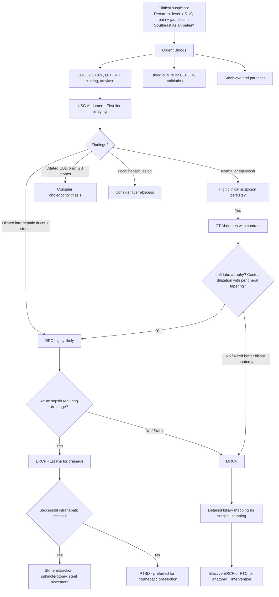
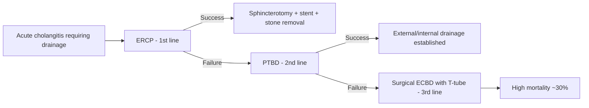

## Diagnostic Criteria for Acute Cholangitis (Applied to RPC)

There is no standalone "diagnostic criteria" set for RPC per se — instead, the diagnosis of an **acute RPC flare** uses the diagnostic criteria for **acute cholangitis** (based on the Tokyo Guidelines, TG18/TG13), combined with imaging findings that are characteristic of the underlying RPC disease pattern. Think of it in two layers:

1. **Layer 1**: Is this acute cholangitis? → Apply the Tokyo Guidelines criteria
2. **Layer 2**: Is the underlying cause RPC? → Look for the characteristic imaging triad of **intrahepatic stones + intrahepatic strictures + left lobe predilection**

---

### Tokyo Guidelines Diagnostic Criteria for Acute Cholangitis [6][7]

These criteria apply to any acute cholangitis episode, including those caused by RPC.

#### Suspected Diagnosis

The patient must have **BOTH** of the following [6]:

| Criterion A (Systemic inflammation) | Criterion B (Cholestasis/biliary injury) |
|---|---|
| **ONE** of: Fever or shaking chills **OR** Laboratory evidence of inflammatory response (abnormal WBC, ↑ CRP, or other inflammatory markers) | **ONE** of: Jaundice **OR** Abnormal liver chemistries (↑ AST/ALT/ALP/GGT) |

#### Definite Diagnosis

In addition to meeting criteria for suspected diagnosis, the patient must have **BOTH** of the following [6]:

| Criterion C (Biliary dilatation) | Criterion D (Etiology identified) |
|---|---|
| Biliary dilatation on imaging | Evidence of an etiology on imaging: **stone, stricture, or stent** |

<Callout title="Applying TG18 to RPC">
In RPC, the "definite diagnosis" criteria are almost always met during acute flares because imaging shows both **biliary dilatation** (from stricture-induced obstruction) and the **etiology** (intrahepatic stones and strictures). The challenge is not whether the patient has cholangitis — it's recognising that the **underlying pattern** is RPC rather than simple choledocholithiasis. This requires careful imaging interpretation.
</Callout>

#### Severity Grading (TG18) — Important for Guiding Urgency of Drainage

| Grade | Criteria | Clinical Significance |
|---|---|---|
| **Grade I (Mild)** | Does not meet criteria for Grade II or III; responds to initial antibiotic therapy | Conservative management |
| **Grade II (Moderate)** | Any 2 of: WBC > 12 or < 4 ×10⁹/L, fever ≥ 39°C, age ≥ 75, bilirubin ≥ 85 μmol/L (5 mg/dL), albumin < 0.7× lower limit of normal | Early biliary drainage recommended |
| ***Grade III (Severe)*** | Organ dysfunction in any ONE system: cardiovascular (hypotension requiring vasopressors), neurological (altered consciousness), respiratory, renal (oliguria, Cr > 176 μmol/L), hepatic (PT-INR > 1.5), haematological (platelets < 100 ×10⁹/L) | ***Urgent biliary drainage*** — this is Reynold's pentad territory [6][7] |

> ***Reynold's pentad*** (Charcot's triad + shock + altered mental status) corresponds to Grade III severity and requires **emergent biliary drainage** — delay leads to multiorgan failure and death [6][7].

---

### Diagnostic Features Specific to RPC (Layer 2)

Once acute cholangitis is confirmed, the following features on investigation point specifically to RPC rather than other causes [1][2]:

| Feature | Explanation |
|---|---|
| **Intrahepatic stones** (not just CBD stones) | Stones formed de novo within intrahepatic ducts — pathognomonic |
| **Intrahepatic biliary strictures** with proximal dilatation | Fibrotic narrowing from repeated infection-healing cycles |
| ***Central dilated bile ducts with peripheral tapering*** | Classic CT finding — central ducts dilated, peripheral ducts narrowed by strictures [2] |
| ***Left lobe predilection*** | Due to anatomical drainage angle promoting stasis [2] |
| **Hepatic atrophy** (usually left lobe) | Chronic obstruction and parenchymal destruction [2] |
| **Absence of gallbladder stones** (typically) | Stones form in ducts, not gallbladder — distinguishes from choledocholithiasis |
| ***Brown pigment stones*** (on ERCP/choledochoscopy) | Soft, earthy, calcium bilirubinate — not cholesterol |
| **Recurrent history** | 1–2 episodes per year over many years [2] |
| **Southeast Asian ethnicity** | Strong geographic predilection [1] |

---

## Diagnostic Algorithm

### Overall Approach

The diagnostic workup of a suspected RPC flare follows a logical stepwise approach: **clinical assessment → bloods → initial imaging (USG) → advanced imaging (CT/MRCP) → cholangiography (ERCP/PTC) if therapeutic intervention needed** [1][2][6][7][14].

---

## Investigation Modalities — Detailed Breakdown

### A. Bedside and Physical Examination

Before any bloods or imaging, the clinical examination itself provides crucial information:

| Finding | Significance | Pathophysiological Basis |
|---|---|---|
| **Charcot's triad** (fever + RUQ pain + jaundice) | Strongly suggests acute cholangitis [6] | Infection + obstruction + biliary backflow |
| **Reynold's pentad** (+ shock + confusion) | ***Grade III severity — needs urgent drainage*** [6][7] | Sepsis → endotoxaemia → cardiovascular collapse + encephalopathy |
| **Palpable gallbladder** | Exception to Courvoisier's law — suggests RPC (not chronic cholecystitis) [4] | Gallbladder not fibrosed (disease is in ducts) → can distend with CBD obstruction |
| **Hepatomegaly** | Intrahepatic ductal dilatation; may also indicate abscess | Biliary obstruction → back-pressure → liver swelling |
| **Signs of chronic liver disease** | Suggests secondary biliary cirrhosis (advanced RPC) | Chronic biliary obstruction → progressive fibrosis |

---

### B. Laboratory Investigations

#### B1. Blood Tests

| Test | Expected Findings in RPC | Why This Test? (Pathophysiological Rationale) |
|---|---|---|
| ***CBC with differentials*** | ***Leukocytosis with neutrophil predominance*** [6][14] | Bacterial infection → bone marrow releases neutrophils → left shift. Thrombocytopenia if sepsis-associated DIC or hypersplenism from cirrhosis |
| **CRP / ESR** | ***↑ ESR and CRP*** [6] | Acute phase reactants produced by the liver in response to IL-6; CRP useful for monitoring treatment response |
| ***LFT*** | ***↑ ALP and GGT (cholestatic pattern)***; ***↑ conjugated bilirubin***; mild ↑ AST/ALT [6][14] | **ALP and GGT** are enzymes concentrated in the biliary epithelium — obstruction causes back-pressure and induction of these enzymes. **Conjugated bilirubin** rises because it is synthesised but cannot be excreted past the obstruction. AST/ALT may be mildly elevated from hepatocellular injury secondary to cholestasis |
| **RFT** | May show ↑ creatinine in severe cases | Renal impairment from sepsis (hepatorenal syndrome in cirrhotic patients) or direct nephrotoxicity from cholestasis |
| ***Clotting profile*** | ***Coagulopathy*** (prolonged PT/INR) [4][14] | **Why?** Bile cannot reach the intestine → cannot emulsify fats → cannot absorb fat-soluble vitamins (A, D, E, ***K***) → Vitamin K is a co-factor for factors II, VII, IX, X → deficiency causes prolonged PT. This is critical to check **before any invasive procedure** like ERCP or PTBD |
| ***Blood culture*** (×2 sets BEFORE antibiotics) | May grow E. coli, Klebsiella, Enterococcus, Pseudomonas [7] | ***Blood culture is essential*** — guides targeted antibiotic therapy. Take before starting empirical antibiotics. Positive bile cultures are common with bile duct stones and other causes of obstruction [6] |
| **Amylase / Lipase** | Usually normal; elevated if concurrent pancreatitis | Rule out biliary pancreatitis (stone at ampulla → pancreatic duct obstruction) [7] |
| ***Stool for ova and parasites*** | May detect Clonorchis sinensis eggs [2][3] | Identifies the parasitic trigger — important for targeted treatment (praziquantel) and epidemiological understanding |

<Callout title="The Cholestatic Pattern — Explained from First Principles" type="idea">
**Why ALP and GGT rise more than AST/ALT in biliary obstruction:**
- ALP (alkaline phosphatase) is an enzyme found on the **canalicular surface** of hepatocytes (the bile duct-facing surface). When bile backs up, this membrane is disrupted → ALP leaks into blood. Additionally, bile acids that accumulate act as detergents that solubilise ALP from the membrane.
- GGT (gamma-glutamyl transferase) is concentrated in the **biliary epithelium** itself. Obstruction → epithelial damage → GGT release. GGT is also induced by bile acids.
- AST/ALT are **cytoplasmic enzymes of hepatocytes** — they rise primarily with hepatocellular damage (e.g., hepatitis). In cholestasis, the hepatocyte itself is not the primary target, so these rise only mildly from secondary back-pressure injury.
- **Conjugated (direct) bilirubin** rises because the hepatocyte conjugates bilirubin normally, but the conjugated product cannot be excreted through the obstructed ducts → refluxes back into the bloodstream → conjugated hyperbilirubinaemia.
</Callout>

#### B2. Tumour Markers (When Cholangiocarcinoma is Suspected)

| Marker | Interpretation |
|---|---|
| ***CEA and CA 19-9*** | ***May or may not be elevated; nonspecific*** [5][14] | These markers lack sensitivity and specificity for cholangiocarcinoma. However, in an RPC patient, a **rising CA 19-9** over serial measurements should raise alarm for superimposed malignancy |
| ***Serial assay after resection*** | ***Might aid in diagnosis of persistent or recurrent disease*** [14] |

<Callout title="Tumour Markers — NOT for Screening" type="error">
***CEA and CA 19-9 are NOT useful as screening tools for malignant biliary obstruction*** [14]. They are neither sensitive nor specific. The absence of an elevated tumour marker does NOT exclude underlying malignancy [14]. Their role is in **serial monitoring** after resection to detect recurrence.
</Callout>

#### B3. Urinalysis

| Finding | Significance |
|---|---|
| **Bile in urine (conjugated bilirubin)** | Conjugated bilirubin is water-soluble → filtered by kidneys when serum levels rise → bilirubinuria → dark "tea-coloured" urine. Confirms obstructive (post-hepatic) jaundice [6] |
| **Absent urobilinogen** | No bilirubin reaching the gut → no urobilinogen produced → none reabsorbed → absent in urine. Helps distinguish obstructive from hepatocellular jaundice |

---

### C. Imaging Investigations

This is the cornerstone of RPC diagnosis. The goals of imaging are:

1. **Confirm biliary obstruction** (dilatation)
2. **Identify the cause** (stones, strictures)
3. **Map the extent of disease** (which segments affected, atrophy)
4. **Detect complications** (abscess, cholangiocarcinoma)
5. **Plan intervention** (drainage route, surgical resection)

#### C1. Transabdominal Ultrasound (USG) — First-Line Imaging

***USG is the initial imaging modality*** for any patient with suspected biliary disease [1][2][7].

| Finding | Description | Significance |
|---|---|---|
| ***Dilated intrahepatic ducts*** | Parallel channel sign (dilated duct running alongside portal vein branches); intrahepatic ducts normally < 2–3 mm and not visible on USG [14] | Confirms biliary obstruction |
| ***Intrahepatic stones*** | Hyperechoic foci within dilated ducts ± posterior acoustic shadowing | Direct visualisation of RPC stones; brown pigment stones may be less echogenic than cholesterol stones |
| ***Liver abscess*** | Hypoechoic or complex cystic lesion within liver parenchyma | Complication of RPC — must rule out [1][2] |
| **Gallbladder** | Usually normal (no stones, no wall thickening) | Helps distinguish from cholecystitis/choledocholithiasis |
| **CBD dilatation** | CBD > 8 mm (or > 0.1 cm per decade of age) [14] | May be present if extrahepatic component exists |

**Limitations of USG**:
- **Distal CBD often obscured by bowel gas** [14] — cannot reliably see ampullary pathology
- May miss small intrahepatic stones
- Operator-dependent
- **Acute obstruction** — duct may not yet have time to dilate → false negative [6]

#### C2. CT Abdomen (with Contrast) — Second-Line / Staging

CT provides more anatomical detail than USG and is critical for **surgical planning** and **complication detection** [1][2].

| Finding | Description | Significance |
|---|---|---|
| ***Central dilated bile ducts with peripheral tapering*** | Dilated central intrahepatic ducts that narrow peripherally due to strictures | ***Classic CT finding of RPC*** [2] — the strictures are peripheral, so central ducts dilate while peripheral ducts are narrowed |
| ***Left lobe predilection*** | Disease predominantly affecting left hepatic lobe | Characteristic of RPC [2] |
| ***Hepatic atrophy*** (usually left lobe) | Volume loss of the affected hepatic lobe | Chronic obstruction → parenchymal destruction → atrophy with compensatory hypertrophy of the contralateral lobe [1][2] |
| **Intrahepatic calculi** | Hyperdense foci within dilated ducts | Brown pigment stones are radio-opaque (contain calcium) |
| **Liver abscess** | Rim-enhancing hypodense lesion (double-target sign) [8] | Complication |
| **Suspicious mass** | Irregular enhancing mass within or adjacent to strictured duct | Raises concern for superimposed ***cholangiocarcinoma*** [5] |

**Why CT is important in RPC specifically**: CT demonstrates whether disease is ***localised*** (usually to the left lobe) and whether ***atrophy*** has developed [1] — both critical factors in deciding whether **hepatic resection** is indicated.

#### C3. Magnetic Resonance Cholangiopancreatography (MRCP) — Biliary Mapping

***MRCP is a non-contrast, T2-weighted MRI sequence*** that provides exquisite detail of the biliary tree without any invasive intervention [14].

| Feature | Detail |
|---|---|
| **Technique** | ***Non-contrast, T2-weighted*** — bile appears bright (hyperintense) because it is fluid [14] |
| **Advantages** | ***Non-invasive***; permits ***detailed visualisation of extent of biliary involvement*** which may not be possible by ERCP when there are ***extensively occluded segments*** [1]; no radiation; no contrast needed |
| **Limitations** | ***Does NOT permit therapeutic interventions*** [1] — purely diagnostic |
| **Key findings in RPC** | Intrahepatic duct dilatation and strictures; stone burden mapping; extent of disease (unilateral vs bilateral); biliary anatomy before surgery |
| **When to use** | When USG is equivocal but clinical suspicion remains high; for preoperative biliary mapping; when ERCP cannot access occluded segments [1][6] |

<Callout title="MRCP vs ERCP — Understanding the Trade-off">
***MRCP has largely replaced ERCP as a diagnostic tool*** [14]. ERCP carries procedural risks (pancreatitis, perforation, bacteraemia), so it should be reserved for when **therapeutic intervention is planned**. MRCP gives you the anatomy for free — use it first for mapping, then deploy ERCP when you need to drain, stent, or extract stones.
</Callout>

#### C4. Endoscopic Retrograde Cholangiopancreatography (ERCP) — Diagnostic AND Therapeutic

***ERCP is both diagnostic and therapeutic*** and is the ***first-line intervention*** for acute biliary drainage [1][6][7].

| Feature | Detail |
|---|---|
| **Technique** | Endoscope advanced to duodenum → cannulation of ampulla of Vater → contrast injection → fluoroscopic visualisation of biliary tree |
| **Diagnostic role** | Confirm diagnosis; show level and cause of obstruction; delineate biliary anatomy [6] |
| **Therapeutic role** | ***Biliary drainage and decompression*** (the primary goal in acute setting); sphincterotomy; stricture balloon dilatation; stone extraction; stent placement [1][7] |
| **Key RPC-specific finding** | Multiple intrahepatic and extrahepatic stones; strictures; soft brown pigment stones |
| ***Prophylactic antibiotics required*** | ***Due to risk of inciting cholangitis or sepsis following manipulation of bile ducts*** [1] |
| **Bile culture** | Can aspirate bile during ERCP for culture and sensitivity — guides antibiotic therapy [6] |

**Challenges of ERCP in RPC** [1]:
- ***Endoscopic intervention is challenging due to multiple intrahepatic and extrahepatic stones as well as stricturing*** [1]
- ERCP accesses the biliary tree from below (retrograde) — it is inherently **limited in reaching intrahepatic ducts**, especially those above tight strictures
- ***ERCP difficult to access intrahepatic drainage*** [2] — this is why **PTBD** is often needed

**ERCP procedure in acute cholangitis** [7]:
1. ***Aspirate bile duct*** to remove bile and pus → decompress biliary tree → reduces risk of bacteraemia during contrast injection
2. Then inject contrast and visualise anatomy
3. Place ***plastic stent*** (temporary, requires scheduled change) with or without sphincterotomy
4. Stone removal can be done **now or deferred** (interval ERCP after sepsis resolves)

> ***Role of ERCP in unstable patients is biliary drainage and decompression — NOT stone removal*** [7]. The priority is to relieve obstruction and control sepsis. Definitive stone clearance comes later.

#### C5. Percutaneous Transhepatic Cholangiography / Biliary Drainage (PTC/PTBD)

***PTBD is preferred to ERCP when the obstruction is at or above the level of confluence of hepatic ducts*** — which is often the case in RPC [14].

| Feature | Detail |
|---|---|
| **Technique** | Percutaneous needle inserted through the liver parenchyma into a dilated intrahepatic duct → contrast injection for cholangiography → guidewire → catheter placement for drainage |
| **Diagnostic role** | Visualisation of biliary tree above the obstruction (where ERCP cannot reach) [14] |
| **Therapeutic role** | ***Bile drainage by catheter (PTBD)*** or insertion of indwelling stents [14] |
| **When preferred over ERCP** | ***Stricture/obstruction at or above the level of confluence of hepatic ducts*** [14]; ERCP unsuccessful or contraindicated; ***examples include cholangiocarcinoma, PSC, RPC*** [14] |
| **Advantage over ERCP for RPC** | ***Transhepatic insertion of intrahepatic bile duct*** (directly accesses the intrahepatic disease, not limited by retrograde access) [7]; ***easy output monitoring*** (external drainage) [7] |
| **Complications** | ***Bacteraemia*** (thus ***antibiotic prophylaxis required***) [14]; ***haemobilia***; bile leak; pneumothorax (if right-sided approach) |
| **Disadvantage** | ***Risk of fluid and electrolyte loss*** (external drainage) [7]; patient discomfort from external catheter |

#### C6. Choledochoscopy (Intraoperative or Percutaneous)

| Feature | Detail |
|---|---|
| **Technique** | Direct endoscopic visualisation of bile duct lumen — either during surgery (intraoperative choledochoscopy) or percutaneously through a mature PTBD tract |
| **Role in RPC** | Direct visualisation and removal of intrahepatic stones; inspection for strictures; detection of adult Clonorchis sinensis flukes [3]; biopsy of suspicious lesions (r/o cholangiocarcinoma) |
| **Advantage** | Can reach intrahepatic ducts that ERCP and PTBD cannot; allows direct stone fragmentation and extraction |

#### C7. Endoscopic Ultrasound (EUS)

| Feature | Detail |
|---|---|
| **Role** | Useful adjunct for ***choledocholithiasis*** detection; staging periampullary and pancreatic cancers [14]; ***therapeutic EUS (EUS-guided cholangiopancreatography)*** as alternative drainage when ERCP fails [7] |
| **Limitation in RPC** | Less useful for mapping intrahepatic disease specifically; better for extrahepatic and periampullary pathology |

#### C8. Other Imaging

| Modality | Role |
|---|---|
| **Erect CXR** | ***Aerobilia*** (air in biliary tree — suggests prior sphincterotomy or biliary-enteric fistula); right basal effusion/collapse (if liver abscess present) [7] |
| **AXR (Abdominal X-ray)** | Radio-opaque calculi in RUQ (brown pigment stones contain calcium → may be visible); aerobilia [7] |
| **MRI liver with contrast** | Liver-specific contrast (e.g., Primovist/gadoxetic acid) — superior to CT in detecting small hepatocellular lesions; useful if cholangiocarcinoma suspected |

---

### Summary: Imaging Modalities Comparison for RPC

| Modality | Pros | Cons | When to Use |
|---|---|---|---|
| **USG** | Non-invasive, bedside, cheap, no radiation, first-line | Operator-dependent; misses distal CBD; misses small stones | ***Always first*** |
| **CT** | Anatomical detail; detects atrophy, abscess, mass; staging | Radiation; IV contrast needed; less biliary detail than MRCP | Surgical planning; r/o complications |
| ***MRCP*** | Best non-invasive biliary mapping; no contrast/radiation | ***Not therapeutic***; cannot intervene | Biliary anatomy mapping; pre-op planning |
| ***ERCP*** | Diagnostic AND therapeutic; gold standard for drainage | Invasive; risks (pancreatitis, perforation, sepsis); ***limited intrahepatic access*** | ***Acute drainage; stone removal*** |
| ***PTBD*** | Directly accesses intrahepatic ducts; external drainage | Invasive; bacteraemia risk; fluid/electrolyte loss | ***When ERCP fails or obstruction at/above confluence*** |
| **Choledochoscopy** | Direct visualisation; stone removal; biopsy capability | Requires mature tract or surgical access | Intraoperative; complex stone disease |
| **EUS** | Good for CBD/periampullary; therapeutic alternative | Limited intrahepatic reach | Adjunct; ERCP failure |

---

### QMH Practice Algorithm for Biliary Drainage [6]

The Queen Mary Hospital (HKU-affiliated) approach to biliary drainage in cholangitis follows this stepwise escalation:

> ***QMH practice: ERCP → PTBD → ECBD*** [6]

1. **ERCP** — first attempt at biliary decompression
2. **PTBD** — if ERCP fails (e.g., cannot access intrahepatic ducts through strictures) or contraindicated
3. **ECBD (Exploration of CBD)** — surgical exploration with T-tube placement if both ERCP and PTBD fail; ***high mortality (~30%)*** [7] — reserved as last resort

---

### Investigation Checklist for RPC — Practical Summary

When you see a patient with suspected RPC, here is the complete workup:

**Immediate (Acute presentation):**
- [ ] ***Blood culture ×2*** (BEFORE antibiotics) [7]
- [ ] CBC D/C, CRP
- [ ] LFT (ALP, GGT, bilirubin, AST, ALT)
- [ ] RFT
- [ ] Clotting profile (PT/INR)
- [ ] Amylase (r/o pancreatitis)
- [ ] ***USG abdomen*** (first-line imaging) [1][2]
- [ ] Erect CXR (r/o perforation, right basal pathology) [7]

**After initial stabilisation:**
- [ ] Stool for ***ova and parasites*** [2]
- [ ] ***CT abdomen with contrast*** (if surgical planning needed or suspecting complications) [1][2]
- [ ] ***MRCP*** (biliary mapping, especially if ERCP cannot visualise occluded segments) [1]

**For therapeutic intervention / acute drainage:**
- [ ] ***ERCP*** (first-line for drainage; prophylactic antibiotics required) [1][6]
- [ ] ***PTBD*** (if ERCP fails or obstruction above confluence) [7][14]

**For suspected superimposed malignancy:**
- [ ] ***CEA and CA 19-9*** (nonspecific; serial monitoring more useful) [5][14]
- [ ] CT/MRI for mass characterisation
- [ ] ***FNAC or Trucut biopsy (ONLY for unresectable cases)*** [5]
- [ ] Choledochoscopy with biopsy

**For long-term surveillance:**
- [ ] Regular USG surveillance [2]
- [ ] Serial tumour markers if cholangiocarcinoma risk is high

---

<Callout title="High Yield Summary — Diagnosis of RPC">

1. **Diagnostic criteria**: Use ***Tokyo Guidelines (TG18)*** for acute cholangitis — Suspected: systemic inflammation + cholestasis; Definite: + biliary dilatation + etiology on imaging

2. **Severity grading matters**: Grade III (organ dysfunction / Reynold's pentad) → ***urgent biliary drainage***

3. **RPC-specific imaging pattern**: ***Intrahepatic stones + strictures + central dilatation with peripheral tapering + left lobe predilection + hepatic atrophy***

4. **Blood tests**: Cholestatic pattern LFT (***↑ ALP, GGT, conjugated bilirubin***); leukocytosis; ***blood culture BEFORE antibiotics***; clotting (Vitamin K deficiency); stool ova and parasites

5. **Imaging hierarchy**: ***USG first → CT for staging/complications → MRCP for biliary mapping → ERCP for therapeutic drainage***

6. ***MRCP does NOT permit therapeutic interventions*** — use it for mapping, not treatment

7. ***ERCP prophylactic antibiotics required*** due to risk of inciting cholangitis

8. ***PTBD preferred over ERCP when obstruction at or above hepatic duct confluence*** — directly accesses intrahepatic disease

9. **QMH practice**: ***ERCP → PTBD → ECBD*** (stepwise escalation)

10. ***Tumour markers (CEA, CA 19-9) are NOT useful for screening*** — absence does not exclude malignancy; useful for serial monitoring post-resection

</Callout>

---

<ActiveRecallQuiz
  title="Active Recall - Diagnosis of RPC"
  items={[
    {
      question: "State the Tokyo Guidelines diagnostic criteria for 'suspected' and 'definite' acute cholangitis.",
      markscheme: "Suspected: (A) ONE of fever/chills OR lab evidence of inflammation (abnormal WBC/raised CRP) AND (B) ONE of jaundice OR abnormal liver chemistries (raised AST/ALT/ALP/GGT). Definite: meets suspected criteria PLUS BOTH biliary dilatation on imaging AND evidence of etiology (stone, stricture, or stent) on imaging.",
    },
    {
      question: "What is the classic CT finding in RPC and why does it occur?",
      markscheme: "Central dilated bile ducts with peripheral tapering, with left lobe predilection and hepatic atrophy. Occurs because fibrotic strictures narrow the peripheral intrahepatic ducts (from repeated inflammation-healing), causing proximal central duct dilatation. Left lobe is preferentially affected due to anatomical angle promoting stasis.",
    },
    {
      question: "Why must prophylactic antibiotics be given before ERCP in RPC patients?",
      markscheme: "Manipulation of bile ducts during ERCP can incite cholangitis or sepsis by introducing contrast under pressure into an already infected and obstructed biliary system, promoting bacteraemia. The obstructed biliary tree contains infected bile, and instrumentation disrupts barriers. Antibiotics reduce the risk of iatrogenic sepsis.",
    },
    {
      question: "Explain why PTBD is preferred over ERCP when biliary obstruction is at or above the hepatic duct confluence. Give a clinical example.",
      markscheme: "ERCP accesses the biliary tree retrogradely from below (via duodenum and ampulla) and is limited in reaching intrahepatic ducts above tight strictures. PTBD is inserted percutaneously through the liver directly into dilated intrahepatic ducts, providing direct access above the obstruction. Examples: RPC (intrahepatic strictures), cholangiocarcinoma (Klatskin tumour), PSC.",
    },
    {
      question: "A patient with RPC has prolonged PT/INR. Explain the mechanism and why this is important to check before ERCP.",
      markscheme: "Biliary obstruction prevents bile from reaching intestine, impairing fat emulsification and absorption of fat-soluble vitamins (A, D, E, K). Vitamin K is a co-factor for synthesis of clotting factors II, VII, IX, X. Deficiency leads to coagulopathy (prolonged PT/INR). Must be corrected before invasive procedures like ERCP or PTBD to prevent haemorrhagic complications.",
    },
    {
      question: "Compare the roles of MRCP and ERCP in the investigation of RPC.",
      markscheme: "MRCP: Non-invasive, non-contrast T2-weighted MRI. Best for detailed biliary mapping, especially occluded segments ERCP cannot reach. Does NOT permit therapeutic interventions. ERCP: Invasive but both diagnostic AND therapeutic. Gold standard for biliary drainage, sphincterotomy, stent placement, stone removal. Limited intrahepatic access. Requires prophylactic antibiotics. MRCP is used for mapping; ERCP is reserved for intervention.",
    },
  ]}
/>

## References

[1] Senior notes: felixlai.md (Recurrent pyogenic cholangitis — Diagnosis section, pp. 526–528)
[2] Senior notes: maxim.md (Recurrent pyogenic cholangitis section, pp. 136–137)
[3] Senior notes: maxim.md (Clonorchis sinensis infection section, p. 138)
[4] Senior notes: felixlai.md (Courvoisier's law section, p. 568); Senior notes: maxim.md (Courvoisier's Law note, p. 130)
[5] Lecture slides: WCS 064 - A large liver - by Prof R Poon [20191108].doc.pdf (p. 5, Cholangiocarcinoma diagnosis — tumour markers, USG, CT, MRI, FNAC)
[6] Senior notes: felixlai.md (Acute cholangitis — Diagnosis and Treatment, pp. 520–523)
[7] Senior notes: maxim.md (Acute cholangitis — Investigations and acute management, pp. 135–136)
[8] Senior notes: maxim.md (Liver abscess section, p. 125)
[14] Senior notes: felixlai.md (MBO — Biochemical and Radiological tests, pp. 502–503); Senior notes: maxim.md (HBP investigations, pp. 121–122)
