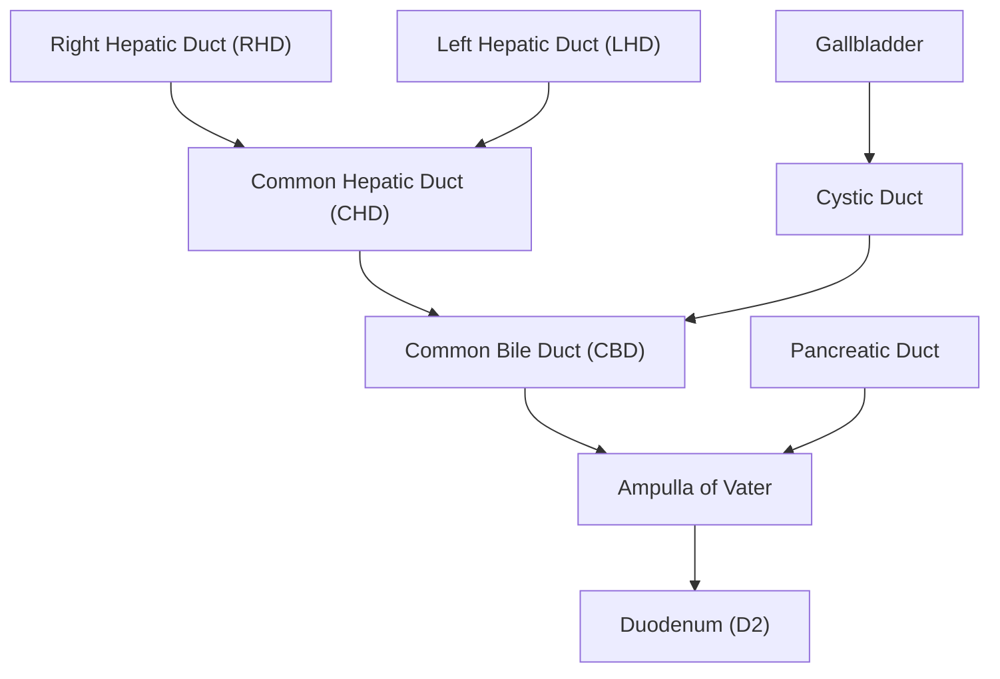
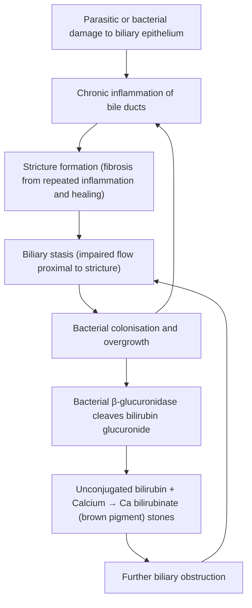

## Definition

Recurrent Pyogenic Cholangitis (RPC) is a chronic biliary disease characterised by **recurrent bouts of bacterial cholangitis** arising from **de novo formation of intrahepatic pigment stones** within a biliary tree that is progressively damaged by **stricturing and dilatation** [1][2]. The name tells you everything:

- **Recurrent** = episodic, comes back again and again
- **Pyogenic** = "pyo" (pus) + "genic" (producing) — pus-forming bacterial infection
- **Cholangitis** = "chol" (bile) + "ang" (vessel) + "itis" (inflammation) — inflammation of the bile ducts

It is also historically known as **_"Hong Kong disease"_**, **oriental cholangiohepatitis**, **biliary obstruction syndrome of the Chinese**, reflecting its strong geographic predilection for Southeast Asia [1][2].

<Callout title="Key Distinguishing Concept">
  RPC is fundamentally different from the more common Western pattern of
  gallstone disease. In typical gallstone disease, cholesterol stones form in
  the **gallbladder** and may migrate into the CBD. In RPC, **brown pigment
  (calcium bilirubinate) stones form de novo within the intrahepatic bile
  ducts** — the gallbladder is often a bystander. This distinction is critical
  for understanding the pathophysiology, clinical approach, and surgical
  management [1][2].
</Callout>

---

## Epidemiology

| Feature                   | Detail                                                                                                                                                                                                    |
| ------------------------- | --------------------------------------------------------------------------------------------------------------------------------------------------------------------------------------------------------- |
| Geographic distribution   | **_Southeast Asia_** — Hong Kong, Southern China, Taiwan, Korea, Japan, Vietnam; rare in Western countries [1][2]                                                                                         |
| Sex ratio                 | Equal frequency in males and females [1]                                                                                                                                                                  |
| Peak age                  | **_30–40 years_** (middle-age onset) [1][2]                                                                                                                                                               |
| Socioeconomic association | Historically linked to lower socioeconomic status, poor sanitation, and dietary factors (raw freshwater fish consumption); incidence declining with improved hygiene but still prevalent in Hong Kong [2] |
| Trend                     | Decreasing incidence in younger generations due to improved nutrition, sanitation, and public health measures; however, established cases in older patients continue to present                           |

> The disease earned the moniker "Hong Kong disease" because of its striking prevalence in Hong Kong and southern China. Any middle-aged patient from Southeast Asia presenting with recurrent cholangitis and intrahepatic stones should have RPC high on the differential.

---

## Risk Factors

Understanding the risk factors requires understanding the two "hits" needed for RPC: something that **damages the biliary epithelium** and something that **promotes biliary stasis and stone formation**.

| Risk Factor                                       | Mechanism                                                                                                                    |
| ------------------------------------------------- | ---------------------------------------------------------------------------------------------------------------------------- |
| **_Parasitic infestation (Clonorchis sinensis)_** | Flukes inhabit biliary tree → chronic epithelial damage → stricture formation → stasis → stone formation [1][2][3]           |
| **Low socioeconomic status / malnutrition**       | Low-protein diet → relative enzyme deficiency → altered bile composition → promotes unconjugated bilirubin precipitation [2] |
| **Poor sanitation**                               | Faecal-oral transmission of parasites; consumption of raw/undercooked freshwater fish [2][3]                                 |
| **Previous biliary instrumentation**              | ERCP, sphincterotomy, stenting → disruption of Sphincter of Oddi barrier → ascending bacterial colonisation [1]              |
| **Biliary anomalies**                             | Choledochal cysts, Caroli's disease → congenital biliary stasis → predisposition to stone formation and infection [1]        |

---

## Anatomy and Function — The Biliary Tree

To understand RPC you must understand the biliary tree's anatomy and its normal defence mechanisms, because RPC systematically destroys both.

### Biliary Anatomy

- **Intrahepatic ducts**: Small peripheral ducts → segmental ducts → sectoral ducts → right and left hepatic ducts
- **Extrahepatic ducts**: Common hepatic duct (CHD) → joined by cystic duct → common bile duct (CBD) → ampulla of Vater → duodenum
- **Sphincter of Oddi**: Muscular valve at the ampulla that controls bile flow into the duodenum and **prevents duodenal reflux** — this is critical for understanding ascending infection

### Normal Biliary Defence Mechanisms [1]

The bile duct is NOT a sterile pipe — it has active defences:

1. **Continuous flushing action of bile flow** — laminar flow physically washes bacteria downstream
2. **Bacteriostatic activity of bile salts** — bile salts are detergents that disrupt bacterial cell membranes
3. **Biliary mucous and secretory IgA** — act as anti-adherence factors preventing bacterial colonisation of epithelium
4. **Sphincter of Oddi** — acts as a mechanical barrier to duodenal reflux and ascending bacterial infection

In RPC, **all four mechanisms are compromised**: strictures impede flow (loss of flushing), altered bile composition reduces bacteriostatic activity, chronic inflammation damages the mucosa (loss of IgA), and repeated instrumentation may disrupt the sphincter.

<Callout title="Why the Left Lobe?" type="idea">
  RPC has a striking ***predilection for the left intrahepatic ducts*** [2].
  Why? The left hepatic duct has a more acute angle of drainage and a longer
  intrahepatic course compared to the right. This anatomy promotes relative
  stasis in the left system, making it more susceptible to stone formation and
  stricturing. Additionally, the left duct is more prone to compression at the
  umbilical fissure. This is why, in advanced disease, **left hepatic lobe
  atrophy** is commonly seen on CT.
</Callout>

---

## Etiology

### 1. Parasitic Infection (The Historical "First Hit")

**_Parasitic infestation is considered the initiating event in many cases of RPC_**, particularly in endemic areas [1][2][3].

#### Liver Flukes (Trematodes)

| Parasite                                        | Transmission                                                            | Pathological Mechanism                                                                                                                                                                      |
| ----------------------------------------------- | ----------------------------------------------------------------------- | ------------------------------------------------------------------------------------------------------------------------------------------------------------------------------------------- |
| **_Clonorchis sinensis_** (Chinese liver fluke) | Consumption of **_raw or undercooked freshwater fish_** (淡水魚) [2][3] | Adult flukes inhabit biliary tract → mechanical damage to biliary epithelium → chronic inflammation → stricture formation → eggs deposited in bile ducts serve as nidus for stone formation |
| **_Opisthorchis viverrini_**                    | Raw freshwater fish (mainly Thailand/Laos)                              | Same mechanism as above                                                                                                                                                                     |
| **_Fasciola hepatica_**                         | Contaminated watercress/water plants                                    | Migrates through liver parenchyma → biliary tract inflammation                                                                                                                              |

**Life cycle of _Clonorchis sinensis_** (relevant for understanding pathogenesis) [3]:

1. **Humans** = definitive host; adult flukes reside in biliary tract
2. Embryonated **eggs passed in faeces** into freshwater
3. Eggs ingested by **freshwater snail** (first intermediate host)
4. Cercariae released → penetrate **freshwater fish** (second intermediate host) → encysted metacercariae in fish flesh
5. Humans consume raw/undercooked fish → metacercariae excyst in duodenum → migrate up through ampulla of Vater into bile ducts → mature into adults

#### Roundworms

| Parasite                   | Mechanism                                                                                                                   |
| -------------------------- | --------------------------------------------------------------------------------------------------------------------------- |
| **_Ascaris lumbricoides_** | Adult worms can migrate into CBD through ampulla → mechanical obstruction → dead worm/eggs become nidus for stone formation |

### 2. Bacterial Infection (The "Second Hit" and Perpetuator)

Once biliary stasis and epithelial damage are established, **bacterial colonisation** drives the ongoing cycle of stone formation and recurrent cholangitis [1][2].

**Common organisms:**

| Category                                  | Organisms                                                                                   |
| ----------------------------------------- | ------------------------------------------------------------------------------------------- |
| **_Gram-negative bacilli_** (predominant) | **_Escherichia coli_**, **_Klebsiella_** sp., Proteus sp., **_Pseudomonas aeruginosa_** [1] |
| **_Anaerobes_**                           | Bacteroides fragilis, Clostridium sp. [1]                                                   |
| Gram-positive                             | Enterococcus sp.                                                                            |

> Why gram-negatives? Because these are gut organisms. The infection is **ascending** — bacteria reflux from the duodenum into the biliary tree, especially when the sphincter of Oddi is compromised or when there is stasis.

### 3. Dietary / Nutritional Factors

**_Low-protein diet_** (historically prevalent in Southeast Asian populations) → relative deficiency of glucuronidase inhibitors → allows bacterial β-glucuronidase to act unopposed → promotes deconjugation of bilirubin → unconjugated bilirubin precipitates with calcium → **brown pigment stone formation** [2].

---

## Pathophysiology

This is the crux of understanding RPC. The disease follows a **self-perpetuating vicious cycle** of **_Stasis + Stricturing + Recurrent infection_** [1][2].

### The Vicious Cycle of RPC

### Step-by-Step Pathophysiology

**Step 1 — Initiating Event: Epithelial Damage**

- Parasitic infestation (Clonorchis sinensis) or bacterial infection damages the biliary epithelium
- The damaged epithelium triggers an inflammatory cascade

**Step 2 — Stricture Formation**

- Repeated cycles of inflammation → healing → fibrosis
- Fibrotic strictures develop, predominantly in the **_small intrahepatic ducts_** (small ducts are more affected than large ducts) [1]
- Strictures narrow the duct lumen → obstruction to bile flow

**Step 3 — Biliary Stasis**

- Bile cannot flow past the strictures efficiently
- Stagnant bile loses its normal flushing action → bacteria are not cleared

**Step 4 — Bacterial Colonisation and Stone Formation**

- Bacteria (especially E. coli, Klebsiella) produce the enzyme **β-glucuronidase**
- β-glucuronidase hydrolyses **conjugated bilirubin (bilirubin diglucuronide)** in bile back to **unconjugated bilirubin**
- Unconjugated bilirubin is **insoluble** and complexes with **calcium ions** → precipitation as **calcium bilirubinate**
- These aggregates, combined with bacterial cell bodies and cellular debris, form **brown pigment stones**
- Stones contain bacterial cell bodies embedded within them — this is why they are inherently **infected stones**

**Step 5 — Further Obstruction and Recurrence**

- Stones cause additional obstruction → more stasis → more infection → more stones → more strictures
- The cycle is self-perpetuating and progressive

<Callout title="Why Brown Pigment Stones, Not Cholesterol Stones?" type="idea">
  In Western gallstone disease, the problem is cholesterol supersaturation in
  bile → cholesterol stones form in the gallbladder. In RPC, the problem is
  bacterial enzymatic deconjugation of bilirubin → calcium bilirubinate
  precipitates → brown pigment stones form de novo within the bile ducts. The
  stones are **soft, earthy, crumbly** (because they contain bacterial debris),
  in contrast to hard cholesterol stones. They are also **radio-opaque**
  (contain calcium) versus cholesterol stones which are radiolucent [2][4].
</Callout>

### Brown Pigment Stone Formation — Biochemistry

$$
\text{Conjugated bilirubin (soluble)} \xrightarrow{\text{bacterial } \beta\text{-glucuronidase}} \text{Unconjugated bilirubin (insoluble)} + \text{Glucuronic acid}
$$

$$
\text{Unconjugated bilirubin} + \text{Ca}^{2+} \rightarrow \text{Calcium bilirubinate (precipitate)} \rightarrow \text{Brown pigment stone}
$$

### Comparison: RPC vs Western Gallstone Disease

| Feature                     | RPC                                                 | Western Gallstone Disease                         |
| --------------------------- | --------------------------------------------------- | ------------------------------------------------- |
| **Stone location**          | **_Intrahepatic bile ducts_** (de novo)             | Gallbladder (may migrate to CBD)                  |
| **Stone type**              | **_Brown pigment / Ca bilirubinate_**               | Cholesterol (85%)                                 |
| **Stone composition**       | Unconjugated bilirubin + calcium + bacterial debris | Cholesterol crystals                              |
| **Pathogenic mechanism**    | Bacterial β-glucuronidase                           | Cholesterol supersaturation                       |
| **Radiodensity**            | **_Radio-opaque_**                                  | Radiolucent (80%)                                 |
| **Gallbladder involvement** | Usually spared (gallbladder is a bystander)         | Primary site                                      |
| **Biliary strictures**      | Present (part of the disease)                       | Not typical                                       |
| **Geographic distribution** | Southeast Asia                                      | Western countries                                 |
| **Sex predilection**        | Equal M:F                                           | Female predominance (Fat, Female, Forty, Fertile) |

---

## Classification

RPC can be classified by several schemes:

### 1. By Anatomical Distribution

| Pattern                      | Description                                               | Significance                                                   |
| ---------------------------- | --------------------------------------------------------- | -------------------------------------------------------------- |
| **_Left-sided predominant_** | Stones and strictures mainly in left hepatic duct system  | Most common pattern; left lobe atrophy frequently develops [2] |
| Right-sided predominant      | Stones and strictures mainly in right hepatic duct system | Less common                                                    |
| Bilateral                    | Both left and right systems involved                      | More advanced disease; surgical options more limited           |
| Extrahepatic involvement     | CBD stones and strictures (often secondary)               | May coexist with intrahepatic disease                          |

### 2. By Disease Stage / Severity

| Stage                  | Features                                                              |
| ---------------------- | --------------------------------------------------------------------- |
| Early                  | Recurrent cholangitis episodes, intrahepatic stones, mild stricturing |
| Established            | Multiple strictures, segmental/lobar atrophy, recurrent sepsis        |
| Advanced / Complicated | Cirrhosis (secondary biliary), liver abscess, cholangiocarcinoma      |

### 3. By Complications

| Complication Category | Examples                                                          |
| --------------------- | ----------------------------------------------------------------- |
| Acute infectious      | Biliary sepsis, liver abscess, pyogenic cholangitis               |
| Chronic structural    | Secondary biliary cirrhosis, hepatic atrophy, portal hypertension |
| Neoplastic            | **_Cholangiocarcinoma_** (major long-term concern) [1][3][5]      |

---

## Clinical Features

The clinical presentation of RPC reflects the underlying cycle of biliary obstruction and infection.

### Typical Clinical Pattern [2]

- **Middle-aged patient** (30–40 years) from Southeast Asia
- **_Recurrent episodes of acute cholangitis_** — typically **1–2 episodes per year** [2]
- Between episodes, patients may be relatively well
- Progressive deterioration over years with accumulating strictures, atrophy, and complications

### Symptoms

| Symptom                                                 | Pathophysiological Basis                                                                                                                                                                                                                                                                                               |
| ------------------------------------------------------- | ---------------------------------------------------------------------------------------------------------------------------------------------------------------------------------------------------------------------------------------------------------------------------------------------------------------------- |
| **_Fever_** (with or without chills and rigors) [1]     | Bacterial infection of bile → endotoxin and bacterial products enter bloodstream → systemic inflammatory response (SIRS) → fever via IL-1, IL-6, TNF-α acting on hypothalamic thermoregulatory centre                                                                                                                  |
| **_Right upper quadrant (RUQ) or epigastric pain_** [1] | Biliary obstruction → ductal distension proximal to stone/stricture → stretching of the biliary epithelium and periductal tissues → visceral pain referred to the RUQ/epigastrium via T7-T9 splanchnic afferents. Unlike biliary colic (which is intermittent), RPC pain may be more sustained due to active infection |
| **_Jaundice_** [1]                                      | Obstruction of bile ducts → impaired excretion of conjugated bilirubin → reflux into bloodstream → conjugated hyperbilirubinaemia → yellow sclera and skin. Degree depends on level and completeness of obstruction                                                                                                    |
| **Pruritus**                                            | Retained bile salts deposited in skin → stimulation of cutaneous nerve endings. More prominent with prolonged obstruction                                                                                                                                                                                              |
| **Dark urine (tea-coloured)**                           | Conjugated bilirubin is water-soluble → filtered by kidneys → bilirubinuria → dark urine                                                                                                                                                                                                                               |
| **Pale/clay-coloured stools (acholic)**                 | No bilirubin reaching the gut → no stercobilinogen production → pale stools                                                                                                                                                                                                                                            |
| **Malaise, anorexia, weight loss**                      | Chronic infection, recurrent sepsis, and malabsorption of fat-soluble vitamins (A, D, E, K) due to impaired bile flow                                                                                                                                                                                                  |
| **Nausea and vomiting**                                 | Visceral irritation from biliary inflammation; may be exacerbated by associated pancreatitis                                                                                                                                                                                                                           |

### Signs

| Sign                                                                   | Pathophysiological Basis                                                                                                                                                                                                                                                              |
| ---------------------------------------------------------------------- | ------------------------------------------------------------------------------------------------------------------------------------------------------------------------------------------------------------------------------------------------------------------------------------- |
| **_Charcot's triad_** **(Fever + RUQ pain + Jaundice)**                | The classic triad of acute cholangitis — present in majority of RPC flares. Fever = infection; pain = obstruction/distension; jaundice = biliary obstruction [1][2]                                                                                                                   |
| **Reynold's pentad** (Charcot's triad + shock + altered mental status) | Indicates **suppurative cholangitis / biliary sepsis** — bacteria and endotoxin overwhelm host defences → septic shock (hypotension) + encephalopathy. This is a surgical emergency < 10% of presentations [2]                                                                        |
| **RUQ tenderness**                                                     | Periductal and hepatic capsular inflammation → localised tenderness on palpation                                                                                                                                                                                                      |
| **Hepatomegaly**                                                       | Biliary obstruction → intrahepatic ductal dilatation → liver swelling; chronic disease → regenerative nodular hyperplasia                                                                                                                                                             |
| **_Palpable gallbladder_** **(exception to Courvoisier's law)** [4]    | In RPC, the essential pathology is in the **bile ducts, not the gallbladder**. The gallbladder itself does not undergo chronic cholecystitis → it is NOT fibrosed → it CAN distend when the CBD is obstructed. This is why RPC is a **classic exception to Courvoisier's law** [1][4] |
| **Jaundice** (icterus)                                                 | Yellow discolouration of sclera (best detected in natural light) and skin; indicates bilirubin > 34 μmol/L (approximately 2 mg/dL)                                                                                                                                                    |
| **Excoriations**                                                       | Secondary to pruritus from bile salt deposition in skin                                                                                                                                                                                                                               |
| **Signs of chronic liver disease** (in advanced cases)                 | Spider naevi, palmar erythema, ascites, splenomegaly — develop if secondary biliary cirrhosis has occurred from chronic obstruction                                                                                                                                                   |

<Callout title="Courvoisier's Law and RPC — A Classic Exception" type="error">
  **Courvoisier's Law** states: *"In painless obstructive jaundice, if the
  gallbladder is palpable, the cause is unlikely to be gallstones"* [4]. The
  reasoning is that chronic gallstones → repeated cholecystitis → fibrosed,
  contracted gallbladder → cannot distend. In **RPC**, however: - The pathology
  is in the **bile ducts** (not gallbladder) - The gallbladder has **NOT**
  undergone chronic cholecystitis - Therefore the gallbladder **CAN distend**
  when the CBD is obstructed - RPC is one of three classic exceptions to
  Courvoisier's law: 1. **Double impaction** (stone in CBD + stone in cystic
  duct) 2. **Mirizzi syndrome** 3. ***Recurrent pyogenic cholangitis (RPC)***
  [1][4]
</Callout>

### Complications (Overview — will be covered in detail later)

| Category               | Complications                                            | Mechanism                                                                                                                            |
| ---------------------- | -------------------------------------------------------- | ------------------------------------------------------------------------------------------------------------------------------------ |
| **Acute infectious**   | **_Biliary sepsis_**, **_liver abscess_**                | Infected bile → bacteraemia → sepsis; walled-off intrahepatic infection                                                              |
| **Pancreatitis**       | **_Acute biliary pancreatitis_**                         | Stone/sludge impaction at ampulla → pancreatic duct obstruction                                                                      |
| **Chronic structural** | **_Secondary biliary cirrhosis_**, **_hepatic atrophy_** | Chronic obstruction → cholestasis → progressive fibrosis; chronic inflammation → parenchymal loss with compensatory atrophy [2]      |
| **Fistula**            | Biliary-enteric fistula                                  | Chronic inflammation eroding through duct wall into adjacent bowel                                                                   |
| **_Neoplastic_**       | **_Cholangiocarcinoma_**                                 | Chronic inflammation → dysplasia-carcinoma sequence; chronic biliary stasis → prolonged exposure to carcinogens in bile [1][2][3][5] |

<Callout title="The Cholangiocarcinoma Risk">
  ***RPC is a well-established risk factor for cholangiocarcinoma*** [3][5]. The
  mechanism is a chronic inflammation-driven **dysplasia → carcinoma sequence**
  — analogous to how ulcerative colitis predisposes to colorectal cancer. The
  ***association with cholangiocarcinoma is common in Orientals*** while
  ***PSC-associated cholangiocarcinoma is more common in Western populations***
  [5]. Any patient with RPC who develops worsening obstructive symptoms, new
  weight loss, or rising CA 19-9 should be evaluated for superimposed
  malignancy.
</Callout>

---

## Clonorchis sinensis — Focused Discussion

Given its central role in RPC pathogenesis, Clonorchis sinensis deserves special attention [3]:

| Feature                  | Detail                                                                                                                                           |
| ------------------------ | ------------------------------------------------------------------------------------------------------------------------------------------------ |
| Common name              | Chinese liver fluke                                                                                                                              |
| Definitive host          | Humans                                                                                                                                           |
| First intermediate host  | Freshwater snail                                                                                                                                 |
| Second intermediate host | **_Freshwater fish_**                                                                                                                            |
| Transmission             | **_Consumption of raw/undercooked freshwater fish_** (淡水魚)                                                                                    |
| Adult habitat            | Biliary tract (intrahepatic bile ducts)                                                                                                          |
| Eggs                     | Passed in faeces; embryonated                                                                                                                    |
| **Clinical spectrum**    | Asymptomatic → acute cholangitis → **_RPC_** → **_increased risk of cholangiocarcinoma_** [3]                                                    |
| Diagnosis                | **Stool microscopy** for eggs, **duodenal aspirate** for eggs, **USG** for adult flukes, **intraoperative choledochoscopy** for adult flukes [3] |
| Treatment                | **_Praziquantel 25 mg/kg PO TDS × 1 day_** [3]                                                                                                   |

> Praziquantel works by increasing cell membrane permeability to calcium in the parasite → tetanic muscle contraction → paralysis and death of the fluke. It is the drug of choice for all trematode infections.

---

## Relevance to Hong Kong

RPC remains highly relevant to clinical practice in Hong Kong:

1. **Historical burden**: Hong Kong was historically one of the highest-prevalence areas, hence the name "Hong Kong disease"
2. **Current epidemiology**: While incidence is declining due to improved sanitation and nutrition, established cases continue to present, particularly in older patients
3. **Dietary practices**: Consumption of raw freshwater fish (sashimi, congee with raw fish) persists in some communities
4. **_Association with cholangiocarcinoma_** — long-term surveillance is essential
5. **Surgical expertise**: HKU and other Hong Kong centres have extensive experience in hepatobiliary surgery for RPC, including hepatic resection with biliary-enteric anastomosis

---

> **Key Concepts to Remember Before Moving to DDx/Diagnosis/Management:**
>
> - RPC = intrahepatic pigment stones + strictures + recurrent cholangitis
> - Vicious cycle: stasis → infection → stone formation → more obstruction → more stasis
> - Left lobe predilection
> - Brown pigment stones (NOT cholesterol)
> - Exception to Courvoisier's law
> - Long-term risk of cholangiocarcinoma
> - Clonorchis sinensis is the key parasitic trigger in Hong Kong

---

<Callout title="High Yield Summary">

1. **Definition**: RPC = recurrent bacterial cholangitis + **intrahepatic pigment stone** formation + **intrahepatic biliary strictures**; also called "Hong Kong disease"

2. **Epidemiology**: Southeast Asia, equal M:F, peak 30–40 years

3. **Pathophysiology — Vicious Cycle**: Parasitic/bacterial damage → strictures → stasis → bacterial β-glucuronidase deconjugates bilirubin → Ca bilirubinate (brown pigment) stones → further obstruction → recurrent infection

4. **Key Differences from Western Gallstone Disease**: Stones form de novo in **intrahepatic ducts** (not gallbladder); composed of **brown pigment** (not cholesterol); **radio-opaque** (not radiolucent)

5. **Left lobe predilection** — due to anatomical factors promoting stasis

6. **Clinical Features**: **_Charcot's triad_** (fever + RUQ pain + jaundice); 1–2 episodes/year; Reynold's pentad if severe sepsis

7. **Exception to Courvoisier's Law**: Gallbladder NOT fibrosed (pathology is in ducts) → CAN distend

8. **Clonorchis sinensis**: Chinese liver fluke, transmitted by raw freshwater fish, initiates epithelial damage; treated with **praziquantel**

9. **Major Long-term Complications**: Secondary biliary cirrhosis, hepatic atrophy, **cholangiocarcinoma**

10. **Organisms**: E. coli, Klebsiella, Pseudomonas (gram-negatives); anaerobes; Enterococcus

</Callout>

---

<ActiveRecallQuiz
  title="Active Recall - Recurrent Pyogenic Cholangitis"
  items={[
    {
      question:
        "What is the fundamental difference between stone formation in RPC versus Western gallstone disease? Explain the mechanism of stone formation in RPC.",
      markscheme:
        "RPC: stones form de novo in intrahepatic bile ducts (not gallbladder); composed of brown pigment (calcium bilirubinate), not cholesterol. Mechanism: bacterial beta-glucuronidase deconjugates bilirubin glucuronide to unconjugated bilirubin, which is insoluble and complexes with calcium to form calcium bilirubinate stones.",
    },
    {
      question:
        "Describe the vicious cycle of pathogenesis in RPC using three key components.",
      markscheme:
        "Stasis + Stricturing + Recurrent infection. Parasitic or bacterial damage causes epithelial injury and stricture formation (fibrosis from repeated inflammation-healing). Strictures cause biliary stasis, promoting bacterial colonisation and beta-glucuronidase-mediated stone formation. Stones cause further obstruction, perpetuating the cycle.",
    },
    {
      question: "Why is RPC a classic exception to Courvoisier's Law?",
      markscheme:
        "Courvoisier's Law states palpable gallbladder in painless jaundice is unlikely due to gallstones (because chronic cholecystitis fibroses the gallbladder). In RPC, pathology is in bile ducts, not gallbladder. The gallbladder has not undergone chronic cholecystitis, is not fibrosed, and therefore CAN distend when CBD is obstructed.",
    },
    {
      question:
        "Name the parasitic organism most commonly implicated in RPC in Hong Kong, its transmission route, and the recommended treatment.",
      markscheme:
        "Clonorchis sinensis (Chinese liver fluke). Transmission: consumption of raw or undercooked freshwater fish. Treatment: Praziquantel 25 mg/kg PO TDS for 1 day.",
    },
    {
      question: "Why does RPC have a predilection for the left hepatic lobe?",
      markscheme:
        "The left hepatic duct has a more acute angle of drainage and a longer intrahepatic course compared to the right, promoting relative biliary stasis. This makes the left system more susceptible to stone formation and stricturing, leading to left lobe atrophy in advanced disease.",
    },
    {
      question:
        "What are the three major categories of long-term complications of RPC?",
      markscheme:
        "1. Chronic structural: secondary biliary cirrhosis, hepatic atrophy. 2. Acute infectious: biliary sepsis, liver abscess, pancreatitis. 3. Neoplastic: cholangiocarcinoma (chronic inflammation-driven dysplasia-carcinoma sequence).",
    },
  ]}
/>

---

## References

[1] Senior notes: felixlai.md (Recurrent pyogenic cholangitis section, pp. 526–528)
[2] Senior notes: maxim.md (Recurrent pyogenic cholangitis section, pp. 136–137)
[3] Senior notes: maxim.md (Clonorchis sinensis infection section, p. 138)
[4] Senior notes: felixlai.md (Courvoisier's law section, p. 568); maxim.md (Courvoisier's Law note, p. 130)
[5] Lecture slides: WCS 064 - A large liver - by Prof R Poon [20191108].doc.pdf (p. 5, Cholangiocarcinoma — association with RPC in Orientals)
