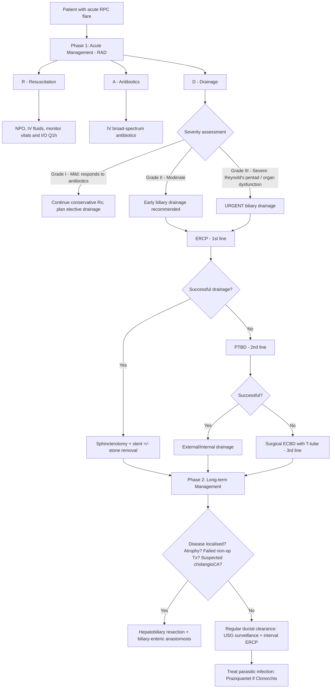

## Management of Recurrent Pyogenic Cholangitis

The management of RPC must be understood in two distinct phases, because the disease has two faces:

1. **Acute phase**: Treat the cholangitis flare — this is an emergency
2. **Long-term phase**: Break the vicious cycle of stasis → infection → stones → strictures → more stasis — this requires definitive intervention

The fundamental principle is that you **cannot cure RPC with antibiotics alone**. Why? Because the underlying problem is **mechanical** — strictures and stones cause obstruction and stasis, and antibiotics cannot clear stones or open strictures. Furthermore, ***excretion of antibiotics is impaired in biliary obstruction*** [15][16] — the very antibiotics you give cannot reach therapeutic concentrations in the obstructed bile, making ***biliary drainage mandatory*** [16].

---

## Management Algorithm — Overview

---

## Phase 1: Acute Management — "RAD"

The mnemonic ***RAD*** captures the three pillars of acute cholangitis management [7]:

> ***R = Resuscitation, A = Antibiotics, D = Drainage*** — ***must know!*** [7]

### 1. Resuscitation

| Component | Detail | Rationale |
|---|---|---|
| ***NPO (Nil per os)*** | Keep patient fasting | Reduces biliary stimulation (CCK release → gallbladder contraction → increased biliary pressure); prepares for potential emergency ERCP |
| ***IV fluids*** | Aggressive crystalloid resuscitation (e.g., Ringer's lactate / normal saline) | Biliary sepsis → vasodilatation + third-spacing → intravascular volume depletion → organ hypoperfusion. Fluids restore circulating volume |
| ***Monitor vitals and I/O Q1h*** [7] | Continuous monitoring of temperature, pulse, BP, consciousness level, urine output [6] | Detects signs of **failure of conservative treatment**: ↑ temperature/pulse, ↓ BP/consciousness/urine output, increased abdominal tenderness and guarding [6] |
| **Correct coagulopathy** | IV Vitamin K (phytomenadione 10 mg slow IV) | Obstructive jaundice → impaired fat-soluble vitamin absorption → Vitamin K deficiency → coagulopathy. Must correct before any invasive procedure |

<Callout title="Why Monitor So Closely?">
***15% of patients will NOT respond to antibiotics*** and will require emergency biliary decompression [6]. You need to catch this deterioration early. The signs of failure include rising temperature, tachycardia, falling BP, falling urine output, worsening tenderness, and altered consciousness — essentially progression towards Reynold's pentad.
</Callout>

### 2. Antibiotics

#### Principles of Antibiotic Selection

The empirical regimen must cover the organisms that cause RPC cholangitis: **Gram-negative aerobes** (E. coli, Klebsiella, Pseudomonas) **and anaerobes** (Bacteroides) [1][6].

Why not just one antibiotic? Because the bile duct in RPC harbours a polymicrobial environment, and inadequate coverage leads to treatment failure and fulminant sepsis.

#### Empirical Antibiotic Regimens

| Regimen | Coverage | When to Use |
|---|---|---|
| ***IV Cefuroxime + Metronidazole*** [15] | Cefuroxime: Gram-negative aerobes; Metronidazole: anaerobes | Standard HK regimen for mild–moderate disease |
| ***IV Piperacillin-Tazobactam (Tazocin)*** [7][15] | Broad-spectrum: Gram-negatives including Pseudomonas + anaerobes | ***Severe disease*** or Reynold's pentad |
| IV Ampicillin-Sulbactam (Augmentin) | Gram-negatives + anaerobes | ***Mild disease*** [7] |
| IV Metronidazole + 3rd-gen cephalosporin (e.g., Ceftriaxone) [6] | Ceftriaxone: Gram-negatives; Metronidazole: anaerobes | Alternative regimen |
| IV Metronidazole + Fluoroquinolone (e.g., Ciprofloxacin/Levofloxacin) [6] | Fluoroquinolone: Gram-negatives; Metronidazole: anaerobes | Penicillin allergy |

**Duration**: Typically ***7 days*** of IV antibiotics [7], then step down to oral based on culture and sensitivity results.

<Callout title="Why Antibiotics Alone Are Not Enough">
***Biliary obstruction impairs the excretion of antibiotics into bile*** [16]. Normal biliary pressure is 7–14 cm H₂O. When pressure rises > 25 cm H₂O (due to obstruction), ***bacteria reflux into hepatic veins and lymphatics → bacteraemia and septic shock*** [16]. Even high-dose IV antibiotics cannot achieve adequate biliary concentrations when the duct is obstructed. This is why ***biliary drainage is mandatory*** [16] — you must physically decompress the system.
</Callout>

#### Targeted Antibiotic Therapy
- Adjust based on ***blood/bile culture and sensitivity*** results
- If ***Clonorchis sinensis*** identified on stool O&P: add ***praziquantel 25 mg/kg PO TDS × 1 day*** [3]

### 3. Drainage — The Critical Step

***Biliary drainage is the definitive acute intervention*** — it addresses the mechanical obstruction that antibiotics cannot fix [16].

#### Indications for Urgent Drainage [7]

- ***Reynold's pentad*** (Charcot's triad + shock + altered mental status)
- ***Not responding to antibiotics for 24 hours*** [7]
  - Why 24 hours? Because obstruction impairs antibiotic secretion into bile — if there's no improvement in 24h, it means the obstruction is not resolving spontaneously and drainage is mandatory

#### Drainage Modalities — Stepwise Escalation

The QMH (Queen Mary Hospital) stepwise approach [6]:

> ***QMH practice: ERCP → PTBD → ECBD*** [6]

---

#### 3A. ERCP — First-Line Drainage

***ERCP is the first-line approach for biliary drainage in acute cholangitis*** [6][7][15].

| Aspect | Detail |
|---|---|
| **Procedure** | Endoscope to D2 → cannulate ampulla → aspirate bile/pus → inject contrast → visualise obstruction → intervene |
| ***Role in acute setting*** | ***Biliary drainage and decompression in unstable patients — NOT stone removal*** [7] |
| **Step 1** | ***Aspirate bile duct*** to remove bile and pus → decompress → reduces risk of bacteraemia during contrast injection [7] |
| **Step 2** | Inject contrast → delineate anatomy |
| **Step 3** | Place ***plastic stent*** (temporary, requires scheduled change) with or without ***sphincterotomy*** [7] |
| **Step 4** | ***Remove stone now or interval ERCP*** after sepsis resolves [7] |
| **Mortality** | ***< 5%*** [7] |

##### ERCP Procedures in Detail

**a) Endoscopic Sphincterotomy** [6]

- **What**: Electrocautery incision through the musculature of the biliary portion of the Sphincter of Oddi
- **Why**: Eliminates the principal anatomic barrier impeding stone passage; facilitates stone extraction; allows future access
- **Complications**:
  - ***Short-term***: Acute pancreatitis, ***perforation*** (intraperitoneal or retroperitoneal), bleeding from papillotomy, infection [6][15]
    - ***Intraperitoneal perforation***: Perforate the duodenum → free gas under diaphragm on CXR → **requires operative treatment** (will not seal spontaneously) [6]
    - ***Retroperitoneal perforation***: Perforate the bile duct when cutting the ampulla (retroperitoneal portion of D2) → **no free gas** under diaphragm → retroperitoneal gas may be present → **conservative treatment** (will seal spontaneously) [6]
  - ***Long-term***: Acute cholangitis recurrence, stone recurrence, papillary stenosis [6]

**b) Stricture Balloon Dilatation** [1]

- Balloon inflated across stricture to widen the lumen
- Important in RPC because strictures are the primary mechanical problem

**c) Biliary Stent Placement** [1]

- ***Plastic stent*** (temporary) — requires scheduled exchange (every 3 months typically, as plastic stents occlude with biofilm/sludge)
- Purpose: maintains biliary drainage through the strictured segment
- ***Initial biliary decompression is achieved by ERCP with sphincterotomy, stricture dilatation and placement of biliary endoprosthesis (stent) often required*** [1]

**d) Stone Extraction Methods** [15]

| Method | Description |
|---|---|
| **Wire basket** (Dormia basket) | Wire cage deployed around stone → trapped → extracted through sphincterotomy |
| **Stone extraction balloon** | Balloon inflated above stone → swept downward through sphincterotomy |
| **Mechanical lithotripsy** | For large stones → mechanical crushing within the duct |

##### Challenges of ERCP in RPC [1]

***Endoscopic intervention is challenging due to multiple intrahepatic and extrahepatic stones as well as stricturing*** [1]. Key issues:
- ERCP accesses from below (retrograde) → **limited access to intrahepatic ducts** above tight strictures
- ***ERCP difficult to access intrahepatic drainage*** [2] — the disease in RPC is predominantly intrahepatic
- Multiple strictures may prevent passage of the scope or instruments
- ***Patients in whom adequate drainage cannot be achieved during ERCP will require percutaneous or surgical drainage*** [1]

##### Relative Contraindications for ERCP [15]

***Altered GI anatomy e.g. Billroth II gastrectomy, Roux-en-Y*** [15] — the altered anatomy makes cannulation of the ampulla technically very difficult or impossible.

---

#### 3B. PTBD — Second-Line Drainage

***PTBD is indicated when ERCP is unsuccessful, unavailable, or contraindicated*** [6][7].

| Aspect | Detail |
|---|---|
| **Technique** | Percutaneous needle through liver parenchyma → puncture dilated intrahepatic duct under USG/fluoroscopic guidance → confirm position with contrast → insert guidewire → catheter placement [6] |
| **Access route** | Usually via ***left hepatic duct*** (preferred — subcostal approach is less painful than intercostal for right duct; less likely to transgress pleural space) or right hepatic duct; can also access through gallbladder puncture [6] |
| ***Key advantage for RPC*** | ***Transhepatic insertion directly into intrahepatic bile ducts*** — directly accesses the intrahepatic disease that ERCP cannot reach [7] |
| **Therapeutic capabilities** | Drainage of infected bile; extraction of biliary stones; dilatation of benign strictures; stent placement across strictures [6] |
| ***Efficacy*** | ***Similar efficacy and rate of complications as ERCP*** [7] |
| **Output monitoring** | ***Easy output monitoring — external drainage*** [7], but can be internalised later (external-internal PTBD) |
| **Complications** | ***Bacteraemia*** (antibiotic prophylaxis required); ***haemobilia*** (puncture of hepatic artery or portal vein); bile leak; pneumothorax [6][14] |
| **Disadvantages** | ***Risk of fluid and electrolyte loss*** (external bile drainage) [7]; patient discomfort from external catheter; requires patent intrahepatic duct dilatation for safe access |

> The reason PTBD is particularly useful in RPC compared to simple choledocholithiasis is that the disease is in the **intrahepatic ducts**, and PTBD goes directly to the problem. ERCP approaches from below and is limited by strictures blocking retrograde access.

---

#### 3C. Surgical Drainage — Third-Line (Last Resort)

***Surgical drainage for acute cholangitis is reserved for patients in whom other methods of biliary drainage cannot be performed or have failed*** [6].

| Procedure | Detail |
|---|---|
| ***Exploration of Common Bile Duct (ECBD)*** | Open (emergency) or laparoscopic (selected elective cases) → choledochotomy → stone removal → T-tube placement for ongoing drainage and future cholangiography [6][15] |
| ***Indications*** | ***Failure of endoscopic drainage; deterioration despite endoscopic drainage*** [15] |
| **T-tube** | Placed in CBD after exploration → provides ongoing bile drainage → allows subsequent cholangiogram to check for residual stones |
| ***Mortality*** | ***~30%*** [7] — this is why surgery is the last resort for acute cholangitis |
| **Approach** | ***Open approach for emergency case; laparoscopic approach in selected elective case*** [15] |

<Callout title="Why Is Surgical Drainage So Dangerous?" type="error">
The ***high mortality (~30%)*** of surgical CBD exploration in acute cholangitis [7] is because these patients are already septic, often with organ dysfunction (Grade III severity). General anaesthesia in a septic patient compounds haemodynamic instability. The combination of sepsis + surgical stress + coagulopathy (Vitamin K deficiency from obstruction) + impaired wound healing (from cholestasis-related protein synthesis impairment) makes operative mortality very high. This is why the stepwise escalation ***ERCP → PTBD → surgery*** is so important — exhaust less invasive options first.
</Callout>

---

### Other Acute Drainage Options

| Modality | Role |
|---|---|
| ***T-tube drainage*** | Can be placed during ECBD or through a mature PTBD tract; allows ongoing external drainage and access for cholangiography [2] |
| ***Hepaticocutaneojejunostomy (HCJ)*** | A surgical technique creating a conduit from intrahepatic bile ducts through a Roux-en-Y jejunal loop to the skin surface — allows future percutaneous access for repeat stone clearance without needing ERCP [2]. Used in complex RPC with recurrent stone formation |
| ***Therapeutic EUS (EUS-guided cholangiopancreatography)*** | Alternative when ERCP fails — EUS-guided puncture of bile duct from duodenum/stomach → guidewire → stent [7] |

---

## Phase 2: Long-Term / Definitive Management

Once the acute episode is controlled, the focus shifts to ***breaking the vicious cycle*** and ***preventing long-term complications*** (cirrhosis, cholangiocarcinoma).

### A. Regular Ductal Clearance (Non-Operative)

| Strategy | Detail | Rationale |
|---|---|---|
| ***USG surveillance*** | Regular interval ultrasound (e.g., every 6–12 months) [2] | Monitor for stone recurrence, new strictures, hepatic atrophy, suspicious masses (cholangioCA) |
| ***Interval ERCP*** | Scheduled ERCP sessions to ***remove stones and dilate strictures*** [2] | Reduces stone burden and relieves obstruction — breaks the stasis → infection → stone cycle |
| **Percutaneous choledochoscopy** | Through a mature PTBD or HCJ tract → direct visualisation and stone extraction | Allows repeated access to intrahepatic ducts for clearance without repeated ERCP |

### B. Hepatobiliary Resection + Biliary-Enteric Anastomosis (Definitive Surgery)

This is the ***cornerstone of definitive management*** for RPC when disease is localised and the non-operative approach fails or complications arise [1][2].

#### Indications for Surgical Resection [2]

| Indication | Rationale |
|---|---|
| ***Atrophic liver segment*** | The segment is non-functional, harbours stones and strictures, and serves as a persistent source of infection. Removing it eliminates the diseased reservoir [2] |
| ***Failed non-operative treatment*** | Recurrent cholangitis despite regular ERCP/PTBD stone clearance → the strictures and stones are too extensive for endoscopic management alone [2] |
| ***Suspected cholangiocarcinoma*** | Chronic inflammation → dysplasia → carcinoma. Resection is both diagnostic and therapeutic — removes the at-risk tissue [2] |

#### Surgical Procedures

**a) Hepatobiliary Resection** [1]

- ***Resection of the hepatobiliary segments with the aim to resect areas of recurrent infection, biliary stasis and hepatic atrophy*** [1]
- Typically involves **left hepatectomy** (or left lateral sectionectomy) given the left lobe predilection of RPC
- May involve segmentectomy if disease is more localised
- Removes the entire diseased segment — strictures, stones, atrophic parenchyma, and potential pre-malignant tissue

**b) Biliary-Enteric Anastomosis** [1]

| Procedure | Description | Role in RPC |
|---|---|---|
| ***Hepaticojejunostomy (HJ)*** | Anastomosis of the hepatic duct to a Roux-en-Y jejunal loop | ***Frequently required*** in RPC [1] — provides wide drainage of the remaining biliary tree into the jejunum, bypassing any residual extrahepatic strictures |
| Choledochoduodenostomy | Anastomosis of CBD to duodenum | ***Contraindicated in RPC*** — residual strictured biliary segments may not be drained adequately [1] |
| Choledochojejunostomy | Anastomosis of CBD to jejunum | ***Also contraindicated in RPC*** — same reason; does not address intrahepatic disease above the anastomosis [1] |

<Callout title="Why Hepaticojejunostomy and NOT Choledochoduodenostomy/Choledochojejunostomy?">
***Standard biliary drainage procedures such as choledochoduodenostomy or choledochojejunostomy are contraindicated in RPC since residual strictured biliary segments may not be drained adequately*** [1]. The problem in RPC is **intrahepatic** — connecting the CBD to the bowel does nothing for strictured intrahepatic segments above the anastomosis. Hepaticojejunostomy connects at a **higher level** (at the hepatic duct), and when combined with resection of the diseased segments, ensures that the remaining healthy biliary tree drains adequately.
</Callout>

**c) Hepaticocutaneojejunostomy (HCJ)** [2]

- A specialised procedure where a Roux-en-Y jejunal loop is brought to the skin (subcutaneous) as a future access loop
- Purpose: allows ***repeated percutaneous access*** for choledochoscopy and stone clearance through the subcutaneous loop without needing ERCP or reoperation
- Particularly useful in patients with diffuse bilateral disease where complete resection is not possible but ongoing stone clearance is needed

### C. Anti-Parasitic Treatment

| Condition | Treatment | Rationale |
|---|---|---|
| ***Clonorchis sinensis infection*** | ***Praziquantel 25 mg/kg PO TDS × 1 day*** [3] | Eliminates the parasitic trigger that initiated and perpetuates epithelial damage → breaks the vicious cycle at its origin |

### D. Nutritional Support

| Intervention | Rationale |
|---|---|
| **Adequate protein intake** | Low-protein diet was the historical risk factor → relative enzyme deficiency → promotes stone formation. Improving nutrition may reduce stone recurrence |
| **Fat-soluble vitamin supplementation** (A, D, E, K) | Chronic biliary obstruction → malabsorption of fat-soluble vitamins. Vitamin K specifically to prevent coagulopathy |

---

## Management Summary by Phase

| Phase | Priorities | Key Interventions |
|---|---|---|
| ***Acute (RAD)*** | Control sepsis, relieve obstruction | ***Resuscitation*** (NPO, IV fluids, monitoring); ***Antibiotics*** (Augmentin/Tazocin/Cefuroxime+Metro); ***Drainage*** (ERCP → PTBD → ECBD) [6][7] |
| **Subacute (post-sepsis)** | Complete stone clearance, map disease extent | Interval ERCP for stone removal; CT/MRCP for surgical planning; stool O&P; anti-parasitic Rx |
| ***Long-term (definitive)*** | Break the vicious cycle, prevent complications | ***Regular ductal clearance*** (USG surveillance + ERCP) [2]; ***Hepatobiliary resection + HJ*** if indicated [1][2]; anti-parasitic treatment |
| **Surveillance** | Detect cholangiocarcinoma early | Regular USG; serial CA 19-9 if indicated; low threshold for CT/MRI if new symptoms |

---

## Special Considerations

### Monitoring for Treatment Failure [6]

During the acute phase, continuously monitor for signs that conservative treatment is failing:

| Sign | Implication |
|---|---|
| ***↑ Temperature / Pulse*** | Worsening sepsis |
| ***↓ BP / Consciousness / Urine output*** | Progression to septic shock (Reynold's pentad) |
| ***Increased abdominal tenderness and guarding*** | Potential biliary perforation, peritonitis, or liver abscess formation |

> ***Definitive treatment should be deferred until cholangitis has been treated and the proper diagnosis is established*** [6]. Never rush to definitive surgery during acute sepsis — stabilise first.

### Post-ERCP Complications to Watch For [15]

| Complication | Presentation | Management |
|---|---|---|
| **Post-ERCP fever and tachycardia** | DDx: persistent cholangitis (unsuccessful drainage, migrated/blocked stent, resistant organisms), flare-up sepsis, pancreatitis, perforation [15] | AXR (stent position), repeat imaging, consider re-intervention |
| **Post-ERCP abdominal pain** | DDx: post-ERCP pancreatitis (elevated amylase/lipase), perforation | ***CT abdomen (retroperitoneal free gas)*** [15]; conservative vs surgical management depending on type |

### Stent-Related Issues

| Issue | Detail |
|---|---|
| **Stent occlusion** | Sludge, biofilm, tumour ingrowth (metallic stents) → recurrent cholangitis → requires stent exchange |
| **Stent migration** | Stent displaces distally into duodenum or proximally into duct → loss of drainage → recurrent symptoms |
| ***Patients with indwelling stents and cholangitis*** | ***Usually require repeated imaging and stent removal and replacement*** [6] |

---

## Comparison: Drainage Modalities

| Feature | ERCP | PTBD | ECBD (Surgical) |
|---|---|---|---|
| **Access** | Retrograde (from duodenum) | Antegrade (percutaneous through liver) | Direct (open abdomen) |
| **Best for** | CBD/extrahepatic stones | ***Intrahepatic obstruction*** (above confluence) | Failure of both ERCP and PTBD |
| **Therapeutic capability** | Sphincterotomy, stone removal, stent | Drainage, stent, stone removal | Complete exploration + T-tube |
| ***RPC-specific limitation*** | ***Difficult intrahepatic access*** [1][2] | Requires dilated ducts for safe puncture | High mortality (~30%) [7] |
| ***Relative C/I*** | ***Altered GI anatomy (Billroth II, Roux-en-Y)*** [15] | Coagulopathy, ascites, non-dilated ducts | Haemodynamic instability |
| **Mortality** | < 5% [7] | Similar to ERCP [7] | ~30% [7] |

---

## Treatment of Underlying Cause — Cholangitis From Biliary Obstruction (From First Principles)

To truly understand why this management works, recall the pathophysiology from the lecture slides [16]:

> ***Normal ductal pressure: 7–14 cm H₂O. Increased biliary pressure > 25 cm H₂O → bacteria reflux to hepatic veins and lymphatics → bacteraemia and septic shock. Excretion of antibiotics impaired in biliary obstruction. Biliary drainage is mandatory.*** [16]

This explains everything:
1. **Why antibiotics alone fail**: They cannot be excreted into bile when the ducts are obstructed → cannot achieve therapeutic concentrations at the site of infection
2. **Why drainage is mandatory**: Must physically reduce biliary pressure below 25 cm H₂O → stops bacterial reflux into the bloodstream → allows antibiotics to work
3. **Why decompression is urgent in Reynold's pentad**: The patient already has bacteraemia and septic shock → every hour of delay worsens outcomes

---

<Callout title="High Yield Summary — Management of RPC">

1. ***Acute management = RAD***: ***Resuscitation*** (NPO, IV fluids, monitor Q1h) → ***Antibiotics*** (Augmentin for mild / Tazocin for severe / Cefuroxime + Metronidazole × 7 days) → ***Drainage*** (urgent if Reynold's pentad or no response to antibiotics in 24h)

2. ***QMH drainage escalation***: ***ERCP → PTBD → ECBD*** (surgical exploration has ~30% mortality — last resort)

3. **ERCP role in acute setting**: ***Biliary drainage and decompression — NOT stone removal***. Aspirate pus/bile first, then contrast, then plastic stent

4. ***PTBD preferred when intrahepatic obstruction*** — directly accesses intrahepatic ducts that ERCP cannot reach

5. ***Biliary drainage is mandatory*** because ***antibiotic excretion is impaired in biliary obstruction*** and biliary pressure > 25 cm H₂O causes bacteraemia

6. ***15% of patients will NOT respond to antibiotics*** → need emergency drainage

7. **Definitive surgery**: ***Hepatobiliary resection + hepaticojejunostomy*** — indications: atrophic segment, failed non-op Tx, suspected cholangioCA

8. ***Choledochoduodenostomy and choledochojejunostomy are CONTRAINDICATED*** in RPC because residual strictured segments are not drained adequately

9. ***Definitive treatment deferred until cholangitis resolved*** — never operate on a septic patient for definitive surgery

10. **Anti-parasitic**: ***Praziquantel 25 mg/kg TDS × 1 day*** for Clonorchis sinensis

11. **Long-term**: ***Regular ductal clearance*** (USG surveillance + interval ERCP); HCJ for repeated percutaneous access

</Callout>

---

<ActiveRecallQuiz
  title="Active Recall - Management of RPC"
  items={[
    {
      question: "State the RAD mnemonic for acute cholangitis management and expand each component with specific details.",
      markscheme: "R = Resuscitation: NPO, IV fluids, monitor vitals and I/O Q1h, correct coagulopathy with Vitamin K. A = Antibiotics: IV broad-spectrum (Augmentin for mild, Tazocin for severe, or Cefuroxime + Metronidazole) for 7 days, adjust based on culture. D = Drainage: urgent if Reynold's pentad or no response to antibiotics in 24h. Escalation: ERCP 1st line, PTBD 2nd line, ECBD 3rd line.",
    },
    {
      question: "Explain from first principles why biliary drainage is mandatory in acute cholangitis and antibiotics alone are insufficient.",
      markscheme: "Normal biliary pressure is 7-14 cm H2O. Obstruction raises pressure above 25 cm H2O, causing bacteria to reflux into hepatic veins and lymphatics, leading to bacteraemia and septic shock. Biliary obstruction impairs excretion of antibiotics into bile, so they cannot reach therapeutic concentrations at the infection site. Physical drainage is needed to reduce pressure, stop bacterial reflux, and allow antibiotics to work.",
    },
    {
      question: "Why is hepaticojejunostomy the preferred biliary-enteric anastomosis in RPC, and why are choledochoduodenostomy and choledochojejunostomy contraindicated?",
      markscheme: "RPC involves intrahepatic strictured segments. Choledochoduodenostomy and choledochojejunostomy connect at the CBD level, which does not drain residual strictured intrahepatic segments above the anastomosis. Hepaticojejunostomy connects at a higher level (hepatic duct), and when combined with resection of diseased segments, ensures adequate drainage of the remaining healthy biliary tree.",
    },
    {
      question: "List the three indications for hepatobiliary resection with biliary-enteric anastomosis in RPC.",
      markscheme: "1. Atrophic liver segment (non-functional, harbours stones and infection). 2. Failed non-operative treatment (recurrent cholangitis despite ERCP/PTBD). 3. Suspected cholangiocarcinoma (removes at-risk tissue, both diagnostic and therapeutic).",
    },
    {
      question: "What is the QMH stepwise drainage approach for acute cholangitis, and what is the approximate mortality of each level?",
      markscheme: "ERCP (1st line, mortality less than 5%) then PTBD (2nd line, similar efficacy and complication rate to ERCP) then ECBD/surgical exploration (3rd line, mortality approximately 30%). Surgery reserved for failure of both ERCP and PTBD.",
    },
    {
      question: "A patient with RPC develops post-ERCP fever and tachycardia. What are the differential diagnoses and how would you investigate?",
      markscheme: "DDx: (1) Persistent cholangitis from unsuccessful drainage, migrated or blocked stent, resistant organisms; (2) Flare-up sepsis/bacteraemia from biliary manipulation; (3) Post-ERCP pancreatitis; (4) Perforation (intraperitoneal or retroperitoneal). Investigate with: AXR (check stent position, free gas), blood cultures, amylase/lipase, CT abdomen (retroperitoneal free gas if perforation suspected).",
    },
  ]}
/>

## References

[1] Senior notes: felixlai.md (Recurrent pyogenic cholangitis — Treatment section, pp. 527–528)
[2] Senior notes: maxim.md (Recurrent pyogenic cholangitis — Management section, pp. 136–137)
[3] Senior notes: maxim.md (Clonorchis sinensis infection — Treatment, p. 138)
[6] Senior notes: felixlai.md (Acute cholangitis — Treatment section, pp. 522–525)
[7] Senior notes: maxim.md (Acute cholangitis — Acute management RAD, pp. 135–136)
[14] Senior notes: felixlai.md (MBO — PTBD section, pp. 504–505)
[15] Lecture slides: GC 200. RUQ pain, jaundice and fever Cholecytitis and cholangitis Imaging of GI system.pdf (pp. 13–15, Acute cholangitis management, ERCP, surgical treatment)
[16] Lecture slides: Malignant biliary obstruction.pdf (pp. 15–17, Cholangitis pathophysiology, biliary pressure, antibiotic excretion, management principles)
