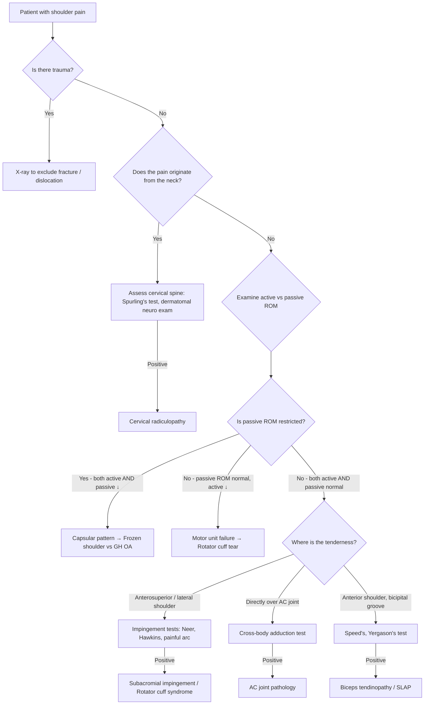

## Differential Diagnosis of Shoulder Pain in the Context of Rotator Cuff Syndrome

When a patient walks into clinic complaining of shoulder pain, your job is not to jump straight to "rotator cuff tear" — it's to systematically work through a differential. The shoulder is a complex region where pathology from the joint itself, the periarticular soft tissues, and even distant structures (cervical spine, thorax) can all present as "shoulder pain." The key is pattern recognition based on first-principles understanding of anatomy and pathophysiology.

---

### Conceptual Framework: Where is the Pain Coming From?

Before diving into individual diagnoses, think about the **anatomical source** of shoulder pain:

```mermaid
graph TD
    A["Shoulder Pain"] --> B["Intrinsic Shoulder Pathology"]
    A --> C["Extrinsic / Referred Pain"]
    B --> D["Rotator Cuff Pathology"]
    B --> E["Capsular Pathology"]
    B --> F["AC Joint Pathology"]
    B --> G["Biceps Tendon Pathology"]
    B --> H["Glenohumeral Joint Pathology"]
    B --> I["Bony Pathology"]
    C --> J["Cervical Spine"]
    C --> K["Thoracic / Visceral"]
    D --> D1["Impingement syndrome"]
    D --> D2["Rotator cuff tear"]
    D --> D3["Calcific tendonitis"]
    E --> E1["Frozen shoulder / Adhesive capsulitis"]
    F --> F1["AC joint arthritis / OA"]
    F --> F2["AC joint instability / separation"]
    G --> G1["Biceps tendinopathy"]
    G --> G2["Biceps tendon rupture"]
    G --> G3["SLAP lesion"]
    H --> H1["Glenohumeral OA"]
    H --> H2["Glenohumeral instability"]
    H --> H3["Labral tear"]
    I --> I1["Fracture"]
    I --> I2["AVN humeral head"]
    I --> I3["Tumour / Metastasis"]
    J --> J1["Cervical radiculopathy"]
    J --> J2["Cervical myelopathy"]
    K --> K1["Pancoast tumour"]
    K --> K2["Diaphragmatic irritation"]
    K --> K3["Cardiac ischaemia"]
```

---

### The "Big Five" Differential Diagnoses of Shoulder Pain [2]

These are the conditions you must be able to distinguish from each other at the bedside. The senior notes lay them out clearly, and they are the most commonly tested:

| Condition | Key Distinguishing Features [2] |
|---|---|
| **Rotator cuff syndrome (MC)** | Pain during activity only; passive ROM > active ROM; external rotation spared (infraspinatus + teres minor usually intact early) |
| **Frozen shoulder** | DM as risk factor (check HbA1c); symptoms change over time (pain → pain + stiffness → stiffness → resolution); night/rest pain; limited **active + passive** ROM |
| **AC joint arthritis** | More **localised tenderness** directly over the AC joint |
| **Biceps tendonitis** | More **localised tenderness** over the anterior shoulder (bicipital groove) |
| **Cervical radiculopathy** | Neck pain, radiating pain, weakness in dermatomal distribution |

Let's unpack each one in detail, explaining **why** the clinical features differ based on pathophysiology.

---

### 1. Rotator Cuff Syndrome (Most Common Cause)

Already covered in the previous section, but for DDx purposes, the distinguishing pattern is:

- **Pain during activity only** → because the mechanical impingement/tendon loading only occurs when the arm is actively moved through the impingement zone
- **Passive ROM > active ROM** → the joint capsule and articular surfaces are normal (no capsular contracture), but the motor unit (tendon) is dysfunctional → the examiner can move the joint through full range, but the patient cannot do it themselves
- **External rotation relatively spared** → infraspinatus and teres minor (the primary external rotators) are usually the last to be involved in the impingement continuum, because supraspinatus sits most superiorly in the subacromial space and gets compressed first

<Callout title="Why is External Rotation Spared?">
Supraspinatus is the tendon that passes directly beneath the acromion during abduction — it bears the brunt of subacromial impingement. Infraspinatus and teres minor sit more posteriorly and inferiorly, so they are relatively protected from the coracoacromial arch. Therefore, in early-to-moderate rotator cuff disease, abduction and internal rotation are more affected while external rotation is preserved. When external rotation IS lost, think about: (1) advanced rotator cuff disease involving infraspinatus, or (2) frozen shoulder.
</Callout>

---

### 2. Frozen Shoulder (Adhesive Capsulitis)

"Frozen" = the capsule is literally stuck. "Adhesive capsulitis" → "adhesive" = sticking together, "capsul-" = joint capsule, "-itis" = inflammation.

**Why does it present differently from rotator cuff syndrome?**

The pathology is in the **joint capsule**, not the tendons. The glenohumeral capsule becomes inflamed, fibrosed, and contractured — it physically restricts joint motion in all directions. This is fundamentally different from a tendon problem:

| Feature | Rotator Cuff Syndrome | Frozen Shoulder [2] |
|---|---|---|
| Active ROM | ↓ | ↓ |
| Passive ROM | **Normal or near-normal** | **↓ (equally reduced)** |
| Pattern of restriction | Depends on tendon involved; ER often spared | Global restriction, especially **ER/IR** and flexion [2] |
| Pain pattern | Activity-related | Changes over time: freezing → frozen → thawing |
| Risk factors | Age, occupation, smoking | ***DM*** (check HbA1c) [2], thyroid disease, post-trauma/surgery |
| Night pain | When lying on affected side | Prominent — inflamed capsule causes rest/night pain |

**Why is external rotation particularly affected in frozen shoulder?** The anterior capsule and coracohumeral ligament (which tighten during ER) are the first to become fibrosed and contractured. Think of the capsule as a sleeve around the joint — when it shrinks, the movements that stretch the sleeve the most (ER, then IR, then flexion) are restricted first. This is the **capsular pattern** of the glenohumeral joint (ER > abduction > IR).

**Temporal pattern of frozen shoulder** [2]:
1. **Freezing phase** (2–9 months): Pain predominates — inflammatory capsulitis
2. **Frozen phase** (4–12 months): Pain + stiffness — fibrosis and contracture develop
3. **Thawing phase** (5–24 months): Stiffness gradually resolves — may not completely resolve spontaneously

**Secondary frozen shoulder** can occur as a **complication of rotator cuff syndrome** [2] — the patient guards against pain → disuse → capsular contracture. This is important clinically because what starts as a rotator cuff problem can evolve into a combined pathology.

---

### 3. AC Joint Arthritis

**Pathophysiology**: Osteoarthritis of the acromioclavicular joint — cartilage degeneration, osteophyte formation. Common in manual labourers and those with prior AC joint injuries.

**Why is the tenderness more localised?** [2] The AC joint is a superficial structure — you can palpate it directly at the top of the shoulder where the clavicle meets the acromion. Unlike the deep rotator cuff, which produces diffuse anterolateral/lateral pain (referred via C5 dermatome), AC joint pathology produces **point tenderness** directly over the joint.

**Key distinguishing features**:
- **Cross-body adduction test** (Scarf test): passively adduct the arm across the chest → compresses the AC joint → reproduces pain directly over the AC joint
- Pain typically on top of the shoulder (superior), not anterolateral
- **Active ROM may be relatively preserved** except at extremes of elevation and cross-body adduction
- X-ray shows AC joint narrowing, osteophytes, subchondral sclerosis

**Important overlap**: AC joint osteophytes can project inferiorly into the subacromial space and cause **secondary rotator cuff impingement** — so the two conditions can coexist.

---

### 4. Biceps Tendinopathy [2]

**Anatomy context**: The long head of biceps (LHB) tendon runs through the bicipital groove (intertubercular groove) of the humerus, entering the glenohumeral joint to attach at the superior glenoid labrum (the "SLAP" complex). It is intimately related to the rotator cuff — it passes through the rotator cuff interval (between supraspinatus and subscapularis).

**Why is the tenderness more localised?** [2] The bicipital groove is palpable on the anterior shoulder — tenderness here is specific to LHB pathology rather than the more diffuse lateral/anterosuperior pain of rotator cuff impingement.

**Key distinguishing features**:
- **Localised anterior shoulder tenderness** over the bicipital groove [2]
- Pain worsened with contracting biceps [2]:
  - **Speed's test**: Resist forward flexion with arm extended and supinated → loads the LHB tendon
  - **Yergason's test**: Resist supination with elbow flexed at 90° → loads the LHB in the bicipital groove
- Pain relieved with rest [2]
- May see disuse atrophy [2]

**Biceps tendon rupture** (acute):
- Sudden onset pain, weakness with "pop" sound [2]
- **Popeye sign**: the biceps muscle belly bunches up proximally because the tendon anchor is lost [2]
- **Elbow flexion and supination remain intact** (due to brachialis for flexion and supinator for supination) [2] — this is why many patients with proximal LHB rupture are managed conservatively; functional loss is minimal

**Important overlap**: LHB tendinopathy very frequently coexists with rotator cuff tears. The LHB passes through the rotator cuff interval and can become inflamed from the same impingement process. A SLAP lesion (Superior Labrum Anterior to Posterior) involves the biceps anchor and can mimic or accompany rotator cuff pathology.

---

### 5. Cervical Radiculopathy [2][3]

This is the critical **extrinsic/referred** cause that must always be considered. The reason it's in the DDx is that cervical nerve root compression can present with shoulder pain that mimics intrinsic shoulder pathology.

***Clinical features of cervical radiculopathy*** [3]:
- ***Unilateral arm pain or sensory disturbance*** [3]
- ***May have associated weakness*** [3]
- ***Dermatomal distribution*** [3]
- ***Neck pain*** [3]

**Why does cervical radiculopathy cause shoulder pain?** The C5 nerve root innervates the deltoid, supraspinatus, and infraspinatus. C5 radiculopathy causes pain radiating to the lateral arm and shoulder — the brain interprets this as "shoulder pain" because the afferent fibres from C5 dermatome converge at the same spinal cord level. The key giveaway is that the pain typically **starts in the neck and radiates distally**, follows a dermatomal distribution, and may be associated with neurological signs (weakness, numbness, reflex changes).

***Dermatomal patterns*** [3]:

| ***Level*** | ***Motor Weakness*** | ***Sensory Deficit / Pain Location*** | ***Reflex*** |
|---|---|---|---|
| ***C5*** | ***Deltoid*** | ***Lateral arm*** | ***Biceps*** |
| ***C6*** | ***Biceps, wrist extension*** | ***Radial forearm, radial two digits*** | ***Brachioradialis*** |
| ***C7*** | ***Triceps, wrist flexion*** | ***Middle finger*** | ***Triceps*** |
| ***C8*** | ***Finger flexors*** | ***Ulnar two digits*** | — |
| ***T1*** | ***Hand intrinsics*** | ***Ulnar forearm*** | — |

***Differential diagnosis of cervical radiculopathy itself includes*** [3]:
- ***Cervical myelopathy*** (symptoms may overlap — patients can have myeloradiculopathy)
- ***Peripheral nerve compression*** (e.g., carpal tunnel, cubital tunnel)
- ***Shoulder pathology*** (i.e., the reverse — shoulder pathology can be mistaken for cervical radiculopathy)

**Key distinguishing tests**:
- **Spurling's test**: Extend and laterally flex the neck toward the symptomatic side, then apply axial compression → narrows the neural foramen → reproduces radicular pain. If positive, strongly suggests cervical radiculopathy rather than primary shoulder pathology.
- **Shoulder examination is normal**: Full passive and active ROM, no impingement signs, no tenderness over rotator cuff or AC joint
- Neurological examination reveals **dermatomal weakness and sensory changes** that don't fit a peripheral nerve pattern

<Callout title="The Cervical Spine–Shoulder Trap" type="error">
One of the most common clinical errors is attributing shoulder pain to rotator cuff syndrome when the actual culprit is cervical radiculopathy (or vice versa). Always examine the cervical spine in any patient with shoulder pain, and always examine the shoulder in any patient with neck pain. The two conditions can also **coexist** (especially in elderly patients with degenerative disease in both regions), making the clinical picture even more confusing.
</Callout>

---

### 6. Other Important Differentials to Consider

#### Glenohumeral Osteoarthritis
- Uncommon as a **primary** condition because the shoulder is not a weight-bearing joint [2]
- Usually **secondary** to: trauma (fracture malunion), recurrent dislocation, inflammatory arthritis (RA), AVN, or chronic massive rotator cuff tear (cuff tear arthropathy)
- Global restriction of active AND passive ROM (like frozen shoulder), but with radiographic evidence of joint space narrowing, osteophytes, subchondral sclerosis

#### Glenohumeral Instability
- More common in young patients (< 40 years), especially post-traumatic (recurrent dislocations)
- Apprehension test positive (fear of dislocation with arm in abduction + external rotation)
- May cause **secondary impingement** — the unstable humeral head translates superiorly during abduction, narrowing the subacromial space

#### SLAP Lesion (Superior Labrum Anterior to Posterior)
- Tear of the superior glenoid labrum at the biceps tendon anchor
- Common in overhead athletes (throwing sports), or after a fall on an outstretched hand
- Pain with overhead activities, clicking/catching, positive O'Brien's test (pain with arm at 90° forward flexion, 10° adduction, internal rotation, resisting downward force — relieved by supinating)

#### Referred Pain from Visceral Structures
- **Pancoast tumour** (lung apex): shoulder pain + Horner's syndrome (ptosis, miosis, anhidrosis) + C8/T1 radiculopathy → hand weakness, ulnar-sided sensory loss. Always get a CXR!
- **Diaphragmatic irritation**: C3-C5 phrenic nerve → referred to shoulder tip (Kehr's sign in splenic rupture, subphrenic abscess, cholecystitis)
- **Cardiac ischaemia**: Can present as left shoulder/arm pain — especially in elderly, diabetics (atypical presentation)

#### Infection
- **Septic arthritis of the glenohumeral joint**: Acutely hot, swollen, exquisitely tender shoulder with fever and raised inflammatory markers. Needs urgent aspiration.
- **Osteomyelitis** of proximal humerus

#### Tumour
- Primary bone tumours (rare) or **metastatic disease** (more common — lung, breast, prostate, kidney, thyroid metastasise to bone)
- Pathological fracture may be the presenting feature
- Red flags: night pain, weight loss, history of malignancy, progressive pain unresponsive to conservative measures

---

### Clinical Approach to Differentiating Shoulder Pain: Systematic Bedside Algorithm

---

### Summary Comparison Table

| Feature | Rotator Cuff Syndrome | Frozen Shoulder | AC Joint Arthritis | Biceps Tendinopathy | Cervical Radiculopathy |
|---|---|---|---|---|---|
| **Pain location** | Anterolateral / lateral shoulder | Diffuse, deep shoulder | Superior shoulder, over AC joint | Anterior shoulder, bicipital groove | Neck → shoulder → arm (dermatomal) |
| **Pain character** | Activity-related, painful arc | Rest/night pain, changes over time | Localised, with overhead/cross-body | Localised, with biceps contraction | Radiating, shooting, ± paraesthesia |
| **Active ROM** | ↓ (especially abduction) | ↓↓ | Mildly ↓ at extremes | Usually normal | Usually normal (unless motor deficit) |
| **Passive ROM** | **Normal** | **↓↓ (equal to active)** | Mildly ↓ at extremes | Normal | Normal |
| **Key special test** | Neer, Hawkins, drop arm | Capsular pattern (ER > Abd > IR) | Cross-body adduction | Speed's, Yergason's | Spurling's test |
| **Key risk factor** | Age, occupation, smoking | DM, post-surgery | Prior AC joint injury, manual labour | Overhead athletes, repetitive use | Cervical spondylosis, disc prolapse |
| **Neurology** | Normal | Normal | Normal | Normal | Dermatomal weakness/numbness/↓reflex |

---

<Callout title="High Yield Summary">

**The Big Five DDx of shoulder pain**: Rotator cuff syndrome (MC), Frozen shoulder, AC joint arthritis, Biceps tendonitis, Cervical radiculopathy

**The single most important bedside distinction**: Active vs passive ROM
- Passive ROM preserved + active ROM reduced → **Rotator cuff tear** (motor unit failure)
- Both active AND passive ROM reduced → **Frozen shoulder** (capsular contracture) or GH OA

**Don't forget referred causes**: Cervical radiculopathy (always examine the neck), Pancoast tumour (CXR), cardiac ischaemia, diaphragmatic irritation

**Cervical radiculopathy mimics shoulder pain** via C5 dermatome — key clue is neck pain, dermatomal distribution, positive Spurling's test, and normal shoulder examination

**AC joint and biceps tendon pathology** are distinguished by **localised tenderness** and specific provocation tests (cross-body adduction for AC joint; Speed's/Yergason's for biceps)

</Callout>

---

<ActiveRecallQuiz
  title="Active Recall - Differential Diagnosis of Shoulder Pain"
  items={[
    {
      question: "A 55-year-old diabetic woman presents with progressive shoulder stiffness over 6 months. Both active and passive external rotation are severely limited. What is the most likely diagnosis, and what is the key pathophysiological difference from a rotator cuff tear?",
      markscheme: "Frozen shoulder (adhesive capsulitis). The pathology is capsular contracture — the glenohumeral capsule is inflamed, fibrosed, and contracted, restricting motion in ALL directions (both active and passive). In rotator cuff tear, the capsule is normal but the tendon is torn, so passive ROM is preserved while active ROM is reduced. DM is a key risk factor for frozen shoulder due to glycosylation of collagen in the capsule."
    },
    {
      question: "Name the five key differential diagnoses of shoulder pain listed in the senior notes and state one distinguishing clinical feature for each.",
      markscheme: "1. Rotator cuff syndrome (MC): passive ROM greater than active ROM, external rotation spared. 2. Frozen shoulder: limited active AND passive ROM, DM risk factor. 3. AC joint arthritis: localised tenderness over AC joint, positive cross-body adduction test. 4. Biceps tendonitis: localised tenderness over bicipital groove, positive Speed and Yergason tests. 5. Cervical radiculopathy: neck pain, radiating pain in dermatomal distribution, positive Spurling test."
    },
    {
      question: "A patient has shoulder pain with C5 dermatomal weakness and sensory loss. Spurling test is positive. Shoulder examination is normal. What is the diagnosis, and which specific motor, sensory and reflex findings would you expect at C5?",
      markscheme: "Cervical radiculopathy at C5 level. Motor: deltoid weakness. Sensory: numbness or pain over the lateral arm. Reflex: diminished biceps reflex. The pain is referred to the shoulder via C5 dermatome convergence at the spinal cord level. Normal shoulder examination rules out primary shoulder pathology."
    },
    {
      question: "Why is external rotation relatively spared in early rotator cuff syndrome but prominently affected in frozen shoulder?",
      markscheme: "In rotator cuff syndrome: supraspinatus is the first tendon affected (sits most superiorly in the subacromial space, bears the brunt of impingement). Infraspinatus and teres minor (the external rotators) sit more posteriorly and inferiorly, so they are relatively protected. In frozen shoulder: the anterior capsule and coracohumeral ligament are the first structures to become fibrosed and contracted. These structures are maximally stretched during external rotation, so ER is restricted earliest (capsular pattern: ER greater than abduction greater than IR)."
    },
    {
      question: "Name three extrinsic or referred causes of shoulder pain that should not be missed, and explain the anatomical basis for one of them.",
      markscheme: "1. Pancoast tumour (lung apex tumour compressing C8/T1 roots and sympathetic chain). 2. Diaphragmatic irritation (e.g. splenic rupture, subphrenic abscess) — referred to shoulder tip via phrenic nerve (C3-5) sharing dermatomal representation with the shoulder. 3. Cardiac ischaemia — referred left shoulder/arm pain via viscerosomatic convergence at T1-T4 spinal segments. Any one explained anatomically is sufficient."
    }
  ]}
/>

## References

[1] Lecture slides: GC 236. Common Shoulder Problems [Updated in 2025].pdf (Module 2: Rotator cuff pathology, pages 77–105)
[2] Senior notes: maxim.md (sections 3.3–3.6, pages 485–489)
[3] Lecture slides: GC 227. Cervical Spine Pathology.pdf (pages 41–44)
