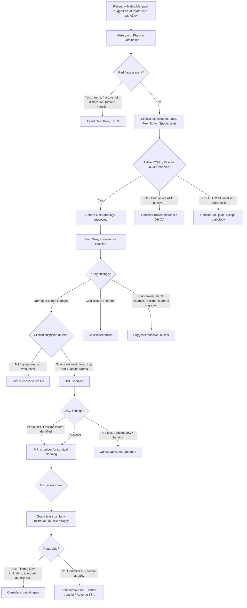

## Diagnosis of Rotator Cuff Syndrome

### Diagnostic Principles — "There Is No Single Diagnostic Criterion"

Rotator cuff syndrome is fundamentally a **clinical diagnosis** supported by imaging. There is no single blood test, scoring system, or pathognomonic finding that "confirms" it. Instead, the diagnosis is built from the convergence of:

1. **History**: Activity-related shoulder pain, night pain, weakness, age/risk factors
2. **Physical examination**: Specific provocation tests, active vs passive ROM discrepancy
3. **Imaging**: To confirm the clinical suspicion, grade severity, and guide management

The reason there is no formal "diagnostic criteria" (unlike, say, rheumatoid arthritis or SLE) is that rotator cuff syndrome represents a **continuum** — from mild tendinopathy to massive tear — rather than a binary present/absent disease. The clinical question is not just "does the patient have rotator cuff pathology?" (most people over 60 do), but rather "**is the rotator cuff pathology causing this patient's symptoms, how severe is it, and is it reparable?**"

---

### Systematic Clinical Assessment

***Physical examination*** is the cornerstone and should follow the structured **Look–Feel–Move** approach [1]:

#### ***Look*** [1]
- **Muscle wasting**: Inspect supraspinous and infraspinous fossae from behind — hollowing indicates chronic denervation or disuse atrophy from a rotator cuff tear
- **Asymmetry**: Compare both shoulders for contour changes, swelling
- **Skin changes**: Scars from prior surgery, bruising (acute tear/trauma)
- **Posture**: Protracted shoulder, guarding posture

#### ***Feel*** [1]
- ***Tenderness over the rotator cuff*** [1]: Palpate the supraspinatus insertion at the greater tuberosity (just distal to the anterolateral acromion with arm slightly extended to bring the tendon anterior)
- Bicipital groove tenderness (anterior) → suggests biceps tendinopathy
- AC joint tenderness (superior) → suggests AC joint pathology
- Subacromial tenderness (lateral) → suggests bursitis/impingement

#### ***Move*** [1]
- ***Active*** ROM [1]: Forward flexion, abduction, external rotation, internal rotation (hand behind back)
- ***Passive*** ROM [1]: Repeat the same movements with the examiner moving the arm
- The key distinction: **Active ↓ with passive preserved = rotator cuff pathology**; **Both ↓ = capsular pathology (frozen shoulder / OA)**

#### ***Special Tests*** [1]

***Jobe test (Empty Can Test)*** [1]:
- Tests: **Supraspinatus**
- Technique: Arm at 90° abduction, 30° forward flexion (in the scapular plane), fully internally rotated (thumb pointing down — like emptying a can). Resist downward force.
- Positive: Pain and/or weakness → supraspinatus pathology
- Why it works: This position isolates the supraspinatus by minimising the contribution of the deltoid, and the internal rotation places the supraspinatus insertion directly under the acromion

***Lift-off test (Gerber's test)*** [1]:
- Tests: **Subscapularis**
- Technique: Place patient's hand behind their back (dorsum of hand resting on the lumbar spine). Ask patient to lift the hand away from the back.
- Positive: Inability to lift the hand off the back → subscapularis tear
- Why it works: Lifting the hand off the back requires active internal rotation against resistance — the subscapularis is the primary internal rotator, and if it's torn, the patient cannot generate force in this position

**Other special tests** (summary from the full examination framework [1]):

| Test | Structure Tested | Technique | Positive Finding |
|---|---|---|---|
| **Neer's impingement sign** | Subacromial impingement | Passively flex shoulder to 180° with arm internally rotated | Anterior shoulder pain |
| **Hawkins' sign** | Subacromial impingement | Flex shoulder and elbow to 90°, passively IR | Anterior shoulder pain |
| **Painful arc** | Subacromial impingement | Active abduction 0–180° | ***Pain between 60° and 120°*** [1] |
| **Drop arm test** | Full-thickness supraspinatus tear | Hold arm at 90° abduction, slowly lower | Arm drops suddenly |
| **External rotation lag** | Infraspinatus | Passively place arm in maximal ER, release | Arm falls into IR |
| **Hornblower's sign** | Teres minor | Resist ER with arm at 90° abduction | Cannot hold position |
| **Belly press test** | Subscapularis (alternative to lift-off) | Press palm against abdomen; attempt to keep elbow forward | Elbow drifts posteriorly (compensating with wrist flexion) |

<Callout title="The Impingement Test vs Impingement Sign" type="idea">
There is a subtle distinction:
- **Impingement sign** = Neer's sign or Hawkins' sign is positive (pain reproduced)
- **Impingement test** (Neer's injection test) = Inject local anaesthetic (e.g., 10 mL 1% lignocaine) into the subacromial space, then repeat the impingement signs. If pain is **abolished**, this confirms the pain originates from the subacromial space (rather than the AC joint, cervical spine, etc.). This is both diagnostic and therapeutic.
</Callout>

---

### Diagnostic Algorithm

The following algorithm integrates the clinical and imaging approach to a patient presenting with suspected rotator cuff syndrome:

<Callout title="Key Diagnostic Pathway Summary">

***Investigation including USG and MRI*** [1]

The pathway is: **Clinical diagnosis → X-ray (baseline) → USG (dynamic assessment for tear) → MRI (gold standard for surgical planning)**

Not every patient needs MRI. A straightforward impingement syndrome in a 45-year-old responding to conservative treatment may only need an X-ray. MRI is reserved for when you need to **grade a tear for surgical decision-making** or when the diagnosis is unclear.
</Callout>

---

### Investigation Modalities — Detailed Interpretation

#### 1. Plain Radiograph (X-ray) of the Shoulder

**Why do we get it?** It's the first-line imaging for any shoulder complaint — cheap, fast, widely available. It **does not directly visualise** the soft tissue rotator cuff, but it provides critical indirect information and excludes other pathology.

**Standard views**:
- **AP view** (true AP / Grashey view): Humeral head centred on glenoid
- **Axillary view**: Visualises glenohumeral congruency, Hill-Sachs/Bankart lesions
- **Y-view (Supraspinatus outlet view)**: Assesses acromion morphology (Bigliani classification)

**What to look for on X-ray** [2]:

| X-ray Finding | What It Tells You | Pathophysiological Basis |
|---|---|---|
| **Acromiohumeral distance** [2] | Normal: 7–14 mm. Decreased ( < 7 mm) = **proximal migration of humeral head** → suggests massive rotator cuff tear | Without the rotator cuff's depressor force couple, the deltoid's unopposed superior pull drags the humeral head upward against the acromion |
| **Acromion morphology** [2] | Bigliani Type I (flat), II (curved), III (hooked). Type III → ↑ risk of impingement | A hooked acromion physically narrows the subacromial space, directly compressing the supraspinatus |
| **Bony spurs** [2] | Subacromial spurs (inferior acromion), acromial enthesophytes | Traction spurs from chronic coracoacromial ligament stress; directly narrow the subacromial space |
| **Calcification of supraspinatus tendon** [2] | Radio-opaque deposits near the greater tuberosity → **calcific tendonitis** | Calcium hydroxyapatite deposition within the tendon substance in areas of hypoxia/degeneration |
| **AC joint changes** | Joint space narrowing, osteophytes, inferior osteophytes projecting into subacromial space | Osteoarthritis of AC joint; inferior osteophytes can contribute to extrinsic impingement |
| **Fractures** [2] | Exclude greater tuberosity fracture, proximal humerus fracture | Important in traumatic presentations — an acute fracture may mimic or co-exist with a rotator cuff tear |
| **Glenohumeral OA** | Joint space narrowing, subchondral sclerosis, osteophytes | Suggests primary GH OA or secondary cuff tear arthropathy |
| **"Acetabularisation" of the acromion** | The acromion becomes concave/cupped on the undersurface | In chronic massive cuff tears, the humeral head articulates with the acromion → the acromion remodels to accommodate the "new articulation" — a sign of cuff tear arthropathy |

<Callout title="The Acromiohumeral Distance" type="error">
This is one of the most important measurements on a shoulder X-ray. If the acromiohumeral distance is < 7 mm, it strongly suggests a **massive, chronic rotator cuff tear** with superior humeral migration. This finding has implications for surgical planning — a standard rotator cuff repair may not be feasible, and the patient may need a **reverse total shoulder arthroplasty** instead.
</Callout>

---

#### 2. Ultrasound (USG) of the Shoulder

***USG shoulder: dynamic test for tear*** [2]

**Why USG?** It's the first-line imaging for confirming a suspected rotator cuff tear [2]. It is:
- **Dynamic**: You can examine the tendon while the patient actively moves the shoulder — this reveals tears, subluxation of the biceps tendon, and impingement in real-time
- **Operator-dependent**: Accuracy is highly dependent on the skill of the sonographer — in experienced hands, sensitivity and specificity for full-thickness tears approach 90–95%
- **Cost-effective and non-invasive**: No radiation, no contrast, performed in clinic
- **Bilateral comparison**: Can easily scan the contralateral shoulder for comparison

**Key USG Findings**:

| Finding | Interpretation |
|---|---|
| **Hypoechoic / anechoic defect in tendon** | Tendon tear (partial or full-thickness) — fluid or granulation tissue fills the gap |
| **Non-visualisation of tendon** | Complete retracted tear — the tendon has pulled away from the insertion |
| **Tendon thickening / heterogeneity** | Tendinopathy — disorganised collagen, mucoid degeneration |
| **Subacromial bursal fluid / thickening** | Subacromial bursitis — secondary to impingement |
| **Cortical irregularity of greater tuberosity** | Enthesopathy at the tendon insertion — chronic traction changes |
| **Calcific deposit** | Calcific tendonitis — hyperechoic focus with or without posterior acoustic shadowing |
| **Dynamic impingement** | Bunching of subacromial bursa/tendon during active abduction — confirms impingement |
| **Biceps tendon subluxation/dislocation** | May indicate subscapularis tear (the transverse humeral ligament and subscapularis hold the biceps in the groove) |

**Limitations of USG**:
- Cannot reliably assess **fatty infiltration** of the muscle (critical for assessing reparability)
- Cannot assess **intra-articular pathology** (labral tears, SLAP lesions, glenohumeral cartilage)
- Posterior structures (infraspinatus, teres minor) can be harder to visualise
- **Operator-dependent** — results vary significantly with sonographer experience

---

#### 3. MRI of the Shoulder — Gold Standard

**MRI shoulder: gold standard, degree of tear** [2] — ***irreparable if fatty infiltration or muscle tendon atrophy*** [2]

**Why MRI?** MRI provides the most comprehensive assessment of the rotator cuff and is the definitive pre-operative investigation. It answers the key surgical questions:

1. **Which tendon(s) are torn?** (Supraspinatus, infraspinatus, subscapularis, or multiple)
2. **Is the tear partial or full-thickness?** And if partial, is it articular-side, bursal-side, or intratendinous?
3. **What is the tear size?** (Small/medium/large/massive)
4. **Is there tendon retraction?** How far has the torn edge pulled back from the insertion?
5. **Is there fatty infiltration of the muscle?** (Goutallier classification — determines reparability)
6. **Is there muscle atrophy?** (Tangent sign — if the supraspinatus muscle belly sits below the tangent line drawn from the scapular spine to the coracoid, atrophy is present)
7. **What is the condition of the remaining cuff?** (Are other tendons degenerative?)
8. **Are there associated pathologies?** (Labral tears, biceps pathology, capsular thickening, GH OA)

**Key MRI sequences and findings**:

| Sequence | What It Shows Best |
|---|---|
| **T1-weighted** | Anatomy, fatty infiltration (fat appears bright/hyperintense on T1) |
| **T2-weighted / PD fat-sat** | Fluid (bright on T2), tendon tears (fluid signal within tendon gap), oedema, bursitis |
| **Oblique coronal** | Best for supraspinatus and infraspinatus tears (perpendicular to the tendon) |
| **Oblique sagittal** | Best for assessing fatty infiltration, tear retraction, muscle bulk |
| **Axial** | Best for subscapularis, biceps tendon in the groove, labral pathology |

**MRI findings in specific conditions**:

| Condition | MRI Appearance |
|---|---|
| **Tendinopathy** | Thickened tendon with intermediate signal on T1/T2 (no discrete fluid-filled defect) |
| **Partial-thickness tear** | Focal area of increased T2 signal within the tendon substance that does not extend full-thickness |
| **Full-thickness tear** | Fluid signal (bright on T2) extending from bursal to articular surface; gap in the tendon |
| **Massive retracted tear** | Tendon stump retracted to or beyond the glenoid level; associated muscle atrophy and fatty infiltration |
| **Fatty infiltration** | Muscle replaced by fat (bright on T1 in the muscle belly) — Goutallier classification |
| **Subacromial bursitis** | Fluid in the subacromial-subdeltoid bursa (bright on T2) |
| **Calcific tendonitis** | Low signal focus on all sequences (calcium is dark on MRI — better seen on X-ray!) |

<Callout title="Goutallier Classification on MRI — Reparability Assessment">
The **Goutallier classification** was originally described on CT but is now routinely applied on MRI oblique sagittal images:

| Stage | Fatty Infiltration | Reparability |
|---|---|---|
| 0 | None | Fully reparable |
| 1 | Fatty streaks | Reparable |
| 2 | < 50% fat | Reparable (borderline if Grade 2+) |
| **3** | **50% fat** | **Generally irreparable** |
| **4** | **> 50% fat** | **Irreparable** |

Goutallier ≥ 3 means the muscle is too fatty/atrophied to function even if the tendon is re-attached surgically. These patients are candidates for **tendon transfer** or **reverse total shoulder arthroplasty** rather than primary repair.
</Callout>

**MR Arthrogram** (MRI with intra-articular gadolinium contrast):
- **When?** When conventional MRI is equivocal, particularly for:
  - **Partial-thickness articular-side tears**: Contrast leaking into a partial tear makes it more conspicuous
  - **Labral pathology / SLAP lesions**: Contrast distends the joint and outlines labral tears
- Not routinely needed for straightforward full-thickness tears (these are well-seen on standard MRI)

---

#### 4. Other Investigations

| Investigation | When / Why |
|---|---|
| **CT scan** | Rarely needed for rotator cuff. Useful for assessing **bony anatomy** (acromion morphology, glenoid bone loss in instability, fractures). CT with 3D reconstruction helps pre-operative planning for arthroplasty. |
| **CT arthrogram** | Alternative to MR arthrogram if MRI is contraindicated (e.g., pacemaker). Contrast outlines intra-articular structures. |
| **Blood tests** | Not diagnostic for rotator cuff syndrome per se, but: **HbA1c** (if frozen shoulder suspected — screen for DM [2]); **ESR/CRP** (if infection or inflammatory arthritis suspected); **FBC, CRP, blood cultures** (if septic arthritis being considered) |
| **Diagnostic subacromial injection** (Neer's impingement test) | Inject 5–10 mL lignocaine into the subacromial space. If pain is abolished and strength improves → confirms subacromial impingement as the pain generator. If pain persists → pain source is elsewhere (AC joint, GH joint, cervical spine) |
| **Nerve conduction studies / EMG** | If cervical radiculopathy or peripheral nerve entrapment is suspected. Differentiates neurogenic weakness from tendon pathology. |

---

### Putting It All Together — The Decision Pathway

The investigation strategy depends on **where you are in the clinical pathway**:

| Clinical Scenario | Recommended Investigation |
|---|---|
| Acute traumatic shoulder pain in young patient | X-ray (exclude fracture/dislocation) → if weakness persists, USG → MRI |
| Chronic activity-related shoulder pain in middle-aged patient, responding to conservative Rx | X-ray (baseline) → clinical monitoring |
| Chronic shoulder pain, failed 6 weeks conservative Rx | X-ray + USG → if tear confirmed, MRI for pre-op planning |
| Suspected massive tear (drop arm+, severe weakness, wasting) | X-ray (acromiohumeral distance) → USG → MRI (assess reparability: fatty infiltration, retraction) |
| Suspected calcific tendonitis (acute severe pain, limited movement) | X-ray (calcification visible) → USG (guided barbotage if needed) |
| Diagnostic uncertainty: is this shoulder or cervical spine? | X-ray shoulder + C-spine → diagnostic subacromial injection → if negative, MRI C-spine / nerve conduction studies |

> ***Investigation including USG and MRI*** [1] — this is the lecture slide's explicit summary of the investigation modalities for rotator cuff pathology. In practice, X-ray is always the starting point, USG is the dynamic bedside/clinic assessment, and MRI is the gold standard for pre-operative planning.

---

<Callout title="High Yield Summary">

**Diagnosis is clinical, supported by imaging** — no formal diagnostic criteria exist for rotator cuff syndrome.

**Physical examination framework**: ***Look, Feel, Move*** [1] → then ***Special tests: Jobe test (supraspinatus), Lift-off test (subscapularis)*** [1], Neer's sign, Hawkins' sign, painful arc, drop arm test.

**Key clinical finding**: Active ROM ↓ with passive ROM preserved → rotator cuff pathology. Both ↓ → frozen shoulder / GH OA.

**X-ray** [2]: First-line. Look for acromiohumeral distance ( < 7 mm = massive tear), acromion morphology, bony spurs, calcification, fractures.

***USG*** [2]: Dynamic test for tear. First-line imaging to confirm tear. Operator-dependent. Cannot assess fatty infiltration.

**MRI** [2]: Gold standard for pre-operative planning. Grades tear size, fatty infiltration (Goutallier), muscle atrophy. ***Irreparable if fatty infiltration or muscle tendon atrophy*** [2].

**Diagnostic subacromial injection**: Confirms subacromial space as pain source when clinical picture is ambiguous.

</Callout>

---

<ActiveRecallQuiz
  title="Active Recall - Diagnosis and Investigations of Rotator Cuff Syndrome"
  items={[
    {
      question: "Describe the Jobe test (empty can test). What does it test, how is it performed, and why does the specific arm position isolate the structure being tested?",
      markscheme: "Tests supraspinatus. Arm at 90 degrees abduction, 30 degrees forward flexion (scapular plane), fully internally rotated (thumb pointing down). Examiner applies downward force; patient resists. Positive: pain and/or weakness. The position isolates supraspinatus by minimising deltoid contribution (scapular plane), and internal rotation places the supraspinatus insertion directly under the acromion for maximal loading."
    },
    {
      question: "What are the three main investigation modalities for rotator cuff pathology in order of the clinical pathway, and state the unique advantage of each?",
      markscheme: "1. Plain X-ray: first-line, assesses bony anatomy (acromiohumeral distance, acromion morphology, spurs, calcification, excludes fracture). 2. USG: dynamic test for tear - can visualise tendon during active movement; first-line to confirm tear; cost-effective. 3. MRI: gold standard for pre-operative planning - grades tear size, assesses fatty infiltration (Goutallier classification), muscle atrophy, and associated pathologies."
    },
    {
      question: "On a shoulder X-ray, the acromiohumeral distance measures 5 mm. What does this indicate and why?",
      markscheme: "Indicates proximal migration of the humeral head, suggesting a massive chronic rotator cuff tear. Normal acromiohumeral distance is 7-14 mm. When the rotator cuff (especially supraspinatus) is massively torn, the depressor force couple is lost. The deltoid's unopposed superior pull drags the humeral head upward against the undersurface of the acromion, reducing this distance. This finding may indicate the tear is irreparable and the patient may need reverse total shoulder arthroplasty rather than primary repair."
    },
    {
      question: "What is the Goutallier classification? At what grade is a rotator cuff tear generally considered irreparable, and why?",
      markscheme: "Goutallier classification grades fatty infiltration of rotator cuff muscles on MRI (or CT). Grade 0: no fat; Grade 1: fatty streaks; Grade 2: less than 50% fat; Grade 3: 50% fat; Grade 4: more than 50% fat. Goutallier grade 3 or above is generally considered irreparable because the muscle has been replaced by fat and cannot generate meaningful contraction even if the tendon is surgically re-attached. These patients are candidates for tendon transfer or reverse total shoulder arthroplasty."
    },
    {
      question: "Explain the diagnostic subacromial injection test (Neer's impingement test). When is it useful and how do you interpret the result?",
      markscheme: "Inject 5-10 mL local anaesthetic (e.g., lignocaine) into the subacromial space. Then repeat impingement provocation tests (Neer sign, Hawkins sign, painful arc). If pain is abolished and strength improves, this confirms the subacromial space is the pain generator (subacromial impingement or rotator cuff pathology). If pain persists despite the injection, the pain source is elsewhere (e.g., AC joint, glenohumeral joint, cervical spine). Useful when the clinical picture is ambiguous or multiple pathologies may coexist."
    }
  ]}
/>

## References

[1] Lecture slides: GC 236. Common Shoulder Problems [Updated in 2025].pdf (pages 23, 77, 80, 87–91, 105, 110, 115–116, 119)
[2] Senior notes: maxim.md (sections 3.3–3.6, pages 485–489)
