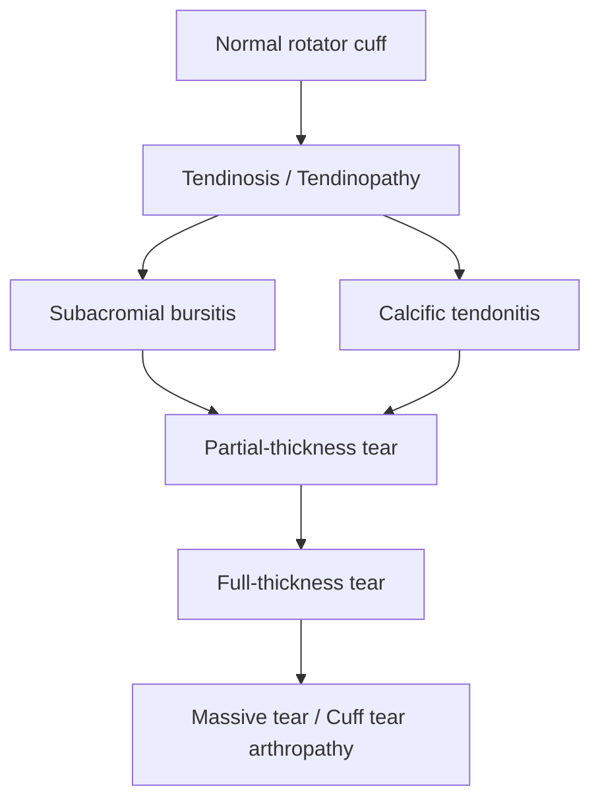

## 1. Definition

Rotator cuff syndrome is **not a single disease** — it represents a **continuum of pathology** affecting the rotator cuff tendons and their surrounding structures [2]. Think of it as a spectrum:

1. **Subacromial impingement** (tendon irritation/inflammation)
2. **Subcoracoid impingement** (anterior impingement against the coracoid process)
3. **Calcific tendonitis** (calcium hydroxyapatite deposition within tendon substance)
4. **Rotator cuff tear** (partial → full thickness)

The unifying theme: mechanical and/or degenerative insult to the rotator cuff tendons, most commonly **supraspinatus**, as they traverse the narrow subacromial space beneath the coracoacromial arch.

> The key clinical distinction from other causes of shoulder pain is that in rotator cuff syndrome, **passive ROM is typically greater than active ROM** (because the motor unit — the tendon — is compromised, but the joint itself is not "stuck"), and **external rotation is relatively spared** (infraspinatus + teres minor are less commonly affected early) [2].

---

## 2. Epidemiology

### Prevalence

- **_Rotator cuff tear is an age-related disease_** [1]
- **_20% prevalence in 60–69 year olds; 40.7% in subjects ≥ 70 years_** [1]
- **_Abnormalities ranged from 9.7% in patients < 20 years to 62% in patients ≥ 80 years_** [1]
- Rotator cuff pathology is one of the **most common causes of shoulder pain** in primary care and orthopaedic clinics — **_shoulder pain is one of the most common musculoskeletal problems_** [1]
- Many rotator cuff tears are **asymptomatic** — MRI studies of asymptomatic volunteers show tears in up to 30–50% of those aged > 60

### Risk Factors [1]

| Risk Factor                                | Mechanism / Explanation                                                                                                                                       |
| ------------------------------------------ | ------------------------------------------------------------------------------------------------------------------------------------------------------------- |
| **_Age_**                                  | Tendon degeneration accumulates over decades; collagen cross-linking ↓, vascularity ↓, repair capacity ↓                                                      |
| **_Hand dominance_**                       | The dominant shoulder undergoes more repetitive loading → more cumulative microtrauma                                                                         |
| **_Contralateral shoulder_**               | **_Likelihood of bilateral tear after age 60 is as high as 50%_** — this reflects systemic tendon biology rather than isolated trauma                         |
| **_Smoking_**                              | **_Affects vascularity of tendon_** — nicotine causes microvascular vasoconstriction, carbon monoxide ↓ oxygen delivery, directly impairs tenocyte metabolism |
| **_Family history_**                       | Genetic predisposition in collagen composition (e.g., COL5A1 polymorphisms), tendon ultrastructure                                                            |
| **_Trauma_**                               | Acute overload can cause macroscopic tear on a background of chronic degeneration                                                                             |
| **_Occupational demands of heavy labors_** | Repetitive overhead lifting, vibration, sustained postures — painters, construction workers, warehouse workers                                                |

Additional risk factors to be aware of:

- **Metabolic disease**: Diabetes mellitus (glycosylation of collagen → stiff, brittle tendons; microangiopathy), hypercholesterolaemia
- **Corticosteroid use**: Both systemic and repeated local injections weaken tendon collagen
- **Anatomical variants**: Hooked (Type III) acromion — discussed under aetiology

<Callout title="High Yield Exam Point">
  The bilateral nature of rotator cuff disease is important — if you find a tear
  in one shoulder of a 65-year-old, there is up to a 50% chance the other
  shoulder has one too. This supports the "intrinsic degeneration" theory: it's
  not just about one shoulder being overused, it's a systemic tendon ageing
  problem.
</Callout>

---

## 3. Anatomy and Function

### 3.1 The Rotator Cuff Muscles — "SITS"

The rotator cuff is a group of four muscles whose tendons **coalesce to form a continuous cuff** around the humeral head, blending with the glenohumeral joint capsule. Mnemonic: **SITS** (Supraspinatus, Infraspinatus, Teres minor, Subscapularis).

| Muscle            | Origin                               | Insertion                            | Nerve Supply                              | **_Function_** [1]                                                                               |
| ----------------- | ------------------------------------ | ------------------------------------ | ----------------------------------------- | ------------------------------------------------------------------------------------------------ |
| **Supraspinatus** | Supraspinous fossa of scapula        | Superior facet of greater tuberosity | Suprascapular nerve (C5, C6)              | **_Abductor of the arm at shoulder_** (initiates first 0–15° of abduction, then assists deltoid) |
| **Infraspinatus** | Infraspinous fossa of scapula        | Middle facet of greater tuberosity   | Suprascapular nerve (C5, C6)              | **_External rotation_**                                                                          |
| **Teres minor**   | Lateral border of scapula            | Inferior facet of greater tuberosity | Axillary nerve (C5, C6)                   | **_External rotation_**                                                                          |
| **Subscapularis** | Subscapular fossa (anterior scapula) | Lesser tuberosity                    | Upper & lower subscapular nerves (C5, C6) | **_Internal rotation_**                                                                          |

### 3.2 Biomechanical Function — Force Couple Concept

This is the critical concept for understanding why the rotator cuff matters:

**_The rotator cuff muscles grasp and pull the relatively large humeral head medially to hold it against the smaller and shallow glenoid cavity_** [1]. The glenoid is essentially a shallow saucer — it covers only about 25–30% of the humeral head surface. Without the rotator cuff's dynamic stabilisation, the humeral head would simply translate superiorly when the deltoid contracts (since deltoid's line of pull is predominantly upward).

**_Combined function of the rotator cuff muscles and deltoid_** [1]:

- **Deltoid** provides the primary power for abduction (upward force)
- **Rotator cuff** provides a compressive, inferiorly-directed force that keeps the humeral head centred on the glenoid
- This creates a **force couple** (two opposing forces creating balanced rotation around a fulcrum)
- When the rotator cuff fails → the deltoid's unopposed superior pull causes **superior migration of the humeral head** → impingement worsens → a vicious cycle

### 3.3 The Subacromial Space

The subacromial space is the interval between:

- **Roof**: undersurface of acromion, coracoacromial ligament, acromioclavicular (AC) joint
- **Floor**: superior aspect of humeral head, supraspinatus tendon, subacromial bursa

Normal acromiohumeral distance on AP X-ray: **7–14 mm**. When this decreases (e.g., to < 7 mm), it indicates **proximal migration of the humerus** — a hallmark of massive rotator cuff tear where the humeral head rides upward due to loss of the depressor force couple.

The **subacromial bursa** sits between the acromion above and the supraspinatus tendon below — it acts as a friction-reducing cushion. When the tendon is inflamed or the space is narrowed, the bursa becomes secondarily inflamed (**subacromial bursitis**).

### 3.4 The Critical Zone — Vascular Watershed

**_A critical hypovascular zone exists 10–15 mm proximal to the rotator cuff insertion on the humeral head_** [1].

Why does this matter? The supraspinatus tendon has a "watershed area" near its insertion where blood supply from the osseous (bone-side) and muscular (muscle-side) vessels is poorest. This zone of relative hypovascularity:

- Limits the tendon's ability to heal from microtrauma
- Makes it the most common site for degenerative tears
- Is worsened by smoking, diabetes, and age-related vascular changes

<Callout title="Understanding the Anatomy" type="idea">
  Think of the supraspinatus tendon like a rope being dragged across a rocky
  ledge (the acromion). The part of the rope that gets the most friction
  (mechanical compression) also happens to be the part with the worst blood
  supply (biological vulnerability). This dual insult — extrinsic compression +
  intrinsic hypovascularity — is why supraspinatus tears are the most common
  rotator cuff pathology.
</Callout>

### 3.5 Acromion Morphology (Bigliani Classification)

The shape of the acromion affects the subacromial space:

| Type         | Shape  | Clinical Significance                                                                                               |
| ------------ | ------ | ------------------------------------------------------------------------------------------------------------------- |
| **Type I**   | Flat   | Lowest risk of impingement                                                                                          |
| **Type II**  | Curved | Intermediate risk                                                                                                   |
| **Type III** | Hooked | Highest risk — the anterior hook narrows the subacromial space and mechanically compresses the supraspinatus tendon |

Type III acromion is strongly associated with rotator cuff tears. This is an important finding to look for on the **supraspinatus outlet view (Y-view)** X-ray.

---

## 4. Aetiology and Pathophysiology

The aetiology of rotator cuff syndrome is best understood as a combination of **intrinsic** (within the tendon) and **extrinsic** (outside the tendon) factors.

### 4.1 Intrinsic Factors (Tendon-Side Pathology) [1][2]

These relate to the tendon's own biology degenerating over time:

| Factor                                                      | Pathophysiology                                                                                                                                                                      |
| ----------------------------------------------------------- | ------------------------------------------------------------------------------------------------------------------------------------------------------------------------------------ |
| **_Chronic microtrauma from repeated overhead activities_** | **_Swimming, lifting, painting_** — cumulative micro-injury exceeds the tendon's repair capacity → tendinosis (degenerative, NOT inflammatory)                                       |
| **_Poor vascularity of tendons_**                           | **_Smoking_** directly impairs tendon vascularity. The watershed zone (10–15 mm from insertion) has inherently poor perfusion → ↓ healing, ↓ collagen turnover                       |
| **Degenerative tendinopathy**                               | With age: ↓ cellularity, ↓ organised collagen, ↑ mucoid degeneration, ↑ calcification → weakened tendon prone to tearing                                                             |
| **Rotator cuff muscle weakness**                            | Disuse, neurological injury, or fatty infiltration → loss of dynamic stabilisation → humeral head migrates superiorly → mechanical impingement worsens → more damage (vicious cycle) |

### 4.2 Extrinsic Factors (Compression from Outside) [2]

These relate to structures compressing the rotator cuff from above or around it:

| Structure                   | Mechanism                                                                                                                                                      |
| --------------------------- | -------------------------------------------------------------------------------------------------------------------------------------------------------------- |
| **Humeral head**            | Glenohumeral instability (e.g., in young overhead athletes) → **superior subluxation** of humeral head during abduction → narrows subacromial space from below |
| **Acromion**                | Anatomical variation — **curved or hooked** (Bigliani Type II/III) acromion → narrows subacromial space from above                                             |
| **Coracoacromial ligament** | Hypertrophy (thickening) of this ligament → reduces clearance in the coracoacromial arch                                                                       |
| **AC joint**                | Osteoarthritis of the AC joint → inferior osteophytes project downward into the subacromial space → mechanical compression of supraspinatus                    |

### 4.3 Pathophysiology of the Impingement–Tear Continuum

This is best understood as a stepwise progression:

**Stage 1 — Tendinosis/Tendinopathy**: Repetitive microtrauma + poor vascularity → collagen disorganisation, mucoid degeneration. Note: this is a **degenerative** process (tendinosis), not primarily inflammatory (tendinitis is a misnomer in most chronic cases).

**Stage 2 — Subacromial Bursitis**: The inflamed/thickened tendon increases friction against the acromion → secondary inflammation of the subacromial bursa → pain with overhead activities.

**Stage 3 — Calcific Tendonitis**: Calcium hydroxyapatite deposits within the tendon substance. Thought to occur in areas of hypoxia/degeneration. Can cause severe acute pain when calcium is resorbed (resorptive phase triggers intense inflammatory response).

**Stage 4 — Partial-Thickness Tear**: The weakened tendon partially fails. Can be on the **articular side** (more common — the undersurface of the tendon, which is in the hypovascular zone) or the **_bursal side_** [1].

**Stage 5 — Full-Thickness Tear**: Complete discontinuity of the tendon from bursal to articular surface. The subacromial bursa now communicates with the glenohumeral joint.

**Stage 6 — Massive Tear / Cuff Tear Arthropathy**: Chronic massive tears → unopposed deltoid pull → **superior migration of humeral head** → articulates with undersurface of acromion → secondary osteoarthritis (acetabularisation of the acromion).

<Callout title="Neer's Classic Three Stages" type="idea">
Charles Neer originally described impingement in 3 stages:
- **Stage I** (< 25 years): Oedema and haemorrhage — reversible
- **Stage II** (25–40 years): Fibrosis and tendinosis — partially reversible
- **Stage III** (> 40 years): Bone spurs and tendon tears — irreversible

This historical classification helps frame the continuum concept, though in practice the condition doesn't always follow age-based staging.

</Callout>

---

## 5. Classification

### 5.1 Subacromial Impingement Syndrome (SAIS)

Classified by the source of compression:

- **Primary (outlet) impingement**: Structural narrowing of the subacromial space (acromial spur, Type III acromion, AC joint osteophytes, thickened coracoacromial ligament)
- **Secondary (non-outlet) impingement**: Functional narrowing from rotator cuff dysfunction or glenohumeral instability → humeral head migrates superiorly into the space
- **Internal impingement**: Articular-side impingement of the rotator cuff against the posterosuperior glenoid rim — seen in overhead athletes (e.g., throwing athletes) in the late-cocking position

### 5.2 Rotator Cuff Tear Classification [2]

#### By Chronicity

- **Acute**: < 3 months (usually traumatic — fall on outstretched hand, sudden forceful movement)
- **Chronic**: > 3 months (usually degenerative)

#### By Depth — **_Partial thickness vs full thickness_** [1]

| Category              | Description                                                             |
| --------------------- | ----------------------------------------------------------------------- |
| **Partial thickness** | Incomplete tear — can be articular-side, bursal-side, or intratendinous |
| **Full thickness**    | Complete tear through the entire tendon substance                       |

#### **_Bursal side vs articular side_** [1]

- **Articular-side** tears are more common (the undersurface is in the watershed zone with poorest blood supply)
- **Bursal-side** tears are less common but may be associated with extrinsic impingement

#### Full-Thickness Tear Size [2]

| Size    | Dimension                       |
| ------- | ------------------------------- |
| Small   | < 1 cm                          |
| Medium  | 1–3 cm                          |
| Large   | 3–5 cm                          |
| Massive | > 5 cm OR involving ≥ 2 tendons |

#### Fatty Infiltration (Goutallier Classification)

This is assessed on MRI and is critical for surgical decision-making — it tells you whether the muscle is still viable and the tear is **reparable**:

| Stage | Description              |
| ----- | ------------------------ |
| 0     | No fatty infiltration    |
| 1     | Some fatty streaks       |
| 2     | < 50% fatty infiltration |
| 3     | 50% fatty infiltration   |
| 4     | > 50% fatty infiltration |

**Goutallier ≥ 3 = generally considered irreparable** because the muscle has been replaced by fat and cannot generate meaningful contraction even if re-attached.

<Callout title="Irreparable Tear Criteria" type="error">
  A rotator cuff tear is considered **irreparable** if there is significant
  ***fatty infiltration or muscle tendon atrophy*** on MRI [2]. Don't just focus
  on tear size — a "small" tear in a severely atrophied, fatty-infiltrated
  muscle may be functionally irreparable, while a "large" acute tear in healthy
  muscle may be readily repairable.
</Callout>

---

## 6. Clinical Features

### 6.1 Subacromial Impingement Syndrome

#### Symptoms

| Symptom                                                       | Pathophysiological Basis                                                                                                                                                                          |
| ------------------------------------------------------------- | ------------------------------------------------------------------------------------------------------------------------------------------------------------------------------------------------- |
| **Progressive pain in anterosuperior aspect of shoulder** [2] | The supraspinatus tendon and subacromial bursa are compressed beneath the anteroinferior acromion — the anterior and lateral deltoid region is where referred pain from C5 dermatome is perceived |
| **_Pain exacerbated by abduction_** [2]                       | Abduction (especially 60–120°) maximally narrows the subacromial space as the greater tuberosity approaches the acromion — this is the "impingement zone"                                         |
| **Pain relieved by rest** [2]                                 | Removing the mechanical compression allows the inflammatory response to settle                                                                                                                    |
| **_Night pain, cannot sleep on affected side_** [1]           | Lying on the affected side directly compresses the inflamed subacromial space against the mattress; also, the recumbent position allows the humeral head to migrate superiorly slightly           |
| **_Pain sometimes radiates to the elbow_** [1]                | Referred pain along the C5 dermatome (the suprascapular nerve is C5,C6) — the brain poorly localises deep musculoskeletal pain                                                                    |

#### Signs

| Sign                                   | How to Elicit                                                                                                            | Pathophysiological Basis                                                                                                                                                                                                                                                                                                                               |
| -------------------------------------- | ------------------------------------------------------------------------------------------------------------------------ | ------------------------------------------------------------------------------------------------------------------------------------------------------------------------------------------------------------------------------------------------------------------------------------------------------------------------------------------------------ |
| **Limited ROM in forward flexion** [2] | Ask patient to raise arm forward — compare active vs passive                                                             | Pain inhibits active elevation; the inflamed tendon/bursa is compressed during flexion                                                                                                                                                                                                                                                                 |
| **_Painful arc (60–120°)_** [1][2]     | Ask patient to actively abduct the arm slowly from 0° to 180°                                                            | Between 60–120°, the greater tuberosity passes directly beneath the acromion → maximal subacromial compression → pain. Below 60° and above 120°, the greater tuberosity rotates away from the acromion → less compression → no pain. **_Positive test result: shoulder pain between 60° and 120° indicates subacromial or rotator cuff disorder_** [1] |
| **Neer's impingement sign** [2]        | Stabilise scapula with one hand; passively flex the shoulder to 180° with arm in internal rotation (thumb pointing down) | Forces the greater tuberosity against the anterior undersurface of acromion → reproduces impingement pain                                                                                                                                                                                                                                              |
| **Hawkins' sign** [2]                  | Flex shoulder to 90°, flex elbow to 90°, then passively internally rotate the shoulder                                   | Internally rotating the shoulder pushes the supraspinatus tendon against the coracoacromial ligament → reproduces impingement pain                                                                                                                                                                                                                     |

### 6.2 Rotator Cuff Tear

#### Symptoms

| Symptom                                             | Pathophysiological Basis                                                                                                                                                                                         |
| --------------------------------------------------- | ---------------------------------------------------------------------------------------------------------------------------------------------------------------------------------------------------------------- |
| **Pain over lateral aspect of shoulder** [2]        | The deltoid insertion area/C5 dermatome receives referred pain from the supraspinatus and rotator cuff; the tear site itself may cause local nociception from the exposed subchondral bone and inflamed synovium |
| **Inability to perform overhead activities** [2]    | Loss of the force couple — the torn supraspinatus can no longer initiate abduction or assist the deltoid in elevation; the patient cannot generate sufficient torque for overhead tasks                          |
| **_Night pain, cannot sleep on affected side_** [1] | Same mechanism as impingement — compression of inflamed structures + loss of muscle tone during sleep allows humeral head subluxation                                                                            |
| **_Weakness_** [1]                                  | Direct mechanical failure of the tendon–muscle unit; also pain-inhibited weakness (guarding)                                                                                                                     |

#### Signs

| Sign                                                                          | How to Elicit                                                                                                            | Pathophysiological Basis                                                                                                                                                                                                                       |
| ----------------------------------------------------------------------------- | ------------------------------------------------------------------------------------------------------------------------ | ---------------------------------------------------------------------------------------------------------------------------------------------------------------------------------------------------------------------------------------------- |
| **Muscle atrophy: supraspinatus & infraspinatus** [2]                         | Inspect the supraspinous and infraspinous fossae from behind — look for hollowing/wasting compared to contralateral side | Chronic disuse of the torn muscle → denervation-like atrophy; also fatty infiltration replaces muscle fibres over time                                                                                                                         |
| **Loss of active ROM (usually SIT muscles)** but **_intact passive ROM_** [2] | Test active vs passive abduction, external rotation, internal rotation                                                   | The joint surfaces and capsule are normal → passive movement is full. But the motor unit (tendon) is torn → active movement is weak/absent. This is the hallmark distinction from frozen shoulder (where BOTH active AND passive ROM are lost) |
| **_Drop arm sign_** [2]                                                       | Ask patient to actively abduct to 90° (or passively place arm at 90°), then ask to slowly lower the arm                  | The torn supraspinatus cannot eccentrically control the arm against gravity → the arm drops suddenly. This indicates a significant (usually full-thickness) rotator cuff tear                                                                  |
| **_Impingement syndrome_** [1]                                                | Painful arc, Neer's sign, Hawkins' sign (as above)                                                                       | A tear often co-exists with impingement — the torn tendon edge catches on the acromion, and associated bursitis contributes to impingement signs                                                                                               |
| **Lag signs**                                                                 | External rotation lag sign (infraspinatus), lift-off test (subscapularis), Hornblower's sign (teres minor)               | When a specific tendon is torn, the patient cannot maintain the position the examiner places the limb in — the limb "lags" back due to loss of active motor control                                                                            |

<Callout title="Active vs Passive ROM — The Critical Distinction">

| Feature     | Rotator Cuff Tear                | Frozen Shoulder                          |
| ----------- | -------------------------------- | ---------------------------------------- |
| Active ROM  | ↓                                | ↓                                        |
| Passive ROM | **Normal/Near-normal**           | **↓ (equally reduced)**                  |
| Pattern     | Depends on which tendon is torn  | Global restriction, especially ER and IR |
| Mechanism   | Motor unit failure (tendon torn) | Capsular contracture (joint stuck)       |

This is one of the most commonly tested exam points in shoulder pathology [2].

</Callout>

### 6.3 Special Tests Summary Table

| Test                           | What It Tests                     | Positive Finding                                                                                   |
| ------------------------------ | --------------------------------- | -------------------------------------------------------------------------------------------------- |
| **Painful arc**                | Subacromial impingement           | Pain 60–120° abduction                                                                             |
| **Neer's sign**                | Subacromial impingement           | Pain on forced passive flexion with IR                                                             |
| **Hawkins' sign**              | Subacromial impingement           | Pain on passive IR at 90° flexion                                                                  |
| **Drop arm test**              | Full-thickness supraspinatus tear | Cannot hold arm at 90° abduction                                                                   |
| **Empty can (Jobe's) test**    | Supraspinatus                     | Weakness/pain resisting downward force with arm at 90° abduction, 30° forward flexion, thumbs down |
| **External rotation lag sign** | Infraspinatus/teres minor         | Arm falls into IR when released from ER position                                                   |
| **Lift-off test (Gerber's)**   | Subscapularis                     | Cannot lift hand off back when placed behind back                                                  |
| **Belly press test**           | Subscapularis (alternative)       | Cannot press hand against belly without wrist flexion                                              |
| **Bear hug test**              | Upper subscapularis               | Cannot maintain hand on opposite shoulder while examiner pulls                                     |
| **Speed's test**               | Biceps tendon/SLAP                | Pain on resisted forward flexion with arm supinated                                                |
| **Yergason's test**            | Biceps tendon                     | Pain on resisted supination with elbow flexed 90°                                                  |

### 6.4 Frozen Shoulder Co-Presentation

**_Frozen shoulder_** is listed as a clinical presentation of rotator cuff pathology [1]. This is because:

- Rotator cuff pathology → pain → disuse → secondary capsular contracture → frozen shoulder
- **Complication of rotator cuff tear**: **_adhesive capsulitis_** [2]
- This is a **secondary** frozen shoulder (as opposed to primary/idiopathic frozen shoulder associated with DM)

---

## 7. Calcific Tendonitis — Special Subtype

Calcific tendonitis deserves mention as part of the rotator cuff syndrome continuum:

### Pathophysiology

- Calcium hydroxyapatite crystals deposit within the rotator cuff tendon substance (most commonly supraspinatus)
- The process has phases:
  1. **Pre-calcific phase**: Fibrocartilaginous metaplasia in a hypoxic zone of tendon
  2. **Calcific phase (formative)**: Calcium deposits form — often asymptomatic or mildly painful
  3. **Resorptive phase**: Macrophage-mediated phagocytosis of calcium → **intense inflammatory reaction** → **severe acute pain** (can mimic septic arthritis or crystal arthropathy)
  4. **Post-calcific phase**: Tendon remodelling

### Clinical Features

- Can be **asymptomatic** (incidental finding on X-ray)
- Resorptive phase: sudden onset severe shoulder pain, may be unable to move the arm at all
- X-ray: **calcification of supraspinatus tendon** — this is visible as a radio-opaque deposit near the greater tuberosity

### Management

- Most cases self-resolve (the resorptive phase, though painful, is actually the body clearing the calcium)
- Acute pain: NSAIDs, subacromial corticosteroid injection
- Refractory: **ultrasound-guided barbotage** (needle lavage to aspirate calcium), **extracorporeal shockwave therapy (ESWT)**
- Surgical: Arthroscopic excision of calcium deposit (if conservative measures fail)

---

## 8. Differential Diagnosis of Shoulder Pain (Brief Context)

For completeness (this sets up the DDx section I'll cover in detail later):

| Condition                      | Key Distinguishing Feature [2]                                                                          |
| ------------------------------ | ------------------------------------------------------------------------------------------------------- |
| **Rotator cuff syndrome (MC)** | Pain during activity only, passive ROM > active ROM, external rotation spared                           |
| **Frozen shoulder**            | DM risk factor, symptoms change over time (pain → stiffness → resolution), limited active + passive ROM |
| **AC joint arthritis**         | More localised tenderness (over AC joint), cross-body adduction test positive                           |
| **Biceps tendonitis**          | More localised tenderness (anterior shoulder, bicipital groove), Speed's/Yergason's positive            |
| **Cervical radiculopathy**     | Neck pain, radiating pain, weakness — Spurling's test positive                                          |

---

<Callout title="High Yield Summary">

**Definition**: Rotator cuff syndrome = continuum of subacromial impingement → calcific tendonitis → partial tear → full-thickness tear

**Epidemiology**: Age-related disease; 20% at 60–69y, 40.7% at ≥70y; up to 50% bilateral after age 60

**Risk Factors** (ASHTON): Age, Smoking, Hand dominance, Trauma, Occupation (heavy labour), Nfamily history + contralateral shoulder

**Anatomy**: SITS muscles (Supraspinatus, Infraspinatus, Teres minor, Subscapularis); critical hypovascular zone 10–15 mm from insertion; force couple with deltoid

**Aetiology**: Intrinsic (microtrauma, hypovascularity, degeneration) + Extrinsic (acromion shape, AC joint OA, coracoacromial ligament hypertrophy, GH instability)

**Classification**: Partial vs full thickness; articular vs bursal side; tear size (small < 1 cm, medium 1–3 cm, large 3–5 cm, massive > 5 cm or ≥ 2 tendons); Goutallier fatty infiltration grading

**Clinical Features**:

- Impingement: anterosuperior shoulder pain, painful arc (60–120°), Neer's sign, Hawkins' sign
- Tear: lateral shoulder pain, weakness, night pain, muscle atrophy, ↓ active ROM but intact passive ROM, drop arm sign
- Key distinction from frozen shoulder: passive ROM preserved in rotator cuff tear, lost in frozen shoulder

</Callout>

---

<ActiveRecallQuiz
  title="Active Recall - Rotator Cuff Syndrome"
  items={[
    {
      question:
        "What is the critical hypovascular zone of the rotator cuff, and why is it clinically important?",
      markscheme:
        "Zone exists 10-15 mm proximal to the rotator cuff insertion on the humeral head. It is a vascular watershed area with poorest blood supply. This makes it the most common site for degenerative tears because healing capacity is impaired. Worsened by smoking, age, and diabetes.",
    },
    {
      question:
        "A 65-year-old man presents with shoulder pain. Active abduction is limited to 70 degrees but passive abduction is full. Drop arm test is positive. What is the most likely diagnosis, and why is passive ROM preserved?",
      markscheme:
        "Full-thickness rotator cuff tear (most likely supraspinatus). Passive ROM is preserved because the glenohumeral joint capsule and articular surfaces are normal - the joint itself is not stuck. Active ROM is lost because the motor unit (tendon) is torn and cannot generate force for abduction. This distinguishes it from frozen shoulder where BOTH active and passive ROM are reduced.",
    },
    {
      question:
        "Explain the painful arc sign. What range of abduction causes pain, and why?",
      markscheme:
        "Pain occurs between 60-120 degrees of abduction. In this range, the greater tuberosity passes directly beneath the acromion, causing maximal subacromial compression of the supraspinatus tendon and bursa. Below 60 degrees and above 120 degrees, the greater tuberosity is rotated away from the acromion, so compression is reduced and pain diminishes.",
    },
    {
      question:
        "Name the four rotator cuff muscles (SITS) and their individual functions. What is the force couple concept?",
      markscheme:
        "Supraspinatus - abduction. Infraspinatus - external rotation. Teres minor - external rotation. Subscapularis - internal rotation. Force couple: the rotator cuff compresses and depresses the humeral head against the glenoid while deltoid pulls upward for abduction. Together they create balanced rotation. Without the cuff, deltoid causes unopposed superior migration of the humeral head.",
    },
    {
      question:
        "What is the prevalence of rotator cuff tears in different age groups, and what is the likelihood of bilateral tears after age 60?",
      markscheme:
        "9.7% in patients younger than 20 years, 20% in 60-69 year olds, 40.7% in subjects 70 years or older, 62% in patients 80 years and older. Likelihood of bilateral tear after age 60 is as high as 50%. This supports the intrinsic degeneration theory as the primary pathological process.",
    },
    {
      question:
        "Differentiate between intrinsic and extrinsic causes of rotator cuff pathology. Give two examples of each.",
      markscheme:
        "Intrinsic (within tendon): chronic microtrauma from repeated overhead activities (swimming, lifting, painting), poor vascularity of tendons (especially in the critical zone), degenerative tendinopathy. Extrinsic (compression from outside): hooked Type III acromion narrowing subacromial space, AC joint osteoarthritis causing inferior osteophytes, coracoacromial ligament hypertrophy, glenohumeral instability causing superior subluxation of humeral head.",
    },
  ]}
/>

## References

[1] Lecture slides: GC 236. Common Shoulder Problems [Updated in 2025].pdf (Module 2: Rotator cuff pathology, pages 77–105)
[2] Senior notes: maxim.md (sections 3.3–3.6, pages 485–489)
