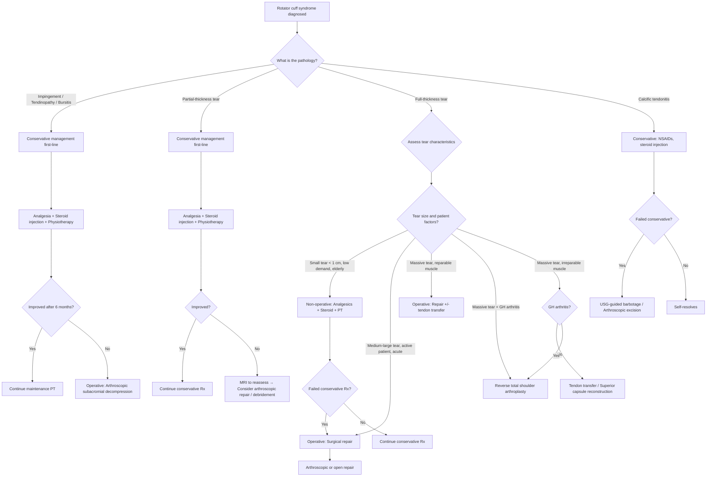

## Management of Rotator Cuff Syndrome

### Guiding Principles

Before diving into specific treatments, understand the **decision-making framework**. The management of rotator cuff syndrome is NOT one-size-fits-all. It depends on matching the pathology to the patient:

***Management depends on the severity of tears*** [1]

**Key considerations** [2]:
- **Age and activity demands of the patient** [2] — a 70-year-old retiree with a medium tear has very different needs from a 45-year-old manual labourer with the same tear
- **Severity of tear on MRI** [2] — partial vs full-thickness, size, reparability (fatty infiltration, retraction)
- **Shoulder arthropathy status** [2] — ***shoulder is not weight-bearing, thus primary OA is uncommon*** [2], but secondary OA from massive cuff tear (cuff tear arthropathy) changes the surgical options entirely
- **Chronicity** — acute traumatic tears in young patients have better healing potential and may warrant earlier surgery; chronic degenerative tears in elderly patients often do well with conservative management
- **Response to conservative treatment** — most guidelines recommend a trial of conservative management before considering surgery (except in specific acute scenarios)

<Callout title="The Fundamental Management Principle">
***Surgical repair usually achieves satisfactory results*** [1], but **not every rotator cuff tear needs surgery**. Many tears — especially partial-thickness tears and small full-thickness tears in low-demand elderly patients — can be managed successfully with conservative treatment. Surgery is reserved for those who fail conservative management or have specific indications for early repair.
</Callout>

---

### Management Algorithm

---

### A. Non-Operative (Conservative) Management

Conservative management is **first-line for the majority of patients** across the rotator cuff syndrome spectrum [2].

#### Who is suitable for non-operative management? [1]

***Non-operative*** management is appropriate when [1]:
- ***Age of patients*** is advanced (lower functional demands) [1]
- ***Demand of patients*** is low [1]
- ***Partial tear*** [1]
- ***Tear < 1 cm*** [1]

The rationale: small tears and tendinopathy have good potential to become asymptomatic with rehabilitation. The tendon may not "heal" structurally, but the patient can become **functionally compensated** — the remaining rotator cuff and periscapular muscles take over the stabilising role, and the inflammation settles.

#### Components of Conservative Management

##### 1. Activity Modification and Education

- Avoid aggravating activities (repetitive overhead reaching, heavy lifting)
- Ergonomic advice for workplace
- Reassurance that many rotator cuff tears are found incidentally and do not always require surgery
- **Smoking cessation** — smoking impairs tendon vascularity and healing capacity

##### 2. Pharmacological — Analgesia [2]

| Agent | Mechanism | Role | Cautions |
|---|---|---|---|
| **Paracetamol** | Central COX inhibition, ↓ prostaglandin synthesis in CNS | First-line, safe for regular use | Hepatotoxicity at supratherapeutic doses |
| **NSAIDs** (e.g., ibuprofen, naproxen) | Peripheral COX-1/2 inhibition → ↓ prostaglandin synthesis → ↓ inflammation and pain | Short courses for acute flare-ups; effective for bursitis and tendinopathy | GI ulceration (COX-1), renal impairment, CV risk. Avoid long-term. Some concern about impaired tendon healing with chronic use |
| **Topical NSAIDs** (e.g., diclofenac gel) | Local COX inhibition with reduced systemic absorption | Alternative when oral NSAIDs are contraindicated | Less effective for deep structures like the subacromial space |
| **Opioids** | μ-opioid receptor agonism in CNS | Short-term for severe acute pain only (e.g., acute calcific tendonitis, post-op) | Dependence, constipation, sedation. NOT for chronic rotator cuff pain |

##### 3. Pharmacological — Corticosteroid Injection [2]

**Subacromial corticosteroid injection** is one of the most commonly used interventions:

- **Mechanism**: Glucocorticoids suppress the inflammatory cascade (inhibit phospholipase A2 → ↓ arachidonic acid release → ↓ prostaglandins AND leukotrienes; suppress NF-κB → ↓ pro-inflammatory cytokine transcription). This reduces subacromial bursitis and peritendinous inflammation.
- **Technique**: Posterior or lateral approach into the subacromial space (NOT into the tendon substance — intratendinous injection weakens collagen and increases tear risk)
- **Expected effect**: Pain relief within 1–2 weeks, lasting 4–12 weeks. Provides a "window of opportunity" for physiotherapy.
- **Limitations**: Typically limited to **3 injections per year** — repeated steroid exposure can accelerate tendon degeneration, cause subcutaneous fat atrophy, and weaken surrounding tissues
- **Contraindications**: Active infection (septic arthritis must be excluded first), bleeding disorder/anticoagulation (relative), allergy to corticosteroid preparation

##### 4. Physiotherapy — The Cornerstone [1][2]

***Physiotherapy*** is the single most important component of conservative management. The lecture slides explicitly list the PT goals [1]:

- ***Muscle strengthening*** [1] — Rotator cuff strengthening exercises (especially supraspinatus and external rotators) restore the force couple, improve dynamic humeral head centring, and compensate for any tendon deficiency
- ***Range of motion exercise*** [1] — Prevent secondary stiffness/adhesive capsulitis; maintain capsular flexibility
- ***Pain relief*** [1] — Modalities including ice therapy, TENS, ultrasound therapy

**The physiological rationale**: Even if the tendon is partially torn, **strengthening the remaining cuff and periscapular muscles** (deltoid, trapezius, serratus anterior, rhomboids) can restore functional shoulder mechanics. The periscapular muscles ensure the scapula rotates properly during elevation, which optimises the subacromial space and reduces impingement.

**Structured rehabilitation phases**:
1. **Phase 1 (0–6 weeks)**: Pain control, gentle pendulum exercises, passive ROM
2. **Phase 2 (6–12 weeks)**: Active-assisted ROM, isometric strengthening
3. **Phase 3 (12+ weeks)**: Progressive resistance training, sport/occupation-specific rehabilitation

<Callout title="Why PT Before Surgery?" type="idea">
Think of PT as "giving the body a chance to compensate." The shoulder has remarkable redundancy — four rotator cuff muscles plus the deltoid plus the periscapular stabilisers. If one tendon (e.g., supraspinatus) is partially torn, the others can often be trained to take over. Surgery carries risks (infection, stiffness, re-tear) and a long rehabilitation. If conservative management achieves the patient's functional goals, surgery is unnecessary.
</Callout>

##### 5. Bio-augmentation [1]

***Bio-augmentation — no evidence to support*** [1]

The lecture slides specifically address biological augmentation techniques (platelet-rich plasma/PRP, growth factors, mesenchymal stem cells):
- ***This information shows that repair surgery should remain the first line of treatment for rotator cuff lesions*** [1]
- While these are active areas of research, current evidence does **not** support their routine clinical use
- Do not recommend PRP or stem cell injections for rotator cuff disease outside of clinical trials

---

### B. Operative Management

#### Indications for Surgery

**For subacromial impingement** [2]:
- ***Failed conservative management for 6 months*** [2]

**For rotator cuff tear** — the indications are more nuanced [1][2]:

***Operative treatment*** is indicated when [1]:
- ***Tear size > 1 cm*** [1]
- ***Recurrent symptoms*** [1]
- ***Weakness*** [1]
- ***Lack of healing*** [1]
- ***Tendon retraction*** [1]
- ***Muscle atrophy*** [1]

From the senior notes [2]:
- ***Failed conservative treatment*** [2]
- ***Large and massive tears*** [2]
- **> 2 weeks since acute traumatic injury** in a young/active patient [2] — the rationale is that acute tears have better healing potential when repaired early before the tendon retracts and the muscle atrophies

**Contraindications to surgical repair**:
- Active infection
- Severe medical comorbidities (unfit for anaesthesia)
- **Irreparable tear**: Goutallier ≥ 3 fatty infiltration, severe muscle atrophy, massive retraction beyond glenoid → the tendon cannot be mobilised back to its footprint, and even if it could, the fatty muscle won't function (these patients need alternative procedures — see below)
- Patient unwilling/unable to comply with post-operative rehabilitation (rehabilitation is critical; without it, the repair will fail)

#### Surgical Options

***Operative treatment*** modalities [1]:

##### 1. ***Debridement*** [1]

- **What**: Arthroscopic removal of frayed, degenerate tendon tissue, inflamed bursal tissue, and loose bodies
- **When**: Partial-thickness tears ( < 50% depth) in older, lower-demand patients; as an adjunct to other procedures
- **Why it works**: Removes the inflammatory tissue that is the pain generator; smooths rough tendon surfaces that catch during movement
- **Limitations**: Does not restore structural integrity of the tendon

##### 2. ***Repair — Open vs Arthroscopic Assisted*** [1]

This is the primary surgical treatment for reparable rotator cuff tears:

**Arthroscopic repair** (most commonly used today):
- **Technique**: Small portals (5 mm incisions), camera and instruments inserted into the subacromial space. The torn tendon edge is mobilised, the greater tuberosity footprint is prepared (to a bleeding bone bed that promotes healing), and the tendon is reattached using **suture anchors** drilled into the bone.
- **Advantages**: Less soft tissue dissection → less post-operative pain, faster rehabilitation, better cosmesis, can address associated pathology simultaneously (bursectomy, acromioplasty, biceps tenotomy/tenodesis)
- **Single-row vs double-row fixation**: Double-row fixation provides a larger footprint contact area and higher initial fixation strength, potentially improving healing rates for larger tears

**Open repair**:
- **When**: Massive tears requiring extensive mobilisation, revision surgery, or when arthroscopic expertise is unavailable
- **Technique**: Deltoid-splitting or deltoid-detaching approach to access the subacromial space and repair the tendon directly

**Associated procedures commonly performed during rotator cuff repair**:

- ***Subacromial bursectomy*** [2]: **Removal of the inflamed subacromial bursa** → increases subacromial space, removes a pain generator, improves visualisation during arthroscopy
- ***Acromioplasty*** [2]: **Removal of a section of the undersurface of the acromion** (usually the anteroinferior spur) → increases subacromial space, removes the source of extrinsic impingement. Also known as subacromial decompression.
- **Biceps tenotomy or tenodesis**: If the long head of biceps is frayed/inflamed (common co-pathology). Tenotomy = simply cut the tendon (simpler, may cause cosmetic Popeye deformity). Tenodesis = cut and reattach the tendon to the humerus (preserves cosmesis and some supination strength).

<Callout title="When to Add Acromioplasty?">
Acromioplasty is typically performed when there is radiographic evidence of a hooked (Type III) acromion, subacromial spurs, or clinical evidence of extrinsic impingement. It is NOT universally performed with every rotator cuff repair — recent evidence suggests that acromioplasty does not add significant benefit to arthroscopic rotator cuff repair in all patients. The decision is individualised based on the anatomy.
</Callout>

##### 3. ***Reconstruction if Failed Repair*** [1]

When primary repair fails (re-tear rate can be 20–70% depending on tear size and patient factors):

- **Revision repair**: If the remaining tendon is of adequate quality
- **Superior capsular reconstruction (SCR)**: A graft (dermal allograft or fascia lata autograft) is placed over the superior aspect of the humeral head to act as a spacer, restoring the superior restraint and preventing humeral head migration. This is a relatively newer technique for irreparable tears without arthritis.
- **Tendon transfer** [2]: For **massive irreparable cuff tears** in young/active patients without arthritis
  - **Latissimus dorsi transfer**: For massive posterosuperior tears (replaces infraspinatus/supraspinatus function)
  - **Pectoralis major transfer**: For irreparable subscapularis tears
  - **Lower trapezius transfer**: Emerging option for posterosuperior tears
  - Rationale: A functioning muscle-tendon unit is re-routed to take over the function of the irreparable cuff

##### 4. ***Replacement if Arthritis*** [1]

**Reverse total shoulder arthroplasty (RTSA)** [2]:

This is the endpoint of the management algorithm for **massive irreparable cuff tears with glenohumeral arthritis** (cuff tear arthropathy):

- **What it is**: The normal ball-and-socket anatomy is literally **reversed** — a hemisphere (ball) is placed on the glenoid side, and a socket is placed on the humeral side
- **Why reverse?** In a normal shoulder, the rotator cuff centres the humeral head on the glenoid. When the cuff is massively torn and irreparable, a conventional (anatomic) arthroplasty would fail because the humeral head would just migrate superiorly again (no cuff to hold it down). The **reverse design** medialises and lowers the centre of rotation, which:
  - Increases the deltoid's lever arm (moment arm) for abduction
  - Allows the deltoid ALONE to power elevation without needing the rotator cuff
  - The fixed fulcrum of the glenosphere prevents superior migration
- **Indications** [2]: ***Massive cuff tears + glenohumeral arthritis*** [2]; also used for failed prior rotator cuff surgery, some complex proximal humerus fractures in elderly
- **Contraindications**: Deltoid dysfunction (the entire prosthesis relies on deltoid function), active infection, severe glenoid bone loss (cannot support the glenosphere), axillary nerve palsy
- **Complications**: Scapular notching (erosion of inferior scapular neck from the humeral component), instability/dislocation, infection, loosening, acromial fracture (increased deltoid tension)

---

### C. Management by Specific Condition — Summary Table

| Condition | First-Line Management | Operative Indications | Operative Options |
|---|---|---|---|
| **Subacromial impingement** | Analgesia, steroid injection, PT (rotator cuff strengthening) [2] | Failed conservative for ***6 months*** [2] | Arthroscopic subacromial decompression (bursectomy + acromioplasty) |
| **Partial-thickness tear** | ***Non-operative*** [1]: analgesics, steroid, PT | Failed conservative; tear progression; > 50% tendon depth | Debridement +/- repair; completion and repair |
| **Small full-thickness tear** ( < 1 cm) | ***Non-operative*** [1]: analgesics, steroid, PT | ***Failed conservative Tx*** [2]; functional impairment | Arthroscopic repair |
| **Medium full-thickness tear** (1–3 cm) | Trial of conservative Rx; consider early repair in young/active | ***Recurrent symptoms, weakness, tendon retraction*** [1] | Arthroscopic repair |
| **Large full-thickness tear** (3–5 cm) | Brief conservative trial; more likely to need surgery | ***Large tears, lack of healing, muscle atrophy*** [1] | Arthroscopic/open repair + bursectomy + acromioplasty |
| **Massive tear** ( > 5 cm / ≥ 2 tendons), reparable | Surgery usually indicated | ***Tear size > 1 cm, weakness, tendon retraction*** [1] | Repair +/- tendon transfer |
| **Massive tear, irreparable** (Goutallier ≥ 3), no arthritis | Conservative Rx or reconstruction | Failed conservative | Tendon transfer / SCR |
| **Massive tear + GH arthritis** (cuff tear arthropathy) | Limited conservative options | Pain and functional impairment | ***Reverse total shoulder arthroplasty*** [2] |
| **Calcific tendonitis** | NSAIDs, subacromial steroid injection | Failed conservative; refractory pain | USG-guided barbotage, ESWT, arthroscopic excision |
| **Secondary frozen shoulder** | Treat underlying cause + analgesics + PT [2] | Stiffness fails to improve after 6 months conservative [2] | MUA / Arthroscopic capsular release [2] |

---

### D. Post-Operative Rehabilitation

Post-operative rehabilitation is **as important as the surgery itself**. A perfectly repaired tendon will fail if not rehabilitated properly:

**Typical post-rotator cuff repair protocol**:

| Phase | Timeframe | Goals | Activities |
|---|---|---|---|
| **Phase 1: Protection** | 0–6 weeks | Protect the repair, control pain and swelling | Sling immobilisation, gentle pendulum exercises, passive ROM only |
| **Phase 2: Early motion** | 6–12 weeks | Restore passive and active-assisted ROM | Remove sling, active-assisted exercises, gentle stretching |
| **Phase 3: Strengthening** | 12–24 weeks | Restore active ROM, begin isometric then isotonic strengthening | Progressive resistance training, rotator cuff and scapular stabiliser exercises |
| **Phase 4: Return to function** | 6–12 months | Full functional recovery, sport/occupation-specific | Full resistance training, overhead activities, sport-specific drills |

<Callout title="Why Is Rehabilitation So Long?" type="idea">
Tendon-to-bone healing is inherently slow. The repaired tendon must integrate with the bone through a fibrocartilaginous transition zone — this biological process takes **12–16 weeks** to achieve reasonable strength. Loading the repair too early (e.g., active overhead reaching at 4 weeks) can pull the suture anchors out of the bone and cause re-tear. Conversely, being too protective for too long causes stiffness. The rehabilitation protocol balances these competing risks.
</Callout>

---

### E. Management of Associated Secondary Frozen Shoulder

As mentioned, **adhesive capsulitis** is a common complication of rotator cuff syndrome (both from the disease itself and post-operatively) [2]. The management approach for frozen shoulder in this context [1][2]:

***Goals of treatment*** [1]: ***Pain relief*** and ***Restore ROM and function*** [1]

Management options [1]:
- ***Continue physiotherapy?*** [1]
- ***Steroid injection?*** [1]
- ***MUA?*** [1]
- ***Arthroscopic capsular release?*** [1]
- ***Combined?*** [1]

The approach depends on the type and phase:

***Frozen shoulder management algorithm*** [1]:
1. **6- to 12-week trial of physiotherapy** for all types
2. If clinical improvement → ***continued maintenance physiotherapy*** [1]
3. If no response:
   - ***Diabetic frozen shoulder***: ***Distension arthrography + intensive physiotherapy*** [1]
   - ***Primary frozen shoulder***: Progressive operative management
   - ***Secondary frozen shoulder***: ***Simultaneous treatment of underlying cause*** [1]
4. If still no response → ***Operative procedure: MUA or arthroscopic arthrolysis*** [1]
5. Surgical approach based on capsular tightness:
   - ***Anterior capsule tight*** → ***Rotator interval/anterior capsular release only*** [1]
   - ***A/P capsule tight*** → ***360° release*** [1]
6. ***Intensive post-operative physiotherapy*** [1]

***PREVENTION is the best treatment for post-traumatic shoulder stiffness*** [1]:
- ***Early mobilisation*** [1]
- ***Adequate pain relief*** [1]

<Callout title="Frozen Shoulder Management Key Points" type="error">

***No consensus exists in management of adhesive capsulitis*** [1]

***Arthroscopic capsular release is one of the options*** [1]:
- ***AVOID releasing too much*** [1] — excessive release can lead to instability
- ***Consider when conservative treatments fail at 3 months*** [1]
- ***Beware of surgical complications*** [1] — axillary nerve injury (runs 3–5 mm from the inferior capsule), residual stiffness
</Callout>

---

<Callout title="High Yield Summary">

**Non-operative is first-line for most patients** — analgesics, subacromial steroid injection, physiotherapy (***muscle strengthening, ROM exercise, pain relief***) [1]

**Non-operative candidates**: ***Age of patient*** (elderly), ***demand of patients*** (low), ***partial tear***, ***tear < 1 cm*** [1]

**Operative indications**: ***Tear > 1 cm, recurrent symptoms, weakness, lack of healing, tendon retraction, muscle atrophy*** [1]; ***failed conservative Tx, large and massive tears*** [2]

**Operative options**: ***Debridement → Repair (open vs arthroscopic) → Reconstruction if failed → Replacement if arthritis*** [1]

**Key surgical adjuncts**: ***Subacromial bursectomy*** and ***Acromioplasty*** to increase subacromial space [2]

**Irreparable massive tears without arthritis**: Tendon transfer (latissimus dorsi / pectoralis major)

**Irreparable massive tears WITH arthritis**: ***Reverse total shoulder arthroplasty*** [2]

***Surgical repair usually achieves satisfactory results*** [1]

***Bio-augmentation has no evidence to support routine use*** [1]

**Post-op rehabilitation is critical**: Phased protocol over 6–12 months; balance protection of repair vs prevention of stiffness

</Callout>

---

<ActiveRecallQuiz
  title="Active Recall - Management of Rotator Cuff Syndrome"
  items={[
    {
      question: "List the indications for operative treatment of rotator cuff tears as stated in the lecture slides.",
      markscheme: "Tear size greater than 1 cm, recurrent symptoms, weakness, lack of healing, tendon retraction, muscle atrophy. Additionally from senior notes: failed conservative treatment, large and massive tears, acute traumatic tear more than 2 weeks since injury in young/active patient."
    },
    {
      question: "A 72-year-old retired woman has a partial-thickness rotator cuff tear with mild symptoms. Outline the non-operative management plan and explain the rationale for each component.",
      markscheme: "1. Activity modification: avoid overhead and aggravating activities to reduce mechanical irritation. 2. Analgesics (paracetamol, short-course NSAIDs): reduce pain and inflammation to enable rehabilitation. 3. Subacromial corticosteroid injection: suppresses inflammation in the subacromial bursa, provides pain relief window for PT. Limited to 3 per year to avoid tendon weakening. 4. Physiotherapy: muscle strengthening (restores force couple, compensates for tendon deficiency), ROM exercises (prevent secondary frozen shoulder), pain relief modalities. Rationale: elderly, low demand, partial tear less than 1 cm - suitable for non-operative management."
    },
    {
      question: "Explain the biomechanical principle behind reverse total shoulder arthroplasty. Why is it used for massive irreparable rotator cuff tears with arthritis instead of a conventional anatomic replacement?",
      markscheme: "In massive irreparable cuff tears, the rotator cuff cannot centre the humeral head on the glenoid. A conventional (anatomic) arthroplasty would fail because deltoid's unopposed superior pull causes superior humeral migration. Reverse TSA reverses the ball-and-socket: a glenosphere (ball) is fixed to the glenoid, a socket on the humeral side. This medialises and lowers the centre of rotation, increasing the deltoid's lever arm for abduction and creating a fixed fulcrum that prevents superior migration. The deltoid alone can power elevation without the rotator cuff."
    },
    {
      question: "What are the four categories of operative treatment for rotator cuff pathology as listed in the lecture slides?",
      markscheme: "1. Debridement (arthroscopic removal of degenerate tissue). 2. Repair (open vs arthroscopic assisted). 3. Reconstruction if failed repair (e.g., tendon transfer, superior capsular reconstruction). 4. Replacement if arthritis (reverse total shoulder arthroplasty)."
    },
    {
      question: "Describe subacromial bursectomy and acromioplasty. What is the purpose of each procedure and when are they performed?",
      markscheme: "Subacromial bursectomy: removal of the inflamed subacromial bursa to increase subacromial space and remove a pain generator. Acromioplasty: removal of a section of the undersurface of the acromion (anteroinferior spur) to increase subacromial space and remove the source of extrinsic impingement. Both are performed during arthroscopic subacromial decompression for failed conservative treatment of impingement, or as adjuncts to rotator cuff repair when impingement morphology is present."
    },
    {
      question: "The lecture slides state that bio-augmentation has no evidence to support its use. What does this mean for clinical practice, and what remains the first-line treatment for rotator cuff lesions?",
      markscheme: "Bio-augmentation techniques including platelet-rich plasma (PRP), growth factors, and mesenchymal stem cells have no current evidence supporting routine clinical use for rotator cuff disease. They should not be recommended outside of clinical trials. Repair surgery should remain the first-line treatment for rotator cuff lesions that require operative intervention, even those at high risk of recurrence."
    }
  ]}
/>

## References

[1] Lecture slides: GC 236. Common Shoulder Problems [Updated in 2025].pdf (pages 82, 87–89, 93–96, 104–105, 117–119, 131)
[2] Senior notes: maxim.md (sections 3.5–3.6, pages 486–489)
