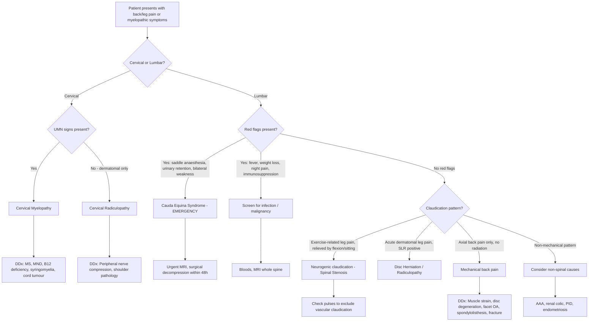

## Differential Diagnosis of Spinal Stenosis

The differential diagnosis of spinal stenosis is really about unpacking the clinical presentation. A patient doesn't walk in and say "I have spinal stenosis" — they present with **back pain**, **leg pain**, **claudication**, **weakness**, or **myelopathic symptoms**. Your job is to figure out which of many possible diagnoses is responsible. Let's work through this systematically.

### Framing the Problem

Spinal stenosis can present in two broad clinical syndromes depending on level:

1. **Lumbar stenosis** → back pain + neurogenic claudication ± radiculopathy ± cauda equina syndrome
2. **Cervical stenosis** → neck pain + myelopathy ± radiculopathy

So the DDx splits into:
- **DDx of the lumbar presentation** (back pain, leg claudication, radiculopathy)
- **DDx of the cervical presentation** (myelopathy, upper limb symptoms)
- **DDx of claudication specifically** (neurogenic vs. vascular — the classic exam question)

---

### A. Differential Diagnosis of Back Pain (The Lumbar Stenosis Presentation)

This is the broadest DDx. The lecture slide [17] lays out the framework beautifully:

#### ***Mechanical pain (97%)*** [17]

These are by far the most common causes. "Mechanical" means the pain relates to the structural/biomechanical elements of the spine and is typically affected by posture and movement.

| Condition | Why it mimics stenosis | How to differentiate |
|---|---|---|
| ***Back sprain / muscle strain ( > 70%)*** [17][2] | Commonest cause of back pain overall. Paraspinal muscle injury → localised back pain, may radiate to buttock. Can be mistaken for early stenosis | No neurological deficit. Pain is muscular (tender paraspinal muscles), worsened by specific movements, improves in days–weeks. No claudication pattern. No imaging abnormality |
| ***Lumbar disc degeneration*** [17] | Chronic discogenic pain from degenerative disc → axial back pain, sometimes referred to buttock/thigh. Part of the same degenerative cascade as stenosis (Kirkaldy-Willis) | Pain is predominantly axial (midline), aggravated by sitting/flexion (loads the disc), NOT positional in the extension-flexion pattern of stenosis. MRI shows disc desiccation (dark disc) but canal remains adequate |
| ***Lumbar disc herniation*** [17] | Acute posterolateral disc protrusion → nerve root compression → radiculopathy (sharp, shooting leg pain in a dermatomal pattern). Can coexist with stenosis | Typically **acute onset**, often precipitated by lifting/bending. **SLR strongly positive** (vs. only ~10% in stenosis [15]). Pain follows a specific dermatome. Younger patients. MRI shows focal disc protrusion compressing a single root |
| ***Spondylolisthesis*** [17] | Forward slip of one vertebra → can narrow the canal (actually *causes* stenosis) or the foramen. Presents with back pain ± radiculopathy ± claudication | XR shows the slip (lateral view). Often at L4/5 (degenerative) or L5/S1 (isthmic). Can coexist with stenosis — in fact, spondylolisthesis with stenosis changes the surgical approach (decompression + fusion needed [3]) |
| ***Fracture — vertebral body*** [17] | Compression fracture (osteoporotic or pathological) → acute back pain. If retropulsed fragments enter canal → stenosis/cord compression | Acute onset, often with minimal trauma in elderly/osteoporotic patients. Point tenderness over spinous process. XR/CT shows fracture. Red flag: chronic steroid use, osteoporosis [2] |
| ***Spondylolysis*** [17] | Pars interarticularis defect → back pain, especially in young athletes with repetitive extension (e.g., gymnasts, fast bowlers). No slip = no stenosis, but can progress to spondylolisthesis | Young patient. Pain with extension. Oblique XR shows "Scotty dog" fracture. CT confirms pars defect. No neurological signs unless progressed to listhesis |

#### ***Non-mechanical pain (3%)*** [17]

These are the "red flag" causes — less common but more dangerous. Always screen for these.

| Condition | Why it mimics stenosis | How to differentiate |
|---|---|---|
| ***Neoplasia*** [17] | Spinal metastases or primary tumours → progressive back pain ± cord/root compression. Can actually cause stenosis by space-occupying effect | **Red flags**: unrelenting pain (worse at night, not relieved by rest), weight loss, history of primary malignancy (lung, breast, prostate, kidney, thyroid). No mechanical pattern. Raised inflammatory markers. MRI shows bony/soft tissue mass |
| ***Inflammatory arthritis — AS/spondyloarthropathy*** [17] | Inflammatory back pain → morning stiffness > 30 min, improves with exercise, worsens with rest. Late: bamboo spine → rigid → prone to fracture → stenosis | Young male ( < 40), insidious onset, HLA-B27+, sacroiliitis on XR/MRI, raised CRP/ESR. Pain pattern is opposite to mechanical (better with activity, worse at rest) |
| ***Infection*** [17] | TB spine (Pott's disease), pyogenic discitis/osteomyelitis, epidural abscess → back pain ± cord/root compression ± constitutional symptoms | Fever, night sweats, weight loss, immunosuppression (HIV, DM, IVDU). Raised WCC/CRP/ESR. MRI shows disc/endplate destruction, paravertebral or epidural collection. **Red flag**: fever + immunosuppression [2] |

#### ***Non-spinal diseases (referred pain)*** [17]

These are extra-spinal pathologies that can refer pain to the back, mimicking spinal disease:

| Condition | Mechanism of Referred Pain |
|---|---|
| ***Pelvic inflammatory disease*** [17] | Pelvic visceral afferents share spinal segments (T10–L1) with somatic innervation of lower back |
| ***Endometriosis*** [17] | Cyclical pain, may involve uterosacral ligaments → referred lumbosacral pain |
| ***Nephrolithiasis / Pyelonephritis*** [17] | Renal capsule distension and ureteric spasm → referred flank/back pain via T10–L1 afferents. Costovertebral angle tenderness, haematuria, dysuria distinguish these |
| ***Aortic aneurysm*** [17] | Expanding or leaking AAA → deep, boring back pain. Can compress lumbar vertebral bodies. **Life-threatening** — always consider in elderly patient with acute back pain + haemodynamic instability |

<Callout title="The 'Surgical Sieve' for Back Pain DDx" type="idea">
A useful mnemonic to remember the categories: **VITAMIN CD** — **V**ascular (AAA), **I**nfection (TB, abscess), **T**rauma (fracture), **A**utoimmune/inflammatory (AS, RA), **M**etabolic (osteoporotic fracture), **I**diopathic, **N**eoplastic (mets), **C**ongenital, **D**egenerative (spondylosis, disc, stenosis). The lecture categorises them as mechanical (97%) vs. non-mechanical (3%) — but always actively screen for the 3%.
</Callout>

---

### B. Differential Diagnosis of Claudication — Neurogenic vs. Vascular

This is one of the highest-yield comparisons in the entire orthopaedic and vascular surgery curriculum. Both cause exercise-induced leg symptoms, but the pathophysiology is completely different.

***Claudication vs. radiculopathy*** — the lecture slide [1] emphasises that you must distinguish these two patterns. Neurogenic claudication is bilateral and positional; radiculopathy is typically unilateral and dermatomal.

| Feature | ***Vascular Claudication*** | ***Neurogenic Claudication*** |
|---|---|---|
| **Underlying cause** | ***Chronic limb ischaemia (PAD)*** [2][15] | ***Spinal stenosis*** [2][15] |
| **Radiation of pain** | ***From distal to proximal*** (starts in calf, moves up) — because distal muscles are furthest from blood supply and become ischaemic first [2][15] | ***From proximal to distal*** (starts in buttock/thigh, moves down) — because proximal nerve roots in the narrowed central canal are compressed first [2][15] |
| **Exacerbating factor** | ***Walking uphill***, exercise [2][15] — uphill demands more calf muscle work → more O₂ demand → ischaemia | ***Walking downhill***, increased lordosis [2][15] — downhill requires leaning back (extension) → canal narrows by 11%, foramina by 15% [1] |
| **Relieving factor** | ***Rest alone ("shop window to shop window")*** [2][15] — stopping reduces O₂ demand → supply catches up | ***Bending over, sitting ("park bench to park bench")*** [2][15] — flexion opens the canal → decompresses neural elements. Just stopping is not enough — posture must change |
| **Peripheral pulses** | ***Absent*** [2][15] — atherosclerotic occlusion | ***Present*** [2][15] — no vascular pathology |
| **Claudication distance** | Fixed and reproducible (same distance each time) | Variable (depends on spinal position, terrain) [15] |
| **Cycling** | Provokes symptoms (exercise = more O₂ demand) | Does NOT provoke symptoms (seated position = flexion = canal open) |
| **Associations** | ***Atherosclerotic risk factors, atrophic skin changes*** [15] | ***Only 10% SLR positive, back pain*** [15] |
| **Examination** | Absent pulses, bruits, trophic changes (hair loss, thin skin, nail changes), reduced ABPI | Normal vascular exam. May have subtle neurological signs. Stoop test positive |

**Additional vascular DDx of leg pain with walking** (from senior notes [18]):
- ***Sciatica*** [18]: radiculopathy (L5–S1 from herniated disc) → sharp/burning pain radiating down posterior/lateral leg. Not truly exercise-dependent; aggravated by sitting/coughing/straining (increased intrathecal pressure)
- ***Arthritis of hip or foot*** [18]: joint-based pain, worsened by weight-bearing, localised to joint, limited ROM on examination
- ***Chronic compartment syndrome*** [18]: typically young athletes with heavy musculature. Reversible increased pressure within a muscle compartment during exercise → pain/tightness. Subsides with rest. Diagnosed by intracompartmental pressure measurement
- ***Baker's cyst*** [18]: popliteal synovial cyst → posterior knee pain/swelling. Can compress popliteal vein or tibial nerve → mimics vascular or neurogenic symptoms

---

### C. Differential Diagnosis of Cervical Myelopathy (The Cervical Stenosis Presentation)

When a patient presents with UMN signs in the limbs, gait disturbance, and myelopathic hand signs, the DDx extends beyond just cervical stenosis [19]:

| Condition | Why it mimics cervical stenosis | Key differentiating features |
|---|---|---|
| ***Cervical myelopathy*** (from stenosis) [19] | This IS the diagnosis — but the point is that myelopathy symptoms can overlap with other conditions | Progressive, insidious. UMN signs. Myelopathic hand signs. MRI shows cord compression |
| ***Peripheral nerve compression*** [19] | e.g., carpal tunnel syndrome (median nerve), cubital tunnel syndrome (ulnar nerve). Hand weakness/numbness can be mistaken for myelopathy | Symptoms restricted to a single peripheral nerve distribution (not UMN pattern). No LL signs. NCS/EMG localises the lesion to peripheral nerve. **Double crush syndrome** [20]: peripheral entrapment can coexist with cervical spondylosis — proximal compression renders the nerve more susceptible to distal compression |
| ***Shoulder pathology*** [19] | Shoulder impingement, rotator cuff tear, frozen shoulder → arm pain/weakness that can mimic cervical radiculopathy | Pain localised to shoulder, specific provocative tests positive (Neer's, Hawkins, empty can), ROM limitation. No dermatomal sensory loss. No UMN signs |
| **Motor neuron disease (ALS)** | Progressive UMN + LMN signs → weakness, fasciculations, spasticity. Can affect upper and lower limbs | No sensory involvement (pure motor). Fasciculations prominent. Bulbar symptoms (dysarthria, dysphagia) develop. EMG shows widespread denervation. No pain |
| **Multiple sclerosis** | Demyelinating disease → UMN signs, sensory disturbance, Lhermitte's sign. Can cause myelopathy | Younger patient (20–40). Relapsing-remitting course. Visual symptoms (optic neuritis). MRI brain shows periventricular white matter lesions. CSF shows oligoclonal bands |
| **Subacute combined degeneration (B12 deficiency)** | Dorsal column + corticospinal tract degeneration → sensory ataxia + UMN signs. Mimics posterior cord compression | Peripheral neuropathy (glove-and-stocking), macrocytic anaemia, low B12, psychiatric symptoms. No structural compression on MRI |
| **Syringomyelia** | Central cavity in the cord → "cape-like" dissociated sensory loss (loss of pain/temperature, preserved light touch). Can cause hand weakness | MRI shows syrinx. Chiari malformation often associated. Dissociated sensory loss is the hallmark |
| **Spinal cord tumour** | Intradural or extradural mass → progressive myelopathy | Progressive course, night pain, weight loss if malignant. MRI shows mass lesion with cord compression |
| **Compressive myelopathy from other causes** [21] | Epidural haematoma, abscess, OPLL | Each has distinct clinical context: haematoma (post-procedural/anticoagulated), abscess (fever, immunocompromised), OPLL (Asian patient, younger age) |

<Callout title="Exam Pitfall: Myelopathy vs. Peripheral Neuropathy" type="error">
A common mistake is attributing myelopathic hand signs to peripheral nerve compression. The key distinguishing feature is the presence of **UMN signs** (hyperreflexia, Hoffmann's, upgoing plantars, clonus) in myelopathy, which are **never** present in peripheral nerve compression (which only gives LMN signs). If a patient has hand clumsiness AND hyperreflexia in the legs — that's myelopathy until proven otherwise.
</Callout>

---

### D. Differential Diagnosis of Cauda Equina Syndrome

Since ***severe stenosis*** or ***large central disc herniation*** can cause cauda equina syndrome [1], you should also know the DDx of CES itself:

| Cause | Mechanism |
|---|---|
| **Massive central disc herniation** (most common) | Large NP fragment compresses the entire cauda equina at L4/5 or L5/S1 |
| **Chronic deterioration of spinal stenosis** [1] | Progressive narrowing → eventually critical compression of cauda equina |
| **Spinal fracture** (traumatic/pathological) | Retropulsed bone fragments into the canal |
| **Malignancy** (metastasis) | Space-occupying lesion within the spinal canal — paired organs: thyroid, breast, lung, kidney, prostate [2] |
| **Infection** (discitis, TB spine, epidural abscess) | Expanding inflammatory mass/collection within the canal |
| **Inflammatory** (AS) | Rarely, but fracture through a fused bamboo spine can cause CES |
| **Iatrogenic** (haematoma post-spinal anaesthesia) [2] | Epidural haematoma compresses cauda equina — more common in anticoagulated patients |

---

### E. Clinical Approach — Decision Framework

---

### F. Summary Table — Key Differentiating Features

| Feature | Spinal Stenosis | Disc Herniation | Vascular Claudication | Inflammatory (AS) | Infection | Malignancy |
|---|---|---|---|---|---|---|
| **Age** | > 50 | 30–50 | > 50 | < 40 | Any | Any (but > 50) |
| **Onset** | Insidious | Acute/subacute | Insidious | Insidious | Subacute | Progressive |
| **Pain character** | Claudication, bilateral | Radicular, unilateral | Calf cramping | Stiffness, ache | Constant, boring | Unrelenting, nocturnal |
| **Positional** | Worse extension, better flexion | Worse sitting/flexion | Worse exercise, better rest | Worse rest, better activity | No positional relief | No positional relief |
| **SLR** | 10% positive | Strongly positive | Negative | Negative | May be positive | May be positive |
| **Pulses** | Present | Present | Absent | Present | Present | Present |
| **Neurological signs** | Variable, often subtle | Dermatomal deficit | None | Late: rigid spine | If abscess: rapid deficit | Progressive deficit |
| **Red flags** | CES features | CES if central | Gangrene, tissue loss | Uveitis, enthesitis | Fever, immunosuppression | Weight loss, night pain |

<Callout title="High Yield Summary">

**The DDx of spinal stenosis is structured by presentation:**

1. **Back pain DDx** — ***Mechanical (97%)***: muscle strain ( > 70%), disc degeneration, disc herniation, spondylolisthesis, fracture, spondylolysis. ***Non-mechanical (3%)***: neoplasia, inflammatory arthritis (AS), infection. ***Non-spinal***: AAA, renal, gynaecological [17].

2. **Claudication DDx** — The must-know comparison is ***neurogenic vs. vascular claudication***: neurogenic = proximal→distal, pulses present, worse downhill/extension, better flexion/sitting ("park bench to park bench"); vascular = distal→proximal, pulses absent, worse uphill/exercise, better rest ("shop window to shop window") [2][15].

3. **Cervical stenosis/myelopathy DDx** — ***Peripheral nerve compression, shoulder pathology*** [19] are the main mimics. Also consider MS, MND, B12 deficiency, syringomyelia, cord tumour. Key: UMN signs = myelopathy, not peripheral.

4. **Always screen for red flags**: CES (saddle anaesthesia, urinary retention, bilateral weakness), infection (fever, immunosuppression), fracture (steroid use, osteoporosis), malignancy (weight loss, night pain) [2].

5. **Double crush syndrome** [20]: peripheral entrapment often coexists with cervical spondylosis — proximal compression makes the nerve more susceptible to distal injury.

</Callout>

---

<ActiveRecallQuiz
  title="Active Recall - Differential Diagnosis of Spinal Stenosis"
  items={[
    {
      question: "A 65-year-old smoker with diabetes presents with bilateral calf pain on walking 100m. How would you differentiate neurogenic from vascular claudication at the bedside?",
      markscheme: "Check peripheral pulses (absent in vascular, present in neurogenic). Ask about relieving posture (vascular: rest alone; neurogenic: must change posture to flexion). Ask about terrain (vascular: worse uphill; neurogenic: worse downhill). Look for trophic changes and measure ABPI if vascular suspected. SLR only 10% positive in stenosis."
    },
    {
      question: "According to the lecture slides, what percentage of back pain is mechanical vs. non-mechanical? Name 3 causes of each.",
      markscheme: "Mechanical 97%, non-mechanical 3%. Mechanical: back sprain (more than 70%), lumbar disc degeneration, lumbar disc herniation, spondylolisthesis, fracture, spondylolysis. Non-mechanical: neoplasia, inflammatory arthritis (AS/spondyloarthropathy), infection. Also non-spinal diseases (AAA, renal, gynaecological)."
    },
    {
      question: "A patient with cervical myelopathy has hand clumsiness and hyperreflexia in the legs. Name 3 conditions in the DDx of cervical myelopathy from the lecture slides and explain one key differentiating feature for each.",
      markscheme: "1. Peripheral nerve compression - no UMN signs, single nerve distribution. 2. Shoulder pathology - pain localised to shoulder, specific provocative tests positive, no neurological deficit. 3. Also consider MS (younger, relapsing-remitting, brain MRI lesions), MND (no sensory loss, fasciculations), B12 deficiency (macrocytic anaemia, peripheral neuropathy). The lecture lists: cervical myelopathy itself, peripheral nerve compression, shoulder pathology."
    },
    {
      question: "Explain the concept of double crush syndrome and its relevance to differentiating spinal stenosis from peripheral nerve compression.",
      markscheme: "Double crush syndrome: proximal compression of a peripheral nerve (e.g., cervical spondylosis compressing nerve root) renders it more susceptible to distal injury (e.g., carpal tunnel syndrome). Relevance: patients may have BOTH cervical stenosis AND peripheral nerve compression simultaneously. Must investigate both levels. A patient with hand numbness may have cervical radiculopathy, carpal tunnel syndrome, or both."
    },
    {
      question: "Name 4 red flags in a patient presenting with back pain that should prompt urgent investigation, and state what each suggests.",
      markscheme: "1. Saddle anaesthesia, urinary retention, faecal incontinence - cauda equina syndrome (most important to rule out). 2. Fever plus immunosuppression - infection (discitis, epidural abscess, TB spine). 3. Chronic steroid use, osteoporosis - pathological fracture. 4. Unexplained weight loss, night pain not relieved by rest - malignancy."
    }
  ]}
/>

## References

[1] Lecture slides: GC 226. Lumbar Spine Pathology_Part F (2).pdf, p2–3
[2] Senior notes: maxim.md (sections 2.3, 2.5 — approach to spine diseases, spinal stenosis, cauda equina syndrome)
[3] Senior notes: maxim.md (section 2.6 — spondylolisthesis, PID)
[15] Senior notes: maxim.md (vascular vs neurogenic claudication comparison table, section on chronic limb ischaemia)
[17] Lecture slides: GC 226. Lumbar Spine Pathology_Part E (2).pdf, p2
[18] Senior notes: felixlai.md (section on differential diagnosis of intermittent claudication)
[19] Lecture slides: GC 227. Cervical Spine Pathology.pdf, p44
[20] Senior notes: maxim.md (section 5.2 — compression neuropathy, double crush syndrome)
[21] Senior notes: maxim.md (section 2.4 — cervical myelopathy etiology)
