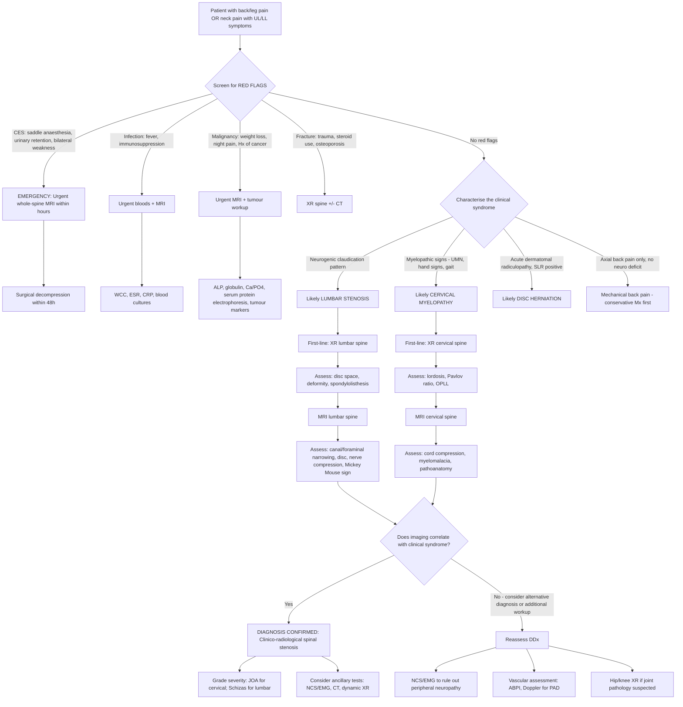

## Diagnostic Criteria, Algorithm, and Investigations for Spinal Stenosis

### Why There Are No "Formal Diagnostic Criteria" — and What We Use Instead

Let's be clear upfront: unlike conditions such as rheumatoid arthritis or SLE, there is **no single universally accepted set of "diagnostic criteria"** for spinal stenosis (no ACR criteria, no scoring threshold that gives you a binary yes/no). This is because spinal stenosis exists on a **spectrum** — from radiographic narrowing in an asymptomatic 70-year-old (very common, not a diagnosis) to severe canal compromise causing cauda equina syndrome.

The diagnosis is therefore **clinico-radiological**: it requires the **combination** of:
1. **Compatible clinical syndrome** (neurogenic claudication ± radiculopathy for lumbar; myelopathy ± radiculopathy for cervical)
2. **Imaging evidence** of spinal canal or foraminal narrowing that **correlates** with the clinical findings

> The golden rule: **treat the patient, not the MRI**. Many elderly patients have radiographic stenosis with zero symptoms. The diagnosis only exists when symptoms and imaging match.

---

### Diagnostic Framework — What Constitutes the "Diagnosis"

#### Lumbar Spinal Stenosis

The diagnosis rests on three pillars:

| Pillar | Detail |
|---|---|
| **1. Clinical syndrome** | ***Neurogenic claudication***: walking increases severity of ***burning/aching pain, numbness, paraesthesia, or subjective weakness*** [1]. ***Pain worse with extension***, ***improves with rest and flexion*** [1]. ± ***Leg and/or back pain, motor deficit, sensory disturbance, reflex alterations*** [1]. |
| **2. Imaging correlation** | MRI showing canal, lateral recess, or foraminal narrowing at a level consistent with the clinical picture (correct dermatome/myotome) |
| **3. Exclusion of mimics** | Vascular claudication excluded (pulses present), peripheral neuropathy excluded, hip/knee OA excluded |

#### Cervical Spinal Stenosis (Cervical Myelopathy)

| Pillar | Detail |
|---|---|
| **1. Clinical syndrome** | Myelopathic signs (UMN signs in limbs, myelopathic hand signs, gait disturbance) ± radiculopathy |
| **2. Imaging correlation** | MRI showing cord compression ± ***intramedullary signal change (myelomalacia)*** [22] at a level consistent with clinical findings |
| **3. Severity grading** | ***JOA score*** (total 17 points) [2] — quantifies functional impairment and guides surgical decision-making |

#### Cervical Stenosis Measurement Thresholds [6]

These are quantitative imaging criteria that help define stenosis objectively:

| Measurement | Definition | Threshold |
|---|---|---|
| ***a = Midsagittal diameter of spinal canal*** | AP diameter of the bony canal on lateral XR or CT | ***Relative stenosis if < 12 mm; absolute if < 10 mm*** [6] |
| ***b = Dynamic stenosis*** | Distance from posteroinferior corner of cranial vertebra to anterosuperior edge of caudal lamina | ***Dynamic stenosis if < 12 mm*** [6] |
| ***c = Olisthesis*** | Slip distance between adjacent vertebral bodies | Measured in mm — any slip suggests instability |
| ***Pavlov ratio*** | Ratio of AP diameter of canal to diameter of vertebral body at same level | ***< 0.8 suggests stenosis*** [2] |

#### Lumbar Stenosis Imaging Criteria

| Measurement | Threshold | Notes |
|---|---|---|
| **AP diameter of canal** | < 12 mm relative; < 10 mm absolute | Measured on axial CT or MRI |
| **Dural sac cross-sectional area** | < 100 mm² moderate; < 75 mm² severe | On axial MRI — this is the most clinically relevant measure |
| **Lateral recess height** | < 4 mm | Suggests lateral recess stenosis compressing traversing root |
| **Foraminal height** | < 15 mm | Suggests foraminal stenosis compressing exiting root |

<Callout title="The Imaging-Clinical Disconnect" type="error">
A critical concept: up to 20–30% of asymptomatic people over 60 have imaging evidence of lumbar stenosis. Conversely, some patients with classic neurogenic claudication have only modest narrowing on MRI. **Never diagnose stenosis on imaging alone** — always correlate with the clinical presentation. The question on the exam is not "Is the canal narrow?" but "Does the narrowing explain this patient's symptoms?"
</Callout>

---

### Diagnostic Algorithm

The clinical approach follows a logical sequence: history → examination → exclude red flags → first-line imaging → advanced imaging → ancillary tests.

---

### Investigation Modalities — Detailed Interpretation

#### 1. Plain Radiographs (XR Spine) — First-Line

XR is the **starting point** because it is cheap, widely available, and gives you critical structural information. However, it cannot directly visualise soft tissues (discs, ligaments, neural structures).

##### Cervical Spine XR [2][23]

**Views**: ***AP, lateral*** [23], ***oblique views for foraminal narrowing*** [23]

| Finding | What It Means | Mechanism/Significance |
|---|---|---|
| ***Loss of cervical lordosis*** [2] | Normal cervical spine has a lordotic curve; loss suggests muscular splinting, degenerative disc disease, or chronic myelopathy | Paraspinal muscles go into spasm to protect the cord → straightening of the spine |
| ***Pavlov ratio < 0.8*** [2] | Ratio of canal AP diameter to vertebral body AP diameter. A ratio < 0.8 means the canal is disproportionately narrow | Suggests either developmental or acquired stenosis. Quick bedside calculation on lateral XR |
| **Osteophytes** | Bony spurs at vertebral body margins or uncovertebral joints | Degenerative — can encroach on the canal or foramina |
| **Reduced disc height** | Loss of disc space height | Disc degeneration → loss of NP height → secondary canal narrowing |
| ***OPLL visible as calcification along PLL*** | Radiopaque line posterior to vertebral bodies | Ossified PLL compressing the cord anteriorly. Better delineated on CT [25] |
| **Dynamic instability** | Assessed on flexion-extension views — abnormal translation or angulation between adjacent vertebrae | Suggests spondylolisthesis or ligamentous instability contributing to dynamic stenosis |

**Soft tissue assessment (C-spine specific)** [2]:
- ***3×7=21 rule***: prevertebral soft tissue width: C1 ≤ 10 mm, C3 ≤ 7 mm, C7 ≤ 21 mm
- Widened prevertebral soft tissue suggests retropharyngeal haematoma/abscess or fracture

##### Lumbar Spine XR [2][24]

**Views**: AP, lateral, ± oblique (for pars defects)

The lecture slide [24] emphasises three key things to assess on lumbar XR:

| Finding | What It Means |
|---|---|
| ***Disc space*** [24] | Reduced disc height indicates degeneration. Normal disc height: L4/5 > L5/S1 > L3/4 [3]. Asymmetric loss suggests focal pathology |
| ***Deformity*** [24] | ***Loss of lumbar lordosis*** [2], scoliosis (degenerative), kyphosis (compression fracture). Loss of lordosis is the body's attempt to open the canal (flexion posture adopted chronically) |
| ***Spondylolisthesis*** [24] | Forward slip visible on lateral view. Graded by Meyerding classification (I–V based on % slip). L4/5 (degenerative) or L5/S1 (isthmic) most common |
| **Calcification of PLL/LF** [2] | Indicates OPLL or OLF — potential compressive pathology |
| **Spondylolysis** | Pars interarticularis defect — best seen on oblique view ("Scotty dog" with collar = pars fracture). May be precursor to spondylolisthesis |

***X-ray: correlation with symptoms is essential*** [22a]. The lecture emphasises that XR should be interpreted with ***positive history*** and used to screen for ***malignancy and infection*** — but beware ***false assurance*** as normal XR does NOT exclude stenosis [22a].

<Callout title="When to Get XR vs. Going Straight to MRI" type="idea">
In the **acute setting** (trauma, suspected fracture), get XR first (or CT if high-energy). For **chronic neurogenic claudication** with no red flags, you can start with XR to assess alignment, disc height, and listhesis, then proceed to MRI if surgery is being considered. For **suspected cauda equina syndrome or myelopathy**, go straight to **urgent MRI** — do not wait for XR.
</Callout>

---

#### 2. MRI Spine — The Gold Standard

MRI is the **definitive investigation** because it directly visualises soft tissues: discs, ligaments, neural structures, cord, and CSF. It is the only modality that can confirm neural compression and cord signal change.

##### Cervical Spine MRI — What to Look For [22]

The lecture slide [22] specifies a systematic MRI interpretation framework:

| Feature | What to Assess | Significance |
|---|---|---|
| ***Level of lesion, location*** [22] | Which disc level? Central, lateral, foraminal? | Determines which neural structure is compressed and guides surgical approach |
| ***Pathoanatomy*** [22] | ***Disc, osteophyte, OPLL, flavum*** — what is causing the compression? | Each has different surgical implications (anterior vs. posterior approach [see Management section]) |
| ***Obliteration of the CSF space*** [22] | On T2-weighted images, CSF appears bright (white). If the bright CSF signal is obliterated around the cord → significant compression | The "CSF buffer" is gone — the cord is being squeezed. Loss of CSF space even without cord signal change indicates at-risk cord |
| ***Cord shape / cross-sectional area*** [22] | Flattened or banana-shaped cord on axial views indicates external compression | Normal cord is round/oval. Flattening means mechanical deformation |
| ***Intramedullary signal change (myelomalacia)*** [22] | T2 hyperintensity within the cord substance | Indicates **irreversible cord damage** — gliosis and oedema within the cord. This is a poor prognostic sign for recovery after surgery. T1 hypointensity = even worse (cavitation/necrosis) |

##### Lumbar Spine MRI — What to Look For [3]

| Feature | What to Assess | Significance |
|---|---|---|
| ***Disc: signal intensity*** [3] | T2-weighted: normal disc is bright (hydrated NP). Dark disc = desiccated, degenerated | Dark disc on T2 = loss of aggrecan and water content — the starting point of the degenerative cascade |
| ***Disc height*** [3] | ***Normal: L4/5 > L5/S1 > L3/4*** [3] | Reduced height indicates degeneration at that level |
| ***PID — high-intensity zone*** [3] | Bright spot within the posterior annulus on T2 | Indicates ***annular tear with oedema/inflammation*** — clinically significant, often a pain generator |
| ***Neural tissues: "Mickey Mouse" sign*** [3] | On axial T2 images at the lumbar level, the thecal sac in cross-section looks like Mickey Mouse's head (the dural sac) with two ears (the traversing nerve roots in the lateral recesses) | If the "Mickey Mouse" is compressed/distorted — the nerve roots are being squeezed. If you can't see it at all, you have severe central stenosis |
| **Degree of canal compromise** | Schizas classification (Grade A–D based on CSF visibility and rootlet aggregation) | Grades severity of compression — useful for surgical decision-making |
| **Foraminal compromise** | Exiting root surrounded by fat (white on T1) vs. no fat visible | Loss of perineural fat = foraminal stenosis compressing the exiting root |
| ***Cord oedema*** [3] | T2 hyperintensity in the cord (if conus involvement at thoracolumbar junction) | Same significance as myelomalacia in cervical cord |

**MRI sequences and what they show:**

| Sequence | What It's Best For | Key Interpretation |
|---|---|---|
| **T1-weighted** | Anatomy, fat (bright), marrow | Fat around nerve roots appears white — loss of fat signal = compression. Bone marrow replacement (tumour/infection) appears dark |
| **T2-weighted** | Fluid (CSF bright), pathology, cord signal | CSF is white → can see compression by loss of white signal around cord/roots. Disc degeneration = dark disc. Cord myelomalacia = bright within cord |
| **STIR** | Oedema, inflammation (fat suppressed) | Bone marrow oedema (fracture, infection, tumour). Soft tissue inflammation |
| **T1 + gadolinium** | Enhancement (tumour, infection, inflammation) | Enhancing mass = tumour or abscess wall. Post-surgical scar vs. recurrent disc (scar enhances, disc doesn't) |

---

#### 3. CT Spine

CT provides excellent **bony detail** and is superior to MRI for certain indications.

##### ***For nerve tissues*** [26]:

| Modality | Best For |
|---|---|
| ***CT*** [26] | ***Fracture configuration*** — precise bony anatomy, retropulsed fragments, facet joint morphology |
| ***CT myelogram*** [26] | When MRI is contraindicated (pacemaker, severe claustrophobia). Intrathecal contrast outlines the thecal sac and nerve roots → shows compression indirectly |
| ***MRI*** [26] | ***Nerve compression, sinister pathologies, confirmation of lesions*** [26] |

##### Specific CT Findings in Stenosis:

| Finding | Significance |
|---|---|
| **Facet joint hypertrophy** | Bony overgrowth of superior/inferior articular processes → lateral recess and foraminal narrowing |
| **Osteophytes** | Bony spurs from vertebral endplates or uncovertebral joints → canal or foraminal encroachment |
| ***OPLL — plain CT to delineate ossification of posterior longitudinal ligament*** [25] | CT is **superior to MRI** for characterising OPLL because ossified tissue appears as dense bone on CT. MRI may underestimate the extent of ossification (bone and ligament both appear dark on MRI). CT shows the exact morphology: continuous, segmental, mixed, or localised type |
| **Ligamentum flavum ossification** | Dense calcification along the posterior canal wall |
| **Pars defect** | Spondylolysis — CT is more sensitive than XR for detecting pars fractures |

---

#### 4. Dynamic (Flexion-Extension) Radiographs [25]

***Dynamic X-rays to diagnose atlantoaxial subluxation in rheumatoid arthritis*** [25] — and more generally to assess instability.

| Purpose | What to Look For |
|---|---|
| **Lumbar instability** | > 4 mm translation or > 10° angulation between adjacent vertebrae on flexion vs. extension views → unstable spondylolisthesis |
| **Cervical instability** | Increased atlantodental interval (ADI) on flexion (normal < 3 mm in adults). ADI > 3 mm suggests C1/2 instability (RA, Down syndrome, trauma) |
| **Dynamic stenosis** | Canal narrows in extension, opens in flexion — quantifies the dynamic component |

**Why this matters**: if spondylolisthesis is present AND dynamic (increases with movement), surgery requires **fusion** in addition to decompression [3]. A fixed slip may only need decompression.

---

#### 5. Electrodiagnostic Studies (NCS/EMG) [23]

***NCV / EMG*** [23] — these are ancillary tests that help:

| Test | What It Does | When to Use |
|---|---|---|
| **Nerve Conduction Studies (NCS)** | Measures speed and amplitude of electrical conduction along peripheral nerves | Differentiates **radiculopathy** (normal distal conduction, abnormal proximal) from **peripheral neuropathy** (abnormal distally). Helps exclude diabetic neuropathy or carpal tunnel as the cause of symptoms |
| **Electromyography (EMG)** | Needle electrode inserted into muscles; detects denervation potentials (fibrillations, positive sharp waves) | Confirms which specific nerve root is affected (e.g., denervation in L5-innervated muscles confirms L5 radiculopathy). Also helps determine chronicity (acute vs. chronic denervation) |
| **Somatosensory Evoked Potentials (SSEP)** [27] | Stimulate peripheral nerve → record cortical response. Measures entire sensory pathway from periphery to cortex | Helps confirm myelopathy (prolonged central conduction time). Used intraoperatively to monitor cord function during cervical decompression |

<Callout title="When NCS/EMG Is Most Useful">
NCS/EMG is most valuable when: (1) clinical and MRI findings don't match (e.g., multilevel disease on MRI but symptoms suggest single root), (2) distinguishing radiculopathy from peripheral neuropathy (e.g., diabetic patient with foot drop — is it L5 radiculopathy or peroneal neuropathy?), (3) suspected double crush syndrome (cervical stenosis + carpal tunnel). Remember: **normal NCS does not rule out the diagnosis** — it's a supportive, not definitive test.
</Callout>

---

#### 6. Blood Investigations [22a]

Bloods are **not for diagnosing stenosis itself** but for **excluding red-flag pathologies** (infection, malignancy, metabolic bone disease).

The lecture slide [22a] lists the following as relevant investigations:

| Test | Purpose | When to Order |
|---|---|---|
| ***WCC*** [22a] | Elevated in infection (pyogenic spondylodiscitis, epidural abscess) | Fever, immunosuppression, acute deterioration |
| ***ESR*** [22a] | ***High blood fibrinogen causes RBC to stick to each other*** [22a] → elevated in infection, inflammation, malignancy. Non-specific but sensitive screening test | Suspected infection (TB, pyogenic), malignancy, inflammatory arthritis |
| ***CRP*** [22a] | ***6–8 hours after onset of infection*** [22a] → more acute-phase marker than ESR. Rises and falls faster | Same as ESR — helps monitor treatment response |
| ***Alkaline phosphatase (ALP)*** [22a] | Elevated in bony metastases (osteoblastic activity), Paget's disease, healing fractures | Suspected malignancy or metabolic bone disease |
| ***Globulin level*** [22a] | Elevated in multiple myeloma (monoclonal gammopathy) | Suspected myeloma — an important cause of pathological vertebral fracture |
| ***Ca/PO4*** [22a] | Hypercalcaemia in bony metastases (osteolytic), hyperparathyroidism. Helps identify metabolic bone disease | Suspected malignancy or metabolic bone disease |
| ***Serum protein electrophoresis*** [22a] | Detects M-band (monoclonal spike) in multiple myeloma | Suspected myeloma |
| ***Tumour markers*** [22a] | PSA (prostate), CA 15-3 (breast), CEA (colorectal), AFP (liver) — help identify primary if metastatic disease suspected | Known primary malignancy or suspicion of metastatic spine disease |

---

#### 7. Advanced / Special Investigations

| Investigation | Purpose | Specific Indications |
|---|---|---|
| ***Advanced imaging: evaluation of compression and deformity of spinal cord, evaluation of intramedullary lesion, detection of pathological spinal factors, surgical planning*** [28] | MRI is the mainstay, but CT myelography, 3D CT reconstruction, and dynamic MRI add further detail | Complex cases, surgical planning, MRI-contraindicated patients |
| **CT myelography** | Intrathecal contrast + CT → outlines the thecal sac and roots with bony detail | MRI contraindicated (pacemaker); dynamic assessment (standing/flexion/extension CT myelogram) |
| **Bone scan (Tc-99m)** | Detects areas of increased bone turnover | Screening for metastases, infection, or occult fracture when MRI is equivocal |
| **DEXA scan** | Bone mineral density | If osteoporotic fracture suspected as contributor to stenosis |
| **Diagnostic selective nerve root block** | Local anaesthetic ± steroid injected around a specific nerve root under fluoroscopic guidance | When multilevel disease makes it unclear which level is the pain generator — if the block relieves symptoms, that root is the culprit |

---

### ***Important to Rule Out Other Pathological Process*** [25]

The lecture slide [25] specifically emphasises this principle. In the workup of any spinal stenosis patient, always consider:
- Could this be **infection** (TB spine is endemic in HK)?
- Could this be **malignancy** (especially in patients > 50 with weight loss, night pain)?
- Could this be **inflammatory** (RA causing C1/2 instability — ***dynamic X-rays to diagnose atlantoaxial subluxation in rheumatoid arthritis*** [25])?
- Could this be **OPLL** (***plain CT scan to delineate ossification of posterior longitudinal ligament*** [25] — crucial in Asian populations)?

---

### Putting It All Together — Investigation Summary by Clinical Scenario

| Clinical Scenario | Investigation Sequence | Rationale |
|---|---|---|
| **Chronic neurogenic claudication, no red flags** | XR lumbar spine → MRI lumbar spine → ± NCS/EMG | XR for alignment and listhesis; MRI for neural compression; NCS/EMG if DDx unclear |
| **Suspected cervical myelopathy** | XR C-spine (AP, lateral, oblique) → MRI C-spine → ± CT if OPLL suspected → ± SSEP | XR for Pavlov ratio and alignment; MRI for cord compression and myelomalacia; CT for OPLL characterisation |
| **Suspected cauda equina syndrome** | **Urgent MRI whole spine** — do NOT delay | This is an emergency. Every hour of delay worsens prognosis. MRI confirms diagnosis and identifies cause |
| **Suspected infection** | Bloods (WCC, CRP, ESR, blood cultures) + MRI with gadolinium | Gadolinium enhances abscess wall and infected tissue |
| **Suspected malignancy** | Bloods (ALP, Ca/PO4, globulin, SPEP, tumour markers) + MRI + ± bone scan + CT chest/abdo/pelvis | Identify primary, assess extent of spinal involvement |
| **RA patient with neck symptoms** | ***Dynamic X-rays*** [25] (flexion/extension lateral C-spine) → MRI if instability confirmed | Assess for C1/2 subluxation which may not be evident on neutral films |
| **Asian patient with myelopathy** | XR → ***CT to delineate OPLL*** [25] → MRI | CT characterises the ossification morphology better than MRI |

---

<Callout title="High Yield Summary">

**Diagnosis of spinal stenosis is clinico-radiological** — compatible clinical syndrome + imaging evidence of narrowing that correlates with symptoms. There are no formal diagnostic criteria.

**Cervical stenosis measurements** [6]: Midsagittal diameter < 12 mm = relative stenosis, < 10 mm = absolute. Dynamic stenosis < 12 mm. Pavlov ratio < 0.8 [2].

**XR spine** (first-line): Lumbar — assess ***disc space, deformity, spondylolisthesis*** [24]. Cervical — assess lordosis, Pavlov ratio, OPLL, soft tissue width [2].

**MRI spine** (gold standard): Lumbar — disc signal/height, ***Mickey Mouse sign***, nerve root compression, high-intensity zone [3]. Cervical — ***level, pathoanatomy (disc/osteophyte/OPLL/flavum), CSF obliteration, cord shape, intramedullary signal change (myelomalacia)*** [22].

**CT spine**: Superior for bony detail. ***CT to delineate OPLL*** [25]. ***CT for fracture configuration; CT myelogram and MRI for nerve compression*** [26].

**NCS/EMG** [23]: Ancillary — differentiates radiculopathy from peripheral neuropathy. Most useful when clinical and MRI findings are discordant.

**Bloods** [22a]: Not for diagnosing stenosis; for excluding red flags. ***WCC, ESR, CRP*** for infection; ***ALP, Ca/PO4, globulin, SPEP, tumour markers*** for malignancy.

**Always rule out other pathological processes** [25] — infection, malignancy, inflammatory disease (RA → dynamic XR), OPLL (CT).

</Callout>

---

<ActiveRecallQuiz
  title="Active Recall - Diagnosis and Investigations for Spinal Stenosis"
  items={[
    {
      question: "What are the measurements used to assess cervical stenosis on imaging, and what are their thresholds?",
      markscheme: "a = Midsagittal diameter of spinal canal: relative stenosis < 12 mm, absolute < 10 mm. b = Dynamic stenosis (posteroinferior corner of cranial vertebra to anterosuperior edge of caudal lamina): < 12 mm. c = Olisthesis (slip). Pavlov ratio = AP canal diameter / vertebral body diameter: < 0.8 suggests stenosis."
    },
    {
      question: "On MRI cervical spine for a patient with myelopathy, list the 5 key features you must systematically assess according to the lecture.",
      markscheme: "1. Level of lesion and location. 2. Pathoanatomy (disc, osteophyte, OPLL, ligamentum flavum). 3. Obliteration of CSF space. 4. Cord shape and cross-sectional area. 5. Intramedullary signal change (myelomalacia) — T2 hyperintensity within the cord indicates irreversible damage."
    },
    {
      question: "Why is CT superior to MRI for evaluating OPLL, and in which population is this especially relevant?",
      markscheme: "CT shows ossified tissue as dense bone with excellent spatial resolution, while MRI may underestimate ossification extent (both bone and ligament appear dark on MRI). OPLL is much more common in Asian populations (up to 2-4%), making this especially relevant in Hong Kong. CT also characterises OPLL morphology (continuous, segmental, mixed, localised)."
    },
    {
      question: "A patient presents with bilateral leg weakness, saddle anaesthesia and urinary retention. What single investigation do you order and what is the time-critical management consideration?",
      markscheme: "Urgent whole-spine MRI. This is cauda equina syndrome — an emergency. Surgical decompression must be performed within 48 hours. Do not delay for XR or other tests."
    },
    {
      question: "On lumbar MRI, what is the Mickey Mouse sign and what does loss of this sign indicate?",
      markscheme: "On axial T2-weighted MRI at the lumbar level, the thecal sac in cross-section resembles Mickey Mouse's head (the dural sac) with two ears (the traversing nerve roots in the lateral recesses). Loss or distortion of this sign indicates compression of the cauda equina and/or nerve roots — severe central stenosis."
    },
    {
      question: "List the blood investigations from the lecture for screening red-flag spinal pathology, and explain when ESR vs CRP is more useful.",
      markscheme: "WCC, ESR, CRP for infection. ALP, globulin, Ca/PO4, serum protein electrophoresis, tumour markers for malignancy. ESR rises due to high fibrinogen causing RBC aggregation — non-specific, stays elevated longer, good for chronic processes (TB, myeloma). CRP rises 6-8 hours after infection onset, rises and falls faster — better for acute infection and monitoring treatment response."
    }
  ]}
/>

## References

[1] Lecture slides: GC 226. Lumbar Spine Pathology_Part F (2).pdf, p2–3
[2] Senior notes: maxim.md (sections 2.4, 2.5 — cervical myelopathy, spinal stenosis, XR findings, Pavlov ratio)
[3] Senior notes: maxim.md (section 2.6 — PID, MRI disc assessment; section 2.5 — MRI neural tissues)
[6] Lecture slides: GC 227. Cervical Spine Pathology.pdf, p11
[22] Lecture slides: GC 227. Cervical Spine Pathology.pdf, p29
[22a] Lecture slides: GC 226. Lumbar Spine Pathology_Part C (2).pdf, p2
[23] Lecture slides: GC 227. Cervical Spine Pathology.pdf, p45
[24] Lecture slides: GC 226. Lumbar Spine Pathology_Part F (2).pdf, p7
[25] Lecture slides: GC 227. Cervical Spine Pathology.pdf, p31
[26] Lecture slides: GC 226. Lumbar Spine Pathology_Part C (2).pdf, p6
[27] Senior notes: maxim.md (section 5.6 — spine investigations, NCS, SSEP)
[28] Lecture slides: GC 227. Cervical Spine Pathology.pdf, p28
