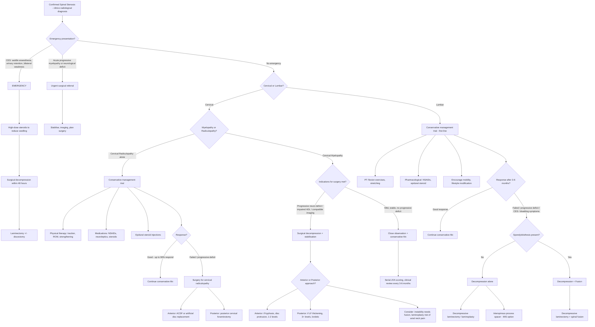

## Management of Spinal Stenosis

### Guiding Principles

Before diving into specifics, understand the overarching logic of managing spinal stenosis. The management approach depends on three questions:

1. **Is there an emergency?** (Cauda equina syndrome, acute myelopathy, progressive neurological deficit → surgical emergency)
2. **Cervical or lumbar?** (Cervical myelopathy is treated differently from lumbar claudication — cord compression has less room for conservative trial than root compression)
3. **Are symptoms tolerable and stable, or intractable/progressive?** (Stable → conservative first. Progressive/intractable → surgery)

The fundamental principle: ***conservative management first for the majority of patients***, with ***surgery reserved for specific indications*** — because spinal stenosis is a chronic degenerative condition, and many patients can be managed successfully without an operation.

---

### Management Algorithm

---

### A. Conservative (Non-Operative) Management

Conservative management is the **first-line** approach for both cervical and lumbar stenosis in the absence of emergency indications. The rationale is that many patients have **stable** symptoms that can be adequately controlled, and surgery carries inherent risks (especially in the elderly, comorbid population who typically presents with this condition).

#### 1. Physical Therapy (PT)

***Physical therapy*** is a cornerstone of conservative management [2][3][29].

**Lumbar stenosis PT** [3]:
- ***Flexion exercises*** — Why? Because flexion opens the spinal canal by ~11% and the foramina by ~12% [1]. Flexion-based exercises (e.g., pelvic tilts, knee-to-chest stretches, posterior pelvic tilt in standing) train the patient to adopt postures that maximise canal space
- ***Stretching exercises*** [3] — Hamstring stretching, hip flexor stretching. Tight hip flexors pull the pelvis into anterior tilt → increased lumbar lordosis → extension → canal narrows. Stretching breaks this cycle
- Core stabilisation — strengthening the deep paraspinal and abdominal muscles provides dynamic support for the spine, reducing load on passive structures (discs, facets, ligaments)

**Cervical stenosis PT** [29]:
- ***Traction*** — Axial distraction gently opens the foramina and separates compressed structures [29]
- ***ROM exercises*** — Maintain neck mobility and prevent stiffness [29]
- ***Strength training and stretching*** [29] — Deep neck flexor strengthening, postural correction. Strengthens the dynamic stabilisers of the cervical spine
- ***Limited evidence for use of neck collar and bedrest*** [29] — the lecture explicitly notes this. Prolonged collar use leads to muscle atrophy and stiffness; bedrest has no proven benefit. Short-term collar use ( < 2 weeks) may help during acute flares but should not be prolonged

<Callout title="Why Flexion Exercises for Lumbar Stenosis?">
This follows directly from the pathophysiology. Extension narrows the canal by 11% and foramina by 15%. Flexion opens them by similar amounts [1]. By training patients to work in flexion-biased postures and strengthening flexion-promoting muscles, you increase functional canal space. This is why stenosis patients instinctively lean on shopping trolleys — they're self-treating with flexion!
</Callout>

#### 2. Pharmacological Therapy

| Drug Class | Mechanism | Role in Stenosis |
|---|---|---|
| ***NSAIDs*** [2][3][30] | Inhibit COX-1/2 → reduce prostaglandin synthesis → anti-inflammatory and analgesic | First-line pain relief. Reduce inflammatory mediators around compressed nerve roots. Use with caution in elderly (GI bleeding, renal impairment, CV risk) |
| ***Neuroleptics / Neuropathic agents*** [30] | Gabapentin, pregabalin — bind α2δ subunit of voltage-gated calcium channels → reduce excitatory neurotransmitter release at dorsal horn | Useful for **neuropathic pain** component (burning, shooting, tingling). Not truly "neuroleptics" in the psychiatric sense — the lecture uses this term for anti-neuropathic medications |
| ***Steroids (oral)*** [30] | Potent anti-inflammatory → reduce oedema and inflammation around compressed neural structures | Short courses for acute flares. Not for long-term use (side effects: osteoporosis, hyperglycaemia, immunosuppression) |
| ***Epidural steroid injection*** [3][30] | Targeted delivery of corticosteroid into the epidural space (interlaminar or transforaminal approach under fluoroscopic guidance) → reduces perineural inflammation and oedema | Useful when oral medications insufficient. Provides temporary relief (weeks to months). Can be diagnostic (if relief confirms the pain source) and therapeutic. ***Up to 90% of patients with cervical radiculopathy have good response to conservative treatment measures*** [30] |
| **Selective nerve root steroid injection** [3] | Steroid injected around a specific nerve root | Both diagnostic and therapeutic — confirms which root is the pain generator |
| Simple analgesics | Paracetamol — central COX inhibition, mechanism not fully understood | First-step, safe in elderly. Limited anti-inflammatory effect |
| Muscle relaxants | e.g., baclofen, tizanidine — reduce muscle spasm via GABA or α2-adrenergic agonism | For associated paraspinal muscle spasm component |

#### 3. Lifestyle Modification [2]

- ***Encourage mobility*** [3] — This is critical. Bed rest is harmful. Deconditioning → weaker paraspinal muscles → worse symptoms. Walking programs (within symptom limits) maintain fitness
- Weight reduction — reduces axial load on the degenerative spine
- Ergonomic advice — avoid prolonged extension postures, use lumbar support when sitting
- Smoking cessation — smoking impairs disc nutrition and accelerates degeneration
- Activity modification — avoid activities that provoke extension (e.g., prolonged standing, overhead work)

<Callout title="The Conservative Management Approach — Key Teaching Points">
The majority of lumbar stenosis patients can be managed conservatively, at least initially. The combination of ***PT (flexion exercises, stretching) + NSAIDs + epidural steroid injection*** [3] forms the standard non-operative regimen. For cervical radiculopathy specifically, ***up to 90% of patients respond well to conservative measures*** [30] — surgery is only needed for the minority who fail or have progressive deficits.
</Callout>

---

### B. Surgical Management

#### Indications for Surgery

The indications differ slightly between cervical and lumbar, and between stenosis, myelopathy, and radiculopathy. Let me lay them out systematically.

##### General Surgical Indications (Applicable to Both Cervical and Lumbar) [31][32]

The lecture slides provide clear indications:

***Indications for surgery*** [31]:
- ***Structural: Instability*** — the spine cannot maintain its alignment, posing risk of further neural injury
- ***Decompression: Neurological deficit*** — progressive motor/sensory loss that demands removal of the compressive pathology
- ***Lack of improvement / deteriorating neurology*** [31] — conservative management has failed or the patient is getting worse
- ***Polytrauma: To facilitate mobilisation and rehabilitation*** [31] — in multitrauma patients, early spinal stabilisation allows earlier mobilisation

##### Cervical Myelopathy — Specific Surgical Indications [33]

***Indications for surgery in CSM (cervical spondylotic myelopathy)*** [33]:
- ***Progressive neurologic deficit*** — if myelopathy is getting worse, surgery should not be delayed because cord damage can become irreversible (myelomalacia)
- ***Significantly impaired ADL (JOA score)*** — the JOA score (total 17) quantifies disability. A low or declining JOA score indicates functional impairment warranting surgery
- ***Compatible imaging findings*** — MRI must show structural compression that explains the clinical syndrome

> **Key concept**: Cervical myelopathy has a **lower threshold for surgery** than lumbar stenosis. Why? Because the spinal cord has limited capacity for recovery once damaged (neurons don't regenerate well), and myelomalacia (T2 signal change in the cord) is irreversible. Lumbar nerve roots, being peripheral nerves, have a better capacity for recovery even after a period of compression.

##### Cervical Radiculopathy — Specific Surgical Indications [32a]

***Surgical treatment indications*** [32a]:
- ***Persistent symptoms despite conservative management***
- ***Neurological deficits***

##### Lumbar Stenosis — Specific Surgical Indications [3]

From the senior notes and general principles:
- ***Failed non-operative treatment*** (typically 3–6 months of adequate conservative therapy)
- ***Progressive neurological deficit*** — worsening motor weakness, escalating sensory loss
- ***Cauda equina syndrome*** — **emergency**, surgery within 48 hours [2]
- ***Disabling symptoms*** affecting ADL despite conservative measures

##### Spondylolisthesis — Specific Surgical Indications [3a]

- ***Disabling symptoms affecting ADL***
- ***Slip > 50% and progressing***
- ***Significant neurological deficit***

<Callout title="When NOT to Operate — Contraindications and Cautions" type="error">

**Relative contraindications to surgery include:**
- **Severe medical comorbidities** making anaesthesia/surgery prohibitively risky (uncontrolled cardiac disease, severe COPD, coagulopathy)
- **Asymptomatic radiographic stenosis** — never operate on an MRI finding alone
- **Imaging-clinical mismatch** — narrowing on MRI that doesn't explain the patient's symptoms
- **Patient preference** — informed patient who declines surgery after understanding risks/benefits
- **Psychiatric comorbidity / chronic pain syndrome** — outcomes are poor when pain is not primarily structural
- **Active infection at surgical site** — relative; must be treated first

For **cervical laminoplasty** specifically: ***fixed kyphotic deformity*** is a contraindication (because laminoplasty works by hinging the laminae posteriorly — if the cord is draped over an anterior kyphosis, posterior decompression won't help [34]).
</Callout>

---

#### Choice of Surgical Approach

##### ***Choice of Surgery*** [35]:

The lecture provides a framework:
- ***Decompression***: ***Anterior*** or ***Posterior*** [35]
- ***Stabilisation***: ***Internal (anterior or posterior)*** or ***External (non-operative management, maximises immobilisation)*** [35]

The decision between anterior and posterior depends on several factors. The lecture lays out the ***general considerations for anterior vs. posterior approach*** [34][36]:

##### Cervical Spine — Anterior vs. Posterior Approach

| Factor | Favours Anterior | Favours Posterior |
|---|---|---|
| ***1. Sagittal alignment*** [34] | ***Fixed kyphotic deformities favour anterior approach*** — you need to address the kyphosis from the front (corpectomy and reconstruction with cage/graft to restore lordosis). A posterior approach on a kyphotic spine leaves the cord draped over the anterior compression | Maintained lordosis — posterior approach is safe because the cord falls away from the anterior structures once posterior decompression is performed |
| ***2. Pathoanatomy*** [34] | ***Disc protrusions into the spinal cord — better treated with anterior technique*** [34] — the compression is coming from the front (disc/osteophyte), so approach from the front to directly remove it | ***Infolding/thickening of ligamentum flavum — better treated with posterior technique*** [34] — the compression is coming from behind, so approach from behind. Also for OPLL that extends over many segments |
| ***3. Number of levels involved*** [34] | 1–2 levels: anterior approach works well (ACDF, corpectomy) | ***3-level pathology or more favours posterior approach*** [34] — multilevel anterior surgery has higher complication rates (dysphagia, adjacent segment disease). Posterior laminoplasty or laminectomy + fusion is more efficient for long-segment disease |
| ***4. Subluxation or instability*** [36] | ***Fusion is indicated*** [36] — whether anterior or posterior, if there is instability, you must add fusion. Anterior plate + cage or posterior lateral mass screws | Same principle — instability demands stabilisation |
| ***5. Neck pain*** [36] | Generally less post-op axial neck pain with anterior approach | ***Laminoplasty patients may experience more post-op axial neck pain*** [36] — because the posterior musculature is disrupted during the approach. Muscle-sparing techniques help but don't eliminate this problem |

##### Cervical Surgical Options — Detailed

| Procedure | What It Involves | When to Use |
|---|---|---|
| ***Anterior Cervical Discectomy and Fusion (ACDF)*** [32a] | Anterior approach → remove the disc (and any osteophytes/PLL) at the offending level → place interbody cage/bone graft → anterior plate fixation → the two vertebrae fuse into one solid block | ***1–2 level disease, disc protrusion, kyphosis*** [34]. The workhorse anterior cervical operation. Directly removes the compressive pathology. Fusion sacrifices motion at that segment but provides stability |
| ***Artificial Disc Replacement*** [32a] | Same anterior approach → remove disc → insert mobile prosthesis instead of fusing | 1–2 level disease in younger patients with preserved motion. Preserves segmental motion → theoretically reduces adjacent segment disease. **Contraindicated** in instability, significant facet OA, osteoporosis, OPLL |
| ***Anterior Corpectomy*** [37] | Remove entire vertebral body (or bodies) + adjacent discs → reconstruct with cage/strut graft + anterior plate | Multi-level anterior compression, OPLL (if resectable), burst fracture with retropulsed fragments. More morbid than ACDF but allows wider decompression |
| ***Laminoplasty*** [2] | Posterior approach → hinge open the laminae (one side cut, other side hinged) → expand the canal → plate to keep it open. Does NOT fuse the spine | ***Multi-level posterior compression (3+ levels), preserved lordosis, no instability*** [34]. Preserves motion (no fusion). **Contraindication**: kyphosis (cord won't drift posteriorly), instability |
| ***Laminectomy + Posterior Fusion*** [2] | Remove laminae completely → fuse with lateral mass/pedicle screws and rods | Multi-level disease WITH instability. Definitive decompression + stabilisation but sacrifices all motion at fused segments |
| ***Posterior Cervical Foraminotomy*** [32a] | Posterior approach → keyhole removal of bone/ligament from the foramen → decompress the exiting root | ***Isolated foraminal stenosis / lateral disc herniation causing radiculopathy*** [32a]. Preserves motion (no fusion needed if spine is stable). Does not address central stenosis |

##### Lumbar Surgical Options — Detailed

| Procedure | What It Involves | When to Use |
|---|---|---|
| ***Decompressive Laminectomy*** [3] | Remove lamina(e) and thickened ligamentum flavum at the stenotic level(s) → opens the central canal | ***Lumbar stenosis WITHOUT spondylolisthesis*** [3]. Performed at ***every relevant level*** [3]. The standard open decompression. Risk: post-laminectomy instability if too much bone is removed |
| ***Laminoplasty*** [3] | Expand the canal without complete removal of the lamina | Similar indications to laminectomy; may preserve more posterior structural integrity |
| ***Interspinous Process Spacer (MIS)*** [3] | A device placed between adjacent spinous processes → holds them apart → maintains the spine in slight flexion → opens the canal and foramina | ***Mild to moderate stenosis, without instability*** [3]. Minimally invasive — can be done percutaneously. Mimics the flexion posture that relieves symptoms. Lower morbidity than open laminectomy. **Limitation**: does not address severe stenosis or instability. Not suitable if spondylolisthesis present |
| ***Decompressive Laminectomy + Spinal Fusion*** [3] | Laminectomy PLUS instrumented fusion (pedicle screws + rods ± interbody cage) | ***Lumbar stenosis WITH spondylolisthesis*** [3]. The spondylolisthesis means the segment is unstable — decompression alone would worsen instability. Fusion stabilises the segment |
| ***TLIF (Transforaminal Lumbar Interbody Fusion)*** [3a] | Posterior approach → laminectomy + unilateral facetectomy → insert interbody cage via transforaminal route → pedicle screw fixation | Spondylolisthesis with stenosis. Provides both decompression and 360-degree fusion (anterior column support via cage + posterior fixation). Specifically mentioned for spondylolisthesis management [3a] |
| ***Microdiscectomy*** [3] | Hemi-laminotomy + partial disc removal through a small incision with microscope/loupe magnification | ***Focal disc herniation causing radiculopathy*** [3] rather than generalised stenosis. Targeted decompression of the specific root involved |

<Callout title="The Key Surgical Decision in Lumbar Stenosis" type="idea">
The critical decision point is: **is there spondylolisthesis?** [3]
- **No spondylolisthesis** → ***Decompression alone*** (laminectomy/laminoplasty) or interspinous spacer (MIS)
- **With spondylolisthesis** → ***Decompression + spinal fusion*** (laminectomy + TLIF)

Why? Because if you decompress (remove laminae) in a spine that is already slipping forward, you remove the posterior restraints and the slip worsens → catastrophic instability. Fusion locks the vertebrae together, preventing further slip.
</Callout>

#### Cauda Equina Syndrome — Emergency Management [2]

This deserves its own section because it is time-critical:

1. ***High-dose steroid*** — to reduce localised swelling around the compressed cauda equina [2]. Mechanism: corticosteroids reduce vasogenic oedema, inflammatory cytokines, and free radical damage. Gives the nerve roots the best chance of recovery
2. ***Surgical decompression within 48 hours*** [2] — ***laminectomy +/- discectomy*** [2]. Every hour of delay beyond 48 hours reduces the likelihood of neurological recovery (especially bladder function). The evidence strongly supports: the earlier the decompression, the better the outcome

---

### C. Management of Specific Scenarios

#### Mechanically Stable vs. Unstable — A Framework

The senior notes provide a useful decision matrix [3b]:

| | **Neurology Stable** | **Neurology Unstable** |
|---|---|---|
| **Mechanically Stable** | Routine management (conservative) | Investigate for other causes — e.g., epidural haematoma, incomplete cord lesion, stroke. Also consider: wrong diagnosis of mechanical stability |
| **Mechanically Unstable** | Early stabilisation of spine (surgical) | Emergency: early stabilisation of spine + neurological management |

This framework applies broadly to all spinal pathology. The key teaching point is: **neurological deterioration in a "mechanically stable" spine should prompt you to look for other causes** — don't just assume it's progressive stenosis.

#### ***Principles of Management — Spinal Cord Compression*** [37]

From the neurosurgical teaching:

***Conservative management*** [37]:
- ***Physiotherapy***
- ***Analgesia***

***Surgical treatment if*** [37]:
- ***Progressive neurological deficit***
- ***Myelopathy / Radiculopathy***
- ***Intractable pain***

The example given is ***anterior corpectomy*** [37] — used when the compression is from the vertebral body itself (tumour, burst fracture, OPLL).

#### Developmental Stenosis — Special Considerations [5]

Patients with ***developmental stenosis (short pedicles)*** [5] have a particular challenge:
- ***Reoperation rate: 13% of patients, 50% at adjacent levels, 3.3% patients per year*** [5]
- This is because the entire canal is narrow — treating one level doesn't prevent adjacent levels from becoming symptomatic later. These patients require careful counselling about the likelihood of future surgery

---

### D. Summary — Treatment Modalities by Clinical Scenario

| Scenario | First-Line Treatment | Surgical Option | Key Considerations |
|---|---|---|---|
| **Mild lumbar stenosis, no neuro deficit** | PT (flexion exercises) + NSAIDs + lifestyle modification | Not indicated unless conservative fails | Most patients improve or stabilise |
| **Moderate lumbar stenosis, neurogenic claudication** | PT + NSAIDs + epidural steroid injection | If fails after 3–6 months: laminectomy (no listhesis) or laminectomy + fusion (with listhesis) | Interspinous spacer is a MIS option for select patients |
| **Lumbar stenosis with spondylolisthesis** | Conservative trial | ***Decompressive laminectomy + spinal fusion*** [3] | Must fuse if decompressing — otherwise slip worsens |
| **Cauda equina syndrome** | High-dose steroid | ***Emergency laminectomy +/- discectomy within 48h*** [2] | Time-critical — delays worsen outcome |
| **Cervical radiculopathy** | ***PT (traction, ROM, strengthening) + NSAIDs/neuroleptics/steroids + epidural injection*** [29][30] | ***ACDF, artificial disc, or posterior foraminotomy*** [32a] | ***Up to 90% respond to conservative Mx*** [30] |
| **Cervical myelopathy** | Close monitoring if mild/stable. PT for conditioning | ***Surgical decompression + stabilisation*** [2] when progressive deficit, impaired ADL, compatible imaging [33] | Low threshold for surgery — cord damage is irreversible. Choose anterior vs. posterior based on alignment, pathoanatomy, levels [34][36] |
| **Disc herniation with radiculopathy** | ***Encourage mobility***, PT, NSAID, selective nerve root injection [3] | ***Microdiscectomy*** [3] if failed conservative, progressive deficit, or CES | Most disc herniations resolve with conservative Mx (60–90% improve in 6–12 weeks) |

---

<Callout title="High Yield Summary">

**Conservative management is first-line** for most patients:
- **Lumbar**: ***PT (flexion exercises, stretching), NSAIDs, epidural steroid injection, encourage mobility*** [3]
- **Cervical radiculopathy**: ***PT (traction, ROM, strengthening), NSAIDs, neuroleptics, steroids, epidural injection*** — ***up to 90% respond to conservative measures*** [29][30]
- **Cervical myelopathy**: Low threshold for surgery; conservative only if mild and stable [33]

**Surgical indications**: ***Progressive neurological deficit, failed conservative management, myelopathy/radiculopathy with compatible imaging, intractable pain, CES*** [31][33][37]

**Lumbar surgery decision**: ***Without spondylolisthesis → decompressive laminectomy/laminoplasty or interspinous spacer. With spondylolisthesis → decompressive laminectomy + spinal fusion*** [3]

**Cervical surgery — anterior vs. posterior** [34][36]:
- Anterior favoured for: ***kyphosis, disc protrusion, 1–2 levels***
- Posterior favoured for: ***LF thickening, 3+ levels, preserved lordosis***
- ***Instability → fusion indicated***
- ***Laminoplasty → more post-op axial neck pain***

**CES**: ***High-dose steroid + surgical decompression within 48 hours*** [2]

**Developmental stenosis**: Counsel about high reoperation rates — ***13% of patients, 50% at adjacent levels, 3.3% per year*** [5]

</Callout>

---

<ActiveRecallQuiz
  title="Active Recall - Management of Spinal Stenosis"
  items={[
    {
      question: "A 70-year-old man with lumbar stenosis and L4/5 spondylolisthesis fails 6 months of conservative management. What surgical procedure is indicated and why?",
      markscheme: "Decompressive laminectomy PLUS spinal fusion (e.g., TLIF). Fusion is mandatory because spondylolisthesis means the segment is unstable. Decompression alone (removing laminae) would remove posterior restraints and worsen the slip, causing catastrophic instability. Fusion locks the vertebrae together to prevent further slippage."
    },
    {
      question: "List the 3 indications for surgery in cervical spondylotic myelopathy from the lecture slides.",
      markscheme: "1. Progressive neurologic deficit. 2. Significantly impaired ADL (assessed by JOA score). 3. Compatible imaging findings (MRI showing cord compression correlating with clinical syndrome)."
    },
    {
      question: "When deciding between anterior and posterior approach for cervical myelopathy surgery, name 3 factors and state which approach each favours.",
      markscheme: "1. Sagittal alignment: fixed kyphosis favours anterior. 2. Pathoanatomy: disc protrusion favours anterior; ligamentum flavum thickening favours posterior. 3. Number of levels: 3 or more levels favours posterior. Also: instability requires fusion (either approach); laminoplasty gives more post-op axial neck pain."
    },
    {
      question: "What percentage of cervical radiculopathy patients respond to conservative treatment? Name the key conservative measures from the lecture.",
      markscheme: "Up to 90% respond to conservative treatment. Key measures: physical therapy (traction, ROM exercises, strength training and stretching), medications (NSAIDs, neuroleptics, steroids), and epidural steroid injections. Limited evidence for neck collar and bedrest."
    },
    {
      question: "Explain why flexion exercises are prescribed for lumbar stenosis and how the interspinous spacer works on the same principle.",
      markscheme: "Flexion increases the size of the spinal canal by approximately 11% and the foramina by 12%. This is because the ligamentum flavum is stretched taut (less infolding), facet joints separate, and foraminal height increases. The interspinous spacer works on the same principle: it holds adjacent spinous processes apart, maintaining the spine in slight flexion, thereby keeping the canal and foramina open. It mimics the forward-leaning posture that naturally relieves neurogenic claudication."
    },
    {
      question: "A patient with cauda equina syndrome presents at your ED. Outline the emergency management with time frame and rationale.",
      markscheme: "1. High-dose steroids immediately to reduce localised swelling (reduces vasogenic oedema and inflammatory cytokines around compressed cauda equina). 2. Urgent whole-spine MRI to confirm diagnosis and identify cause. 3. Surgical decompression within 48 hours (laminectomy +/- discectomy). Rationale: every hour of delay worsens prognosis, especially for bladder function recovery. Earlier decompression gives the best chance of neurological recovery."
    }
  ]}
/>

## References

[1] Lecture slides: GC 226. Lumbar Spine Pathology_Part F (2).pdf, p2–3
[2] Senior notes: maxim.md (sections 2.4, 2.5 — cervical myelopathy management, spinal stenosis management, cauda equina syndrome management)
[3] Senior notes: maxim.md (section 2.5 — lumbar stenosis management; section 2.6 — PID management)
[3a] Senior notes: maxim.md (section on spondylolisthesis management — TLIF, surgical indications)
[3b] Senior notes: maxim.md (mechanically stable vs unstable decision matrix)
[5] Lecture slides: GC 226. Lumbar Spine Pathology_Part F (2).pdf, p9
[29] Lecture slides: GC 227. Cervical Spine Pathology.pdf, p47
[30] Lecture slides: GC 227. Cervical Spine Pathology.pdf, p48
[31] Lecture slides: GC 227. Cervical Spine Pathology.pdf, p87
[32a] Lecture slides: GC 227. Cervical Spine Pathology.pdf, p49
[33] Lecture slides: GC 227. Cervical Spine Pathology.pdf, p36
[34] Lecture slides: GC 227. Cervical Spine Pathology.pdf, p37
[35] Lecture slides: GC 227. Cervical Spine Pathology.pdf, p88
[36] Lecture slides: GC 227. Cervical Spine Pathology.pdf, p38
[37] Lecture slides: GC 110. Paraplegia Spinal cord compression Transverse myelitis Spinal dysraphism Neuroimaging III Spinal Cord.pdf, p22
