## Differential Diagnosis of Upper GI Bleed

The differential diagnosis of UGIB is best approached **systematically by anatomical site** (oesophagus → stomach → duodenum → other) and then **ranked by frequency**, because the likelihood of each diagnosis directly guides your pre-endoscopy clinical reasoning and resource allocation.

The golden rule: **you cannot definitively diagnose the source of UGIB without endoscopy (OGD)**. The DDx below is your working list *before* the scope goes in — history, examination, and risk factors help you weight the probabilities.

---

### Overview of Presentations That Should Trigger a UGIB DDx [1][2]

> ***Presentation of upper GI bleed*** [1]:
> - ***Haematemesis***
> - ***Coffee ground vomiting (methaemoglobin)***
> - ***Melaena (haematin) (also named tarry stool)***
> - ***Fresh PR bleed (also named haematochezia)***
> - ***Occult bleed (symptoms of anaemia)***

Any of these presentations should prompt you to run through the full UGIB differential. The character of the presentation gives you a clue about the *rate* of bleeding, not the *source* — you still need OGD.

---

### Organising Framework: Differential by Anatomical Site

```mermaid
graph TD
    A["UGIB Differential Diagnosis"] --> B["Oesophagus"]
    A --> C["Stomach"]
    A --> D["Duodenum"]
    A --> E["Other / Extrinsic Sources"]

    B --> B1["Oesophageal varices"]
    B --> B2["Oesophagitis / Oesophageal ulcers"]
    B --> B3["Mallory-Weiss syndrome"]
    B --> B4["Oesophageal malignancy"]

    C --> C1["Gastric / Duodenal ulcer (PUD)"]
    C --> C2["Gastritis / Erosive gastropathy"]
    C --> C3["Gastric varices"]
    C --> C4["Portal hypertensive gastropathy"]
    C --> C5["Dieulafoy's lesion"]
    C --> C6["GAVE - Watermelon stomach"]
    C --> C7["Gastric malignancy / GIST"]
    C --> C8["Cameron lesions"]

    D --> D1["Duodenal ulcer"]
    D --> D2["Duodenitis"]
    D --> D3["Duodenal malignancy"]
    D --> D4["Aorto-enteric fistula"]
    D --> D5["Haemobilia via ampulla"]

    E --> E1["Haemobilia"]
    E --> E2["Haemosuccus pancreaticus"]
    E --> E3["Stomal ulcer"]
    E --> E4["AV malformations / Angiodysplasia"]
```

Now let's go through each in detail, grouping by **common** vs. **less common** as per the lecture slides.

---

### Common Causes — In Descending Order of Frequency

Per lecture slides [1]:

> ***Causes of upper GI bleeding in descending order of frequency:***
> 1. ***Duodenal or gastric ulcer***
> 2. ***Gastritis***
> 3. ***Esophageal or gastric varices***
> 4. ***Mallory-Weiss syndrome***
> 5. ***Benign or malignant gastric tumour***
>
> *(The slide marks varices, aortoduodenal fistula, stomal ulcer, and Dieulafoy's lesion as "= more likely severe")* [1]

#### 1. Peptic Ulcer Disease (Duodenal or Gastric Ulcer) — Most Common

**Why is it number one?** Because the two most prevalent risk factors — ***H. pylori*** and ***NSAIDs*** — are extremely common in the general population, especially in Hong Kong's ageing demographic with high NSAID/aspirin use and historically high *H. pylori* prevalence [2][3].

| Feature | Detail |
|:---|:---|
| Pathophysiology | Mucosal defect extending through the muscularis mucosae. Bleeding occurs when the ulcer erodes into a submucosal or deeper artery |
| Key risk factors | ***H. pylori, NSAIDs, stress, excess gastric acid*** [2] |
| Typical presentation | Epigastric pain related to meals (gastric: ↑ with food; duodenal: 2–5h post-meal, relieved by food). Haematemesis/melena when bleeding |
| Why it bleeds severely | ***DU: usually posterior wall → GDA involvement → coffee-ground vomiting or melena*** [5]. GU on lesser curvature → left gastric artery erosion |
| Key clues on history | NSAID/aspirin use, known H. pylori, prior PUD, epigastric pain [3][7] |
| Endoscopic finding | Ulcer crater ± stigmata of recent haemorrhage (Forrest classification) |

<Callout title="Why Duodenal Ulcers on the Posterior Wall Are Dangerous">
The **posterior wall of D1** is immediately anterior to the **gastroduodenal artery (GDA)**. An ulcer here can erode directly into the GDA — a medium-sized artery that branches from the common hepatic artery. This produces **catastrophic arterial haemorrhage**. By contrast, *anterior* D1 ulcers tend to perforate (into the peritoneal cavity) rather than bleed, because there is no major artery anteriorly — just the peritoneum [5].
</Callout>

#### 2. Gastritis / Duodenitis (Erosive)

| Feature | Detail |
|:---|:---|
| Pathophysiology | **Inflammation-associated superficial mucosal injury** — erosions do NOT extend through the muscularis mucosae (unlike ulcers). Bleeding is from damaged superficial capillaries/venules |
| Causes | ***Drug-induced (aspirin/NSAIDs), alcohol-induced, stress-induced*** [2] |
| Typical presentation | Often mild, self-limited oozing. Coffee-ground vomitus or occult bleeding more common than frank haematemesis |
| Key point | ***Diagnosis is made exclusively by endoscopic evaluation of the mucosa*** — you cannot diagnose gastritis on clinical grounds alone [2] |
| Why it's common | Same risk factor pool as PUD (NSAIDs, alcohol, H. pylori), but the injury is more superficial |

#### 3. Oesophageal or Gastric Varices

| Feature | Detail |
|:---|:---|
| Pathophysiology | ***Portal hypertension → opening and dilatation of pre-existing portosystemic collateral channels → varices***. Left gastric (coronary) vein collateralises with oesophageal veins at the GEJ [2][7] |
| Why they bleed | Laplace's law: T ∝ P × r / w. Thin-walled, large-radius vessels under high portal pressure → enormous wall tension → rupture |
| Risk threshold | ***HVPG ≥ 12 mmHg*** [2] |
| Key clues | ***Jaundice, easy bruising, distended abdomen, peripheral oedema*** (signs of liver failure/cirrhosis) [3]. In Hong Kong, HBV carrier status is a critical background |
| Severity | ***More likely severe*** [1] — variceal bleeds are often **massive**, with mortality 15–25% per episode |
| Other variceal sites | Ectopic varices: rectum, umbilicus (caput medusae), intestinal varices [2] |

**Differential diagnosis of bleeding in a cirrhotic patient** — this is a key exam scenario [7]:

> When a cirrhotic patient presents with UGIB, do NOT assume it's varices. The DDx includes:
> - **Variceal bleeding** (oesophageal and gastric) — most common
> - **Portal hypertensive gastropathy** — friable ectatic mucosal vessels
> - **Generalised bleeding tendency** — pancytopenia from hypersplenism + ↓ coagulation factor production
> - **Peptic ulcer disease** — cirrhotic patients can still have PUD
> - **Mallory-Weiss syndrome** — alcoholics retch frequently

#### 4. Mallory-Weiss Syndrome

| Feature | Detail |
|:---|:---|
| Definition | ***Longitudinal mucosal lacerations (intramural dissections) in distal oesophagus and proximal stomach (GEJ)*** [2][6] |
| Pathophysiology | ***Forceful retching/vomiting → sudden ↑ intra-abdominal pressure*** → mechanical shearing of mucosa at the GEJ → lacerations expose **submucosal arteries** → haemorrhage [2] |
| Key clue | ***Preceding forceful vomiting THEN haematemesis*** — the temporal sequence is diagnostic [3] |
| Risk factors | ***Chronic alcoholism, chemotherapy, sudden increase in abdominal pressure*** [6] |
| Natural history | ***90% of bleeding stops spontaneously*** [6]. Active bleeding: OGD for adrenaline + clipping |
| Severity | Usually self-limited; occasionally severe |
| Distinguish from Boerhaave | Mallory-Weiss = partial-thickness mucosal tear (bleeds). Boerhaave = **full-thickness rupture** (perforates — presents with mediastinitis, surgical emphysema, Mackler's triad) [6] |

#### 5. Benign or Malignant Gastric Tumour

| Feature | Detail |
|:---|:---|
| Includes | Gastric adenocarcinoma, GIST (gastrointestinal stromal tumour), lymphoma, carcinoid, benign polyps |
| Why it bleeds | Tumour neovascularisation produces fragile vessels; surface ulceration of tumour exposes these to gastric acid and mechanical trauma |
| Key clues | ***Constitutional symptoms (weight loss, anorexia, night sweats), dysphagia (CA oesophagus), persistent epigastric pain (CA stomach)*** [3] |
| Hong Kong relevance | Gastric cancer still common — risk factors include H. pylori (especially pangastritis pattern), smoking, salt-preserved foods |
| Typical bleeding pattern | Usually **chronic occult bleeding → iron-deficiency anaemia** rather than acute massive haemorrhage, though large tumours can erode into major vessels |

---

### Less Common Causes

Per lecture slides [1]:

> ***Less common causes of UGIB:***
> - ***Esophagitis, esophageal tumour***
> - ***Stomal ulcer***
> - ***Aortoduodenal fistula***
> - ***Haemobilia, haemosuccus pancreaticus***
> - ***Vascular malformation, angiodysplasia***
> - ***Dieulafoy's lesion***
> - ***Duodenal or jejunal diverticulum, jejunal ulcer***

#### 6. Oesophagitis / Oesophageal Ulcers [2]

| Feature | Detail |
|:---|:---|
| Pathophysiology | Acid reflux (GERD) → chronic mucosal injury → erosive oesophagitis → if severe, ulceration → bleeds from exposed submucosal vessels |
| Risk factors | ***GERD, obesity, infections (HSV, Candida), medications (NSAIDs, tetracycline, bisphosphonates), irradiation for malignancy*** [2] |
| Key clue | History of **heartburn, acid brash, dysphagia**; immunocompromised status (for infectious causes) |
| Pill oesophagitis | Medication lodges in the oesophagus → direct chemical injury. Bisphosphonates are notorious — hence the instruction to take with a full glass of water and remain upright |

#### 7. Stomal Ulcer [1]

- Occurs at **surgical anastomotic sites** (e.g., after Billroth I/II, Roux-en-Y, gastrojejunostomy)
- Why? The jejunal mucosa lacks the protective mechanisms of gastric/duodenal mucosa (less bicarbonate secretion, no mucus layer adapted for acid) → acid from the gastric remnant causes ulceration at the stoma
- Key clue: **history of prior gastric surgery**

#### 8. Aorto-Enteric Fistula [1][2][8]

| Feature | Detail |
|:---|:---|
| Definition | Direct communication between the **aorta and GI tract** (usually at the ***3rd or 4th part of the duodenum***) |
| Pathophysiology | ***Secondary to placement of a prosthetic abdominal aortic vascular graft*** — the graft erodes through the duodenal wall over months–years. The duodenum is draped over the aorta at D3/D4, so the graft presses directly against it [2] |
| Key clue | ***History of AAA repair*** — ***aorto-enteric fistula until proven otherwise*** in this context [8] |
| Classic presentation | ***Classic triad: UGIB, fever, abdominal pain*** [8]. "Herald bleed" (initial self-limited bleed) → then massive exsanguination |
| Investigation | ***OGD (up to D4), contrast-enhanced CT abdomen*** [8] |
| Severity | ***Medical emergency with high mortality rate*** [2]. ***More likely severe*** [1] |

<Callout title="Exam Scenario — AAA Graft + GI Bleed" type="error">
If you see a patient with **prior AAA repair** and **any** GI bleeding, your first thought should be ***aorto-enteric fistula until proven otherwise*** [8]. Order an **urgent CT aortogram** [3] and perform **OGD up to D4**. This is a surgical emergency — do not delay.
</Callout>

#### 9. Haemobilia [2]

- "Haemo" = blood, "bilia" = bile → **bleeding from the hepatobiliary tract** that drains through the ampulla of Vater into the duodenum
- Causes: **hepatic/biliary instrumentation** (percutaneous liver biopsy, transjugular liver biopsy, ERCP), hepatic trauma, cholangiocarcinoma [3]
- **Quincke's triad**: upper GI bleeding + biliary colic + jaundice (blood in the biliary tree causes colicky pain and can obstruct bile flow)
- Why it presents as UGIB: blood flows from the damaged hepatic/biliary vessel → bile ducts → ampulla of Vater → D2 → haematemesis/melena

#### 10. Haemosuccus Pancreaticus [2]

- "Haemo" = blood, "succus" = juice, "pancreaticus" = pancreas → **bleeding from the pancreatic duct**
- Mechanism: **chronic pancreatitis / pseudocyst / pancreatic tumour** → erosion into a peripancreatic artery (most commonly the **splenic artery**) → blood tracks through the main pancreatic duct → ampulla of Vater → D2
- Rare but important; suspect in patients with known chronic pancreatitis and intermittent GI bleeding

#### 11. Vascular Malformations / Angiodysplasia [2][4]

| Feature | Detail |
|:---|:---|
| Definition | ***Dilated tortuous submucosal vessels*** (AVM) |
| Upper GI location | Often stomach and duodenum [2] |
| Associations | Ageing, ***aortic stenosis*** (Heyde syndrome — shear stress through stenotic valve destroys vWF multimers → acquired type 2A vWD), ***ESRD***, hereditary haemorrhagic telangiectasia (Osler-Weber-Rendu) |
| Endoscopic appearance | Cherry red spots |
| Key clue | Chronic occult bleeding with anaemia in an elderly patient; association with aortic stenosis or CKD |

#### 12. Dieulafoy's Lesion [1][2]

| Feature | Detail |
|:---|:---|
| Definition | ***Dilated aberrant submucosal vessel that erodes the overlying epithelium in the absence of a primary ulcer*** [2] |
| Location | ***Proximal stomach along the lesser curvature or near the GEJ*** [2] |
| Why it bleeds | A congenitally large-calibre submucosal artery (1–3 mm) sits just beneath a tiny mucosal defect ( < 3 mm). Despite the tiny surface lesion, the vessel is arterial-calibre → can cause **massive, intermittent bleeding** |
| Diagnosis | Endoscopic — visible vessel protruding through **normal-appearing mucosa** (no surrounding ulcer) |
| Severity | ***More likely severe*** [1] — arterial bleeding from a large vessel |
| Management | Endoscopic therapy (sclerosant, clips, thermocoagulation) [5] |

<Callout title="Dieulafoy's vs. Peptic Ulcer — Key Distinction">
In a peptic ulcer, the visible vessel sits within an **ulcer crater** surrounded by inflamed/fibrotic tissue. In Dieulafoy's lesion, the mucosa looks **entirely normal** except for a tiny erosion with a pumping vessel — there is no ulcer. This is why Dieulafoy's can be missed on endoscopy if the lesion is not actively bleeding at the time of examination.
</Callout>

#### 13. Gastric Antral Vascular Ectasia (GAVE) — "Watermelon Stomach" [2]

- Endoscopic appearance: ***longitudinal rows of flat, reddish stripes radiating from the pylorus into the antrum*** — resembling the stripes on a watermelon
- Pathophysiology is distinct from portal hypertensive gastropathy (though both can coexist in cirrhotic patients)
- GAVE is localised to the **antrum**; PHG is more **diffuse/fundal**
- Usually presents with chronic occult bleeding and iron-deficiency anaemia
- Treatment: **argon plasma coagulation (APC)**

#### 14. Cameron Lesions [2]

- **Erosions or ulcers** at the neck of a **hiatal hernia** where the stomach is constricted at the diaphragmatic hiatus
- Mechanism: mechanical trauma from respiratory excursion + possible ischaemia at the constriction point
- Usually presents as **chronic occult bleeding → IDA** rather than acute haemorrhage

#### 15. Duodenal or Jejunal Diverticulum [1]

- Diverticula (outpouchings) of the duodenal/jejunal wall can harbour ulceration or erosion → bleeding
- Periampullary diverticula are relatively common in elderly
- Usually an incidental finding but can cause significant bleeding

---

### Differential by Anatomical Site — Summary Table

Per senior notes [3], this is a clean way to organise the DDx:

| **Site** | **Differential Diagnoses** |
|:---|:---|
| ***Oesophagus*** | ***Oesophagitis, oesophageal varices, Mallory-Weiss syndrome, malignancy*** [3] |
| ***Stomach*** | ***Gastritis, PUD (MC), Dieulafoy's lesion, portal hypertensive gastropathy, gastric varices, malignancy*** [3] |
| ***Duodenum*** | ***Duodenitis, ulcer, malignancy, haemobilia (cholangiocarcinoma)*** [3] |
| ***Extrinsic*** | ***Aortic-enteric fistula (after aortic repair with grafts)*** [3] |
| ***Any site*** | ***AV malformation*** [3] |

---

### GI Bleeding of Obscure Origin [4]

When standard OGD and colonoscopy ("top and tail") are negative, consider the rarer causes. Per lecture slides [4]:

> ***Vascular diseases***: ***Angiodysplasia, Angiomas, Dieulafoy lesion, Watermelon stomach, Varices, Haemosuccus pancreaticus, Haemobilia***
>
> ***Ulcerative diseases***: ***Peptic ulcer, Reflux disease, Cameron ulcers, Crohn's disease***
>
> ***Neoplasms***: ***Polyps, Lipoma, Lymphoma, Carcinoid, GIST, Primary small bowel carcinoma, Metastatic cancer, Melanoma***
>
> ***Genetic disorders***: ***Osler-Weber-Rendu syndrome, Blue rubber bleb naevus syndrome, Gardner's syndrome, Hermansky-Pudlak syndrome, Klippel-Trenaunay-Weber syndrome, Neurofibromatosis type I and II, Ehlers-Danlos syndrome***
>
> ***Others***: ***Medications/NSAID, CMV infection, Tuberculosis infection, Meckel's diverticulum, Diverticulosis***

Most obscure GI bleeding is eventually localised to the **small bowel** — investigated with **capsule endoscopy** or **double-balloon enteroscopy** [3].

---

### Clinical Approach to Narrowing the DDx

The DDx list above is long, but at the bedside you narrow it efficiently using **history, risk factors, and clinical signs**. Here is a structured clinical reasoning approach:

| **Clinical Clue** | **Points Toward** | **Why** |
|:---|:---|:---|
| ***NSAID/aspirin use*** | ***PUD, gastritis*** | COX-1 inhibition → ↓ prostaglandins → mucosal breakdown [2] |
| ***Known H. pylori*** | ***PUD, gastritis*** | Chronic mucosal inflammation [2] |
| ***Chronic liver disease / stigmata of cirrhosis*** | ***Varices, PHG, coagulopathy*** | Portal hypertension → collaterals; ↓ clotting factors [3][7] |
| ***Preceding forceful vomiting*** | ***Mallory-Weiss syndrome*** | Mechanical tear at GEJ from ↑ intra-abdominal pressure [2][3] |
| ***Epigastric pain with meals*** | ***PUD*** | Acid-mediated mucosal injury [3] |
| ***Weight loss, anorexia, dysphagia*** | ***Malignancy*** | Tumour consuming energy (cachexia) or obstructing lumen [3] |
| ***History of AAA repair with graft*** | ***Aorto-enteric fistula*** | Graft erosion into duodenum [8] |
| ***Recent liver biopsy / ERCP*** | ***Haemobilia*** | Iatrogenic vascular injury [2] |
| ***Chronic pancreatitis / pseudocyst*** | ***Haemosuccus pancreaticus*** | Pseudocyst erodes into splenic artery [2] |
| ***Prior gastric surgery*** | ***Stomal ulcer*** | Acid exposure on unprotected jejunal mucosa [1] |
| ***Elderly + aortic stenosis + anaemia*** | ***Angiodysplasia*** | Heyde syndrome — acquired vWD [2] |
| ***Elderly + CKD*** | ***Angiodysplasia*** | Uraemic platelet dysfunction + vascular fragility |
| ***Anticoagulant / antiplatelet use*** | ***Coagulopathy-exacerbated bleed from any source*** | Impaired haemostasis amplifies bleeding from any lesion [3] |
| ***Alcoholism*** | ***Varices, gastritis, Mallory-Weiss, PUD*** | Multiple mechanisms: liver damage, direct mucosal irritation, retching [3] |

---

### Severity Markers Within the DDx

The lecture slides highlight that certain diagnoses are ***"more likely severe"*** [1]:

> Conditions marked as more likely to cause severe bleeding:
> - ***Oesophageal or gastric varices***
> - ***Aortoduodenal fistula***
> - ***Stomal ulcer***
> - ***Dieulafoy's lesion***

Why these four?
- **Varices**: thin-walled venous channels under very high pressure → torrential bleeding
- **Aorto-enteric fistula**: direct communication with the aorta → exsanguination
- **Stomal ulcer**: anastomotic sites are highly vascular from surgical neo-vascularisation
- **Dieulafoy's lesion**: congenitally large-calibre artery → arterial-pressure bleeding despite a tiny mucosal defect

Peptic ulcers can also cause severe bleeding (especially posterior D1 eroding into GDA), but they exist on a **spectrum** — many bleeds are mild and self-limited.

---

### Non-GI Causes to Exclude ("Pseudo-UGIB")

Before finalising a UGIB DDx, always exclude:

| Mimic | How to Distinguish |
|:---|:---|
| **Haemoptysis** (coughing up blood from lungs) | Blood is bright red, frothy, coughed not vomited, associated with respiratory symptoms. **Ask: "Did you vomit it or cough it up?"** [3] |
| **Epistaxis** (swallowed nasal blood) | History of nosebleed, posterior nasal bleeding can be swallowed → haematemesis or melena |
| **Oropharyngeal bleeding** | Dental/oral mucosal source |
| **Iron / bismuth ingestion** | Black stools but NOT tarry, NOT offensive. Stool guaiac test negative. Always check drug history [2] |

---

<Callout title="High Yield Summary — Differential Diagnosis of UGIB">

**Most common causes (in order)**: PUD (MC) > Gastritis > Varices > Mallory-Weiss > Gastric tumour

**Anatomical site approach**: Oesophagus (varices, oesophagitis, Mallory-Weiss, CA) → Stomach (PUD, gastritis, Dieulafoy, PHG, GAVE, CA) → Duodenum (DU, duodenitis, aorto-enteric fistula, haemobilia) → Any site (angiodysplasia)

**"More likely severe" causes**: Varices, aorto-enteric fistula, stomal ulcer, Dieulafoy's lesion

**Cirrhotic patient bleeding DDx**: Varices (commonest) + PHG + coagulopathy + PUD + Mallory-Weiss

**Aorto-enteric fistula**: suspect in any patient with prior AAA graft + GI bleed → CT aortogram + OGD to D4

**Obscure GI bleeding**: negative top-and-tail → think small bowel (angiodysplasia, Meckel's, GIST, Crohn's, melanoma metastasis) → capsule endoscopy / double-balloon enteroscopy

**Always exclude pseudo-UGIB**: haemoptysis, swallowed epistaxis, iron/bismuth ingestion

</Callout>

---

<ActiveRecallQuiz
  title="Active Recall - Differential Diagnosis of UGIB"
  items={[
    {
      question: "List the 5 most common causes of UGIB in descending order of frequency.",
      markscheme: "1. Duodenal or gastric ulcer, 2. Gastritis, 3. Oesophageal or gastric varices, 4. Mallory-Weiss syndrome, 5. Benign or malignant gastric tumour."
    },
    {
      question: "A cirrhotic patient presents with haematemesis. Name 5 possible causes of bleeding in this patient.",
      markscheme: "1. Oesophageal/gastric variceal bleeding, 2. Portal hypertensive gastropathy, 3. Generalised bleeding tendency (pancytopenia from hypersplenism, decreased clotting factors), 4. Peptic ulcer disease, 5. Mallory-Weiss syndrome."
    },
    {
      question: "Which 4 causes of UGIB are specifically marked as 'more likely severe' on the lecture slides, and why is each particularly dangerous?",
      markscheme: "1. Varices - thin-walled veins under high portal pressure, torrential venous bleeding. 2. Aortoduodenal fistula - direct communication with aorta, exsanguination. 3. Stomal ulcer - highly vascular anastomotic site. 4. Dieulafoy's lesion - congenitally large submucosal artery causing arterial-pressure bleeding."
    },
    {
      question: "A 70-year-old man with a history of AAA repair 3 years ago presents with melaena and low-grade fever. What is your top differential and what investigations would you order?",
      markscheme: "Top differential: aorto-enteric fistula (until proven otherwise). Investigations: urgent contrast-enhanced CT aortogram and OGD extending to D4. Classic triad is UGIB, fever, and abdominal pain."
    },
    {
      question: "Explain the pathophysiological difference between Dieulafoy's lesion and a bleeding peptic ulcer as seen on endoscopy.",
      markscheme: "Dieulafoy: congenitally dilated aberrant submucosal artery eroding through normal-appearing mucosa with no surrounding ulcer crater. Peptic ulcer: visible vessel or bleeding within an ulcer crater surrounded by inflamed or fibrotic tissue. Dieulafoy has no primary ulcer; the mucosa looks normal except for a tiny defect."
    },
    {
      question: "Name 3 non-GI causes that can mimic UGIB presentation and explain how to distinguish each.",
      markscheme: "1. Haemoptysis - blood is frothy, coughed not vomited, respiratory symptoms present. 2. Swallowed epistaxis - history of nosebleed, posterior nasal source. 3. Iron or bismuth ingestion - black stool but not tarry, no offensive smell, guaiac test negative."
    }
  ]}
/>

## References

[1] Lecture slides: GC 198. Profuse vomiting of fresh blood and in shock severe upper GI bleeding.pdf (p2, p7–10)
[2] Senior notes: felixlai.md (Upper GI bleeding — Differential diagnosis; Peptic ulcer disease sections)
[3] Senior notes: maxim.md (3.3 UGIB — Differential diagnosis, Important questions)
[4] Lecture slides: GC 186. Lower and diffuse abdominal painfresh blood in stool.pdf (p43 — GI bleeding of obscure origin)
[5] Senior notes: maxim.md (3.6 Benign diseases of stomach — PUD complication hemorrhage, Dieulafoy's lesion)
[6] Senior notes: maxim.md (Mallory-Weiss syndrome and Boerhaave's syndrome table)
[7] Senior notes: felixlai.md (Portal hypertensive gastropathy — Differential diagnosis of bleeding in cirrhotic patients; Variceal hemorrhage)
[8] Senior notes: maxim.md (Approach to UGIB with background of AAA repair)
