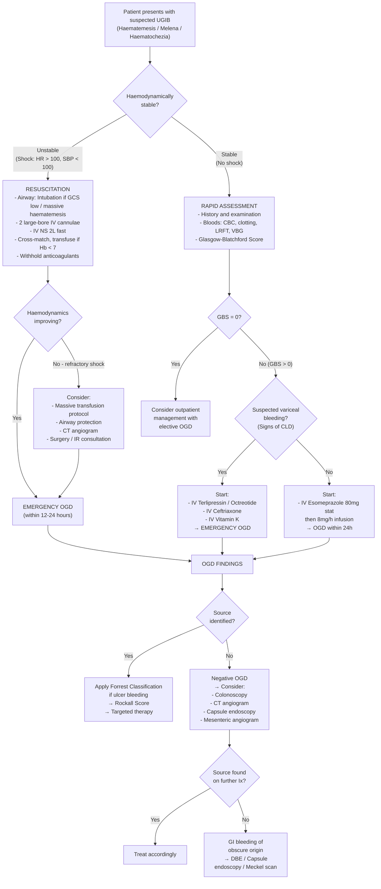
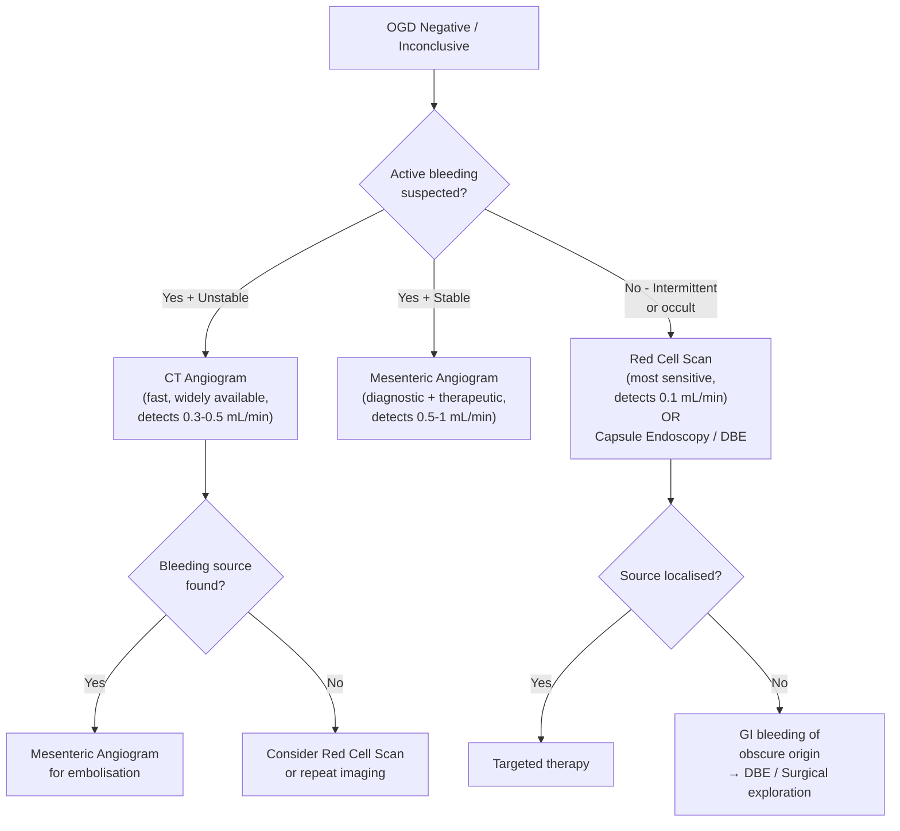

## Diagnosis of Upper GI Bleed — Criteria, Algorithm & Investigations

### Conceptual Framework: How Do We "Diagnose" UGIB?

UGIB is not a single disease — it is a **presentation**. There is no single "diagnostic criterion" in the way we diagnose, say, rheumatoid arthritis. Instead, the diagnostic process has three interlocking goals:

1. **Confirm that bleeding is from the upper GI tract** (clinical features + biochemistry)
2. **Identify the specific source/aetiology** (almost always requires endoscopy)
3. **Risk-stratify** to determine urgency of intervention and predict outcomes (scoring systems)

The definitive diagnostic tool is ***oesophago-gastro-duodenoscopy (OGD)*** — everything else is either pre-endoscopic triage or a fallback when OGD is inconclusive [2][3][9].

---

### Clinical Diagnostic Criteria — "How Do I Know It's an Upper GI Bleed?"

There is no formal validated "diagnostic criteria" checklist for UGIB, but the diagnosis is established by a combination of:

| Component | What Confirms UGIB | Why |
|:---|:---|:---|
| ***Haematemesis*** | Blood vomited must originate proximal to the ligament of Treitz | You cannot vomit blood from a colonic source — the ileocaecal valve and pylorus prevent retrograde flow of distal blood. Haematemesis = upper GI source by definition [2] |
| ***Coffee-ground vomitus*** | Acid-altered blood (haemoglobin → ***methaemoglobin*** by HCl) [1] | Confirms blood has been in contact with gastric acid → stomach or proximal duodenum |
| ***Melena*** | Black tarry stool from degraded blood | Requires ≥50 mL of blood and adequate transit time for bacterial/enzymatic degradation. While most melena is upper GI, it can occasionally come from the proximal colon or even nasopharynx (swallowed blood) [2] |
| ***Elevated urea:creatinine ratio ( > 100:1)*** | Disproportionate uraemia from Hb digestion | Blood proteins digested → amino acids absorbed → urea production in liver ↑. Also hypovolaemia → pre-renal azotaemia. This ratio helps distinguish UGIB from LGIB [3] |
| ***NG aspirate*** | Fresh blood or coffee-ground material in NG aspirate | Confirms active or recent upper GI bleeding; however, a **negative aspirate does NOT exclude UGIB** — a duodenal source may not reflux into the stomach if the pylorus is competent [2] |
| ***OGD findings*** | Identification of a bleeding source in the oesophagus, stomach, or duodenum | **Gold standard** and **definitive diagnostic modality** [1][2][3][9] |

<Callout title="Negative NG Aspirate Does NOT Rule Out UGIB" type="error">
Up to 15% of patients with confirmed duodenal bleeding have a clear or bile-stained NG aspirate. Why? Because a competent pylorus can prevent duodenal blood from refluxing back into the stomach. Therefore, if clinical suspicion is high (melena, haemodynamic instability, elevated urea:Cr), proceed to OGD regardless of NG aspirate findings [2].
</Callout>

---

### Risk Stratification Scores

Risk stratification scores serve as **semi-diagnostic criteria** — they don't tell you *what* is bleeding, but they tell you *how urgently* you need to find out and *what the likely outcome* will be.

#### Glasgow-Blatchford Score (GBS) — Pre-Endoscopy

| Parameter | Score |
|:---|:---|
| Blood urea (mmol/L): 6.5–7.9 = 2; 8.0–9.9 = 3; 10.0–24.9 = 4; ≥25.0 = 6 | 0–6 |
| Hb (g/dL) — Men: 12.0–12.9 = 1; 10.0–11.9 = 3; < 10.0 = 6 | 0–6 |
| Hb (g/dL) — Women: 10.0–11.9 = 1; < 10.0 = 6 | 0–6 |
| Systolic BP: 100–109 = 1; 90–99 = 2; < 90 = 3 | 0–3 |
| Other markers: pulse ≥ 100 = 1; melena = 1; syncope = 2; hepatic disease = 2; cardiac failure = 2 | 0–2 each |

| ***Interpretation*** | |
|:---|:---|
| ***GBS = 0*** | ***Manage as outpatient*** — very low risk, can be safely discharged [3] |
| ***GBS > 0*** | ***Manage as inpatient*** [3] |
| ***GBS > 6*** | ***> 50% risk of requiring intervention*** (transfusion, endoscopy, surgery) [3] |

**Why GBS is useful**: It uses **only clinical and laboratory parameters** — no endoscopy needed. This makes it the ideal **triage tool** at the emergency department. A GBS of 0 identifies patients who almost certainly do NOT need urgent intervention and can be scoped electively as an outpatient [3].

#### Rockall Score — Pre- and Post-Endoscopy

| Component | 0 | 1 | 2 | 3 |
|:---|:---|:---|:---|:---|
| ***Age*** | < 60 | 60–79 | ≥ 80 | — |
| ***Shock*** | No shock (HR < 100, SBP ≥ 100) | Tachycardia (HR ≥ 100, SBP ≥ 100) | Hypotension (SBP < 100) | — |
| ***Comorbidity*** | None | — | Cardiac failure, IHD, any major comorbidity | Renal failure, liver failure, disseminated malignancy |
| ***Diagnosis*** (post-OGD) | Mallory-Weiss, no lesion found | All other diagnoses | Upper GI malignancy | — |
| ***Evidence of bleeding*** (post-OGD) | None or dark spot | — | Blood in upper GIT, adherent clot, visible vessel, spurting | — |

| ***Interpretation*** | |
|:---|:---|
| ***Score < 3*** | ***Good prognosis*** [3] |
| ***Score > 8*** | ***High mortality*** [3] |
| Role | ***Better at predicting rebleeding and mortality within 30 days*** [3] |

**Why two scores?** GBS answers "Does this patient need admission and urgent OGD?" Rockall answers "Having done the OGD, what is the prognosis?" They complement each other in the clinical pathway [3].

<Callout title="GBS vs Rockall — Exam Favourite">
**GBS** = pre-endoscopy, lab-based, predicts **need for intervention**. **Rockall** = includes endoscopy findings (***Age, BP, Comorbidities + Diagnosis + Evidence of bleeding*** [3]), predicts **rebleeding and mortality**. Know both, but GBS is the one you use in A&E before the scope.
</Callout>

---

### Diagnostic Algorithm

The following algorithm represents the standard clinical approach from presentation to definitive diagnosis. The key decision points are: **Is the patient in shock?** → **Resuscitate first** → **Then endoscope**.

Per lecture slides [1]:

> ***General guideline for ulcer bleeding:***
> - ***Bleeding stopped (80%)*** → ***History, examination, investigation***
> - ***Ongoing bleeding (20%)*** → ***Shock*** → ***Resuscitation*** → then endoscopy; ***No shock*** → ***Rapid assessment & endoscopy***

---

### Investigation Modalities — Detailed Breakdown

#### 1. Bedside & Laboratory Investigations

These are done **immediately** in the emergency department to assess severity, guide resuscitation, and provide pre-endoscopy risk stratification.

| Investigation | Key Findings & Interpretation | Why You Order It |
|:---|:---|:---|
| ***CBC*** | ***Hb may be normal initially*** (whole blood lost proportionally); Hb falls as haemodilution occurs during resuscitation. ***Thrombocytopenia*** if massive blood loss or hypersplenism (cirrhosis). ***Thrombocytosis*** if reactive [2] | Baseline Hb for trend monitoring; platelet count for coagulopathy assessment |
| ***Clotting profile*** (PT/INR, APTT) | Prolonged in liver disease (↓ factor synthesis), anticoagulant use, DIC from massive haemorrhage | ***Obtain baseline before performing endoscopy*** [2]. Guides need for FFP/vitamin K/reversal agents |
| ***Type and cross-match*** | — | ***Indicated for haemodynamically unstable patients*** [2]. Prepare blood products for transfusion |
| ***LRFT*** | ***LFT***: ↑ bilirubin, ↓ albumin, ↑ INR → liver disease (variceal source). ***RFT***: ***↑ Urea:Creatinine ratio ( > 100:1)*** → Hb digestion + pre-renal azotaemia = strong pointer to UGIB [2][3] | Identifies underlying liver/renal disease and supports UGIB diagnosis |
| ***VBG / ABG*** | ***Metabolic acidosis (↑ lactate)*** → tissue hypoperfusion from hypovolaemic shock [3] | Assesses adequacy of tissue perfusion; lactate is a marker of shock severity |
| ***Group and save*** | — | For potential transfusion in less acute presentations |
| ***ECG*** | ST changes, arrhythmias | Elderly patients can develop **demand ischaemia** from anaemia/hypotension → rule out ACS |
| ***Nasogastric lavage*** | Fresh blood → active UGIB. Coffee grounds → recent UGIB. Clear/bile-stained → does not exclude UGIB (see above) | ***Indicated if source of bleeding is unclear; also used to clean the stomach prior to endoscopy*** [2] |

<Callout title="Interpreting Hb in Acute UGIB" type="error">
***Hb will often be at normal baseline as the patient is losing whole blood*** [2]. In acute haemorrhage, both plasma and red cells are lost proportionally, so the concentration (Hb) doesn't change initially. ***Hb will decline as blood is diluted by fluid during resuscitation*** [2] — this is haemodilution. Therefore, a "normal" Hb does NOT mean the patient hasn't lost significant blood. Always correlate with haemodynamic status.
</Callout>

---

#### 2. Imaging — Pre-Endoscopy

| Investigation | When to Order | Key Findings |
|:---|:---|:---|
| ***CXR (erect)*** | Routinely in acute presentations | ***Pneumoperitoneum*** (free gas under diaphragm) → perforated peptic ulcer, **NOT** a bleeding ulcer — changes management entirely (surgical emergency). ***Left-sided pleural effusion*** → Boerhaave's syndrome [3] |
| ***CT aortogram*** | ***If history of aortic graft*** | ***Aorto-enteric fistula*** — perigraft fluid, gas, contrast extravasation into duodenum [3][8] |
| ***CT angiogram (abdomen + pelvis)*** | Haemodynamically unstable + suspected active bleeding, or if OGD inconclusive | ***Contrast extravasation*** at arterial phase localises active bleeding site. Sensitivity 85.2%, specificity 92.1%. Detects bleeding at ***0.3–0.5 mL/min*** [4][10] |

<Callout title="CXR Before OGD — Don't Skip It">
An erect CXR is quick and can be life-saving. If you see **pneumoperitoneum**, the patient has a **perforated** (not just bleeding) ulcer and needs surgery, NOT endoscopy. Endoscopy in a perforation risks catastrophic peritoneal contamination. The CXR takes 2 minutes and changes your entire management [3].
</Callout>

---

#### 3. Oesophago-Gastro-Duodenoscopy (OGD) — The Gold Standard

***OGD is the diagnostic modality of choice for acute upper GI bleeding*** [2][9].

##### Why OGD Is the Gold Standard

> ***Role of upper endoscopy*** [1]:
> - ***Verify bleeding source***
> - ***Stratify risk of rebleeding***
> - ***Therapy — definitive, temporizing***

OGD is unique because it simultaneously **diagnoses, risk-stratifies, AND treats** — no other single investigation does all three.

##### Indications [3][9]

| Timing | Indication |
|:---|:---|
| ***Emergency OGD*** | ***Unstable haemodynamics despite resuscitation, massive haematemesis, suspected variceal bleeding*** [3] |
| ***Urgent OGD (within 24h)*** | All other UGIB patients admitted to hospital (after initial stabilisation) |
| ***2nd-look OGD*** | ***If gastric ulcer (6–8 weeks) or large/complicated DU*** — to confirm healing and exclude malignancy [3] |

##### Contraindications [2][3]

- ***Suspected intestinal perforation*** — insufflation of air would worsen peritoneal contamination
- ***Unstable cardiac or pulmonary status*** — sedation risk outweighs diagnostic benefit until stabilised

##### The Forrest Classification — ***"Endoscopic Stigmata of Recent Haemorrhage"*** [3][9]

This is the **key endoscopic classification** used to describe peptic ulcer bleeding and predict rebleeding risk. ***This is important and must know*** [3].

| ***Forrest Class*** | ***Appearance*** | ***Prevalence*** | ***Risk of Rebleeding (if untreated)*** | ***Management*** |
|:---|:---|:---|:---|:---|
| ***Ia*** | ***Spurting haemorrhage*** ("acute spurter") | 10% | ***~100%*** | ***Endoscopic therapy → IV PPI bolus + infusion × 72h*** |
| ***Ib*** | ***Oozing haemorrhage*** | 10% | ***10–27%*** | ***Endoscopic therapy → IV PPI bolus + infusion × 72h*** |
| ***IIa*** | ***Non-bleeding visible vessel*** | 25% | ***50%*** | ***Endoscopic therapy → IV PPI bolus + infusion × 72h*** |
| ***IIb*** | ***Non-bleeding adherent clot*** | 10% | ***30–35%*** | ***Endoscopic therapy → IV PPI bolus + infusion × 72h*** (***need to remove clot by vigorous flushing to reveal underlying vessels*** [3]) |
| ***IIc*** | ***Flat pigmented spot*** | 10% | ***5–8%*** | ***Oral PPI*** (no endoscopic therapy needed) |
| ***III*** | ***Clean base*** | 35% | *** < 3%*** | ***Oral PPI*** (no endoscopic therapy needed) |

**Why does the Forrest classification matter?**
- It directly determines whether the patient needs **endoscopic haemostasis** (Ia, Ib, IIa, IIb) or just **acid suppression** (IIc, III)
- It predicts the risk of **rebleeding** — the higher the class, the higher the risk
- It feeds into the **Rockall score** (the "evidence of bleeding" component)

<Callout title="Forrest IIb — The Tricky One">
An adherent clot overlying an ulcer may be hiding a visible vessel or active bleeding underneath. Current practice: ***vigorously flush/irrigate the clot to remove it*** and inspect the ulcer base [3]. If a vessel is found underneath, treat it. If the base is clean after clot removal, manage as low-risk.
</Callout>

##### Endoscopic Appearance of Specific Lesions

| Lesion | Endoscopic Appearance |
|:---|:---|
| **Peptic ulcer** | Crater with sharp edges; base may show Forrest stigmata. Benign: ***smooth, regular, rounded edges; flat, smooth base with exudate***. Malignant: ***ulcerated mass protruding into lumen; irregular/thickened margins; surrounding folds nodular, clubbed, fused*** [9] |
| **Oesophageal varices** | Dilated submucosal veins in distal oesophagus (F1–F3 grading); red wale marks and cherry red spots indicate ↑ bleeding risk |
| **Gastric varices** | Submucosal masses in fundus/cardia; described by Sarin classification (GOV1, GOV2, IGV1, IGV2) |
| **Mallory-Weiss tear** | Longitudinal mucosal laceration at GEJ, often with visible submucosal vessels |
| **Dieulafoy's lesion** | Visible vessel protruding through **normal-appearing mucosa** (no ulcer crater) — can be missed if not actively bleeding |
| **GAVE (watermelon stomach)** | Longitudinal reddish stripes radiating from pylorus into antrum |
| **Portal hypertensive gastropathy** | Mosaic/snakeskin mucosal pattern, diffuse (especially fundus/body) |
| **Gastritis/erosions** | Multiple superficial mucosal breaks, erythema, petechiae — no deep ulcer crater |
| **Malignancy** | Mass lesion, ulcerated, irregular borders, friable tissue — **always biopsy** |
| **Cameron lesion** | Linear erosions in the neck of a hiatal hernia |
| **Angiodysplasia** | Cherry-red spots, small raised vascular lesions |

##### OGD Therapeutic Modalities (Diagnostic Context)

While treatment will be covered in the management section, it's important to know what OGD **can do** diagnostically — because the decision to scope is partly based on therapeutic capability:

> ***Therapeutic endoscopy — "dual therapy"*** [3]:
> - ***Injection therapy: adrenaline 1:10,000*** (***tamponade + vasoconstriction + platelet aggregation***)
> - ***Thermal therapy: heater probe*** (***coaptive effect: pressure + heat***)
> - ***Mechanical therapy: haemospray*** (***mechanical barrier + absorbent***), ***clips***
> - ***For variceal bleeding: endoscopic band ligation (EBL)*** for oesophageal varices; ***Histoacryl glue*** for gastric varices [3]

---

#### 4. Investigations When OGD Is Negative or Inconclusive

If OGD does not identify a source, the bleeding may be from the small bowel, a right-sided colonic source presenting as melena, or an intermittent bleeder that has stopped [2][10].

| Investigation | Mechanism | Bleeding Rate Detected | Pros | Cons |
|:---|:---|:---|:---|:---|
| ***Colonoscopy*** | Direct visualisation of colon | N/A (visual) | ***Indicated in patients with haematochezia and negative OGD*** — rules out right-sided colonic source presenting as melena [2] | Low diagnostic yield in massive bleeding (poor visualisation from blood) [10] |
| ***CT angiogram*** | ***CT abdomen + pelvis with contrast (arterial and portovenous phase)*** [10] | ***0.3–0.5 mL/min*** | ***Widely available, minimally invasive, accurate anatomical localisation. Sensitivity 85.2%, specificity 92.1%*** [4][10] | ***NOT therapeutic; risk of contrast nephropathy*** [10] |
| ***Mesenteric angiogram*** | ***Femoral artery puncture → catheter into SMA/coeliac → look for contrast extravasation*** [10] | ***0.5–1 mL/min*** | ***Diagnostic + therapeutic: embolisation possible. Specificity up to 100%*** [10] | ***False negative if vasoconstriction/intermittent bleeding; invasive; requires interventional radiology availability*** [10] |
| ***Red cell scan (Tc-99m labelled RBC)*** | ***Technetium-99m labelled RBCs remain in circulation for 24 hours*** → accumulate at bleeding site [10] | ***≥ 0.1 mL/min*** (most sensitive) | ***More sensitive than angiogram; repeated scans within 24h for intermittent bleed*** [10] | ***Diagnostic only; poor anatomical localisation*** (shows region, not exact vessel) [10] |
| ***Capsule endoscopy*** | Wireless camera swallowed by patient; photographs entire small bowel | N/A (visual) | Non-invasive; excellent for **obscure GI bleeding** and small bowel pathology [2][10] | ***Suboptimal visual clarity due to fluid; possibility of missing lesions; difficult to determine exact bleeding site; long viewing time; slow transit → incomplete data; inability to biopsy; inability to perform therapeutics*** [2] |
| ***Double-balloon enteroscopy (DBE)*** | Scope with 2 inflatable balloons advances through small bowel (oral or anal approach) [10] | N/A (visual) | ***Biopsy and therapeutic interventions possible*** [2][10] | Technically demanding; time-consuming; limited availability |
| ***Meckel's scan*** | Tc-99m pertechnetate concentrates in ectopic gastric mucosa of Meckel's diverticulum | N/A | Specific for Meckel's diverticulum (younger patients) [10] | Only useful if ectopic gastric mucosa present |

<Callout title="Contraindication — Upper GI Barium Studies" type="error">
***Upper GI barium studies are CONTRAINDICATED in acute upper GI bleeding*** [2]. Barium coats the mucosa and ***interferes with subsequent endoscopy, angiography, or surgery***. Never order a barium swallow/meal in the acute UGIB setting.
</Callout>

**Choosing between CT angiogram, mesenteric angiogram, and red cell scan:**

---

#### 5. Special Investigations for Specific Aetiologies

| Suspected Aetiology | Specific Investigation | Key Finding |
|:---|:---|:---|
| ***H. pylori*** | Rapid urease test (CLO test on biopsy), ¹³C-urea breath test, stool antigen, serology | CLO test: biopsy turns pink/red (urease activity). UBT: labelled ¹³CO₂ detected in breath [9] |
| **Variceal bleeding / Cirrhosis** | LFT, coagulation profile, platelet count, ultrasound abdomen (portal vein diameter, splenomegaly, ascites), FibroScan, HVPG measurement | HVPG ≥ 12 mmHg = bleeding risk. USS: dilated portal vein ( > 13 mm), reversed portal flow, splenomegaly |
| ***Aorto-enteric fistula*** | ***CT aortogram; OGD extending to D4*** [3][8] | Perigraft fluid/gas, contrast extravasation into duodenum. OGD may show pulsatile mass or visible graft in D3/D4 |
| **Zollinger-Ellison syndrome** | Fasting serum gastrin level + gastric acid output | Markedly elevated gastrin ( > 1000 pg/mL) with high acid output [9] |
| **Angiodysplasia** | OGD/colonoscopy (cherry red spots), mesenteric angiogram ("***mother-in-law phenomenon: early filling, delayed emptying***") [10] | Vascular tufts on endoscopy; early-filling vein on angiography |
| **Haemobilia** | ERCP, hepatic angiography, CT | Blood seen draining from ampulla of Vater on side-viewing endoscopy |
| **Haemosuccus pancreaticus** | CT angiogram, selective coeliac/splenic angiography | Pseudoaneurysm of splenic/GDA; contrast extravasation into pancreatic duct |

---

### Putting It All Together — The Complete Diagnostic Pathway

| Phase | Action | Key Decision |
|:---|:---|:---|
| **1. Recognition** | Identify UGIB presentation (haematemesis, melena, haematochezia, occult bleeding) | Is this really GI bleeding? (Exclude haemoptysis, epistaxis, iron/bismuth) |
| **2. Initial assessment** | Vital signs, ATLS shock classification, focused history/exam | Is the patient in shock? |
| **3. Resuscitation** | ABC, IV access, fluids, blood products | Stabilise before scoping |
| **4. Bloods** | CBC, clotting, LRFT, VBG, cross-match | Urea:Cr ratio > 100:1 → supports UGIB. GBS calculation |
| **5. Pre-endoscopy imaging** | CXR (erect) — rule out perforation. CT aortogram if prior AAA graft | Pneumoperitoneum → surgery, NOT endoscopy |
| **6. Risk stratification** | ***GBS*** (pre-endoscopy) | GBS 0 = outpatient. GBS > 0 = inpatient + OGD. GBS > 6 = high risk |
| **7. Pre-endoscopy pharmacotherapy** | Non-variceal: IV esomeprazole 80 mg stat → 8 mg/h. Variceal: IV terlipressin/octreotide + IV ceftriaxone + IV vitamin K | Raise pH to stabilise clots / reduce portal pressure |
| **8. OGD** | Identify source, Forrest classification, therapeutic intervention | ***Verify source, stratify rebleeding risk, therapy*** [1] |
| **9. Post-endoscopy** | ***Rockall score*** | Predict rebleeding + mortality. Guide disposition (HDU/ward/discharge) |
| **10. If OGD negative** | Colonoscopy → CT angiogram → mesenteric angiogram → capsule endoscopy → DBE | Systematic escalation to find obscure source |

---

<Callout title="High Yield Summary — Diagnosis of UGIB">

**Confirming UGIB**: Haematemesis / coffee-ground vomiting / melena + elevated urea:Cr ratio ( > 100:1) + positive NG aspirate (but negative aspirate does NOT exclude UGIB)

**Gold standard**: OGD — simultaneously diagnoses, risk-stratifies, and treats

**Risk stratification**: GBS (pre-endoscopy, lab-based, identifies need for intervention; GBS 0 = outpatient) → Rockall (post-endoscopy, predicts mortality; < 3 good, > 8 high mortality)

**Forrest classification** (must know): Ia = spurting (~100% rebleed), Ib = oozing, IIa = visible vessel (50%), IIb = adherent clot (30–35%, flush to unmask), IIc = flat spot (5–8%), III = clean base ( < 3%). Classes Ia–IIb need endoscopic therapy + IV PPI 72h; IIc–III need oral PPI only

**Pre-OGD essentials**: CBC, clotting, LRFT, VBG, cross-match, erect CXR (exclude perforation), CT aortogram if AAA graft history

**If OGD negative**: Colonoscopy → CT angiogram (0.3–0.5 mL/min) → mesenteric angiogram (0.5–1 mL/min, therapeutic) → red cell scan (0.1 mL/min, most sensitive for intermittent bleeding) → capsule endoscopy / DBE for obscure bleeding

**Never order barium study in acute UGIB** — interferes with endoscopy, angiography, and surgery

</Callout>

---

<ActiveRecallQuiz
  title="Active Recall - Diagnosis of UGIB"
  items={[
    {
      question: "What are the three roles of upper endoscopy (OGD) in UGIB as stated in the lecture slides?",
      markscheme: "1. Verify bleeding source, 2. Stratify risk of rebleeding, 3. Therapy (definitive or temporizing)."
    },
    {
      question: "A patient has a Forrest IIb ulcer on OGD. What is the rebleeding risk, and what should the endoscopist do with the adherent clot?",
      markscheme: "Rebleeding risk is 30-35%. The adherent clot should be removed by vigorous flushing/irrigation to reveal the underlying ulcer base and assess for a visible vessel. If high-risk stigmata found underneath, apply endoscopic therapy."
    },
    {
      question: "Compare the minimum bleeding rates detectable by CT angiogram, mesenteric angiogram, and red cell scan.",
      markscheme: "CT angiogram: 0.3-0.5 mL/min. Mesenteric angiogram: 0.5-1 mL/min. Red cell scan (Tc-99m labelled RBC): 0.1 mL/min or more (most sensitive)."
    },
    {
      question: "A patient presents with melena. The NG aspirate is clear and bile-stained. Can you exclude UGIB? Explain why or why not.",
      markscheme: "No, you cannot exclude UGIB. A competent pylorus can prevent duodenal blood from refluxing into the stomach. Up to 15% of confirmed duodenal bleeds have clear NG aspirate. If clinical suspicion is high (melena, elevated urea:Cr, haemodynamic instability), proceed to OGD."
    },
    {
      question: "What is the Glasgow-Blatchford Score used for, and what does a score of 0 indicate?",
      markscheme: "GBS is a pre-endoscopy risk stratification tool using clinical and laboratory parameters (no endoscopy needed). It predicts the need for intervention (transfusion, endoscopy, surgery). A GBS of 0 identifies very low-risk patients who can be managed as outpatients without urgent endoscopy."
    },
    {
      question: "Why are upper GI barium studies contraindicated in acute UGIB?",
      markscheme: "Barium coats the mucosa and interferes with subsequent endoscopy (obscures mucosal view), angiography (obscures contrast extravasation), and surgery (barium peritonitis if perforation). It is purely diagnostic with no therapeutic capability."
    }
  ]}
/>

## References

[1] Lecture slides: GC 198. Profuse vomiting of fresh blood and in shock severe upper GI bleeding.pdf (p2, p8, p10, p19, p21)
[2] Senior notes: felixlai.md (Upper GI bleeding — Diagnosis; Physical examination; Biochemical tests; Radiological tests)
[3] Senior notes: maxim.md (3.3 UGIB — Pre-endoscopy management; GBS and Rockall tables; OGD section; Forrest classification)
[4] Lecture slides: GC 186. Lower and diffuse abdominal painfresh blood in stool.pdf (p6, p35)
[8] Senior notes: maxim.md (Approach to UGIB with background of AAA repair)
[9] Senior notes: felixlai.md (Peptic ulcer disease — Diagnosis; OGD section; Forrest classification; Benign vs malignant ulcer appearance)
[10] Senior notes: maxim.md (Further investigations — CT angiogram, mesenteric angiogram, red cell scan comparison table; capsule endoscopy; DBE)
