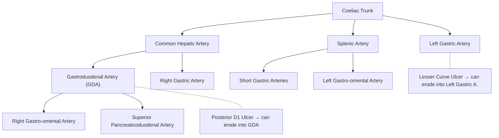

# Upper GI Bleed (UGIB)

## 1. Definition

Upper gastrointestinal bleeding (UGIB) refers to haemorrhage originating from the gastrointestinal tract **proximal to the ligament of Treitz** (the duodenojejunal flexure) [1][2][3].

- The **ligament of Treitz** ("Treitz" = a Czech pathologist who described it) is the suspensory ligament of the duodenum — a fibromuscular band connecting the duodenojejunal junction to the right crus of the diaphragm. It serves as the anatomical landmark dividing upper from lower GI bleeding.
- Therefore, UGIB encompasses bleeding from the **oesophagus, stomach, and duodenum** (up to the 4th part/DJ flexure).

**Key terminology to define upfront:**

| Term | Definition | Mechanism / Clinical Implication |
|:---|:---|:---|
| **Haematemesis** | Vomiting of blood (frank red or coffee-ground) | Source must be proximal to ligament of Treitz. Frank blood = brisk/active bleeding; coffee-ground = blood exposed to gastric acid (acid converts haemoglobin → haematin, which is brown/black) |
| **Melena** | Black, tarry, offensive-smelling stool | Blood degraded by gut bacteria + digestive enzymes during transit. Requires only ~50–100 mL of blood in the upper GIT. Anatomical extent: nasopharynx to proximal colon |
| **Haematochezia** | Passage of fresh red blood per rectum | Usually lower GI in origin, but can occur with **massive** UGIB (rapid transit > 1000 mL overwhelms the degradation capacity) |
| **Coffee-ground vomitus** | Dark, granular emesis | Small-volume / slow-rate bleed that has been partially digested by gastric acid |
| **Occult GI bleeding** | Bleeding not visible to the patient | Detected only by faecal occult blood test (FOBT) or iron-deficiency anaemia |

<Callout title="Don't Confuse">
**Melena** can also be mimicked by iron supplementation and bismuth (bismuth + sulfur in the gut → bismuth sulfide = black). Always ask about drug history. However, these do NOT produce the characteristic tarry consistency and offensive smell of true melena [2].
</Callout>

**GI bleeding of obscure origin** [3][4]:
- Defined as bleeding of unknown origin persisting or recurring after negative upper and lower endoscopy ("top and tail")
- **Obscure overt**: visible bleeding symptoms (haematemesis, melena, haematochezia) but source unidentified
- **Obscure occult**: iron-deficiency anaemia + FOBT positive, but no visible bleeding and source unidentified
- Most eventually found in the **small bowel** (between ligament of Treitz and ileocaecal valve)

---

## 2. Epidemiology

### 2.1 Incidence
- UGIB is a common medical emergency with an annual incidence of approximately **50–150 per 100,000 population** in Western countries
- In Hong Kong, UGIB remains a significant cause of hospital admissions, particularly among the elderly population given the high prevalence of *H. pylori* infection and widespread NSAID/aspirin use in an ageing population

### 2.2 Mortality
- Overall in-hospital mortality: **~5–10%** (higher in variceal bleeding: 15–25%)
- Mortality has decreased over the past decades due to advances in **endoscopic haemostasis, PPI therapy**, and ICU care
- ***Leading cause of death of peptic ulcer*** is haemorrhage [5]

### 2.3 Age and Sex
- More common in **males** (M:F ≈ 2–3:1 for peptic ulcer disease) [2]
- Incidence increases with **age** — elderly patients have more comorbidities, take more NSAIDs/anticoagulants, and have reduced mucosal defence
- ***Age > 60*** is a risk factor for recurrent bleeding and poor outcomes [1][6]

### 2.4 Hong Kong-Specific Considerations
- **H. pylori** prevalence: ~50% in the Hong Kong adult population (declining in younger cohorts due to improved sanitation, but still significant)
- High use of aspirin/antiplatelets in the ageing population for cardiovascular prophylaxis
- Liver disease and hepatitis B virus (HBV) — Hong Kong has a historically high HBV prevalence (~8% carrier rate), leading to cirrhosis and **portal hypertension/variceal bleeding**
- Alcohol-related liver disease is increasing
- NSAID availability (including over-the-counter) contributes to peptic ulcer bleeding

---

## 3. Risk Factors

These can be divided into risk factors for **developing** UGIB and risk factors for **poor outcome/recurrent bleeding** once UGIB has occurred.

### 3.1 Risk Factors for Developing UGIB

| Category | Risk Factors | Mechanism |
|:---|:---|:---|
| ***Drugs*** | ***NSAIDs (including aspirin), anticoagulants, antiplatelets, corticosteroids*** | NSAIDs inhibit COX-1 → ↓ prostaglandins → loss of mucosal protection. Anticoagulants impair clot formation at bleeding sites. Steroids augment NSAID ulcerogenicity |
| ***H. pylori infection*** | Gram-negative microaerophilic bacterium | Colonises gastric epithelium → chronic inflammation → disrupts mucous layer → mucosal injury |
| **Stress** | ICU patients, burns (Curling's ulcer), head injury (Cushing's ulcer), major surgery | Mucosal hypoperfusion → ischaemia → stress ulceration |
| **Excess gastric acid** | Zollinger-Ellison syndrome (gastrinoma) | Hypergastrinaemia → massive acid hypersecretion → ulceration |
| ***Liver disease*** | Portal hypertension → varices, coagulopathy | ↑ Portal pressure → portosystemic collaterals (varices). Also ↓ synthetic function → ↓ clotting factors |
| **Alcohol** | Chronic alcoholism | Direct mucosal irritant + liver disease + Mallory-Weiss tears from retching |
| **Smoking** | Impaired mucosal healing, ↑ acid secretion | |
| **Previous GI bleed** | Prior ulcer or variceal bleed | History of bleeding is the strongest predictor of future bleeding |
| **Age** | Elderly ( > 60 years) | Reduced mucosal defence, polypharmacy, more comorbidities |

### 3.2 Risk Factors for Recurrent Bleeding / Poor Outcome

Per lecture slides [1][6]:

> ***Risk factors for recurrent bleeding:***
> - ***Shock on presentation***
> - ***Hb < 8.0 g/dL on presentation***
> - ***Transfusion requirement***
> - ***Age > 60 yrs***
> - ***Comorbidity***
> - ***Coagulopathy***
> - ***Patient already hospitalised*** (i.e. in-patient bleed — worse prognosis than community-onset)
> - ***Large ulcer***
> - ***Ulcer on posterior D1*** (because of proximity to **gastroduodenal artery**)
> - ***Ulcer on higher posterior lesser curve*** (because of proximity to **left gastric artery**)

<Callout title="Why Posterior D1 Ulcers Are Dangerous" type="idea">
The **gastroduodenal artery (GDA)** runs directly behind the first part of the duodenum. A posterior D1 ulcer can erode into the GDA, causing catastrophic arterial haemorrhage that is often difficult to control endoscopically. Similarly, ulcers on the **posterior lesser curvature** can erode into the **left gastric artery**. These are the two most feared locations for bleeding peptic ulcers [1][5][6].
</Callout>

---

## 4. Anatomy and Function

Understanding the anatomy is essential for knowing *why* certain lesions bleed, *where* they bleed from, and *what* arteries are at risk.

### 4.1 The Upper GI Tract — Overview

The upper GI tract for the purposes of UGIB extends from the **oesophagus** → **stomach** → **duodenum** (to the ligament of Treitz at the DJ flexure).

### 4.2 Oesophagus
- ~25 cm muscular tube from pharynx (C6) to stomach (T11)
- **No serosa** — this makes the oesophagus susceptible to **perforation** (Boerhaave syndrome) and means that oesophageal cancers spread early [3]
- The **gastro-oesophageal junction (GOJ/GEJ)** is the site of:
  - Oesophageal varices (submucosal veins draining into both portal and systemic systems)
  - Mallory-Weiss tears (mucosal lacerations at the GEJ)
- Blood supply: inferior thyroid arteries (upper), bronchial arteries (mid), left gastric artery and inferior phrenic artery (lower)
- **Venous drainage**: The lower oesophageal veins drain into the **left gastric (coronary) vein** (portal system) — this is precisely why **oesophageal varices** form here in portal hypertension

### 4.3 Stomach

***Arterial supply*** [2]:

- **Greater curvature**:
  - **Short gastric arteries** (from splenic artery)
  - **Left gastro-omental (gastroepiploic) artery** (from splenic artery)
  - **Right gastro-omental (gastroepiploic) artery** (from gastroduodenal artery)
- **Lesser curvature**:
  - **Left gastric artery** (from coeliac trunk — the largest artery supplying the stomach)
  - **Right gastric artery** (from common hepatic artery → proper hepatic artery)

***Nerve supply*** [2]:

- **Sympathetic**: Greater splanchnic nerve (T5–T9)
- **Parasympathetic** (vagus nerve):
  - ***Anterior vagal nerve***: Stomach + Pylorus + Liver
  - ***Posterior vagal nerve***: Stomach + Foregut and midgut down to splenic flexure

<Callout title="Vagotomy in PUD Surgery" type="idea">
Understanding vagal anatomy explains surgical options for PUD. **Truncal vagotomy** divides both vagal trunks → reduces acid secretion but also denervates the pylorus (causing gastroparesis), so a **drainage procedure** (pyloroplasty or gastrojejunostomy) is always added. **Highly selective vagotomy** preserves the **nerve of Latarjet** (which innervates the antrum/pylorus for gastric motility) and only denervates parietal cell–containing areas — no drainage needed, but technically difficult [5].
</Callout>

**Gastric mucosal defence** — the balance between aggressive and protective factors:

| Aggressive Factors | Protective Factors |
|:---|:---|
| Gastric acid (HCl) | Mucus-bicarbonate barrier |
| Pepsin | Mucosal blood flow |
| H. pylori | Prostaglandins (PGE₂, PGI₂) |
| NSAIDs | Epithelial cell renewal |
| Bile reflux | Tight junctions |
| Alcohol, smoking | Trefoil peptides |

The mucosa is a dynamic battleground. **Peptic ulceration occurs when aggressive factors overwhelm protective factors.**

### 4.4 Duodenum

- Four parts (D1–D4); the ligament of Treitz marks the junction of D4 and jejunum
- **D1 (duodenal bulb/cap)** is the ***most common site*** for duodenal ulcers [2]
- The **gastroduodenal artery (GDA)** — a branch of the common hepatic artery — runs posterior to D1. This is why ***posterior D1 ulcers*** cause severe arterial haemorrhage
- The **ampulla of Vater** opens into D2 — bleeding from the ampulla (**haemobilia**) can present as UGIB

### 4.5 Key Arterial Relationships for UGIB

---

## 5. Etiology (with focus on Hong Kong)

The causes of UGIB can be remembered by anatomical location (oesophagus → stomach → duodenum) or by frequency.

### 5.1 Common Causes — In Descending Order of Frequency

Per lecture slides [1]:

> ***Causes of upper GI bleeding in descending order of frequency:***
> 1. ***Duodenal or gastric ulcer***
> 2. ***Gastritis***
> 3. ***Esophageal or gastric varices***
> 4. ***Mallory-Weiss syndrome***
> 5. ***Benign or malignant gastric tumour***

#### 5.1.1 Peptic Ulcer Disease (PUD) — The Most Common Cause

**Definition**: A defect in the gastrointestinal mucosa that **extends through the muscularis mucosae** (distinguishing an ulcer from an erosion, which is superficial) [2].

**Locations** [2]:
- **Duodenum (75%)**: D1 (duodenal bulb) is the ***most common*** site
  - Unusual for non-NSAID ulcers to occur outside D1 — if they do, suspect Zollinger-Ellison syndrome or Crohn's disease
- **Stomach (20%)**: Lesser curvature and antrum most common
- **Oesophagus, Meckel's diverticulum, stomal ulcers** (rare)

**Four major risk factors** [2][3]:

1. ***H. pylori infection***
2. ***NSAIDs***
3. ***Stress***
4. ***Excess gastric acid***

**Pathophysiology of each risk factor:**

**a) H. pylori** [2]:
- **Microaerophilic Gram-negative coccobacillus** (micro = small, aerophilic = oxygen-loving, but only in small amounts)
- **Strong urease activity** → hydrolyses urea → ammonia → neutralises gastric acid around the bacterium, creating a **protective alkaline cloud** that allows survival
- **Spiral shape + flagella + mucolytic enzymes** → enable the organism to burrow through the mucus layer to reach the gastric surface epithelium
- Once established, it causes **chronic active gastritis** via:
  - Direct epithelial injury (cytotoxins: CagA, VacA)
  - Inflammatory cascade (IL-8 recruitment of neutrophils)
  - Disruption of the mucous barrier → mucosa exposed to acid → ulceration

The **pattern of gastritis** determines the clinical outcome [2]:
- **Antral-predominant gastritis** → ↑ gastrin release from G cells → ↑ acid secretion → **duodenal ulcer** (does NOT predispose to gastric cancer)
- **Pangastritis** (antrum + body) → eventual atrophy of parietal cells → **↓ acid secretion (hypochlorhydria)** → compensatory ↑ gastrin → **gastric ulcer + ↑ risk of gastric cancer**

**b) NSAIDs (including aspirin)** [2]:
- Gastric and duodenal mucosa use **COX-1** for prostaglandin synthesis
- **Prostaglandins (PGE₂)** protect the mucosa by:
  - Stimulating mucin production
  - Stimulating bicarbonate secretion
  - Maintaining mucosal blood flow
  - Inhibiting gastric acid secretion
- **NSAIDs non-selectively inhibit COX-1 and COX-2** → ↓ prostaglandins → loss of mucosal protection → mucosal barrier breakdown → back-diffusion of H⁺ ions → injury
- **COX-2 selective inhibitors** (celecoxib) preserve COX-1 and therefore have less GI toxicity — but NOT zero risk

*Risk factors for NSAID-related ulcers* [2]:
- Advanced age ( > 75 years)
- Prior ulcer history or complications
- High dose / long duration / relatively toxic NSAID
- Concurrent corticosteroids or anticoagulants

**c) Stress ulcers** [2]:
- Occur in critically ill ICU patients — burns (**Curling's ulcer**), head injury (**Cushing's ulcer**), sepsis, multi-organ failure
- Mechanism: **splanchnic hypoperfusion** → mucosal ischaemia → intramural acidosis → epithelial cell death → ulceration
- Cushing's ulcers are unique: head injury → ↑ vagal tone → ↑ acid secretion AND mucosal ischaemia

**d) Excess gastric acid — Zollinger-Ellison syndrome** [2]:
- **Gastrinoma** (usually in the **gastrinoma triangle** — duodenum/pancreas) secretes gastrin autonomously
- ↑↑ Gastric acid → overwhelms mucosal defence → ulceration in unusual locations (2nd part duodenum, jejunum)
- Suspect when: recurrent ulcers despite adequate treatment, unusual ulcer locations, no NSAID/H. pylori, diarrhoea (acid inactivates pancreatic enzymes)
- Diagnosis: ↑ fasting serum gastrin + high gastric acid output

**Modified Johnson Classification of Gastric Ulcers** [2][5]:

| Type | Location | Acid Secretion |
|:---|:---|:---|
| ***Type I*** (most common, 58%) | Along lesser curvature near angular incisure | Normal / ↓ |
| ***Type II*** (22%) | Body of stomach (GU) + Duodenum (DU) simultaneously | ↑↑ |
| ***Type III*** (20%) | Prepyloric | ↑↑ |
| ***Type IV*** (rare) | High on lesser curvature near OGJ | ↓↓ |
| ***Type V*** | Any location — medication-induced | Normal |

<Callout title="Clinical Pearl — Johnson Types II and III">
Types II and III are associated with **acid hypersecretion** — similar pathophysiology to duodenal ulcers. Types I and IV are associated with normal or low acid secretion — the problem is **impaired mucosal defence**, and there is a higher malignant potential. Type V is drug-induced and can occur anywhere [2].
</Callout>

#### 5.1.2 Gastritis / Duodenitis

- Inflammation-associated mucosal injury that is typically **self-limited** [2]
- Causes: ***NSAIDs/aspirin***, ***alcohol***, ***stress***
- Bleeding is usually from superficial erosions (does not extend through muscularis mucosae)
- Diagnosis is made exclusively by **endoscopic evaluation** of the mucosa
- Gastritis is the **second most common** cause of UGIB [1]

#### 5.1.3 Oesophageal or Gastric Varices

- A complication of **portal hypertension**, most commonly due to **liver cirrhosis** [2][3]
- In Hong Kong, HBV-related cirrhosis is historically the most important cause, though alcohol-related and NAFLD-related cirrhosis are increasing

**Pathophysiology** [2]:
- Portal hypertension → opening and dilatation of pre-existing portosystemic collateral channels → **varices**
- Varices decompress the portal circulation by shunting blood back to the systemic venous circulation
- **Most common location**: distal oesophagus and proximal stomach (around the GEJ)
  - Formed when the **left gastric (coronary) vein** (portal system) collateralises with **oesophageal veins** (systemic/azygos system)
- **Hepatic venous pressure gradient (HVPG)** = portal vein pressure – IVC pressure
  - Normal: 1–5 mmHg
  - **Varices develop at HVPG ≥ 10 mmHg**
  - ***Bleeding risk increases at HVPG ≥ 12 mmHg***
  - Unlikely to bleed if HVPG < 12 mmHg [2]
- **Laplace's Law**: Wall tension (T) ∝ Pressure (P) × Radius (r) / Wall thickness (w)
  - Larger varices have greater radius → greater wall tension → higher risk of rupture → ***larger the varices, the more likely they will bleed*** [2]

**Endoscopic Grading** [2]:
- **F1**: Small straight varices — fully compress with air insufflation
- **F2**: Enlarged tortuous varices occupying < 1/3 of lumen — fail to compress with air
- **F3**: Large coil-shaped varices occupying > 1/3 of lumen — fail to compress with air
- **Red signs** (indicate ↑ bleeding risk):
  - **Red wale marks** = longitudinal red streaks on varices (resemble red corduroy wales)
  - **Cherry red spots** = discrete red cherry-coloured spots overlying varices

**Clinical presentation** [2]:
- Haematemesis (often large volume, bright red)
- Melena
- Shock
- ± Coma (hepatic encephalopathy — ammonia from blood in the gut + impaired hepatic clearance)

#### 5.1.4 Mallory-Weiss Syndrome

***Definition: Longitudinal mucosal (superficial) tears of distal oesophagus*** at the gastro-oesophageal junction [2][3].

**Pathogenesis**:
- **Forceful retching/vomiting** → sudden ↑ intra-abdominal pressure → mechanical tearing of the mucosa at the GEJ
- The lacerations involve the **mucosa and submucosa** but NOT the full thickness (that would be Boerhaave syndrome)
- Tears expose **submucosal arteries** → bleeding

**Risk factors** [3]:
- **Chronic alcoholism** (most common association — alcohol causes nausea/retching)
- Bulimia
- Severe retching from any cause (chemotherapy, gastroparesis)
- Sudden increase in intra-abdominal pressure (straining, coughing, seizures)

**Key distinction from Boerhaave syndrome** [3]:

| Feature | Mallory-Weiss | Boerhaave |
|:---|:---|:---|
| Depth | Mucosal/submucosal tear | **Full-thickness** perforation |
| Location | GEJ | Left posterolateral distal oesophagus |
| Presentation | Haematemesis | Chest pain, surgical emphysema, sepsis |
| Prognosis | Usually self-limited (80–90%) | Surgical emergency, high mortality |

#### 5.1.5 Upper GI Malignancy

- ***Benign or malignant gastric tumour*** [1]
- Oesophageal, gastric, or duodenal cancers are **uncommon** causes of UGIB
- Usually presents with **constitutional symptoms** (weight loss, anorexia, early satiety) + chronic occult bleeding → iron-deficiency anaemia rather than massive haematemesis
- In Hong Kong, gastric cancer remains relevant — risk factors include *H. pylori*, smoking, salt-preserved foods, family history
- Gastrointestinal stromal tumour (GIST) can also bleed

### 5.2 Less Common Causes

Per lecture slides [1]:

> ***Less common causes of UGIB:***
> - ***Esophagitis, esophageal tumour***
> - ***Stomal ulcer***
> - ***Aortoduodenal fistula***
> - ***Haemobilia, haemosuccus pancreaticus***
> - ***Vascular malformation, angiodysplasia***
> - ***Dieulafoy's lesion***
> - ***Duodenal or jejunal diverticulum, jejunal ulcer***

#### 5.2.1 Oesophagitis / Oesophageal Ulcers [2]
- Usually in context of **GERD** (gastro-oesophageal reflux disease) — acid reflux → mucosal injury
- Other causes: infections (HSV, CMV, Candida — especially in immunocompromised), medications (tetracycline, bisphosphonates — pill oesophagitis), irradiation
- Risk factors: obesity, GERD, immunosuppression

#### 5.2.2 Portal Hypertensive Gastropathy [2]
- Portal hypertension → **mucosal vascular ectasia** in the stomach
- Mucosa is **friable** → bleeds when ectatic vessels rupture
- More commonly presents as **chronic occult bleeding** with anaemia rather than acute haemorrhage
- Endoscopic appearance: mosaic-like (snakeskin) pattern of mucosa

#### 5.2.3 Dieulafoy's Lesion [2][3][4]
- ***Dilated aberrant submucosal vessel*** that erodes the overlying epithelium **in the absence of a primary ulcer**
- Usually located in the ***proximal stomach along the lesser curvature*** or near the GEJ (some sources say ***gastric fundus*** is MC site) [2][5]
- Can cause massive arterial bleeding from a very small mucosal defect (< 3 mm)
- Diagnosis is endoscopic — a visible vessel protruding through normal-appearing mucosa
- Management: endoscopic therapy (sclerosant injection, endoscopic clips, thermocoagulation)

#### 5.2.4 Gastric Antral Vascular Ectasia (GAVE) — "Watermelon Stomach" [2]
- Known as ***"watermelon stomach"*** because endoscopic appearance shows ***longitudinal rows of flat, reddish stripes radiating from the pylorus into the antrum***
- Distinct from portal hypertensive gastropathy (GAVE occurs in the antrum specifically, PHG is more diffuse/fundal)
- Often responds to **argon plasma coagulation (APC)**

#### 5.2.5 Aorto-Enteric Fistula [2][3]
- ***Medical emergency with high mortality rate***
- Direct communication between the **aorta** and the GI tract
- Almost always **secondary** to placement of a **prosthetic abdominal aortic vascular graft** — should be suspected in any patient with ***prior AAA repair*** presenting with GI bleeding
- ***3rd or 4th portion of the duodenum*** is the most common site (because the graft lies directly adjacent)
- Classic presentation: "herald bleed" (initial small bleed) → massive exsanguination
- Diagnosis: **CT aortogram** [3]

#### 5.2.6 Haemobilia [2]
- Bleeding from the **hepatobiliary tract** (haemo = blood, bilia = bile)
- Should be considered in patients with history of **hepatic or biliary instrumentation** (percutaneous liver biopsy, transjugular liver biopsy, ERCP, hepatic trauma)
- Classic triad (**Quincke's triad**): upper GI bleeding + biliary colic + jaundice

#### 5.2.7 Haemosuccus Pancreaticus [2]
- Bleeding from the **pancreatic duct** (haemo = blood, succus = juice, pancreaticus = pancreas)
- Most often in patients with **chronic pancreatitis**, pancreatic pseudocysts, or pancreatic tumours
- Mechanism: pseudocyst or inflammation erodes into a peripancreatic artery (often splenic artery) → blood drains via pancreatic duct → ampulla of Vater → duodenum

#### 5.2.8 Angiodysplasia [2][4]
- ***Dilated tortuous submucosal vessels*** (arteriovenous malformations)
- In the upper GI tract, often originates from stomach and duodenum [2]
- More common in elderly, associated with **aortic stenosis** (Heyde syndrome — acquired type 2A von Willebrand disease) and **ESRD** [4]
- Diagnosis: endoscopy shows ***cherry red spots***; angiography shows ***"mother-in-law phenomenon"*** (early filling, delayed emptying) [4]
- Management: **argon plasma coagulation (APC)**, endoscopic electrocoagulation, or angiographic embolisation [4]

#### 5.2.9 Cameron Lesions [2]
- **Erosions or ulcers** occurring in the sac of a **hiatal hernia**
- Mechanism: mechanical trauma of the gastric mucosa at the diaphragmatic hiatus during respiration/sliding

#### 5.2.10 Stomal Ulcer [1]
- Occurs at surgical anastomotic sites (e.g., after Billroth I/II, Roux-en-Y)
- Usually due to acid exposure of susceptible jejunal mucosa

### 5.3 GI Bleeding of Obscure Origin [4]

Per lecture slide [4], causes include:

> ***Vascular diseases***: ***Angiodysplasia, Angiomas, Dieulafoy lesion, Watermelon stomach, Varices, Haemosuccus pancreaticus, Haemobilia***
>
> ***Ulcerative diseases***: ***Peptic ulcer, Reflux disease, Cameron ulcers, Crohn's disease***
>
> ***Neoplasms***: ***Polyps, Lipoma, Lymphoma, Carcinoid, GIST, Primary small bowel carcinoma, Metastatic cancer, Melanoma***
>
> ***Genetic disorders***: ***Osler-Weber-Rendu syndrome, Blue rubber bleb naevus syndrome, Gardner's syndrome, Hermansky-Pudlak syndrome, Klippel-Trenaunay-Weber syndrome, Neurofibromatosis type I and II, Ehlers-Danlos syndrome***
>
> ***Others***: ***Medications/NSAID, CMV infection, Tuberculosis infection, Meckel's diverticulum, Diverticulosis***

---

## 6. Classification

UGIB can be classified in multiple ways:

### 6.1 By Aetiology
- **Variceal** vs. **Non-variceal** — this is the most clinically important distinction because management differs fundamentally

| Feature | Variceal UGIB | Non-Variceal UGIB |
|:---|:---|:---|
| Cause | Portal hypertension (cirrhosis) | PUD, gastritis, Mallory-Weiss, etc. |
| Typical patient | Chronic liver disease, stigmata of cirrhosis | NSAID use, H. pylori, elderly |
| Severity | Often massive, high mortality | Variable — can be massive (GDA erosion) |
| Initial pharmacotherapy | **Terlipressin** (splanchnic vasoconstrictor) + IV antibiotics | **IV PPI** (esomeprazole 80 mg bolus → 8 mg/h) |
| Endoscopic Rx | Band ligation (oesophageal) / Histoacryl glue (gastric) | Adrenaline injection + thermal/clips |
| Rescue | Sengstaken-Blakemore tube / TIPSS | Surgery / IR embolisation |

### 6.2 By Severity
- **Mild**: stable haemodynamics, Hb > 10, no ongoing bleeding
- **Moderate**: tachycardia, Hb 7–10, some postural symptoms
- **Severe/Massive**: ***shock*** (tachycardia, hypotension), Hb < 7, ongoing haematemesis/haematochezia, requiring urgent transfusion and intervention

### 6.3 Endoscopic Classification of Peptic Ulcer Bleeding (Forrest Classification)

This is the standard classification used during OGD to describe the ulcer base and predict rebleeding risk:

| Forrest Class | Description | Rebleeding Risk (%) | Endoscopic Therapy? |
|:---|:---|:---|:---|
| **Ia** | Spurting arterial haemorrhage | 90% | **Yes** |
| **Ib** | Oozing haemorrhage | 50% | **Yes** |
| **IIa** | Non-bleeding visible vessel | 50% | **Yes** |
| **IIb** | Adherent clot | 30% | Consider (irrigate clot) |
| **IIc** | Flat pigmented spot | 7% | No |
| **III** | Clean-base ulcer | 3% | No |

<Callout title="High Yield — Forrest Classification" type="idea">
**Forrest Ia, Ib, and IIa** are considered **high-risk stigmata** and require endoscopic haemostasis. **Forrest IIb** (adherent clot) is controversial — current practice is to attempt to dislodge the clot to assess the underlying ulcer base. **Forrest IIc and III** are low-risk and do NOT need endoscopic therapy — just PPI and observation.
</Callout>

---

## 7. Clinical Features

### 7.1 Symptoms

The symptoms of UGIB reflect the **volume and rate of blood loss**, the **underlying cause**, and the **patient's baseline physiology**.

#### 7.1.1 Presenting Symptoms of Bleeding

| Symptom | Pathophysiological Basis |
|:---|:---|
| ***Haematemesis*** (frank blood) | Active, moderate-to-severe bleeding proximal to ligament of Treitz. Blood has not been in contact with gastric acid long enough to be degraded |
| ***Coffee-ground vomitus*** | Slower or more limited bleeding. Blood in the stomach is exposed to **HCl** → haemoglobin oxidised to **haematin** (brown/black pigment) → granular appearance |
| ***Melena*** (black tarry stool) | Blood (≥50 mL) transits through the GI tract → bacterial degradation + enzymatic digestion → produces haematin and other pigments → characteristic black colour and offensive smell. Loose consistency because **blood in the GI tract causes intestinal hurry** (is an osmotic and irritant stimulus) [2] |
| ***Haematochezia*** (fresh red blood PR) | Usually lower GI, but can occur with ***massive*** UGIB — rapid transit ( > 1000 mL) means blood passes through so quickly that there is insufficient time for degradation |

<Callout title="Exam Tip" type="error">
Students often assume haematochezia = lower GI bleed. **Always consider massive UGIB** as a cause of haematochezia, especially if the patient is in shock. A nasogastric tube aspirate or urgent OGD may be needed to rule out an upper source [2][3].
</Callout>

#### 7.1.2 Symptoms of Hypovolaemia / Shock

These reflect the **volume and rate** of blood loss:

| Symptom | Mechanism |
|:---|:---|
| **Dizziness / lightheadedness** | ↓ Cerebral perfusion due to hypovolaemia |
| **Syncope / pre-syncope** | Severe ↓ cerebral blood flow. Postural hypotension initially, then frank syncope |
| **Palpitations** | Compensatory ↑ heart rate (sympathetic activation) to maintain cardiac output despite ↓ preload |
| **Thirst** | Hypovolaemia → ADH release + angiotensin II → thirst stimulus |
| **Dyspnoea / exertional breathlessness** | ↓ Haemoglobin → ↓ oxygen-carrying capacity; also ↑ cardiac output with sympathetic drive |
| **Confusion / altered consciousness** | Severe ↓ cerebral perfusion → global cerebral hypoxia |
| **Oliguria** | ↓ Renal perfusion → ↓ GFR → ↓ urine output |

> ***Severity assessment*** [3]: **syncope, postural hypotension, palpitation** indicate significant volume loss.

<Callout title="Why Anaemic Symptoms Are UNCOMMON in Acute UGIB" type="idea">
In acute haemorrhage, **both plasma and red cells are lost simultaneously** — the haematocrit/haemoglobin may be normal initially because the blood is "diluted" proportionally. Classic anaemic symptoms (fatigue, pallor) develop later as the body auto-resuscitates (shifts interstitial fluid into the vascular compartment) and the remaining blood becomes diluted. This is why ***initial Hb is an unreliable marker of severity*** in acute UGIB — it may take 24–72 hours to equilibrate [3].
</Callout>

#### 7.1.3 Symptoms Related to Specific Aetiologies

| Symptom | Suggests | Mechanism |
|:---|:---|:---|
| ***Preceding forceful vomiting*** then haematemesis | ***Mallory-Weiss syndrome*** | Retching → ↑ intra-abdominal pressure → mucosal tear at GEJ [3] |
| ***Epigastric pain associated with meals*** | ***PUD*** | Gastric ulcer: pain ↑ with eating (food → acid). Duodenal ulcer: pain 2–5h after meals / at night (relieved by food/antacids) [3] |
| ***Jaundice, easy bruising, distended abdomen, peripheral oedema*** | ***Liver failure / cirrhosis*** (variceal bleed) | Jaundice = ↓ bilirubin conjugation. Bruising = ↓ clotting factors. Ascites = portal hypertension + hypoalbuminaemia. Oedema = hypoalbuminaemia [3] |
| ***Constitutional symptoms*** (weight loss, anorexia, night sweats) | ***Malignancy*** | Tumour metabolism, cytokine release (TNF-α, IL-6) |
| ***Dysphagia*** | ***CA oesophagus*** | Progressive luminal obstruction by tumour [3] |
| ***Persistent epigastric pain*** | ***CA stomach*** | Transmural invasion, peritoneal irritation [3] |
| **Heartburn / acid brash** | Oesophagitis / GERD | Acid reflux → mucosal inflammation |
| **Epigastric pain radiating to back** | Pancreatic pathology (haemosuccus pancreaticus) | Retroperitoneal inflammation/erosion into splenic artery |
| **Recent liver biopsy / ERCP** | Haemobilia | Iatrogenic vascular injury in hepatobiliary tract |
| **History of AAA repair** | ***Aorto-enteric fistula*** | Graft erodes into duodenum (usually D3/D4) [2][3] |

### 7.2 Signs

#### 7.2.1 General Examination

| Sign | Pathophysiological Basis |
|:---|:---|
| **Pallor** (conjunctivae, palms, nail beds) | ↓ Haemoglobin → ↓ red colour in vascular beds |
| **Tachycardia** ( > 100 bpm) | Sympathetic compensatory response to ↓ circulating volume (baroreceptor reflex) |
| **Hypotension** (SBP < 100 mmHg) | Severe intravascular volume depletion exceeding compensatory capacity |
| **Postural hypotension** (SBP drop ≥ 20 mmHg on standing) | Moderate hypovolaemia — on standing, gravitational pooling in legs + ↓ preload → insufficient cardiac output |
| **↓ Capillary refill time** ( > 2 seconds) | Peripheral vasoconstriction (sympathetic response to maintain central perfusion) |
| **Cold, clammy extremities** | Sympathetic vasoconstriction — shunts blood away from periphery to vital organs |
| **Altered mental status** | ↓ Cerebral perfusion (Class III–IV shock) |
| ***Tachycardia*** as a feature of ongoing bleeding [2] | Persistent sympathetic drive due to continued haemorrhage |
| **Dry mucous membranes** | Dehydration / hypovolaemia |

#### 7.2.2 ATLS Classification of Haemorrhagic Shock

This is a **must-know** framework for assessing blood loss [3]:

| Parameter | **Class I** | **Class II** | **Class III** | **Class IV** |
|:---|:---|:---|:---|:---|
| Blood loss (mL) | < 750 | 750–1500 | 1500–2000 | > 2000 |
| Blood loss (%) | < 15% | 15–30% | 30–40% | > 40% |
| Heart rate | < 100 | 100–120 | 120–140 | > 140 |
| Blood pressure | Normal | Normal | ↓ | ↓↓ |
| Pulse pressure | Normal | ↓ | ↓ | ↓↓ |
| Respiratory rate | 14–20 | 20–30 | 30–40 | > 35 |
| Urine output (mL/h) | > 30 | 20–30 | 5–15 | Negligible |
| CNS | Slightly anxious | Anxious | Confused | Lethargic |

<Callout title="ATLS Classification" type="error">
***This is marked as important in the senior notes [3]***. Notice that **blood pressure does NOT drop until Class III** ( > 30% blood loss) — this means a normotensive patient can still have lost up to 1500 mL of blood. **Tachycardia** is an earlier sign. Don't be falsely reassured by a normal BP.
</Callout>

#### 7.2.3 Signs of Chronic Liver Disease (Suggesting Variceal Bleeding)

If you see these signs, think **portal hypertension → variceal bleed**:

| Sign | Mechanism |
|:---|:---|
| **Jaundice** | ↓ Hepatic bilirubin conjugation/excretion |
| **Spider naevi** (in SVC distribution) | Oestrogen excess (↓ hepatic metabolism) → arteriolar vasodilation |
| **Palmar erythema** | Hyperdynamic circulation + ↑ oestrogen |
| **Gynaecomastia** | ↑ Oestrogen (↓ hepatic metabolism) |
| **Caput medusae** | Umbilical vein recanalisation due to portal hypertension → visible periumbilical venous distension |
| **Ascites** | Portal hypertension (↑ hydrostatic pressure in splanchnic capillaries) + hypoalbuminaemia (↓ oncotic pressure) + renal sodium/water retention (RAAS activation) |
| **Splenomegaly** | Portal congestion → splenic venous hypertension |
| **Asterixis (liver flap)** | Hepatic encephalopathy — ↑ ammonia → impaired neurotransmission |
| **Easy bruising / petechiae** | ↓ Clotting factor synthesis + thrombocytopenia (hypersplenism) |
| **Peripheral oedema** | Hypoalbuminaemia → ↓ plasma oncotic pressure → fluid shifts to interstitium |
| **Dupuytren's contracture** | Associated with alcoholic liver disease (mechanism unclear, possibly fibroblast proliferation) |
| **Fetor hepaticus** | Volatile dimethyl sulfide in expired air (↓ hepatic clearance) |

#### 7.2.4 Abdominal Examination

| Finding | Significance |
|:---|:---|
| **Epigastric tenderness** | PUD, gastritis |
| **Hepatomegaly** (or small shrunken liver in cirrhosis) | Liver disease |
| **Splenomegaly** | Portal hypertension |
| **Ascites** (shifting dullness, fluid thrill) | Portal hypertension + hypoalbuminaemia |
| **Surgical scars** | Prior AAA repair (→ aorto-enteric fistula), prior gastric surgery (→ stomal ulcer) |
| **Abdominal mass** | Malignancy |

#### 7.2.5 Per Rectal Examination

**Always perform a PR examination** in suspected GI bleed:
- **Melena** — black, tarry, offensive stool confirms upper GI source
- **Fresh blood** — consider massive UGIB or lower GI source
- **Rectal mass** — malignancy

#### 7.2.6 Features of Ongoing Bleeding [2]

> ***Features of ongoing bleeding:***
> - ***Haematemesis***
> - ***Haematochezia***
> - ***Fresh PR bleeding***
> - ***Fresh blood aspirated from NG tube***
> - ***Tachycardia***

### 7.3 Key History Points (Systematic Approach) [3]

***Important questions to ask*** [3]:

1. **Vomitus**: Amount, character
   - ***Haematemesis*** (fast rate of bleeding)
   - ***Coffee-ground*** (small amount / slow rate, blood altered by gastric acid)
   - Distinguish from **haemoptysis** (coughing up blood from lungs)

2. **Stool**: Character
   - ***Melena***: fresh (jet-black tarry stool) vs. stale (black-grey dull, mixed with normal stool)
   - ***Haematochezia***: fresh PR bleeding — profuse & fast

3. **Severity**: For deciding urgency of OGD
   - ***Volume loss***: syncope, postural hypotension, palpitation
   - ***Rate of bleeding***: massive haematemesis + fresh PR bleed
   - ***Anaemic symptoms***: UNCOMMON acutely (both plasma & blood cells are lost) [3]

4. **Associated symptoms**: As above in the aetiological table

5. ***Risk factors***: ***Drug history (antiplatelet/anticoagulant, NSAID, steroid), H. pylori, liver disease*** [3]

---

## 8. Pre-Endoscopic Assessment

### 8.1 Initial Investigations [3]

| Investigation | Purpose |
|:---|:---|
| ***CBC*** | ***Baseline Hb*** (may be normal initially in acute bleed), platelet count |
| ***Clotting*** (PT/INR, APTT) | Coagulopathy assessment (liver disease, anticoagulant use) |
| ***Cross-match*** | Prepare for blood transfusion |
| ***LRFT*** (Liver + Renal Function Tests) | Liver disease (↑ bilirubin, ↓ albumin, ↑ INR). Renal function + electrolytes |
| ***Elevated urea:creatinine ratio ( > 100:1)*** | ***Hb digestion in gut → amino acids absorbed → urea production + reduced renal perfusion*** [3] — this is a clue to UGIB even before endoscopy |
| ***VBG*** (Venous Blood Gas) | ***Acidosis*** — lactic acidosis from tissue hypoperfusion [3] |
| ***CXR*** | ***Pneumoperitoneum (perforated peptic ulcer)*** + ***left-sided pleural effusion (Boerhaave's perforation)*** [3] |
| ***CT aortogram*** | ***If Hx of aortic graft → aorto-enteric fistula*** [3] |
| **Group & save** | For potential transfusion |
| **ECG** | Exclude myocardial ischaemia from anaemia/hypotension in elderly |

<Callout title="Urea:Creatinine Ratio in UGIB">
A disproportionately elevated urea relative to creatinine ( > 100:1 in SI units or > 36:1 in conventional units) strongly suggests **upper** rather than lower GI bleeding. Why? Haemoglobin is broken down to amino acids in the gut, absorbed, and converted to urea in the liver. Additionally, hypovolaemia causes pre-renal uraemia (↓ renal perfusion → ↑ urea reabsorption in proximal tubule). Creatinine is less affected by GI bleeding [3].
</Callout>

### 8.2 Risk Stratification Scores [3]

| Parameters | ***Glasgow-Blatchford Score (GBS)*** | ***Rockall Score*** |
|:---|:---|:---|
| Timing | **Pre-endoscopy** | Pre- and **post-endoscopy** |
| Components | Clinical + Lab (endoscopic results NOT required) | Clinical (***Age, BP, Comorbidities***) + Endoscopy (***Diagnosis, Evidence of bleeding***) |
| Purpose | Identifies patients who **need intervention** (transfusion, endoscopy, surgery) | Predicts **mortality** and rebleeding risk |
| Low-risk | GBS = 0 → consider outpatient management | Low Rockall → early discharge |

<Callout title="GBS vs Rockall — When To Use Which">
- **GBS** is done at the bedside BEFORE endoscopy — it helps decide if a patient needs admission/urgent endoscopy. A **GBS of 0** identifies very low-risk patients who can potentially be managed as outpatients.
- **Rockall** incorporates endoscopic findings and is done AFTER OGD — it helps predict rebleeding and mortality, guiding disposition decisions [3].
</Callout>

### 8.3 Pre-Endoscopic PPI [3]

> ***Pre-endoscopic PPI: IV esomeprazole 80 mg stat → 8 mg/h infusion until OGD***

- Rationale: Raising gastric pH promotes clot stability (platelet aggregation and fibrin clot formation are optimal at neutral pH; pepsin is active at low pH and lyses clots)
- Per HO handbook [3]: **only if early endoscopy cannot be arranged**
- It does NOT replace endoscopy but may downstage the lesion (e.g., convert a Forrest IIa to IIc)

---

<Callout title="High Yield Summary">

**Definition**: UGIB = bleeding proximal to the ligament of Treitz (oesophagus, stomach, duodenum)

**Key Presentations**: Haematemesis (frank/coffee-ground), melena, haematochezia (if massive)

**Most Common Causes** (in order): ***Duodenal/gastric ulcer > Gastritis > Oesophageal/gastric varices > Mallory-Weiss > Gastric tumour***

**Critical Classification**: Variceal vs Non-variceal — entirely different management pathways

**PUD Risk Factors**: H. pylori, NSAIDs, stress, excess acid (Zollinger-Ellison)

**Dangerous Ulcer Locations**: Posterior D1 (GDA) and posterior lesser curve (left gastric artery)

**Variceal Bleeding**: HVPG ≥ 12 mmHg → bleeding risk; Laplace's law → larger varices = higher risk

**Forrest Classification**: Ia/Ib/IIa = high risk → need endoscopic therapy; IIc/III = low risk → PPI only

**ATLS Shock**: BP doesn't drop until Class III ( > 30% loss) — tachycardia is the earlier sign

**Risk Factors for Recurrent Bleeding**: Shock on presentation, Hb < 8, age > 60, coagulopathy, posterior D1 ulcer, large ulcer, prior hospitalisation

**Pre-endoscopy Workup**: CBC, clotting, cross-match, LRFT, VBG, urea:Cr ratio ( > 100:1 = UGIB), CXR (pneumoperitoneum), CT aortogram if prior aortic graft

**GBS** = pre-endoscopy (need for intervention); **Rockall** = post-endoscopy (mortality prediction)

**Pre-endoscopic PPI**: Esomeprazole 80 mg IV bolus → 8 mg/h infusion (if early OGD unavailable)

</Callout>

---

<ActiveRecallQuiz
  title="Active Recall - Upper GI Bleed (Pre-Diagnosis)"
  items={[
    {
      question: "What are the top 5 causes of UGIB in descending order of frequency?",
      markscheme: "1. Duodenal or gastric ulcer, 2. Gastritis, 3. Oesophageal or gastric varices, 4. Mallory-Weiss syndrome, 5. Benign or malignant gastric tumour."
    },
    {
      question: "A posterior D1 ulcer causes massive haemorrhage. Which artery is being eroded, and why is it anatomically vulnerable?",
      markscheme: "Gastroduodenal artery (GDA), which runs directly posterior to the first part of the duodenum. Posterior ulcers can erode through the duodenal wall into the GDA causing catastrophic arterial bleeding."
    },
    {
      question: "At what HVPG threshold do oesophageal varices bleed, and what physical law explains why larger varices are more prone to rupture?",
      markscheme: "HVPG of 12 mmHg or above. Laplace's law: wall tension is proportional to pressure x radius / wall thickness. Larger varices have greater radius, hence greater wall tension, hence more likely to rupture."
    },
    {
      question: "Why is the urea:creatinine ratio elevated in UGIB? Give two mechanisms.",
      markscheme: "1. Digestion of haemoglobin in the gut produces amino acids which are absorbed and converted to urea in the liver. 2. Hypovolaemia causes pre-renal failure with increased urea reabsorption in the proximal tubule, disproportionately raising urea over creatinine."
    },
    {
      question: "A patient presents with haematemesis after forceful retching. The bleeding is self-limited. What is the diagnosis, and what is the key pathological distinction from Boerhaave syndrome?",
      markscheme: "Mallory-Weiss syndrome. Key distinction: Mallory-Weiss is a mucosal and submucosal tear (partial thickness) at the GEJ, whereas Boerhaave syndrome is a full-thickness oesophageal rupture (perforation). Mallory-Weiss presents with bleeding; Boerhaave presents with mediastinitis, surgical emphysema, and sepsis."
    },
    {
      question: "Name the Forrest classes that require endoscopic haemostasis and those that do not.",
      markscheme: "Require therapy: Forrest Ia (spurting), Ib (oozing), IIa (visible vessel). Consider: IIb (adherent clot). Do NOT require therapy: IIc (flat pigmented spot), III (clean base)."
    }
  ]}
/>

---

## References

[1] Lecture slides: GC 198. Profuse vomiting of fresh blood and in shock severe upper GI bleeding.pdf (p7–8, p10, p26–27)
[2] Senior notes: felixlai.md (Upper GI bleeding; Peptic ulcer disease sections)
[3] Senior notes: maxim.md (3.3 UGIB; 3.6 Benign diseases of stomach)
[4] Lecture slides: GC 186. Lower and diffuse abdominal painfresh blood in stool.pdf (p43 — GI bleeding of obscure origin)
[5] Senior notes: maxim.md (3.6 Benign diseases of stomach — PUD complication hemorrhage; Johnson classification)
[6] Lecture slides: GC 198. Profuse vomiting of fresh blood and in shock severe upper GI bleeding.pdf (p26–27)
