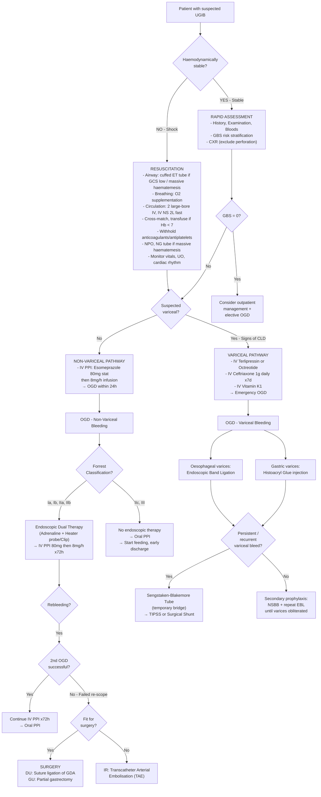

## Management of Upper GI Bleed

The management of UGIB follows a systematic, stepwise approach. Think of it as **three pillars happening in parallel**:

1. **Resuscitation** — keep the patient alive
2. **Localisation + Haemostasis** — find and stop the bleeding
3. **Prevention of recurrence** — treat the underlying cause and prevent rebleeding

The critical first branch point is: **Is this variceal or non-variceal?** — because the pharmacotherapy, endoscopic techniques, and rescue strategies differ fundamentally.

---

### Master Algorithm

Per lecture slides [1]:

> ***General guideline for ulcer bleeding:***
> - ***Bleeding stopped (80%)*** → ***History, examination, investigation***
> - ***Ongoing bleeding (20%)*** → ***Shock*** → ***Resuscitation***; ***No shock*** → ***Rapid assessment & endoscopy***

---

### PHASE 1: Resuscitation

This is the same regardless of aetiology — **keep the patient alive first, find the source second**.

> ***Initial management: resuscitation, localisation of bleeding, haemostasis*** [3]

#### Airway [2][3]

- ***Cuffed ET tube + NG tube if massive haematemesis*** or impaired consciousness [3]
  - Why? Massive haematemesis fills the oropharynx → aspiration risk → aspiration pneumonia/death. A **cuffed endotracheal tube** protects the airway and allows safe endoscopy
  - ***Do NOT insert NG tube in suspected variceal bleeding*** — it can traumatise varices and worsen bleeding [2]
- In less severe cases where the patient is alert and protecting their airway, intubation is unnecessary

#### Breathing [3]

- ***O2 supplementation*** — compensate for ↓ oxygen-carrying capacity (↓ Hb) [2][3]

#### Circulation [2][3]

| Action | Detail | Rationale |
|:---|:---|:---|
| ***2 large-bore IV cannulae*** | 14G or 16G in antecubital fossae (or central venous line if peripheral access difficult) [2] | Large bore = faster flow rate (Poiseuille's law: flow ∝ r⁴). Short, wide cannulae give fastest infusion rates |
| ***IV NS 2L fast rate*** | Isotonic crystalloid (0.9% NaCl) | Expands intravascular volume rapidly. Maintains BP and organ perfusion [3] |
| ***Blood transfusion*** | ***Hb < 7 g/dL in low-risk patients; Hb < 9 g/dL in high-risk patients (e.g. elderly, CAD)*** [2] | Restrictive transfusion is better — overtransfusion ↑ portal pressure (worsening variceal bleeding) and ↑ mortality. Target ***Hb 7–9 g/dL*** [2] |
| ***Withhold anticoagulants and antiplatelets*** | ***Balance thrombotic risk when considering reversal*** [2][3] | Anticoagulants impair clot formation at bleeding sites. But stopping them carries thrombotic risk (e.g. metallic heart valve, recent coronary stent) — always a clinical judgement [3] |
| ***FFP*** | For coagulopathy (INR > 1.5) | Replaces clotting factors |
| ***Platelets*** | For thrombocytopenia or platelet dysfunction | Top up to ≥ 50 × 10⁹/L [11] |
| ***IV Vitamin K1*** | 10 mg daily for 3 days in cirrhotic patients [2] | Vitamin K is only truly useful in **cholestasis** (where fat-soluble vitamin K isn't absorbed) and **warfarin overdose**. In **parenchymal liver disease** it is probably ***useless*** but given routinely in case there is a cholestatic element [2] |

<Callout title="Restrictive Transfusion Strategy — Why Less Is More">
***AVOID excessive volume restitution*** [2]. In variceal bleeding especially, over-transfusion raises portal venous pressure → sustains active bleeding or triggers early rebleeding. The landmark Villanueva trial (2013) showed that a **restrictive strategy (transfuse at Hb < 7)** had better survival than a liberal strategy (transfuse at Hb < 9) in acute UGIB. Exception: patients with **IHD/CAD** may need a higher Hb threshold (Hb < 9) because they depend on adequate oxygen delivery to already-compromised myocardium [2].
</Callout>

#### Monitoring [2]

- ***Close monitoring of vital signs, cardiac rhythm, nasogastric output and urine output*** [2]
- ***Cardiac monitor*** — especially in elderly patients with cardiac history, to prevent/detect volume overload during resuscitation or blood transfusion [2]
- Hourly BP, pulse, O₂ saturations
- Urinary catheter for accurate urine output monitoring ( > 0.5 mL/kg/h target)
- ***NPO*** — the patient may need emergency OGD [2]

#### Special Considerations for Variceal Bleeding [3]

> ***For cirrhotic patients (suspected oesophageal varices):***
> - ***IV antibiotics (SBP prophylaxis): IV ceftriaxone 1g daily for 7 days*** / augmentin / levofloxacin [3]
> - ***IV Vitamin K1*** [3]
> - ***Vasoactive drug — either one:***
>   - ***IV octreotide: somatostatin analogue with increased half-life; inhibits vasodilator hormones (e.g. glucagon) + direct splanchnic vasoconstriction*** [3]
>   - ***IV terlipressin: V1 agonist for non-specific arteriole vasoconstriction (caution if CV risk, e.g. IHD, stroke)*** [3]

**Why antibiotics in variceal bleeding?** Cirrhotic patients with GI bleeding have a ~20% risk of developing **spontaneous bacterial peritonitis (SBP)** and other infections within the first week. Bacterial translocation from the gut increases during variceal bleeding (gut hypoperfusion → mucosal barrier breakdown → bacteria enter portal circulation → impaired hepatic clearance). Prophylactic antibiotics reduce infections AND rebleeding AND mortality [3].

**Why vasoactive drugs?** Both octreotide and terlipressin **reduce splanchnic blood flow** → **↓ portal pressure** → **↓ blood flow to varices** → bleeding slows/stops. They are started ***as soon as variceal bleeding is suspected*** and maintained for ***2–5 days*** after endoscopic treatment [2].

| Drug | Mechanism | Key Points |
|:---|:---|:---|
| ***IV Terlipressin*** | **Vasopressin (V1) receptor agonist** → splanchnic arteriolar vasoconstriction → ↓ portal inflow → ↓ portal pressure | ***Caution in patients with cardiovascular risk (IHD, stroke)*** — it also causes systemic vasoconstriction → ↑ afterload → can precipitate myocardial ischaemia [3] |
| ***IV Octreotide*** | **Somatostatin analogue** (longer half-life than native somatostatin) → inhibits vasodilatory hormones (glucagon) + direct splanchnic vasoconstriction → ↓ portal pressure | Fewer cardiovascular side effects than terlipressin. Often preferred in patients with cardiac history [3] |

---

### PHASE 2: Endoscopic Management (OGD)

> ***Role of upper endoscopy*** [1]:
> - ***Verify bleeding source***
> - ***Stratify risk of rebleeding***
> - ***Therapy — definitive, temporizing***

#### Timing of OGD [3]

| Clinical Scenario | Timing |
|:---|:---|
| ***Emergency*** | ***Unstable haemodynamics despite resuscitation, massive haematemesis, suspected variceal bleeding*** [3] |
| ***Urgent (elective)*** | All other admitted patients — ***within 24 hours after initial stabilisation*** [2]. ***NPO 6 hours before OGD*** [3] |
| ***2nd-look OGD*** | ***If gastric ulcer (6–8 weeks) or large/complicated DU*** — to confirm healing and rule out malignancy [3] |

#### A. Non-Variceal Bleeding — Endoscopic Therapy

Per lecture slides [1]:

> ***Bleeding peptic ulcer:***
> - ***Clean base — start feeding, early discharge***
> - ***Therapeutic endoscopy:***
>   - ***Injection method: adrenaline***
>   - ***Thermal method: heater probe***
>   - ***Mechanical method: metal clip***
> - ***H2 blocker, PPI — hasten healing of ulcers***
> - ***PPI infusion***

##### When to treat endoscopically

- ***Forrest Ia, Ib, IIa, IIb*** → endoscopic therapy required [3][9]
- ***Forrest IIc, III*** → ***oral PPI only***, no endoscopic therapy [3]. ***Clean base — start feeding, early discharge*** [1]

##### Endoscopic Modalities — ***"Dual Therapy"*** [3]

> ***Therapeutic endoscopy — need to know!*** [3]
> ***Bleeding ulcer: dual therapy, i.e. adrenaline + heater probe or clips***

The principle is **combination therapy** — injection alone has unacceptably high rebleeding rates. ***Injection therapy should not be used as monotherapy*** [9].

| Modality | Type | Mechanism | Details |
|:---|:---|:---|:---|
| ***Adrenaline injection*** | ***Chemical / Injection*** | ***Tamponade + vasoconstriction + platelet aggregation*** [3] | ***Adrenaline 1:10,000*** diluted in normal saline, injected in 4 quadrants around the bleeding point. Volume effect compresses vessel (tamponade); adrenaline causes local arteriolar vasoconstriction; promotes platelet aggregation at the site [3] |
| ***Heater probe*** | ***Thermal*** | ***Coaptive effect: pressure + heat*** [3] | The probe is pressed against the vessel (coaptation = pressing the walls of the vessel together), then heat is applied → thermal coagulation welds the vessel walls shut. This is why it's called "coaptive coagulation" — you're not just burning, you're physically pressing the arterial walls together THEN sealing them [3][9] |
| ***Haemoclips*** | ***Mechanical*** | Direct mechanical compression of the bleeding vessel | Metal clips applied endoscopically across the vessel — works like a tiny surgical ligature. ***More prolonged action*** than injection [3] |
| ***Haemospray*** | ***Mechanical*** | ***Mechanical barrier + absorbent*** [3] | Nanopowder sprayed onto the bleeding surface — absorbs water, concentrates clotting factors, forms a mechanical seal. Described as ***"雲南白藥"*** (Yunnan Baiyao — a Chinese haemostatic agent analogy) [3]. Useful for **diffuse oozing** or difficult-to-access lesions |

**Why dual therapy?** A single injection of adrenaline provides temporary haemostasis (the tamponade/vasoconstriction effect wears off within hours). Adding a second modality (thermal or mechanical) provides **definitive vessel sealing**. Monotherapy with adrenaline alone has rebleeding rates up to 20% compared to < 10% with combination therapy [9].

##### Limitations of Endoscopic Therapy [5]

> ***Limitation: massive bleeding obscuring view, large bleeding artery ( > 3.2 mm) / ulcer ( > 2 cm)*** [5]

- If blood floods the visual field, the endoscopist cannot see the bleeding point → cannot target therapy
- Very large arteries (e.g. GDA — 3–5 mm diameter) may not be compressible by clips or tamponade
- Very large ulcers ( > 2 cm) may have multiple bleeding points or a large eroded vessel base

#### B. Variceal Bleeding — Endoscopic Therapy [3]

> ***Variceal bleeding:***
> - ***Endoscopic band ligation (EBL): 1st line for oesophageal varices*** [3]
> - ***Histoacryl glue (sclerosant): 1st line for gastric varices (EBL cannot catch the thick gastric wall)*** [3]

| Technique | Indication | Mechanism | Complications |
|:---|:---|:---|:---|
| ***Endoscopic Band Ligation (EBL)*** | ***1st line for oesophageal varices*** [3] | Elastic rubber bands are placed around the base of varices → strangulates the varix → thrombosis → fibrosis → obliteration | Post-banding ulcers, dysphagia, oesophageal perforation (rare), rebleeding from sloughed band site |
| ***Histoacryl Glue (N-butyl-2-cyanoacrylate)*** | ***1st line for gastric varices*** [3] | Tissue adhesive injected into the varix → polymerises on contact with blood → solidifies and occludes the vessel | ***Ulceration, stricture, mediastinitis; obviates use of subsequent EBL*** [3]. Systemic embolisation risk (glue can travel to pulmonary or cerebral vessels) |

**Why can't you band gastric varices?** Gastric varices run in a **thicker gastric wall** — the banding device cannot capture enough tissue to effectively strangulate the varix. The suction doesn't create a sufficient pseudopolyp for ligation. Hence, **glue injection** is preferred — it physically fills and solidifies within the varix regardless of wall thickness [3].

---

### PHASE 3: Post-Endoscopy Management

#### Post-OGD PPI Infusion [3]

> ***Post-OGD PPI infusion: pantoprazole/esomeprazole 80 mg stat, then 8 mg/h for 72 hours*** [3]

**Why 72 hours of IV PPI?** The first 72 hours after endoscopic haemostasis is the **highest-risk window for rebleeding**. Platelet aggregation and fibrin clot stability are **optimal at pH > 6** and **destroyed at pH < 4** by pepsin activation. High-dose IV PPI maintains intragastric pH > 6 throughout this critical period, protecting the clot and allowing vessel healing. After 72 hours, the risk drops dramatically and the patient can switch to oral PPI [3][9].

| Forrest Class | Post-OGD PPI Regimen |
|:---|:---|
| ***Ia, Ib, IIa, IIb*** (after endoscopic therapy) | ***IV PPI bolus + infusion × 72h*** [3] |
| ***IIc, III*** | ***Oral PPI*** [3] |
| **Variceal bleeding** (post-banding) | ***Oral PPI only*** — to reduce post-banding ulcers. ***IV PPI infusion is NOT efficacious for variceal bleeding*** [3] |

<Callout title="PPI Is For Ulcer Clots, Not For Varices">
A common mistake: students prescribe high-dose IV PPI for variceal bleeding. ***IV PPI infusion is NOT efficacious for variceal bleeding*** [3] — varices bleed from venous hypertension, not acid-mediated clot lysis. PPI after band ligation is given ***orally*** only to prevent the ulcers that form where the bands were applied from bleeding.
</Callout>

#### Monitoring for Rebleeding [1]

> ***After therapeutic endoscopy — close monitoring, look out for rebleeding (first 3 days)*** [1]:
> ***Signs of possible rebleeding:***
> - ***Increasing pulse rate***
> - ***Haematemesis***
> - ***Pass fresh melaena again***
> - ***Fresh blood aspirated from nasogastric tube***
> - ***Drop in haemoglobin level***

These signs all indicate that a previously controlled bleed has recommenced. The first 72 hours are the danger zone — after this, rebleeding risk drops significantly [1][9].

#### Management of Antithrombotics [3][11]

> ***Principles of antithrombotic management*** [3]:
> - ***Withhold all stat +/- reversal agents***
> - ***Resume aspirin after OGD, clopidogrel 5–7 days later***

| Drug | Approach |
|:---|:---|
| ***Aspirin*** | ***Stop if primary prophylaxis; continue if secondary prophylaxis*** (unless severe bleeding) [11]. ***Resume after OGD*** once haemostasis is confirmed [3] — the cardiovascular mortality from stopping aspirin outweighs the rebleeding risk |
| ***DAPT (dual antiplatelet)*** | ***Consult cardiology*** if recent ACS / coronary stent in situ [11] |
| ***Warfarin / DOAC*** | ***Stop +/- reversal agents*** [11]. For warfarin: IV vitamin K ± FFP ± PCC (prothrombin complex concentrate). For DOACs: idarucizumab (for dabigatran), andexanet alfa (for factor Xa inhibitors) |
| **INR 1.5–2.5** | Concomitant reversal agents during endoscopy [11] |
| **INR > 2.5** | Reversal agents **before** endoscopy [11] |

<Callout title="Aspirin in Bleeding Peptic Ulcer — Don't Panic-Stop It" type="idea">
Per senior notes [9]: ***Bleeding peptic ulcer: Resume aspirin with PPI treatment once haemostasis is secured to minimise cardiovascular risk. Non-bleeding peptic ulcer: Continue aspirin with PPI treatment.*** The evidence (PEPTIC study) shows that early aspirin resumption (within 24h of endoscopic haemostasis) reduces all-cause mortality despite a small ↑ in rebleeding risk.
</Callout>

---

### PHASE 4: When Endoscopy Fails — Escalation

#### Indications for Surgery [1][5][9]

Per lecture slides [1]:

> ***Surgery for bleeding ulcer — Indications:***
> - ***Therapeutic endoscopist not available***
> - ***Massive bleeding***
> - ***Failed endoscopic therapy***
> - ***Rebleed after endoscopic therapy***
> - ***Plication of bleeder + additional procedure***

Additional surgical indications from senior notes [9]:

- ***Haemodynamic instability despite vigorous fluid resuscitation***
- ***Continuous slow bleeding with transfusion > 3 units per day***

> ***Surgical vs IR: indicated if failed endoscopic haemostasis, rebleeding failing re-scope, ongoing infusion*** [5]

#### Surgical Options for Peptic Ulcer Bleeding [5][9]

| Ulcer Type | Surgical Procedure | Rationale |
|:---|:---|:---|
| ***DU (bleeding)*** | ***Suture ligation of bleeding vessels*** (undersewing the GDA through a duodenotomy) ± truncal vagotomy + pyloroplasty, or → ***partial gastrectomy*** [5] | The GDA is undersewn with deep stitches to achieve haemostasis. Vagotomy reduces acid secretion to prevent recurrence. Pyloroplasty is needed because truncal vagotomy denervates the pylorus → gastroparesis |
| ***GU (bleeding)*** | ***Partial gastrectomy*** (including the ulcer) [5] | Must excise the ulcer because of the ***risk of malignant ulcer*** — an ulcer that looks benign macroscopically can harbour carcinoma [5] |

**Surgical options by Johnson type** (for elective/semi-elective settings) [5]:

| Type | Procedure |
|:---|:---|
| ***DU*** | ***Highly selective vagotomy*** (nerve of Latarjet preserved, technically difficult) OR ***Truncal vagotomy + drainage (pyloroplasty/gastrojejunostomy)*** OR ***Gastrectomy (antrectomy) + reconstruction (Billroth II > Roux-en-Y)*** |
| ***GU Type I*** | ***Distal gastrectomy + Billroth II*** |
| ***GU Type II/III*** | ***Truncal vagotomy + antrectomy + Billroth II*** |
| ***GU Type IV*** | ***Subtotal gastrectomy (extending to ulcer) + Billroth I/II/Roux-en-Y*** |

#### Transcatheter Arterial Embolisation (TAE) — Interventional Radiology [9]

> ***TAE: Perform angiography of coeliac trunk and SMA → evaluate for contrast extravasation → selective cannulation of bleeding vessels → angiographic coiling distal to proximal until extravasation ceased*** [9]

| Feature | Detail |
|:---|:---|
| When | ***Failed endoscopic therapy AND patient unfit for surgery*** [5]. Also used when surgery is high-risk (elderly, multiple comorbidities) |
| Technique | Femoral artery access → selective catheterisation (coeliac trunk / SMA) → identify extravasation → embolise with coils, gelatin sponge, particles, or NBCA |
| Efficacy | ***Equally effective compared with surgery in failed endoscopy patients, with fewer complications*** [9] |
| Advantage | ***Reduces the need for surgery without increasing overall mortality*** [9] |
| Risks | Contrast nephropathy, femoral haematoma, bowel ischaemia (especially if non-selective embolisation), rebleeding if collateral flow reconstitutes |

<Callout title="TAE vs Surgery — Decision Making">
In the real world, the decision between TAE and surgery for failed endoscopic haemostasis depends on **patient fitness** and **local expertise**. TAE is preferred in the elderly and those with multiple comorbidities because it avoids general anaesthesia and laparotomy. Surgery is preferred when the bleeding is truly catastrophic and the patient is already in theatre, or when TAE is not available [5][9].
</Callout>

#### Rescue for Failed Variceal Bleeding Control

| Intervention | Detail |
|:---|:---|
| ***Sengstaken-Blakemore (SB) Tube*** | ***Emergency tamponade*** of gastro-oesophageal variceal bleeding ***unresponsive to medical and endoscopic treatment*** [12]. **Gastric balloon** inflated with 200–300 mL contrast + water (confirm position by CXR — displacement to oesophagus can be fatal). **Oesophageal balloon** inflated to 20–40 mmHg. Usually with ***ET intubation*** [12]. **Temporary bridge** (max 12–24 hours) to definitive therapy |
| Contraindications | ***Large hiatal hernia, unconfirmed variceal bleeding (e.g. Mallory-Weiss), oesophageal stricture, recent oesophageal surgery*** [12] |
| Complications | ***Pressure necrosis (deflate after 12h and re-inflate if ongoing bleed), oesophageal perforation, bleeding, pain*** [12] |
| ***TIPSS*** | ***Transjugular Intrahepatic Portosystemic Shunt*** — interventional radiology creates a channel between the hepatic vein and portal vein within the liver → decompresses the portal system → ↓ portal pressure → stops variceal bleeding. Definitive rescue for refractory variceal bleeding. Risk: hepatic encephalopathy (portal blood bypasses liver → ↑ ammonia) [3] |
| ***Surgical Shunts*** | Porto-caval or spleno-renal shunts — rarely used now due to TIPSS availability. Same principle: decompress portal system by creating a surgical anastomosis between portal and systemic venous systems [3] |

---

### PHASE 5: Prevention of Recurrence (Secondary Prophylaxis)

#### Non-Variceal (Peptic Ulcer)

| Measure | Detail | Why |
|:---|:---|:---|
| ***H. pylori eradication*** | Triple therapy: PPI + amoxicillin + clarithromycin (or metronidazole) × 14 days | Removing H. pylori eliminates the chronic inflammatory drive → ulcer heals permanently. Eradication reduces PUD recurrence from ~70% to < 5% per year |
| ***NSAID management*** | ***Switch to less ulcerogenic NSAID or COX-2 inhibitors; withdraw NSAIDs during PPI treatment*** [9] | Remove the aggressive factor (COX-1 inhibition) |
| ***Long-term PPI*** | If NSAID/aspirin cannot be stopped (e.g. secondary cardiovascular prophylaxis) | Co-prescribe PPI to provide ongoing mucosal protection |
| ***Lifestyle*** | ***Smoking cessation, limit alcohol intake*** [9] | Smoking impairs ulcer healing; alcohol is a direct mucosal irritant |
| ***Follow-up OGD*** | ***Gastric ulcer: necessary until complete healing confirmed*** (rule out malignancy). ***Uncomplicated DU: unnecessary if asymptomatic***. ***Complicated DU: necessary until healing confirmed*** [9] | Gastric ulcers carry malignancy risk — even a benign-looking ulcer needs follow-up biopsy to exclude sampling error [9] |

#### Variceal Bleeding — Secondary Prophylaxis

| Measure | Detail | Why |
|:---|:---|:---|
| ***Non-selective β-blockers (NSBB)*** | ***Propranolol*** (or carvedilol/nadolol) | β1 blockade → ↓ cardiac output → ↓ portal inflow. β2 blockade → unopposed α-mediated splanchnic vasoconstriction → ↓ portal flow. Net effect: ↓ HVPG by ~20% |
| ***Repeat EBL*** | Band ligation sessions every 2–4 weeks | ***Until varices are obliterated*** — typically takes 3–5 sessions |
| ***Combination*** | ***NSBB + repeat EBL*** | Combination is superior to either alone for preventing variceal rebleeding |
| **TIPSS** | If rebleeding despite NSBB + EBL | Definitive portal decompression |

---

### Special Scenarios

#### Mallory-Weiss Syndrome [6]

- ***90% of bleeding stops spontaneously*** [6]
- Resuscitation, NPO, IV fluids
- ***Active bleeding: OGD for adrenaline + clipping*** [6]
- ***Failed endoscopic treatment: on-table endoscopy + surgery (longitudinal gastrotomy and locate defect)*** [6]

#### Aorto-Enteric Fistula [8]

- ***Management: graft excision with extra-anatomical bypass*** [8]
- Definitive surgery is the only option — endoscopic/IR treatments are temporizing at best
- Pre-operative stabilisation with massive transfusion may be needed

#### Dieulafoy's Lesion [5]

- ***Endoscopic therapy: sclerosant injection, endoscopic clips*** [5]
- If endoscopy fails: surgical wedge excision of the gastric wall segment containing the aberrant vessel

#### Angiodysplasia

- ***Endoscopic: argon plasma coagulation (APC) or monopolar electrocautery*** [10]
- ***IR: mesenteric angiogram for super-selective catheterisation and embolisation*** [10]
- Surgery only as last resort: segmental resection [10]

---

### Summary of Medications

| Drug | Route | Indication | Mechanism | Key Notes |
|:---|:---|:---|:---|:---|
| ***Esomeprazole / Pantoprazole*** | ***IV 80 mg stat → 8 mg/h × 72h*** | Non-variceal ulcer bleeding (Forrest Ia–IIb) | Irreversible H⁺/K⁺-ATPase inhibition → ↑ gastric pH → clot stabilisation | ***Pre-endoscopic PPI only if early endoscopy cannot be arranged*** [3]. Post-OGD: 72h infusion |
| ***Terlipressin*** | IV | Suspected/confirmed variceal bleeding | V1 agonist → splanchnic vasoconstriction → ↓ portal pressure | ***Caution if IHD/stroke*** [3] |
| ***Octreotide*** | IV | Suspected/confirmed variceal bleeding | Somatostatin analogue → inhibits glucagon → splanchnic vasoconstriction | Fewer CV side effects than terlipressin [3] |
| ***Ceftriaxone*** | ***IV 1g daily × 7 days*** | ***All cirrhotic patients with GI bleeding*** | Broad-spectrum antibiotic for SBP prophylaxis | ***Alternatives: augmentin, levofloxacin*** [3] |
| ***Vitamin K1*** | IV 10 mg daily × 3 days | Cirrhotic patients | γ-carboxylation of factors II, VII, IX, X | ***Probably useless in parenchymal liver disease*** but given routinely [2] |
| ***Tranexamic acid*** | — | — | Antifibrinolytic | ***NOT recommended in UGIB*** — insufficient evidence of benefit, potential ↑ thromboembolic risk [2] |

<Callout title="Tranexamic Acid in UGIB" type="error">
***Tranexamic acid is NOT recommended*** for UGIB [2]. The HALT-IT trial (2020) showed no mortality benefit and a potential increase in venous thromboembolic events. Do not prescribe it reflexively.
</Callout>

---

<Callout title="High Yield Summary — Management of UGIB">

**Resuscitation (ABC)**: Airway (cuffed ET tube if massive haematemesis/low GCS), Breathing (O2), Circulation (2 large-bore IV, NS 2L fast, transfuse if Hb < 7 or < 9 in IHD, withhold anticoagulants, FFP/platelets for coagulopathy)

**Variceal pathway**: IV terlipressin/octreotide + IV ceftriaxone + IV vitamin K → Emergency OGD → EBL for oesophageal varices, Histoacryl glue for gastric varices → If persistent: Sengstaken-Blakemore tube → TIPSS/surgical shunt

**Non-variceal pathway**: IV PPI 80 mg stat → 8 mg/h → OGD within 24h → Forrest Ia–IIb: dual endoscopic therapy (adrenaline + heater probe/clip) → IV PPI 72h infusion; Forrest IIc–III: oral PPI, start feeding, early discharge

**Dual therapy = adrenaline injection + thermal or mechanical** — injection monotherapy has unacceptable rebleeding rates

**Post-OGD monitoring**: Watch for rebleeding signs in first 3 days — ↑ pulse, haematemesis, fresh melena, blood in NG tube, ↓ Hb

**Escalation if endoscopy fails**: Surgery (DU: undersew GDA; GU: partial gastrectomy) OR TAE (if unfit for surgery) — TAE is equally effective with fewer complications

**Secondary prophylaxis**: H. pylori eradication + stop/switch NSAIDs + PPI; Variceal: NSBB + repeat EBL until obliteration

**Do NOT use**: Tranexamic acid (no benefit, ↑ thrombosis risk); IV PPI for variceal bleeds (only oral PPI for post-banding ulcers); NG tube in variceal bleeding

</Callout>

---

<ActiveRecallQuiz
  title="Active Recall - Management of UGIB"
  items={[
    {
      question: "A cirrhotic patient presents with massive haematemesis. Name the 3 pharmacological agents you start BEFORE endoscopy and explain their mechanisms.",
      markscheme: "1. IV Terlipressin (or Octreotide) — splanchnic vasoconstriction reduces portal pressure and variceal blood flow. 2. IV Ceftriaxone 1g daily — antibiotic prophylaxis against SBP due to bacterial translocation in cirrhotic patients with GI bleeding. 3. IV Vitamin K1 — supports coagulation factor synthesis (though probably useless in pure parenchymal disease, given routinely in case of cholestatic element)."
    },
    {
      question: "Describe the components of endoscopic dual therapy for a bleeding peptic ulcer and explain why injection monotherapy is inadequate.",
      markscheme: "Dual therapy = adrenaline 1:10,000 injection (provides tamponade + vasoconstriction + platelet aggregation) PLUS a second modality: heater probe (coaptive coagulation — pressure + heat seals vessel) or haemoclip (mechanical compression). Injection monotherapy is inadequate because the tamponade and vasoconstriction effects are temporary — they wear off within hours, leading to rebleeding rates up to 20% vs less than 10% with combination therapy."
    },
    {
      question: "Why is the post-endoscopy IV PPI infusion given for exactly 72 hours, and why is IV PPI NOT used for variceal bleeding?",
      markscheme: "72 hours because this is the highest-risk rebleeding window; high-dose IV PPI maintains intragastric pH above 6, which is needed for platelet aggregation and fibrin clot stability (pepsin is inactive above pH 6, preventing clot lysis). IV PPI is not used for variceal bleeding because varices bleed from portal venous hypertension, not acid-mediated clot lysis — acid suppression does not address the pathophysiology. Oral PPI is given only to prevent ulcers from forming at band ligation sites."
    },
    {
      question: "List 4 indications for surgery in bleeding peptic ulcer.",
      markscheme: "1. Therapeutic endoscopist not available. 2. Massive bleeding uncontrolled by endoscopy. 3. Failed endoscopic therapy. 4. Rebleeding after endoscopic therapy. Also accepted: haemodynamic instability despite vigorous resuscitation, continuous slow bleeding requiring more than 3 units per day."
    },
    {
      question: "Why must you avoid excessive blood transfusion in variceal bleeding? What is the transfusion threshold?",
      markscheme: "Excessive transfusion increases portal venous pressure by expanding intravascular volume, which sustains active variceal bleeding or triggers early rebleeding. Transfusion threshold is Hb less than 7 g/dL for low-risk patients (target Hb 7-9). Higher threshold of Hb less than 9 for patients with cardiovascular disease who depend on adequate oxygen delivery to compromised myocardium."
    },
    {
      question: "A patient rebleeds from oesophageal varices despite endoscopic band ligation. Outline the escalation pathway.",
      markscheme: "1. Sengstaken-Blakemore tube insertion as temporary tamponade (bridge therapy, max 12-24h). 2. TIPSS (Transjugular Intrahepatic Portosystemic Shunt) — creates a channel between hepatic vein and portal vein to decompress the portal system. 3. Surgical shunt (porto-caval or spleno-renal) if TIPSS unavailable or fails. All while continuing IV vasoactive agents and antibiotics."
    }
  ]}
/>

## References

[1] Lecture slides: GC 198. Profuse vomiting of fresh blood and in shock severe upper GI bleeding.pdf (p19, p21, p24, p25, p28)
[2] Senior notes: felixlai.md (Upper GI bleeding — Treatment: General management; Medications; Variceal hemorrhage — Initial management)
[3] Senior notes: maxim.md (3.3 UGIB — Resuscitation; Pre-endoscopy management; OGD; Forrest classification; Post-OGD PPI; Antithrombotic management; Cirrhotic patients management)
[5] Senior notes: maxim.md (3.6 Benign diseases of stomach — PUD complication hemorrhage; Surgical management; TAE)
[6] Senior notes: maxim.md (Mallory-Weiss syndrome — Management)
[8] Senior notes: maxim.md (Approach to UGIB with background of AAA repair)
[9] Senior notes: felixlai.md (Peptic ulcer disease — Treatment; Bleeding complication; Endoscopic treatment; Surgical treatment; TAE; Follow-up endoscopy; Aspirin management)
[10] Senior notes: maxim.md (Angiodysplasia — Management)
[11] Senior notes: maxim.md (Transfusion and blood products; Management of antiplatelets and anticoagulants)
[12] Senior notes: maxim.md (Sengstaken-Blakemore tube — indications, contraindications, complications)
