## Complications of Anxiety Disorders

Anxiety disorders are not benign conditions that simply cause "worry." Left untreated — or even when partially treated — they produce a cascade of psychiatric, medical, functional, and social complications that are far-reaching and often self-reinforcing. Understanding these complications requires connecting them back to the neurobiology: chronic activation of the amygdala-HPA axis-sympathetic pathways, persistent avoidance behaviour, and the cognitive distortions that drive the disorders all have downstream consequences.

***There is a huge amount of suffering associated with these disorders*** [4].

---

### 1. Psychiatric Comorbidities

This is the single most important category of complications. Anxiety disorders rarely exist in isolation — ***comorbidity is common*** [1].

#### A. Depression

***Depression*** is the most frequent and clinically significant comorbidity across all anxiety disorders [1][2].

- ***2/3 of GAD patients have other psychiatric diagnosis***, with ***depression*** being the most common [1]
- ***Comorbidity of panic disorder: depression*** [1]
- ***Co-morbidities of PTSD: depression*** [4]
- ***Co-morbidities of OCD: > 60% have lifetime diagnosis of a mood disorder, MDD being the most common*** [4]

**Why does anxiety lead to depression?** The mechanism is both neurobiological and psychological:
- **Neurobiological**: Chronic anxiety → sustained HPA axis activation → ↑cortisol → hippocampal damage (↓volume) + monoamine depletion (5-HT, NA, DA) — the same neurotransmitter systems implicated in depression. The shared serotonin transporter gene polymorphism and shared heritability with neuroticism mean these conditions arise from overlapping biological substrates [2].
- **Psychological**: Persistent anxiety → avoidance → social withdrawal → loss of positive reinforcement → helplessness and hopelessness → depressive cognitions. The person who avoids social situations due to social anxiety eventually becomes isolated, loses friendships, and feels worthless — a direct pathway to depression.
- **Temporal relationship**: Anxiety disorders typically **precede** depression (anxiety has earlier onset — teens/early twenties; depression often develops later). ***Social anxiety disorder: depression is considered a risk factor for subsequent development*** [2]. This makes screening for depression in every anxiety patient essential.

<Callout title="Anxiety + Depression = Worse Prognosis">
Comorbid anxiety and depression is associated with ***↑severity, ↑functional impairment, and ↑duration of illness*** [2]. These patients are harder to treat, have higher relapse rates, and higher suicide risk than those with either condition alone. The combination warrants aggressive, early treatment.
</Callout>

#### B. Other Anxiety Disorders

***Other anxiety disorders (e.g., panic, social anxiety)*** [1]

- Anxiety disorders cluster together. A patient with one anxiety disorder has a markedly elevated risk of having another:
  - GAD comorbid with: ***social phobia 23.2–34.4%, specific phobia 24.5–35.1%, panic disorder 22.6–23.5%*** [2]
  - ***Agoraphobia: other anxiety disorder 49–64%*** [2]
  - ***OCD: > 70% have lifetime diagnosis of an anxiety disorder such as PD, SAD, GAD, phobia*** [4]
- **Why?** Shared genetic vulnerability (neuroticism, 5-HT transporter polymorphism), shared neurobiological substrates (amygdala overactivation, CSTC loop dysregulation), and shared psychological risk factors (behavioural inhibition, cognitive biases) mean that vulnerability to one anxiety disorder confers vulnerability to others.

#### C. Substance Use Disorders

***Alcohol and drug abuse*** [1]

- ***Comorbidity of panic disorder: alcohol and drug abuse*** [1]
- ***Comorbidity for GAD: alcohol and drug abuse*** [1]
- ***Co-morbidities of PTSD: substance use disorders*** [4]
- ***Agoraphobia: substance use disorder ~1/3*** [2]
- Anxiety disorders occur in ***32% of alcoholics***, often as a form of ***self-medication*** [2]

**Why does anxiety lead to substance use?** The mechanism is straightforward self-medication:
- Alcohol is a **GABA-A positive allosteric modulator** (similar mechanism to benzodiazepines) → drinking provides **rapid anxiolysis** by enhancing GABA-mediated inhibition of the amygdala
- Cannabis has anxiolytic properties at low doses via CB₁ receptor activation in the amygdala
- Benzodiazepine misuse/dependence can develop from prescribed or illicitly obtained BZDs

**Why is this a complication rather than just a comorbidity?** Because substance use creates a **vicious cycle**:
1. Anxiety → alcohol/drug use for relief
2. Chronic use → tolerance (need more for the same effect)
3. Withdrawal → **rebound anxiety** that is worse than the original anxiety (because GABA-A receptors have downregulated)
4. Worse anxiety → more substance use
5. Additional consequences: hepatic damage, social deterioration, accidents, dependence syndrome

> ***Social anxiety disorder: substance abuse is a risk factor for subsequent substance abuse (as coping)*** [2]. This progression is so predictable that it's essentially a natural history of untreated social anxiety.

#### D. Personality Disorders

***Personality disorder (e.g., anankastic, paranoid, avoidant)*** [1]

- **Avoidant personality disorder** overlaps extensively with social anxiety disorder (shared heritability ~55%) [2]
- **Dependent personality disorder** can develop from chronic agoraphobia (patient becomes reliant on companions)
- **Anankastic (obsessive-compulsive) personality** shares traits with OCD and GAD
- Chronic childhood anxiety, if untreated, can shape personality development in maladaptive directions

#### E. Other Psychiatric Comorbidities

| Comorbidity | Mechanism / Context |
|---|---|
| ***Somatisation*** | ***Co-morbidities of PTSD: somatisation*** [4]. Chronic anxiety → heightened interoception → amplification of normal bodily sensations → repeated presentation with somatic complaints |
| ***Dissociative disorders*** | ***Co-morbidities of PTSD: dissociative disorders*** [4]. Peritraumatic dissociation during overwhelming stress → persistent dissociative symptoms |
| ***Tic disorders*** | ***OCD: up to 30% have a lifetime tic disorder*** [4]. Shared CSTC loop pathology |
| ***Psychotic disorders*** | ***OCD: 12% of persons with schizophrenia/schizoaffective disorder*** have comorbid OCD [4] |
| ***Eating disorders*** | Anxiety (especially social anxiety and OCD) increases risk of anorexia nervosa and bulimia through body image preoccupation and perfectionism |

---

### 2. Suicidal Behaviour and Self-Harm

Anxiety disorders, particularly when comorbid with depression, are significant risk factors for suicidal ideation and attempts:

- **Panic disorder**: acute panic attacks can precipitate impulsive suicidal behaviour during the attack (the overwhelming fear of dying paradoxically can lead to self-harm to "escape" the intolerable state)
- **PTSD**: high rates of suicidal ideation (particularly following sexual assault or combat)
- **Social anxiety disorder**: chronic social isolation → depression → suicidality
- **Comorbid depression**: the strongest mediator of suicide risk in anxiety patients

> The presence of an anxiety disorder alongside depression confers a higher suicide risk than depression alone — the agitation and restlessness of anxiety can provide the "energy" to act on suicidal thoughts that depressive psychomotor retardation might otherwise suppress.

<Callout title="Always Assess Suicide Risk" type="error">
Every patient with an anxiety disorder — especially with comorbid depression, substance use, or PTSD — requires a suicide risk assessment. This is not optional. The chronic suffering, functional impairment, and hopelessness associated with untreated anxiety disorders are potent drivers of suicidal behaviour.
</Callout>

---

### 3. Functional Impairment

***Anxiety disorders are similar to major depression and chronic diseases such as diabetes in functional impairment and decreased quality of life*** [4].

This is a critical point that is often underappreciated: anxiety disorders are **as disabling** as many chronic medical conditions.

#### A. Occupational Impairment
- Poor concentration → ↓work performance
- Avoidance → inability to attend meetings, presentations, or work-related social functions
- Panic attacks at work → embarrassment → further avoidance → absenteeism
- GAD: chronic worry → indecisiveness → difficulty completing tasks → job loss
- Social anxiety: inability to function in team settings, networking, interviews → career limitation

#### B. Academic Impairment (Especially Relevant in HK Context)
- Childhood/adolescent anxiety → school refusal, poor exam performance, difficulty with peer relationships
- ***Anxiety in childhood may have atypical presentation, e.g., school refusal, frequent somatic complaints, difficulties with peer relationships, low self-esteem*** [2]
- Test anxiety → underperformance relative to ability
- Social anxiety → inability to participate in group discussions, presentations

#### C. Social and Interpersonal Impairment
- Avoidance behaviour → progressive social isolation
- ***Social anxiety disorder: only 50% seek treatment, usually after many years of symptoms, and can persist for many years*** [2]
- ***Agoraphobia: as the condition progresses, situations are increasingly avoided with shrinkage of 'safe zone', ultimately culminating in confinement to home*** [2]
- Relationship difficulties: partners may become frustrated with the patient's avoidance; conversely, some partners become "enablers" who accommodate the avoidance (e.g., always accompanying the agoraphobic patient), inadvertently maintaining the disorder
- ***Selective mutism: prognosis often poor, with 58% remission rate at 13y; associated with later development of phobia, social anxiety, ↑risk for depression, substance misuse in unresolved cases*** [2]

---

### 4. Medical / Physical Complications

Chronic anxiety is not merely a "psychological" problem — it has real, measurable medical consequences through sustained activation of the stress response system.

#### A. Cardiovascular Disease

***Impact: associated with functional impairment and ↑cardiovascular mortality*** [2]

***Impact: QoL, functioning and all-cause mortality (especially cardiovascular disorders)*** [2]

**Why does anxiety increase cardiovascular risk?** The pathophysiology is multi-layered:
1. **Chronic sympathetic activation** → sustained ↑heart rate, ↑blood pressure → accelerated atherosclerosis, endothelial dysfunction
2. **HPA axis dysregulation** → chronic ↑cortisol → insulin resistance, dyslipidaemia, visceral adiposity → metabolic syndrome → ↑CVD risk
3. **Platelet hyperactivation**: catecholamines activate platelets → ↑thrombotic tendency → ↑risk of MI, stroke
4. **Autonomic imbalance**: ↓parasympathetic (vagal) tone + ↑sympathetic tone → ↓heart rate variability → ↑risk of arrhythmias and sudden cardiac death
5. **Behavioural mediators**: anxiety → physical inactivity (avoidance), poor diet, smoking, alcohol use → additional CVD risk factors

> Think of it this way: the fight-or-flight response was designed for brief, intense threats. When it runs continuously for months or years, it's like leaving your car engine redlining — eventually something breaks. The cardiovascular system takes the brunt.

#### B. Other Medical Comorbidities

***Panic disorder: medical comorbidities (asthma, CAD, HTN, ulcers)*** [2]

| System | Complication | Mechanism |
|---|---|---|
| **Gastrointestinal** | Irritable bowel syndrome (IBS), peptic ulcers, functional dyspepsia | Autonomic dysregulation → altered GI motility; chronic cortisol → ↓mucosal protection; brain-gut axis dysfunction |
| **Respiratory** | Exacerbation of asthma/COPD | Hyperventilation → bronchoconstriction; sympathetic-parasympathetic imbalance; panic-induced bronchospasm |
| **Musculoskeletal** | Chronic tension-type headache, temporomandibular joint dysfunction, chronic pain syndromes | Sustained muscle tension (sympathetic-mediated); central sensitisation from chronic stress |
| **Immune** | ↑Susceptibility to infections, autoimmune flares | Chronic cortisol → immune dysregulation (initial immunosuppression → later pro-inflammatory state) |
| **Metabolic** | Weight gain, metabolic syndrome, type 2 diabetes | HPA axis dysregulation → insulin resistance; comfort eating; medication side effects (pregabalin, mirtazapine) |
| **Sleep** | Chronic insomnia | Hyperarousal from persistent amygdala/LC activation → difficulty initiating and maintaining sleep |

#### C. Chronic Pain

Anxiety and chronic pain frequently co-occur through shared neurobiological pathways:
- **Central sensitisation**: chronic anxiety → ↑descending facilitation of pain pathways → ↓pain threshold
- **Catastrophising**: cognitive bias amplifies pain perception
- **Muscle tension**: sustained sympathetic activation → tension-type pain
- **Shared neurotransmitters**: 5-HT and NA modulate both mood and descending pain inhibition — dysfunction in these systems contributes to both anxiety and chronic pain

---

### 5. Treatment-Related Complications

Complications can arise not only from the disorder itself but also from its treatment:

#### A. Benzodiazepine Dependence
- The most common iatrogenic complication of anxiety disorder management
- Develops rapidly (within 2–4 weeks of regular use)
- Withdrawal syndrome: rebound anxiety (often worse than original), insomnia, tremor, perceptual disturbances, **seizures** (potentially life-threatening)
- Cognitive impairment: ↓memory, ↓psychomotor speed, ↑fall risk (especially elderly)
- Paradoxical disinhibition (especially in elderly, brain-injured, or personality-disordered patients)

#### B. SSRI-Related Complications
- **Initial anxiety worsening** (first 1–2 weeks) — can cause patients to discontinue treatment prematurely
- **Sexual dysfunction** — common, persistent, and a major cause of non-adherence
- **Discontinuation syndrome** (especially paroxetine, venlafaxine) — dizziness, nausea, electric shock sensations ("brain zaps"), anxiety, insomnia
- **Hyponatraemia** (SIADH) — especially in elderly patients; can present with confusion, seizures
- **QTc prolongation** — especially citalopram/escitalopram at higher doses → risk of torsades de pointes
- **Serotonin syndrome** — if combined with MAOIs or other serotonergic agents (fever, agitation, clonus, diaphoresis — medical emergency)

#### C. Avoidance of Treatment
- Many patients with anxiety disorders (particularly social anxiety and agoraphobia) **avoid seeking treatment** due to the nature of their condition — the very symptoms prevent help-seeking
- ***Only 50% of social anxiety patients seek treatment, usually after many years*** [2]
- This delay allows complications to accumulate

---

### 6. Course-Related Complications (Chronicity and Relapse)

***Anxiety disorders have a waxing and waning course over lifetime*** [4].

| Disorder | Course Complication |
|---|---|
| **GAD** | ***Generally poor prognosis if disease lasts > 6 months; only 60% complete recovery after 12 years; 50% of those recovering have subsequent relapses*** [2] |
| **Panic disorder** | ***Course tends to be recurrent and chronic with fluctuating anxiety and depression; remission in 64% at 2 years*** [2] |
| **Social anxiety** | ***Can persist for many years; chronic course*** [2] |
| **Specific phobia** | ***Tends to be lifelong when untreated*** [2] |
| **Agoraphobia** | ***Generally with gradual deterioration and chronic + unremitting without treatment*** [2] |
| **Childhood anxiety** | ***Nearly 2/3 expected to disappear in 3–5 years, but ~1/3 will have other categories of anxiety disorders at follow-up*** [2] |

> The natural history of untreated anxiety is not self-resolution — it's chronicity, accumulation of comorbidities, and progressive functional decline. This is why early, aggressive treatment matters.

---

### 7. Impact on Childhood Development

Anxiety disorders in childhood have specific developmental complications:

- **Academic trajectory**: school refusal and test anxiety → academic underperformance → limited educational attainment
- **Social development**: avoidance of peer interactions → impaired social skills development → ↑risk of social anxiety persisting into adulthood
- **Personality formation**: chronic behavioural inhibition and avoidance → development of avoidant or dependent personality traits
- **Transition to adult psychopathology**: ***~1/3 of childhood anxiety disorders will develop other categories of anxiety disorders at follow-up*** [2]; ***selective mutism associated with later development of phobia, social anxiety, ↑risk for depression, substance misuse in unresolved cases*** [2]

---

### Summary: Cascade of Complications

```mermaid
graph TD
    A["Untreated Anxiety Disorder"] --> B["Psychiatric Complications"]
    A --> C["Medical Complications"]
    A --> D["Functional Impairment"]
    A --> E["Treatment-related Complications"]
    B --> B1["Depression (most common)"]
    B --> B2["Other anxiety disorders"]
    B --> B3["Substance use disorders"]
    B --> B4["Personality disorders"]
    B --> B5["Suicidal behaviour"]
    C --> C1["Cardiovascular disease and mortality"]
    C --> C2["GI disorders: IBS, peptic ulcer"]
    C --> C3["Chronic pain syndromes"]
    C --> C4["Immune dysregulation"]
    C --> C5["Metabolic syndrome"]
    D --> D1["Occupational: job loss, underperformance"]
    D --> D2["Academic: school refusal, exam failure"]
    D --> D3["Social: isolation, relationship breakdown"]
    D --> D4["Progressive confinement: agoraphobia"]
    E --> E1["BZD dependence"]
    E --> E2["SSRI side effects and discontinuation"]
    E --> E3["Avoidance of treatment-seeking"]
    B1 --> F["Worse prognosis, higher suicide risk"]
    B3 --> G["Vicious cycle: rebound anxiety"]
    C1 --> H["All-cause mortality"]
```

---

<Callout title="High Yield Summary — Complications of Anxiety Disorders">

**Psychiatric comorbidities** are the most important complications:
- **Depression**: most common; 2/3 of GAD patients have comorbid psychiatric diagnoses; anxiety typically precedes depression
- **Other anxiety disorders**: cluster together due to shared neurobiology
- **Substance use**: self-medication with alcohol/drugs creates a vicious cycle of rebound anxiety
- **Personality disorders**: especially avoidant PD with social anxiety

**Suicide risk**: elevated, particularly with comorbid depression, PTSD, and substance use. Always assess.

**Functional impairment**: equivalent to diabetes and major depression in disability. Occupational, academic, social, and interpersonal domains all affected.

**Cardiovascular mortality**: chronic sympathetic/HPA activation → HTN, atherosclerosis, arrhythmias, ↑all-cause mortality.

**Medical comorbidities**: IBS, chronic pain, asthma exacerbation, metabolic syndrome, insomnia.

**Treatment complications**: BZD dependence (if used > 2-4 weeks), SSRI initial worsening, sexual dysfunction, discontinuation syndrome, hyponatraemia.

**Chronicity**: Without treatment, anxiety disorders are chronic, relapsing conditions with progressive functional decline. Only 60% GAD recovery at 12 years; specific phobias are lifelong if untreated; agoraphobia progressively worsens.

**Childhood complications**: school refusal, impaired social development, personality formation disruption, 1/3 transition to other anxiety disorders.

</Callout>

---

<ActiveRecallQuiz
  title="Active Recall - Complications of Anxiety Disorders"
  items={[
    {
      question: "Explain the pathophysiological mechanism by which chronic anxiety disorders increase cardiovascular mortality.",
      markscheme: "Chronic sympathetic activation leads to sustained increased heart rate and blood pressure causing accelerated atherosclerosis and endothelial dysfunction. HPA axis dysregulation causes chronic hypercortisolaemia leading to insulin resistance, dyslipidaemia, and visceral adiposity (metabolic syndrome). Catecholamines activate platelets increasing thrombotic tendency. Autonomic imbalance (decreased vagal tone, increased sympathetic tone) reduces heart rate variability increasing arrhythmia risk. Behavioural mediators include physical inactivity, poor diet, smoking, and alcohol.",
    },
    {
      question: "Describe the 'vicious cycle' mechanism by which anxiety disorders lead to substance use disorders and how substance use worsens the anxiety.",
      markscheme: "Anxiety leads to self-medication with alcohol or drugs (which act as GABA-A modulators or have anxiolytic properties) providing rapid anxiolysis. Chronic use causes tolerance and GABA-A receptor downregulation. Withdrawal produces rebound anxiety that is worse than the original anxiety. This worse anxiety drives more substance use. Additional consequences include hepatic damage, social deterioration, dependence syndrome, and the substance itself becoming an independent source of psychiatric morbidity.",
    },
    {
      question: "A patient with untreated social anxiety disorder for 15 years presents. List four complications they might have developed.",
      markscheme: "Any four of: (1) Comorbid depression (anxiety precedes depression in temporal sequence), (2) Alcohol/substance use disorder (self-medication), (3) Avoidant personality disorder (chronic avoidance shapes personality), (4) Occupational impairment or unemployment (inability to function in social work settings), (5) Social isolation and relationship difficulties, (6) Low self-esteem, (7) Suicidal ideation (especially with comorbid depression), (8) Academic underachievement (if onset in teens).",
    },
    {
      question: "What is the prognosis of untreated GAD, and what factors predict a worse outcome?",
      markscheme: "Generally poor prognosis if disease lasts more than 6 months. Only 60% achieve complete recovery after 12 years, and 50% of those who recover have subsequent relapses. Poor prognostic factors include: male gender, ongoing life stressors, comorbid major depression, comorbid agoraphobia, comorbid personality disorders, higher initial attack frequency.",
    },
    {
      question: "What happens to approximately one-third of children with anxiety disorders at follow-up, and why is early intervention important?",
      markscheme: "Approximately one-third of children with anxiety disorders will develop other categories of anxiety disorders at follow-up (even though nearly two-thirds of childhood anxiety disorders resolve within 3-5 years). Early intervention is important because untreated childhood anxiety impairs academic performance (school refusal), social skill development (avoidance of peers), personality formation (development of avoidant/dependent traits), and increases risk of adult psychopathology including depression, substance misuse, and persistent anxiety disorders.",
    },
  ]}
/>

## References

[1] Lecture slides: GC 167. I feel very nervous Anxiety disorders.pdf (p8, p17, p30)
[2] Senior notes: ryanho-psych.md (Sections 8.1.2 GAD epidemiology/course/comorbidities, 8.1.3 Panic Disorder course and prognosis, 8.1.4 Phobic Disorders course/comorbidities, 5.2 Psychiatric comorbidity in alcoholism, 12.5 Childhood Anxiety Disorders prognosis)
[4] Lecture slides: GC 171. Stress-related disorders and obsessive-compulsive disorder_rev.pdf (p16, p26, p38, p43)
