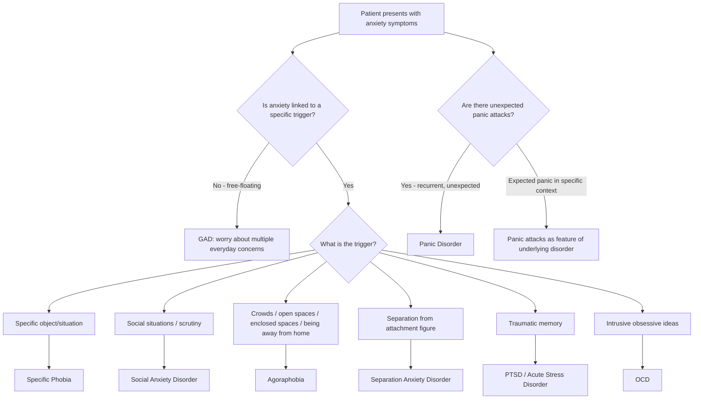
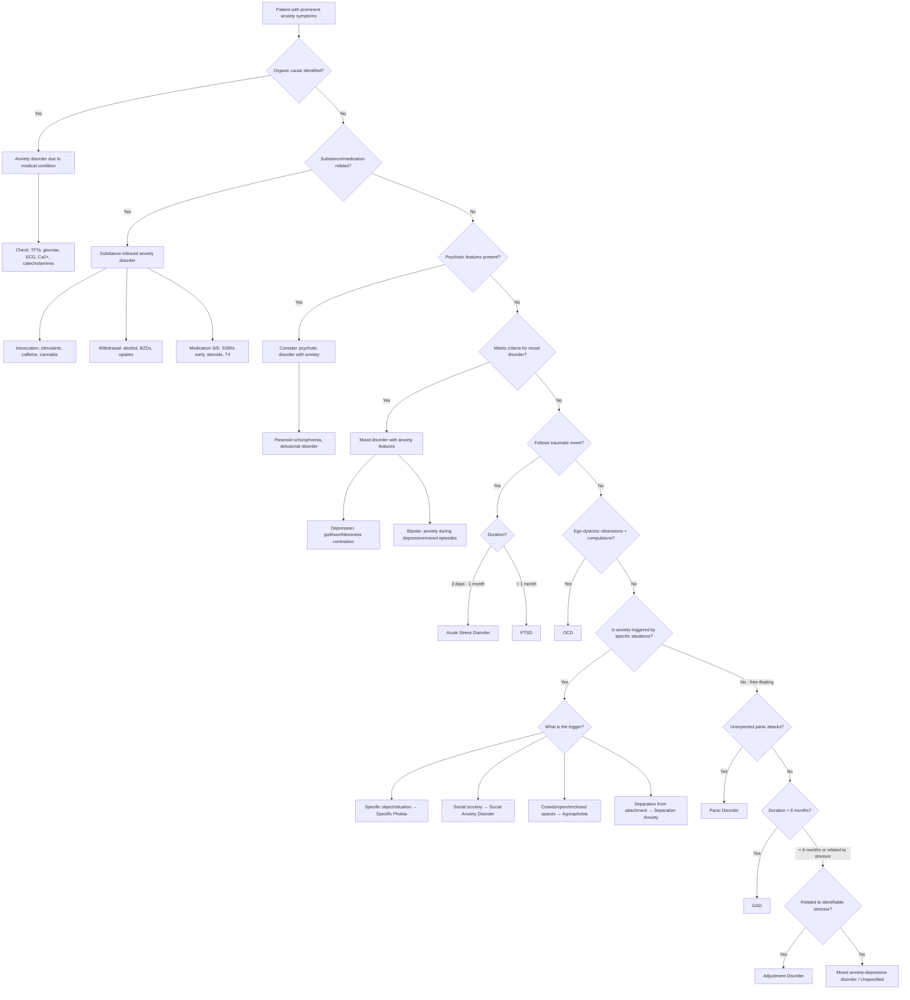

## Differential Diagnosis of Anxiety Disorders

The differential diagnosis of anxiety disorders is one of the most clinically important skills in psychiatry — and, frankly, in all of medicine. The reason is simple: **anxiety symptoms are ubiquitous**. They appear in virtually every psychiatric disorder, in dozens of medical conditions, and as effects of substances and medications. Your job is to work out **what is driving the anxiety**.

The approach is hierarchical and systematic. Think of it as peeling an onion — start with the most dangerous/treatable causes (organic, substance-related), then move to other psychiatric disorders, and only then settle on a primary anxiety disorder.

<Callout title="The Diagnostic Hierarchy for Anxiety" type="idea">
Always follow the diagnostic hierarchy [2]: **Organic → Substance-induced → Psychotic disorders → Mood disorders → Anxiety disorders → Personality disorders**. A higher-order diagnosis takes precedence because treating it often resolves the anxiety symptoms. Only diagnose a primary anxiety disorder when higher-order causes have been excluded or cannot fully explain the presentation.
</Callout>

---

### Step 1: Exclude Organic / Medical Causes

Before diagnosing any primary anxiety disorder, you **must** exclude medical conditions that can mimic anxiety. The reason is that these conditions produce genuine autonomic symptoms (palpitations, sweating, tremor, dyspnoea) through direct physiological mechanisms — the patient isn't "anxious" in the psychiatric sense; their body is generating alarm signals from an organic source.

***Physical disorders*** to exclude [1][2]:

| System | Condition | Why It Mimics Anxiety | Distinguishing Clue |
|---|---|---|---|
| **Endocrine** | ***Thyroid disease*** (thyrotoxicosis) | ↑T₃/T₄ → ↑sympathetic sensitivity → tachycardia, tremor, sweating, weight loss, heat intolerance | Persistent autonomic symptoms even at rest; weight loss despite ↑appetite; goitre; abnormal TFTs |
| **Endocrine** | Hypoglycaemia | ↓Glucose → counter-regulatory catecholamine surge → sweating, tremor, palpitations, anxiety | Episodic, temporally related to fasting/meals; resolves with glucose; finger-prick glucose confirms |
| **Endocrine** | ***Phaeochromocytoma*** | Catecholamine-secreting tumour → episodic surges of adrenaline/noradrenaline → severe palpitations, sweating, hypertension, headache | Episodic "attacks" with marked hypertension; 24h urinary catecholamines/metanephrines diagnostic |
| **Endocrine** | Cushing's disease | ↑Cortisol → anxiety, insomnia, mood disturbance | Cushingoid features; 24h urinary cortisol; dexamethasone suppression test |
| **Endocrine** | Hyperparathyroidism | ↑Ca²⁺ → neuropsychiatric symptoms including anxiety | Elevated serum calcium; "bones, stones, groans, moans" |
| **Cardiovascular** | ***Cardiac disease*** (arrhythmias, SVT) | Rapid/irregular heartbeat → palpitations perceived as anxiety | Episodic; ECG/Holter captures arrhythmia; may have syncope |
| **Cardiovascular** | Heart failure, PE | Dyspnoea → sensation of breathlessness interpreted as anxiety | Orthopnoea, JVP elevation, leg swelling (HF); pleuritic chest pain, haemoptysis, Wells score (PE) |
| **Neurological** | ***Epilepsy*** (especially temporal lobe) | Ictal fear as aura; déjà vu; automatisms | Stereotyped episodes; post-ictal confusion; EEG abnormalities |
| **Neurological** | ***Vestibular dysfunction*** | Dizziness/vertigo → anxiety; may trigger panic attacks | Positional component; nystagmus on examination |
| **Respiratory** | COPD, asthma | Dyspnoea and air hunger → anxiety | Wheeze, prolonged expiratory phase; spirometry abnormal |
| **Other** | Cerebral trauma, BPSD of dementia, malignancies | Various mechanisms including direct neurological effects | Focal neurology, cognitive decline, constitutional symptoms |

[2]

### Step 2: Exclude Substance-Induced Anxiety

***Substance abuse — intoxication or withdrawal*** [1][2]:

| Mechanism | Substances |
|---|---|
| **Intoxication** | Alcohol, stimulants (amphetamines, cocaine, ***caffeine***), cannabis, inhalants, hallucinogens (PCP) |
| **Withdrawal** | Alcohol (can be life-threatening), sedatives/hypnotics (BZDs, opiates), caffeine, cocaine, nicotine |
| **Side effects of medications** | Antidepressants (especially first 2 weeks — paradoxical anxiety), corticosteroids, sympathomimetics, T₄, compound analgesics with caffeine, anticholinergics, antipsychotics (akathisia) |

**Key distinguishing clue**: Anxiety that occurs **only in the context of substance use** and is **most severe in the morning** (when withdrawal is typically most severe) points towards substance-induced anxiety [2].

> Why antidepressants cause initial anxiety: SSRIs initially flood serotonin receptors including the anxiogenic 5HT2C receptors before adaptive downregulation occurs (~2 weeks). This is why the advice is to "start low, go slow" and warn patients about initial worsening.

---

### Step 3: Differentiate Among Anxiety Disorders Themselves

This is where the exam really tests you. The core trick is to identify **what the patient fears and when** — the ***focus of fear*** and the ***pattern of anxiety*** distinguish one anxiety disorder from another.

***The major anxiety-related disorders can be mapped by what they fear*** [1]:

[1]

Now let us go through each differential in detail.

---

#### A. Differentiating Between Primary Anxiety Disorders

##### GAD vs. Panic Disorder [2]

| Feature | GAD | Panic Disorder |
|---|---|---|
| **Pattern** | Continuous, pervasive worry | Episodic, discrete panic attacks |
| **Nature of attack** | Panic attacks can occur (from escalating worry) but are **expected/cued** | Panic attacks are ***unexpected*** (no obvious trigger) — can occur during sleep or relaxation |
| **Content of worry** | Persistent worry about ***multiple chronic, non-specific complaints*** (finances, health, family, work) | ***Calamitous thoughts about acute life-threatening illness*** ("I'm dying", "I'm going mad"), anticipatory anxiety about next attack |
| **Somatic focus** | Multiple organ systems, chronic | Acute, dramatic autonomic surge peaking within minutes |
| **ICD-10 note** | GAD is NOT diagnosed if criteria for panic disorder are met (GAD is a diagnosis of exclusion in ICD-10) | Takes precedence over GAD in ICD-10 |
| **DSM-5 note** | Can be comorbid with panic disorder in DSM-5 | Can be comorbid with GAD in DSM-5 |

##### GAD vs. Social Anxiety Disorder [2]

| Feature | GAD | Social Anxiety Disorder |
|---|---|---|
| **Focus of worry** | Widespread — ***not focused on a specific issue*** (finances, health, relationships, work, trivial matters) | ***Specifically concerns social situations*** where the person can be observed, scrutinised, or evaluated |
| **Context** | Anxious ***whether or not being evaluated*** | Anxious ***specifically when being evaluated*** or in anticipation of social situations |
| **Social worries** | May have social worries but focus is on ***nature of ongoing relationships*** rather than scrutiny | Focus is on ***fear of negative evaluation*** (humiliation, embarrassment, rejection) |

##### GAD vs. OCD [2]

| Feature | GAD | OCD |
|---|---|---|
| **Content of thoughts** | Day-to-day worries (finances, work, health, family) — often realistic concerns, just excessive | ***Primal fears*** (contamination, harm, symmetry, blasphemy) — often bizarre, irrational, or magical |
| **Nature of thoughts** | Worries — ego-syntonic ("I can't help worrying about these things") | ***Obsessions*** — ego-dystonic ("these thoughts are intrusive and I don't want them") |
| **Behaviours** | Checking behaviours may occur but are ***directly related to preventing feared outcome*** and ***not usually excessive/time-consuming*** | ***Compulsions*** are ritualistic/rule-driven, may be ***unrelated to feared outcome*** (e.g., tapping three times to prevent harm), ***clearly excessive and time-consuming*** |

##### Panic Disorder vs. Other Anxiety Disorders with Panic Attacks [2]

This is a **critical distinction**. Panic attacks can occur in almost any anxiety disorder, but the key question is: **are they expected or unexpected?**

| Disorder | Nature of Panic Attacks |
|---|---|
| ***Panic disorder*** | ***Unexpected*** — no obvious cue/trigger; can occur during sleep/relaxation |
| Specific phobia | Expected — triggered by encountering phobic stimulus |
| Social anxiety | Expected — triggered by social/performance situations |
| PTSD | Expected — triggered by trauma-related cues |
| OCD | Expected — triggered by contamination, intrusive thoughts |
| GAD | Expected — triggered by escalating worry |
| Separation anxiety | Expected — triggered by actual/anticipated separation |

> "If panic attacks occur ***with agoraphobia***, then the diagnosis should be ***agoraphobia with panic attacks*** instead of both disorders under ICD-10" [2]. In DSM-5, both can be coded separately.

##### Specific Phobia vs. Other Phobic Disorders [2]

| Feature | Specific Phobia | Agoraphobia | Social Anxiety |
|---|---|---|---|
| **Focus of fear** | ***Particular circumscribed stimulus*** (animal, blood, flying, heights) | ***Fear of panic symptoms / unavailability of help/escape*** — same fear across multiple situations | ***Fear of scrutiny, embarrassment, negative evaluation*** |
| **Situation specificity** | Highly specific (one or a few stimuli) | ***Range of situations*** (open spaces, crowds, enclosed spaces, public transport) but **same underlying fear** | Social situations specifically |
| **Alone?** | Fear persists whether alone or with others | ***Persists when left alone*** in phobic situations (no one to help) | May feel comfortable in social situations if ***attachment figure is present*** (cf. separation anxiety) |

##### Social Anxiety Disorder vs. Normal Shyness [2]

***Normal shyness or performance anxiety tends to be less severe and pervasive, and associated with little distress and functional impairment*** [2]. Social anxiety disorder is distinguished by:
- Intensity disproportionate to threat
- Pervasiveness (multiple social situations or avoidance of most social contexts)
- Significant distress and functional impairment

##### Social Anxiety vs. Agoraphobia [2]

- ***Agoraphobia***: focus of fear is ***panic attacks and unavailability of help/escape*** rather than scrutiny. Tends to ***persist when left alone*** in phobic situations.
- ***Social anxiety***: focus is ***fear of scrutiny and negative evaluation***. The social situation itself is feared, not the panic-related consequences.

##### Social Anxiety vs. Panic Disorder [2]

- ***Panic disorder***: fear concerns ***embarrassment due to panic attacks*** rather than the social situation itself
- ***Social anxiety***: fear is specifically about ***being observed, criticised, or negatively evaluated*** in the social context

##### Social Anxiety vs. Separation Anxiety [2]

- ***Separation anxiety***: tends to ***feel comfortable in social situations where attachment figure is present***
- ***Social anxiety***: anxiety occurs in social situations regardless of attachment figure presence

##### Social Anxiety vs. Depression / Delusions [2]

- ***Depression and delusions related to negative evaluation***: may have fears of being negatively evaluated but these usually arise from ***mood-congruent beliefs*** (depressive cognitions of worthlessness) or ***delusional intensity*** (persecutory delusions), rather than the circumscribed social anxiety pattern

---

#### B. Differentiating Anxiety Disorders from Other Psychiatric Disorders

The theme/focus of anxiety is the key differentiating feature [2]:

| Psychiatric Disorder | Theme of Anxiety | Why It's NOT a Primary Anxiety Disorder |
|---|---|---|
| ***Depression*** | Ruminatory thoughts of ***guilt, worthlessness, hopelessness*** about ***past events*** | GAD worries are future-oriented; depressive rumination is past-oriented and mood-congruent. Note presence of ***somatic symptoms of depression***: early morning wakening, diurnal variation in mood, suicidal thoughts (uncommon in pure GAD). **Comorbidity is very common** — ***2/3 of GAD patients have other psychiatric diagnoses*** including depression [1][2] |
| ***OCD*** | Intrusive obsessional thoughts with compulsive rituals | Thoughts are ego-dystonic, bizarre/primal; compulsions are ritualistic and time-consuming (see above) |
| ***PTSD*** | Fear of ***traumatic memory*** re-experiencing | Must have exposure to traumatic event; ***re-experiencing symptoms*** (flashbacks, nightmares) and ***avoidance of trauma-related cues*** — these are not features of other anxiety disorders [2] |
| ***Eating disorder*** | Worry about ***gaining weight*** | Fear is specifically about weight/body shape, not about other concerns |
| ***Illness anxiety disorder (hypochondriasis)*** | Worry about having ***serious illness*** | GAD has multiple different worries; hypochondriacal patient worries ***principally about illness*** [2] |
| ***Paranoid schizophrenia*** | Fear of being ***poisoned or killed*** | Beliefs are of ***delusional intensity*** (fixed, not amenable to reason); other psychotic features present |
| ***Borderline / dependent PD*** | Fear of ***separation or abandonment*** | Pervasive personality pattern (not episodic); identity disturbance, affective instability |
| ***Avoidant PD*** | Fear of being ***rejected or inadequate*** | Pervasive personality pattern since adolescence; overlaps significantly with social anxiety disorder |
| ***ADHD*** (in children) | Distraction mimics anxiety-related poor concentration | Distraction in ADHD is due to ***external stimuli, new activities, preoccupation with enjoyable activities*** vs. ***worrying themes*** in anxiety [2] |

***Comorbidity for GAD*** [1]:
- ***2/3 of GAD patients have other psychiatric diagnosis***
- ***Depression***
- ***Other anxiety disorders (e.g. panic, social anxiety)***
- ***Personality disorder (e.g. anankastic, paranoid, avoidant)***
- ***Alcohol and drug abuse***

<Callout title="GAD + Depression: A Common Trap" type="error">
GAD and depression frequently coexist — this is the rule rather than the exception. When both are present, consider: (1) relative severity of each, (2) temporal sequence (which came first?), (3) content of rumination (future-oriented worry = GAD; past-oriented guilt/worthlessness = depression). In ICD-10, "mixed anxiety-depressive disorder" is used when neither is predominant and neither meets full criteria. In DSM-5, both can be diagnosed as comorbidities [2].
</Callout>

---

#### C. Differentiating Anxiety from Stress-Related Disorders [2]

| Disorder | Distinguishing Feature |
|---|---|
| ***PTSD*** | Must follow ***traumatic event***; characterised by ***re-experiencing*** (flashbacks, nightmares), ***avoidance of trauma cues***, ***negative cognitions/mood***, and ***hyperarousal***. Anxiety/OCD: intrusive thoughts/worries are ***not related to a traumatic event*** |
| ***Acute Stress Disorder*** | Same symptom pattern as PTSD but lasts ***3 days to 1 month*** following trauma (PTSD requires > 1 month) |
| ***Adjustment Disorder*** | Develops ***≤3 months*** of a stressor; stressor can be of ***any severity*** (not necessarily traumatic); symptom pattern does ***not meet criteria*** for any specific disorder (GAD, MDD, PTSD). It is a ***residual category*** — diagnosed only when other diagnoses cannot be made [2] |

> Adjustment disorder is essentially what you diagnose when someone has a disproportionate reaction to a stressor but doesn't tick the boxes for anything more specific. If they meet GAD criteria, diagnose GAD. If they meet PTSD criteria, diagnose PTSD. Adjustment disorder is the "none of the above" category.

---

#### D. Differentiating Anxiety from Somatoform / Somatic Symptom Disorders [2]

| Disorder | Key Distinction from Anxiety Disorders |
|---|---|
| ***Somatic symptom disorder*** | Both have high levels of anxiety and somatic symptoms, but in somatic symptom disorder the focus is on ***distress and maladaptive response to somatic symptoms***. In GAD, anxiety is ***pervasive over multiple aspects of life***, not just bodily symptoms |
| ***Illness anxiety disorder (hypochondriasis)*** | Both have maladaptive health-related anxiety, but in hypochondriasis ***somatic symptoms are often minimal*** and the patient seeks ***diagnosis*** rather than ***relief of symptoms*** |
| ***Conversion disorder*** | Presents with ***neurological symptoms*** (weakness, numbness, seizure-like episodes) without organic cause; the core issue is symptom production rather than excessive anxiety |

---

### Differential Diagnosis Algorithm for Phobic Disorders [1]

***Differential diagnosis for phobic disorder*** [1]:
- ***DDx for anxiety symptoms: physical disorder, substance abuse etc.***
- ***DDx for avoidance features: personality disorder, psychosis, depression***

This two-pronged approach is important: when a patient presents with a phobic pattern, you need to consider:
1. **What else could cause these anxiety symptoms?** (medical, substance)
2. **What else could cause avoidance?** (personality disorder — e.g., avoidant PD avoids social situations due to deep-seated feelings of inadequacy; psychosis — e.g., paranoid patient avoids going out due to persecutory delusions; depression — e.g., depressed patient avoids social situations due to anhedonia, not fear)

---

### Differential Diagnosis of Panic Disorder [1][2]

***Differential diagnosis of panic disorder*** [1]:
- ***Physical disorders: epilepsy, thyroid disease, cardiac disease, vestibular dysfunction, phaeochromocytoma***
- ***Substance abuse: intoxication or withdrawal***
- ***Other anxiety disorders***

| D/dx Category | Specific Conditions | How to Distinguish |
|---|---|---|
| ***Physical disorders*** | ***Epilepsy*** (TLE) | Stereotyped episodes; post-ictal confusion; EEG |
| | ***Thyroid disease*** | Persistent symptoms; weight changes; TFTs |
| | ***Cardiac disease*** (arrhythmias, SVT) | ECG/Holter; may have syncope; exercise-related |
| | ***Vestibular dysfunction*** | Positional vertigo; nystagmus; Dix-Hallpike |
| | ***Phaeochromocytoma*** | Episodic attacks with severe HTN; urinary catecholamines |
| ***Substance abuse*** | Stimulant intoxication, alcohol/BZD withdrawal | Temporal relationship to substance use; toxicology |
| ***Other anxiety disorders*** | Social phobia, specific phobia, GAD, PTSD | Panic attacks are ***expected/cued*** in these disorders (not unexpected as in panic disorder) |
| ***Somatoform disorders*** | Somatic symptom disorder | Both present with somatic complaints, but in panic disorder the fear is specifically about ***catastrophic consequences of the somatic symptoms*** (dying, going mad) rather than preoccupation with the symptoms themselves [2] |

---

### Differential Diagnosis of Specific Phobia [2]

| D/dx | Key Distinguishing Feature |
|---|---|
| ***Agoraphobia*** | Avoidance is across a range of situations but ***focus of fear is the same*** across them (fear of panic symptoms / unavailable help) vs. ***multiple specific fears for multiple specific stimuli*** in specific phobias |
| ***Panic disorder*** | Panic attacks occur ***unexpectedly*** (not tied to specific stimulus) |
| ***Social anxiety disorder*** | Fear specifically concerns ***scrutiny, embarrassment, critical evaluation*** |
| ***PTSD*** | Associated with ***general anxiety symptoms and re-experiencing symptoms*** related to trauma |
| ***Eating disorder*** | Fear concerns ***weight gain*** but not concerning specific objects/situations like choking |

---

### Summary Differential Diagnosis Table

| If the focus of anxiety is... | Consider... | Key differentiator from primary anxiety disorders |
|---|---|---|
| Free-floating, multiple topics | **GAD** | Continuous; future-oriented worry; ≥6 months |
| Unexpected panic attacks | **Panic disorder** | Attacks are uncued; persistent worry about attacks |
| Specific situation/object | **Specific phobia** | Circumscribed stimulus; recognised as irrational |
| Social scrutiny | **Social anxiety disorder** | Fear of negative evaluation in social contexts |
| Open spaces/crowds/confined | **Agoraphobia** | Fear of being unable to escape / get help |
| Separation from attachment | **Separation anxiety disorder** | Excessive distress on separation from attachment figure |
| Traumatic memories | **PTSD / ASD** | Trauma exposure; re-experiencing; avoidance of cues |
| Intrusive thoughts + rituals | **OCD** | Ego-dystonic obsessions; compulsions |
| Gaining weight | **Eating disorder** | Body image disturbance |
| Having serious illness | **Illness anxiety / hypochondriasis** | Principal focus on diagnosis of illness |
| Being poisoned/killed | **Paranoid schizophrenia** | Delusional intensity; other psychotic features |
| Guilt/worthlessness | **Depression** | Past-oriented rumination; mood-congruent |
| Rejection/inadequacy | **Avoidant PD** | Pervasive pattern since adolescence |
| Abandonment/separation | **Borderline/dependent PD** | Pervasive personality pattern |
| Only with substance use | **Substance-induced** | Temporal relationship; worst in AM (withdrawal) |
| With autonomic symptoms at rest | **Medical condition** | Physical signs; abnormal investigations |

---

### Full Differential Diagnosis Algorithm (Mermaid)

---

### Special Considerations in Children [2]

***D/dx for childhood anxiety***: ***consider organic causes, e.g. hyperthyroidism, arrhythmias, neurological disease, substance-induced anxiety (alcohol, illicit drugs, caffeine)*** [2]

Additional childhood-specific differentials:
- **Normal developmental fears** — age-appropriate fears (e.g., stranger anxiety in infants, fear of the dark in preschoolers) are **not** anxiety disorders. Only diagnose when ***developmentally inappropriate, more severe and prolonged than usual, and causing significant distress + functional impairment*** [2]
- **ADHD** — both can show inattention and poor concentration, but in ADHD the distraction is from ***external stimuli and enjoyable activities***, not from ***worrying themes*** [2]
- **ASD** — social avoidance is due to ***poor social skills and restricted interests***, not ***fear of negative evaluation***
- **School refusal** — may be a manifestation of separation anxiety disorder, social anxiety, specific phobia, depression, or even bullying. Identify the underlying driver.

---

<Callout title="High Yield Summary — Differential Diagnosis of Anxiety Disorders">

**Step 1**: Exclude organic causes (thyrotoxicosis, hypoglycaemia, phaeochromocytoma, cardiac arrhythmia, PE, TLE, vestibular dysfunction) — always check TFTs and glucose at minimum.

**Step 2**: Exclude substance-induced anxiety (intoxication: stimulants, caffeine, cannabis; withdrawal: alcohol, BZDs; medication S/E: SSRIs early, steroids, T4).

**Step 3**: Exclude higher-order psychiatric disorders (psychosis → mood disorders → then anxiety).

**Key differentiators between anxiety disorders**: Identify the **focus of fear** and the **pattern** (continuous vs. episodic; expected vs. unexpected).

- **GAD**: free-floating, multiple topics, continuous, ≥6 months
- **Panic disorder**: unexpected panic attacks + persistent worry about attacks
- **Social anxiety**: fear of scrutiny/negative evaluation in social situations
- **Specific phobia**: circumscribed fear of specific object/situation
- **Agoraphobia**: fear of being unable to escape/get help (crowds, open/enclosed spaces)
- **PTSD**: follows trauma; re-experiencing + avoidance + hyperarousal
- **OCD**: ego-dystonic obsessions + ritualistic compulsions

**2/3 of GAD patients have comorbid psychiatric diagnoses** — depression, other anxiety disorders, personality disorders, substance use.

**Adjustment disorder** is a residual category — only diagnosed when no other specific disorder criteria are met.

</Callout>

---

<ActiveRecallQuiz
  title="Active Recall - Differential Diagnosis of Anxiety Disorders"
  items={[
    {
      question: "A patient presents with episodic palpitations, sweating, and a sense of impending doom occurring without any identifiable trigger, including during sleep. What is the most likely diagnosis, and what feature distinguishes this from panic attacks in other anxiety disorders?",
      markscheme: "Most likely diagnosis: Panic disorder. The distinguishing feature is that the panic attacks are unexpected (no obvious cue or trigger, can occur during sleep/relaxation). In other anxiety disorders, panic attacks are expected and triggered by specific feared stimuli (e.g., social situations in social anxiety, phobic objects in specific phobia).",
    },
    {
      question: "Name four medical conditions that must be excluded before diagnosing a primary anxiety disorder and state one investigation for each.",
      markscheme: "Any four of: (1) Thyrotoxicosis - TFTs; (2) Hypoglycaemia - finger-prick glucose/fasting glucose; (3) Phaeochromocytoma - 24h urinary catecholamines or metanephrines; (4) Cardiac arrhythmia - ECG or Holter monitor; (5) Pulmonary embolism - CTPA, D-dimer; (6) Temporal lobe epilepsy - EEG; (7) Hyperparathyroidism - serum calcium.",
    },
    {
      question: "How do you distinguish GAD from OCD based on the content and nature of the recurrent thoughts?",
      markscheme: "GAD: thoughts are day-to-day worries (finances, health, work, family) that are ego-syntonic and realistic but excessive. OCD: thoughts are obsessions that are ego-dystonic, intrusive, and often concern primal/bizarre fears (contamination, harm, symmetry). GAD checking behaviours are directly related to preventing feared outcomes and not excessive; OCD compulsions are ritualistic, rule-driven, may be unrelated to the feared outcome, and are clearly excessive/time-consuming.",
    },
    {
      question: "A patient avoids going to shopping malls, using public transport, and standing in queues. How would you differentiate agoraphobia from multiple specific phobias?",
      markscheme: "In agoraphobia, the focus of fear is the SAME across all situations - fear of panic symptoms and unavailability of help/escape. The avoidance covers a range of situations but the underlying concern is consistent. In multiple specific phobias, there are multiple DIFFERENT specific fears for each specific stimulus. Also, agoraphobia is 95% comorbid with panic disorder.",
    },
    {
      question: "What is the significance of the statement that 2/3 of GAD patients have other psychiatric diagnoses, and name three common comorbid conditions?",
      markscheme: "This means comorbidity is the rule, not the exception. When diagnosing GAD, always screen for comorbid conditions as they affect prognosis and treatment. Three common comorbidities: (1) Depression (most common), (2) Other anxiety disorders (panic disorder, social anxiety), (3) Substance use disorders (especially alcohol, as self-medication). Also personality disorders (anankastic, paranoid, avoidant).",
    },
  ]}
/>

## References

[1] Lecture slides: GC 167. I feel very nervous Anxiety disorders.pdf (p12, p18, p27, p30)
[2] Senior notes: ryanho-psych.md (Sections 8.1.1 Approach to Anxiety, 8.1.2 GAD D/dx, 8.1.3 Panic Disorder D/dx, 8.1.4 Phobic Anxiety Disorders D/dx, 8.2 PTSD D/dx, 8.3.3 Adjustment Disorder D/dx, 12.5 Childhood Anxiety Disorders D/dx)
