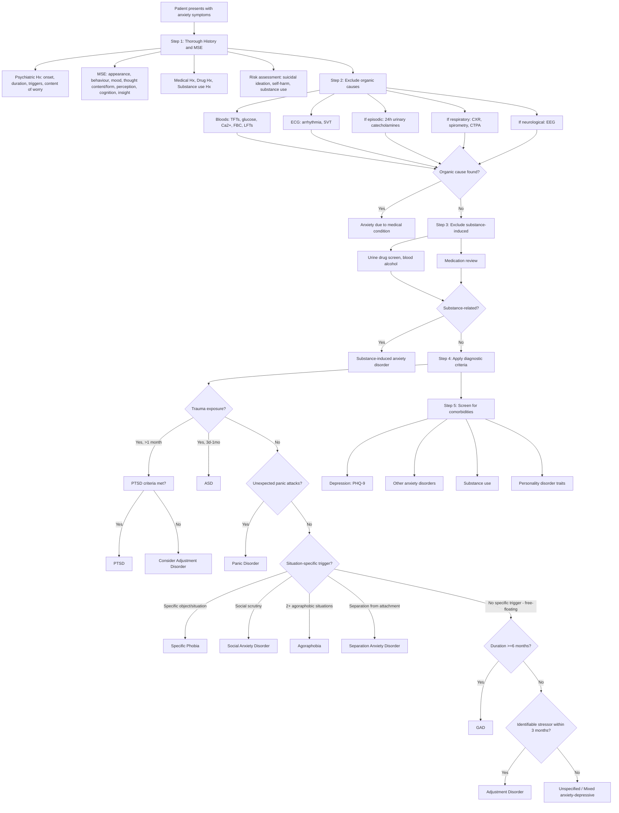

## Diagnostic Criteria for Anxiety Disorders

Diagnosis of anxiety disorders is fundamentally **clinical** — it rests on a careful psychiatric history, mental state examination, and the application of standardised diagnostic criteria (DSM-5-TR or ICD-11). There is no blood test or scan that "diagnoses" an anxiety disorder. Investigations exist primarily to **exclude organic mimics** and to **assess comorbidities**.

Let's walk through the diagnostic criteria for each major anxiety disorder, then the diagnostic algorithm and the role of investigations.

---

### Overarching Diagnostic Principles

Before diving into individual criteria, understand that **all** anxiety disorder diagnostic criteria share the same logical skeleton:

1. **Core symptom cluster** — the specific pattern of fear/anxiety/worry
2. **Trigger/context specificity** — what triggers it (or whether it is "free-floating")
3. **Duration threshold** — minimum time symptoms must be present (prevents diagnosing transient normal reactions)
4. **Severity threshold** — must cause **clinically significant distress** or **functional impairment**
5. **Exclusion criteria** — not attributable to substance/medical condition; not better explained by another mental disorder

> The exclusion criteria exist because of the **diagnostic hierarchy**: organic → substance → psychotic → mood → anxiety. You only diagnose a primary anxiety disorder after ruling out conditions higher in the hierarchy [2].

<Callout title="ICD-10 vs DSM-5: A Key Philosophical Difference" type="error">
In **ICD-10**, GAD is essentially a **diagnosis of exclusion** — it is NOT diagnosed if criteria for panic disorder, phobic anxiety, or OCD are met. In **DSM-5**, GAD can be diagnosed **comorbidly** alongside other anxiety disorders because DSM-5 emphasises excessive worry as a core feature with a specific 6-month duration [2]. This difference is commonly tested.
</Callout>

---

### 1. Generalised Anxiety Disorder (GAD)

#### DSM-5 Criteria [1][2]

***A. Excessive anxiety and worry (apprehensive expectation), occurring more days than not for at least 6 months, about a number of events or activities (such as work or school performance).*** [1]

> Why "more days than not for ≥6 months"? This duration threshold distinguishes GAD from normal transient worry. If it only lasted a few weeks after a stressor, you'd consider adjustment disorder or normal stress reaction instead.

***B. The person finds it difficult to control the worry.*** [1]

> This criterion captures the essence of pathological worry — the patient recognises their worry is excessive but **cannot stop** it. This is unlike normal worry which can be "put aside."

***C. Associated with 3 or more of the following 6 symptoms*** (≥1 in children), with at least some symptoms present for more days than not for the past 6 months [1]:
1. ***Restlessness or feeling keyed up or on edge*** — sustained locus coeruleus activation → chronic heightened arousal
2. ***Being easily fatigued*** — chronic hyperarousal depletes energy reserves; sustained cortisol → metabolic effects
3. ***Difficulty concentrating or mind going blank*** — prefrontal resources hijacked by worry circuit
4. ***Irritability*** — chronic amygdala activation → ↓threshold for emotional reactivity
5. ***Muscle tension*** — sustained sympathetic-mediated skeletal muscle contraction
6. ***Sleep disturbance*** (difficulty falling or staying asleep, or restless, unsatisfying sleep) — failure to suppress amygdala/LC at night

> **Mnemonic: "R-E-D-I-M-S"** — Restlessness, Easy fatigue, Difficulty concentrating, Irritability, Muscle tension, Sleep disturbance

***D. Causes clinically significant distress and functional impairment.*** [1]

***E. Not due to the direct physiological effects of substance or general medical conditions.*** [1]

***F. Not explained by another mental disorder.*** [1]

#### ICD-10 / ICD-11 Comparison [2]

| Feature | ICD-10 | DSM-5 |
|---|---|---|
| **Core feature** | Primary symptoms of anxiety most days, usually several months | ***Excessive anxiety and worry, ≥6 months*** |
| **Symptom domains** | (a) Apprehension, (b) Motor tension, (c) Autonomic overactivity | ***≥3 of 6 symptoms*** (REDIMS) |
| **Children** | Frequent need for reassurance and recurrent somatic complaints | ≥1 of 6 symptoms |
| **Co-diagnosis** | NOT diagnosed if criteria for panic, phobic anxiety, or OCD are met (exclusionary) | CAN be diagnosed alongside other anxiety disorders |

***ICD-11 (6B00)*** requires: ***a period of at least six months with prominent tension, worry and feelings of apprehension, about everyday events and problems***, with ***at least four symptoms*** from: ***autonomic arousal symptoms, symptoms concerning chest and abdomen, symptoms concerning brain and mind, general symptoms*** [4]

<Callout title="Additional ICD-10/11 Features for GAD">
The ICD approach groups symptoms differently — emphasising autonomic arousal, chest/abdominal symptoms, brain/mind symptoms, and general symptoms. The DSM approach groups them as the 6 REDIMS items. Both capture the same clinical picture from slightly different angles.
</Callout>

#### Key Clinical Notes for GAD Diagnosis [2]

- **Early morning wakening** is NOT a feature of GAD → strongly suggests depressive disorder [2]
- Transient appearance of other symptoms (especially depression) does NOT rule out GAD as main diagnosis, but the sufferer must **not meet full criteria** for depressive episode, phobic anxiety, panic disorder, or OCD (ICD-10 approach) [2]
- In children: ***frequent need for reassurance and recurrent somatic complaints*** may be prominent [2]
- **Course**: usually gradual onset; full syndrome emerges after prolonged subsyndromal symptoms [2]

---

### 2. Panic Disorder

#### DSM-5 Criteria [1][2]

***A. Recurrent unexpected panic attacks*** — an abrupt surge of intense fear/discomfort that reaches a peak within minutes, during which ≥4 of the following symptoms occur [1]:

| # | Symptom | Pathophysiological Basis |
|---|---|---|
| 1 | ***Palpitations, pounding heart or ↑HR*** | β₁ sympathetic activation of SA node |
| 2 | ***Sweating*** | Sympathetic cholinergic eccrine gland activation |
| 3 | ***Trembling or shaking*** | β₂-adrenergic skeletal muscle activation |
| 4 | ***Sensations of SOB or smothering*** | Sympathetic activation of respiratory drive |
| 5 | ***Feelings of choking*** | Pharyngeal muscle tension; hyperventilation |
| 6 | ***Chest pain or discomfort*** | Chest wall tension; hyperventilation-related vasospasm |
| 7 | ***Nausea or abdominal distress*** | Sympathetic → ↓GI motility; vagal stimulation |
| 8 | ***Feeling dizzy, unsteady, light-headed, or faint*** | Hyperventilation → ↓pCO₂ → cerebral vasoconstriction |
| 9 | ***Chills or heat sensations*** | Sympathetic vasomotor instability |
| 10 | ***Paraesthesias (numbness or tingling)*** | Respiratory alkalosis → ↓ionised Ca²⁺ → neuronal hyperexcitability |
| 11 | ***Derealisation or depersonalisation*** | Amygdala-cortical disconnect during extreme fear response |
| 12 | ***Fear of losing control or "going crazy"*** | Catastrophic misinterpretation of somatic symptoms |
| 13 | ***Fear of dying*** | Catastrophic misinterpretation (e.g., "this must be a heart attack") |

> Why ≥4 symptoms? Because < 4 symptoms ("limited-symptom attacks") are common in the general population and are not sufficiently specific for panic disorder. The threshold of 4 increases diagnostic specificity.

***B. At least one of the attacks has been followed by 1 month of one or both of the following*** [1]:
1. ***Persistent concern about having additional attacks or their consequences*** ("anticipatory anxiety")
2. ***A significant maladaptive change in behaviour related to the attacks*** (e.g., avoidance of exercise, agoraphobic patterns)

> Criterion B is crucial — it's not enough to just have panic attacks. The attacks must lead to **persistent worry** or **behavioural change**. Otherwise, isolated panic attacks (which are common in the general population) would be over-diagnosed.

***C. Not due to direct physiological effects of a substance or a general medical condition.*** [1]

***D. Not better accounted for by another mental disorder.*** [1]

#### ICD-10 Comparison [2]

| ICD-10 | DSM-5 |
|---|---|
| Several severe attacks of autonomic anxiety within ~1 month | ***Recurrent unexpected panic attacks*** with ≥4/13 symptoms |
| (a) In circumstances where there is no objective danger | Unexpected = no obvious cue/trigger |
| (b) Not confined to known or predictable situations | Same concept — not cued by specific stimuli |
| (c) Comparable freedom from anxiety between attacks (anticipatory anxiety common) | ≥1 month of persistent concern or behavioural change |
| NOT diagnosed when secondary to phobic or depressive disorders | Not better explained by another mental disorder |

---

### 3. Specific Phobia

#### DSM-5 Criteria [1][2]

***A. Marked fear or anxiety about a specific object or situation.*** [1]

***B. The phobic object or situation almost always provokes immediate fear or anxiety.*** [1]

> "Almost always" = the response is consistent and reliable — not occasional or variable. This distinguishes phobia from incidental anxiety.

***C. The phobic object or situation is actively avoided or endured with intense fear or anxiety.*** [1]

***D. The fear or anxiety is out of proportion to the actual danger posed by the specific object or situation and to the sociocultural context.*** [1]

> "Sociocultural context" matters — fear of snakes is reasonable in rural Australia but not in urban Hong Kong. The fear must exceed what is culturally normative.

***E. The fear, anxiety, or avoidance is persistent, typically lasting for 6 months or more.*** [1]

***F. The fear, anxiety, or avoidance causes clinically significant distress or impairment in social, occupational, or other important areas of functioning.*** [1]

***G. The disturbance is not better explained by other mental disorder.*** [1]

**Specifiers**: (1) animal, (2) natural environment, (3) blood-injection-injury, (4) situational, (5) other [2]

#### ICD-10 Comparison [2]

ICD-10 requires that:
- (a) Psychological or autonomic symptoms are **primary manifestations** of anxiety, **not secondary** to other symptoms (e.g., delusions, obsessions)
- (b) Anxiety is **restricted** to the presence of the particular phobic object/situation
- (c) The phobic situation is **avoided** whenever possible

---

### 4. Social Anxiety Disorder (Social Phobia)

#### DSM-5 Criteria [1][2]

***A. Marked fear or anxiety about one or more social situations in which the individual is exposed to possible scrutiny by others.*** [1]

> Examples: social interactions (conversations, meeting unfamiliar people), being observed (eating, drinking), performing (giving a speech).

***B. The individual fears that he or she will act in a way or show anxiety symptoms that will be negatively evaluated.*** [1]

> This is the core cognitive distortion — fear of **negative evaluation** (humiliation, embarrassment, rejection, offending others).

***C. The social situations almost always provoke fear or anxiety.*** [1]

***D. The social situations are avoided or endured with intense fear or anxiety.*** [1]

***E. The fear or anxiety is out of proportion to the actual threat posed by the social situations and to the sociocultural context.*** [1]

***F. The fear, anxiety, or avoidance is persistent, typically lasting for 6 months or more.*** [1]

***G. The fear, anxiety, or avoidance causes clinically significant distress or impairment in social, occupational, or other important areas of functioning.*** [1]

***H. The fear, anxiety, or avoidance is not attributable to the physiological effects of a substance or another medical condition.*** [1]

***I. The fear, anxiety, or avoidance is not better explained by the symptoms of another mental disorder.*** [1]

***J. If another medical condition (e.g., PD, obesity, disfigurement from burns/injury) is present, the fear, anxiety, or avoidance is clearly unrelated or is excessive.*** [1]

> Criterion J is often forgotten — a patient with Parkinson's tremor may reasonably be self-conscious. Only diagnose social anxiety disorder if the fear is **clearly excessive** relative to the medical condition.

**Specifier**: "performance only" — if fear is restricted to speaking or performing in public [1]

#### ICD-10 Comparison [2]

- Requires primary manifestation of anxiety (not secondary to delusions/obsessions)
- Anxiety must be restricted to or predominate in particular social situations
- Diagnostic precedence given to agoraphobia if difficult to distinguish [2]

---

### 5. Agoraphobia

#### DSM-5 Criteria [1][2]

***A. Marked fear or anxiety about two (or more) of the following five situations*** [1]:
1. ***Using public transportation*** (buses, trains, ships, planes)
2. ***Being in open spaces*** (parking lots, marketplaces, bridges)
3. ***Being in enclosed places*** (shops, theatres, cinemas)
4. ***Standing in line or being in a crowd***
5. ***Being outside of the home alone***

***B. The individual fears or avoids these situations because of thoughts that escape might be difficult or help might not be available in the event of developing panic-like symptoms or other incapacitating or embarrassing symptoms.*** [1]

> This is the core cognitive distortion in agoraphobia — it's NOT a fear of the place itself, but a fear of **what might happen** (panic, incapacitation) and the **inability to escape or get help**. This is why "agoraphobia" (Greek: "agora" = marketplace + "phobos" = fear → "fear of the marketplace") is slightly misleading — it's not really fear of open spaces, but fear of being unable to escape/get help in those spaces.

***C. The agoraphobic situations almost always provoke fear or anxiety.*** [1]

***D. The agoraphobic situations are actively avoided, require the presence of a companion, or are endured with intense fear or anxiety.*** [1]

***E. The fear or anxiety is out of proportion to the actual danger posed by the agoraphobic situations and to the sociocultural context.*** [1]

***F. The fear, anxiety, or avoidance is persistent, typically lasting for 6 months or more.*** [1]

***G. The fear, anxiety, or avoidance causes clinically significant distress or impairment in social, occupational, or other important areas of functioning.*** [1]

***H. If another medical condition (e.g., IBD, PD) is present, the fear, anxiety, or avoidance is clearly excessive.*** [1]

***I. Not better explained by other mental disorder.*** [1]

<Callout title="Key Change in DSM-5">
In DSM-IV, agoraphobia could only be diagnosed as a specifier of panic disorder ("panic disorder with agoraphobia"). In DSM-5, **agoraphobia is a separate diagnosis** that can exist independently of panic disorder. Both can be coded if both criteria sets are met. In ICD-10, agoraphobia with panic disorder is still coded as a single entity.
</Callout>

---

### 6. PTSD (For Completeness — Now in Separate DSM-5 Chapter)

#### DSM-5 Criteria (Abbreviated) [2]

- **A.** Exposure to actual or threatened death, serious injury, or sexual violence (directly, witnessing, learning about, or repeated exposure)
- **B.** ≥1 intrusion symptoms: recurrent intrusive memories, distressing dreams, dissociative reactions (flashbacks), psychological/physiological distress at trauma cues
- **C.** Persistent avoidance of stimuli associated with the traumatic event (≥1 of: avoidance of distressing memories/thoughts/feelings; avoidance of external reminders)
- **D.** Negative alterations in cognitions and mood associated with the event (≥2 of: inability to remember, negative beliefs, distorted cognitions, negative emotional state, diminished interest, detachment, inability to experience positive emotions)
- **E.** Marked alterations in arousal and reactivity (≥2 of: irritable behaviour, reckless behaviour, hypervigilance, exaggerated startle, concentration problems, sleep disturbance)
- **F.** ***Lasting > 1 month in duration*** (< 1 month = Acute Stress Disorder)
- **G.** Clinically significant distress or functional impairment
- **H.** Not attributable to substance or medical condition

[2]

---

### 7. Adjustment Disorder (Residual Category)

- **Stressor**: identifiable stressor of any severity (not necessarily traumatic), onset ***≤3 months*** of stressor [2]
- **Symptoms**: emotional/behavioural symptoms out of proportion to stressor
- ***Residual category***: should NOT be diagnosed if criteria for another specific disorder (GAD, MDD, PTSD) are met [2]
- Subtypes: with depressed mood, with anxiety, with mixed anxiety and depressed mood, with disturbance of conduct, with mixed disturbance of emotions and conduct, unspecified

---

### Summary Comparison Table of Diagnostic Criteria

| Disorder | Core Feature | Trigger | Duration | Key Exclusions |
|---|---|---|---|---|
| **GAD** | Excessive worry about multiple events/activities; ≥3/6 REDIMS | Free-floating (not situation-specific) | ***≥6 months*** | Substance, medical, other mental disorder |
| **Panic Disorder** | Recurrent unexpected panic attacks (≥4/13 symptoms) + persistent concern/behavioural change | ***Unexpected*** (no cue) | ≥1 month of concern after attack | Substance, medical, other mental disorder |
| **Specific Phobia** | Marked fear of specific object/situation; almost always provokes fear | Specific stimulus | ***≥6 months*** | Other mental disorder |
| **Social Anxiety** | Marked fear of social situations with possible scrutiny; fears negative evaluation | Social situations | ***≥6 months*** | Substance, medical, other mental disorder |
| **Agoraphobia** | Fear/anxiety about ≥2/5 situations; fears escape difficulty/help unavailability | Public transport, open/enclosed spaces, crowds, alone outside | ***≥6 months*** | Medical condition (if present, must be clearly excessive) |
| **PTSD** | Intrusion + avoidance + negative cognitions/mood + hyperarousal | Following traumatic event | ***> 1 month*** | Substance, medical (ASD if 3d–1mo) |
| **Adjustment Disorder** | Emotional/behavioural symptoms out of proportion to stressor | Identifiable stressor (any severity) | ***≤3 months*** onset from stressor | Residual — NOT diagnosed if other criteria met |

---

## Diagnostic Algorithm

The clinical approach to diagnosing anxiety disorders follows a systematic, hierarchical process. Here is the comprehensive diagnostic algorithm:

---

## Investigation Modalities

### The Role of Investigations in Anxiety Disorders

<Callout title="Key Principle">
Anxiety disorders are diagnosed **clinically** through history and mental state examination. Investigations serve to: (1) **exclude organic mimics**, (2) **establish a baseline** before pharmacotherapy, and (3) **assess comorbidities**. There is no diagnostic blood test or imaging study for any anxiety disorder.
</Callout>

### A. Investigations to Exclude Organic Causes

These are the **essential** investigations when anxiety is the presenting complaint, particularly when clinical features suggest a possible organic aetiology (e.g., new onset in middle age, atypical features, lack of psychological triggers, prominent autonomic symptoms at rest):

| Investigation | What It Excludes | Key Findings That Suggest Organic Cause | Interpretation |
|---|---|---|---|
| ***Thyroid function tests (TFTs)*** | ***Thyroid disease*** [1] | ↓TSH, ↑fT₃/fT₄ (thyrotoxicosis) | Thyrotoxicosis causes ↑sympathetic sensitivity → autonomic symptoms mimicking anxiety. If TFTs abnormal → treat thyroid disease first and reassess anxiety |
| **Fasting glucose / HbA1c** | Hypoglycaemia, diabetes | ↓Glucose during symptomatic episodes | Hypoglycaemia triggers counter-regulatory catecholamine surge → sweating, tremor, palpitations. If episodic and temporally related to fasting → endocrine workup |
| **Serum calcium** | Hyperparathyroidism | ↑Ca²⁺ | Hypercalcaemia → neuropsychiatric symptoms including anxiety, confusion, depression |
| **FBC** | Anaemia, infection | ↓Hb (tachycardia, fatigue), ↑WCC (infection) | Anaemia causes compensatory tachycardia → perceived as palpitations/anxiety |
| **U&E, renal function** | Electrolyte disturbance | Various electrolyte abnormalities | Baseline before starting medications (e.g., SSRIs can cause hyponatraemia) |
| **LFTs** | Hepatic disease; alcohol use | ↑GGT (alcohol), ↑AST/ALT | Elevated GGT may suggest covert alcohol use (self-medication); baseline before drugs |
| ***ECG*** | ***Cardiac disease*** (arrhythmia, SVT) [1] | Tachyarrhythmia (SVT, AF), prolonged QTc | Arrhythmias cause episodic palpitations mimicking panic attacks. **Also needed as baseline before starting SSRIs/TCAs** (QTc prolongation risk) |
| **24-hour Holter monitor** | Paroxysmal arrhythmias | Captured arrhythmia episodes | If ECG is normal but episodes are paroxysmal and suggestive |
| ***24h urinary catecholamines / plasma metanephrines*** | ***Phaeochromocytoma*** [1] | ↑Urinary catecholamines, ↑plasma metanephrines | Phaeochromocytoma causes episodic catecholamine surges → severe "panic-like" attacks with marked hypertension |
| **CXR** | Cardiac/pulmonary disease | Cardiomegaly (HF), hyperinflation (COPD), infiltrates | Dyspnoea from cardiac/pulmonary disease → anxiety |
| **Spirometry** | COPD, asthma | Obstructive pattern (↓FEV₁/FVC) | Air hunger from obstructive lung disease can trigger or mimic anxiety |
| ***EEG*** | ***Epilepsy*** (especially TLE) [1] | Epileptiform discharges, temporal lobe abnormalities | Temporal lobe epilepsy can cause ictal fear, déjà vu, automatisms that mimic panic |
| **CTPA / D-dimer** | Pulmonary embolism | Filling defects on CTPA; ↑D-dimer | If clinical suspicion (pleuritic pain, haemoptysis, risk factors) |
| **CT/MRI brain** | Structural brain pathology | Mass lesions, temporal lobe pathology | Only if focal neurological signs, late-onset atypical anxiety, or cognitive decline suggestive of dementia |

### B. Investigations to Exclude Substance-Induced Anxiety

| Investigation | Purpose | Key Findings |
|---|---|---|
| **Urine drug screen** | Detect stimulant/illicit drug use | Positive for amphetamines, cocaine, cannabis, opioids |
| **Blood alcohol level** | Acute intoxication/withdrawal | Elevated BAL; or clinical features of withdrawal with low/zero BAL |
| **Urine toxicology** | Comprehensive substance screen | Benzodiazepines (if not prescribed), other substances |
| **Medication review** | Iatrogenic anxiety | Recently started SSRI (first 2 weeks), corticosteroids, sympathomimetics, T₄, anticholinergics, antipsychotics (akathisia) |

### C. Screening and Rating Scales

These are not diagnostic but help **quantify severity**, **track treatment response**, and **screen for comorbidities**:

| Scale | What It Measures | Key Details |
|---|---|---|
| **GAD-7** (Generalised Anxiety Disorder 7-item) | Anxiety symptom severity | 7 items scored 0–3; total 0–21. ≥5 mild, ≥10 moderate, ≥15 severe. Most widely used in primary care and research |
| **PHQ-9** (Patient Health Questionnaire 9) | Depression severity | Essential comorbidity screen — GAD + MDD co-occur in > 50% |
| **Beck Anxiety Inventory (BAI)** | Anxiety symptoms (somatic focus) | 21 items; distinguishes anxiety from depression better than some tools |
| **Hamilton Anxiety Rating Scale (HAM-A)** | Anxiety severity | Clinician-rated; 14 items; commonly used in clinical trials |
| **Panic Disorder Severity Scale (PDSS)** | Panic disorder severity | 7 items assessing panic frequency, distress, avoidance, anticipatory anxiety |
| **Liebowitz Social Anxiety Scale (LSAS)** | Social anxiety severity | 24 items assessing fear and avoidance in social/performance situations |
| **SPIN (Social Phobia Inventory)** | Social anxiety screening | 17 items; briefer than LSAS |
| **PCL-5 (PTSD Checklist)** | PTSD symptoms | 20 items mapping to DSM-5 PTSD criteria |
| **Y-BOCS (Yale-Brown OCD Scale)** | OCD severity | 10 items; gold standard for OCD severity assessment |
| **AUDIT / CAGE** | Alcohol use | Screen for comorbid alcohol use disorder (self-medication) |

### D. Baseline Investigations Before Pharmacotherapy

Before starting medications (especially SSRIs, SNRIs, TCAs, or pregabalin), the following baseline investigations are recommended:

| Investigation | Reason |
|---|---|
| **ECG** | SSRIs and TCAs can prolong QTc → risk of torsades de pointes. Obtain baseline QTc. **TCAs in particular** require ECG monitoring |
| **U&E** | SSRIs can cause SIADH → hyponatraemia (especially in elderly). Baseline sodium important |
| **LFTs** | Hepatic metabolism of most psychotropics; baseline before hepatotoxic drugs |
| **FBC** | Baseline for monitoring (some drugs cause blood dyscrasias rarely) |
| **TFTs** | Exclude thyroid disease; also baseline if lithium is being considered (e.g., augmentation in refractory cases) |
| **Weight, BMI, BP** | Some medications (e.g., mirtazapine, pregabalin) cause weight gain; SNRIs can raise BP |
| **Pregnancy test** | In women of childbearing age — teratogenicity considerations (e.g., paroxetine is category D) |

---

### Clinical Approach to Diagnosis: Putting It All Together

The diagnostic process in practice involves:

**1. Comprehensive psychiatric assessment:**
- **History of presenting complaint**: onset, duration, triggers, content of worry/fear, avoidance patterns, functional impact
- **Key questions to ask**:
  - "What do you worry about?" (GAD = multiple topics; social anxiety = scrutiny; OCD = intrusive thoughts)
  - "Does the anxiety come on suddenly or is it always there?" (Panic = sudden, episodic; GAD = continuous)
  - "Are there specific situations that trigger it?" (Phobic disorders = yes; GAD = no)
  - "Do you avoid any situations because of the anxiety?" (Avoidance = phobic disorders, PTSD)
  - "Have you had any traumatic experiences?" (PTSD screening)
  - "Do you have any repetitive thoughts you can't get rid of, or rituals you feel compelled to do?" (OCD screening)
- **Past psychiatric history**: previous episodes, treatments tried, response
- **Family history**: anxiety, depression, bipolar, substance use
- **Substance use history**: alcohol, caffeine, illicit drugs, over-the-counter medications
- **Medical history**: thyroid disease, cardiac conditions, respiratory conditions
- **Medication history**: recent changes, new medications

**2. Mental state examination (MSE):**
- **Appearance/Behaviour**: restless, fidgeting, tremor, sweating, tense posture
- **Speech**: may be rapid, pressured (if anxious)
- **Mood**: "anxious", "nervous", "worried"
- **Affect**: anxious, apprehensive, fearful
- **Thought content**: worries (content helps differentiate disorder), catastrophic cognitions, obsessions
- **Thought form**: usually normal; may be circumstantial if overly detailed about worries
- **Perception**: usually normal (no hallucinations in primary anxiety disorders — if present, consider psychosis)
- **Cognition**: may have difficulty concentrating (but no true cognitive impairment — if present, consider dementia presenting with anxiety)
- **Insight**: usually preserved (patients typically recognise their anxiety is excessive)
- **Risk**: suicidal ideation (especially with comorbid depression), self-harm, substance use

**3. Targeted investigations** (as above — to exclude organic causes)

**4. Apply diagnostic criteria** (DSM-5 or ICD-11)

**5. Screen for comorbidities** (depression, substance use, personality disorders)

<Callout title="Must-Know Clinical Pitfall" type="error">
***In children***: anxiety and fears can be **developmentally appropriate**. Diagnose an anxiety disorder ***only when developmentally inappropriate (more severe and prolonged than usual) and causes significant distress + functional impairment*** [2]. Also, ***consider organic causes: hyperthyroidism, arrhythmias, neurological disease, substance-induced anxiety (alcohol, illicit drugs, caffeine)*** [2].
</Callout>

---

### Suggestive Features from History That Raise Suspicion [2]

When evaluating anxiety, certain history features should raise your index of suspicion for **organic or secondary causes**:

- ***Vague, inconsistent history*** mixed with normal physical sensation and abnormal checking behaviour → consider somatoform/somatic symptom disorder [2]
- **Symptoms that don't fit known disease patterns** or anatomical confines → consider functional neurological disorder
- ***Persistent anxiety and concern despite repeated help-seeking, reassurance, negative investigations, and treatment*** → consider illness anxiety disorder (hypochondriasis) [2]
- **Late onset** (middle age or elderly) without clear psychological trigger → think organic cause or dementia (BPSD)
- **Prominent autonomic symptoms at rest** without psychological component → think thyrotoxicosis, phaeochromocytoma
- **Morning-predominant anxiety** → think substance withdrawal (especially alcohol, benzodiazepines) [2]

---

<Callout title="High Yield Summary — Diagnostic Criteria and Investigation">

**All anxiety disorders share**: core symptom cluster + trigger specificity + duration threshold (usually ≥6 months except panic disorder ≥1 month, PTSD > 1 month, adjustment disorder onset ≤3 months) + significant distress/impairment + exclusion of substance/medical/other mental disorder.

**GAD criteria (REDIMS)**: Excessive worry ≥6 months + ≥3 of Restlessness, Easy fatigue, Difficulty concentrating, Irritability, Muscle tension, Sleep disturbance.

**Panic disorder**: Recurrent UNEXPECTED panic attacks (≥4/13 symptoms, peak in minutes) + ≥1 month persistent concern or behavioural change.

**Specific phobia**: Marked fear of specific stimulus; almost always provokes fear; out of proportion; ≥6 months; distress/impairment.

**Social anxiety**: Fear of social scrutiny/negative evaluation; ≥6 months; distress/impairment. Specifier: "performance only."

**Agoraphobia**: Fear of ≥2/5 situations (public transport, open spaces, enclosed places, crowds, alone outside); fears inability to escape/get help; ≥6 months.

**ICD-10 vs DSM-5**: ICD-10 treats GAD as diagnosis of exclusion; DSM-5 allows comorbid diagnosis.

**Essential investigations**: TFTs, glucose, ECG (also baseline for SSRIs/TCAs), Ca²⁺, FBC, U&E, LFTs. Consider 24h urinary catecholamines (phaeochromocytoma), EEG (TLE), urine drug screen.

**Screening tools**: GAD-7 (anxiety), PHQ-9 (depression comorbidity), BAI, HAM-A.

**Diagnosis is clinical** — investigations exclude organic mimics and establish treatment baselines.

</Callout>

---

<ActiveRecallQuiz
  title="Active Recall - Diagnostic Criteria and Investigations for Anxiety Disorders"
  items={[
    {
      question: "List the 6 associated symptoms in DSM-5 GAD criteria (Criterion C) and provide a mnemonic.",
      markscheme: "REDIMS: Restlessness (keyed up/on edge), Easy fatigue, Difficulty concentrating (mind going blank), Irritability, Muscle tension, Sleep disturbance. Need >=3 for adults, >=1 for children. Duration >=6 months.",
    },
    {
      question: "What are the two components of DSM-5 Criterion B for Panic Disorder, and why is this criterion important?",
      markscheme: "Criterion B requires at least 1 month of: (1) persistent concern about additional panic attacks or their consequences, OR (2) significant maladaptive behavioural change related to attacks. Important because isolated panic attacks are common in general population; Criterion B ensures only clinically significant presentations with sustained worry or behavioural impact are diagnosed.",
    },
    {
      question: "Name five essential investigations to perform when a patient presents with anxiety symptoms and explain the purpose of each.",
      markscheme: "(1) TFTs - exclude thyrotoxicosis; (2) Fasting glucose - exclude hypoglycaemia; (3) ECG - exclude arrhythmia/SVT and baseline before SSRI/TCA; (4) Serum calcium - exclude hyperparathyroidism; (5) FBC - exclude anaemia (compensatory tachycardia). Also accept: U&E (baseline/hyponatraemia risk), urine drug screen (substance-induced), 24h urinary catecholamines (phaeochromocytoma), EEG (temporal lobe epilepsy).",
    },
    {
      question: "How does the ICD-10 approach to diagnosing GAD differ from the DSM-5 approach, and what is the clinical significance?",
      markscheme: "ICD-10 treats GAD as a diagnosis of exclusion: GAD is NOT diagnosed if criteria for panic disorder, phobic anxiety, or OCD are met. DSM-5 allows GAD to be diagnosed comorbidly alongside other anxiety disorders because it emphasises excessive worry as a core feature with a specific 6-month duration. Clinical significance: DSM-5 approach captures more cases of GAD and recognises comorbidity, while ICD-10 approach is more restrictive.",
    },
    {
      question: "What are the five agoraphobic situations listed in DSM-5 Criterion A, and what is the underlying cognitive distortion that unifies them?",
      markscheme: "Five situations: (1) public transportation, (2) open spaces, (3) enclosed places, (4) standing in line/being in a crowd, (5) being outside the home alone. Underlying cognitive distortion: fear that escape might be difficult or help might not be available in the event of panic-like symptoms or incapacitating symptoms. It is NOT fear of the place itself but fear of the consequences of being unable to escape/get help.",
    },
  ]}
/>

## References

[1] Lecture slides: GC 167. I feel very nervous Anxiety disorders.pdf (p12, p16, p18, p21, p23, p25, p27, p29)
[2] Senior notes: ryanho-psych.md (Sections 8.1.1 Approach to Anxiety, 8.1.2 GAD diagnostic criteria and D/dx, 8.1.3 Panic Disorder diagnostic criteria, 8.1.4 Phobic Anxiety Disorders diagnostic criteria, 8.2 PTSD diagnostic criteria, 8.3.3 Adjustment Disorder, 12.5 Childhood Anxiety Disorders)
[4] Lecture slides: GC 171. Stress-related disorders and obsessive-compulsive disorder_rev.pdf (p7, p15)
