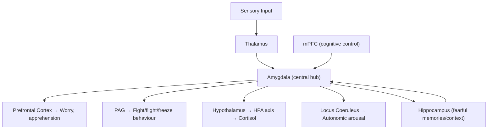

## Definition and Overview

Anxiety disorders are a group of psychiatric conditions characterised by **excessive, persistent fear and anxiety** that is **disproportionate to the actual threat**, causes **significant distress**, and results in **functional impairment** [1][2]. The key distinction from normal anxiety — which is an adaptive, evolutionary survival response — is that in anxiety disorders, the fear response is **out of proportion**, **persistent**, and **disabling**.

Let's break down the terminology:
- **Anxiety** = a future-oriented emotional state characterised by apprehension and worry about potential threats (anticipatory)
- **Fear** = an immediate emotional response to a present or imminent threat (reactive)
- Both activate the same neurobiological "threat detection" circuitry, but anxiety disorders involve dysregulation of this system

> Think of anxiety as your smoke alarm — useful when there's a real fire, but in anxiety disorders, the alarm goes off when you're just making toast.

<Callout title="Normal Anxiety vs. Pathological Anxiety">
Normal anxiety is adaptive (e.g., motivating exam preparation). Pathological anxiety is distinguished by: (1) disproportionate intensity to the actual threat, (2) persistence beyond the stressor, (3) significant distress, and (4) functional impairment in social, occupational, or other domains.
</Callout>

The DSM-5-TR groups anxiety disorders as follows (note that OCD and PTSD are now in separate chapters since DSM-5, but are often taught alongside anxiety disorders for historical and clinical reasons):
- ***Generalised Anxiety Disorder (GAD)***
- ***Panic Disorder***
- ***Agoraphobia***
- ***Social Anxiety Disorder (Social Phobia)***
- ***Specific Phobia***
- ***Separation Anxiety Disorder***
- ***Selective Mutism***
- ***Substance/Medication-Induced Anxiety Disorder***
- ***Anxiety Disorder Due to Another Medical Condition***

---

## Epidemiology

***Anxiety disorders often have an early onset — teens or early twenties, show a 2:1 female predominance, have a waxing and waning course over lifetime, and are similar to major depression and chronic diseases such as diabetes in functional impairment and decreased quality of life.*** [1]

| Anxiety Disorder | One-Year Prevalence | Usual Age of Onset | Sex Ratio (F:M) |
|---|---|---|---|
| ***Generalised Anxiety Disorder*** | ***2.8%*** | ***Variable: childhood to late adulthood*** | ***2–3:1*** |
| ***Panic Disorder (± agoraphobia)*** | ***3.9%*** | ***Late adolescence to mid-30s*** | ***2–3:1*** |
| ***Social Phobia*** | ***3.7%*** | ***Mid-teens*** | ***About equal*** |
| ***Specific Phobia*** | ***4.4%*** | ***Childhood to adolescence*** | ***2:1*** |
| ***PTSD*** | ***3.6%*** | ***Any age (after trauma)*** | ***2:1*** |
| ***OCD*** | ***2.1%*** | ***Adolescence to early adulthood*** | ***Equal*** |

*Table adapted from Narrow et al. 2002* [2]

Key epidemiological points:
- **Most common mental disorders overall** — lifetime prevalence ~30%
- **Childhood anxiety disorders** are the commonest mental disorders of childhood [2]
- **Hong Kong context**: Anxiety disorders are highly prevalent in Hong Kong, particularly GAD and social anxiety disorder. High population density, academic pressure (especially in adolescents), competitive work environments, and cultural factors (e.g., emphasis on face/"面子", stigma around mental health) contribute. The COVID-19 pandemic further increased prevalence.
- **Comorbidity is the rule, not the exception**: Anxiety disorders frequently co-occur with each other, with depression (>50% comorbidity), substance use disorders (especially alcohol as self-medication), and medical conditions [2]

<Callout title="High Yield — Comorbidity" type="idea">
When you see one anxiety disorder, actively look for others. GAD + MDD is extremely common ("anxious depression"). Panic disorder + agoraphobia co-occur in ~95% of agoraphobia cases. Substance misuse (particularly alcohol) is a frequent complication due to self-medication [2].
</Callout>

---

## Risk Factors

Risk factors can be organised using the biopsychosocial model:

### Biological Risk Factors
- **Female sex** (2:1 across most anxiety disorders) — likely related to hormonal factors (oestrogen modulates serotonergic and HPA axis function), greater amygdala reactivity, and psychosocial factors
- **Family history / genetics** (see Aetiology section for detail)
- **Chronic medical illness** (especially those causing autonomic symptoms — thyrotoxicosis, cardiac arrhythmias, COPD, asthma)
- **Temperament of behavioural inhibition** — a childhood temperamental trait of being timid and shy in novel situations, strongly predictive of later anxiety disorders

### Psychological Risk Factors
- ***Neuroticism*** — the personality trait of experiencing negative emotions easily; shared risk factor with depression [2][3]
- ***Early environment: parental separation, physical and sexual abuse, non-caring or overprotective parenting styles*** [3]
- **Anxious attachment style** — bidirectional escalation of anxiety in parent-child dyad [2]
- **Cognitive biases** — attentional bias towards threat, catastrophising, intolerance of uncertainty

### Social Risk Factors
- ***Lack of supportive networks, poorly functioning relationships, and poor social integration*** [3]
- ***Stress and trauma: long-term difficulties, recent life events (in particular events that lead to feelings of entrapment and humiliation)*** [3]
- **Lower socioeconomic status**
- **Substance use** (both as risk factor and consequence)

---

## Anatomy and Neurocircuitry of Anxiety

Understanding the neuroanatomy is essential because it explains both the clinical features and the mechanisms of treatment. There are two key circuits to understand:

### 1. The Amygdala-Based Fear Circuit

The **amygdala** is the central hub for processing fear. It is an almond-shaped ("amygdala" = Greek for "almond") structure in the medial temporal lobe [2].

**Inputs to the amygdala:**
- **Thalamus** → direct "quick and dirty" sensory relay (allows rapid fear response before conscious processing)
- **Hippocampus** → contextual memory cues ("I was attacked in this alley before") [2]
- **Medial prefrontal cortex (mPFC)** → top-down cognitive control and regulation of fear response [2]

**Outputs from the amygdala** (these explain the clinical features of anxiety):

| Amygdala Output | Target | Effect | Clinical Manifestation |
|---|---|---|---|
| Amygdala → **Prefrontal cortex** (orbitofrontal, anterior cingulate) | Cortex | Affect of fear, cognitive effects | Apprehension, worry, catastrophic thinking |
| Amygdala → **Periaqueductal grey (PAG)** | Brainstem | Fear behaviour (fight, flight, freeze) | Avoidance behaviour, agitation, freezing |
| Amygdala → **Hypothalamus** | HPA axis | Stress hormonal response (↑cortisol, ↑CRH) | Chronic stress effects, ↑medical comorbidity |
| Amygdala → **Locus coeruleus** | Brainstem | Autonomic response (↑noradrenaline release) | Palpitations, sweating, tremor, GI upset |
| Amygdala → **Hippocampus** | Temporal lobe | Fearful memory consolidation | Re-experiencing, conditioned fear responses |

[2]

### 2. The Cortico-Striato-Thalamo-Cortical (CSTC) Loop — The "Worry Circuit"

***Worry is mediated by the cortico-striato-thalamo-cortical (CSTC) loop*** [2]:
- Arises from the **dorsolateral prefrontal cortex (DLPFC)** → passes through **striatum** → **thalamus** → back to **DLPFC**
- This circuit is thought to account for **recurrent, ruminative thoughts** in anxiety disorders (e.g., ruminations, obsessions)
- Modulated by **5HT, GABA, DA, NA, glutamate** [2]
- **COMT polymorphisms** may affect monoamine metabolism within this circuit → vulnerability to excessive worrying [2]

<Callout title="Two Circuits, Two Symptom Domains">
Think of it this way: the **amygdala circuit** drives the **fear and autonomic symptoms** (palpitations, sweating, fight-or-flight), while the **CSTC loop** drives the **worry and rumination** (cognitive symptoms — "what if something terrible happens?"). Both are dysregulated in anxiety disorders.
</Callout>

### Key Brain Regions in Anxiety

| Brain Region | Normal Function | Abnormality in Anxiety |
|---|---|---|
| **Amygdala** | Registration of emotional significance of stimuli; development of emotional memory | ***Overactivation*** — exaggerated fear response [2] |
| **mPFC / VMPFC** | Cognitive control and regulation of amygdala; inhibitory role | Failure to recruit → ***inability to regulate excessive anxiety*** [2] |
| **Hippocampus** | Contextual memory cues for anxiety | Reduced volume (especially in PTSD); aberrant fear conditioning |
| **Insula** | Interoception (sensing internal body states) | ↑Activation → heightened awareness of bodily sensations (why patients "feel" their heart racing) |
| **Dorsal ACC** | Conflict monitoring, error detection | ↑Activation → excessive monitoring for threats |
| **Locus coeruleus** | Noradrenergic arousal | ↑Output → autonomic hyperarousal |

---

## Neurochemical Basis of Anxiety

***Dysregulation of the GABA, norepinephrine, and serotonin systems causes anxiety disorder*** [1].

### GABA System
- ***Inhibitory neurotransmitter*** [1]
- ***Suppresses other neurotransmitters e.g. serotonin, norepinephrine, dopamine etc.*** [1]
- GABA is the **principal inhibitory neurotransmitter** in the brain
- **Mechanism**: GABA-A receptors are chloride-channel-linked → when GABA binds → Cl⁻ influx → neuronal hyperpolarisation → ↓neuronal excitability
- **In anxiety disorders**: ↓GABA activity → failure to suppress amygdala and CSTC circuits → unchecked fear and worry responses
- **Pharmacological implication**: Benzodiazepines (BZDs) are positive allosteric modulators of GABA-A receptors → enhance GABA effect → rapid anxiolysis [2]

### Norepinephrine (Noradrenaline) System
- ***Autonomic arousal and somatic symptoms in anxiety*** [1]
- Released from the **locus coeruleus** (LC) in the brainstem
- **Mechanism**: LC activation → widespread noradrenaline release → sympathetic activation → tachycardia, sweating, tremor, GI upset, pupil dilation
- **In anxiety disorders**: ↑central NA levels → autonomic hyperarousal
- **Pharmacological implication**: Long-term SNRIs → downregulation of adrenergic receptors → anxiolysis; β-blockers (e.g., propranolol) can block peripheral autonomic symptoms [2]

### Serotonin (5-HT) System
- ***Appetite, energy, sleep, mood, libido and cognitive function in anxiety*** [1]
- Serotonin innervates the **amygdala** and all elements of the **CSTC circuit** [2]
- **Postulated role**: signals presence of anxiety-producing stimuli but **restrains associated behavioural responses** — so serotonin is like a brake on anxiety behaviour
- **In anxiety disorders**: ↓cortical 5HT1A binding (demonstrated in panic disorder) → failure of this "braking" mechanism
- **Pharmacological implication**: SSRIs/SNRIs are first-line treatment — they increase serotonergic tone and restore the inhibitory modulation of anxiety [2]

### Other Neurochemical Systems
- **α₂δ ligands** (e.g., pregabalin, gabapentin): bind α₂δ subunit of presynaptic voltage-sensitive calcium channels (VSCCs) → ↓release of excitatory neurotransmitters (especially glutamate) → anxiolytic effects [2]
- **Glutamate**: principal excitatory neurotransmitter; excessive glutamatergic activity in amygdala and CSTC circuit contributes to anxiety
- **Dopamine**: plays a role in CSTC circuit modulation; less directly implicated than 5HT/NA/GABA but relevant in certain anxiety-related conditions (e.g., social anxiety)
- **HPA axis**: chronic anxiety → sustained cortisol elevation → hippocampal damage (↓volume), immune dysregulation, metabolic effects

<Callout title="Exam Point: Neurotransmitter → Drug Mapping">
- **GABA** → Benzodiazepines (agonists at GABA-A)
- **Serotonin** → SSRIs, SNRIs, buspirone (5HT1A partial agonist)
- **Noradrenaline** → SNRIs (long-term downregulation), β-blockers (peripheral)
- **Glutamate (via α₂δ)** → Pregabalin, gabapentin
- **HPA axis** → Not directly targeted but normalised by effective treatment
</Callout>

---

## Aetiology (Biopsychosocial Model)

### Biological Factors

#### Genetics
- **Twin studies**: MZ > DZ concordance rate for anxiety disorders, but results are inconsistent and heritability is **moderate** (not as strong as schizophrenia or bipolar) [2]
- **Shared heritability** with other anxiety disorders, major depression, and neurotic personality — this explains why they so often co-occur [2]
- **Specific gene profiles**: 
  - ***5HT transporter polymorphism*** (short allele of 5-HTTLPR → ↓serotonin reuptake efficiency → ↑vulnerability) [2]
  - ***Glutamic acid decarboxylase (GAD65/67) polymorphism*** (enzyme converts glutamate → GABA; dysfunction → ↓GABA → ↑anxiety) [2]
  - ***COMT polymorphisms*** → affects catecholamine metabolism → vulnerability to worrying [2]
- Heritability varies by disorder:
  - GAD: moderate (~30%)
  - Panic disorder: ~40% risk inherited, 5× risk in first-degree relatives [2]
  - Specific phobia: 31% of first-degree relatives affected [2]
  - Social anxiety disorder: familial aggregation demonstrated
  - PTSD: ***~1/3 of variance in susceptibility*** [2]

#### Neurobiological Changes (Disorder-Specific)

**GAD:**
- Neurochemistry: disturbances not consistently demonstrated [2]
- ***Functional imaging: inconsistent changes in amygdala reactivity, but altered activity in cortical regulatory regions (e.g., VLPFC) and altered connectivity with amygdala → inability to regulate excessive anxiety*** [2]

**Panic Disorder:**
- ***Structural: inconsistent changes in volumes of amygdala and cingulate cortex*** [2]
- ***Functional: abnormalities in baseline perfusion and during panic provocation in fear-related circuitry*** [2]
- ***Neurotransmitters: ↓cortical 5HT1A binding, ↓cortical GABA levels*** [2]
- Key structures: amygdala, ***dorsomedial hypothalamus/perifornical region*** (coordinates rapid mobilization of behavioural, autonomic, respiratory, and endocrine responses), ***insula, dorsal ACC, VMPFC*** [2]

**Specific Phobia:**
- ***↑Activation of regions related to emotional appraisal and fear (amygdala, insula, ACC)*** [2]
- ***Failure to recruit VMPFC for regulation of limbic responses*** [2]

**PTSD:**
- ***Noradrenaline: ↑central NA levels with down-regulated central adrenergic receptors*** [2]
- ***HPA axis: ↓plasma cortisol with upregulation of glucocorticoid receptors, ↑CRH in CSF*** [2]
- ***Brain imaging: ↓hippocampus, left amygdala, ACC volume*** [2]

> The PTSD HPA axis finding is counterintuitive: you'd expect ↑cortisol (as in chronic stress), but PTSD actually shows ↓cortisol with **upregulated** glucocorticoid receptors. This enhanced negative feedback "sensitises" the stress system, leading to exaggerated stress responses from smaller stimuli.

### Psychological Factors

#### Personality Factors
- ***Neuroticism***: the tendency to experience negative emotions easily — shared vulnerability factor for both anxiety and depression [2][3]
- ***Behavioural inhibition***: childhood temperamental trait of being timid and shy in novel situations — strongly predictive of later anxiety disorders (especially social anxiety) [2]
- ***Sociotropy*** (strong need for peer approval) — shared with depression [3]
- **Anxiety sensitivity**: tendency to fear anxiety-related sensations (e.g., fearing that palpitations mean a heart attack) — particularly relevant to panic disorder

#### Cognitive Theories
Cognitive theories explain why anxiety becomes self-perpetuating:

1. ***Coping style***: worrying as a way to deal with potential threats — the person cannot relax until they have examined all possible dangers and identified potential solutions (this is GAD in a nutshell) [2]
2. ***Cognitive bias***: attention to potentially threatening stimuli, overestimation of environmental threat, preferential memory for threatening materials [2]
3. ***Other cognitive styles***: intolerance of uncertainty or ambiguity, meta-worry (worry about the consequences of excessive worrying) [2]
4. **Fear conditioning** (classical conditioning): accounts for anxiety response associated with trauma-related cues with **failure to extinguish** conditioned responses — particularly relevant in phobias and PTSD [2]
5. ***Cognitive theories of PTSD***: overwhelming of normal processing of emotionally charged information → memories persist in an unprocessed form → can intrude into conscious awareness [2]

> The cognitive model beautifully explains why anxiety disorders are self-maintaining: the person avoids the feared situation → never learns that the feared outcome doesn't occur → fear is maintained → further avoidance. This is why **exposure** is the core of CBT for anxiety.

#### Psychodynamic Theories
- Weakening of ego by developmental failure in childhood (e.g., failure to achieve secure relationships with loving parents) → readily overwhelmed ego → anxiety in adulthood [2]
- Conversion of emotional distress into physical symptoms (relevant to somatic symptom presentations of anxiety) [2]

### Social Factors

#### Developmental Factors
- ***Early adverse experience*** is more common in anxiety disorder patients [2]
- ***Parenting style: overprotection and lack of emotional warmth*** [2]
- ***Parental separation, childhood physical and sexual abuse*** [3]
- **Anxious attachment**: bidirectional escalation of anxiety in mother-child dyad [2]

#### Current Social Factors
- ***Lack of supportive networks, poorly functioning relationships, and poor social integration*** [3]
- ***Long-term difficulties, recent life events (especially entrapment and humiliation)*** [3]
- Lower socioeconomic status
- **Hong Kong-specific**: intense academic pressure (DSE exam culture), crowded living conditions, long working hours, limited mental health service access, and cultural stigma around help-seeking

---

## Classification

### DSM-5-TR Classification of Anxiety Disorders

| Category | Disorders |
|---|---|
| ***Anxiety Disorders*** | ***GAD, Panic Disorder, Agoraphobia, Social Anxiety Disorder, Specific Phobia, Separation Anxiety Disorder, Selective Mutism*** |
| ***Obsessive-Compulsive and Related Disorders*** (separate chapter since DSM-5) | OCD, Body Dysmorphic Disorder, Hoarding, Trichotillomania, Excoriation |
| ***Trauma- and Stressor-Related Disorders*** (separate chapter since DSM-5) | PTSD, Acute Stress Disorder, Adjustment Disorder |

<Callout title="Important Classification Change" type="error">
A common exam pitfall: OCD and PTSD are NO LONGER classified under "Anxiety Disorders" in DSM-5/DSM-5-TR. They have their own separate chapters. However, they share overlapping neurocircuitry and are frequently tested alongside anxiety disorders.
</Callout>

### ICD-11 Classification
ICD-11 (which has now replaced ICD-10) similarly separates anxiety disorders from OCD-related and stress-related disorders:
- **6B00** Generalised Anxiety Disorder
- **6B01** Panic Disorder
- **6B02** Agoraphobia
- **6B03** Specific Phobia
- **6B04** Social Anxiety Disorder
- **6B05** Separation Anxiety Disorder
- **6B06** Selective Mutism

### Childhood Anxiety Disorders [2]

| DSM-5 | ICD-10 (F93) |
|---|---|
| Separation anxiety disorder | Separation anxiety disorder of childhood |
| Specific phobia | Phobic anxiety disorder of childhood |
| Social anxiety disorder | Social anxiety disorder of childhood |
| Generalized anxiety disorder | — |

- ***Commonest mental disorders of childhood*** [2]
- Content of anxiety is **influenced by developmental stage** [2]:
  - ***Infants***: fear of strangers → social anxiety
  - ***Preschool***: fear of separation, specific objects → separation anxiety, specific phobias
  - ***Early adolescence***: fear of social situations / personal adequacy → social phobia
  - ***Late adolescence***: resembles adult patterns → GAD, panic disorders
- ***Diagnosis***: only when ***developmentally inappropriate*** (more severe and prolonged than usual) and causes ***significant distress + functional impairment*** [2]

---

## Clinical Features

The clinical features of anxiety disorders can be understood as the downstream effects of the neurocircuitry described above. A useful mnemonic for the core features is the **5 A's**:

> **A**pprehension, **A**rousal, **A**nticipatory anxiety, **A**voidance, **A**utonomic activation [2]

### Symptoms (Subjective — What the Patient Reports)

#### A. Psychological / Cognitive Symptoms

These arise from the **CSTC worry circuit** and **amygdala → prefrontal cortex** projections:

| Symptom | Pathophysiological Basis |
|---|---|
| ***Excessive worry / apprehension*** | Overactivity of CSTC loop → recurrent ruminative thoughts that cannot be suppressed; failure of mPFC regulatory control over amygdala |
| ***Feeling of dread / impending doom*** | Amygdala activation → direct projection to prefrontal cortex generating affect of fear |
| ***Difficulty concentrating*** | Prefrontal resources hijacked by worry circuit → ↓available cognitive capacity for other tasks |
| ***Irritability*** | Chronic amygdala activation and cortisol elevation → ↓threshold for emotional reactivity |
| ***Restlessness ("keyed up" or "on edge")*** | Sustained locus coeruleus activation → chronic heightened arousal state |
| ***Sleep disturbance (insomnia, especially difficulty falling asleep)*** | Failure to suppress amygdala and LC at night → hyperarousal prevents sleep initiation |
| ***Anticipatory anxiety*** | CSTC loop generates "what if" scenarios about future encounters with feared situations |
| ***Fear of losing control / going crazy / dying*** (particularly in panic disorder) | Catastrophic misinterpretation of autonomic symptoms — e.g., palpitations → "I'm having a heart attack" |

#### B. Somatic / Autonomic Symptoms

These arise primarily from the **amygdala → locus coeruleus → sympathetic nervous system** and **amygdala → hypothalamus → HPA axis** pathways:

| System | Symptom | Pathophysiological Basis |
|---|---|---|
| **Cardiovascular** | ***Palpitations, tachycardia*** | Sympathetic activation → ↑heart rate via β₁ adrenergic receptors on SA node |
| | ***Chest pain/discomfort*** | Chest wall muscle tension (intercostals); hyperventilation-related coronary vasoconstriction |
| **Respiratory** | ***Dyspnoea / sensation of choking*** | Hyperventilation driven by sympathetic activation of respiratory centres |
| | ***Hyperventilation*** | ↑Respiratory rate → ↓pCO₂ → respiratory alkalosis → perioral tingling, lightheadedness |
| **Gastrointestinal** | ***Nausea, "butterflies", abdominal discomfort*** | Sympathetic activation → ↓GI motility and blood flow diversion away from gut; vagal stimulation |
| | ***Dry mouth*** | Sympathetic activation → ↓salivary gland secretion (salivary glands are predominantly parasympathetic) |
| | ***Difficulty swallowing (globus sensation)*** | Pharyngeal muscle tension |
| **Neurological** | ***Tremor*** | ↑Noradrenaline → β₂ adrenergic activation of skeletal muscle |
| | ***Dizziness / lightheadedness*** | Hyperventilation → ↓pCO₂ → cerebral vasoconstriction → ↓cerebral blood flow |
| | ***Paraesthesia (tingling in hands, feet, perioral)*** | Respiratory alkalosis from hyperventilation → ↓ionised Ca²⁺ → ↑neuronal excitability |
| | ***Headache*** | Sustained muscle tension (tension-type headache mechanism) |
| **Genitourinary** | ***Urinary frequency / urgency*** | Autonomic activation of detrusor muscle |
| **Musculoskeletal** | ***Muscle tension, aching*** | Sustained sympathetic-mediated muscle contraction (especially neck, shoulders, back) |
| **Dermatological** | ***Sweating (diaphoresis)*** | Sympathetic cholinergic fibres to eccrine sweat glands |
| | ***Flushing / pallor*** | Sympathetic vasomotor changes — vasoconstriction (pallor) or vasodilation (flushing) |
| **General** | ***Fatigue / exhaustion*** | Chronic hyperarousal depletes energy reserves; sustained cortisol elevation → metabolic effects |

<Callout title="Why Hyperventilation Causes Tingling" type="idea">
Hyperventilation → ↓CO₂ → respiratory alkalosis → ↑pH → albumin releases H⁺ to buffer → binds more Ca²⁺ → ↓free ionised Ca²⁺ → ↑neuronal membrane excitability → perioral and peripheral paraesthesia, even carpopedal spasm (Trousseau's sign equivalent). This is why breathing into a paper bag (↑CO₂ rebreathing) helps.
</Callout>

### Signs (Objective — What the Doctor Observes)

| Sign | Pathophysiological Basis |
|---|---|
| ***Tachycardia*** | Sympathetic β₁ activation of SA node |
| ***Tachypnoea / hyperventilation*** | Sympathetic activation of respiratory drive |
| ***Diaphoresis (sweating)*** | Sympathetic cholinergic eccrine gland activation |
| ***Tremor*** (fine, postural) | β₂-adrenergic skeletal muscle activation |
| ***Muscle tension*** (palpable on examination) | Sustained sympathetic motor activation |
| ***Restlessness / psychomotor agitation*** | Generalised arousal from locus coeruleus activation |
| ***Exaggerated startle response*** | Amygdala hyperactivation → ↓threshold for startle |
| ***Pallor or flushing*** | Sympathetic vasomotor tone changes |
| ***Pupillary dilation (mydriasis)*** | Sympathetic activation of dilator pupillae muscle |
| ***Dry mouth*** (observable if patient licks lips, has difficulty speaking) | ↓Parasympathetic salivation |

### Behavioural Features

| Feature | Explanation |
|---|---|
| ***Avoidance behaviour*** | Core maintaining factor — patient avoids feared situations → never learns feared outcome won't occur → fear persists. Driven by amygdala → PAG "flight" response |
| ***Safety behaviours*** | Subtle avoidance within situations (e.g., always sitting near exits, carrying medication "just in case") — maintains anxiety by preventing disconfirmation of fears |
| ***Reassurance-seeking*** | Reflects intolerance of uncertainty; provides transient relief but maintains the anxiety cycle |
| ***Substance use*** | Self-medication with alcohol, benzodiazepines, cannabis — ↓amygdala activation temporarily but worsens anxiety long-term (rebound, withdrawal) |

---

## Disorder-Specific Clinical Features

### 1. Generalised Anxiety Disorder (GAD)

**Definition**: Excessive, uncontrollable worry about **multiple** everyday concerns (work, health, family, finances, minor matters) occurring **more days than not for ≥6 months** (DSM-5) [2].

**Core features**:
- ***Pervasive, excessive worry*** about multiple topics — the worry is "free-floating" (not focused on one specific situation or object)
- ***Difficulty controlling the worry*** — the person recognises it's excessive but cannot stop
- ***Associated with ≥3 of***: restlessness, easy fatigability, difficulty concentrating, irritability, muscle tension, sleep disturbance (DSM-5 criteria)
- The anxiety and worry cause clinically significant distress or functional impairment
- Not attributable to substance or medical condition

**Pathophysiology-clinical correlation**: GAD is thought to primarily involve the **CSTC worry circuit** with ***altered activity in cortical regulatory regions (e.g., VLPFC) and altered connectivity with amygdala → inability to regulate excessive anxiety*** [2]

**Special features**:
- Blood-injury phobia shows a **unique vasovagal response**: initial tachycardia → then ***bradycardia, pallor, dizziness, N/V, fainting*** (diphasic response) — contrast to the pure sympathetic activation seen in other anxiety disorders [2]

### 2. Panic Disorder

**Definition**: Recurrent, ***unexpected panic attacks*** — abrupt surges of intense fear/discomfort peaking within minutes, followed by persistent worry about future attacks or maladaptive behavioural changes [2].

**Panic attack symptoms** (≥4 of the following, peaking within minutes):
1. Palpitations / tachycardia
2. Sweating
3. Trembling / shaking
4. Shortness of breath / smothering
5. Feelings of choking
6. Chest pain / discomfort
7. Nausea / abdominal distress
8. Dizziness / lightheadedness / faintness
9. Chills / hot flushes
10. Paraesthesias (numbness / tingling)
11. Derealisation / depersonalisation
12. Fear of losing control / "going crazy"
13. Fear of dying

**Key distinguishing features**:
- ***Unexpected***: no obvious cue or trigger → can occur during sleep (nocturnal panic) or relaxation [2]
- ***Recurrent***: at least one within one month
- ***Worry/behaviour change***: persistent concern about additional attacks, worry about implications (heart attack, losing control), or significant maladaptive behaviour change (avoiding exercise, reorganising daily life) [2]
- ***These somatic symptoms may prompt help-seeking*** — patients often present to ED thinking they are having a heart attack or dying [2]

**D/dx of panic attacks within anxiety disorders**: Panic attacks can occur in ANY anxiety disorder, but are **expected/predictable** in those contexts (e.g., encountering feared object in phobia). Only in **panic disorder** are they truly ***unexpected*** [2].

**Also known historically as**: ***irritable heart, Da Costa's syndrome, neurocirculatory asthenia, disorderly action of the heart, effort syndrome*** [2]

### 3. Agoraphobia

**Definition**: Marked fear/anxiety about ≥2 of the following situations, due to concern that escape might be difficult or help might be unavailable if panic-like symptoms develop:
1. ***Using public transportation***
2. ***Being in open spaces***
3. ***Being in enclosed places***
4. ***Standing in line / being in a crowd***
5. ***Being outside the home alone***

**Key features**:
- The situations are ***actively avoided***, require a companion, or endured with intense fear/anxiety
- Fear is ***out of proportion*** to actual danger
- ***Persists ≥6 months***
- ***95% comorbid with panic disorder*** [2]
- Lifetime prevalence: 1.1% (with PD), 0.8% (without PD) [2]
- Can exist independently of panic disorder in DSM-5 (a change from DSM-IV)

### 4. Social Anxiety Disorder (Social Phobia)

**Definition**: Marked fear/anxiety about ***social situations*** in which the individual is exposed to possible ***scrutiny by others*** [2].

**Core features**:
- ***Fear that they will behave in a way or show anxiety symptoms that will be negatively evaluated*** (humiliated, embarrassed, rejected, or offending others) [2]
- ***Fear is out of proportion to actual threat***
- Can be ***generalised*** (widespread social situations) or ***performance-only*** (discrete triggers like public speaking) [2]
- ***Associated with***: blushing, tremor, nausea, urinary urgency [2]
- ***Anticipatory anxiety and avoidance behaviour*** → significant distress and functional impairment [2]
- ***Onset: typically mid-teens*** as intensification of pre-existing shyness, or following stressful social experience [2]
- ***Course: only 50% seek treatment, usually after many years of symptoms*** [2]

**D/dx from normal shyness**: normal shyness tends to be ***less severe and pervasive, and associated with little distress and functional impairment*** [2]

### 5. Specific Phobia

**Definition**: Marked fear/anxiety about a ***specific object or situation*** [2].

**Types**: animal, natural environment, blood-injection-injury, situational, other

**Core features**:
- ***Fear recognised as completely irrational or excessive*** but unable to be controlled [2]
- ***Fear is intense/severe and out of proportion to actual danger*** [2]
- ***Evoked nearly every time*** individual contacts phobic stimulus [2]
- ***Associated with anticipatory anxiety and avoidance behaviour*** [2]
- ***Blood-injection-injury phobia***: unique **diphasic response** — initial tachycardia → vasovagal response (↓HR, pallor, dizziness, N/V, fainting) [2]

**Onset**: generally mid-childhood/early adolescence; animals/blood-injury in childhood; situational/natural environment in late adolescence to early adulthood [2]

### 6. Separation Anxiety Disorder

- ***Excessive or prolonged fear of separation from home or major attachment figures*** [2]
- Historically considered exclusively a childhood disorder, but DSM-5 recognises it can occur in adults
- ***May present with psychosomatic complaints***, school refusal, clinging behaviour, nightmares about separation [2]

---

## Recognising Anxiety That Is Secondary to Other Conditions

This is a critical clinical skill — not every anxious patient has a primary anxiety disorder.

### Secondary to Other Psychiatric Disorders [2]

The **theme/focus** of the anxiety helps identify the underlying diagnosis:

| Theme of Anxiety | Consider |
|---|---|
| Worry about **gaining weight** | Eating disorder |
| Worry about having **serious illness** | Illness anxiety disorder (hypochondriasis) |
| Fear of being **poisoned or killed** | Paranoid schizophrenia (delusional beliefs) |
| Ruminatory thoughts of **guilt or worthlessness** | Depression |
| Associated with **obsessional thoughts or compulsions** | OCD |
| Fear of **separation or abandonment** | Borderline or dependent PD |
| Fear of being **rejected or inadequate** | Avoidant PD |

### Secondary to General Medical Conditions [2]

| Mechanism | Examples |
|---|---|
| ***Autonomic symptoms*** | Thyrotoxicosis, hypoglycaemia (episodic), phaeochromocytoma (episodic) |
| ***Dyspnoea*** | Heart failure, PE, COPD, asthma |
| ***Others*** | Cerebral trauma, BPSD of dementia, malignancies, Cushing's disease, temporal lobe epilepsy |

### Secondary to Substances/Medications [2]

| Mechanism | Examples |
|---|---|
| ***Intoxication*** | Alcohol, stimulants (amphetamines, cocaine, caffeine), cannabis, inhalants, hallucinogens (PCP) |
| ***Withdrawal*** | Alcohol, sedatives/hypnotics (BZDs, opiates), caffeine, cocaine, nicotine |
| ***Side effects of drugs*** | Antidepressants (especially first 2 weeks), corticosteroids, sympathomimetics, T₄, compound analgesics with caffeine, anticholinergics, antipsychotics (akathisia) |

<Callout title="Common Exam Trap" type="error">
Always rule out medical causes of anxiety before diagnosing a primary anxiety disorder. The classic ones to remember: thyrotoxicosis, hypoglycaemia, phaeochromocytoma, PE, cardiac arrhythmias (SVT), and drug withdrawal (especially alcohol and benzodiazepines). A TFT and glucose are minimum investigations.
</Callout>

---

## Minor Anxiety-Depressive Disorders [2]

- Mild depression often **co-exists with and cannot be separated from** anxiety disorders
- ***Very commonly seen in primary care (6.9% prevalence)*** [2]
- ***Commonly present with prominent somatic symptoms*** to healthcare
- **Mood symptoms**: anxiety, depression, irritability
- **Somatic symptoms**: fatigue, insomnia, somatic symptoms and bodily preoccupation
- **Cognitive symptoms**: poor concentration
- May cause disabling difficulties in personal and occupational function

---

## Course and Prognosis (General)

- ***Waxing and waning course over lifetime*** [1]
- **Panic disorder**: remission in 64% at 2 years; mean time to remission 5.7 years [2]
  - Good prognostic factors: female, no ongoing stressors, subthreshold panic, no comorbid depression/agoraphobia/PD [2]
- **GAD**: tends to be chronic with fluctuating severity
- **Social anxiety disorder**: chronic; only 50% seek treatment [2]
- **Specific phobia**: tends to be lifelong when untreated [2]
- **Childhood anxiety**: ~2/3 disappear in 3-5 years, but ~1/3 will develop other anxiety disorders at follow-up [2]
- **Impact**: decreased QoL, functional impairment, ***and all-cause mortality (especially cardiovascular disorders)*** [2]

---

<Callout title="High Yield Summary">

**Definition**: Anxiety disorders = excessive, persistent, disproportionate fear/anxiety → distress + functional impairment.

**Epidemiology**: Most common psychiatric disorders; early onset (teens-20s); F:M = 2:1; high comorbidity with depression and substance use.

**Two key circuits**: (1) Amygdala-based fear circuit → autonomic/somatic symptoms; (2) CSTC loop → worry/rumination.

**Three key neurotransmitters**: GABA (inhibitory, ↓ in anxiety → BZDs), serotonin (restrains anxiety behaviour → SSRIs), noradrenaline (autonomic arousal → SNRIs, β-blockers).

**5 A's of anxiety**: Apprehension, Arousal, Anticipatory anxiety, Avoidance, Autonomic activation.

**Aetiology**: Biopsychosocial — genetics (moderate, shared with depression), neurobiological (amygdala overactivation, mPFC failure), personality (neuroticism, behavioural inhibition), cognitive biases, early adversity, social factors.

**Always rule out**: Medical causes (thyrotoxicosis, hypoglycaemia, phaeochromocytoma, PE, arrhythmia), substance intoxication/withdrawal, medication side effects.

**DSM-5 classification**: GAD, panic disorder, agoraphobia, social anxiety disorder, specific phobia, separation anxiety disorder, selective mutism. OCD and PTSD are in SEPARATE chapters.

**Panic attacks** can occur in any anxiety disorder but are only "unexpected" in panic disorder.

**Blood-injection-injury phobia** = unique diphasic vasovagal response (not pure sympathetic).

</Callout>

---

<ActiveRecallQuiz
  title="Active Recall - Anxiety Disorders (Pre-DDx/Dx/Mx)"
  items={[
    {
      question: "Name the two key neurocircuits involved in anxiety and state which symptom domain each circuit primarily mediates.",
      markscheme: "(1) Amygdala-based fear circuit: mediates fear response and autonomic/somatic symptoms via projections to locus coeruleus, hypothalamus, PAG, prefrontal cortex. (2) Cortico-striato-thalamo-cortical (CSTC) loop: mediates worry, rumination, and recurrent intrusive thoughts. Arises from DLPFC through striatum and thalamus.",
    },
    {
      question: "List the three principal neurotransmitter systems dysregulated in anxiety disorders and for each, name one pharmacological agent that targets it.",
      markscheme: "(1) GABA - inhibitory NT, targeted by benzodiazepines. (2) Serotonin (5-HT) - restrains anxiety-related behavioural responses, targeted by SSRIs/SNRIs/buspirone. (3) Noradrenaline - mediates autonomic arousal, targeted by SNRIs (long-term downregulation) or beta-blockers (peripheral symptoms).",
    },
    {
      question: "What distinguishes panic attacks in panic disorder from panic attacks occurring in other anxiety disorders?",
      markscheme: "In panic disorder, panic attacks are unexpected (no obvious cue or trigger, can occur during sleep or relaxation). In other anxiety disorders, panic attacks are expected/predictable as they occur in response to specific feared stimuli (e.g., encountering phobic object, trauma cue in PTSD).",
    },
    {
      question: "Explain the unique physiological response in blood-injection-injury phobia and how it differs from other phobias.",
      markscheme: "Blood-injection-injury phobia shows a diphasic response: initial sympathetic activation (tachycardia) followed by a parasympathetic vasovagal response (bradycardia, hypotension, pallor, dizziness, nausea, fainting). Other phobias show a monophasic sympathetic response only (tachycardia, sweating, fight-or-flight).",
    },
    {
      question: "Name four medical conditions that can mimic primary anxiety disorders and should be excluded.",
      markscheme: "Any four of: thyrotoxicosis, hypoglycaemia, phaeochromocytoma, pulmonary embolism, cardiac arrhythmias (e.g., SVT), COPD/asthma, heart failure, temporal lobe epilepsy, Cushing's disease. Key investigations include TFTs and blood glucose.",
    },
    {
      question: "State the 5 A's mnemonic for core features of anxiety and give a brief explanation of each.",
      markscheme: "(1) Apprehension - excessive worry/dread. (2) Arousal - hyperarousal, restlessness, exaggerated startle. (3) Anticipatory anxiety - anxiety about future encounters with feared situations. (4) Avoidance - avoiding feared situations (maintains anxiety). (5) Autonomic activation - palpitations, sweating, tremor, GI upset from sympathetic nervous system activation.",
    },
  ]}
/>

## References

[1] Lecture slides: GC 167. I feel very nervous Anxiety disorders.pdf (p7, p16)
[2] Senior notes: ryanho-psych.md (Sections 8.1 Anxiety Disorders, 8.1.3 Panic Disorder, 8.1.4 Phobic Anxiety Disorders, 8.2 PTSD aetiology, 12.5 Childhood Anxiety Disorders, Epidemiology table)
[3] Lecture slides: GC 164. I am depressed Mood disorders.pdf (p12 — aetiology psychosocial hypothesis, shared risk factors)
