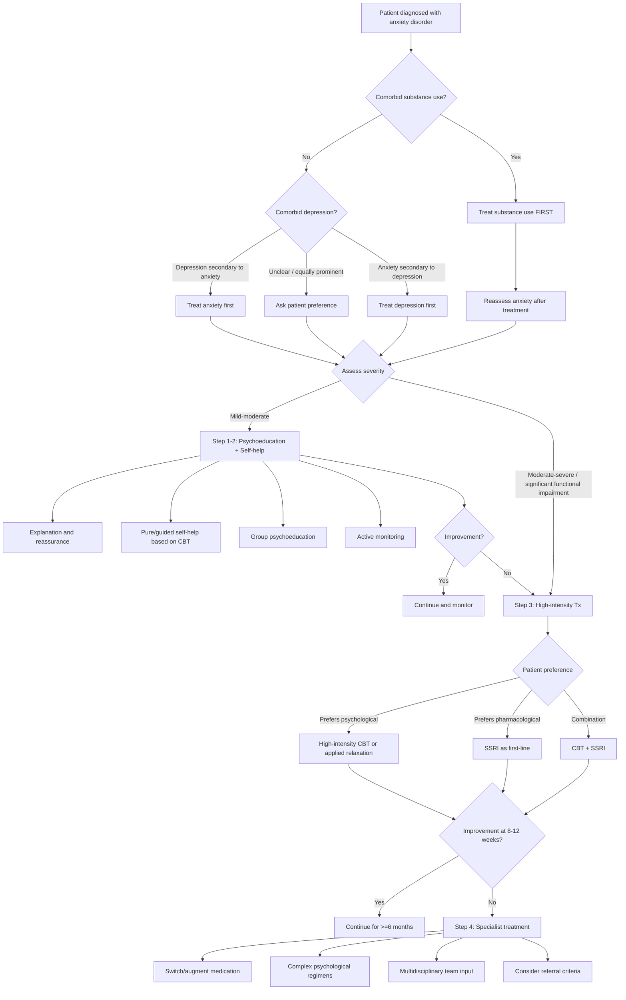
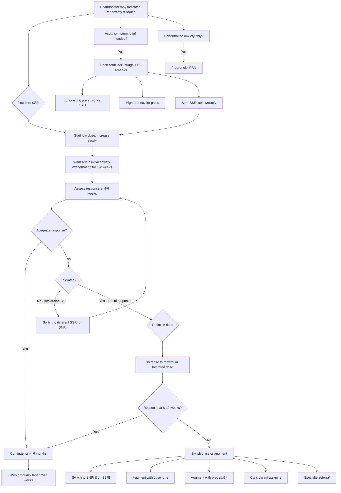

## Management of Anxiety Disorders

The management of anxiety disorders follows a structured, evidence-based approach that integrates **psychoeducation**, **psychological therapy**, and **pharmacotherapy** in a stepped-care model. The overarching principle is that treatment should be **proportionate to severity** — start simple, escalate if needed.

---

### General Principles of Management

Before we dive into specifics, here are the key principles that guide treatment decisions:

**1. Address the hierarchy first** [2]:
- If **harmful or dependent alcohol/substance use** is present → treat substance use first (often leads to large improvement in anxiety or depressive symptoms)
- If **anxiety symptoms are secondary to depression** → treat depression first
- If **depressive symptoms are secondary to anxiety disorder** → treat anxiety first
- If **unclear which is primary** → ask the patient their preference

> This makes sense from first principles: if alcohol withdrawal is driving the anxiety, no amount of CBT will fix it. Similarly, if depression is generating the anxiety, treating the depression will resolve the anxiety without needing to target it specifically.

**2. Stepped-care approach** [2]:
- **Step 1**: Identification, assessment, psychoeducation, active monitoring
- **Step 2**: Low-intensity psychological interventions (self-help, group psychoeducation)
- **Step 3**: High-intensity psychological interventions (CBT, applied relaxation) OR pharmacotherapy
- **Step 4**: Specialist treatment — complex drug and psychological regimens with multidisciplinary input

> ***Initiate treatment at Step 3 if the patient presents with more severe symptomatology and/or significant functional impairment*** [2]

**3. Psychotherapy is generally more effective than pharmacotherapy and is usually first-line** [2]

**4. When pharmacotherapy is used:**
- Short-term: BZDs should NOT be used beyond 2–4 weeks [2]
- Long-term: SSRIs as first-line, with SNRIs/pregabalin as alternatives [2]
- Continue effective treatment for **at least 6 months** to prevent relapse [2]

---

### Management Algorithm

***Consider referral to secondary care if***: risk of self-harm or suicide, marked self-neglect, non-response to at least two treatments, significant comorbidity (e.g., substance use, physical health problems) [2]

---

### Treatment Modalities

#### I. Supportive Measures

***Treatment of anxiety disorders*** begins with ***supportive measures*** [1]:

##### A. ***Explanation*** [1]
- **Psychoeducation** about the nature of anxiety: explain that anxiety is a normal survival response that has become overactive, not a sign of weakness or "going crazy"
- Explain the fight-or-flight mechanism in simple terms — "your body's alarm system is too sensitive"
- Explain that somatic symptoms (palpitations, dizziness, breathlessness) are produced by adrenaline and are **not dangerous**, even though they feel frightening
- Explain the role of avoidance in maintaining anxiety — "avoidance makes the anxiety worse in the long run because you never learn that the feared outcome doesn't happen"

##### B. ***Reassurance*** [1]
- After organic causes have been excluded, provide confident reassurance that there is no underlying physical disease
- This is particularly important for panic disorder patients who often believe they are having heart attacks or dying
- Reassurance alone is often insufficient for established anxiety disorders but is a necessary foundation

---

#### II. Psychological Treatment

***Psychological treatment*** is the cornerstone of anxiety disorder management [1][2]. ***Psychotherapy is more effective than pharmacological therapy, usually as first-line*** [2].

##### A. Self-Help (Low Intensity)

- Includes ***written and electronic materials with information about the disorder, practical exercises based on CBT principles*** [2]
- Can be ***pure self-help*** (minimal therapist input) or ***guided self-help*** (supported by a trained practitioner) [2]
- Examples: bibliotherapy (self-help books), computerised CBT programmes, smartphone apps
- Appropriate for mild-moderate anxiety with minimal functional impairment

##### B. ***Cognitive Behavioural Therapy (CBT)*** [1][2]

CBT is the **gold standard** psychological treatment for anxiety disorders. Let's understand why from first principles.

**Theoretical basis**: Anxiety disorders are maintained by a cycle of:
1. **Cognitive distortions** (catastrophising, overestimating threat, intolerance of uncertainty)
2. **Avoidance behaviour** (prevents disconfirmation of feared outcomes → fear persists)
3. **Physiological arousal** (autonomic activation reinforces belief that something is wrong)

***CBT is designed to help control worrying thoughts*** [2]. ***GAD patients tend to have a series of cognitive patterns, e.g., overestimate and catastrophise negative events and show limited confidence in problem-solving*** [2].

**CBT components for anxiety disorders:**

| Component | What It Involves | Why It Works |
|---|---|---|
| **Psychoeducation** | Teaching patient about anxiety mechanisms, fight-or-flight, cognitive distortions | Understanding reduces fear of symptoms; normalises experience |
| **Cognitive restructuring** | Identifying and challenging maladaptive thoughts (e.g., "palpitations = heart attack") | Replaces catastrophic interpretations with realistic appraisals |
| ***Exposure therapy*** | Systematic, repeated confrontation of feared stimulus/situation | Extinction of conditioned fear response; inhibitory learning ("nothing bad happens") |
| **Behavioural experiments** | Testing feared predictions in real life (e.g., "if I give a speech, will people laugh?") | Provides direct evidence against catastrophic beliefs |
| **Relaxation training** | Progressive muscle relaxation, diaphragmatic breathing | ↓Sympathetic arousal; gives patient tools to manage acute anxiety |
| **Relapse prevention** | Identifying early warning signs; developing coping plans | Prevents return of symptoms after treatment ends |

***Efficacy***: ***superior to placebo and other psychological treatments*** [2]. ***As effective as antidepressants in treatment of panic disorders; combination treatment may give better response in early stages but long-term results are uncertain*** [2].

##### C. Disorder-Specific Psychological Approaches

**For Phobic Disorders** [1]:

***Psychotherapy for phobic disorders*** [1]:
- ***Targeting the avoidance (hierarchy list)***
- ***Exposure techniques***:
  - ***Graduated, repeated, prolonged, clear tasks***
  - ***Real-life, imaginal exposure***
  - ***Home-based, relative support***
- ***Relaxation exercise***

***For social phobia specifically*** [1]:
- ***Social skill training***
- ***Cognitive treatment for fear of negative evaluation from others***

**Specific phobia** [2]:
- ***Exposure-based psychotherapy as mainstay***
- ***Method: repeated, systematic confrontation of feared stimulus → ↓fear by extinction and inhibitory learning***
- ***Usually graded, i.e., progressively up the hierarchy from least to most feared/avoided based on patient's subjective fears***
- ***Types: in vivo (more effective), imaginal, VR (virtual reality)***
- ***Efficacy: very effective, 70–85% shows significant improvement, multi-session > single session*** [2]

> Why does exposure work? The fear response is a **conditioned response** (classical conditioning). Repeated exposure without the feared outcome occurring leads to **extinction** — the conditioned stimulus (e.g., spider) is no longer paired with the unconditioned stimulus (actual harm) → the fear response gradually diminishes. Additionally, **inhibitory learning** occurs: a new "safe" memory is formed that competes with the original "danger" memory.

**For PTSD** [2]:
- ***Trauma-focused CBT*** as first-line:
  - ***Psychoeducation***: patients are educated on stressful reactions and their cognitive underpinnings
  - ***Cognitive restructuring***: address maladaptive or unrealistic appraisals by patient towards trauma
  - ***Exposure therapy***: assist patient in confronting feared memories and situations; allow emotional processing
- ***Eye movement desensitisation and reprocessing (EMDR)***:
  - ***Patient imagines a scene from trauma, focusing on accompanying cognition and arousal, while the therapist moves two fingers across the patient's visual field and instructs the patient to track fingers***
  - ***Sequence repeated until anxiety decreases, with patient instructed to generate a more adaptive thought***
  - ***Efficacy: most studies show it is efficacious in PTSD, superior to other less specific psychotherapy*** [2]

<Callout title="Critical Incident Stress Debriefing — Does NOT Work" type="error">
***Critical incident stress debriefing (CISD)*** involves going through traumatic events together with the victim. Although ***widely used, it has NOT been shown to be helpful in decreasing psychological distress*** [2]. This is frequently tested — CISD is NOT recommended for preventing PTSD.
</Callout>

##### D. Applied Relaxation

- A structured form of relaxation training specifically designed to apply learned relaxation skills to anxiety-provoking situations [2]
- Involves progressive muscle relaxation, then learning to apply relaxation rapidly in real-world anxiety situations
- Evidence supports its use particularly for GAD, alongside CBT [2]

##### E. Other Psychotherapies

| Modality | Role |
|---|---|
| ***Mindfulness-based therapy*** | ***Used alongside CBT*** [4]; focuses on becoming aware of thoughts/feelings and accepting them rather than reacting |
| Interpersonal therapy | Focus on relationship difficulties contributing to anxiety |
| Psychodynamic therapy | Explores unconscious conflicts; less evidence base than CBT for anxiety |
| Counselling / problem-solving | Brief, for minor difficulties and stressful events; assists patients in finding solutions [2] |

---

#### III. Pharmacological Treatment

***Medications*** used in anxiety disorders [1]:

***General treatment approaches*** include ***pharmacotherapy*** with ***antidepressants, anxiolytics, antipsychotics, mood stabilisers*** [4].

##### A. ***Antidepressants*** — First-Line Pharmacotherapy

The term "antidepressant" is misleading — these drugs are equally effective for anxiety disorders. They work by modulating the serotonin and noradrenaline systems that are dysregulated in anxiety (as discussed in the neurocircuitry section).

###### 1. ***Selective Serotonin Reuptake Inhibitors (SSRIs)*** [1]

***SSRIs***: ***Paroxetine, Citalopram, Escitalopram, Fluoxetine, Sertraline, Fluvoxamine*** [1]

| Feature | Detail |
|---|---|
| **Mechanism** | Block serotonin transporter (SERT) → ↑synaptic 5-HT → enhanced serotonergic modulation of amygdala and CSTC circuits → anxiolysis |
| **Onset** | 2–4 weeks for anxiolytic effect (initial 1–2 weeks may see paradoxical ↑anxiety due to stimulation of anxiogenic 5HT2C receptors before adaptive downregulation) |
| **Starting** | ***Start low, go slow*** — ***most result in ↑anxiety symptoms (apprehension, sleeplessness, palpitations) initially → dose should be increased very slowly*** [2] |
| **Duration** | ***Continue for ≥6 months after symptom control*** to prevent relapse [2] |
| **Indications** | First-line for GAD, panic disorder, social anxiety disorder, specific phobia (if severe), PTSD, OCD |
| **Side effects** | GI upset (nausea, diarrhoea), sexual dysfunction, insomnia/somnolence, headache, initial anxiety exacerbation, hyponatraemia (SIADH, especially elderly), QTc prolongation (citalopram, escitalopram), discontinuation syndrome (especially paroxetine — short half-life) |
| **Contraindications** | Concurrent MAOIs (serotonin syndrome risk), caution in mania/hypomania history, pregnancy (paroxetine is category D — cardiac malformations) |

> **Why do SSRIs initially worsen anxiety?** When you first block SERT, serotonin floods ALL 5-HT receptors — including the 5HT2C receptor, which is anxiogenic. Over 2–4 weeks, the anxiogenic receptors downregulate, and the net effect becomes anxiolytic. This is why you "start low, go slow" and warn patients that the first 2 weeks may be uncomfortable.

<Callout title="SSRI Choice in Anxiety Disorders">
There is no strong evidence that one SSRI is superior to another for anxiety. Choice is usually based on side-effect profile, drug interactions, and patient factors. **Sertraline** and **escitalopram** are often preferred due to favourable interaction profiles. **Paroxetine** is effective but has the highest discontinuation syndrome risk. **Fluoxetine** has the longest half-life (less discontinuation syndrome but longer washout if switching).
</Callout>

###### 2. ***Serotonin-Noradrenaline Reuptake Inhibitors (SNRIs)*** [1]

***SNRIs***: ***Venlafaxine, Duloxetine*** [1]

| Feature | Detail |
|---|---|
| **Mechanism** | Block both SERT and noradrenaline transporter (NET) → ↑synaptic 5-HT AND NA → dual modulation. Long-term: downregulation of adrenergic receptors → anxiolysis |
| **Indications** | GAD (first-line alternative to SSRIs), panic disorder, social anxiety disorder, PTSD |
| **Side effects** | Similar to SSRIs + ↑BP (NA effect — monitor BP), more prominent discontinuation syndrome (especially venlafaxine — very short half-life) |
| **Contraindications** | Uncontrolled hypertension (NA-mediated BP elevation); concurrent MAOIs |

> **Why add noradrenaline blockade?** Because noradrenaline drives the autonomic/somatic symptoms of anxiety. By downregulating adrenergic receptors long-term, SNRIs address both the cognitive (5-HT) and somatic (NA) dimensions of anxiety.

###### 3. ***Tricyclic Antidepressants (TCAs)*** [1]

***TCAs***: ***Imipramine: panic disorder; Clomipramine: OCD*** [1]

| Feature | Detail |
|---|---|
| **Mechanism** | Non-selective reuptake inhibition of 5-HT and NA + variable anticholinergic, antihistaminic, and α-adrenergic blocking effects |
| **Indications** | ***Imipramine*** — specifically for ***panic disorder***; ***Clomipramine*** — specifically for ***OCD*** (most serotonergic TCA) [1] |
| **Side effects** | Anticholinergic (dry mouth, constipation, urinary retention, blurred vision), sedation, weight gain, postural hypotension, **QTc prolongation** (cardiac toxicity — dangerous in overdose), lowered seizure threshold |
| **Contraindications** | Recent MI, arrhythmias, heart block; caution in suicidal patients (lethal in overdose — as few as 10 days' supply can be fatal); concurrent MAOIs; narrow-angle glaucoma; prostatic hypertrophy |

> TCAs are **not first-line** due to their side-effect profile and **lethality in overdose**. However, they remain important second-line options, particularly imipramine for panic and clomipramine for OCD.

###### 4. ***Monoamine Oxidase Inhibitors (MAOIs)*** [1]

***MAOIs***: ***Phenelzine: phobia*** [1]
***Reversed Inhibitor of MAO-A (RIMA)***: ***Moclobemide: phobia*** [1]

| Feature | Detail |
|---|---|
| **Mechanism** | Inhibit monoamine oxidase → ↓breakdown of 5-HT, NA, DA → ↑synaptic monoamines |
| **Phenelzine** (irreversible, non-selective) | Effective for ***social phobia*** and other phobias; requires strict **tyramine-free diet** (cheese, red wine, fermented foods) → risk of **hypertensive crisis** ("cheese reaction") |
| **Moclobemide** (reversible MAO-A inhibitor = RIMA) | Safer than irreversible MAOIs; less dietary restriction needed; used for ***social phobia*** [1] |
| **Contraindications** | Concurrent SSRIs/SNRIs/TCAs (serotonin syndrome); tyramine-containing foods (phenelzine); phaeochromocytoma |

> **Why the tyramine dietary restriction?** MAO-A normally breaks down tyramine in the gut. If MAO is inhibited, ingested tyramine is absorbed intact → displaces noradrenaline from sympathetic nerve terminals → massive sympathetic surge → hypertensive crisis. Moclobemide is "reversible" — tyramine can displace it from MAO → less risk.

##### B. ***Beta-Adrenergic Antagonists*** [1]

***Beta-adrenergic antagonist e.g. propranolol*** [1]

| Feature | Detail |
|---|---|
| **Mechanism** | Blocks β₁ (heart) and β₂ (skeletal muscle, bronchial) adrenergic receptors → ↓tachycardia, ↓tremor, ↓sweating |
| **Indication** | ***Relief of sympathetic/peripheral somatic symptoms*** — particularly useful for **performance anxiety** (e.g., public speaking, musical performance) [2] |
| **Limitation** | Does NOT address the cognitive/psychological component of anxiety (worry, apprehension); only treats peripheral symptoms |
| **Side effects** | Bradycardia, hypotension, bronchospasm, fatigue, cold extremities |
| **Contraindications** | Asthma/severe COPD (bronchospasm from β₂ blockade), severe bradycardia, heart block, decompensated heart failure, Raynaud's |

> Propranolol is the "performance anxiety pill" — a musician with hand tremor before a concert benefits because it blocks the peripheral β-adrenergic manifestations. However, it does nothing for the underlying worry or avoidance.

##### C. ***Benzodiazepines*** [1][2]

***Benzodiazepines*** [1]

| Feature | Detail |
|---|---|
| **Mechanism** | Positive allosteric modulators of GABA-A receptors → enhance GABA-mediated Cl⁻ influx → neuronal hyperpolarisation → ↓excitability of amygdala and CSTC circuits → rapid anxiolysis |
| **Onset** | Minutes to hours — ***useful for acute control of anxiety*** [2] |
| **Choice** | ***Usually prefer long-acting BZDs, e.g., diazepam*** for GAD [2]; ***high-potency agents (e.g., alprazolam, clonazepam)*** for panic attacks [2] |
| **Duration** | ***Should NOT be prescribed beyond 2–4 weeks*** to prevent dependence [2] |
| **Indications** | Acute anxiety crisis, short-term bridging while waiting for SSRI onset, panic attacks (acute), agoraphobia (short-term to aid exposure), specific phobia (PRN for rarely occurring situations e.g., flying) [2] |
| **Side effects** | Sedation, cognitive impairment, psychomotor slowing, amnesia, paradoxical disinhibition (especially elderly), respiratory depression (especially with opioids/alcohol) |
| **Dependence** | Physical and psychological dependence develops rapidly (within 2–4 weeks of regular use); withdrawal syndrome (rebound anxiety, insomnia, tremor, seizures — can be life-threatening) |
| **Contraindications** | History of substance use disorder (high abuse potential), severe respiratory insufficiency, sleep apnoea, myasthenia gravis, severe hepatic impairment, pregnancy (category D — neonatal withdrawal, floppy infant syndrome) |

<Callout title="BZDs: The Short-Term Rule" type="error">
***BZDs should not be used beyond 2–4 weeks*** [2]. This is one of the most important principles in anxiety management. Longer use leads to tolerance, dependence, cognitive impairment, and a withdrawal syndrome that can itself cause severe anxiety — creating a vicious cycle. BZDs are a **bridge**, not a destination.
</Callout>

##### D. ***Buspirone*** [1][2]

***Buspirone*** [1]

| Feature | Detail |
|---|---|
| **Mechanism** | ***5HT₁A partial agonist*** → modulates serotonergic system → SSRI-like effect on amygdala and CSTC circuit [2] |
| **Onset** | ***Slower onset than BZDs (~4 weeks)*** [2] — cannot be used for acute anxiety |
| **Efficacy** | ***Weaker anxiolytic effect than BZDs*** but without dependence potential [2] |
| **Indications** | ***Useful for short-term control of anxiety or as augmentation to SSRIs*** [2]; ***effective in GAD but not in other anxiety disorders*** [2] |
| **Side effects** | ***Insomnia, nausea, agitation*** [2]; lightheadedness, nervousness, headache |
| **Advantages** | No sedation, no dependence, no withdrawal, no cognitive impairment, ***relatively free from drug-drug interactions*** [2] |
| **Contraindications** | Concurrent MAOIs; epilepsy (lowers seizure threshold) |

> Buspirone occupies a niche role — it's useful when you want an anxiolytic without the dependence/sedation of BZDs, but its slow onset and limited efficacy mean it's rarely used as monotherapy.

##### E. ***Pregabalin*** [1][2]

***Pregabalin*** [1]

| Feature | Detail |
|---|---|
| **Mechanism** | ***Binds α₂δ subunit of presynaptic voltage-dependent Ca²⁺ channels (VDCC) → blocks release of excitatory neurotransmitters, e.g., glutamate*** [2] |
| **Indications** | ***GAD (particularly when not tolerating SRIs)***; also licensed for neuropathic pain and epilepsy [2] |
| **Onset** | Faster than SSRIs (within 1 week for some patients) |
| **Side effects** | ***Somnolence, dizziness, ↑appetite/weight gain, mood changes, confusion, ataxia, tremor, memory impairment*** [2]; uncommonly visual disturbances |
| **Discontinuation** | ***Insomnia, headache, nausea, diarrhoea, anxiety, sweating, dizziness*** [2] — taper slowly |
| **Contraindications** | Caution in renal impairment (renally excreted — dose adjust); growing concern about abuse potential and dependence (especially in patients with substance use history) |

> ***Pregabalin has a different side-effect profile and can be used when not tolerating SRIs*** [2]. It's increasingly recognised as a useful alternative, particularly for patients who cannot tolerate serotonergic medications.

##### F. Other Pharmacological Options

| Agent | Role | Detail |
|---|---|---|
| ***Mirtazapine*** | ***Monotherapy or adjunctive*** [2] | NaSSA (noradrenergic and specific serotonergic antidepressant); α₂ antagonist + 5HT2A/2C/3 antagonist + H₁ antagonist. Useful for anxiety with insomnia and weight loss (sedating, appetite-stimulating). S/E: weight gain, sedation |
| ***Antipsychotics (esp quetiapine)*** | ***Not commonly used due to S/E profile*** [2] | Low-dose quetiapine has anxiolytic effects (H₁ and 5HT2A antagonism); used as augmentation in refractory GAD. S/E: metabolic syndrome, sedation, EPS |
| ***TCAs*** | Second-line | As discussed above; ***not commonly used due to S/E profile*** [2] |
| **α-blockers (prazosin)** | PTSD specifically | ***Prazosin can ↓PTSD symptoms, nightmares, sleep disturbance*** [2]; blocks α₁-adrenergic receptors → ↓noradrenergic hyperarousal during sleep |
| **Second-generation antipsychotics** | PTSD augmentation | ***As monotherapy or augmentation of antidepressants*** for PTSD [2] |

---

### Disorder-Specific Management Summary

| Disorder | Mild-Moderate Psychological | Moderate-Severe Psychological | Pharmacological | Notes |
|---|---|---|---|---|
| ***GAD*** | Self-help | ***CBT, applied relaxation*** | ***SSRI 1st line; SNRI/pregabalin alternatives; BZDs ≤2–4w for acute; buspirone for augmentation*** | Stepped care; continue drugs ≥6 months [2] |
| ***Panic Disorder*** | Self-help | ***CBT (targets fears of physical effects; exposure to interoceptive cues)*** | ***SSRI 1st line; imipramine (TCA); high-dose BZDs (alprazolam) for acute attacks*** | Start SSRI low/slow; CBT as effective as antidepressants [2] |
| ***Social Phobia*** | Self-help | ***CBT with social skills training; cognitive treatment for fear of negative evaluation*** | ***SSRI 1st line; MAOI (phenelzine) or RIMA (moclobemide) for phobia; β-blockers for performance-only type*** [1] | |
| ***Specific Phobia*** | Self-help | ***Exposure-based therapy (graded, repeated, prolonged, in vivo > imaginal)*** | ***PRN BZD for rarely occurring situations (e.g., flying)*** — generally pharmacotherapy has limited role | ***Exposure is mainstay; 70–85% respond*** [2] |
| ***Agoraphobia*** | Self-help | ***CBT with exposure; resembles panic disorder approach*** | ***SSRIs/SNRIs 1st line; TCAs (imipramine, clomipramine); BZDs short-term*** | ***Continued for ≥1 year after symptom control*** [2] |
| ***PTSD*** | — | ***Trauma-focused CBT (1st line); EMDR*** | ***SSRIs/SNRIs (augmentation/2nd line); prazosin for nightmares; BZDs for acute hyperarousal*** [2] | CISD does NOT work; treat comorbid conditions |
| ***Adjustment Disorder*** | ***Problem-solving counselling*** [2] | Supportive psychotherapy | ***Anxiolytics/hypnotics may be helpful for a few days*** [2] | Usually self-limiting |
| ***Childhood Anxiety*** | ***Psychoeducation, educational support*** | ***CBT, relaxation training*** [2] | ***SSRIs for severe cases; anxiolytics generally avoided*** [2] | 1st line is psychological; imipramine considered in severe cases |

---

### Pharmacotherapy Decision Algorithm

---

### Special Considerations

#### Starting SSRIs in Anxiety — The "Start Low, Go Slow" Principle

***Most antidepressants result in ↑anxiety symptoms (apprehension, sleeplessness, palpitations) initially → dose should be increased very slowly*** [2]

Practical approach:
- **GAD/Social anxiety**: Start at half the usual antidepressant starting dose (e.g., sertraline 25 mg instead of 50 mg)
- **Panic disorder**: Start at quarter dose (e.g., sertraline 12.5 mg) — panic patients are exquisitely sensitive to somatic sensations and paradoxical anxiety is particularly distressing
- Increase dose every 1–2 weeks as tolerated
- Can use short-term BZD to cover the initial anxiogenic period

#### Duration of Pharmacotherapy [2]

- ***Continue effective treatment for at least 6 months*** after symptom control
- For GAD: many guidelines recommend 12–18 months given the chronic relapsing nature
- For PTSD/social anxiety: at least 12 months
- When discontinuing: **taper gradually** over weeks to months to avoid discontinuation syndrome (especially paroxetine, venlafaxine)
- Relapse rates are significant after discontinuation — discuss with patient

#### Combination Therapy [2]

***CBT + pharmacotherapy combination may give better response in early stages but long-term results are uncertain*** [2]

- In practice, combination therapy is commonly used for moderate-severe cases
- The CBT teaches skills that persist after medication is discontinued
- Medication provides symptom relief that allows the patient to engage in CBT more effectively

---

### Summary of Drug Mechanisms and Their Target Neurotransmitter Systems

| Drug Class | Primary Target | Effect on Anxiety Circuit | Onset | Key Limitation |
|---|---|---|---|---|
| **SSRIs** | SERT blockade → ↑5-HT | ↑Serotonergic modulation of amygdala + CSTC | 2–4 weeks | Initial anxiety worsening |
| **SNRIs** | SERT + NET blockade → ↑5-HT + ↑NA | Dual modulation of cognitive + somatic anxiety | 2–4 weeks | ↑BP, discontinuation syndrome |
| **BZDs** | GABA-A potentiation → ↑GABA | Direct suppression of amygdala + CSTC | Minutes | Dependence, cognitive impairment |
| **Buspirone** | 5-HT₁A partial agonist | Serotonergic modulation (like SSRI) | ~4 weeks | Weak effect; GAD only |
| **Pregabalin** | α₂δ Ca²⁺ channel ligand → ↓glutamate | ↓Excitatory input to anxiety circuits | ~1 week | Sedation, weight gain, abuse potential |
| **β-blockers** | β₁/β₂ blockade | ↓Peripheral autonomic symptoms only | Minutes | Does NOT treat central anxiety |
| **TCAs** | Non-selective SERT + NET blockade | ↑5-HT + ↑NA (like SNRI but less selective) | 2–4 weeks | Cardiac toxicity in OD; anticholinergic S/E |
| **MAOIs** | MAO inhibition → ↑5-HT, NA, DA | ↑All monoamines | 2–4 weeks | Tyramine crisis; drug interactions |
| **Mirtazapine** | α₂ + 5HT2/3 + H₁ antagonism | ↑5-HT₁A signalling; antihistamine sedation | 1–2 weeks | Weight gain; sedation |
| **Prazosin** | α₁-adrenergic blockade | ↓Noradrenergic hyperarousal (especially nocturnal) | Days | Postural hypotension; PTSD-specific |

---

<Callout title="High Yield Summary — Management of Anxiety Disorders">

**Hierarchy**: Treat substance use first → then determine if anxiety or depression is primary → treat primary condition.

**Stepped care**: Psychoeducation → self-help → CBT/applied relaxation or SSRI → specialist treatment.

**Psychotherapy is first-line** and more effective than pharmacotherapy. CBT is the gold standard. Exposure therapy is the mainstay for phobias (70–85% response).

**SSRI is first-line pharmacotherapy** for all anxiety disorders. Start low, go slow (initial anxiety worsening expected). Continue ≥6 months after response.

**BZDs**: Only for acute/short-term use (≤2–4 weeks). Long-acting for GAD (diazepam), high-potency for panic (alprazolam).

**Key alternatives**: SNRI (venlafaxine/duloxetine), pregabalin (GAD if intolerant to SRIs), buspirone (GAD augmentation), β-blockers (performance anxiety only), TCAs (imipramine for panic, clomipramine for OCD), MAOIs/RIMA (phenelzine/moclobemide for phobias).

**PTSD**: Trauma-focused CBT or EMDR first-line. CISD does NOT work. Prazosin for nightmares.

**Referral to secondary care**: risk of self-harm/suicide, marked self-neglect, non-response to ≥2 treatments, significant comorbidity.

</Callout>

---

<ActiveRecallQuiz
  title="Active Recall - Management of Anxiety Disorders"
  items={[
    {
      question: "Describe the stepped-care approach for GAD management, including what triggers escalation to each step.",
      markscheme: "Step 1: Identification, assessment, psychoeducation, active monitoring. Step 2: Low-intensity psychological interventions (pure/guided self-help, group psychoeducation). Step 3: High-intensity CBT or applied relaxation, OR pharmacotherapy (SSRI first-line). Step 4: Specialist treatment with complex drug and psychological regimens, multidisciplinary input. Escalate if no improvement at current step. Initiate at Step 3 if severe symptoms or significant functional impairment.",
    },
    {
      question: "Why do SSRIs initially worsen anxiety, and what practical measures can be taken to mitigate this?",
      markscheme: "SSRIs initially increase synaptic serotonin at ALL 5-HT receptors including the anxiogenic 5HT2C receptor. Over 2-4 weeks, downregulation of 5HT2C occurs and the net effect becomes anxiolytic. Mitigation: (1) start at half or quarter the usual dose ('start low, go slow'), (2) increase dose gradually every 1-2 weeks, (3) short-term BZD bridging for 2-4 weeks to cover the initial period, (4) warn patients about initial worsening so they don't stop the medication.",
    },
    {
      question: "For each of the following drugs, state the specific anxiety disorder indication mentioned in the lecture slides: imipramine, clomipramine, phenelzine, moclobemide.",
      markscheme: "Imipramine (TCA): panic disorder. Clomipramine (TCA): OCD. Phenelzine (irreversible MAOI): phobia (especially social phobia). Moclobemide (RIMA): phobia (especially social phobia).",
    },
    {
      question: "What is the maximum recommended duration for benzodiazepine use in anxiety disorders, and what are the consequences of exceeding this?",
      markscheme: "Maximum 2-4 weeks. Consequences of exceeding: physical and psychological dependence, tolerance (requiring higher doses), cognitive impairment, withdrawal syndrome (rebound anxiety, insomnia, tremor, seizures - potentially life-threatening), creation of a vicious cycle where withdrawal anxiety perpetuates continued use.",
    },
    {
      question: "Compare and contrast the first-line psychological treatment for specific phobia versus PTSD, explaining the rationale for each approach.",
      markscheme: "Specific phobia: Exposure-based therapy (graded, repeated, prolonged, in vivo preferred). Rationale: fear is a conditioned response; repeated exposure without feared outcome leads to extinction and inhibitory learning. 70-85% respond. PTSD: Trauma-focused CBT (psychoeducation, cognitive restructuring, exposure) or EMDR. Rationale: traumatic memories persist in unprocessed form; structured re-exposure with cognitive restructuring allows emotional processing and integration. EMDR uses bilateral stimulation to facilitate reprocessing. Both use exposure but PTSD requires additional cognitive restructuring component due to complex trauma-related cognitions.",
    },
    {
      question: "A patient with GAD has not responded to an adequate trial of SSRI at maximum dose for 8 weeks. List four pharmacological options for the next step.",
      markscheme: "Any four of: (1) Switch to a different SSRI, (2) Switch to an SNRI (venlafaxine or duloxetine), (3) Augment with buspirone, (4) Augment with or switch to pregabalin, (5) Add mirtazapine (monotherapy or adjunctive), (6) Low-dose quetiapine augmentation (specialist level), (7) TCA (second-line due to side-effect profile).",
    },
  ]}
/>

## References

[1] Lecture slides: GC 167. I feel very nervous Anxiety disorders.pdf (p36, p37, p39)
[2] Senior notes: ryanho-psych.md (Sections 8.1.2C Management of GAD, 8.1.3C Management of Panic Disorder, 8.1.4 Management of Phobic Disorders, 8.2 Treatment of PTSD/ASD, 8.3.3 Adjustment Disorder Management, 3.1.4.1 Benzodiazepines, 3.1.4.2 Non-BZD anxiolytics, 3.3 Psychotherapy indications, 12.5 Childhood Anxiety Management, Fig 20.2 Management table)
[4] Lecture slides: GC 171. Stress-related disorders and obsessive-compulsive disorder_rev.pdf (p17)
