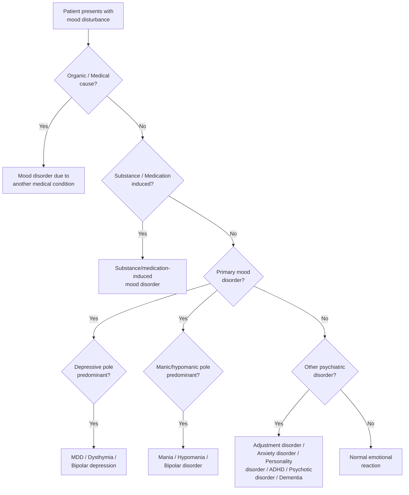
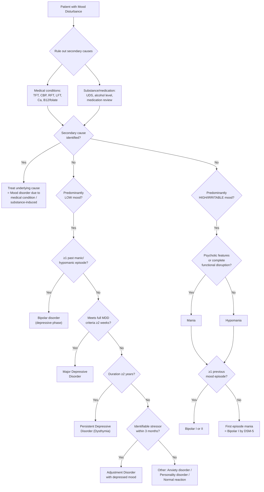

## Differential Diagnosis of Mood Disturbances

The differential diagnosis of mood disturbances is best approached by considering two separate but overlapping clinical presentations: **low mood** and **elated/irritable mood**. In practice, you encounter a patient and must work through a systematic list — "Is this a primary mood disorder, another psychiatric condition mimicking a mood disorder, a secondary (medical/substance) cause, or a normal reaction?" This section walks through that logic from first principles.

---

### Guiding Principle: The Diagnostic Hierarchy

Before diving into the lists, understand *why* we think in a hierarchy. Psychiatry has traditionally prioritised **organic (medical) causes first**, because they are the most dangerous to miss and the most treatable with specific interventions. Then we consider substance-induced causes (remove the substance, the "mood disorder" resolves). Only after excluding these do we land on primary psychiatric diagnoses.

---

### A. Differential Diagnosis of Low Mood

This is the approach when a patient presents with depressed mood, anhedonia, or anergia as the chief complaint [3].

#### 1. Primary Mood Disorders

| Diagnosis | Salient Differentiating Features |
|-----------|----------------------------------|
| **Major Depressive Disorder (MDD)** | Current depressive episode (meeting full criteria) lasting ≥ 2 weeks. Graded as mild, moderate, severe, or severe with psychotic features. If ≥ 1 previous episodes → *recurrent depressive disorder* [3] |
| **Bipolar Affective Disorder (depressive phase)** | Current depressive episode + ≥ 1 previous manic or hypomanic episode. Key: always ask about past elation/irritability! Clues to bipolar depression: younger onset, atypical features (hypersomnia, hyperphagia, leaden paralysis), psychotic features, family history of bipolar, poor antidepressant response [3][5] |
| **Dysthymia (Persistent Depressive Disorder)** | Current symptoms NOT meeting full depressive episode criteria, lasting ≥ 2 years. Insidious onset in early adulthood, persistent low mood without distinct episodes. May have superimposed depressive episodes ("double depression") — importantly, this does NOT rule out a concurrent MDD diagnosis [3] |
| **Cyclothymia** | Numerous minor depressive and mild elative mood episodes (neither meeting hypomanic nor depressive episode criteria), lasting ≥ 2 years. Think of it as a "low-grade" bipolar spectrum [3] |

<Callout title="Why Ask About Past Hypomania in Every Depressed Patient?" type="idea">
Approximately 10-20% of patients initially diagnosed with MDD are later reclassified as bipolar disorder. Hypomanic episodes are often missed because patients experience them as feeling "normal" or even "good" — they don't complain about feeling great! Always take collateral history and use screening tools like the Mood Disorder Questionnaire (MDQ) or Hypomania Checklist (HCL-32). Misdiagnosis leads to antidepressant monotherapy, which can trigger manic switch and accelerate cycling [3].
</Callout>

#### 2. Other Psychiatric Conditions Mimicking Depression

| Diagnosis | Why It Mimics Depression | How to Differentiate |
|-----------|------------------------|---------------------|
| ***Adjustment disorder with depressed mood*** [6] | Develops in response to an identifiable stressor; emotional or behavioural symptoms including low mood, tearfulness, hopelessness | Develops ≤ 3 months of the stressor; does not meet full criteria for MDD; symptoms are disproportionate to the stressor but resolve once the stressor (or its consequences) has terminated. The mood disturbance is clearly "disorder vs. normal reaction" but insufficient for a specific mood/anxiety disorder diagnosis [5] |
| ***Anxiety disorder*** [6] | Anxiety and depression frequently co-exist; patients with GAD can appear low in mood, fatigued, with poor concentration | In GAD, the core feature is *excessive worry about future events*; in depression, the patient ruminates on *past failures and worthlessness*. Look for: early morning wakening, diurnal variation, suicidal thoughts (uncommon in pure GAD). Note that GAD + depression can genuinely co-exist [5] |
| **Schizophrenia / Schizoaffective disorder** | Negative symptoms (avolition, flat affect, social withdrawal) can closely mimic depression | In schizophrenia, look for mood-incongruent psychotic symptoms persisting outside mood episodes; formal thought disorder (loosening of associations vs. psychomotor retardation); negative symptoms are typically more enduring and less episodic than depressive episodes [3] |
| **Personality disorders (e.g., Borderline PD)** | Chronic feelings of emptiness, mood instability, self-harm can mimic chronic depression | Mood shifts are rapid (hours to days, not weeks), often triggered by interpersonal events; identity disturbance, intense unstable relationships, fear of abandonment are present; pattern is enduring (not episodic) [5] |
| **Dementia** | Apathy, social withdrawal, cognitive decline can mimic depression. Conversely, depression in the elderly can present as "pseudodementia" | Depression: onset more well-defined with rapid decline, patients *complain* of poor memory (vs. dementia patients who lack insight and are brought by family), give less effort on cognitive testing; language and motor skills are slow but not structurally impaired. Always consider treating depression before concluding dementia [5] |
| **Grief / Bereavement** | Normal grief can include profound sadness, insomnia, poor appetite, weight loss | DSM-5 removed the "bereavement exclusion" — grief CAN co-exist with or trigger MDD. Normal grief: waves of sadness mixed with positive memories; self-esteem preserved; thoughts of death relate to "joining" the deceased. MDD: pervasive depressed mood; worthlessness, guilt not related to the deceased; suicidal ideation about own worthlessness [6] |

> ***Key DSM-5 change: Removal of the "bereavement exclusion" — depressive symptoms may be understandable/considered appropriate to significant loss (e.g., bereavement, financial ruin, losses from a natural disaster, a serious medical illness or disability). Exercise of clinical judgment based on the individual's history and cultural norms.*** [6]

#### 3. Secondary (Medical/Organic) Causes of Depression

This is the category you must **never miss**. The mechanism is either:
- **Direct physiological effect** on the brain (e.g., hypothyroidism → reduced monoamine synthesis; Cushing's → cortisol-mediated hippocampal damage)
- **Non-specific stressor** (e.g., chronic pain, cancer diagnosis → psychological burden leads to depression)

***Depression can be associated with medical conditions:*** [6]

| Category | Examples and Mechanisms |
|----------|----------------------|
| ***Neurological disorders*** | ***Epilepsy*** (interictal depression due to limbic dysfunction), ***Parkinson's disease*** (dopaminergic degeneration in mesolimbic pathway → anhedonia, amotivation), ***dementia*** (structural degeneration of mood-regulating circuits), ***multiple sclerosis*** (inflammatory demyelination disrupting prefrontal-limbic connections), ***Huntington disease*** (caudate atrophy → frontal-subcortical circuit disruption), ***cerebrovascular disease*** (especially left frontal strokes → disruption of monoaminergic pathways), ***migraine*** (shared serotonergic dysfunction) [6] |
| ***Endocrine disorders*** | ***Hypothyroidism*** (thyroid hormones potentiate monoamine activity; low T3/T4 → functional monoamine deficiency), ***hyperthyroidism*** (can paradoxically cause depression especially in elderly — "apathetic thyrotoxicosis"), ***Cushing's syndrome*** (chronic hypercortisolism → hippocampal atrophy → depression), ***Addison disease*** (cortisol deficiency → fatigue, low mood), ***prolactinomas*** (hyperprolactinaemia → dopamine suppression → anhedonia), ***hyperparathyroidism*** (hypercalcaemia → neurotoxicity → depression) [6] |
| ***Drug-related conditions*** | ***Antihypertensive medications esp. reserpine and methyldopa*** (reserpine depletes monoamines — this was the original observation supporting the monoamine hypothesis!), ***smoking-cessation aids, steroids, sex hormones and medications that affect sex hormones, H2 blockers, sedatives, muscle relaxants, appetite suppressants, chemotherapy agents*** [6] |
| ***Substance abuse*** | ***Alcohol / cocaine / amphetamines / cannabinoids / sedatives / hypnotics / narcotics abuse*** — both intoxication (especially depressants) and withdrawal (especially stimulants) can cause depressive syndromes [6] |
| ***Infectious disease*** | ***Mononucleosis*** (post-viral fatigue), ***HIV infection*** (direct CNS invasion + psychosocial burden), ***hepatitis C infection*** (neuroinflammation + interferon treatment), ***Lyme disease, syphilis*** (neurosyphilis affects frontal lobes) [6] |
| ***Neoplasias*** | ***Pancreatic cancer*** (classically associated with depression — possibly via paraneoplastic mechanisms or cytokine release even before cancer diagnosis), paraneoplastic syndromes [6] |
| ***Chronic diseases*** | ***Coronary artery disease, type II diabetes*** (shared inflammatory pathways, HPA axis dysregulation, reduced physical activity) [6] |
| ***Chronic pain and psychosomatic conditions*** | Chronic pain → sustained activation of stress response → HPA axis dysregulation → depression (and depression lowers pain threshold → vicious cycle) [6] |
| ***Sleep-related disorders*** | ***Obstructive sleep apnoea*** — chronic sleep fragmentation → daytime fatigue, cognitive impairment, low mood; hypoxia may directly affect mood-regulating centres [6] |

<Callout title="Must-Know Secondary Causes for Exams" type="error">
In any patient presenting with depression, you MUST rule out: (1) Hypothyroidism — the single most important medical mimic (check TFT in everyone); (2) Substance use — especially alcohol; (3) Medication side effects — especially beta-blockers, steroids, reserpine; (4) Cushing's syndrome — especially if atypical features; (5) Organic brain disease — especially in new-onset depression in the elderly. The basic workup for every depressed patient includes: CBP, R/LFT, TFT. Add further investigations as indicated by history and examination.
</Callout>

**Investigations to rule out secondary causes** [3][4]:

| Investigation | What It Rules Out |
|--------------|-------------------|
| **CBP** | Anaemia (fatigue mimics), ↑WCC (infection), ↑MCV (alcoholism/B12 deficiency) |
| **Renal function tests** | HypoNa (antidepressant side effect, SIADH), uraemia, Ca (hypercalcaemia → depression) |
| **Liver function tests** | GGT (alcoholic liver disease), hepatic encephalopathy |
| ***Thyroid function test*** | ***Hypothyroidism (secondary depression)*** — the single most important screening test |
| **Vitamin B12 and folate** | Nutritional deficiency (especially in elderly, alcoholism) |
| **Urine drug screen** | Substance-induced depression |
| **Blood alcohol level** | Alcohol-related depression |
| ***HIV test*** | ***HIV-associated depression*** |
| ***Cosyntropin (ACTH) stimulation test*** | ***Addison disease*** |
| **ECG** | Long QT (baseline before TCA or lithium) |
| ***EEG*** | ***Epilepsy*** |
| ***CT or MRI brain*** | ***Organic brain syndrome, hypopituitarism*** — especially in elderly, new-onset, or atypical presentations |

---

### B. Differential Diagnosis of Elated or Irritable Mood

***The differential diagnosis of a manic episode includes:*** [7]

#### 1. Primary Mood Disorders

| Diagnosis | Salient Differentiating Features |
|-----------|----------------------------------|
| **Mania / Hypomania** | Episode of elated/irritable mood associated with ↑energy and activity with considerable interference with work and social activities. Further classified by: *level of psychosocial impairment* (considerable = hypomania; complete disruption = mania) and *presence of psychotic symptoms* (present = mania). Bipolar affective disorder if ≥ 1 previous mood episode [3] |
| ***Depressive disorder with irritability and anxious distress*** [7] | Recurrent depression with prominent irritability can be mistaken for bipolar. Key: hypomanic episodes can be missed or under-reported → should be actively elicited. Discerning features of bipolar depression: psychotic features, atypical features (hypersomnia, hyperphagia, leaden paralysis) [5] |

#### 2. Other Psychiatric Conditions

| Diagnosis | Why It Mimics Mania | How to Differentiate |
|-----------|---------------------|---------------------|
| ***Psychotic disorder or schizoaffective disorder*** [7] | Schizophrenia can present with excited, suspicious, or agitated mood (mimics mania with psychosis). Schizoaffective disorder has simultaneous mood and schizophrenic symptoms | **Schizophrenia**: psychotic symptoms NOT limited to periods of prominent mood disturbance; FTD more loosening of association, neologism, thought blocking (cf mania: circumstantiality, tangentiality, flight of ideas); delusions mood-incongruent, bizarre, with passivity/thought alienation; speech more hesitant/halting (mania: pressured, difficult to interrupt); less ↓need for sleep, less hyperactive; may have catatonia or negative symptoms. **Schizoaffective**: delusions/hallucinations less mood-congruent and may occur outside mood episodes [3][5] |
| ***Attention deficit and hyperactivity disorder (ADHD)*** [7] | Similarities: ↓attention, difficulty with task completion, ↑energy, disinhibited behaviour, talkativeness | ADHD should NOT have ↑self-esteem, grandiosity, flight of ideas, or ↓need for sleep. ADHD has a more chronic, trait-like course (present since childhood) rather than episodic onset. Symptoms are pervasive across settings in ADHD but mood-episode-limited in bipolar [5][3] |
| ***Personality disorder with prominent irritability*** [7] | Borderline PD is often associated with marked affective instability → mimics rapid-cycling bipolar. Impulsivity, temper outbursts, mood lability overlap with hypomania | BPD: no family history of bipolar; rapid shifts of mood over hours/days (not days-to-weeks as in bipolar episodes); no classic manic symptoms (↑energy, grandiosity, flight of ideas, ↓need for sleep); mood disturbances often triggered by interpersonal issues; more stable/enduring pattern vs. episodic [5][3] |

> ***The bipolar spectrum: BP I has severe mood episodes; BP II has milder manic symptoms with a prominent depressive element and can have the same degree of long-term impairment as BP I; BP spectrum patients are bothered by frequent mood changes and can be mistaken as borderline personality disorder.*** [7]

#### 3. Secondary (Medical/Substance) Causes of Mania

| Category | Examples and Mechanisms |
|----------|----------------------|
| **Organic brain lesion** | Extreme social disinhibition with no gross mood disorder → think **frontal lobe pathology**. Consider especially in middle-aged or older patient with expansive behaviour but no past history of affective disorder. In younger patients, consider **HIV infection** and **head injury** [5] |
| ***Substance/medication-induced*** [7] | **Intoxication**: stimulants (amphetamines, cocaine, caffeine), corticosteroids, L-DOPA, antidepressants (especially in unrecognised bipolar → manic switch). **Withdrawal**: alcohol, sedatives. Should ↓ after admission/cessation; consider urine toxicology screen if appropriate [5] |
| ***Medical conditions*** [7] | Hyperthyroidism (thyroid hormones potentiate catecholamines → hyperarousal), Cushing's syndrome, systemic lupus erythematosus (CNS vasculitis), neurosyphilis, multiple sclerosis, temporal lobe epilepsy |

<Callout title="Schizophrenia vs. Mania — The Hardest DDx in Psychiatry" type="error">
This is the single most difficult differential in acute psychiatry. Both can present with psychomotor agitation, grandiose delusions, and disordered speech. The key differentiators: (1) In mania, psychotic symptoms are mood-congruent and usually resolve with the mood episode; (2) In schizophrenia, psychosis persists independent of mood state; (3) In mania, the logical link in speech is preserved despite being rapid (flight of ideas); in schizophrenia, associations are truly loosened (loosening of associations); (4) Biological features differ — mania has genuinely decreased need for sleep (feeling rested after 2-3 hours), while schizophrenia rarely shows this pattern. When in doubt, longitudinal course is the ultimate discriminator.
</Callout>

---

### C. Specifiers — Further Refining the Differential

Once you've identified a mood disorder, specifiers help characterise it further and guide treatment. ***Mood disorders are heterogeneous conditions. Specifiers are used to better understand the patient's characteristics and to select appropriate treatment:*** [7]

| Specifier | Key Feature | Clinical Relevance |
|-----------|-------------|-------------------|
| ***With anxious distress*** | Prominent anxiety symptoms during mood episode | Higher suicide risk, poorer treatment response |
| ***With mixed features*** | Depressive symptoms during mania, or manic symptoms during depression | Particularly high suicide risk (despair + energy); may need mood stabiliser rather than antidepressant |
| ***With rapid cycling*** | ***> 4 episodes per year*** | Poorer prognosis, often treatment-resistant, lithium may be less effective |
| ***With melancholic features*** | ***Near-complete absence of the capacity for pleasure***; early morning wakening, morning dysphoria, psychomotor changes, weight loss | More neurobiological basis, stronger family history, better response to TCAs/ECT than SSRIs [3] |
| ***With atypical features*** | ***Mood reactivity, weight gain, hypersomnia*** (also leaden paralysis, interpersonal rejection sensitivity) | Better response to MAOIs; think bipolar depression if atypical features are prominent |
| ***With psychotic features*** | Delusions and/or hallucinations | Must distinguish mood-congruent vs. mood-incongruent (mood-incongruent → worse prognosis, consider schizoaffective) |
| ***With peripartum onset*** | Onset during pregnancy or within 4 weeks postpartum | ***Severe anxiety and even panic attacks. Risk of infanticide*** — always assess safety of mother and baby [7] |
| ***With seasonal pattern*** | ***Depression begins in fall or winter and remits in spring*** | Consider bright light therapy; related to daylight duration [7] |

---

### D. Summary Algorithm — Putting It All Together

---

### E. Key DSM-5 Classification Reminder

***DSM-5 classification of mood disorders:*** [7]

| Bipolar and Related Disorders | Depressive Disorders |
|------------------------------|---------------------|
| ***Bipolar I disorder*** | ***Major depressive disorder (single episode / recurrent)*** |
| ***Bipolar II disorder*** | ***Dysthymic disorder (persistent depressive disorder)*** |
| ***Cyclothymic disorder*** | ***Other depressive disorder*** |
| ***Other bipolar disorder*** | |

***Key DSM-5 changes from DSM-IV:*** [6]
- ***Dysthymia → Persistent depressive disorder*** (now includes both chronic MDD and previous dysthymic disorder)
- ***Introduction of disruptive mood dysregulation disorder***: persistent irritability and frequent episodes of extreme, out-of-control behaviour in children up to age 18
- ***Introduction of premenstrual dysphoric disorder***: mood symptoms during the final week before menses onset, improving within a few days of menses

<Callout title="High Yield DDx Summary">

**For Low Mood — Always consider:**
1. Secondary causes FIRST (hypothyroidism, medications, substance use, medical illness)
2. Bipolar depression (ask about past hypomania — missed in 10-20% of cases)
3. MDD vs. dysthymia vs. adjustment disorder (severity + duration + stressor)
4. Pseudodementia vs. true dementia (especially in elderly)
5. Anxiety disorder with secondary low mood
6. Personality disorder (BPD — chronic emptiness, rapid mood shifts)

**For Elated/Irritable Mood — Always consider:**
1. Secondary causes (substance intoxication, medications, medical — especially frontal lobe lesions, hyperthyroidism)
2. Mania vs. hypomania (severity, psychotic features, functional impairment)
3. Schizophrenia / schizoaffective disorder (most difficult DDx — check mood congruence of psychosis, longitudinal course)
4. ADHD (trait-like, no grandiosity/↓need for sleep)
5. Borderline PD (rapid mood shifts, interpersonal triggers, no classic manic features)

**Red Flags for Bipolar in a "Depressed" Patient:**
- Age of onset < 25
- Atypical depressive features (hypersomnia, hyperphagia)
- Psychotic features during depression
- Family history of bipolar disorder
- Multiple failed antidepressant trials or manic switch on antidepressants
- Postpartum onset

</Callout>

---

<ActiveRecallQuiz
  title="Active Recall - DDx of Mood Disturbances"
  items={[
    {
      question: "A 22-year-old presents with a depressive episode featuring hypersomnia, weight gain, and leaden paralysis. Her mother has bipolar disorder. What diagnosis should you strongly consider, and why?",
      markscheme: "Bipolar depression (depressive phase of bipolar disorder). Clues: young age of onset (< 25), atypical depressive features (hypersomnia, weight gain, leaden paralysis), and positive family history of bipolar disorder. Must actively screen for past hypomanic episodes with collateral history and screening tools (MDQ, HCL-32). Misdiagnosis as unipolar MDD risks manic switch with antidepressant monotherapy."
    },
    {
      question: "What are the key clinical features that distinguish mania with psychotic features from schizophrenia?",
      markscheme: "In mania: psychotic symptoms are mood-congruent and resolve with mood episode; speech shows flight of ideas with preserved logical links; pressured speech difficult to interrupt; genuinely decreased need for sleep (feels rested after 2-3 hours); prominent hyperactivity and grandiosity. In schizophrenia: psychosis persists outside mood episodes; mood-incongruent or bizarre delusions with passivity/thought alienation; loosening of associations, neologism, thought blocking; speech more hesitant/halting; may have catatonia or negative symptoms; no true decreased need for sleep."
    },
    {
      question: "Name five medical conditions that can directly cause depressive symptoms and briefly explain the mechanism for two of them.",
      markscheme: "Examples: hypothyroidism, Cushing syndrome, Parkinson disease, pancreatic cancer, Addison disease, cerebrovascular disease, obstructive sleep apnoea, hyperparathyroidism, epilepsy, HIV. Mechanisms (any two): Hypothyroidism — thyroid hormones potentiate monoamine activity, so low T3/T4 leads to functional monoamine deficiency. Cushing syndrome — chronic hypercortisolism causes hippocampal atrophy via glucocorticoid neurotoxicity, disrupting HPA axis negative feedback and mood regulation."
    },
    {
      question: "How do you differentiate borderline personality disorder from rapid-cycling bipolar disorder?",
      markscheme: "BPD: no family history of bipolar; mood shifts are rapid (hours to days) and often triggered by interpersonal events; no classic manic symptoms (increased energy, grandiosity, flight of ideas, decreased need for sleep); pattern is enduring/trait-like, not episodic. Bipolar rapid cycling: episodes last days to weeks; classic manic/hypomanic features present; family history of bipolar often positive; episodes not necessarily linked to interpersonal triggers; defined as > 4 mood episodes per year."
    },
    {
      question: "A 70-year-old presents with memory complaints and social withdrawal. How do you distinguish depressive pseudodementia from true dementia?",
      markscheme: "Pseudodementia (depression): more well-defined onset with rapid decline; patient complains and worries about memory (insight preserved); tends to present themselves (vs. brought by family); gives less effort ('I don't know' responses) on cognitive testing; language and motor skills slow but not structurally impaired; other depressive features present (morning dysphoria, psychomotor retardation, guilt, suicidal ideation). True dementia: insidious onset; poor insight; family brings patient; tries hard on testing but gives incorrect answers; progressive language/praxis/visuospatial deficits; usually precipitated by acute illness if delirium superimposed."
    },
    {
      question: "What three new changes were introduced in DSM-5 regarding the classification of depressive disorders compared to DSM-IV?",
      markscheme: "1. Removal of the bereavement exclusion — MDD can now be diagnosed even in context of bereavement, using clinical judgment. 2. Dysthymia renamed to Persistent Depressive Disorder, which now includes both chronic MDD and previous dysthymic disorder. 3. Two new disorders introduced: Disruptive Mood Dysregulation Disorder (persistent irritability with extreme behavioural episodes in children up to age 18) and Premenstrual Dysphoric Disorder (mood symptoms in final week before menses, improving within a few days of menses)."
    }
  ]}
/>

## References

[3] Senior notes: ryanho-psych.md (sections 7.1.1, 7.1.2, 7.2, Bipolar Disorder differential diagnosis)
[4] Lecture slides: GC 164. I am depressed Mood disorders.pdf (p. 13)
[5] Senior notes: ryanho-psych.md (sections 6.1, 8.1.1, ADHD differential, dementia differential)
[6] Lecture slides: GC 164. I am depressed Mood disorders.pdf (pp. 9, 14, 15)
[7] Lecture slides: GC 163. I am a superman Bipolar disorder.pdf (pp. 2, 3, 10, 17, 22)
