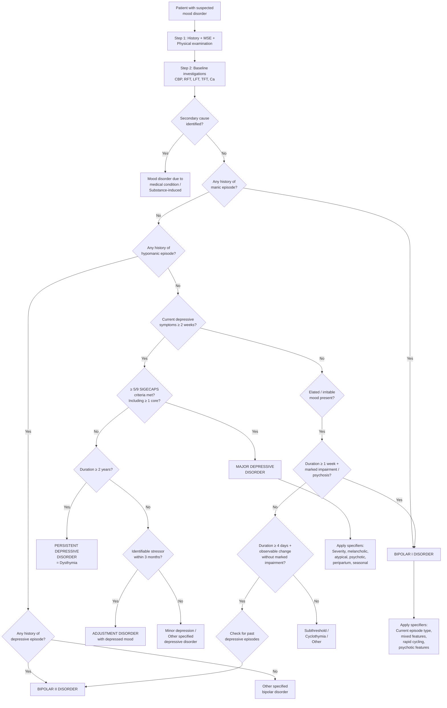

## Diagnostic Criteria

Understanding diagnostic criteria from first principles: psychiatric diagnoses are **clinical diagnoses** — there is no blood test or scan that "confirms" depression or mania. Instead, we rely on carefully defined symptom clusters, minimum durations, functional impairment thresholds, and exclusion criteria. The two major classification systems are the **DSM-5-TR** (American Psychiatric Association) and the **ICD-11** (WHO). Both share a similar logic but differ in specific thresholds.

The general skeleton of any psychiatric diagnostic criterion is [3]:
1. **Core (discriminating) symptoms** — present in the defined disorder but seldom in others
2. **Associated (characteristic) symptoms** — frequent in the defined disorder but also seen in others
3. **Minimum duration** of symptoms
4. **Distress or impairment** in functioning
5. **Exclusion criteria** — rule out secondary causes and other primary disorders

---

### A. Major Depressive Disorder — DSM-5 Criteria

This is the bread-and-butter diagnosis. Learn it cold.

***At least 2 weeks' duration.*** [6]

***Clear-cut changes in affect, cognition, and neurovegetative functions.*** [6]

***5 or more of the following symptoms are present; at least 1 of the symptoms is either (1) or (2):*** [6]

| # | Symptom | Pathophysiological Basis |
|---|---------|------------------------|
| ***(1)*** | ***Depressed mood most of the day, nearly every day, as indicated by either subjective report (e.g., feels sad, empty, hopeless) or observation made by others (e.g., appears tearful). In children and adolescents, can be irritable mood*** [6] | Serotonergic and noradrenergic hypofunction in prefrontal-limbic circuits → sustained negative emotional bias |
| ***(2)*** | ***Markedly diminished interest or pleasure in all, or almost all, activities most of the day, nearly every day (as indicated by either subjective account or observation)*** [6] | Reduced dopaminergic signalling in the mesolimbic reward pathway (nucleus accumbens) → inability to experience reward (anhedonia) |
| ***(3)*** | ***Significant weight loss when not dieting or weight gain (e.g., a change of more than 5% of body weight in a month), or decrease or increase in appetite nearly every day. In children, consider failure to make expected weight gain*** [6] | Serotonin modulates hypothalamic appetite centres; 5-HT dysregulation alters feeding behaviour in either direction |
| ***(4)*** | ***Insomnia or hypersomnia nearly every day*** [6] | Disruption of sleep-wake regulation via serotonergic (raphe nuclei) and noradrenergic (locus coeruleus) systems in the reticular activating system |
| ***(5)*** | ***Psychomotor agitation or retardation nearly every day (observable by others, not merely subjective feelings of restlessness or being slowed down)*** [6] | Retardation: dorsolateral PFC and basal ganglia hypofunction; Agitation: amygdala/ACC hyperactivation |
| ***(6)*** | ***Fatigue or loss of energy nearly every day*** [6] | Noradrenergic and dopaminergic hypofunction → reduced drive and motivation |
| ***(7)*** | ***Feelings of worthlessness or excessive or inappropriate guilt (which may be delusional) nearly every day (not merely self-reproach or guilt about being sick)*** [6] | Cognitive distortions (personalisation, overgeneralisation) amplified by ventromedial PFC hyperactivity |
| ***(8)*** | ***Diminished ability to think or concentrate, or indecisiveness, nearly every day (either by subjective account or as observed by others)*** [6] | Dorsolateral PFC hypofunction → executive dysfunction |
| ***(9)*** | ***Recurrent thoughts of death (not just fear of dying), recurrent suicidal ideation without a specific plan, or a suicide attempt or a specific plan for committing suicide*** [6] | Serotonergic deficiency in prefrontal cortex → impaired impulse control; hopelessness from cognitive triad |

**Additional DSM-5 criteria:** [6]
- ***Symptoms cause clinically significant distress or impairment in social, occupational, or other important areas of functioning***
- ***The episode is not attributable to the physiological effects of a substance or to another medical condition***
- ***Not better explained by schizoaffective disorder, schizophrenia, schizophreniform disorder, delusional disorder, or other specified and unspecified schizophrenia spectrum and other psychotic disorders***
- ***Absence of previous manic or a hypomanic episode*** (if present → bipolar disorder, not MDD)

<Callout title="The SIGECAPS Mnemonic for Depression">
A widely used mnemonic for the 9 DSM-5 criteria:

**S** — Sleep disturbance (insomnia or hypersomnia)
**I** — Interest loss (anhedonia) ← CORE
**G** — Guilt (or worthlessness)
**E** — Energy loss (fatigue)
**C** — Concentration deficit
**A** — Appetite change (± weight)
**P** — Psychomotor agitation or retardation
**S** — Suicidal ideation

Plus the anchor: **Depressed mood** ← CORE

You need ≥ 5 of these 9 symptoms, and at least one must be depressed mood OR anhedonia.
</Callout>

#### DSM-5 Specifiers for MDD

***Specifiers for major depressive disorder:*** [6]

| Category | Options |
|----------|---------|
| ***Course*** | ***Single episode, recurrent episode*** |
| ***Severity*** | ***Mild, moderate, severe, with psychotic features, in partial remission, in full remission, unspecified*** |
| ***Other specifiers*** | ***With anxious distress, mixed features, melancholic features, atypical features, mood-congruent psychotic features, mood-incongruent psychotic features, catatonia, peripartum onset, seasonal pattern (recurrent episode only)*** |

***Key changes from DSM-IV:*** [6]
- ***Removal of the "bereavement exclusion"*** — depressive symptoms may be considered appropriate to significant loss, but clinical judgment is exercised
- ***Dysthymia → persistent depressive disorder*** (now includes both chronic MDD and previous dysthymic disorder)
- ***Introduction of disruptive mood dysregulation disorder*** and ***premenstrual dysphoric disorder***

---

### B. Depressive Episode — ICD-10/ICD-11 Criteria

The ICD system uses a slightly different structure, splitting symptoms into **Group A** (core) and **Group B** (associated), with severity determined by how many from each group are met [3].

***ICD-11 cardinal symptoms: depressed mood or diminished interest in activities occurring most of the day, nearly every day during a period lasting at least two weeks.*** [4]

***Additional symptoms: difficulty concentrating, feelings of worthlessness or excessive or inappropriate guilt, hopelessness, recurrent thoughts of death or suicide, changes in appetite or sleep, psychomotor agitation or retardation, and reduced energy or fatigue.*** [4]

**ICD-10 severity grading** (still commonly used in Hong Kong clinical practice) [3]:

| Group A (Core) | Group B (Associated) |
|----------------|---------------------|
| Depressed mood | Reduced concentration |
| Loss of interest and enjoyment | Reduced self-esteem and confidence |
| Reduced energy and decreased activity | Ideas of guilt and unworthiness |
| | Pessimistic thoughts |
| | Ideas of self-harm |
| | Disturbed sleep |
| | Diminished appetite |

| Severity | Group A | Group B | Functional Impairment |
|----------|---------|---------|----------------------|
| **Mild** | At least 2 of 3 | At least 2 | Some difficulty in continuing work/social activities |
| **Moderate** | At least 2 of 3 | At least 3 | Considerable difficulty continuing activities |
| **Severe** | All 3 | At least 4 | Unable to continue activities; may have psychotic features |

#### Somatic / Melancholic Features Specifier

The ICD-10 "with somatic features" and DSM-5 "with melancholic features" identify a biologically-driven subtype [3]:

Clinical features required (≥ 4 of the following):
- Loss of interest or pleasure in usual activities
- Lack of emotional reactivity to normally pleasurable surroundings and events
- Early-morning waking (2 hours or more before usual time)
- Depression worse in the morning
- Psychomotor agitation or retardation
- Marked loss of appetite
- Weight loss (5% or more of body weight in last month)
- Marked loss of libido (ICD-10 only)
- Distinct quality of depressed mood (DSM-5 only)
- Excessive guilt (DSM-5 only)

DSM-5 specifically requires either "loss of interest" or "lack of emotional reactivity" to be present [3].

**Why does this specifier matter clinically?** Melancholic depression is associated with [3]:
- ↑Neurobiological abnormalities + ↑family history
- ↑Severity of symptomatology
- ↓Response to placebo and ↑response to TCA than SSRI

#### Atypical Depression Features

Characterised by [3]:
- Variable depressed mood with **often preserved mood reactivity** to positive events
- **Overeating and oversleeping**
- Extreme fatigue and **leaden paralysis** (heaviness in limbs)
- Pronounced anxiety
- Classically associated with **rejection sensitivity**
- Significance: usually poorer response to TCA but better response to MAOI

<Callout title="Melancholic vs. Atypical Depression" type="idea">
Think of these as two ends of a spectrum. Melancholic = the "classic biological" depression (worse in morning, early wakening, weight loss, psychomotor retardation, loss of reactivity). Atypical = the "reverse vegetative" pattern (mood reactivity preserved, hypersomnia, weight gain, leaden paralysis). Atypical features should raise suspicion for bipolar depression.
</Callout>

---

### C. Manic Episode — DSM-5 Criteria

***DSM-5 criteria for manic episode:*** [7]

***A distinct period of elevated, expansive or irritable mood and increased goal-directed activity lasting at least 1 week.*** [7]

***Three or more*** (4 if mood is only irritable) of the following: [7]

| Symptom | Mnemonic Letter | Pathophysiological Basis |
|---------|----------------|------------------------|
| ***Inflated self-esteem or grandiosity*** | **G** | Excessive dopamine in reward circuits → overvaluation of self |
| ***Decreased need for sleep*** | **S** | Overactivation of reticular activating system; circadian disruption |
| ***Pressured speech*** | **T** | Racing thoughts translated into irrepressible speech output |
| ***Flight of ideas / racing thoughts*** | **F** | Dopaminergic hyperactivity → accelerated associative processing |
| ***Distractibility*** | **D** | Impaired prefrontal top-down attentional control |
| ***Increased goal-directed activity (either socially, at work or school or sexually) / psychomotor agitation*** | **A** | Mesolimbic dopaminergic overactivity → excessive motivation and drive |
| ***Excessive pleasurable activities (buying sprees, sexual indiscretions, or foolish business investments)*** | **I** | Reward pathway hyperactivation + impaired prefrontal judgment |

<Callout title="DIG FAST Mnemonic for Mania">
**D** — Distractibility
**I** — Irresponsibility / Indiscretions (excessive pleasurable activities)
**G** — Grandiosity

**F** — Flight of ideas
**A** — Activity increase (goal-directed or psychomotor agitation)
**S** — Sleep decreased (need for)
**T** — Talkativeness (pressured speech)

You need ≥ 3 of these (or ≥ 4 if mood is only irritable).
</Callout>

**Additional criteria:** [7]
- ***Marked impairment in functioning, observable by others, to necessitate hospitalization, or there are psychotic symptoms***
- ***Not due to alcohol, substance, or medical conditions***

---

### D. Hypomanic Episode — DSM-5 Criteria

***DSM-5 criteria for hypomanic episode:*** [7]

- ***At least 4 days of elevated, expansive, or irritable mood and increased activity or energy***
- ***3 or more of manic symptoms*** (same DIG FAST list)
- ***Change in functioning observable by others but not severe enough to cause marked impairment, to necessitate hospitalization, and there are no psychotic symptoms***

The key differences from mania:

| Feature | Mania | Hypomania |
|---------|-------|-----------|
| Duration | ≥ 1 week | ≥ 4 days |
| Functional impairment | Marked / hospitalisation required | Observable change but NOT marked impairment |
| Psychotic features | May be present | **Never present** |

***Often missed by patients and doctors resulted in delayed diagnosis.*** [7] Why? Because hypomania often feels *good* — the patient is more productive, sociable, and creative. They don't present complaining about feeling great. This is why collateral history from family/friends is essential.

---

### E. Bipolar I Disorder — DSM-5 Criteria

***DSM-5 criteria for bipolar I disorder:*** [7]

- ***Most cases have both manic and depressive episodes***
- ***There is a predominant polarity; more manic or more depressive episodes***
- ***Presence of one single manic episode already satisfies criteria for bipolar I disorder*** (this occurs in only 5%) [7]

This is a critical conceptual point: **you do NOT need a depressive episode to diagnose Bipolar I**. A single manic episode is sufficient. The logic: mania is such a specific and dramatic clinical phenomenon that its occurrence essentially defines the disorder.

---

### F. Bipolar II Disorder — DSM-5 Criteria

***DSM-5 criteria of bipolar II disorder:*** [7]

- ***At least one hypomanic episode***
- ***At least one previous depressive episode***
- ***Never has a manic or mixed episode***
- ***Depressive episodes are more common in bipolar II disorder*** [7]

If a patient with Bipolar II ever has a full manic episode, the diagnosis is reclassified to Bipolar I.

---

### G. Other Key Diagnostic Entities

| Entity | Core Criteria |
|--------|--------------|
| **Persistent Depressive Disorder (Dysthymia)** | Depressive symptoms NOT meeting full MDD criteria for ≥ 2 years; onset usually early adulthood; may have "double depression" (superimposed MDD episodes) [3] |
| **Cyclothymic Disorder** | Numerous minor depressive and mild elative episodes (neither meeting hypomanic nor depressive episode criteria) for ≥ 2 years; symptom-free periods < 2 consecutive months [3][5] |
| **Adjustment Disorder with Depressed Mood** | Emotional/behavioural symptoms developing ≤ 3 months of an identifiable stressor; does not meet full MDD criteria; resolves within 6 months of stressor termination [3] |

---

## Diagnostic Algorithm

The following flowchart represents the clinical thinking process when you encounter a patient with mood disturbance. The key decision points are: (1) exclude secondary causes, (2) determine polarity, (3) determine severity and duration, (4) apply specifiers.

---

## Investigation Modalities

Investigations in mood disorders serve **four purposes** [3][6]:
1. **Rule out secondary (organic) causes** — the primary reason
2. **Establish baseline** before starting pharmacotherapy
3. **Guide prescribing** (e.g., renal function for lithium dosing)
4. **Screen for self-neglect** (e.g., malnutrition in severe depression)

### A. Mandatory Baseline Investigations

These should be ordered for **every patient** presenting with a mood disturbance:

| Investigation | What You're Looking For | Interpretation / Rationale |
|--------------|------------------------|---------------------------|
| **CBP (Complete Blood Picture)** | ↓Hb → anaemia (fatigue mimics depression); ↑WCC → occult infection; ↑MCV → macrocytosis from alcoholism or B12/folate deficiency [3] | Anaemia causes fatigue and low energy indistinguishable from depression. Macrocytosis without anaemia may be the only clue to heavy alcohol use. |
| **RFT (Renal Function Tests)** | HypoNa → SIADH (antidepressant S/E, especially SSRIs in elderly); U/Cr → baseline for lithium dosing; **Ca** → hypercalcaemia from hyperparathyroidism causes depression [3] | SSRIs cause SIADH in ~10% of elderly patients → always check baseline Na. Hypercalcaemia classically causes "bones, stones, groans, and psychiatric moans." |
| **LFT (Liver Function Tests)** | ↑GGT → alcoholic liver disease; baseline for hepatotoxic drugs [3] | GGT is the most sensitive marker for chronic alcohol use. Many psychotropic drugs are hepatically metabolised. |
| ***TFT (Thyroid Function Tests)*** | ***Hypothyroidism → secondary depression*** [3][6] | This is the **single most important screening test** in any depressed patient. Thyroid hormones potentiate monoamine activity; low T3/T4 → functional monoamine deficiency → depression. Even subclinical hypothyroidism can worsen treatment response. |

***Basic investigations: CBP, R/LFT, thyroid function test.*** [4]

### B. Targeted Investigations (As Clinically Indicated)

***Others: blood alcohol level, blood and urine toxicology screen, HIV test, cosyntropin (ACTH) stimulation test (for Addison disease), EEG (for epilepsy) or CT or MRI (for organic brain syndrome or hypopituitarism) should be considered if indicated by history taking and physical examination.*** [4]

| Investigation | When to Order | What You're Looking For | Interpretation |
|--------------|---------------|------------------------|----------------|
| **CRP / ESR** | Suspected infection or inflammatory disease | Elevated inflammatory markers | Chronic inflammation (e.g., SLE, RA) is associated with depression via cytokine-mediated neuroinflammation |
| **Vitamin B12 and Folate** | Elderly, suspected nutritional deficiency, macrocytosis, alcoholism [3] | Low B12 or folate | B12 deficiency → impaired methylation → reduced monoamine synthesis → depression and cognitive impairment. Folate deficiency also reduces antidepressant efficacy |
| ***Urine drug screen*** | Suspected substance use, atypical presentation, young patient [3] | Amphetamines, opioids, cannabinoids, benzodiazepines, cocaine | Substance-induced depression resolves with cessation; substance-induced mania (stimulants) should settle after admission |
| ***Blood alcohol level*** | Suspected alcohol misuse [4] | Elevated alcohol level | Alcohol is a CNS depressant; chronic use depletes monoamines; withdrawal can cause both depression and mania-like agitation |
| ***HIV test*** | Risk factors present, young patient with new-onset mania [4] | HIV seropositivity | HIV can cause depression via direct CNS infection (HIV-associated neurocognitive disorder) and psychosocial burden; mania can be first presentation of HIV encephalopathy |
| ***Cosyntropin (ACTH) stimulation test*** | Suspected Addison disease (fatigue, hypotension, hyperpigmentation, hypoNa, hyperK) [4] | Inadequate cortisol response to synthetic ACTH | Addison disease → cortisol deficiency → fatigue, weakness, mood changes; also important because glucocorticoid replacement may resolve "depression" entirely |
| ***ECG*** | Before starting TCA or lithium; cardiac history [3] | QT prolongation, arrhythmias | TCAs and lithium prolong QTc and may trigger arrhythmias. Baseline ECG is essential for medicolegal safety. Lithium also causes T-wave flattening/inversion |
| ***EEG*** | Suspected epilepsy (especially temporal lobe epilepsy) or other neurological indications [3][4] | Epileptiform activity | Temporal lobe epilepsy can present with ictal depression, ictal fear, or interictal mood disturbance. Post-ictal depression is common |
| ***CT or MRI brain*** | New-onset depression in elderly, atypical features, focal neurological signs, cognitive deficits [3][4] | Structural lesions: tumours, cerebrovascular disease, frontal lobe pathology, normal pressure hydrocephalus | Frontal lobe tumours classically cause personality change and disinhibition (mimics mania); left frontal strokes are associated with depression; white matter hyperintensities suggest vascular depression |
| **Glucose** | Suspected diabetes, metabolic syndrome, or for baseline before atypical antipsychotics | Hyperglycaemia or hypoglycaemia | Episodic hypoglycaemia can mimic panic/anxiety; chronic diabetes is associated with depression; atypical antipsychotics cause metabolic syndrome |
| **Syphilis serology (VDRL/RPR)** | Risk factors, elderly with cognitive change | Positive serology | Neurosyphilis (tertiary) can cause depression, mania, psychosis, and dementia — the "great imitator" |

### C. Standardised Rating Scales

These are crucial for **quantifying severity**, **tracking treatment response**, and **research** — but they are explicitly ***useful in clinical practice and research but not diagnostic. Should not be used as a substitute for a clinical diagnosis made from a thorough interview.*** [6]

| Scale | Type | Details | When to Use |
|-------|------|---------|-------------|
| ***Hamilton Rating Scale for Depression (HAM-D)*** | Clinician-rated, 17-21 items | Gold standard for research; assesses somatic and cognitive symptoms | Research, clinical trials, tracking response |
| ***Montgomery-Åsberg Depression Rating Scale (MADRS)*** | Clinician-rated, 10 items | More sensitive to change than HAM-D; focuses on core mood symptoms | Research, clinical trials |
| ***Patient Health Questionnaire-9 (PHQ-9)*** | Self-rated, 9 items (maps to DSM-5 criteria) | Quick, validated screening tool; scores: 0-4 minimal, 5-9 mild, 10-14 moderate, 15-19 moderately severe, 20-27 severe | Primary care screening, monitoring |
| ***Beck Depression Inventory (BDI)*** | Self-rated, 21 items | Widely used; good for cognitive symptoms of depression | Clinical and research settings |
| ***Center for Epidemiologic Studies-Depression Scale (CES-D)*** | Self-rated, 20 items | Designed for epidemiological studies | Community-based screening |
| ***Special population scales*** | Various | ***Geriatric Depression Scale (GDS)***, ***Cornell Scale for Depression in Dementia***, ***Edinburgh Postnatal Depression Scale (EPDS)*** [6] | Elderly patients, dementia patients, postpartum women |

For bipolar disorder screening:
- **Mood Disorder Questionnaire (MDQ)** — screens for lifetime history of manic/hypomanic symptoms [5]
- **Hypomania Checklist (HCL-32)** — more sensitive for detecting hypomania [5]

### D. Assessment Structure Summary

The comprehensive assessment follows this structure [3]:

**1. History Taking** — structured approach to elicit:

| Component | What to Elicit | Why |
|-----------|----------------|-----|
| **Core symptoms** | Depressed mood (duration, pervasiveness, diurnal variation), anhedonia, anergia | Establishes whether criteria met |
| **Biological symptoms** | Sleep (especially early morning wakening), appetite/weight, libido, psychomotor changes | Determines melancholic vs. atypical pattern |
| **Cognitive symptoms** | Self-esteem, guilt, hopelessness, concentration | Guides severity grading |
| **Psychotic symptoms** | Delusions (persecution, guilt, nihilism), hallucinations (accusatory voices) | Determines severe with psychotic features |
| **Suicidal assessment** | Ideation → plans → means → intent → protective factors | Critical for safety and supervision level |
| **Past manic/hypomanic episodes** | "Has there ever been a period when you felt unusually high, energetic, or didn't need sleep?" | Rules out bipolar disorder — **must ask in every depressed patient** |
| **Substance use** | Alcohol, drugs (type, quantity, temporal relationship) | Rules out substance-induced mood disorder |
| **Medical history and medications** | Chronic illnesses, current medications | Rules out secondary depression |

**2. Physical Examination** — including general, neurological, and endocrine systems [3]

**3. Investigations** — as detailed above

<Callout title="The One Question You Must Never Forget" type="error">
In every patient presenting with depression, you must ask about past manic or hypomanic episodes. Failure to do so is the single most common reason for misdiagnosing bipolar disorder as MDD. This leads to antidepressant monotherapy, which can trigger manic switch and accelerate cycling. Ask: "Have you ever had a period lasting several days where your mood was unusually high, you felt you didn't need sleep, and you had lots of energy and ideas?" And get collateral history from a family member — patients often don't recognise hypomania as abnormal.
</Callout>

---

### E. Diagnostic Comparison: DSM-5 vs. ICD-10/ICD-11

| Feature | DSM-5 (MDD) | ICD-10 (Depressive Episode) |
|---------|-------------|---------------------------|
| Core symptoms required | ≥ 1 of depressed mood OR anhedonia | ≥ 2 of depressed mood, anhedonia, OR anergia |
| Total symptoms required | ≥ 5 of 9 | Varies by severity (mild: 2A + 2B; moderate: 2A + 3B; severe: 3A + 4B) |
| Duration | ≥ 2 weeks | ≥ 2 weeks |
| Severity grading | Via specifiers (mild/moderate/severe/psychotic) | Built into the criteria structure |
| Bereavement exclusion | Removed in DSM-5 | Not explicitly present in ICD-10 |
| Bipolar I definition | 1 manic episode sufficient | ICD-10 requires ≥ 2 mood episodes (one must be manic/hypomanic); ICD-11 aligns more with DSM-5 |

---

### F. Psychotic Features — Special Diagnostic Consideration

When a mood episode includes psychotic features, distinguishing between mood-congruent and mood-incongruent psychosis is diagnostically important:

| Feature | Mood-Congruent | Mood-Incongruent |
|---------|---------------|-----------------|
| Content | Consistent with mood theme (depression: guilt, worthlessness, nihilism, disease; mania: grandiosity, special powers) | Not consistent with mood theme (e.g., persecutory delusions without guilt theme, thought insertion, thought broadcast) |
| Prognostic significance | Better prognosis | Worse prognosis; consider schizoaffective disorder |
| Treatment implication | Antidepressant/mood stabiliser + antipsychotic | Antipsychotic may be more important; longer treatment course |

In mania, psychotic symptoms indicate the diagnosis of ***mania with psychotic features***: delusions are often mood-congruent (grandiose, persecutory linked to status); 10-20% may have first-rank symptoms but these are usually fleeting [5].

---

<Callout title="High Yield Summary — Diagnostic Criteria and Investigations">

**MDD (DSM-5)**: ≥ 5/9 SIGECAPS criteria for ≥ 2 weeks; must include depressed mood or anhedonia; functional impairment; exclude substance/medical cause and prior mania/hypomania

**ICD-10 Depressive Episode**: Core (A) = depressed mood, anhedonia, anergia; Associated (B) = 7 symptoms; Mild = 2A+2B, Moderate = 2A+3B, Severe = 3A+4B

**Mania (DSM-5)**: Elevated/irritable mood + ↑energy for ≥ 1 week; ≥ 3 DIG FAST symptoms (≥ 4 if irritable only); marked impairment or psychosis; exclude substance/medical

**Hypomania**: Same symptoms but ≥ 4 days; observable change without marked impairment; NO psychotic features

**Bipolar I**: 1 manic episode sufficient (depression not required)
**Bipolar II**: ≥ 1 hypomanic + ≥ 1 depressive episode; never manic

**Mandatory Investigations**: CBP, RFT (including Ca), LFT, TFT — in every patient
**Key Add-ons**: UDS, B12/folate, ECG (before TCA/lithium), CT/MRI brain (elderly/atypical), HIV (young mania)

**Rating Scales**: PHQ-9 (screening), HAM-D/MADRS (severity tracking) — useful but NOT diagnostic substitutes
</Callout>

---

<ActiveRecallQuiz
  title="Active Recall - Diagnostic Criteria and Investigations"
  items={[
    {
      question: "List the 9 DSM-5 symptom criteria for Major Depressive Disorder using the SIGECAPS mnemonic. Which symptoms are designated as core criteria?",
      markscheme: "S-Sleep disturbance, I-Interest loss (anhedonia), G-Guilt/worthlessness, E-Energy loss, C-Concentration deficit, A-Appetite/weight change, P-Psychomotor agitation/retardation, S-Suicidal ideation, plus Depressed mood. Core criteria: depressed mood and anhedonia — at least one must be present. Need 5 or more of 9 for at least 2 weeks."
    },
    {
      question: "What are the key differences between DSM-5 criteria for a manic episode versus a hypomanic episode?",
      markscheme: "Duration: mania 1 or more weeks vs hypomania 4 or more days. Functional impairment: mania requires marked impairment or hospitalisation vs hypomania has observable change but NOT marked impairment. Psychotic features: may be present in mania but NEVER in hypomania. Both require elevated/expansive/irritable mood plus increased energy, and 3 or more DIG FAST symptoms (4 if only irritable)."
    },
    {
      question: "A patient with MDD is about to start lithium therapy. What baseline investigations would you order and why?",
      markscheme: "Mandatory: TFT (lithium causes hypothyroidism), RFT including eGFR (lithium is renally excreted, nephrotoxic — need baseline and for dose adjustment), Ca (lithium causes hyperparathyroidism/hypercalcaemia), ECG (lithium causes T-wave flattening, QTc changes, arrhythmias), CBP, LFT. Also pregnancy test in women of childbearing age (lithium is teratogenic — Ebstein anomaly)."
    },
    {
      question: "How does the ICD-10 system grade severity of a depressive episode differently from DSM-5?",
      markscheme: "ICD-10 grades severity through the criteria structure itself: Group A has 3 core symptoms (depressed mood, anhedonia, anergia) and Group B has 7 associated symptoms. Mild = at least 2A + 2B; Moderate = at least 2A + 3B; Severe = all 3A + at least 4B. DSM-5 uses a single threshold (5 of 9 symptoms) then applies severity as a separate specifier (mild, moderate, severe, with psychotic features) based on number of symptoms beyond threshold, intensity, and functional impairment."
    },
    {
      question: "Why is thyroid function testing considered the single most important screening investigation in a depressed patient?",
      markscheme: "Hypothyroidism is the most common medical mimic of depression. Thyroid hormones potentiate monoamine (serotonin, norepinephrine) activity in the brain. Low T3/T4 leads to functional monoamine deficiency causing fatigue, low mood, psychomotor retardation, weight gain, and cognitive slowing — all indistinguishable from MDD clinically. Even subclinical hypothyroidism can impair antidepressant treatment response. It is readily treatable with levothyroxine, making it a reversible cause of depression."
    },
    {
      question: "What criteria distinguish Bipolar I from Bipolar II disorder, and why is the distinction clinically important?",
      markscheme: "Bipolar I: requires at least one manic episode (depressive episode not required for diagnosis). Bipolar II: requires at least one hypomanic episode AND at least one depressive episode; patient has NEVER had a full manic episode. Clinical importance: (1) treatment differs — Bipolar I often needs more aggressive mood stabilisation and antipsychotics; (2) if a Bipolar II patient develops mania, diagnosis is reclassified to Bipolar I; (3) Bipolar II is NOT milder overall — depressive burden is often more chronic and severe; (4) misdiagnosing Bipolar II as MDD leads to antidepressant monotherapy which risks manic switch."
    }
  ]}
/>

## References

[3] Senior notes: ryanho-psych.md (sections 7.1.1, 7.1.2, 7.2, Bipolar Disorder, diagnostic hierarchy, ICD-10 criteria)
[4] Lecture slides: GC 164. I am depressed Mood disorders.pdf (pp. 10, 13)
[5] Senior notes: ryanho-psych.md (sections on Bipolar Disorder differential diagnosis, cyclothymia, mania clinical features)
[6] Lecture slides: GC 164. I am depressed Mood disorders.pdf (pp. 6, 7, 8, 9, 14, 15)
[7] Lecture slides: GC 163. I am a superman Bipolar disorder.pdf (pp. 3, 5, 6, 7, 8, 10, 22)
