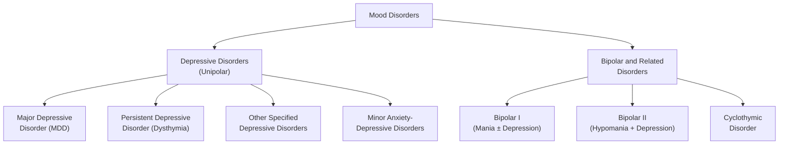

## 1. Definition and Core Concepts

### What Is Mood?

Mood (Latin: *modus* = manner, way) refers to a **pervasive and sustained emotional state** that colours a person's perception of the world. Think of it as the "background music" of your mental life — it sets the tone for everything else.

***Mood disorders are abnormal mood states with other associated features resulting in distress and functional impairment.*** [1]

A few critical distinctions right at the start:

| Term | Definition | Analogy |
|------|-----------|---------|
| **Mood** | Sustained, pervasive internal emotional state (subjective) | The climate |
| **Affect** | Observable, moment-to-moment emotional expression | The weather |
| **Emotion** | Discrete, short-lived feeling in response to a stimulus | A single rain shower |

***Normal fluctuation vs. Abnormal state — an abnormal state refers to a pervasively high or low mood that differs from the usual mood.*** [1]

### When Does Sadness Become Disease?

***Mood fluctuations in response to disappointment, frustration, and losses in everyday life are usually short-lived. Natural despondency can have important survival function, resulting in reorientation and maturation.*** [2]

So sadness after a breakup, grief after a bereavement — these are *adaptive*. Depression as a disorder is different because:

1. ***Severity of symptoms is marked*** — e.g., DSM-5 requires ***"marked" diminished interest or pleasure, "significant" weight loss or gain*** [2]
2. ***It impairs adaptations and is often disabling*** [2]
3. ***When enduring, depression can result in impaired function at work, at school, and in the family*** [2]

<Callout title="Key Conceptual Point">
The line between normal sadness and major depressive disorder is drawn by severity, duration, pervasiveness, and functional impairment — not simply by the presence of low mood. Every human experiences sadness; not every human has MDD.
</Callout>

---

## 2. Epidemiology

### Major Depressive Disorder (MDD)

***WHO estimates 5% of adults suffer from depressive disorder worldwide, approximately 280 million people.*** [2]

***The International Consortium of Psychiatric Epidemiology (89,037 adults from 18 countries) using the Composite International Diagnostic Interview found:*** [2]
- ***Average lifetime prevalence: 14.6% (high-income countries) and 11.1% (low- to middle-income countries)***
- ***Average 12-month prevalence: 5.5% (high-income) and 5.9% (low- to middle-income)***
- ***Female-to-male ratio ≈ 2:1*** [2]

**Why is depression more common in women?** Several hypotheses [3]:
1. Women may be more willing to admit depressive symptoms
2. Depression in men may be misdiagnosed as alcohol-related disorder (men have higher rates of comorbid alcohol abuse)
3. Social disadvantages experienced by women
4. Female hormones (particularly oestrogen fluctuations) may sensitise the brain to the effects of stress — this explains perimenstrual, postpartum, and perimenopausal vulnerability windows

**Hong Kong context:**
- Lifetime prevalence of MDD in Hong Kong has been estimated at approximately 8-10% in community surveys
- Elderly depression is a particular concern given Hong Kong's ageing population
- Significant treatment gap exists — many patients present with somatic complaints rather than mood symptoms (especially in Chinese culture where psychological distress is often "somatised")

### Dysthymia (Persistent Depressive Disorder)

- Lifetime risk ~4%, higher in women and divorced individuals [3]
- Usual onset in early adulthood; may last throughout life → sometimes called a "depressive personality"

### Minor Anxiety-Depressive Disorders

- **Very commonly seen in primary care** (6.9% prevalence) [3]
- Commonly present with ***prominent somatic symptoms*** to healthcare providers

### Bipolar Disorder

- Lifetime prevalence: approximately 1-2% for Bipolar I; up to 4-5% for full bipolar spectrum
- ***No gender and ethnic difference*** [1]
- ***Risk factors include: high-income countries (may be due to referral bias), low income, separated/divorced/widowed status*** [1]
- ***Family history of bipolar disorder and schizophrenia: monozygotic concordance 40-70%, lifetime risk in first-degree relatives 5-10% (roughly 7 times higher than general population risk)*** [1]

<Callout title="Exam Pearl" type="idea">
Depression has a 2:1 female-to-male ratio. Bipolar disorder has NO gender difference. This is a classic MCQ discriminator.
</Callout>

---

## 3. Anatomy and Function: The Neural Circuitry of Mood

Understanding mood disorders requires knowing the brain circuits involved. Think of mood regulation as a network of interconnected regions forming a "mood circuit":

### Key Brain Regions

| Region | Normal Function | What Goes Wrong in Depression |
|--------|----------------|-------------------------------|
| **Prefrontal Cortex (PFC)** | Executive function, decision-making, emotional regulation | Hypofunction (dorsolateral PFC) → psychomotor retardation, apathy, concentration deficits |
| **Ventromedial PFC / Subgenual cingulate (Brodmann Area 25)** | Emotional and social regulation | ***↑Activity → ↑sensitivity to pain, anxiety, depressive ruminations, tension*** [3] |
| **Dorsolateral PFC** | Working memory, executive functions | ***↓Activity → psychomotor retardation, apathy, deficits in attention/working memory*** [3] |
| **Amygdala** | Threat detection, emotional salience | Hyperactivity → negativity bias, excessive fear/anxiety |
| **Hippocampus** | Memory consolidation, stress regulation (HPA axis feedback) | ***Volume reduction*** → both predisposing factor and consequence of depression [3][4] |
| **Anterior Cingulate Cortex (ACC)** | Error monitoring, emotional regulation | ***Abnormal connectivity with amygdala → impaired inhibitory action in emotional regulation*** [3] |
| **Subgenual Cortex** | Regulation of autonomic and neuroendocrine responses | ***Volume reduction and decreased quantity of glial cells*** [4] |
| **Nucleus Accumbens / Ventral Striatum** | Reward processing, motivation | Reduced dopaminergic tone → anhedonia |

### Key Neurotransmitter Systems

***Monoamines including serotonin, norepinephrine, and dopamine are relevant to mood regulation, and play an essential role in the regulation of other bodily functions.*** [4]

| Neurotransmitter | Normal Role | Deficiency Consequence |
|-----------------|-------------|----------------------|
| **Serotonin (5-HT)** | ***Affects body temperature, regulates sleep and wakefulness, mood, and impulse control*** [4] | Low mood, impulsivity, sleep disturbance, suicidality |
| **Norepinephrine (NE)** | ***Regulates mood and anxiety levels*** [4] | Fatigue, psychomotor retardation, poor concentration |
| **Dopamine (DA)** | ***Regulates motor and mental activity, attention, and motivation; mesolimbic reward pathway plays important role in motivation, reinforcement, and the pleasure response*** [4] | Anhedonia, amotivation, psychomotor slowing |

***Low levels of serotonin metabolites have been found in the brains of suicide decedents and spinal fluids of depressed patients.*** [4]

***Dopaminergic neurons in the mesolimbic reward pathway are diminished in the brains of suicidal decedents with depression.*** [4]

***Mood symptoms emerged among patients who took propranolol*** (a beta-blocker that blocks noradrenergic signalling). [4]

***Besides monoamines, abnormalities in glutamate, GABA, and substance P have been detected in patients with depression.*** [4]

### Neuroendocrine Systems

***Hormonal changes in depression include: dysregulation of hypothalamic-pituitary-adrenal (HPA) axis, lower estradiol (in women) and testosterone (in men), decreased triiodothyronine and thyroid-stimulating hormone, and diminished BDNF (brain-derived neurotrophic factor) level.*** [4]

**Why does HPA axis dysregulation matter?**
- Chronic stress → sustained cortisol elevation → direct toxic effect on hippocampal neurons (which are rich in glucocorticoid receptors) → hippocampal atrophy → further loss of HPA negative feedback → more cortisol → vicious cycle
- This explains why early life stress can *structurally* predispose to depression decades later

---

## 4. Aetiology and Pathophysiology

Mood disorders arise from a **biopsychosocial model** — ***depressive disorder is caused by a combination of biological, social, and psychological factors, which disturb the brain's capacity for stress management.*** [4]

### 4A. Biological Factors

#### Genetics

**For MDD:**
- **37% heritability** from twin studies (MZ concordance ~50%) [3]
- This is lower than schizophrenia (~80%) and bipolar (~85%) — depression has a larger environmental component
- Probably multiple genes with small individual effects and complex gene-environment interactions
- Candidate gene: ***serotonin transporter gene*** (5-HTTLPR) — the short allele variant reduces serotonin reuptake efficiency [3]
- ***A threefold increase in risk of depression among first-degree relatives compared to the general population*** [4]

**For Bipolar Disorder:**
- ***79% heritability*** [1]
- ***First-degree relatives are at higher risk for bipolar, MDD, and other psychiatric disorders*** [1]
- ***Shared genetic risk between bipolar, schizophrenia, and autism*** [1]
- ***Some overlap with genes involved in circadian rhythm regulation*** [1]
- Genes identified include those involving ***neuronal development, neurotransmitter metabolism, and calcium channels*** [3]

<Callout title="Genetics Comparison" type="idea">
Heritability ladder: Bipolar (~85%) > Schizophrenia (~80%) > MDD (~37%). This means environmental factors play a proportionally LARGER role in MDD than in bipolar disorder. If a patient has a strong family history, think bipolar before unipolar.
</Callout>

#### Monoamine Hypothesis

***The classical "serotonin hypothesis" proposes that diminished activity of serotonin pathways plays a causal role in depression.*** [4]

Historical evidence:
- ***The antihypertensive drug reserpine, which depleted monoamines, produced a depressive state*** [4]
- ***Diminished monoaminergic activity was detected in the brains of decedents of suicide and bodily fluids of people with depression*** [4]

However: ***Evidence suggests that the cause of depression is far more complicated than a reduced level of serotonin.*** [4] The monoamine hypothesis is now viewed as an oversimplification — it explains why antidepressants work but not the full pathophysiology.

**Why can't monoamines explain everything?**
1. SSRIs increase serotonin within hours, but clinical response takes 2-4 weeks → downstream neuroplastic changes (not just monoamine levels) must be important
2. Not all drugs that increase monoamines are antidepressants (e.g., cocaine)
3. The neurotrophin hypothesis (BDNF) and neuroinflammation hypothesis are gaining traction

#### Structural Brain Changes

***Volume reduction and decreased quantity of glial cells in subgenual cortex, reduced hippocampal size*** are observed in depression. [4]

The hippocampal volume loss is both:
- A **predisposing factor** (smaller hippocampi → worse stress regulation) AND
- A **consequence** of chronic depression (cortisol-mediated neurotoxicity)

#### Neurochemistry of Bipolar Disorder

***Biochemical pathways implicated include dopaminergic, second messengers, mitochondrial, HPA axis, and thyroid pathways.*** [1]

- Mania is hypothesized to relate to ***dopamine hyperactivity*** but direct evidence is limited [3]
- The "kindling" model suggests that early episodes are triggered by life events, but later episodes become autonomous — the brain becomes increasingly sensitised

#### Infective Causes (for Bipolar)

***Infective causes, e.g., Toxoplasma gondii (the associated immune response)*** have been linked to bipolar disorder. [1]

### 4B. Psychosocial Factors

#### Early Environment (Predisposing)

***Early environment risk factors include: parental separation, physical and sexual abuse, non-caring or overprotective parenting styles.*** [4]

For MDD specifically [3]:
- **Parental deprivation** (e.g., separation, loss)
- **Parenting styles** (e.g., non-caring, over-protective)
- **Childhood adversities** (e.g., neglect, physical and sexual abuse)
- **Chronic stressors**: poor social support, not having employment outside the home, raising young children

For Bipolar [1]:
- ***Low care and overprotective parents, poor attachment relationship, childhood abuse*** [1]

#### Personality (Predisposing)

***Personality factors include: sociotropy (a strong need for approval from peers), neuroticism*** [4]

- **Neuroticism** is shown to be associated with depression and may represent a milder form of disease [3]
- Other personality risk factors include personality disorders (e.g., borderline, obsessive-compulsive)

#### Stress and Trauma (Precipitating)

***Stress and trauma, particularly long-term difficulties and recent life events — especially events that lead to feelings of entrapment and humiliation*** — are major precipitants. [4]

- 6× increased risk of adverse life events before onset of MDD [3]
- Especially common in **losses** (bereavement, breakup), **entrapment**, and **humiliation** (bullying) [3]
- Less important in **established melancholic depression** and **strong family history** (suggesting a lower threshold for disease expression in these groups) [3]
- Medical illnesses can act as non-specific stressors or cause depression via physiological mechanisms (e.g., Cushing's disease, puerperium) [3]

For Bipolar:
- ***Environmental factors include life events and social support, sleep deprivation, circadian and social rhythm disruption*** [1]
- Negative life events (***especially those disrupting sleep-wake activity***) and childbirth are key precipitants [3]

#### Lack of Social Support (Perpetuating)

***Lack of supportive networks, poorly functioning relationships, and poor social integration*** perpetuate depressive episodes. [4]

For Bipolar: ***Level of social support, separated, divorced, or widowed status*** are perpetuating factors. [3]

### 4C. Cognitive Theory

***Cognitive distortions are prominent in depression*** and form the basis of Cognitive Behavioural Therapy (CBT). Key distortions include: [4]

| Cognitive Distortion | Chinese | Meaning | Example |
|---------------------|---------|---------|---------|
| ***Selective abstraction*** | ***斷章取義*** | ***Focusing on a detail and ignoring more important features of a situation*** | "My boss praised 9 things but criticised 1 — I'm terrible" |
| ***Overgeneralisation*** | ***以偏概全*** | ***Drawing a general conclusion on the basis of a single incident*** | "I failed this exam, so I'll fail everything" |
| ***Personalisation*** | ***過度自責*** | ***Relating external events to oneself in an unwarranted way*** | "It rained on the picnic — it's my fault" |
| ***Arbitrary inference*** | ***妄下判斷*** | ***Drawing a conclusion when there is no evidence for it and even some evidence against it*** | "She didn't text back — she must hate me" |

***Psychoanalytical theory: loss of an 'object', insecure attachments*** also contribute to understanding depressive vulnerability. [4]

Aaron Beck's "cognitive triad" of depression describes negative views of:
1. **Self** ("I am worthless")
2. **World** ("Everything is terrible")
3. **Future** ("Nothing will ever get better")

---

## 5. Classification of Mood Disorders

### Overview

The current DSM-5-TR and ICD-11 classification uses a combination of aetiology, symptom pattern, and course [3]:

### Historical vs. Current Classification of Depression

The old classification by presumed aetiology is now considered **obsolete** [3]:
- **Endogenous** (independent of external stress) vs. **Reactive** (response to external stress) — this distinction is no longer used because most depressive episodes have both endogenous and reactive elements

Current classification uses [3]:

| Dimension | Categories |
|-----------|-----------|
| **Symptomatic picture** | Melancholic (more biological symptoms), Psychotic (with psychotic features), Non-melancholic/Atypical |
| **Course** | Unipolar vs. Bipolar; Single episode vs. Recurrent; Seasonal pattern; Recurrent brief |
| **Severity** | Mild, Moderate, Severe (with or without psychotic features) |

### Key Diagnostic Entities

#### Major Depressive Disorder (MDD)

***ICD-11 cardinal symptoms: depressed mood or diminished interest in activities occurring most of the day, nearly every day during a period lasting at least two weeks.*** [4]

***Additional symptoms: difficulty concentrating, feelings of worthlessness or excessive/inappropriate guilt, hopelessness, recurrent thoughts of death or suicide, changes in appetite or sleep, psychomotor agitation or retardation, and reduced energy or fatigue.*** [4]

#### Dysthymia (Persistent Depressive Disorder)

- Persistent depressive symptoms **NOT meeting criteria** for major depression for ≥2 years [3]
- May be associated with superimposed major depressive episodes (**"double depression"**) [3]

#### Minor Anxiety-Depressive Disorders

- Mild depression often co-exists with and cannot be separated from anxiety disorders [3]
- Mood symptoms (anxiety, depression, irritability), somatic symptoms (fatigue, insomnia, bodily preoccupation), cognitive symptoms (poor concentration) [3]

#### Seasonal Affective Disorder

- Onset in autumn/winter, recovery in spring/summer [3]
- Postulated to be related to daylight duration → rationale for bright light therapy

#### Bipolar I vs. Bipolar II

| Feature | Bipolar I | Bipolar II |
|---------|-----------|-----------|
| Mania | Present (≥ 1 manic episode) | Absent |
| Hypomania | May occur | Present (≥ 1 hypomanic episode) |
| Depression | Common but not required for Dx | Required (≥ 1 major depressive episode) |
| Psychosis | May occur during mania | Does NOT occur during hypomania |
| Hospitalisation | Often required during mania | Typically not needed for hypomania |

<Callout title="Common Exam Mistake" type="error">
Bipolar II is NOT a "milder form" of Bipolar I. The depressive burden in Bipolar II is often MORE severe and more chronic than in Bipolar I. The distinction is about the ceiling of the elevated mood (mania vs. hypomania), not about overall illness severity.
</Callout>

### Misdiagnosis of Bipolar Disorder

This is a critical clinical issue [3]:

| Direction | Problem |
|-----------|---------|
| **Underdiagnosis** | Overlooking hypomanic episodes → misdiagnosis as MDD; Mania with psychosis → misdiagnosed as schizophrenia |
| **Overdiagnosis** | Confusing mania with simple irritability — structured interviews confirm only 43% of patients with a previous diagnosis of bipolar disorder |

Consequences of misdiagnosis:
- **Undertreated**: increased suicidality, comorbid anxiety, substance abuse → ↓QoL, ↓functioning, ↑healthcare costs
- **Overtreated**: unnecessary side effects of mood stabilisers, increased sick role and disability claims
- **Mistreated**: antidepressants without mood stabiliser cover → ***less effective and risks manic switch and cycle acceleration*** [3]

***Correct diagnosis requires history from the patient AND collateral history from informants, and structured screening tools (e.g., Mood Disorder Questionnaire [MDQ], Hypomania Checklist [HCL-32]).*** [3]

***Correct diagnosis and treatment of bipolar disorder is often delayed by 5-7 years on average.*** [3]

---

## 6. Clinical Features

### 6A. Depressive Episode — Symptoms and Signs

#### Core Features [3]

**1. Depressed Mood**
- Differs from ordinary sadness: ***miserable, dejected, "down in the dumps"***
- ***Pervasive: covers most of the day***
- ***Loss of reactivity: loss of normal ups and downs in response to circumstances*** (cf. normal sadness where a funny joke might still elicit a laugh)
- ***Morning dysphoria: characteristically worse in the morning*** — this is one of the "biological" (melancholic) symptoms. Why? Because cortisol peaks in the early morning (the cortisol awakening response is exaggerated in depression), and serotonergic tone is lowest upon waking

**2. Anhedonia** (Greek: *an-* = without, *hedone* = pleasure)
- ***Loss of ability to derive pleasure from activities that were formerly enjoyed***
- Associated with ***social withdrawal*** [3]
- Pathophysiology: reduced dopaminergic signalling in the mesolimbic reward pathway (nucleus accumbens) → inability to experience reward

**3. Anergia** (Greek: *an-* = without, *ergon* = work/energy)
- ***Lack of energy or increased fatigability on minimal exertion → decreased activity*** [3]
- Reflects noradrenergic and dopaminergic hypofunction in prefrontal circuits

#### Biological (Somatic, Melancholic) Symptoms [3]

**4. Sleep Disturbances**
- ***Most classically early morning wakening*** (waking 2-3 hours earlier than usual and unable to return to sleep) — a hallmark of melancholic depression [3]
- Also: initial insomnia (difficulty falling asleep — more suggestive of comorbid anxiety), middle insomnia (frequent awakenings)
- In atypical depression: **hypersomnia** (excessive sleep)
- Pathophysiology: disruption of circadian rhythm regulation via serotonergic (raphe nuclei) and noradrenergic (locus coeruleus) systems, which regulate the sleep-wake cycle as part of the reticular activating system (RAS)

**5. Appetite and Weight Changes**
- Typically **decreased appetite and weight loss** in melancholic depression
- **Increased appetite and weight gain** (especially carbohydrate craving) in atypical depression
- Pathophysiology: serotonin modulates hypothalamic appetite centres; 5-HT deficiency can dysregulate appetite in either direction depending on the subtype

**6. Psychomotor Changes**
- **Psychomotor retardation**: slowed thinking, speech, and movement; reduced spontaneous gestures; long pauses before answering; monotonous speech
- **Psychomotor agitation**: inability to sit still, hand-wringing, pacing, pulling at clothes/skin
- Pathophysiology: dorsolateral PFC and basal ganglia hypofunction (retardation) or amygdala/ACC hyperactivation (agitation)

**7. Diurnal Variation**
- Typically worse in the morning, improves as the day progresses
- This is considered a biological/melancholic feature

**8. Loss of Libido**
- Decreased sexual desire and function
- Related to serotonergic and dopaminergic changes as well as reduced testosterone/oestrogen levels

#### Cognitive Symptoms

**9. Poor Concentration and Indecisiveness**
- Difficulty thinking, concentrating, or making decisions
- Pathophysiology: dorsolateral PFC hypofunction → executive dysfunction

**10. Negative Cognitions**
- Feelings of **worthlessness** or **excessive guilt** (can be delusional in severe cases)
- **Hopelessness** about the future
- These reflect the cognitive triad (negative view of self, world, and future)

**11. Suicidal Ideation**
- Recurrent thoughts of death, suicidal ideation, plans, or attempts
- Always assess in every patient with depression — the risk is highest in the early weeks of treatment (when energy returns before mood improves, giving the patient the "energy to act" on suicidal thoughts)

#### Psychotic Features (in Severe Depression)

- **Mood-congruent delusions**: delusions of guilt, poverty, nihilism (Cotard's syndrome — belief that one is dead or doesn't exist), persecution (belief they deserve punishment), hypochondriacal delusions
- **Mood-congruent hallucinations**: auditory hallucinations of derogatory or critical voices, voices telling the patient they are worthless or should die
- These are congruent with the depressive theme — they "make sense" in the context of extreme low mood

#### Somatic Presentation (Especially Relevant in Hong Kong)

- Many patients, especially in Chinese culture, present with **prominent somatic symptoms** rather than overtly reporting mood disturbance [3]
- Common somatic complaints: headache, back pain, chest tightness, gastrointestinal upset, dizziness, fatigue
- This phenomenon is sometimes called "somatisation" but is better understood as an alternative idiom of distress

### 6B. Manic Episode — Symptoms and Signs

The manic episode is essentially the "mirror image" of depression in many domains, though not a simple inversion:

**1. Elevated, Expansive, or Irritable Mood**
- The mood can be euphoric ("I feel on top of the world!") or irritable (especially when frustrated or thwarted)
- Pervasive — present most of the day, nearly every day
- Pathophysiology: dopaminergic hyperactivity in the mesolimbic pathway → excessive reward signalling

**2. Increased Energy / Goal-Directed Activity**
- Markedly increased energy levels, often with increased goal-directed activity (starting new projects, excessive planning)
- Or purposeless, non-goal-directed activity (psychomotor agitation)

**3. Decreased Need for Sleep**
- Characteristic: the patient feels **rested after only 2-3 hours of sleep** (contrast with insomnia in depression, where the patient *wants* to sleep but cannot, and feels unrested)
- Pathophysiology: overactivation of the reticular activating system and circadian disruption

**4. Pressured Speech / Talkativeness**
- Rapid, loud, difficult to interrupt
- Reflects racing thoughts being translated into speech

**5. Flight of Ideas / Racing Thoughts**
- Subjective experience of thoughts moving too fast; speech may jump from topic to topic with loose but identifiable associations
- Differs from "loosening of associations" in schizophrenia (where the connections are not identifiable)

**6. Distractibility**
- Attention easily drawn to unimportant or irrelevant external stimuli

**7. Grandiosity / Inflated Self-Esteem**
- Ranges from uncritical self-confidence to delusional grandiosity ("I am chosen by God," "I have special powers")
- Pathophysiology: excessive dopamine in reward circuits → overvaluation of self and abilities

**8. Increased Risk-Taking / Pleasurable Activities with Potential for Painful Consequences**
- Excessive spending sprees, sexual indiscretions, foolish business investments, reckless driving
- Reflects impaired judgment combined with increased reward-seeking behaviour

**9. Psychotic Features (in Severe Mania)**
- **Mood-congruent delusions**: grandiose delusions (believing one is a celebrity, deity, or has special powers), persecutory delusions (believing others are jealous/trying to stop them)
- **Mood-congruent hallucinations**: voices affirming special status

<Callout title="Mania with Psychosis vs. Schizophrenia" type="error">
Mania with psychotic features can be misdiagnosed as schizophrenia. The key differentiator: in mania, the psychosis is mood-congruent and occurs in the context of elevated mood/energy. In schizophrenia, psychotic symptoms persist independent of mood state and are often mood-incongruent. Always check for a mood episode first before diagnosing a primary psychotic disorder.
</Callout>

### 6C. Hypomanic Episode — Key Differences from Mania

Hypomania is a less severe form of mania:
- Same symptom profile as mania BUT:
  - **Shorter duration** (≥ 4 days vs. ≥ 7 days for mania)
  - **No psychotic features**
  - **No marked functional impairment or hospitalisation required**
  - May be associated with **increased functioning** (the patient is more productive, sociable, creative)
- The challenge: patients often do NOT recognise hypomania as pathological — it feels good! Collateral history is essential.

### 6D. Mixed Features

- Episodes with both depressive and manic/hypomanic features simultaneously (e.g., grandiose thoughts but deeply dysphoric mood, or high energy but suicidal ideation)
- These carry a **particularly high suicide risk** because the patient has both the despair of depression and the energy/impulsivity of mania
- DSM-5 uses "with mixed features" specifier

### 6E. Bipolar Depression vs. Unipolar Depression — Clinical Clues

Since bipolar depression accounts for the majority of illness duration in bipolar disorder, distinguishing it from unipolar depression is crucial. Clinical clues suggesting **bipolar depression** include:

| Feature | Unipolar Depression | Bipolar Depression |
|---------|--------------------|--------------------|
| Age of onset | Older (often > 25) | Younger (often < 25) |
| Number of episodes | Fewer | More frequent/recurrent |
| Onset | Gradual | Can be abrupt |
| Duration of episodes | Longer | Shorter |
| Atypical features | Less common | More common (hypersomnia, hyperphagia, leaden paralysis) |
| Psychomotor retardation | Variable | Prominent |
| Psychotic features | Less common | More common |
| Family history | MDD | Bipolar disorder, schizophrenia |
| Response to antidepressants | Good | Poor, or manic switch |
| Postpartum onset | Less common | More common |

> ~25% of bipolar disorder first presents as a juvenile depressive episode in their first episode [3]

---

## 7. Assessment

***Assessment includes: history (including medical and medication history), mental state examination, use of standardised instruments, physical examination, and investigation to rule out medical conditions that may cause depressive symptoms.*** [4]

### Investigations

***Basic investigations: CBP, renal/liver function tests, thyroid function test.*** [4]

***Others to consider if indicated by history and physical examination: blood alcohol level, blood and urine toxicology screen, HIV test, cosyntropin (ACTH) stimulation test (for Addison disease), EEG (for epilepsy), or CT/MRI (for organic brain syndrome or hypopituitarism).*** [4]

### Suicide Risk Assessment

The provided notes reference a structured suicide risk assessment tool with scoring components [3]:
- **Section B**: Suicidal behaviour (suicidal ideation, plan, means, attempt, final acts/notes)
- **Section C**: Associated symptoms:
  - Depression (sleep disorder, anorexia/weight loss, withdrawal/loss of interest, hopelessness/helplessness, psychomotor retardation, depressed mood)
  - Hallucinations (derogatory, criticising, about death)
  - Delusions (guilt, death, persecutory)
  - Unstable mood (anxiety, panic, fear)
- **Supervision levels**: Normal (0-9), SO1 (10-18), SO2 (19-28), SO3 (29-41)

---

## 8. Special Populations

### Youth Depression [3]

- Much less common in childhood ( < 1%, M:F ≈ 1:1) but increases drastically after puberty (1-year prevalence 4%, F > M ≈ 2:1)
- Aetiology: 5-HTTLPR variant associated with early-onset depression; cortisol-induced hippocampal atrophy; negative cognitive style, perfectionism; adverse life events
- Clinical features differ from adults:
  - **Adolescence**: similar to adults
  - **Childhood**: difficulty expressing sadness; more somatic complaints (abdominal pain, headache, anorexia, enuresis), irritable mood and anxiety, behavioural problems
  - Common comorbidities: 70% have anxiety disorder, conduct disorder, substance abuse, dysthymia
- Prognosis: episodic relapsing course; majority recover within 3 months but 15% last > 18 months
- ~25% of bipolar disorder first presents as juvenile depression

### Geriatric Depression

- Often under-recognised and undertreated
- May present with prominent cognitive symptoms (pseudodementia) — must differentiate from true dementia
- Higher rates of somatic presentation
- Associated with medical comorbidities, functional decline, bereavement, social isolation, and polypharmacy
- Higher suicide completion rates compared to younger adults (elderly men have the highest completed suicide rate of any demographic)

---

<Callout title="High Yield Summary">

**Definitions**
- Mood disorders = abnormal mood states with associated features causing distress and functional impairment
- Normal sadness is adaptive and short-lived; MDD is defined by severity, duration, and functional impairment

**Epidemiology**
- MDD: lifetime prevalence ~11-15%; F:M = 2:1; 5% of adults worldwide affected
- Bipolar: ~1-2% prevalence; NO gender difference; heritability ~79-85%
- Dysthymia: lifetime risk ~4%

**Pathophysiology**
- Monoamine hypothesis (serotonin, norepinephrine, dopamine deficiency) — necessary but insufficient explanation
- Structural changes: reduced hippocampal volume, subgenual cortex glial cell loss
- HPA axis dysregulation → cortisol-mediated hippocampal neurotoxicity
- Cognitive distortions: selective abstraction, overgeneralisation, personalisation, arbitrary inference

**Classification**
- Depression: MDD, dysthymia, minor anxiety-depressive, seasonal, recurrent brief
- Bipolar: I (mania), II (hypomania + depression), cyclothymia
- Bipolar misdiagnosis is extremely common (5-7 year diagnostic delay on average)

**Core Clinical Features**
- Depression triad: depressed mood, anhedonia, anergia
- Melancholic features: early morning wakening, morning dysphoria, weight loss, psychomotor retardation
- Mania triad: elevated/irritable mood, increased energy, decreased need for sleep
- Always assess for suicide risk, psychotic features, and mixed features

**Key Discriminators**
- Depression F:M = 2:1; Bipolar no gender difference
- Bipolar heritability (~85%) > MDD heritability (~37%)
- Early onset depression → consider bipolar
- Antidepressant-induced mania = red flag for bipolar

</Callout>

---

<ActiveRecallQuiz
  title="Active Recall - Approach to Mood Disturbances"
  items={[
    {
      question: "What is the heritability of MDD vs. Bipolar Disorder, and what is the clinical significance of this difference?",
      markscheme: "MDD heritability ~37% (MZ concordance ~50%); Bipolar heritability ~79-85% (MZ concordance 40-70%). Significance: MDD has a larger environmental component; strong family history should raise suspicion for bipolar disorder rather than unipolar depression."
    },
    {
      question: "Name the four cognitive distortions prominent in depression as described by Beck's cognitive theory.",
      markscheme: "1. Selective abstraction (focusing on a detail, ignoring context); 2. Overgeneralisation (general conclusion from single incident); 3. Personalisation (relating external events to oneself unwarrantedly); 4. Arbitrary inference (drawing conclusion without evidence or against evidence)."
    },
    {
      question: "Why does the monoamine hypothesis alone fail to fully explain depression?",
      markscheme: "SSRIs increase serotonin within hours but clinical response takes 2-4 weeks, suggesting downstream neuroplastic changes are important. Not all monoamine-increasing drugs are antidepressants (e.g., cocaine). Other mechanisms implicated include BDNF/neurotrophin changes, neuroinflammation, HPA axis dysregulation, and structural brain changes."
    },
    {
      question: "What are the key clinical features that distinguish bipolar depression from unipolar depression?",
      markscheme: "Bipolar depression: younger onset (typically < 25), more atypical features (hypersomnia, hyperphagia, leaden paralysis), more psychomotor retardation, more psychotic features, shorter episodes, more frequent recurrence, family history of bipolar/schizophrenia, poor response or manic switch with antidepressants, possible postpartum onset."
    },
    {
      question: "What is the average delay in correct diagnosis of bipolar disorder and what are two consequences of misdiagnosis as unipolar depression?",
      markscheme: "Average diagnostic delay is 5-7 years. Consequences: 1. Antidepressant monotherapy is less effective and can cause manic switch and cycle acceleration; 2. Untreated mood symptoms lead to increased suicidality, comorbid anxiety, substance abuse, reduced QoL, and increased healthcare costs."
    },
    {
      question: "Explain the pathophysiological basis of early morning wakening in melancholic depression.",
      markscheme: "Disruption of circadian rhythm regulation via serotonergic (raphe nuclei) and noradrenergic (locus coeruleus) systems that regulate the sleep-wake cycle as part of the reticular activating system (RAS). Exaggerated cortisol awakening response in depression contributes. Cortisol peaks early morning, and HPA axis dysregulation leads to premature arousal."
    }
  ]}
/>

## References

[1] Lecture slides: GC 163. I am a superman Bipolar disorder.pdf (pp. 2, 19, 28)
[2] Lecture slides: GC 164. I am depressed Mood disorders.pdf (p. 2)
[3] Senior notes: ryanho-psych.md (sections 7.1, 7.2 and Bipolar Disorder aetiology)
[4] Lecture slides: GC 164. I am depressed Mood disorders.pdf (pp. 10, 11, 12, 13)
