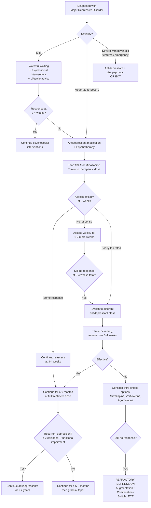
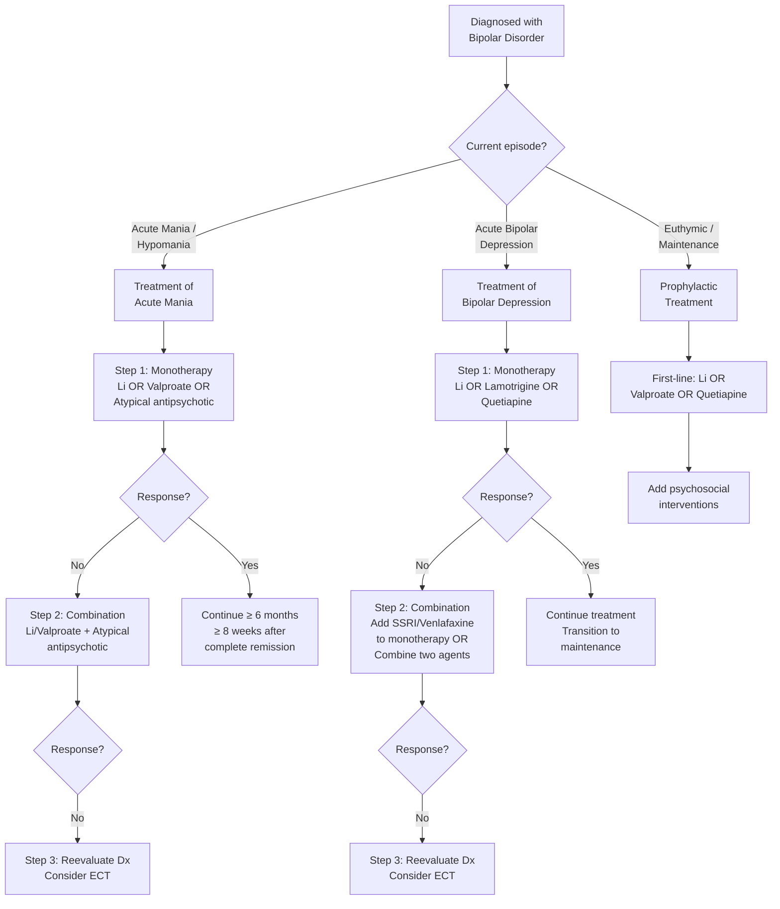

## Management of Mood Disorders

### Guiding Principles

Before diving into specific treatments, understand the overarching philosophy. Management of mood disorders is structured around **three phases** and always integrates **biopsychosocial** approaches:

1. **Acute treatment** — resolve the current episode (weeks to months)
2. **Continuation treatment** — prevent relapse of the *same* episode (months)
3. **Maintenance / Prophylactic treatment** — prevent recurrence of *new* episodes (years to lifelong)

The treatment differs fundamentally between **unipolar depression** and **bipolar disorder** — this is why getting the diagnosis right matters so much. Treating bipolar depression with antidepressant monotherapy is not just ineffective; it is actively harmful (manic switch, cycle acceleration) [5][7].

***Fundamentals of patient management include: correct diagnosis, illness acceptance and treatment adherence, family psychoeducation, pharmacological and psychosocial treatment.*** [7]

---

## A. Management Algorithm — Unipolar Depression

### Overview

The approach follows a stepped-care model (NICE guidelines) [3]:

### Step-by-Step Approach

#### Step 1: Mild Depression

- **Watchful waiting** + psychosocial intervention [3]
- General lifestyle advice: avoid alcohol/substance use, diet, sleep hygiene, encourage suitable physical activity (↓activity causes social withdrawal and exacerbates depression) [3]
- ***Physical activity: systematic review and meta-analysis of 13 studies showed pooled standardised mean difference of -0.40; inverse association between duration of intervention and magnitude of effect*** [6]
- Reassess in 2-4 weeks; if no improvement, escalate to pharmacotherapy

#### Step 2: Moderate–Severe Depression and Dysthymia

- Antidepressant treatment + psychotherapy [3]
- Discuss choice of drug with the patient — consider: potential therapeutic effects, possible adverse effects, likelihood of discontinuation symptoms, likely time to respond, the role of therapeutic alliance in predicting response [3]

#### Step 3: Refractory Depression

If the patient fails to respond after adequate trials:

**Considerations first** [3]:
- Reassess *diagnosis*: look for secondary causes (e.g., substance abuse, medical conditions)
- Assess *compliance*
- Assess for ongoing psychosocial *stressors*

**Therapeutic options for refractory depression** [3]:

| Strategy | Options | Rationale |
|----------|---------|-----------|
| **Switch** | Switch to another *class* of antidepressant (preferably different mechanism) | If the first mechanism didn't work, try a different neurotransmitter target. Beware serotonin syndrome and discontinuation syndrome → cross-tapering |
| **Combine** | Usually 5-HT drug (SSRI, venlafaxine) + NA drug (bupropion, mirtazapine) | Targets multiple monoamine systems simultaneously; "California rocket fuel" = venlafaxine + mirtazapine |
| **Augment** | Low-dose antipsychotic (esp. with psychotic features), lithium, tri-iodothyronine (T3) | Antipsychotics licensed for augmentation: ***quetiapine, aripiprazole*** [3]. Lithium augments serotonergic function. T3 enhances monoamine receptor sensitivity |
| **ECT** | Electroconvulsive therapy | Considered more effective than drugs in the most severe cases. Indications: emergency, refractory, catatonic [3] |

<Callout title="STAR*D Trial — Real-World Remission Rates">
The landmark STAR*D trial tested sequential antidepressant strategies in 2,876 outpatients with MDD. Remission rates at each step: Step 1 (citalopram): 28%; Step 2 (switch or augment): 21-30%; Step 3: 12-20%; Step 4: 7-14%. The key lesson: each subsequent step has diminishing returns. Getting the first treatment right (or close to right) matters most. Most patients need more than one trial to achieve remission. [3]
</Callout>

#### Step 4: Continuation and Maintenance

- **First episode**: continue antidepressants for **≥ 6-9 months** at the dose that induced remission [3]
- **≥ 2 episodes with significant functional impairment**: continue antidepressants for **≥ 2 years** [3]
- Duration of continuation prevents relapse — this is because the underlying neurobiological changes (BDNF normalization, synaptic remodeling) require sustained pharmacological support

**Course and Prognosis** [3]:
- Clinical course: generally self-limiting within 6 months to 1 year
- Age of onset: ~50% before age 21
- Duration: average 6 months; ~25% > 1 year; ~10-20% chronic unremitting
- Recurrence: ~80% will recur; average ~4 further episodes in 25 years
- Mortality: > 20× risk of suicide; can approach 15% in severe admitted cases

---

## B. Management Algorithm — Bipolar Disorder

***The challenge in long-term management is the prevention of relapses, subsyndromal symptoms, and functional disability.*** [7]

### 1. Treatment of Acute Mania

***Treatment of manic episode:*** [7]

***Step 1: Monotherapy*** [7]

***Step 2: Combination — Lithium/Valproate plus atypical antipsychotics*** [7]

***Step 3: Reevaluate diagnosis and consider ECT (need of rapid response, e.g., high violence risk)*** [7]

**Hospitalisation is necessary in all but the mildest cases of mania** (insight is often impaired early) [5]

**Drug options for acute mania** [5]:

| Drug Class | Specific Agents | Notes |
|-----------|----------------|-------|
| **Atypical antipsychotics** | Olanzapine, risperidone, haloperidol, quetiapine, aripiprazole, ziprasidone | Best combination of efficacy and acceptability; considered **first-line** in NICE guidelines [5] |
| **Lithium** | — | Don't start if unlikely to be compliant (discontinuation can trigger rebound mania); rapid cycling, prominent depressive symptoms, and psychotic features predict poorer response [5] |
| **Valproate** | Sodium valproate (Epilim) | Avoid if childbearing potential (teratogenic — neural tube defects); faster onset of action compared to lithium [5] |
| **Short-term benzodiazepines** | Lorazepam or clonazepam | Rationale: ↓behavioural disturbance + ↑sleep → allows ↓dose of antipsychotics needed [5] |

**Critical considerations** [5]:
- ***ALWAYS avoid/stop use of antidepressants*** (trigger mania)
- ***Ensure drug compliance*** by therapeutic drug monitoring
- ***Pregnancy***: prefer haloperidol (not associated with ↑risk of congenital anomalies) → risperidone, quetiapine, olanzapine
- Treatment duration: gradual ↓dose with clinical improvement; **continue treatment for ≥ 6 months and ≥ 8 weeks after complete remission** (↓rebound mania) [5]

### 2. Treatment of Bipolar Depression

***Acute treatment of bipolar depressive episodes: Because of the recognised risk of switching to manic or mixed episodes and the high risk of suicide, referral to a specialist should be considered.*** [7]

***Treatment of bipolar depressive episode:*** [7]

***Step 1: Monotherapy — Lithium, Lamotrigine OR Quetiapine*** [7]

***Step 2: Combination — Add Antidepressants (SSRI OR Venlafaxine) to monotherapy OR Combine two monotherapy agents*** [7]

***Step 3: Reevaluate diagnosis and consider ECT (for patients with high suicidal risk)*** [7]

**Treatment is NOT identical to unipolar depression** [5]:
- Conventional antidepressants are (1) **less effective** in treating bipolar depression, (2) associated with risk of **inducing mania**, (3) associated with risk of **inducing rapid cycling** [5]
- Not all mood stabilisers are equally effective at treating mania and depression — lamotrigine, quetiapine, and lithium are more useful for bipolar depression [5]
- **SSRIs may be effective but may induce mania; TCAs and SNRIs have even higher risk of inducing mania** [5]
- Antidepressants, when used, should be **combined with antipsychotic or mood stabiliser** [5]

***Avoid antidepressants if possible; if used, limit dose and duration.*** [7]

<Callout title="Why Can't You Just Give Antidepressants for Bipolar Depression?" type="error">
This is one of the most important management principles in psychiatry. Antidepressant monotherapy in bipolar depression can: (1) trigger a manic switch — pushing the patient from depression into mania; (2) accelerate cycling — increasing the frequency of mood episodes; (3) induce mixed states — combining depressive and manic features, which carry the highest suicide risk. The risk is highest with TCAs and SNRIs, intermediate with SSRIs, and lowest with bupropion. Always use antidepressants in combination with a mood stabiliser or atypical antipsychotic, and limit dose and duration.
</Callout>

### 3. Maintenance / Prophylactic Treatment

***Indication for prophylactic treatment:*** [7]

- ***Established bipolar disorder — recurrent episodes of mania or depression***
- ***Severe single episode with suicidal attempts, psychotic episodes and significant functional impairment (to prevent future relapse)***
- ***Recurrence rate reduces by 50% for maintenance vs. discontinuation***
- ***Gradual discontinuation better than abrupt discontinuation*** [7]

***General guidelines for prophylaxis for bipolar I:*** [7]

***Monotherapy: Lithium or Valproate or Quetiapine*** [7]

***Psychosocial (augmentation):*** [7]
- ***Psycho-education***
- ***Cognitive behavioural therapy***
- ***Interpersonal and social rhythm therapy***
- ***Family or carer-focused treatment***
- ***Peer-support***
- ***Intensive case management***
- ***Less hostile, more supportive, better drug compliance*** [7]

***How long is the prophylactic treatment?*** [7]
- ***No strict guidelines, probably lifelong***
- ***At least a few years without relapse (cases that have no relapse for more than 10 years relapse after discontinuation of treatment)***
- ***Absence of subsyndromal symptoms between mood episodes is a prerequisite*** [7]

**Relative efficacy of maintenance agents** [5]:

| Agent | Prevents Manic Relapse | Prevents Depressive Relapse | Key Considerations |
|-------|:-----:|:-----:|-----|
| **Lithium** | +++ | ++ | ***The only mood stabiliser to reduce suicide*** [7]; monitor plasma level (0.5-1.0 mmol/L), RFT, TFT every 6 months; drug interactions with diuretics, NSAIDs, CCBs, ACEIs; teratogenic (Ebstein anomaly) [5] |
| **Valproate** | +++ | + | Commonly used; teratogenic (neural tube defects) — avoid in women of childbearing potential [5] |
| **Lamotrigine** | + | +++ | ***Promising agent for treatment of bipolar depression due to its tolerability and wide therapeutic margin*** [7]; better at preventing depressive episodes, less effective for manic episodes cf lithium/valproate [5] |
| **Quetiapine** | ++ | ++ | Effective for both poles; limited by metabolic side effects |
| **Olanzapine** | ++ | + | Effective but metabolic side effects (weight gain, diabetes) |

***Atypical antipsychotics look promising as mood stabilisers, but limited by metabolic side effects.*** [7]

***Lithium is still an important drug, given that it is the only mood stabiliser to reduce suicide.*** [7]

---

## C. Pharmacotherapy — Detailed Drug Classes

### 1. Antidepressants

***Though changes in monoamines constitute only part of the aetiological picture, the monoamine systems provide the most accessible treatment avenue.*** [6]

**Key principle**: Antidepressant effect is usually ***delayed for ~2 weeks (with maximum effect at 6-12 weeks)*** [3]. Why? Because the clinical benefit comes not from immediate monoamine increase but from **downstream neuroplastic changes** — BDNF upregulation, synaptic remodelling, hippocampal neurogenesis, and receptor sensitivity changes. These processes take weeks to manifest.

**Change in medication should only be considered after 3-4 weeks of no effect.** [3]

#### Overview of Antidepressant Classes

| Class | Examples | Mechanism | Key Points |
|-------|----------|-----------|------------|
| ***Selective Serotonin Reuptake Inhibitors (SSRIs)*** | ***Fluoxetine, paroxetine, sertraline, citalopram, escitalopram, vortioxetine*** [6] | Block the serotonin transporter (SERT) → ↑synaptic 5-HT | **First-line** for most depression due to best balance of efficacy and tolerability |
| ***Serotonin and Norepinephrine Reuptake Inhibitors (SNRIs)*** | ***Duloxetine, venlafaxine, desvenlafaxine*** [6] | Block both SERT and NET → ↑synaptic 5-HT and NE | Dual action; may be more effective in severe/melancholic depression; venlafaxine also useful in anxiety disorders |
| ***Tricyclic Antidepressants (TCAs)*** | ***Amitriptyline, imipramine, nortriptyline, clomipramine, dothiepin, trimipramine, desipramine*** [6] | Non-selective reuptake inhibition of 5-HT and NE; also block muscarinic, histamine H1, and alpha-1 adrenergic receptors | Effective but significant side effects and dangerous in overdose (cardiac toxicity — QT prolongation, arrhythmias). Reserved for refractory cases or specific indications (e.g., neuropathic pain) |
| ***Tetracyclic Antidepressants*** | ***Mianserin*** [6] | Alpha-2 antagonism → ↑NE release; also H1 antagonism | Sedating; rarely used as first-line |
| ***Norepinephrine and Dopamine Reuptake Inhibitors (NDRIs)*** | ***Bupropion*** [6] | Blocks NET and DAT → ↑synaptic NE and DA | Good for patients with fatigue, psychomotor retardation, or sexual dysfunction from SSRIs; also used for smoking cessation; lower seizure threshold |
| ***Monoamine Oxidase Inhibitors (MAOIs)*** | ***Tranylcypromine, phenelzine, isocarboxazid, selegiline*** [6] | Irreversibly inhibit MAO-A and MAO-B → ↓monoamine breakdown → ↑5-HT, NE, DA | Effective but significant dietary restrictions (tyramine → hypertensive crisis) and dangerous drug interactions. Rarely used |
| ***Reversible Inhibitors of MAO-A (RIMAs)*** | ***Moclobemide*** [6] | Reversibly inhibit MAO-A only | Fewer dietary restrictions than irreversible MAOIs; better tolerated |
| ***Melatonergic Antidepressants*** | ***Agomelatine*** [6] | MT1/MT2 melatonin receptor agonist + 5-HT2C antagonist → resynchronises circadian rhythm + ↑NE and DA in prefrontal cortex | Novel mechanism; good tolerability; minimal discontinuation symptoms [3]; monitor LFTs (hepatotoxicity risk) |
| ***Others*** | ***Trazodone, mirtazapine*** [6] | Trazodone: 5-HT2A antagonist + weak SERT inhibitor (sedating). Mirtazapine: NaSSA — alpha-2 antagonist + 5-HT2/5-HT3 antagonist + H1 antagonist → ↑NE and 5-HT release, strongly sedating, appetite-stimulating | Mirtazapine useful when sedation/appetite stimulation is desired (e.g., insomnia, anorexia); weight gain is main limitation |

***Systematic review and network meta-analysis of 21 antidepressants (Cipriani et al., 2018):*** [6]
- ***Agomelatine, amitriptyline, escitalopram, mirtazapine, paroxetine, venlafaxine, and vortioxetine are more effective than other antidepressants (range of ORs 1.19-1.96)***
- ***Agomelatine, citalopram, escitalopram, fluoxetine, sertraline, and vortioxetine are more tolerable than other antidepressants (range of ORs 0.43-0.77)***
- ***Older antidepressants (e.g., tricyclics, MAOIs) associated with significant adverse events and drug-drug interactions***
- ***Marked inter-individual variation in antidepressant tolerability***
- ***Choice of medication determined by clinical circumstances, particularly the patient's physical comorbidity and concomitant medications*** [6]

#### Special Considerations for SSRIs [3]

| Aspect | Detail |
|--------|--------|
| **Common side effects** | GI disturbance (nausea, diarrhoea), neuropsychiatric effects (anxiety, insomnia early on), sexual dysfunction (delayed ejaculation, anorgasmia) — all serotonergic |
| **↑Suicidal risk** | Probably insignificant except in young patients < 25 years. Why? Energy may return before mood improves → patient now has the "energy to act" on suicidal thoughts |
| **Drug-drug interactions** | MAO-I → **serotonin syndrome** (agitation, hyperpyrexia, rigidity, myoclonus, coma); Antipsychotics → potentiates extrapyramidal effects; NSAIDs → ↑risk of upper GI bleed (serotonin stored in platelets → SSRIs ↓platelet aggregation); Others → inhibits CYP450 enzymes (esp. fluvoxamine, fluoxetine, paroxetine) [3] |
| **Discontinuation symptoms** | Occur in ≥ 1/3 of patients; usually onset ≤ 5 days upon discontinuation. Due to "receptor rebound" → ↑↑previously suppressed functions. Symptoms: affective (irritability), GI (nausea), neuromotor (ataxia), vasomotor (diaphoresis), neurosensory (paraesthesia, "electric shocks"), neurological (↑dreaming). Minimal with agomelatine and vortioxetine [3] |

#### Population-Specific Considerations [3]

| Population | Preferred | Avoid | Rationale |
|-----------|-----------|-------|-----------|
| **Elderly** | SSRIs (citalopram, sertraline) | TCA/MAOIs (dangerous in OD), venlafaxine (hypertension), mirtazapine (strong sedation → falls) | Elderly at higher risk of falls, overdose, cardiac complications, hyponatraemia (SIADH from SSRIs — monitor Na) |
| **Cardiovascular disease** | SSRIs | **TCA is contraindicated** (prolongs QT, pro-arrhythmic) | TCAs block cardiac sodium channels → QT prolongation → torsades de pointes |
| **Pregnancy** | Sertraline (safest SSRI data), consider risk-benefit | Paroxetine (cardiac malformations), valproate, lithium (1st trimester) | All antidepressants cross the placenta; neonatal withdrawal syndrome possible |
| **Bipolar depression** | Avoid antidepressant monotherapy | TCAs, SNRIs (highest manic switch risk) | Always combine with mood stabiliser |

### 2. Mood Stabilisers

| Drug | Mechanism | Key Indications | Key Side Effects / Monitoring |
|------|-----------|----------------|------------------------------|
| **Lithium** | Multiple: inhibits inositol monophosphatase (↓PI signalling), inhibits GSK-3β (↑neuroprotection), modulates monoamine transmission | Acute mania, bipolar depression, maintenance, augmentation in MDD, **anti-suicidal** | **Narrow therapeutic index** (0.5-1.0 mmol/L maintenance, 0.8-1.2 acute); Toxicity: coarse tremor, ataxia, confusion, seizures, renal failure. Monitor: plasma levels, RFT, TFT (hypothyroidism), Ca (hyperparathyroidism), ECG every 6 months [5]. Interactions: diuretics, NSAIDs, ACEIs ↑lithium levels. Teratogenic: Ebstein anomaly (tricuspid valve malformation) |
| **Valproate (Epilim)** | GABA-ergic (↑GABA by inhibiting GABA transaminase and blocking voltage-gated Na channels) | Acute mania (faster onset than Li), maintenance | Teratogenic (neural tube defects — **absolutely contraindicated in women of childbearing potential unless no alternative**); hepatotoxicity; pancreatitis; weight gain; thrombocytopenia; monitor LFTs, CBP [5] |
| **Carbamazepine** | Voltage-gated Na channel blocker; secondary effects on monoamine systems | Mixed states, rapid cycling | Auto-induces CYP3A4 (↓levels of many co-medications including OCP); aplastic anaemia (rare); DRESS/SJS (HLA-B*1502 — test before starting, especially in Han Chinese); hyponatraemia |
| **Lamotrigine** | Voltage-gated Na channel blocker → ↓glutamate release (excitatory amino acid) | Bipolar depression (acute and maintenance); less effective for mania | ***Promising agent for treatment of bipolar depression due to its tolerability and wide therapeutic margin*** [7]. Key risk: Stevens-Johnson syndrome (SJS) / toxic epidermal necrolysis (TEN) — must titrate *very slowly* (over weeks). Risk increased by co-administration with valproate (inhibits lamotrigine metabolism) |

### 3. Antipsychotics (in Mood Disorders)

Atypical antipsychotics have a dual role: antimanic (dopamine blockade) and mood-stabilising properties.

| Drug | Role in Mood Disorders | Key Side Effects |
|------|----------------------|-----------------|
| **Olanzapine** | Acute mania (monotherapy or combination); bipolar depression (with fluoxetine); maintenance | Significant weight gain, metabolic syndrome (diabetes, dyslipidaemia); sedation |
| **Quetiapine** | Acute mania; bipolar depression (monotherapy); maintenance; augmentation in MDD | Sedation, metabolic effects (less than olanzapine); orthostatic hypotension |
| **Risperidone** | Acute mania | EPS at higher doses; hyperprolactinaemia |
| **Aripiprazole** | Acute mania; maintenance; augmentation in MDD | Partial D2 agonist (unique mechanism); less metabolic effects; may cause akathisia |
| **Haloperidol** | Acute mania (especially if antipsychotic effect needed urgently); preferred in pregnancy | Significant EPS; QT prolongation at high doses |

---

## D. Psychotherapy

***Psychotherapy is a form of systematic psychological treatment with well-defined objectives.*** [6]

**Indication** [3]:
- **First-line** in mild depression (without pharmacotherapy)
- **In addition to drugs** in moderate-severe depression
- ***As many as 85% of patients receiving both antidepressants and psychotherapy achieve remission*** [6]

***Cognitive behavioural therapy and interpersonal therapy are highly effective in remedying mild and moderate depression.*** [6]

| Modality | Approach | When Especially Useful |
|----------|----------|----------------------|
| ***Cognitive Behavioural Therapy (CBT)*** | ***Monitor, evaluate and modify negative dysfunctional thoughts and distorted perceptions and beliefs; use cognitive techniques (e.g., list pros and cons, examine evidence); increase activity scheduling*** [6] | Depression with prominent cognitive distortions; anxiety comorbidity; relapse prevention |
| ***Interpersonal Therapy (IPT)*** | ***Problems are understood in interpersonal context — e.g., facilitate grieving process, encourage role transition, explore interpersonal disputes, improve interpersonal skills*** [6] | Depression triggered by interpersonal loss, role transitions, social isolation |
| ***Problem-Solving Therapy*** | ***Improve ability to deal with specific everyday problems and life crises; identify problems, brainstorm solutions, evaluate effectiveness → best possible solution*** [6] | Primary care settings; patients with identifiable psychosocial stressors |
| ***Supportive Therapy*** | ***Facilitate expression of affect, highlight positive and successful experiences, offer empathy, impart therapeutic optimism; empathic listening, reflection, emotional processing, encouragement*** [6] | Adjunctive to all treatment; patients not suitable for structured therapy |
| **Psychodynamic Therapy** | Explores unconscious conflicts and early relational patterns | Chronic, recurrent depression with personality factors |
| **Mindfulness-Based Cognitive Therapy (MBCT)** | Combines CBT with mindfulness meditation to prevent depressive relapse | Relapse prevention in recurrent depression (≥ 3 episodes) |
| **Family and Marital Interventions** | Addresses family dynamics, communication, expressed emotion | Depression in context of relationship difficulties |

For **bipolar disorder**, psychotherapy plays an ***adjunctive role*** to improve and sustain recovery [5]:
- ***Interpersonal and social rhythm therapy***: maintain sleep-activity schedules (disrupted circadian rhythms are a key trigger for bipolar episodes) [7]
- ***Family-focused approaches***: improve family support; shown to reduce hospitalisation and symptomatology by 1/3 [5]
- ***Psychoeducation***: individual and family; ***less hostile, more supportive, better drug compliance*** [7]
- **Mood chart**: helpful for patients to understand disease course and their own situation [5]
- **Advanced statements**: regarding social implications of poor judgment during manic states [5]

***Psychosocial intervention is important for prevention of relapses and overall management of bipolar disorder.*** [7]

---

## E. Physical Treatments

### 1. Electroconvulsive Therapy (ECT)

***Where prompt action is needed, e.g., strongly suicidal.*** [6]

**Indications** [3]:
- **Emergency**: life-threatening depression (e.g., actively suicidal, refusing food/fluids, depressive stupor)
- **Refractory**: failed adequate trials of antidepressants
- **Catatonia**: life-threatening, treatment-resistant
- **Mania**: pregnant, life-threatening, persistent and treatment-resistant
- **Puerperal psychosis**: with prominent mood symptoms (rapid treatment to allow reuniting with baby)
- **Selective treatment-resistant schizophrenia**
- **Previous good response** to ECT
- ECT is especially effective for those with psychosis and/or psychomotor retardation [3]

**Administration** [3]:
- Course: 6-12 treatments, 2-3 per week
- Process: short-acting induction agent + muscle relaxant (5 min GA) → psychiatrist applies two scalp electrodes → electric pulse induces generalised tonic-clonic seizure lasting at least 15 seconds
- Unilateral vs bilateral: bilateral more effective but may cause more cognitive impairment; if unilateral, contralateral to dominant hemisphere

***Side effects: headache, confusion, memory impairment.*** [6] ***Also consider need for anaesthesia, costs and inconvenience to the patient, stigma.*** [6]
- Cognitive impairment: acute confusion, anterograde or retrograde amnesia → generally short-lived (lasting a few days after ECT) [3]
- General: headache, nausea, muscle pain

**Mortality**: 2-4 per 100,000 (comparable to other minor surgery under GA); usually related to cardiopulmonary events [3]

**Contraindications**: no absolute contraindication; relative contraindications include [3]:
- Heart disease (recent MI, heart failure, ischaemic heart disease)
- Raised intracranial pressure
- Risk of intracranial haemorrhage (HTN, recent stroke)
- Poor anaesthetic risk

### 2. Transcranial Magnetic Stimulation (TMS)

***Non-invasive; hand-held, plastic-coated coil placed close to the scalp.*** [6]

- Uses external magnetic field to stimulate generation of action potentials and firing of neurons [3]
- Suitable for medically unwell patients who cannot tolerate antidepressants or ECT [3]
- Side effects: minimal, but only available in selected centres [3]

### 3. Transcranial Direct Current Stimulation (tDCS)

- Non-invasive; constant, low-voltage DC via electrodes on the head [3]
- Anode and cathode ↑/↓ cortical activity respectively → modulates neuronal network activity [3]
- NOT suprathreshold (unlike TMS, ECT) → limited to **adjunctive** use only [3]
- Side effects: minimal, but only available in selected centres [3]

---

## F. Overall Management Summary

***Management of bipolar disorder requires:*** [7]
- ***Early diagnosis and maintenance treatment***
- ***Watch out for side effects and the need for alternative treatments***
- ***Deal with stigma and poor drug compliance***
- ***Provide psychoeducation (individual and family)***
- ***Pay attention to stress coping, interpersonal relationship, lifestyle regularity and other risk factors of relapse***
- ***Recognise and treat comorbidities, e.g., anxiety disorder, sleep problems, suicidal risk, substance abuse***

***Summary points:*** [7]
- ***Bipolar disorder is underrecognised and undertreated***
- ***Lithium is still an important drug, given that it is the only mood stabiliser to reduce suicide***
- ***Atypical antipsychotics look promising as mood stabilisers, but limited by metabolic side effects***
- ***Lamotrigine is a promising agent for treatment of bipolar depression due to its tolerability and wide therapeutic margin***
- ***Psychosocial intervention is important for prevention of relapses and overall management of bipolar disorder***

---

<Callout title="High Yield Management Summary">

**Unipolar Depression:**
- Mild → watchful waiting + psychosocial + lifestyle (exercise)
- Moderate-severe → SSRI (first-line) + psychotherapy (CBT or IPT)
- Refractory → switch class → combine (5-HT + NA) → augment (Li, antipsychotic, T3) → ECT
- Continuation: ≥ 6-9 months (first episode); ≥ 2 years (recurrent)
- Antidepressant effect delayed ~2 weeks; don't change before 3-4 weeks

**Bipolar Mania:**
- Monotherapy (Li / valproate / atypical antipsychotic) → combination → ECT
- ALWAYS stop antidepressants
- Hospitalise all but mildest cases
- Continue ≥ 6 months, ≥ 8 weeks after remission

**Bipolar Depression:**
- Monotherapy (Li / lamotrigine / quetiapine) → add antidepressant WITH mood stabiliser → ECT
- NEVER give antidepressant monotherapy (manic switch, cycle acceleration)
- TCAs/SNRIs highest switch risk; SSRIs lower risk; bupropion lowest

**Maintenance:**
- Li (prevents mania + suicide), valproate (mania), lamotrigine (depression), quetiapine (both)
- Probably lifelong; reduce 50% recurrence rate
- Always add psychosocial interventions

**Key Drug Facts:**
- Lithium: narrow therapeutic index (0.5-1.0); monitor RFT, TFT, Ca, ECG; teratogenic (Ebstein anomaly); only mood stabiliser proven to reduce suicide
- Valproate: teratogenic (NTDs) — avoid in women of childbearing potential
- Lamotrigine: risk of SJS — titrate slowly; valproate inhibits metabolism
- SSRIs: delayed effect; discontinuation syndrome; serotonin syndrome with MAOIs

</Callout>

---

<ActiveRecallQuiz
  title="Active Recall - Management of Mood Disorders"
  items={[
    {
      question: "Outline the stepped-care approach to managing unipolar depression from mild to refractory, including specific drug classes and non-pharmacological treatments at each step.",
      markscheme: "Mild: watchful waiting + psychosocial interventions (CBT, IPT, problem-solving) + lifestyle (exercise, sleep hygiene). Moderate-severe: SSRI (first-line) or mirtazapine (if sedation needed) + psychotherapy. If no response at 3-4 weeks: switch to different class. If still no response: third-choice options (mirtazapine, vortioxetine, agomelatine). Refractory: reassess diagnosis/compliance/stressors then switch class, combine (5-HT + NA drug), augment (lithium, atypical antipsychotic e.g. quetiapine/aripiprazole, T3), or ECT."
    },
    {
      question: "Why is antidepressant monotherapy contraindicated in bipolar depression, and what are the recommended first-line treatments instead?",
      markscheme: "Antidepressant monotherapy can trigger manic switch, accelerate cycling, and induce mixed states (highest risk with TCAs and SNRIs, lower with SSRIs). Recommended first-line: monotherapy with lithium, lamotrigine, or quetiapine. If combination needed: add SSRI or venlafaxine to mood stabiliser, or combine two monotherapy agents. If used, antidepressants must always be combined with a mood stabiliser or antipsychotic, and dose/duration should be limited."
    },
    {
      question: "What monitoring is required for a patient on long-term lithium therapy and why?",
      markscheme: "Plasma lithium level (narrow therapeutic index 0.5-1.0 mmol/L; toxicity causes tremor, ataxia, confusion, seizures, renal failure). RFT every 6 months (lithium is nephrotoxic, causes nephrogenic diabetes insipidus). TFT every 6 months (lithium causes hypothyroidism by inhibiting thyroid hormone release). Calcium (lithium causes hyperparathyroidism/hypercalcaemia). ECG (T-wave changes, arrhythmias). Also check for drug interactions: diuretics, NSAIDs, ACEIs all increase lithium levels. Pregnancy test in women of childbearing age (teratogenic — Ebstein anomaly)."
    },
    {
      question: "List the indications for ECT in mood disorders and explain why it is especially effective in certain subtypes of depression.",
      markscheme: "Indications: (1) Emergency — life-threatening depression (actively suicidal, refusing food, depressive stupor); (2) Treatment-refractory depression; (3) Catatonia; (4) Severe mania (especially pregnant, life-threatening, treatment-resistant); (5) Puerperal psychosis; (6) Previous good response to ECT. Especially effective in psychotic depression and psychomotor retardation because ECT induces widespread neurotransmitter release (including dopamine and serotonin) and promotes neuroplasticity more rapidly than drugs; the seizure activity resets dysfunctional neural circuits."
    },
    {
      question: "Compare the relative efficacy of lithium, valproate, and lamotrigine in preventing manic versus depressive relapse in bipolar disorder maintenance therapy.",
      markscheme: "Lithium: effective at preventing both manic (+++) and depressive (++) episodes; the only mood stabiliser proven to reduce suicide. Valproate: better at preventing manic episodes (+++) than depressive episodes (+); faster onset than lithium; avoid in women of childbearing potential (teratogenic). Lamotrigine: better at preventing depressive episodes (+++) than manic episodes (+); good tolerability and wide therapeutic margin; risk of SJS requires slow titration. Quetiapine is effective for both poles but limited by metabolic side effects."
    },
    {
      question: "A 30-year-old woman with bipolar I disorder becomes pregnant. How does this change the management of her condition?",
      markscheme: "Avoid valproate (neural tube defects) and carbamazepine (teratogenic). Avoid lithium in first trimester if possible (Ebstein anomaly — tricuspid valve malformation); if lithium is essential, monitor levels closely as renal clearance increases in pregnancy. Preferred antimanic agent in pregnancy: haloperidol (not associated with increased congenital anomalies), then risperidone, quetiapine, olanzapine. For bipolar depression: risk-benefit discussion; lamotrigine has relatively favourable safety data. ECT is safe in pregnancy and should be considered for severe episodes. Ensure folic acid supplementation. Plan for postpartum period (50% risk of postpartum mania in untreated bipolar disorder)."
    }
  ]}
/>

## References

[3] Senior notes: ryanho-psych.md (sections 7.2 Management, Refractory Depression, ECT, STAR*D, Bipolar Management, Mood Stabilisers, Psychotherapy indications)
[5] Senior notes: ryanho-psych.md (sections on Bipolar Disorder acute mania treatment, bipolar depression treatment, maintenance therapy, lithium monitoring, antidepressant risks)
[6] Lecture slides: GC 164. I am depressed Mood disorders.pdf (pp. 16, 17, 18, 19, 21)
[7] Lecture slides: GC 163. I am a superman Bipolar disorder.pdf (pp. 36, 40, 41, 44, 46, 47, 50, 64, 65)
