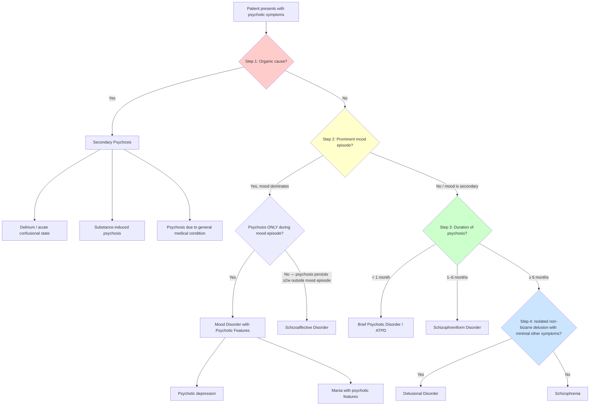

## Differential Diagnosis of Psychotic Symptoms

The single most important question when you encounter a psychotic patient is not "What type of psychosis is this?" but rather **"Is this primary (psychiatric) or secondary (medical/organic)?"** — because missing an organic cause can be fatal, and treating it as a psychiatric condition will not address the underlying pathology [2].

Think of the differential diagnosis as a funnel: you first exclude the most dangerous and reversible causes (organic), then work through psychiatric causes systematically by asking about mood, duration, and symptom profile.

### Overarching Diagnostic Algorithm

<Callout title="The Logic of This Funnel">
Each step answers a specific clinical question:
1. **Organic?** → Safety first. Exclude medical/substance causes.
2. **Mood dominates?** → If yes, this is a mood disorder with psychotic features (or schizoaffective if psychosis outlasts the mood episode).
3. **How long?** → Duration separates ATPD/brief psychotic disorder (< 1 month), schizophreniform (1–6 months), and schizophrenia (≥ 6 months).
4. **Encapsulated delusion only?** → Delusional disorder is a distinct entity with isolated, non-bizarre, systematised delusion and near-normal functioning otherwise.
</Callout>

---

### Category 1: Secondary (Organic / Medical) Psychosis

**This must always be considered and excluded first** [2][7]. The mnemonic for why: organic psychosis is **reversible** if treated and **lethal** if missed.

#### 1A. Delirium (Acute Confusional State)

| Feature | Details | Why it mimics psychosis |
|:--|:--|:--|
| Core | Acute onset, fluctuating consciousness, inattention, disorientation | Vivid hallucinations (often visual), delusions, agitation, and disorganised behaviour can closely mimic a primary psychotic disorder [7] |
| Key differentiators | ***Clouded sensorium***, ***impaired attention*** (cannot serial-7, cannot spell WORLD backwards), ***disorientation to time/place/person***, ***abnormal vital signs***, ***acute medical precipitant identifiable*** | In primary psychosis, consciousness is **clear** and orientation is **intact** (unless very late-stage) [2] |
| Common causes | Infection (UTI, pneumonia), metabolic (electrolytes, glucose, hepatic/renal failure), drugs (anticholinergics, opioids, steroids, benzodiazepine withdrawal), post-operative, hypoxia | — |

*Why does delirium cause psychotic symptoms?* Widespread cortical and subcortical dysfunction from metabolic/toxic insults disrupts normal neurotransmitter signalling — particularly acetylcholine deficiency and dopamine excess — producing hallucinations (especially visual, because the visual cortex is highly metabolically active and vulnerable), delusions, and behavioural disorganisation [7].

#### 1B. Substance-Induced Psychosis

| Substance | Mechanism | Clinical clues |
|:--|:--|:--|
| ***Cannabis*** | THC agonises CB1 receptors → increases mesolimbic dopamine release | Dose-related; high-potency strains; onset temporally related to use; paranoid ideation, AH |
| ***Amphetamines / methamphetamine*** | Directly releases dopamine and blocks reuptake → massive dopamine surge in mesolimbic pathway | Persecutory delusions, tactile hallucinations ("formication" — feeling of bugs under skin), agitation, dilated pupils, tachycardia |
| ***Cocaine*** | Blocks dopamine transporter → ↑synaptic dopamine | Similar to amphetamines; shorter duration; associated with crack cocaine use |
| ***Ketamine / PCP*** | ***NMDA receptor antagonists*** → mimics the glutamate hypofunction model of schizophrenia | Can produce full spectrum: positive symptoms, negative symptoms, disorganisation, cognitive deficits [2] |
| ***LSD / psilocybin*** | ***5-HT2A receptor agonism*** → visual hallucinations, perceptual distortions [2] | Predominantly visual and perceptual disturbances; consciousness usually preserved |
| ***Alcohol withdrawal*** | GABA withdrawal + glutamate rebound → CNS hyperexcitability | Delirium tremens: visual hallucinations (classically small animals), tremor, autonomic instability, seizures |
| ***Steroids*** | HPA axis disruption, direct CNS effects | ***Steroids, L-dopa, stimulants, antidepressants, ECT (in those with bipolar spectrum disorder) can cause manic symptoms*** [8] |

**Key differentiating principle** [2][7]: substance-induced psychosis should ***↓ after admission*** (when access to substances is removed) and ***resolve within days to weeks*** of cessation. If psychosis persists > 1 month after substance clearance, consider a primary psychotic disorder that was unmasked by the substance.

> Always obtain a ***urine toxicology screen*** in first-episode psychosis [2].

#### 1C. Psychosis Due to General Medical Conditions

This is a broad category. The key is to think **neurological**, **endocrine**, **metabolic**, **autoimmune**, and **infective**:

| Category | Conditions | Why they cause psychosis |
|:--|:--|:--|
| **Neurological** | Temporal lobe epilepsy (TLE), brain tumours (especially frontal/temporal), head injury, encephalitis (including ***anti-NMDA receptor encephalitis***), dementia (especially Lewy body dementia), Huntington's disease, HIV encephalopathy, neurosyphilis | Disruption of cortical circuits involved in reality testing; temporal lobe is critical for auditory processing and memory — lesions here can produce AH and complex delusions |
| **Endocrine** | ***Hyperthyroidism, Cushing's syndrome*** [8], Addison's disease, hyperparathyroidism (↑Ca²⁺), pheochromocytoma | Thyroid hormones modulate monoamine neurotransmission; cortisol excess (Cushing's) affects hippocampal and prefrontal function |
| **Metabolic** | Hypo/hyperglycaemia, hepatic encephalopathy, uraemia, Wilson's disease, acute intermittent porphyria, B12/folate deficiency | Global metabolic derangement → diffuse cortical dysfunction → delirium with psychotic features |
| **Autoimmune** | SLE cerebritis, anti-NMDA receptor encephalitis | Anti-NMDA receptor encephalitis is particularly important — ***young woman with psychosis + seizures + movement disorder + autonomic instability*** → think this diagnosis; antibodies against NMDA receptors mimic the glutamate hypofunction model of schizophrenia |
| **Infective** | HIV, neurosyphilis, herpes simplex encephalitis, ***Toxoplasma gondii*** | Direct neuronal invasion and/or immune-mediated damage |

<Callout title="Anti-NMDA Receptor Encephalitis" type="error">
This is a commonly tested "great mimicker." A young woman (often with an ovarian teratoma) presents with what looks like acute-onset psychosis — psychiatric symptoms predominate initially. But then she develops seizures, movement disorders (orofacial dyskinesias), autonomic instability, and reduced consciousness. The antibodies target NMDA receptors, literally creating the NMDA hypofunction state that the glutamate hypothesis proposes as a mechanism of schizophrenia. **Always consider this in young women with first-episode psychosis, especially if atypical features develop** — lumbar puncture and anti-NMDA receptor antibodies are diagnostic; treatment is immunotherapy, not antipsychotics.
</Callout>

***Frontal lobe lesions*** deserve special mention [8]: they can cause ***extreme social disinhibition without gross mood disturbance*** → mimics mania. ***Consider especially in middle-aged or older patients with expansive behaviour but no past history of affective disorder***. In younger patients, ***consider HIV infection and head injury*** [6].

**Investigations to exclude organic causes** [2]:
- Bloods: FBC, U&E, LFT, TFT, glucose, Ca²⁺, ***B12/folate, syphilis serology, ESR/CRP***
- ***ECG***: long QT (relevant to lithium, TCA, some antipsychotics)
- ***CT/MRI***: head injury, space-occupying lesion, neurological conditions
- ***EEG***: for epilepsy (especially temporal lobe)
- Urine drug screen
- Consider: lumbar puncture (encephalitis, autoimmune), HIV serology, copper/ceruloplasmin (Wilson's)

---

### Category 2: Primary Psychotic Disorders (Non-Affective)

These are the ***schizophrenia-spectrum and other non-affective psychoses*** [1].

#### 2A. Schizophrenia

The "prototypical" psychotic disorder. Distinguishing features [1][2]:

- ***Prominent psychotic symptoms lasting at least 1 month*** affecting functioning
- ***DSM-5 requires ≥6 months of disturbance*** (including prodromal/residual periods) in addition to ***≥1 month of active psychosis***
- ***Schneider's first-rank symptoms (FRS), when present, are highly suggestive*** — but ***literature showed that FRS are not specific to schizophrenia and with minimal prognostic predictive value; nonetheless, FRS are still widely applied and emphasised in current classifications*** [1]
- Content of delusions/hallucinations is often ***bizarre*** in theme (***"un-understandable" per Jaspers***) [1]
- ***The most common positive symptoms in schizophrenia and related psychoses include delusion of reference and persecution, and auditory verbal hallucination (AVH)*** [1]
- Mood disturbance, if any, is ***not concurrent with psychosis or is relatively minor*** [2]
- ***Negative symptoms are a core feature*** and a ***key determinant of functional outcome*** — represent an ***unmet therapeutic need, not responsive to antipsychotic treatment*** [1]
- ***Six symptom dimensions***: ***positive symptoms, negative symptoms, disorganisation (formal thought disorder), affective symptoms (depression/mania), motor signs (catatonia), cognitive impairment*** [1]

**Historical subtypes** (Bleuler) — ***no longer included in DSM-5*** but useful clinically [1]:
- ***Paranoid schizophrenia***: ***prominent positive symptoms***
- ***Hebephrenic (disorganised)***: ***younger age of onset, prominent thought disorder / incongruous affect, poor prognosis***
- ***Catatonic***: ***constellation of specific motor signs e.g. posturing, waxy flexibility, mutism***
- ***Simple***: ***lack of positive symptoms, gradual functional decline, prominent negative symptoms***
- ***Catatonia: not specific to schizophrenia, currently as a diagnostic specifier in DSM-5*** [1]

**Bleuler's fundamental symptoms** [1]: ***loosening of association, affect flattening, autism, ambivalence*** — these were what Bleuler considered the core ("fundamental") features, as opposed to Schneider's FRS which he considered "accessory."

DSM-5 Criteria (simplified) [2]:
> A. ≥2 of: (1) Delusions, (2) Hallucinations, (3) Disorganised speech, (4) Grossly disorganised/catatonic behaviour, (5) Negative symptoms — at least one must be (1), (2), or (3), each present for ≥1 month
> B. Functional impairment
> C. ≥6 months of continuous disturbance (including at least 1 month meeting Criterion A)
> D. Not better explained by schizoaffective or mood disorder with psychosis
> E. Not due to substance or medical condition
> F. If ASD present, prominent delusions/hallucinations for ≥1 month needed

#### 2B. Schizoaffective Disorder

- ***Concurrent schizophrenic and mood symptoms are equally prominent (fulfilling a major mood episode e.g. manic or depressive episode)*** [1]
- ***Delusions/hallucinations for ≥2 weeks outside major mood episode*** (DSM-5) — this is the key criterion that separates it from mood disorder with psychotic features [2]
- Meet mood episode criteria for ***majority of symptomatic duration***
- Functional impact ***less marked than schizophrenia*** [2]
- Prognosis ***better than schizophrenia*** (negative symptoms rarely develop) but ***worse than mood disorders*** [2]
- The validity of this as a distinct entity is ***questionable*** — it is neither genetically nor neurobiologically separated from schizophrenia or mood disorders [2]

*How to distinguish from schizophrenia:* In schizophrenia, mood disturbances are relatively minor and not concurrent with the main psychotic phase. In schizoaffective, mood and psychosis are equally prominent **and** psychosis persists even when mood normalises.

*How to distinguish from mood disorder with psychosis:* In mood disorder with psychosis, psychosis occurs **only** during mood episodes. In schizoaffective, psychosis persists for ≥2 weeks **outside** mood episodes.

#### 2C. Acute and Transient Psychotic Disorder (ATPD) / Brief Psychotic Disorder / Schizophreniform Disorder

These represent psychotic episodes that don't (yet) meet duration criteria for schizophrenia [1][2]:

| Diagnosis | Duration | Key Features |
|:--|:--|:--|
| ATPD (ICD-10/11) | ***Onset ≤2 weeks*** | ***Acute onset, complete remission, brief period (1–3 months)*** [1] |
| Brief psychotic disorder (DSM-5) | < 1 month | Often stress-precipitated |
| Schizophreniform disorder (DSM-5) | 1–6 months | Essentially "schizophrenia lite" — same symptoms, shorter duration |

***Polymorphic features (~cycloid psychosis)***: ***rapidly changing clinical pictures, prominent fluctuating mood state, perplexity*** [1] — the clinical picture shifts dramatically from day to day, which is unlike the more stable symptom profile of established schizophrenia.

*Why is this important?* Because prognosis is generally much better than schizophrenia — many patients recover completely. However, a proportion will go on to develop schizophrenia, so follow-up is essential.

#### 2D. Delusional Disorder

- ***Systematised, likely single-theme delusion, non-bizarre in nature (classic definition)*** [1]
- ***No or non-prominent hallucination*** [1]
- ***Minimal negative symptoms, reported of having better functioning*** [1]
- ***Over-represented by women and adult-onset*** [1]
- ***Relatively rare*** (lifetime risk 0.05–0.1%, median onset age 46 years) [2]
- ***Encapsulated***: behaviour unrelated to the delusion is often normal [2]
- Themes: persecutory (commonest), erotomania, jealous, somatic, grandiose [2]
- ***Presence of classical schizophrenic delusions rules out this diagnosis*** [2]
- A proportion goes on to develop full-blown schizophrenia [2]

*Why is it encapsulated?* Because the delusion is a single, circumscribed belief system that doesn't "leak" into all areas of functioning. The patient's reality testing is intact in all domains except the specific delusional theme. Think of it as a "walled-off" area of abnormal belief in an otherwise normal mind — hence the older term "paranoia."

#### 2E. Schizotypal Personality Disorder

- Part of the ***schizophrenia-spectrum*** [1][2]
- ***Attenuated*** (sub-threshold) versions of all schizophrenia symptom domains [2]:
  - Cognitive distortions (odd beliefs, magical thinking) — attenuated delusions
  - Perceptual distortions (illusions, "sixth sense") — attenuated hallucinations
  - Odd behaviour, eccentric appearance — attenuated disorganisation
  - Social isolation, few close friends — attenuated negative symptoms
- ***Patient has never met criteria for schizophrenia throughout entire life*** [2]
- Considered ***personality disorder*** in DSM-5, ***schizophrenia-like disorder*** in ICD-10 [2]
- ↑Risk of evolving into overt schizophrenia
- D/dx from ***schizoid personality disorder***: schizoid has similar social isolation but ***no cognitive/perceptual distortions*** [2]

---

### Category 3: Mood Disorders with Psychotic Features

The key principle: ***mood disturbances dominate*** the clinical picture, and ***psychosis is mood-congruent*** [2].

#### 3A. Psychotic Depression (Major Depressive Disorder with Psychotic Features)

- Current depressive episode (≥2 weeks, meeting criteria) with psychotic features [2][9]
- Psychotic features are ***mood-congruent***: nihilistic delusions ("my organs are rotting," "I have committed an unforgivable sin"), auditory hallucinations with derogatory/critical content, delusions of guilt, poverty, or deserved punishment [2]
- Graded as ***severe with psychotic symptoms*** (ICD-10: F3x.3) [9]
- *Why does severe depression cause psychosis?* When the monoamine deficit (serotonin, norepinephrine, dopamine) becomes severe enough, the downstream effect on mesolimbic and mesocortical circuits can produce frank psychotic symptoms. Additionally, the HPA axis hyperactivation (cortisol excess) in severe depression has neurotoxic effects on the hippocampus and prefrontal cortex, further impairing reality testing.

#### 3B. Mania with Psychotic Features

- Manic episode with psychotic symptoms — indicates ***severe mania*** [8]
- ***Presence of psychotic symptoms (mood-congruent or mood-incongruent)*** [8]
- Psychotic features are usually ***mood-congruent***: ***grandiose delusions*** (believe one is a religious prophet), ***persecutory delusions*** (especially when mood is irritable — "they are conspiring against me because of my supreme status"), ***delusions of reference, passivity*** [6]
- ***Note: 10–20% of manic patients have first-rank symptoms*** but these are usually ***fleeting*** [6]
- ***Hallucinations usually mood-congruent***: voices speaking about special powers, visions with religious content [6]

<Callout title="Mania vs Schizophrenia: The Most Difficult Distinction" type="error">
***Manic episode with psychotic symptoms is frequently misdiagnosed as schizophrenia*** [8]. This matters enormously because treatment is fundamentally different (mood stabilisers vs antipsychotics alone) and ***misdiagnosis delays correct treatment by 5–7 years on average*** [8].

Key distinguishing features (from the DDx table) [6]:

| Feature | Mania with Psychosis | Schizophrenia |
|:--|:--|:--|
| Psychotic symptoms | Usually mood-congruent, ***change quickly in content***, ***seldom outlast mood disruption*** | Mood-incongruent, bizarre, with passivity/thought alienation |
| Formal thought disorder | ***Circumstantiality, tangentiality, flight of ideas*** (logical links preserved) | ***Loosening of association, neologism, thought blocking*** |
| Speech | ***Pressured, difficult to interrupt*** | ***More hesitant/halting*** |
| Biological | ***↓Need for sleep*** (feel energetic), ***hyperactive*** | Less ↓need for sleep, less hyperactive |
| Motor | Predominantly agitation | May have catatonia or negative symptoms in addition |
| Course | ***Episodic*** with inter-episode recovery | Usually chronic/relapsing |
| FRS | If present, ***fleeting*** (10–20%) | More persistent and prominent |
</Callout>

#### 3C. Schizoaffective Disorder (Revisited)

Listed here again because schizoaffective sits at the boundary between mood disorders and schizophrenia. The distinguishing principle:
- **Mood disorder with psychosis**: psychosis occurs ***only*** during mood episodes
- **Schizoaffective**: psychosis ***persists ≥2 weeks outside*** mood episodes, but mood episodes are prominent
- **Schizophrenia**: mood disturbance is ***minor or absent***

---

### Category 4: Other Psychiatric Disorders That Can Present with Psychotic-Like Symptoms

These don't produce "true" psychosis in the strict sense but can be mistaken for it:

| Condition | How it mimics psychosis | Key differentiator |
|:--|:--|:--|
| ***PTSD / acute stress disorder*** | Flashbacks (can resemble hallucinations), hypervigilance (can resemble paranoia), dissociative symptoms | Clear temporal relationship to trauma; flashbacks are re-experiencing of actual events, not novel perceptions; consciousness is not clouded [7] |
| ***OCD*** | Severe obsessions can approach delusional intensity (overvalued ideas); patients may report "hearing" intrusive thoughts | Patient typically recognises thoughts as their own (ego-dystonic); reality testing preserved (though may be poor in severe OCD with poor insight) |
| ***Borderline personality disorder*** | Transient, stress-related paranoid ideation or dissociative symptoms (DSM-5 criterion 9 for BPD); ***prominent affective instability mimics rapid cycling bipolar*** [6] | Symptoms are ***brief*** (hours, not days/weeks), ***triggered by interpersonal stress***, and resolve when stressor passes; ***no classic mania features (↑energy, grandiosity, ↓need for sleep)*** [6]; ***mood shifts over hours/days*** (not weeks) |
| ***ADHD*** | ***↓Attention, difficulty with task completion, ↑energy, disinhibited behaviour*** mimic hypomania [6][8] | ***Should NOT have ↑self-esteem, grandiosity, flight of ideas, ↓need for sleep***; ***course is chronic (trait-like) rather than episodic*** [6] |
| ***Severe anxiety disorders*** | Anxiety secondary to delusions in schizophrenia vs primary anxiety disorder | Note the ***theme/focus of anxiety***: fear of poisoning → paranoid schizophrenia; obsessional thoughts → OCD; worry about weight → eating disorder; feelings of worthlessness → depression [7] |
| ***Dissociative disorders*** | Altered perception of reality, depersonalisation/derealisation | Reality testing is preserved; patient describes experiences as "unreal" (they know something is off) |

<Callout title="Differential Diagnosis of Manic Episode" type="idea">
***Differential diagnosis of manic episode*** (from lecture slides) [8]:
1. ***Depressive disorder with irritability and anxious distress***
2. ***Psychotic disorder or schizoaffective disorder***
3. ***Substance/medication-induced/medical conditions***
4. ***Attention deficit and hyperactivity disorder***
5. ***Personality disorder with prominent irritability***

***Drugs and medical conditions that cause manic symptoms*** [8]:
- ***Steroids, L-dopa, stimulants, antidepressants, ECT (in those with bipolar spectrum disorder)***
- ***Cocaine, amphetamine***
- ***Frontal lobe lesion, hyperthyroidism, Cushing's syndrome***
</Callout>

---

### Category 5: Normal and Subclinical Experiences

It is important to recognise that:
- ***Psychotic-like experiences*** (hearing one's name called, fleeting paranoid thoughts, sleep-onset hallucinations) are common in the general population (~5–8%) and do not constitute a disorder
- ***Grief-related hallucinations*** (hearing the deceased's voice) are common and normal in bereavement
- ***Cultural/religious experiences*** (visions, speaking in tongues) must be assessed in context — they are not psychosis if consistent with the person's cultural/religious background (remember: delusions are "out of keeping with social and cultural background")

---

### Summary Table: Key Differentiating Features

| Diagnosis | Duration | Mood | Hallucination Type | Delusion Character | Functioning | Consciousness |
|:--|:--|:--|:--|:--|:--|:--|
| **Organic psychosis** | Variable | Variable | Often ***visual*** | Poorly formed, fleeting | Impaired | ***Clouded*** |
| **Substance-induced** | Resolves with cessation | Variable | Variable | Variable | Impaired during use | May be clouded |
| **Schizophrenia** | ***≥6 months*** | Minor/absent | ***Auditory*** (FRS) | ***Bizarre***, systematised | ***Significantly impaired*** | Clear |
| **Schizoaffective** | Variable | ***Equally prominent*** | Auditory | Variable | Less impaired than SZ | Clear |
| **ATPD/Brief psychotic** | ***< 1 month*** | ***Fluctuating*** | Variable | ***Polymorphic*** | Acutely impaired | Clear |
| **Delusional disorder** | ***≥1 month (DSM-5)*** | Normal | ***Minimal/absent*** | ***Non-bizarre, single-theme*** | ***Relatively preserved*** | Clear |
| **Psychotic depression** | ≥2 weeks | ***Depressed*** | Derogatory voices | ***Mood-congruent*** (nihilistic, guilt) | Impaired | Clear |
| **Mania with psychosis** | ≥1 week | ***Elated/irritable*** | Mood-congruent | ***Mood-congruent*** (grandiose) | Impaired | Clear |
| **Schizotypal PD** | ***≥2 years (trait)*** | Constricted | ***Attenuated*** (illusions) | ***Attenuated*** (odd beliefs) | Mildly impaired | Clear |

---

### Approach to DDx in Exam-Style Clinical Vignettes

When presented with a case, systematically work through this checklist:

1. **Exclude organic causes**: Age > 40? Visual hallucinations? Fluctuating consciousness? Abnormal vitals? New neuro signs? Substance history? → Investigate accordingly
2. **Assess mood**: Is there a prominent depressive or manic episode? Is the psychosis mood-congruent? Does it persist outside mood episodes?
3. **Duration**: < 1 month → ATPD/brief psychotic disorder. 1–6 months → schizophreniform. ≥6 months → schizophrenia
4. **Delusion quality**: Isolated, non-bizarre, encapsulated with preserved functioning → delusional disorder. Bizarre, multiple, with negative symptoms → schizophrenia
5. **Formulate differentials**: List "For" and "Against" points for each diagnosis (as in the psychiatric formulation framework [2])

Example formulation approach [2]:

| Differential | For | Against |
|:--|:--|:--|
| Schizophrenia | Symptoms > 1 month; FRS present; bizarre delusions; functional decline | — |
| Schizoaffective disorder | Typical schizophrenic symptoms present | No prominent concurrent mood episode |
| Mood disorder with psychotic features | — | Mood not primarily lowered/elevated; mood-incongruent psychosis |
| Substance-induced psychosis | — | No evidence of substance use; symptoms persistent |
| Organic psychosis | — | No medical illness; normal physical examination |

---

<Callout title="High Yield Summary — Differential Diagnosis of Psychotic Symptoms">

1. **Always exclude organic causes first** — especially delirium, substance-induced psychosis, and medical conditions (TFT, glucose, B12, syphilis, neuroimaging).

2. **Visual hallucinations + clouded consciousness + disorientation = think organic**, not primary psychosis.

3. **Mood-congruent psychosis that occurs only during mood episodes = mood disorder with psychotic features**. Psychosis persisting ≥2 weeks outside mood episodes = schizoaffective.

4. **Duration hierarchy**: ATPD (< 1 month) → schizophreniform (1–6 months) → schizophrenia (≥ 6 months).

5. **Delusional disorder**: isolated, single-theme, non-bizarre delusion; minimal other symptoms; preserved functioning.

6. **Mania with psychosis is commonly misdiagnosed as schizophrenia** — look for episodic course, mood-congruent delusions, flight of ideas (logical links preserved), pressured speech, ↓need for sleep.

7. **Anti-NMDA receptor encephalitis** is the great mimicker in young women with new-onset psychosis — always consider if atypical features develop (seizures, movement disorder, autonomic instability).

8. **FRS are not pathognomonic** for schizophrenia — they occur in mania (10–20%, fleeting) and other psychoses. But they remain widely applied in classification.

</Callout>

---

<ActiveRecallQuiz
  title="Active Recall - Differential Diagnosis of Psychotic Symptoms"
  items={[
    {
      question: "A 25-year-old man presents with persecutory delusions, third-person auditory hallucinations, and social withdrawal for 8 months. His mood is described as 'flat' and there is no prominent depressive or manic episode. What is the most likely diagnosis, and list two differential diagnoses with 'For' and 'Against' points for each.",
      markscheme: "Most likely: Schizophrenia (For: symptoms > 6 months, FRS present with 3rd person AH, negative symptoms with social withdrawal, no prominent mood episode, functional decline). DDx 1: Schizoaffective disorder (For: psychotic symptoms present; Against: no prominent concurrent mood episode). DDx 2: Substance-induced psychosis (Against: duration 8 months exceeds expected clearance time; need urine tox screen to exclude)."
    },
    {
      question: "List five clinical features that distinguish organic (secondary) psychosis from primary psychiatric psychosis.",
      markscheme: "1. Clouded or fluctuating consciousness (vs clear in psychiatric). 2. Disorientation to time/place/person (vs oriented). 3. Visual hallucinations predominate (vs auditory). 4. Abnormal vital signs. 5. Acute onset, often in older patients (> 40). Also accept: impaired attention, identifiable medical precipitant, no psychiatric history/family history, new neurological signs."
    },
    {
      question: "How do you distinguish mania with psychotic features from schizophrenia? Give at least four differentiating features.",
      markscheme: "1. Delusions in mania are mood-congruent (grandiose/persecutory related to status) and change quickly; in schizophrenia they are bizarre and persistent. 2. FTD in mania shows flight of ideas with preserved logical links; in schizophrenia, loosening of association and neologisms. 3. Speech in mania is pressured and difficult to interrupt; in schizophrenia more hesitant. 4. Mania has marked decreased need for sleep with preserved energy; less prominent in schizophrenia. 5. Course is episodic in bipolar vs chronic in schizophrenia. 6. FRS if present in mania are fleeting (10-20%)."
    },
    {
      question: "What is the key criterion that separates schizoaffective disorder from a mood disorder with psychotic features?",
      markscheme: "In schizoaffective disorder, delusions or hallucinations must be present for at least 2 weeks in the ABSENCE of a major mood episode (psychosis persists outside mood episodes). In mood disorder with psychotic features, psychosis occurs ONLY during mood episodes and resolves when the mood episode resolves."
    },
    {
      question: "A 48-year-old woman believes her neighbours are secretly recording her conversations. She has held this belief for 6 months. She has no hallucinations, no negative symptoms, and functions normally at work. What is the most likely diagnosis and what are two key features that distinguish it from schizophrenia?",
      markscheme: "Most likely: Delusional disorder. Key features: (1) Delusion is non-bizarre and single-theme (persecutory) — vs bizarre, multiple delusions in schizophrenia. (2) No or minimal hallucinations, no negative symptoms, and relatively preserved functioning — vs significant functional impairment and multi-domain symptoms in schizophrenia. Presence of classical schizophrenic delusions (e.g. thought insertion, passivity) would rule out delusional disorder."
    },
    {
      question: "Name three drugs or medical conditions that can cause manic symptoms (and therefore psychotic features secondary to mania).",
      markscheme: "Any three of: Steroids, L-dopa, stimulants (amphetamine, cocaine), antidepressants, ECT (in bipolar spectrum), frontal lobe lesion, hyperthyroidism, Cushing syndrome. Cannabis can also precipitate psychotic symptoms via mesolimbic dopamine pathway."
    }
  ]}
/>

## References

[1] Lecture slides: GC 170. Schizophrenia and related psychoses.pdf (p2, p7, p8, p9, p10, p22)
[2] Senior notes: ryanho-psych.md (sections 6.1, 6.2, 2.2.4)
[6] Senior notes: ryanho-psych.md (sections 7.3, 7.1.2)
[7] Senior notes: ryanho-psych.md (sections 4.1, 8.4.1)
[8] Lecture slides: GC 163. I am a superman Bipolar disorder.pdf (p10, p11, p12, p18)
[9] Senior notes: ryanho-psych.md (section 7.1.1)
