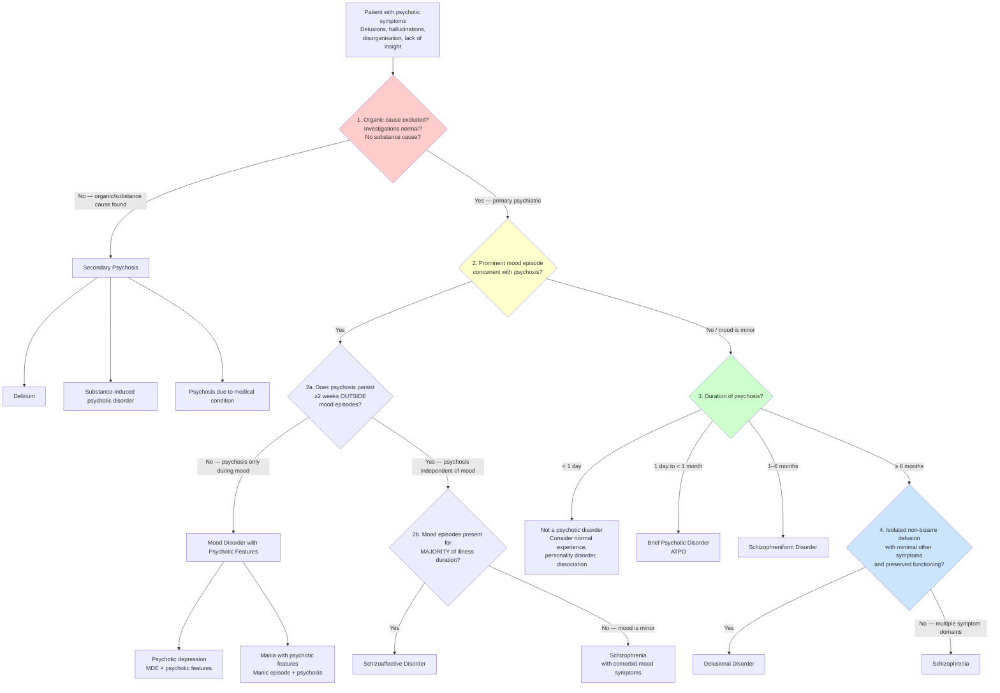
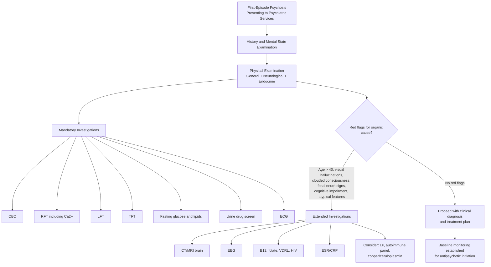

## Diagnostic Criteria for Psychotic Disorders

Diagnosis in psychiatry is fundamentally **clinical** — there is no blood test or imaging study that confirms "schizophrenia" or "schizoaffective disorder." Instead, we rely on **pattern recognition**: a specific cluster of symptoms, present for a defined duration, causing functional impairment, after excluding organic and substance-related causes. This is why diagnostic criteria exist — they provide standardised, reliable thresholds for what "counts" as a given disorder [2][10].

Two classification systems are in widespread use:
- **ICD-10/11** (WHO) — used in Hong Kong's public hospital system (HA coding)
- **DSM-5** (APA) — widely used in research and clinical practice globally

The key philosophical point: ***diagnostic criteria usually consist of*** [10]:
1. ***Cluster of symptoms*** — core (discriminating) symptoms present in the defined disorder but seldom in others, plus associated (characteristic) symptoms
2. ***Minimal duration of symptoms***
3. ***Distress or impairment in functioning***
4. ***Exclusion criteria*** (organic causes, substance use, other psychiatric disorders)

There is also a ***hierarchy of diagnosis*** [10]: when symptoms can be explained by multiple diagnoses, the higher-order diagnosis takes precedence (organic > psychotic > mood > anxiety > personality), because ***treatment of the higher-order disorder often leads to resolution of symptoms at the lower order, but not vice versa***.

---

### 1. Diagnostic Criteria for Schizophrenia

This is the most important set of criteria to know for exams. Both ICD-10 and DSM-5 criteria are presented side-by-side because they differ in important ways.

#### DSM-5 Criteria for Schizophrenia [2]

> **A.** ***Two or more*** of the following, each present for a ***significant portion of time during a 1-month period*** (or less if successfully treated). ***At least one must be (1), (2), or (3)***:
> 1. ***Delusions***
> 2. ***Hallucinations***
> 3. ***Disorganised speech*** (e.g., frequent derailment or incoherence)
> 4. ***Grossly disorganised or catatonic behaviour***
> 5. ***Negative symptoms*** (i.e., diminished emotional expression or avolition)
>
> **B.** ***Impaired level of functioning*** in one or more domain (e.g., work, relationships) for a significant portion of time since onset. In childhood/adolescence onset, failure to achieve expected functioning.
>
> **C.** Continuous signs of disturbance persist for ***at least 6 months***. This 6-month period must include ***at least 1 month*** of symptoms meeting Criterion A (active-phase symptoms).
>
> **D.** ***Not better explained by schizoaffective disorder or mood disorder with psychotic features.***
>
> **E.** ***Not attributable to substance or medical condition.***
>
> **F.** If there is a history of ***autism spectrum disorder***, the additional diagnosis of schizophrenia requires ***prominent delusions or hallucinations for ≥1 month***, in addition to other required symptoms.

#### ICD-10 Criteria for Schizophrenia (F20) [2]

> Symptoms must be ***clearly present for most of the time during ≥1 month***:
>
> ***At least ONE*** of major symptoms (a–d, which map to Schneider's FRS):
> - **(a)** ***Thought echo, thought insertion or withdrawal, and thought broadcasting*** (delusions of thought alienation)
> - **(b)** ***Delusions of control, influence, or passivity*** clearly referred to body/limb movements or specific thoughts, actions, sensations; ***delusional perception***
> - **(c)** ***Hallucinatory voices*** giving a ***running commentary***, or ***discussing the patient among themselves***, or other hallucinatory voices coming from some part of the body
> - **(d)** ***Persistent delusions*** that are ***culturally inappropriate and completely impossible*** (i.e., bizarre)
>
> OR ***at least TWO*** of lesser symptoms (e–i):
> - **(e)** Persistent hallucinations in any modality, accompanied by fleeting delusions or persistent overvalued ideas
> - **(f)** Breaks or interpolations in thought → ***incoherence, irrelevant speech, neologisms***
> - **(g)** ***Catatonic behaviour*** (excitement, posturing, waxy flexibility, negativism, mutism, stupor)
> - **(h)** ***Negative symptoms*** (marked apathy, paucity of speech, blunting/incongruity of emotional responses → social withdrawal) — ***must be clear these are not due to depression or neuroleptic medication***
> - **(i)** Significant and consistent change in ***overall quality of personal behaviour*** (loss of interest, aimlessness, idleness, self-absorbed attitude, social withdrawal)

<Callout title="DSM-5 vs ICD-10: Key Differences for Exams" type="error">

| Feature | ICD-10 | DSM-5 |
|:--|:--|:--|
| **Duration** | ***1 month*** of symptoms | ***1 month*** of active symptoms + ***6 months*** total disturbance |
| **FRS emphasis** | ***Major symptoms (a–d) are essentially FRS*** — only ONE needed | FRS not given special weighting; need ≥2 of any 5 criteria with ≥1 being delusions, hallucinations, or disorganised speech |
| **Minimum symptoms** | 1 major OR 2 lesser | 2 of 5, with at least 1 from top 3 |
| **Functional impairment** | Implied but not an explicit criterion | ***Explicit criterion (B)*** |
| **Subtypes** | Retains subtypes (paranoid, hebephrenic, catatonic, simple) | ***Subtype classification no longer included in DSM-5*** [1] |

The practical implication: ICD-10 gives more weight to FRS and requires a shorter duration (1 month vs 6 months). DSM-5 is more conservative — the 6-month requirement means some patients diagnosed with schizophrenia under ICD-10 would only qualify for "schizophreniform disorder" under DSM-5.

***Catatonia: not specific to schizophrenia, currently a diagnostic specifier in DSM-5*** [1] — meaning it can be applied to any condition (schizophrenia, mood disorders, medical conditions).
</Callout>

---

### 2. Diagnostic Criteria for Schizoaffective Disorder (DSM-5) [2]

> **A.** ***Major mood episode (manic or depressive) concurrent with active-phase symptoms of schizophrenia*** (Criterion A of schizophrenia)
>
> **B.** ***Delusions or hallucinations for ≥2 weeks in the absence of a major mood episode*** during the lifetime duration of the illness
>
> **C.** Symptoms meeting criteria for a major mood episode are present for the ***majority of the total duration*** of the active and residual portions of the illness
>
> **D.** ***Not attributable to substance or medical condition***

*Why does Criterion B matter?* It is the **defining** criterion that separates schizoaffective from mood disorder with psychotic features. If psychosis ONLY occurs during mood episodes, the diagnosis is mood disorder with psychosis. If psychosis persists for ≥2 weeks **without** any mood episode, then there's an independent psychotic process — hence schizoaffective.

*Why does Criterion C matter?* It separates schizoaffective from schizophrenia. In schizophrenia, mood symptoms are relatively minor. In schizoaffective, mood episodes must be present for the **majority** of the illness duration — if mood symptoms are only brief, the diagnosis is schizophrenia with comorbid mood symptoms, not schizoaffective.

---

### 3. Diagnostic Criteria for Brief Psychotic Disorders / ATPD / Schizophreniform Disorder

These exist because not every psychotic episode becomes schizophrenia. The key differentiator is **duration** [1][2]:

| Diagnosis | Classification | Duration Criteria | Key Features |
|:--|:--|:--|:--|
| ***Brief psychotic disorder*** | DSM-5 | ***≥1 psychotic symptom for ≥1 day but < 1 month*** with eventual return to premorbid functioning | May be precipitated by acute stress |
| ***Acute and transient psychotic disorder (ATPD)*** | ICD-10/11 | ***Acute onset (≤2 weeks)***, complete recovery within ***2–3 months*** | ***Polymorphic features (~cycloid psychosis): rapidly changing clinical pictures, prominent fluctuating mood state, perplexity*** [1] |
| ***Schizophreniform disorder*** | DSM-5 | Meeting schizophrenia Criterion A for ***> 1 month but < 6 months*** | Essentially "early schizophrenia" — if symptoms persist beyond 6 months, reclassify as schizophrenia |

*Why do these entities exist?* Because prognosis is fundamentally different. Many patients with brief psychotic episodes recover completely and never relapse. Labelling them as "schizophrenia" would be prognostically inaccurate and potentially harmful (stigma, unnecessary long-term treatment). However, a proportion will go on to develop schizophrenia, so follow-up is essential.

---

### 4. Diagnostic Criteria for Delusional Disorder

| Feature | ICD-10 | DSM-5 |
|:--|:--|:--|
| Duration | ***≥3 months*** | ***≥1 month*** |
| Delusion type | ***Non-bizarre***, ***systematised***, ***single-theme*** [1] | Non-bizarre (with "bizarre" specifier available) |
| Other psychotic symptoms | ***No or non-prominent hallucination*** [1]; ***minimal negative symptoms*** | Apart from the direct impact of delusions, functioning is not markedly impaired |
| Exclusion | ***Presence of classical schizophrenic delusions rules out this diagnosis*** [2] | Criterion A for schizophrenia has never been met (apart from delusions) |

---

### 5. Diagnostic Criteria for Mood Episodes with Psychotic Features

#### DSM-5 Criteria for Manic Episode [8]

> ***A distinct period of elevated, expansive, or irritable mood and increased goal-directed activity lasting at least 1 week*** (or any duration if hospitalisation required)
>
> ***Three or more*** of (4 if mood is only irritable):
> 1. ***Inflated self-esteem or grandiosity***
> 2. ***Decreased need for sleep***
> 3. ***Pressured speech***
> 4. ***Flight of ideas / racing thoughts***
> 5. ***Distractibility***
> 6. ***Increased goal-directed activity*** (socially, at work/school, or sexually) / ***psychomotor agitation***
> 7. ***Excessive involvement in pleasurable activities*** (buying sprees, sexual indiscretions, foolish business investments)
>
> ***Marked impairment in functioning, observable by others, to necessitate hospitalisation, or there are psychotic symptoms***
>
> ***Not due to alcohol, substance, or medical conditions*** [8]

> The presence of psychotic features = ***mania with psychotic features*** = severe mania requiring hospitalisation [8].

#### DSM-5 Criteria for Hypomanic Episode [8]

> ***At least 4 days*** of elevated, expansive, or irritable mood ***and increased activity or energy***
>
> ***3 or more of manic symptoms*** (same list as above)
>
> ***Change in functioning observable by others but NOT severe enough to cause marked impairment, to necessitate hospitalisation, and there are NO psychotic symptoms*** [8]

<Callout title="Mania vs Hypomania: The Key Distinction" type="idea">
The distinction is one of **severity and consequence**, not symptom type:
- **Hypomania**: noticeable change, but the person can still function. ***No psychotic features, no hospitalisation needed***. Duration ≥4 days [8].
- **Mania**: severe impairment, may require hospitalisation, ***may have psychotic features***. Duration ≥1 week (or any duration if hospitalised) [8].

***Hypomanic episodes are often missed by patients and doctors, resulting in delayed diagnosis*** [8]. This is why ***bipolar II is commonly misdiagnosed as major depressive disorder*** and ***correct diagnosis and treatment is delayed by 5–7 years on average*** [8].
</Callout>

#### Depressive Episode with Psychotic Features

ICD-10 grades depressive episodes as mild, moderate, severe, and ***severe with psychotic symptoms (F3x.3) if delusion, hallucination, or depressive stupor is present*** [9].

DSM-5 uses specifiers: ***with psychotic features*** (mood-congruent or mood-incongruent), ***with catatonia***, ***with peripartum onset***, ***with seasonal pattern***, etc. [9]

---

### 6. Course and Staging of Psychotic Illness

Understanding the natural history is critical for knowing *when* to apply each diagnostic criterion [1][2]:

***Development and course of schizophrenia*** [1]:

| Phase | Timing | Features |
|:--|:--|:--|
| ***Premorbid phase*** | ***Childhood*** | Subtle motor, cognitive, and social deficits (supports neurodevelopmental hypothesis) |
| ***Prodrome*** (***at-risk mental state, ARMS / clinical high-risk, CHR***) | ***Adolescence and early adulthood*** | Attenuated psychotic symptoms, functional decline, may herald overt psychosis in 2–3 years ***or may resolve*** (***no transition to psychosis*** is also possible) [1][2] |
| ***First psychotic episode (FEP)*** | ***Onset of psychosis*** | ***Golden window for intervention → early intervention paradigms*** [2] |
| ***Longitudinal course of illness*** | Variable | Outcomes range from ***fully recovered*** to ***residual deficits*** [1] |
| ***Residual schizophrenia*** | ≥1 year | Chronic negative symptoms preceded by ≥1 prior psychotic episode [2] |

---

## Diagnostic Algorithm

The following algorithm integrates the diagnostic criteria into a practical clinical decision pathway. At each node, you're asking a specific question that corresponds to a specific criterion or exclusion rule:

**How to use this algorithm:**

1. **Red zone (Step 1)**: Always start here. ***Exclude organic and substance causes*** before any psychiatric diagnosis. This corresponds to DSM-5 Criterion E for schizophrenia ("not attributable to substance or medical condition") and is the highest priority in the ***hierarchy of diagnosis*** [10].

2. **Yellow zone (Step 2)**: If primary psychiatric, ask about mood. This determines whether you're dealing with a mood disorder with psychosis, schizoaffective disorder, or a non-affective psychosis. Corresponds to DSM-5 Criterion D for schizophrenia ("not better explained by schizoaffective or mood disorder with psychotic features").

3. **Green zone (Step 3)**: Duration separates the brief psychotic disorders from schizophrenia. This corresponds to DSM-5 Criterion C (6-month duration).

4. **Blue zone (Step 4)**: Among chronic psychoses, the pattern of symptoms separates delusional disorder from schizophrenia.

---

## Investigation Modalities

Investigations in psychosis serve **three purposes** [2][10]:
1. **Exclude secondary (organic) causes** — the most important reason
2. **Establish baseline** before starting medications (especially antipsychotics, lithium)
3. **Screen for neglect and comorbidities** (malnutrition, infections, metabolic syndrome)

There is no investigation that "diagnoses" a primary psychotic disorder. The diagnosis is always clinical.

### Mandatory First-Line Investigations

| Investigation | What You're Looking For | Key Findings and Interpretation | Why |
|:--|:--|:--|:--|
| ***CBC*** | ***↓Hb (anaemia)***, ***↑MCV (alcoholism — macrocytosis from folate deficiency/direct toxicity)***, ***↑WBC (infection as cause of delirium)*** [2][10] | Anaemia can cause fatigue/cognitive symptoms mimicking negative symptoms; macrocytosis in a young psychotic patient should trigger alcohol/B12 workup | Screen for organic cause + baseline before clozapine (which causes agranulocytosis) |
| ***Renal function tests (RFT)*** | ***U/Cr (uraemic encephalopathy)***, ***Ca²⁺ (mood changes/psychosis)*** [2][10] | ↑Urea/Cr → uraemia → delirium with psychotic features; ↑Ca²⁺ → primary hyperparathyroidism → depression, psychosis, cognitive impairment ("bones, stones, groans, and psychiatric moans") | Organic screen + baseline for lithium (which is renally excreted) |
| ***Liver function tests (LFT)*** | ***Albumin (malnutrition)***, ***↑GGT (alcoholism)***, ***liver enzymes, ammonia (hepatic encephalopathy)*** [2][10] | Hepatic encephalopathy presents with fluctuating consciousness and psychotic features; ↓albumin suggests self-neglect/malnutrition in chronic psychosis | Organic screen + baseline for hepatically metabolised drugs |
| ***Thyroid function tests (TFT)*** | ***Hypo- and hyperthyroidism*** [2][10] | Hypothyroidism → depression, psychomotor retardation, cognitive slowing (mimics negative symptoms/psychotic depression). Hyperthyroidism → agitation, anxiety, even frank psychosis ("thyroid storm"). Also critical for ***lithium monitoring*** (lithium causes hypothyroidism) | Organic screen + baseline |
| ***Urine drug screen / serum toxicology*** | ***Substance-induced psychosis*** [2][10] | Positive for cannabis, amphetamines, cocaine, opioids, benzodiazepines, ketamine. Essential in ***first-episode psychosis*** and any atypical presentation | If positive: substance-induced psychosis is higher in the diagnostic hierarchy |
| ***Fasting glucose / HbA1c*** | Baseline metabolic screen [10] | Many 2nd-generation antipsychotics (especially ***olanzapine, clozapine***) cause metabolic syndrome (weight gain, insulin resistance, dyslipidaemia). Also: hypoglycaemia can cause acute confusion with psychotic features | Baseline before antipsychotic initiation + organic screen |
| ***Fasting lipid profile*** | Baseline metabolic screen | As above — antipsychotic-related metabolic syndrome | Baseline |

### Targeted Investigations (Based on Clinical Suspicion)

| Investigation | When to Order | Key Findings | Interpretation |
|:--|:--|:--|:--|
| ***B12 / folate*** | Elderly, vegan/vegetarian, alcoholism, macrocytic anaemia, cognitive impairment [2][10] | ↓B12 → megaloblastic anaemia + subacute combined degeneration of the cord + ***psychosis and cognitive decline*** | B12 deficiency is a reversible cause of psychosis and dementia — always check in elderly first-episode psychosis |
| ***Syphilis serology (VDRL/RPR + confirmatory FTA-ABS)*** | All first-episode psychosis (especially in Hong Kong where neurosyphilis still occurs), cognitive decline, neurological signs [2][10] | Positive serology + CSF abnormalities → neurosyphilis | ***Neurosyphilis*** (general paresis of the insane) classically presents with grandiose delusions, personality change, and progressive dementia — one of the great historical mimickers of psychiatric illness |
| ***HIV serology*** | Risk factors, young patient with new-onset psychosis, cognitive decline [2] | HIV encephalopathy can present with psychosis | Direct CNS infection + opportunistic infections |
| ***ESR / CRP*** | Suspected autoimmune or infective cause [2][10] | ↑inflammatory markers → consider SLE cerebritis, vasculitis, autoimmune encephalitis | Non-specific but guides further workup |
| ***ECG*** | ***Before starting antipsychotics, lithium, or TCAs*** [2][10] | ***Long QT interval*** → risk of torsades de pointes and sudden cardiac death | Many antipsychotics (especially haloperidol IV, ziprasidone) and ***lithium, TCAs prolong QT*** [10]. Baseline ECG is mandatory before initiation. If QTc > 500 ms, avoid QT-prolonging drugs |
| ***CT / MRI brain*** | First-episode psychosis (especially atypical), ***suspected neurological condition***, ***cognitive deficits***, age > 40, focal neurological signs [2][10] | Space-occupying lesion (tumour), demyelination (MS), temporal lobe pathology (epilepsy focus), ventriculomegaly, cerebral atrophy | MRI is preferred over CT for detail. In schizophrenia research, ***↑ventricular volume*** and ***↓grey matter volume*** (especially temporal and prefrontal) are seen, but these are NOT diagnostic in clinical practice |
| ***EEG*** | Suspected ***epilepsy*** (especially temporal lobe epilepsy), fluctuating consciousness, atypical presentations [2][10] | Epileptiform discharges, temporal lobe focus | Temporal lobe epilepsy (TLE) is the epilepsy type most commonly associated with psychosis ("interictal psychosis" or "postictal psychosis") — the temporal lobe is involved in auditory processing and memory |
| ***Lumbar puncture + CSF analysis*** | Suspected encephalitis (especially ***anti-NMDA receptor encephalitis***), meningitis, neurosyphilis | CSF pleocytosis, protein elevation, specific antibodies (anti-NMDA-R Ab), oligoclonal bands | Young woman + new-onset psychosis + seizures + movement disorder → anti-NMDA receptor Ab in CSF is diagnostic |
| ***Autoimmune panel*** | Suspected autoimmune encephalitis or SLE cerebritis | Anti-NMDA-R Ab, ANA, anti-dsDNA, complement levels | — |
| ***Copper / ceruloplasmin*** | Young patient with psychosis + movement disorder + liver disease | ↓Ceruloplasmin, ↑free copper, ↑24h urinary copper | Wilson's disease (hepatolenticular degeneration) — treatable cause of psychosis with extrapyramidal features |

### Screening and Rating Scales

While not "investigations" in the laboratory sense, structured assessments are integral to diagnosis and monitoring:

| Scale | Purpose | Details |
|:--|:--|:--|
| ***Mood Disorder Questionnaire (MDQ)*** | Screen for bipolar disorder | Self-report; useful when hypomania is suspected but not clearly reported [6] |
| ***Hypomania Checklist (HCL-32)*** | Screen for hypomania | Self-report; ***hypomanic episodes are often missed by patients and doctors*** [8] |
| ***PANSS*** (Positive and Negative Syndrome Scale) | Quantify symptom severity in schizophrenia | 30-item clinician-rated scale: 7 positive, 7 negative, 16 general psychopathology items |
| ***BPRS*** (Brief Psychiatric Rating Scale) | Quick assessment of psychotic symptoms | 18-item clinician-rated scale |
| ***CGI*** (Clinical Global Impression) | Global severity and improvement | Clinician-rated; used in clinical trials |
| ***GAF*** (Global Assessment of Functioning) | Functional assessment | Score 0–100; required in DSM-IV multiaxial system |

### Investigation Algorithm for First-Episode Psychosis

<Callout title="Investigations Are for Exclusion, Not Confirmation">
In primary psychotic disorders, ***all investigations are expected to be normal***. You investigate to ***rule out*** secondary causes and to ***establish baseline*** before treatment. A positive finding on any investigation should make you reconsider whether this is truly a primary psychotic disorder. The diagnosis of schizophrenia, schizoaffective disorder, delusional disorder, etc., is made ***clinically*** based on history, mental state examination, and observed course over time — not by any laboratory test or imaging finding [2].
</Callout>

<Callout title="Clozapine-Specific Monitoring" type="idea">
If a patient is started on ***clozapine*** (the gold standard for treatment-resistant schizophrenia), additional mandatory monitoring is required:
- ***Mandatory regular CBC*** — clozapine can cause ***agranulocytosis*** (risk ~1%, usually in first 18 weeks). In Hong Kong, the Clozapine Patient Monitoring Service (CPMS) requires:
  - Weekly FBC for first 18 weeks
  - Then every 2 weeks for 1 year
  - Then monthly for life
- If absolute neutrophil count (ANC) < 1.5 × 10⁹/L → withhold and investigate; < 0.5 × 10⁹/L → discontinue permanently
- Also monitor: fasting glucose, lipids, weight, waist circumference (metabolic syndrome), troponin/CRP if myocarditis suspected (fever + tachycardia + chest pain in first month)
</Callout>

---

### Putting It All Together: How to Approach Diagnosis in a Clinical Vignette

When presented with a patient with psychotic symptoms in an exam:

**Step 1: Describe the psychopathology accurately** [10]
- Identify the ***form*** of symptoms (e.g., auditory hallucination, persecutory delusion, formal thought disorder)
- ***Form assists in making diagnosis; content is more useful for management*** [10]
- Note whether features are consistent with ***Schneider's FRS*** [1] — while ***FRS are not specific to schizophrenia and have minimal prognostic predictive value, they are still widely applied and emphasised in current classifications*** [1]

**Step 2: Exclude organic causes** (Criterion E/D equivalent)
- List relevant investigations and their expected findings
- State "for/against" organic psychosis

**Step 3: Assess mood** (Criterion D equivalent)
- Is there a concurrent mood episode meeting criteria for MDE or mania?
- If yes: does psychosis persist outside mood episodes? → determines mood disorder with psychosis vs schizoaffective

**Step 4: Assess duration** (Criterion C equivalent)
- < 1 month → brief psychotic disorder/ATPD
- 1–6 months → schizophreniform
- ≥ 6 months → schizophrenia

**Step 5: Check functional impairment** (Criterion B)

**Step 6: Formulate with "For" and "Against"** for each differential [10]
- Example format:
  - "For schizophrenia: symptoms > 6 months, FRS present (3rd person AH, thought insertion), functional decline, no prominent mood episode"
  - "Against schizoaffective: no concurrent major mood episode"
  - "Against organic: age 22, clear consciousness, no focal signs, normal investigations"

---

<Callout title="High Yield Summary — Diagnostic Criteria and Investigations">

1. **DSM-5 schizophrenia**: ≥2 of 5 symptoms (at least 1 must be delusions, hallucinations, or disorganised speech), ≥1 month active + ≥6 months total, functional impairment, exclude schizoaffective/mood disorder, exclude organic/substance.

2. **ICD-10 schizophrenia**: 1 of FRS (a–d) OR 2 of lesser symptoms (e–i), ≥1 month. FRS are given more diagnostic weight in ICD-10 than in DSM-5.

3. **Schizoaffective** key criterion: psychosis must persist ≥2 weeks OUTSIDE mood episodes (otherwise it's mood disorder with psychosis).

4. **Duration hierarchy**: Brief psychotic disorder (< 1 month) → Schizophreniform (1–6 months) → Schizophrenia (≥ 6 months).

5. **Mania**: ≥1 week of elevated/irritable mood + ≥3 symptoms + marked impairment. Hypomania: ≥4 days + ≥3 symptoms + NO marked impairment and NO psychotic features.

6. **Investigations** are for **exclusion** (organic causes) and **baseline** (before medication). No test confirms a primary psychotic disorder.

7. **Mandatory first-line**: CBC, RFT (+ Ca²⁺), LFT, TFT, fasting glucose/lipids, urine drug screen, ECG.

8. **Extended** (if red flags): CT/MRI brain, EEG, B12/folate, VDRL, HIV, ESR/CRP, LP, autoimmune antibodies.

9. **Hierarchy of diagnosis**: organic > psychotic > mood > anxiety > personality — always exclude higher-order causes first.

</Callout>

---

<ActiveRecallQuiz
  title="Active Recall - Diagnostic Criteria and Investigations for Psychosis"
  items={[
    {
      question: "List the five symptom criteria (Criterion A) for schizophrenia in DSM-5 and state the minimum requirements.",
      markscheme: "Five symptoms: (1) Delusions, (2) Hallucinations, (3) Disorganised speech, (4) Grossly disorganised or catatonic behaviour, (5) Negative symptoms. Minimum: at least 2 of 5 present for significant portion of 1 month, with at least ONE being from criteria 1, 2, or 3. Total disturbance must persist for at least 6 months (Criterion C)."
    },
    {
      question: "What is the key diagnostic criterion that distinguishes schizoaffective disorder from mood disorder with psychotic features?",
      markscheme: "DSM-5 Criterion B for schizoaffective disorder: delusions or hallucinations must be present for at least 2 weeks in the ABSENCE of a major mood episode. In mood disorder with psychotic features, psychosis occurs ONLY during mood episodes. Additionally, Criterion C requires mood episodes to be present for the majority of the total illness duration (distinguishing schizoaffective from schizophrenia)."
    },
    {
      question: "Name the mandatory first-line investigations for first-episode psychosis and explain the rationale for each category.",
      markscheme: "CBC (infection, anaemia, macrocytosis from alcohol, baseline for clozapine), RFT including Ca2+ (uraemic encephalopathy, hypercalcaemia causing psychosis, baseline for lithium), LFT (hepatic encephalopathy, alcoholism, baseline), TFT (hypo/hyperthyroidism causing mood/psychotic symptoms, baseline for lithium), fasting glucose and lipids (baseline before antipsychotics which cause metabolic syndrome, hypoglycaemia screen), urine drug screen (exclude substance-induced psychosis), ECG (baseline QTc before antipsychotics/lithium/TCAs which prolong QT)."
    },
    {
      question: "A patient has psychotic symptoms for 3 months with no mood episode and no organic cause. What is the diagnosis under DSM-5 vs ICD-10?",
      markscheme: "DSM-5: Schizophreniform disorder (meets Criterion A for 1 month but total duration < 6 months, so does not meet Criterion C for schizophrenia). ICD-10: Could meet criteria for schizophrenia (ICD-10 requires only 1 month of symptoms without the 6-month total duration requirement). This is a key difference between the two systems."
    },
    {
      question: "State the DSM-5 criteria for a manic episode and explain how it differs from a hypomanic episode.",
      markscheme: "Manic episode: at least 1 week of elevated, expansive, or irritable mood AND increased goal-directed activity, with 3 or more of (grandiosity, decreased sleep, pressured speech, flight of ideas, distractibility, increased activity/psychomotor agitation, excessive pleasurable activities), causing marked impairment or necessitating hospitalisation or with psychotic features. Hypomania differs in: duration at least 4 days (not 1 week), change observable but NOT causing marked impairment, NO hospitalisation needed, NO psychotic features. Key: presence of psychotic features automatically upgrades to mania."
    },
    {
      question: "Explain the hierarchy of psychiatric diagnosis and why it matters in a patient presenting with psychosis.",
      markscheme: "Hierarchy from highest to lowest: Organic > Psychotic > Mood > Anxiety > Personality disorders. When symptoms can be explained by more than one diagnosis, the higher-order diagnosis takes precedence because treatment of the higher-order disorder often resolves lower-order symptoms but not vice versa. Example: psychosis caused by delirium (organic) should be treated by addressing the medical cause, not with antipsychotics alone. Substance-induced psychosis takes precedence over schizophrenia. This is why we always exclude organic causes first."
    }
  ]}
/>

## References

[1] Lecture slides: GC 170. Schizophrenia and related psychoses.pdf (p2, p5, p7, p8, p9, p10, p22)
[2] Senior notes: ryanho-psych.md (sections 6.1, 6.2)
[6] Senior notes: ryanho-psych.md (section 7.3)
[8] Lecture slides: GC 163. I am a superman Bipolar disorder.pdf (p5, p6, p12)
[9] Senior notes: ryanho-psych.md (section 7.1.1)
[10] Senior notes: ryanho-psych.md (sections 1.1, 2.2.3, 2.2.4)
