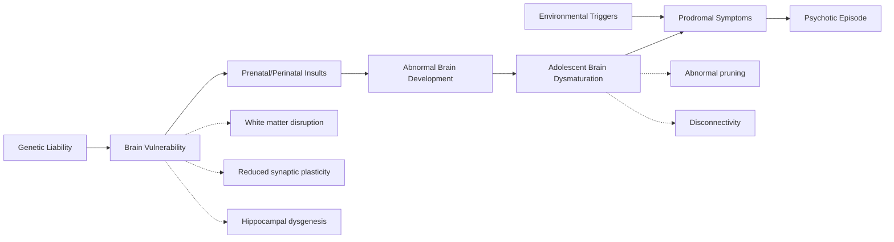
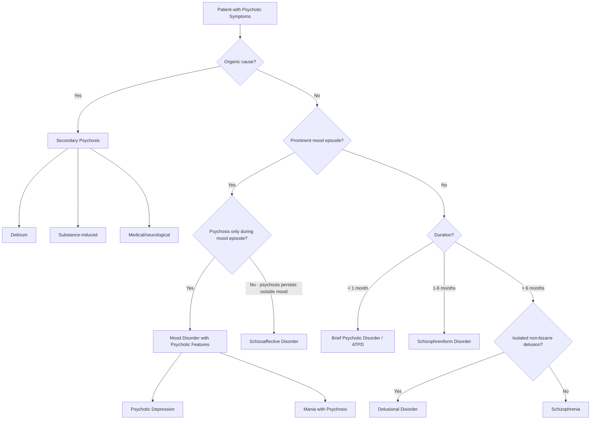

# Approach to Psychotic Symptoms

## 1. Definition and Conceptual Framework

***Psychosis*** **(思覺失調)** is ***a syndrome broadly defined as a "loss of contact with reality"*** [1]. Let's unpack that word: "psychosis" comes from Greek *psyche* (mind) + *-osis* (abnormal condition) — literally, an abnormal condition of the mind.

It is characterised by four cardinal features [1][2]:

1. ***Delusions*** — an abnormal belief that is (1) firmly held on inadequate grounds, (2) unshakeable by counter-argument, and (3) out of keeping with the person's social and cultural background
2. ***Hallucinations*** — perceptions in the ***absence*** of external stimuli (distinguish from *illusions*, which are misperceptions of real stimuli)
3. ***Disorganization*** — of both ***thinking*** (formal thought disorder) and ***behaviour*** (bizarre, purposeless conduct)
4. ***Lack of insight*** — the patient does not recognise that their experiences are pathological

> The critical conceptual point: ***psychosis is a syndrome, not a diagnosis*** [1][2]. Just as "fever" can be caused by infection, malignancy, or autoimmune disease, psychosis can result from schizophrenia, mood disorders, organic brain disease, or substance use. Your job is to identify the **underlying cause**.

<Callout title="Psychosis vs Neurosis" type="idea">
***Psychosis vs. neurosis*** is a classical psychiatric distinction [1]. In psychosis, reality testing is impaired — the patient believes their delusions and hallucinations are real. In neurosis (e.g., anxiety, OCD), reality testing is preserved — the patient recognises their symptoms as excessive or irrational, even if they cannot control them. This distinction, while somewhat dated, remains clinically useful as a first-pass categorisation.
</Callout>

***Psychotic disorder is a disease of the brain*** [1]. Although the precise aetiological basis remains incompletely understood, it is currently defined clinically (i.e., by symptom pattern and course rather than by biomarkers). The Chinese term in Hong Kong, adopted since 2001, is ***思覺失調*** [1] — literally "disorder of thought and perception," which beautifully captures the two core domains (delusions = thought; hallucinations = perception).

---

## 2. Epidemiology

### 2.1 Prevalence and Incidence of Psychotic Disorders

| Parameter | Value | Source |
|:--|:--|:--|
| ***Prevalence of all psychotic disorders*** | ***~2–3%*** | [1] |
| ***Lifetime prevalence of psychotic disorders in Hong Kong*** | ***2.5%*** (Chang et al. 2017) | [1] |
| ***Lifetime risk of schizophrenia*** | ***~1%*** | [1][2] |
| ***Median incidence of schizophrenia*** | ***15.2 per 100,000 per year*** | [1] |
| Incidence range across regions | ***7.7–43 per 100,000 per year*** | [1] |

Why does the incidence vary so widely across regions? Because psychosis is not purely genetic — ***socio-environmental factors*** strongly modulate risk. Specifically [1]:
- ***Migrants of ethnic minority*** (especially from developing countries to Western developed countries, e.g., UK, Netherlands) have elevated rates compared to locally-born Caucasians — this is the "migration effect," thought to relate to social defeat, discrimination, and marginalisation
- ***Urban upbringing*** (urbanicity) confers higher risk vs rural areas — possibly via chronic social stress, pollution, or reduced social cohesion

### 2.2 Demographics

- ***Onset usually in late adolescence and early adulthood*** [1][2]
- ***Male to female risk ratio for schizophrenia = 1.4:1*** [1][2]
- ***Men have an earlier age at onset*** than women [1][2]:
  - Males: typically ***18–25 years***
  - Females: ***bimodal*** — first peak at ***25–35 years***, second peak at ***perimenopause*** (oestrogen is thought to be partially protective → loss at menopause unmasks vulnerability)
- Schizophrenia is traditionally described as a ***high-prevalence, low-incidence*** disease (i.e., it is chronic in nature — people accumulate in the prevalent pool because they don't recover fully) [2]

### 2.3 Burden and Mortality

- ***No. 12 leading disability worldwide*** with ***substantial direct and indirect costs*** [2]
- ***Suicide is the single largest cause of premature death in schizophrenia*** [2]:
  - Lifetime suicide risk: ***5.6%*** (highest in the ***first year of illness*** — because depressed mood, a strong predictor of suicide, is frequently observed early)
  - ***12× general population suicide risk***
- ***Lifespan reduced by 10–15 years*** on average [2]
- ***2.6× all-cause mortality***, with the majority being ***non-suicidal*** causes [2]:
  1. Lifestyle factors (sedentary, poor nutrition)
  2. Smoking, substance/alcohol abuse
  3. Metabolic syndrome secondary to 2nd-generation antipsychotics
  4. Possibly inherent disease process → accelerated ageing and medical morbidity

<Callout title="High Yield: Schizophrenia Mortality" type="error">
A common exam mistake is to assume most excess deaths in schizophrenia are from suicide. While suicide risk is markedly elevated, the ***majority of excess mortality is from non-suicidal causes*** — particularly cardiovascular disease, metabolic syndrome, and respiratory disease. Always consider metabolic monitoring for patients on antipsychotics.
</Callout>

### 2.4 Epidemiology of Other Psychotic Disorders (for Comparison)

| Condition | Lifetime Risk | Key Demographics |
|:--|:--|:--|
| All psychotic disorders | 2–3% | — |
| Schizophrenia | ~1% | M > F, young adults |
| Schizoaffective disorder | ***0.3%*** (~1/3 of schizophrenia) | Early adulthood |
| ***Delusional disorder*** | ***0.05–0.1%*** | ***Median onset 46 years***, ***over-represented by women*** |
| Schizotypal PD | 0.6–4.6% | Familially aggregates with schizophrenia |
| Bipolar disorder (spectrum) | 0.3–1.6% (BD-I), 3.7% (spectrum) | M:F ≈ 1:1, mean onset ~18y |

---

## 3. Risk Factors

Understanding risk factors for psychosis requires a ***stress-vulnerability model*** [1]: genetic liability creates a "vulnerable brain," and environmental stressors (at various developmental stages) push the individual over a threshold into clinical psychosis.

### 3.1 Genetic Factors

- ***High degree of heritability: estimated ~80%*** [1][2]
- ***Polygenic architecture***: multiple genes, each with ***small individual effects*** [1]
  - ***Many identified candidate genes relate to dopamine, glutamate, synaptic functions, and immune mechanisms*** [1]
- ***Rare copy number variants (CNVs)*** with ***larger effect*** [1]:
  - ***Chromosome 22q11.2 deletion syndrome*** (DiGeorge syndrome / ***Velo-cardio-facial syndrome, VCFS***) — ***associated with 20–30 fold increase in risk of schizophrenia*** [1]
  - This is the single strongest known genetic risk factor for schizophrenia
- Family risk data [1]:
  - ***First-degree relatives: 10–15%*** risk
  - ***Monozygotic twin: ~50%*** concordance (note: not 100%, so environment clearly matters)
- ***Shared genetic risk*** between schizophrenia, bipolar disorder, MDD, schizoaffective disorder, and autism [3]

### 3.2 Environmental Factors

These are subdivided into ***distal (prenatal/perinatal)*** and ***proximal (later life)*** factors [1]:

**Distal (prenatal & perinatal) risk factors:**
- ***Obstetric complications*** (hypoxia, preeclampsia, emergency Caesarean section) — disrupt normal neurodevelopment
- ***Winter birth / maternal infections*** (e.g., ***influenza, toxoplasmosis***) — maternal immune activation during critical periods of fetal brain development may disrupt neuronal migration and synaptic formation
- ***Advanced paternal age at conception*** — mechanism: accumulation of ***de novo mutations*** and/or ***epigenetic changes*** in sperm

**Proximal social risk factors:**
- ***Substance abuse, especially cannabis*** — cannabis (particularly high-potency THC) increases dopamine release in the mesolimbic pathway; adolescent use during the critical neurodevelopmental window is especially harmful
- ***Migration (ethnic minority status)*** — the "social defeat" hypothesis: chronic exposure to social exclusion/discrimination sensitises the dopamine system
- ***Urbanicity (urban upbringing)*** — mechanisms overlap with social defeat; may also include environmental toxins, population density stress

These are unified under the ***social defeat hypothesis / stress-dopamine sensitisation*** model [1]: chronic social adversity → sustained stress response → sensitisation of mesolimbic dopaminergic transmission → ↑vulnerability to psychosis.

- ***Gene × environment interactions*** are emphasised [1] — genetic vulnerability determines *how much* environmental stress is needed to cross the psychosis threshold.

### 3.3 Other Risk Factors

- ***Low IQ / intellectual disability*** — associated with higher risk of schizophrenia [1]
- ***Poor premorbid adjustment*** — social and academic difficulties in childhood/adolescence
- ***Family history*** (as above)
- ***Expressed emotions (EE)***: critical, hostile, or emotionally over-involved attitudes from relatives [2]
  - ***↑risk of relapse if exposed to environment of high EE > 35 hours/week***
  - Association seen in schizophrenia, bipolar disorder, alcoholism, learning disabilities

---

## 4. Anatomy and Function: Key Neural Circuits in Psychosis

To understand psychotic symptoms from first principles, you need to know the ***four major dopamine pathways*** [1][2]. These are central to both symptom generation and treatment side effects:

### 4.1 The Four Dopamine Pathways

| Pathway | Origin → Target | Normal Function | Relevance to Psychosis |
|:--|:--|:--|:--|
| ***Mesolimbic*** | Ventral tegmental area (VTA) → nucleus accumbens, amygdala, hippocampus (limbic system) | Reward, motivation, emotional salience | ***Hyperdopaminergic transmission → positive symptoms*** (delusions, hallucinations) [1] |
| ***Mesocortical*** | VTA → prefrontal cortex (dorsolateral and ventromedial) | Executive function, working memory, social cognition, motivation | ***Hypodopaminergic transmission → negative symptoms and cognitive deficits*** [1] |
| ***Nigrostriatal*** | Substantia nigra → dorsal striatum (caudate and putamen) | Voluntary motor control | ***Antipsychotics block D2 here → extrapyramidal side effects (EPS)*** [1] |
| ***Tuberoinfundibular*** | Hypothalamus → pituitary gland | Tonically inhibits prolactin release via D2 | ***Antipsychotics block D2 here → hyperprolactinaemia*** [1] |

<Callout title="Why Antipsychotics Cause Side Effects">
All typical (first-generation) antipsychotics and some atypicals work by blocking D2 receptors. This is therapeutic in the mesolimbic pathway (reduces positive symptoms) but causes collateral damage:
- Block D2 in nigrostriatal → Parkinsonism, dystonia, akathisia, tardive dyskinesia
- Block D2 in tuberoinfundibular → ↑prolactin → galactorrhoea, amenorrhoea, sexual dysfunction, osteoporosis
- Block D2 in mesocortical → may worsen negative symptoms and cognitive deficits (the pathway is already hypodopaminergic!)

This is why atypical (second-generation) antipsychotics, which also antagonise 5-HT2A receptors, preferentially increase dopamine release in the mesocortical pathway while maintaining mesolimbic blockade — potentially improving negative/cognitive symptoms with fewer EPS.
</Callout>

### 4.2 Other Neurotransmitter Systems

- ***Glutamate (NMDA receptor hypofunction)*** [1][2]:
  - NMDA receptor antagonists (***phencyclidine, ketamine***) can induce a ***schizophrenia-like psychosis*** — this was a key piece of evidence
  - NMDA hypofunction may be developmental in origin
  - Downstream effects: ***excessive dopamine release*** in mesolimbic system and ***neurotoxicity***
  - ***Excess glutamate neurotransmission → neurotoxicity / may lead to hyperdopaminergia*** [1]
- ***GABA*** [2]:
  - ***Glutamic acid decarboxylase (GAD)***, the synthetic enzyme of GABA, is reduced in schizophrenic brain
  - Reduced GABA levels seen on spectroscopy
  - GABA interneurons normally regulate cortical excitatory-inhibitory balance — their dysfunction may contribute to cortical disorganisation
- ***Serotonin (5-HT)*** [2]:
  - ***↓5-HT2A and 5-HT1A receptor densities*** in frontal cortex
  - ***Atypical antipsychotics often act as 5-HT2 antagonists*** — this is part of what makes them "atypical"
  - ***LSD, a hallucinogen, is an agonist at 5-HT2 receptors*** — further evidence for serotonin's role in psychosis

### 4.3 Structural and Functional Brain Changes

***Structural changes*** [1][2]:
- ***Volume reduction*** of ***entire brain and grey matter***, especially in ***temporal lobe, prefrontal cortex, thalamus, and anterior cingulate***
- ***↑Ventricular volume*** (lateral and third ventricles) — one of the most replicated findings in schizophrenia
- ***↓Cortical thickness and surface area***
- Present to ***some extent at illness onset*** but ***continue to progress*** after illness

***Functional changes*** [1]:
- ***Altered white matter connectivity*** (on diffusion tensor imaging, DTI)
- ***Altered resting-state functional integrity*** (on functional MRI)

***Neuropathological findings*** [1][2]:
- Mainly ***↓synapse-rich neuropil*** but ***without gliosis*** and ***without evidence of neuronal loss***
- This is critically important: ***absence of gliosis + lack of neuronal loss*** speaks ***against neurodegeneration*** and ***supports a neurodevelopmental origin*** [1]
  - Why? Because gliosis (astrocyte scarring) is the hallmark of acquired neuronal injury/death. Its absence implies the brain was never normal to begin with — the abnormality arose during development, not from later destruction.

### 4.4 Relevant Brain Changes in Mood Disorders (for Comparison)

Since psychosis can also arise from mood disorders, it's worth noting [4][5]:
- ***Depression***: ***volume reduction and decreased glial cells in subgenual cortex***, ***reduced hippocampal size*** [4]
- ***Dysregulation of HPA axis*** (hypothalamic-pituitary-adrenal) — cortisol hypersecretion in both depression and bipolar disorder [4][5]
- ***Abnormalities in ventromedial and dorsolateral prefrontal cortex*** function and ***amygdala-anterior cingulate connectivity*** [2]

---

## 5. Aetiology and Pathophysiology

### 5.1 The Neurodevelopmental Hypothesis of Schizophrenia

This is the ***major hypothesis*** based on current evidence [1][2]. Rather than being acquired (degenerative), ***schizophrenia is primarily a neurodevelopmental disorder***.

**The Conceptual Model** (see Fig. 1 in lecture slides [1]):

**Evidence for the neurodevelopmental hypothesis** [1]:

1. ***Motor function deficits occur before onset of illness*** [1]
2. ***Neurological soft signs*** (subtle motor and sensory abnormalities) are present premorbidly [1]
3. ***Poor premorbid adjustment*** (academic and social) [1]
4. ***Low IQ / intellectual disability associated with higher risk*** [1]
5. ***Cognitive deficits emerge in the prodromal period*** [1]
6. Neurobiology: ***no gliosis/neuronal loss suggests prenatal insult***; structural brain changes present ***at or before illness onset*** with ***limited progression*** after onset [2]
7. Most environmental risk factors are ***prenatal/perinatal*** in origin [2]

The trajectory: **Genetic liability → prenatal insults → vulnerable brain → abnormal adolescent pruning → disconnectivity → prodromal cognitive/social decline → environmental triggers (stress, cannabis) → psychosis**

### 5.2 The Stress-Vulnerability Model

***Stress-vulnerability model for psychosis development*** [1]: the most practical clinical framework.

- Everyone has a certain **threshold** for developing psychosis, determined by their genetic/neurodevelopmental vulnerability
- Environmental stressors push individuals toward that threshold
- Individuals with high genetic vulnerability need relatively little stress to become psychotic
- Individuals with low genetic vulnerability may only develop psychosis under extreme stress (e.g., ICU delirium, heavy cannabis use)

This explains why:
- Not all identical twins are concordant (50%, not 100%)
- Cannabis is a risk factor in some people but not others (gene × environment)
- Social adversity (migration, urbanicity) increases risk population-wide

### 5.3 The Dopamine Hypothesis (Detailed)

***Increased pre-synaptic dopamine synthesis in the striatum*** is the core biochemical finding [1]. This is not simply "too much dopamine everywhere" — it is pathway-specific:

| Pathway | State in Schizophrenia | Consequence |
|:--|:--|:--|
| ***Mesolimbic*** | ***Hyperdopaminergic*** | ***Positive symptoms*** (salience misattribution → delusions; aberrant sensory processing → hallucinations) |
| ***Mesocortical*** | ***Hypodopaminergic*** | ***Negative symptoms + cognitive deficits*** (reduced executive function, working memory, motivation) |

Why does the mesolimbic pathway become hyperdopaminergic? The current understanding is that it's a downstream consequence of upstream abnormalities — including ***NMDA receptor hypofunction*** on cortical glutamatergic neurons → loss of inhibitory regulation → disinhibition of subcortical dopamine release [1][2].

The "aberrant salience" model (Kapur, 2003): mesolimbic dopamine normally assigns "salience" (importance) to stimuli. In psychosis, ***dopamine is released in an unregulated fashion***, attaching importance to irrelevant stimuli → the patient begins to find meaning in things that are meaningless → ideas of reference → delusions. Similarly, internal neural noise, normally suppressed, becomes salient → hallucinations.

### 5.4 Aetiology of Mood Disorders with Psychotic Features

Since psychosis can arise from mood disorders, understanding the pathophysiology of depression and bipolar disorder is relevant:

**Depression** [4][5]:
- ***Classical "serotonin hypothesis": diminished activity of serotonin pathways*** [4]
  - Evidence: ***antihypertensive drug reserpine***, which depleted monoamines, ***produced a depressive state*** [4]
  - ***Diminished monoaminergic activity*** detected in ***brains of suicide decedents*** and ***bodily fluids of depressed patients*** [4]
- But: ***the cause of depression is far more complicated than reduced serotonin*** [5]
- ***Monoamines including serotonin, norepinephrine, and dopamine*** are all relevant [5]:
  - ***Serotonin***: regulates ***body temperature, sleep-wakefulness, mood, and impulse control***. ***Low serotonin metabolites in brains of suicide decedents and spinal fluids of depressed patients*** [5]
  - ***Norepinephrine***: regulates ***mood and anxiety levels***. ***Mood symptoms emerged among patients taking propranolol*** [5]
  - ***Dopamine***: regulates ***motor and mental activity, attention and motivation***. ***Dopaminergic neurons in mesolimbic reward pathway*** play important role in ***motivation, reinforcement, and pleasure response*** — ***diminished in brains of suicidal decedents with depression*** [5]
  - ***Abnormalities in glutamate, GABA, and substance P*** also detected [5]
- ***Structural brain changes***: ***volume reduction and decreased glial cells in subgenual cortex, reduced hippocampal size*** [4]
- ***Hormonal changes***: ***HPA axis dysregulation, lower estradiol (women) and testosterone (men), decreased T3 and TSH, diminished BDNF*** [4]

**Bipolar disorder** [3][6]:
- ***79% heritability*** [3]
- ***Shared genetic risk between bipolar, schizophrenia, and autism*** [3]
- ***Some overlap with genes involving circadian rhythm regulation*** [3]
- ***Biochemical pathways: especially dopaminergic, second messengers, mitochondrial, HPA axis, and thyroid*** [3]
- ***Neuroimaging findings: structural and functional abnormalities*** [3]
- ***Infective causes, e.g., Toxoplasma gondii (the associated immune response)*** [3]
- ***Environmental factors: life events, social support, low care and overprotective parents, poor attachment relationship, childhood abuse, sleep deprivation, circadian and social rhythm disruption*** [3]

---

## 6. Classification of Psychotic Disorders

### 6.1 Primary (Psychiatric) Psychotic Disorders

The classification follows a hierarchical approach — essentially, you're asking: *How long has the psychosis lasted? Are mood symptoms prominent? How bizarre are the features?*

#### 6.1.1 Schizophrenia

The prototypical psychotic disorder. Detailed separately but key distinguishing features [1][2]:
- ***Prominent psychotic symptoms lasting at least 1 month*** affecting functioning
- ***DSM-5 requires ≥6 months*** of disturbance including at least 1 month of active psychosis
- Content of delusions/hallucinations often ***bizarre*** in theme
- ***Schneider's first-rank symptoms (FRS)***, when present, are highly suggestive
- ***Mood disturbance, if any, is not concurrent with psychosis or is relatively minor***

**Symptom dimensions** [2]:
1. ***Positive symptoms***: reality distortions (delusions, hallucinations)
2. ***Negative symptoms***: loss of normal functioning (5 A's)
3. ***Disorganization***: disorganized thoughts and behaviour/speech
4. ***Affective symptoms***: depression, anxiety, mania/hypomania
5. ***Motor symptoms***: catatonia, neurological soft signs
6. ***Cognitive impairment***

#### 6.1.2 Schizoaffective Disorder

- ***Concurrent schizophrenic and mood symptoms are equally prominent*** [1]
- Psychotic features must be present ***before and after*** mood episodes
- ***Psychosis must exist for ≥2 weeks in the absence of a major mood episode*** (DSM-5) [2]
- Functional impact ***often less marked*** than schizophrenia [2]
- Prognosis ***better than schizophrenia*** (negative symptoms rarely develop) but ***worse than mood disorders*** [2]
- Whether this entity truly exists as distinct from schizophrenia or mood disorders is ***questionable*** — it is neither genetically nor neurobiologically separated [2]

#### 6.1.3 Acute and Transient Psychotic Disorder (ATPD) / Brief Psychotic Disorder / Schizophreniform Disorder

***Acute onset, complete remission, brief period*** [1]:
- ***ATPD***: onset ≤2 weeks
- ***Brief psychotic disorder*** (DSM-5): duration < 1 month
- ***Schizophreniform disorder***: duration 1–6 months (doesn't yet meet the 6-month schizophrenia threshold)
- May be precipitated by ***acute stress***
- ***Polymorphic features (~cycloid psychosis)***: ***rapidly changing clinical pictures, prominent fluctuating mood state, perplexity*** [1]

#### 6.1.4 Delusional Disorder

***Previously known as paranoid psychoses / paranoia*** [2]:
- ***Systematized, likely single-theme delusion, non-bizarre in nature*** [1]
- ***No or non-prominent hallucinations*** (if any, fleeting and related to delusions) [2]
- ***Minimal negative symptoms***, ***better functioning*** reported [1]
- ***Over-represented by women and adult-onset*** [1]
- ***Relatively rare*** (0.05–0.1% lifetime risk, ***median age of onset 46 years***) [2]
- Themes: ***persecutory*** (commonest), erotomania, jealous, somatic, grandiose [2]
- ***Encapsulated***: behaviour unrelated to the delusion is often ***normal*** [2]
- A proportion may go on to develop full-blown schizophrenia [2]

#### 6.1.5 Schizotypal (Personality) Disorder

- A ***pervasive pattern*** (stable course) of social/interpersonal deficits with [2]:
  - ***Cognitive distortions*** (attenuated delusions): odd beliefs, ideas of reference, magical thinking, paranoid ideation
  - ***Perceptual distortions*** (attenuated hallucinations): illusions, "sixth sense"
  - ***Odd behaviour*** (attenuated disorganization): vague/circumstantial speech, eccentric appearance
  - ***Social isolation*** (attenuated negative symptoms): few close friends, social anxiety
- Patient has ***never met criteria for schizophrenia*** throughout life [2]
- Considered ***personality disorder*** in DSM-5, but ***schizophrenia-like disorder*** in ICD-10 [2]
- Part of the ***schizophrenia-spectrum*** [1]
- Distinguish from ***schizoid personality disorder*** which has similar social isolation but ***no cognitive/perceptual distortions*** [2]

### 6.2 Mood Disorders with Psychotic Features

- ***Mood disturbances dominate*** the clinical picture [2]
- Content of psychosis is often ***mood-congruent*** [2]:
  - Depression → nihilistic delusions ("my organs are rotting"), auditory hallucinations criticising them, delusions of guilt/poverty
  - Mania → grandiose delusions ("I am God"), hallucinations affirming their special status

### 6.3 Secondary (Medical/Organic) Psychosis

Will be discussed in the differential diagnosis section, but includes:
- Delirium (any cause)
- Substance use (intoxication or withdrawal)
- Neurological conditions (epilepsy, dementia, encephalitis, brain tumours)
- Metabolic/endocrine disorders (thyroid, Cushing's, porphyria)
- Autoimmune encephalitis (anti-NMDA receptor encephalitis — particularly important in young women)

---

## 7. Clinical Features of Psychotic Symptoms

### 7.1 Symptoms (Subjective Experiences)

#### 7.1.1 Positive Symptoms

**A. Hallucinations** — perception in the absence of external stimulus [2]

| Type | Frequency | Details | Pathophysiological Basis |
|:--|:--|:--|:--|
| ***Auditory hallucinations (AH)*** | ***Most common (40–80%)*** | Typically voices; can be sounds. ***Most responsive to antipsychotics*** | Aberrant activation of auditory cortex (superior temporal gyrus) due to hyperdopaminergia in mesolimbic pathway; internal speech misattributed to external source due to self-monitoring deficits (efference copy failure) |
| Visual hallucinations | Uncommon in primary psychosis | Usually unformed (glowing orbs, colours); typically with other hallucination types | ***If prominent: think organic cause*** (delirium, substance intoxication, Lewy body dementia) — because visual processing relies on widespread cortical networks more easily disrupted by metabolic/toxic insults |
| Other (somatic, olfactory, gustatory) | Rare | — | Olfactory: think temporal lobe epilepsy |

***Forms of auditory hallucinations that are Schneider's First-Rank Symptoms (FRS):*** [2]
- ***Thought echo*** — voice repeating one's own thoughts aloud (the patient hears their thought spoken back)
- ***3rd person AH*** — voices conversing ***with each other*** about the patient ("He is lazy"; "No, he is stupid")
- ***Running commentary*** — voices narrating the patient's actions in real-time ("He is sitting down now")

> ***Schneider's First-Rank Symptoms (SPECTRA mnemonic)*** [2]:
> - **S**omatic passivity (bodily sensations imposed by external force)
> - **P**assivity experiences / delusions of control (thoughts, feelings, actions imposed)
> - **E**cho of thought (auditory)
> - **C**ommentary, running (auditory)
> - **T**hought insertion, withdrawal, broadcasting
> - **R**eference, delusional perception (two-stage: normal perception → delusional meaning)
> - **A**uditory 3rd person hallucinations

**B. Delusions** (80% of schizophrenia patients) [2]

A delusion is a ***fixed, false belief*** not in keeping with circumstances. Key dimensions:

- ***Primary vs secondary*** [2]:
  - Primary: arises spontaneously, de novo (e.g., suddenly "just knows" they are being followed)
  - Secondary: derived as an explanation for other psychopathology (e.g., "a device has been implanted in my brain" to explain auditory hallucinations)
  
- ***Bizarre vs non-bizarre*** [2]:
  - Bizarre: completely impossible (e.g., "aliens replaced my brain with a computer") — more characteristic of schizophrenia
  - Non-bizarre: somewhat understandable but false (e.g., "my neighbours are spying on me") — more characteristic of delusional disorder

- ***Themes*** [2]:
  - ***Referential*** (ideas of reference): TV, radio, or strangers are referring specifically to the patient
  - ***Grandiose***: inflated self-importance, special powers or identity
  - ***Paranoid/persecutory***: being followed, poisoned, plotted against — ***clinically important → violence risk***
  - ***Nihilistic***: belief that self, others, or the world do not exist or are doomed (more common in psychotic depression; extreme form = Cotard's syndrome)
  - ***Erotomanic***: someone (usually of higher status) is in love with the patient
  - ***Somatic***: false belief about body function/sensation
  - ***Passivity phenomena*** (FRS): belief that external forces control thoughts, feelings, or actions

**Why do delusions form? (Pathophysiological basis)**
The aberrant salience hypothesis: mesolimbic hyperdopaminergia causes the brain to assign excessive significance to irrelevant stimuli → the patient seeks meaning in coincidences → crystallises into a fixed belief system (delusion). Cognitive biases (jumping to conclusions, attributional biases) then maintain the delusion.

#### 7.1.2 Negative Symptoms

***Usually independent of severity of positive symptoms*** [2]. Grouped into the ***5 A's*** under two clusters:

**Diminished Expression (DE):**
- ***Affect flattening*** — reduced facial expression, gesture, spontaneous movement, vocal intonation, eye contact
  - *Why?* Hypodopaminergic mesocortical pathway → reduced frontal lobe activation → impoverished emotional output
- ***Alogia*** — poverty of speech (reduced quantity and/or content)
  - *Why?* Same frontal hypofunction → reduced drive to communicate

**Avolition-Apathy (AA):**
- ***Anhedonia*** — reduced capacity to experience pleasure
  - *Why?* Dopamine in mesolimbic reward pathway is dysregulated; mesocortical hypofunction also impairs anticipatory pleasure
- ***Avolition*** — reduced motivation and goal-directed behaviour
  - *Why?* Frontal-striatal circuit dysfunction
- ***Asociality*** — reduced social drive, social withdrawal
  - *Why?* Combination of reduced motivation, impaired social cognition, and possibly learnt behaviour (social interactions become aversive due to paranoia or past negative experiences)

<Callout title="Primary vs Secondary Negative Symptoms" type="error">
***Primary negative symptoms*** are a ***core feature of schizophrenia*** — very ***resistant to antipsychotic treatment*** and closely related to ***functional outcome*** [2].

***Secondary negative symptoms*** look identical but are caused by other factors [2]:
- Depression (low mood → social withdrawal, anhedonia)
- Antipsychotics (D2 blockade in mesocortical pathway → flattened affect, avolition)
- Social deprivation (institutional environment)
- Positive symptoms (paranoia → social avoidance)

Always try to distinguish them clinically because secondary causes are potentially treatable!

***Deficit syndrome***: patients with prominent primary negative symptoms represent a ***distinct subgroup*** with ***extremely poor prognosis*** and few achieving recovery [2].
</Callout>

#### 7.1.3 Disorganization Symptoms

**Disorganized thinking** (formal thought disorder) [2]:
- Tangentiality — answers wander away from the point
- Loosening of associations (derailment) — ideas shift between unrelated topics
- Word salad (incoherence) — speech is incomprehensible
- Neologisms — inventing new words
- *Why?* Prefrontal cortex dysfunction → impaired executive control over semantic associations; possibly related to GABA interneuron dysfunction in cortical circuits

**Disorganized behaviour** [2]:
- Unpredictable, bizarre, or inappropriate behaviour
- Difficulty with goal-directed activities
- Inappropriate affect (laughing at sad news)

#### 7.1.4 Affective Symptoms

- ***Depression*** — very common in schizophrenia (up to 80% during acute episodes); ***strongest predictor of suicide*** in early illness [2]
- ***Anxiety***
- Mania/hypomania — if prominent, consider schizoaffective disorder or bipolar with psychosis

#### 7.1.5 Cognitive Symptoms

- Impaired ***attention, working memory, processing speed, executive function, verbal learning***
- ***Emerge in the prodromal period*** [1] — often preceding frank psychosis by years
- ***Closely correlated with functional outcome*** — more predictive than positive symptoms
- *Why?* Prefrontal cortex hypofunction (mesocortical hypodopaminergia) + disrupted fronto-parietal connectivity

#### 7.1.6 Motor Symptoms

- ***Catatonia***: spectrum from stupor (mutism, immobility, waxy flexibility) to excitement (purposeless motor agitation)
- ***Neurological soft signs***: subtle abnormalities in coordination, sensory integration, sequencing of complex motor acts [1]
  - Present premorbidly → supports neurodevelopmental hypothesis

### 7.2 Signs (Observable on Examination)

| Domain | Signs | Pathophysiological Basis |
|:--|:--|:--|
| Appearance | Self-neglect, bizarre dress, poor hygiene | Negative symptoms (avolition) + disorganization |
| Behaviour | Psychomotor agitation/retardation, stereotypies, mannerisms, catatonic features, responding to hallucinations (talking to self, looking around, covering ears) | Motor symptoms; response to internal stimuli |
| Speech | Poverty of speech (alogia), pressure of speech (mania), derailment, tangentiality, neologisms, word salad | Formal thought disorder |
| Affect | Flat/blunted (negative symptoms), incongruent (disorganization), perplexed (ATPD), elated/irritable (mania) | Pathway-specific |
| Thought content | Delusions (as above), suicidal/homicidal ideation | — |
| Perception | Evidence of hallucinations (behavioural cues) | — |
| Cognition | Impaired attention, disorientation (if organic cause), poor abstract reasoning | Frontal dysfunction (functional psychosis) vs diffuse cortical dysfunction (organic) |
| Insight | Partial or absent | Core feature of psychosis; related to prefrontal dysfunction and anosognosia |

<Callout title="Red Flags for Organic (Secondary) Psychosis">
When assessing a patient with psychotic symptoms, certain features should make you strongly suspect an organic cause:
- ***Age of onset > 40 years*** (new-onset psychosis in elderly → think delirium, dementia, tumour)
- ***Visual hallucinations*** (especially vivid, formed) → delirium, Lewy body dementia, substance use
- ***Fluctuating consciousness/clouded sensorium***
- ***Disorientation*** (to time, place, person)
- ***Abnormal vital signs*** (fever, tachycardia, hypertension)
- ***New neurological signs*** (focal deficits, seizures)
- ***Acute onset*** in a previously well individual
- ***History of substance use*** or recent medication changes
- ***No psychiatric history or family history***

Always rule out organic causes first with: bloods (FBC, U&E, LFT, TFT, glucose, Ca²⁺, B12/folate, syphilis, ESR/CRP), urine drug screen, ECG, CT/MRI brain, and consider EEG and lumbar puncture if indicated [2].
</Callout>

### 7.3 Clinical Features Specific to Mood-Related Psychosis

**Psychotic depression** [4][5]:
- ***Cardinal symptoms of ICD-11 depression***: ***depressed mood or diminished interest in activities occurring most of the day, nearly every day, for at least two weeks*** [4]
- ***Additional symptoms***: ***difficulty concentrating, feelings of worthlessness or excessive guilt, hopelessness, recurrent suicidal thoughts, appetite/sleep changes, psychomotor agitation/retardation, reduced energy/fatigue*** [4]
- Psychotic features: mood-congruent delusions (nihilistic, guilt, poverty, somatic), auditory hallucinations (derogatory voices)

**Mania with psychotic features** [3][6]:
- ***Core features***: ***elation or irritability***, ***increased energy and activity***, ***↓need for sleep*** [6]
- ***Mood lability***, ***disinhibition***, ***recklessness***, ***grandiosity*** [6]
- Psychotic features: grandiose delusions, persecutory delusions (secondary to grandiosity — "they're jealous of me"), hallucinations affirming grandiose identity
- ***Mania with psychosis is frequently misdiagnosed as schizophrenia*** [6]

**Key risk factors for bipolar disorder** [3]:
- ***High income countries*** (may be due to referral bias)
- ***Low income, separated, divorced, or widowed***
- ***Low care and overprotective parents, poor attachment relationship, childhood abuse***
- ***Family history of bipolar disorder and schizophrenia (monozygotic concordance 40–70%, lifetime risk in first-degree relatives 5–10%, roughly 7 times higher than general population)***
- ***No gender or ethnic difference*** [3]

---

## 8. Approach to Classifying Psychosis: A Framework

When you encounter a patient with psychotic symptoms, think systematically:

<Callout title="Psychiatric vs Medical Psychosis: Clinical Guidance">

The distinction between primary (psychiatric) and secondary (medical) psychosis is one of the most important clinical decisions [2]:

| Feature | Psychiatric Psychosis | Medical/Organic Psychosis |
|:--|:--|:--|
| Age of onset | Young adult (15–35) | Any age; suspect if > 40 |
| Consciousness | Clear | Often clouded/fluctuating |
| Orientation | Intact | Impaired |
| Hallucinations | Predominantly auditory | Often visual |
| Delusions | Complex, systematised | Poorly formed, fleeting |
| Cognition | Relatively preserved (early) | Impaired |
| Vital signs | Normal | Often abnormal |
| Psychiatric history/FHx | Often present | Often absent |
| Neurological signs | Absent (except soft signs) | May be present |

**Rule: Always exclude organic causes first, especially in first-episode psychosis, elderly patients, and atypical presentations.**
</Callout>

---

## 9. Course and Prognosis (General Overview)

For schizophrenia specifically [2]:
- ***Course: highly heterogeneous, usually chronic and relapsing-remitting***
- ***30% treatment-resistant, 20% remission, 10% suicide, > 50% poor outcome***
- It is postulated that ***active psychosis is neurotoxic*** and ***delayed treatment leads to irreversible neurological deterioration*** → this is the rationale for minimising ***duration of untreated psychosis (DUP)***

**Poor prognostic factors** [2]:

| Patient Factors | Disease Factors | Other Factors |
|:--|:--|:--|
| Poor premorbid adjustment | Insidious onset, not related to stress | ***High EE of caregivers*** |
| Male gender | ***Prolonged DUP*** | ***Comorbid substance abuse*** |
| Single | Prominent negative and cognitive symptoms | ***Poor treatment adherence*** |
| Family history | Hebephrenic subtype | |
| | Prominent affective symptoms | |
| | ***Poor initial treatment response*** | |
| | ***Poor insight*** | |

For other psychotic disorders:
- ***ATPD/Brief psychotic disorder***: generally good prognosis with complete recovery
- ***Schizoaffective***: better than schizophrenia, worse than mood disorders
- ***Delusional disorder***: variable; generally stable trajectory, a proportion develop schizophrenia
- ***Mood disorders with psychosis***: prognosis follows the underlying mood disorder but psychotic features generally indicate more severe illness

---

<Callout title="High Yield Summary">

1. **Psychosis is a syndrome, not a diagnosis** — always identify the underlying cause (schizophrenia, mood disorder, organic, substance).

2. **Four cardinal features**: delusions, hallucinations, disorganisation, lack of insight.

3. **Epidemiology**: ~1% lifetime risk for schizophrenia; 2.5% all psychotic disorders in HK; M:F = 1.4:1; onset late adolescence/early adulthood; 10–15 year reduced lifespan.

4. **Dopamine hypothesis**: mesolimbic hyperdopaminergia → positive symptoms; mesocortical hypodopaminergia → negative/cognitive symptoms. Also involves glutamate (NMDA hypofunction), GABA, serotonin.

5. **Neurodevelopmental hypothesis**: schizophrenia is a disorder of brain development (not degeneration) — supported by absence of gliosis, premorbid deficits, prenatal risk factors.

6. **Stress-vulnerability model**: genetic vulnerability + environmental stressors → psychosis.

7. **Classification hierarchy**: Organic → Mood disorder with psychosis → Schizoaffective → Schizophrenia → Schizophreniform → ATPD → Delusional disorder → Schizotypal.

8. **Negative symptoms** (5 A's): affect flattening, alogia, anhedonia, avolition, asociality. Primary (core, treatment-resistant) vs secondary (treatable cause).

9. **Schneider's FRS (SPECTRA)**: somatic passivity, passivity phenomena, echo of thought, commentary, thought insertion/withdrawal/broadcasting, delusional perception/reference, 3rd person AH.

10. **Always exclude organic psychosis**: visual hallucinations, clouded consciousness, disorientation, abnormal vitals, new neuro signs, age > 40 → think medical cause first.

</Callout>

---

<ActiveRecallQuiz
  title="Active Recall - Approach to Psychotic Symptoms"
  items={[
    {
      question: "Name the four cardinal features of psychosis and explain why it is considered a syndrome rather than a diagnosis.",
      markscheme: "Four features: (1) Delusions, (2) Hallucinations, (3) Disorganisation of thinking and behaviour, (4) Lack of insight. It is a syndrome because it describes a clinical presentation that can result from multiple underlying causes including schizophrenia, mood disorders, organic/medical conditions, and substance use — the cause must be identified separately."
    },
    {
      question: "Explain the four dopamine pathways and their relevance to psychosis and antipsychotic side effects.",
      markscheme: "Mesolimbic (VTA to limbic) — hyperdopaminergia causes positive symptoms; target of antipsychotic therapeutic effect. Mesocortical (VTA to PFC) — hypodopaminergia causes negative and cognitive symptoms; antipsychotics may worsen. Nigrostriatal (SN to striatum) — D2 blockade causes EPS. Tuberoinfundibular (hypothalamus to pituitary) — D2 blockade causes hyperprolactinaemia."
    },
    {
      question: "List three pieces of evidence supporting the neurodevelopmental hypothesis of schizophrenia over the neurodegenerative hypothesis.",
      markscheme: "Any three of: (1) Absence of gliosis and neuronal loss on neuropathology — gliosis would be expected in acquired neuronal injury. (2) Structural brain changes present at or before illness onset with limited progression. (3) Premorbid motor deficits and neurological soft signs. (4) Poor premorbid adjustment and cognitive deficits emerging in prodromal period. (5) Most environmental risk factors are prenatal/perinatal."
    },
    {
      question: "A 50-year-old woman presents with vivid visual hallucinations, fluctuating consciousness, and disorientation. What is the most likely category of psychosis and what initial investigations would you order?",
      markscheme: "Most likely secondary/organic psychosis (delirium). Red flags: age over 40, visual hallucinations, fluctuating consciousness, disorientation. Investigations: FBC, U and E, LFT, TFT, glucose, calcium, B12/folate, CRP/ESR, syphilis serology, urine drug screen, ECG, CT/MRI brain, consider LP and EEG."
    },
    {
      question: "Distinguish between primary and secondary negative symptoms in schizophrenia, and explain why this distinction matters clinically.",
      markscheme: "Primary negative symptoms are a core feature of schizophrenia intrinsic to the disease process — very resistant to antipsychotic treatment and strongly predict poor functional outcome (deficit syndrome). Secondary negative symptoms appear identical but are caused by treatable factors: depression, antipsychotic side effects (D2 blockade in mesocortical), social deprivation, or avoidance due to positive symptoms. The distinction matters because secondary causes are potentially reversible with targeted treatment."
    },
    {
      question: "What is the 22q11.2 deletion syndrome and why is it significant in the context of psychosis?",
      markscheme: "22q11.2 deletion syndrome (DiGeorge syndrome / Velo-cardio-facial syndrome, VCFS) is a rare copy number variant associated with a 20-30 fold increase in risk of schizophrenia — the single strongest known genetic risk factor. It demonstrates that while schizophrenia is generally polygenic with small effects per gene, rare CNVs can have large effects, supporting the genetic contribution to psychosis."
    }
  ]}
/>

---

## References

[1] Lecture slides: GC 170. Schizophrenia and related psychoses.pdf (p2, p4, p14, p15, p16, p20, p21, p22)
[2] Senior notes: ryanho-psych.md (sections 6.1, 6.2)
[3] Lecture slides: GC 163. I am a superman Bipolar disorder.pdf (p19, p28)
[4] Lecture slides: GC 164. I am depressed Mood disorders.pdf (p10, p12)
[5] Lecture slides: GC 164. I am depressed Mood disorders.pdf (p11)
[6] Senior notes: ryanho-psych.md (section 7.3)
