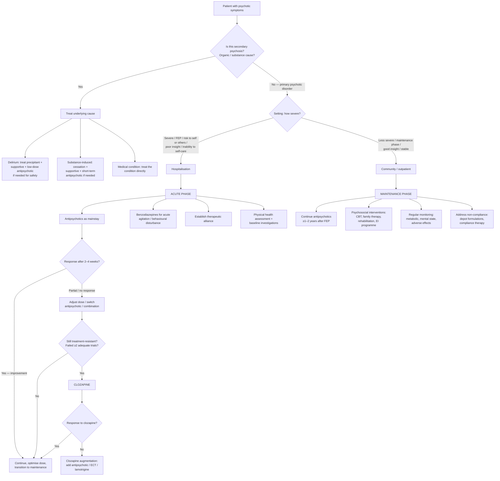

## Management of Psychotic Symptoms

Management of psychosis follows the same principle as diagnosis: **treat the cause, not just the symptom**. If the psychosis is secondary to delirium, substance use, or a medical condition, you treat the underlying cause. If it is a primary psychotic disorder, you treat with antipsychotics as the pharmacological mainstay, combined with psychosocial interventions tailored to the phase of illness [2][11].

The biopsychosocial framework is essential — pharmacology alone is insufficient. Think of it as a three-legged stool: **biological** (antipsychotics, other medications), **psychological** (CBT, compliance therapy, cognitive remediation), and **social** (family intervention, rehabilitation, community support). Remove any leg and the stool collapses [2][11].

---

### Overall Management Algorithm

---

### 1. General Principles of Management

#### 1.1 Setting

- ***Hospitalisation*** is necessary for [2][11]:
  - ***First-episode psychosis (FEP)*** — thorough assessment, establish diagnosis, initiate treatment in a controlled environment
  - ***Severe relapses*** — risk to self or others, inability to self-care
  - ***Poor insight*** — patient refusing treatment while clearly deteriorating
  - Advantages: thorough assessment, better compliance, relief for family [2]
- ***Home treatment / community management*** is possible for ***less severe episodes*** and the ***maintenance phase*** [2]

#### 1.2 Phase-Based Approach

| Phase | Goals | Key Interventions |
|:--|:--|:--|
| **Acute phase** | Control positive symptoms, ensure safety, establish diagnosis | ***Antipsychotics as mainstay***, benzodiazepines for agitation, establish therapeutic relationship, baseline investigations [2][11] |
| **Stabilisation phase** | Consolidate improvement, minimise relapse risk | Optimise antipsychotic dose, begin psychosocial interventions, address medication side effects |
| **Maintenance phase** | Prevent relapse, maximise functioning, promote recovery | ***Continue antipsychotics for at least 1–2 years after first episode***, psychosocial interventions (CBT, rehabilitation, family therapy), early intervention programme [2][11] |

---

### 2. Pharmacological Treatment

#### 2.1 Antipsychotics: The Mainstay

Antipsychotics are also known as ***neuroleptics*** and ***major tranquilisers*** (as opposed to minor tranquilisers = anxiolytics like benzodiazepines) [2].

**Mechanism of Action** [2][11]:
- ***D2 receptor antagonist at the striatum*** — this is the core mechanism shared by virtually all antipsychotics
- ***Require only 70–80% blockade*** of striatal D2 receptors to be therapeutically effective [11]
- ***↓Dopaminergic transmission in the mesolimbic pathway*** → reduces positive symptoms (delusions, hallucinations) [2]
- Problem: D2 blockade is non-selective — it also affects other dopamine pathways:
  - Nigrostriatal → extrapyramidal side effects (EPS)
  - Tuberoinfundibular → hyperprolactinaemia
  - Mesocortical → may worsen negative/cognitive symptoms
- ***Excessive D2 blockade (> 70–80% of striatal D2 receptors) → motor side effects*** [11]

**Efficacy** [2][11]:
- ***Effective in treating positive psychotic symptoms***
- ***> 80% of patients with first-episode psychosis respond to antipsychotic treatment*** [11]
- Less effective for negative symptoms, cognitive impairment, and disorganisation

<Callout title="Why Do Antipsychotics Work So Well for Positive Symptoms but Not Negative Symptoms?">
Positive symptoms (delusions, hallucinations) arise from ***mesolimbic hyperdopaminergia*** — too much dopamine in the reward/salience pathway. D2 blockade here directly counteracts this. 

Negative symptoms arise from ***mesocortical hypodopaminergia*** — too little dopamine in the prefrontal cortex. D2 blockade here would make things ***worse***, not better. This is why negative symptoms are described as an ***unmet therapeutic need, not responsive to antipsychotic treatment*** [1].

Second-generation antipsychotics (SGAs) with 5-HT2A antagonism may partially help because blocking 5-HT2A receptors in the prefrontal cortex disinhibits cortical dopamine release — but even this benefit is modest.
</Callout>

#### 2.2 Classification of Antipsychotics

***Traditionally divided into generations, but newer evidence suggests this classification has little clinical significance → antipsychotics should be considered individually*** based on efficacy and side-effect profile [2]:

| Feature | First-Generation Antipsychotics (FGA / "Typical") | Second-Generation Antipsychotics (SGA / "Atypical") |
|:--|:--|:--|
| **Mechanism** | Predominantly D2 antagonism | D2 antagonism + 5-HT2A antagonism (+ variable receptor profiles) |
| **Positive symptoms** | Effective | Equally effective (some evidence clozapine and olanzapine may be slightly superior) |
| **Negative symptoms** | May worsen (secondary negative symptoms from EPS) | ***Usually SGA > FGA, especially amisulpride***, but likely clinically insignificant [2] |
| **EPS risk** | Higher (especially "high-potency" FGAs) | Lower (especially clozapine, quetiapine, aripiprazole) |
| **Metabolic risk** | Lower | Higher (especially olanzapine, clozapine) |
| **Examples** | Haloperidol, chlorpromazine, fluphenazine, flupentixol, zuclopenthixol | Risperidone, olanzapine, quetiapine, aripiprazole, amisulpride, clozapine, paliperidone, lurasidone |

The practical way to think about individual drugs is by their **potency** concept [2]:

**"High-potency" antipsychotics** — strong D2 blockade → ***↑↑EPS*** but fewer anti-HAM effects:
- ***Haloperidol, fluphenazine, risperidone, paliperidone***

**"Low-potency" antipsychotics** — weaker D2 blockade, more action at other receptors → ***↓EPS*** but ***anti-HAM effects*** (anti-**H**istaminergic, anti-**A**drenergic, anti-**M**uscarinic):
- ***Chlorpromazine, clozapine, olanzapine, quetiapine, aripiprazole*** [2]

> **Anti-HAM mnemonic** [2]: the three receptor systems responsible for most "low-potency" antipsychotic side effects:
> - **H**₁ (antihistaminergic): sedation, weight gain, drowsiness
> - **α**₁ (anti-adrenergic): postural hypotension, dizziness, reflex tachycardia
> - **M** (antimuscarinic/anticholinergic): dry mouth, constipation, urinary retention, blurred vision, cognitive impairment

<Callout title="Aripiprazole: The Unique Antipsychotic" type="idea">
***Aripiprazole (Abilify) is unique in that it is a partial dopamine agonist*** [2]. Rather than blocking D2 completely, it acts as a "dopamine stabiliser" — in hyperdopaminergic states (mesolimbic), it reduces dopamine signalling; in hypodopaminergic states (mesocortical), it mildly enhances it. This means it has ***some pro-dopaminergic effects (insomnia, nausea, vomiting)*** and has ***minimal D2 + HAM effects*** [2]. It has the most favourable metabolic profile among all antipsychotics.
</Callout>

#### 2.3 Prescribing Principles

***Choice*** of antipsychotic: based on a balance between ***relative efficacy and side-effect profile*** [2]:
- ***Efficacy***: ***clozapine, olanzapine, amisulpride, (risperidone) are more effective*** among antipsychotics [2]
- ***Side-effect profile***: depends on receptor-binding profile (see table below)

***Dosing*** [2]:
- ***Minimum dose required to control symptoms*** (loading dose not recommended)
- ***Initiation: start at minimal effective dose, consider increasing only after 1–2 weeks of no response***
- ***Slow titration required for quetiapine, iloperidone, and clozapine*** (risk of hypotension, sedation)
- ***Always as regular dosing, never as PRN sedatives*** (prefer other sedatives like benzodiazepines for acute agitation)

***Regimen*** [2]:
- ***Usually prefer monotherapy*** — use combination ***only if absolutely necessary*** (↑↑side effects)
- ***No good objective evidence for relative efficacy of combined antipsychotics (apart from clozapine augmentation) over monotherapy*** [2]

***Route of administration*** [2]:
- ***Usually oral*** but can use ***depot (long-acting injectable, LAI)*** form for those with ***problems with non-compliance***
- FGA depots: ***flupentixol decanoate, fluphenazine decanoate, haloperidol decanoate, zuclopenthixol decanoate***
- SGA depots: ***aripiprazole, paliperidone palmitate, risperidone***
- ***Efficacy: 30% ↓risk of relapse***, presumably due to compliance [2]
- ***Depot forms should be avoided for elderly and those with ↑risk of overdose/drug interaction due to difficulty in reversal*** [2]

***Maintenance treatment*** [11]:
- ***At least 1–2 year maintenance antipsychotic treatment following positive symptom remission is recommended for first-episode psychosis*** (also depends on individual case)
- ***High risk of relapse*** after discontinuation — ***major risk factor for relapse: non-adherence to medication*** [11]
- After multiple episodes: most guidelines recommend indefinite treatment (the relapse rate after stopping medication after a first episode is 80–98%) [2]

***Monitoring*** [2]:
- ***Mental state, physical health, and adverse effects every follow-up***
- ***Metabolic monitoring: BMI, glucose, lipid profile, BP regularly, especially for those on SGA***

***If poor response*** [2]:
- Consider: **(1) adjusting dose**, **(2) switching drug**, **(3) combination therapy**

***Non-compliance*** [2]:
- ***Very common (up to 52%)***, risk factors include ***poor insight, negative attitude to medications***
- Strategies: depot formulations, compliance therapy (motivational interviewing), simplifying regimen, psychoeducation

#### 2.4 Relative Adverse Effects of Antipsychotics

| Drug | EPS | Prolactin Elevation | Weight Gain | Key Adverse Effects |
|:--|:--|:--|:--|:--|
| ***Amisulpride*** | + | +++ | + | Insomnia, agitation, nausea, constipation, ***QT prolongation*** |
| ***Sulpiride*** | + | +++ | +++ | Insomnia, agitation, abnormal LFTs |
| ***Clozapine*** | 0 | 0 | +++ | ***Agranulocytosis*** (WBC monitoring mandatory), ***myocarditis*** (rare), fatigue, drowsiness, dry mouth, sweating, tachycardia, postural hypotension, nausea, ***constipation/ileus***, urinary retention, ***seizures***, diabetes |
| ***Olanzapine*** | +/0 | + | +++ | Somnolence, dizziness, oedema, hypotension, dry mouth, constipation, ***diabetes, QT prolongation*** |
| ***Quetiapine*** | 0 | 0 | ++ | Somnolence, dizziness, postural hypotension, dry mouth, abnormal LFTs, ***QT prolongation***, diabetes |
| ***Risperidone*** | ++ | +++ | ++ | Insomnia, agitation, anxiety, headache, impaired concentration, nausea, ***diabetes, QT prolongation*** |
| ***Aripiprazole*** | + | 0 | 0 | Agitation, insomnia, nausea, vomiting |
| ***Lurasidone*** | + | 0 | 0 | Somnolence, insomnia, anxiety, agitation, nausea |
| ***Haloperidol*** | +++ | +++ | + | ***High EPS risk***, QT prolongation (especially IV), NMS |

*Key pattern to recognise*: EPS risk and prolactin elevation tend to go together (both from D2 blockade), while weight gain and metabolic effects correlate with anti-H1 and 5-HT2C antagonism. Aripiprazole and lurasidone are the most metabolically "clean."

#### 2.5 Extrapyramidal Side Effects (EPS) — Detailed

EPS arise because antipsychotics block D2 in the ***nigrostriatal pathway*** (which normally facilitates voluntary motor control):

| EPS Type | Onset | Mechanism | Features | Management |
|:--|:--|:--|:--|:--|
| **Acute dystonia** | Hours to days | Acute D2 blockade in nigrostriatal pathway → imbalance favouring cholinergic activity → sustained muscle contraction | Torticollis, oculogyric crisis, trismus, opisthotonos, laryngospasm (emergency!) | ***Anticholinergics*** (benztropine, procyclidine IM/IV) — restores dopamine-acetylcholine balance |
| **Parkinsonism** | Days to weeks | Chronic D2 blockade mimics dopamine deficiency in nigrostriatal pathway (same mechanism as idiopathic Parkinson's) | Tremor, rigidity (lead-pipe/cogwheel), bradykinesia, shuffling gait, mask-like facies | Reduce dose, switch to lower-potency agent, add anticholinergic |
| **Akathisia** | Days to weeks | Uncertain — may involve D2 blockade in mesocortical pathway and/or serotonergic mechanisms | Subjective inner restlessness + objective motor restlessness (cannot sit still, pacing, shifting weight) | Reduce dose, switch agent, ***propranolol*** (first-line), benzodiazepines, mirtazapine |
| **Tardive dyskinesia** | Months to years | ***D2 receptor upregulation*** from chronic blockade → supersensitivity to dopamine; also possible direct neurotoxicity to basal ganglia | Involuntary choreiform movements, especially orofacial (lip smacking, tongue protrusion, chewing) | ***Switch to SGA or reduce dose. Stop anticholinergics if any. Consider clozapine, quetiapine. Valbenazine/deutetrabenazine (VMAT2 inhibitors) now approved*** [2] |

#### 2.6 Neuroleptic Malignant Syndrome (NMS)

***NMS*** is the most feared complication of antipsychotics — a ***medical emergency*** [2]:

- **Incidence**: 0.01–3%
- **Onset**: typically ***4–11 days*** after starting or increasing antipsychotic
- **Mechanism**: severe, sudden D2 blockade in hypothalamus (thermoregulatory centre) and nigrostriatal pathway → loss of dopaminergic thermoregulation + extreme rigidity
- **Clinical triad**:
  1. ***Neuromuscular abnormalities***: ***generalised rigidity (lead-pipe)***, potentially leading to dysphagia, dyspnoea, with bradyreflexia
  2. ***Mental status changes***: ***akinetic mutism, stupor, impaired consciousness***
  3. ***Autonomic dysfunction***: ***hyperthermia, sweating, tachycardia, unstable blood pressure***
- **Laboratory**: ***↑CK (typically > 1000 IU/L)***, ***↑WBC (10–40)***, ***↑LFT***, metabolic acidosis
- **Mortality**: ***can reach 20% if untreated***
- **Management**:
  - ***Discontinue antipsychotics*** (will resolve within 1–2 weeks)
  - ***Physical cooling*** if hyperthermic
  - ***Supportive: IV fluids***, treat acute renal failure (from rhabdomyolysis)
  - ***Specific: lorazepam + dantrolene + bromocriptine (or amantadine)***
  - ***Consider ECT*** for treatment of residual psychosis [2]
- **D/dx**: serotonin syndrome, encephalitis, heat stroke, malignant hyperthermia

<Callout title="NMS vs Serotonin Syndrome" type="error">
Both present with hyperthermia and altered mental status, but they differ:
- **NMS**: ***lead-pipe rigidity***, ***bradyreflexia***, ↑CK > 1000, caused by D2 blockade (antipsychotics)
- **Serotonin syndrome**: ***clonus***, ***hyperreflexia***, myoclonus, diarrhoea, caused by serotonergic excess (SSRIs, MAOIs, tramadol)
- CK is typically higher in NMS than in serotonin syndrome
</Callout>

#### 2.7 Treatment-Resistant Schizophrenia and Clozapine

***Treatment-resistant schizophrenia*** (TRS) affects ***10–30%*** of patients [2][11]:

**Definition** [2][11]:
- ***Persistent, prominent positive psychotic symptoms***
- ***Despite at least 2 trials of different types of antipsychotic medications***
  - ***Of which one is an atypical antipsychotic***
  - ***Each trial with adequate dose*** (maximally tolerated)
  - ***Adequate duration (6–8 weeks)*** per trial

**Treatment of choice = clozapine** [2][11]:
- ***Indication for clozapine initiation*** = meeting the above TRS definition [11]
- ***Efficacy***: ***only drug proven to be superior*** in treatment-resistant patients; ***response rate ~30%*** [2]
- ***Added benefits***: ***↓suicidal risk, ↓aggression, benefit in those with comorbid substance abuse*** [2]

**Side effects of clozapine** [2]:
- ***Agranulocytosis*** — ***may be life-threatening, especially in first 18 weeks***
- ***Anti-HAM effects*** (sedation, weight gain, hypotension, anticholinergic effects)
- ***Seizures*** (dose-related)
- ***Constipation*** — ***can be severe with functional intestinal obstruction*** (a major cause of clozapine-related death)
- ***Liver failure, pancreatitis***
- ***Myopericarditis*** (usually within first month)
- ***Pulmonary embolism***
- Metabolic syndrome (weight gain, diabetes, dyslipidaemia)

**Mandatory monitoring** [2]:
- ***Neutrophil count: Q1 week × 18 weeks + Q2 weeks until 1 year + Q4 weeks until end of treatment***

**Contraindications to clozapine** [2]:
- ***Neutropenia*** (absolute neutrophil count below threshold)
- ***Cardiac disease*** (risk of myocarditis/cardiomyopathy)
- ***Seizure disorder*** (clozapine lowers seizure threshold)

**If clozapine fails** [2]:
- ***Little consensus on best treatment***
- Options: ***add antipsychotics (clozapine augmentation), ECT augmentation, lamotrigine augmentation***

#### 2.8 Other Pharmacological Agents

| Agent | Role in Psychosis Management | Mechanism / Rationale |
|:--|:--|:--|
| ***Benzodiazepines*** | ***↓Behavioural disturbances, ↓aggression, ↓insomnia*** [2] | GABA-A receptor positive allosteric modulator → anxiolysis, sedation, muscle relaxation. Used as adjunct in acute phase, NOT as long-term monotherapy for psychosis |
| ***Antidepressants*** | ***?Augmentation in treatment-resistant cases*** (unproven), especially when significant affective symptoms (e.g., schizoaffective disorder, ***post-schizophrenia depression***) [2] | SSRIs/SNRIs for comorbid depression. Caution: antidepressants alone without mood stabiliser can destabilise bipolar patients |
| ***Lithium*** | ***?Augmentation in treatment-resistant cases*** (unproven), especially significant affective symptoms [2] | Mood stabiliser; may be useful in schizoaffective disorder with manic features |
| ***Mood stabilisers (valproate, carbamazepine, lamotrigine)*** | Adjunct in schizoaffective disorder, bipolar with psychosis; lamotrigine for clozapine augmentation | Lamotrigine modulates glutamate — rationale for augmenting clozapine given the glutamate hypothesis of schizophrenia |

---

### 3. Non-Pharmacological Treatment

***Indications***: usually as an ***adjunct to medications*** aiming to [2][11]:
- ***↑Interpersonal and social functioning***, especially ***promotion of independent living in community***
- ***Attenuation of symptomatic severity*** and associated comorbidities
- ***Improve treatment compliance***

#### 3.1 Cognitive Behavioural Therapy (CBT)

- ***Rationale***: positive symptoms may be amenable to ***structured reasoning and behavioural modification*** [2]
- ***Efficacy***: ***shown to be effective in dealing with residual positive psychotic symptoms (e.g., residual AH) and comorbid depressive and anxiety symptoms*** [2][11]
- ***Involves***: breaking of thought-behaviour patterns underpinning psychotic symptoms [2]:
  - ***Delusional ideas traced back to origin with alternative explanations explored***
  - ***Challenging beliefs about omnipotence and origin of auditory hallucinations***

*Why does CBT work for psychosis?* Even when delusions are "fixed," the distress and behavioural consequences of delusions can be modified. CBT doesn't necessarily eliminate the delusion but helps the patient relate to it differently — reducing distress, reducing dangerous behaviours, and improving functioning.

#### 3.2 Other Psychosocial Approaches

| Intervention | Purpose | Mechanism / Rationale |
|:--|:--|:--|
| ***Treatment compliance therapy*** | ***↑Adherence to treatment*** | Uses ***motivational interviewing*** — exploring ambivalence about medication, addressing beliefs about medication, building autonomous motivation [2] |
| ***Cognitive remediation*** | ***↓Cognitive decline*** | ***Mental exercise/training*** targeting attention, working memory, executive function — strengthens residual cognitive capacity [2][11] |
| ***Family therapy / intervention*** | ***↓Expressed emotions (EE)***, ***↓caregiver stress and burden***, ***psychoeducation, support*** [2][11] | High EE (criticism, hostility, emotional over-involvement) → ↑relapse risk. Family therapy targets this directly by teaching communication skills and problem-solving |
| ***Occupational rehabilitation / vocational support and training / social skills training*** | Restore functional capacity | Addresses the social and occupational impairment that is the main driver of disability in schizophrenia [11] |
| ***Community case-management approach*** | Coordinate multi-disciplinary care in the community | Ensures continuity of care, medication compliance, early detection of relapse [11] |

#### 3.3 Early Intervention (EI) Paradigm

This is a ***major focus for mental health service development in the past 20 years*** [2]:

**Rationale** [2]:
- ***Early detection***: ***↑Duration of untreated psychosis (DUP) predicts poor outcome*** — it is postulated that ***active psychosis is neurotoxic and delayed treatment leads to irreversible neurological deterioration*** [2]
- ***Phase-specific intervention***: allows ***optimal treatment in the critical period (3–5 years after illness onset)***

**Local programme in Hong Kong** [2]:
- ***Early Assessment Service for Young People with Psychosis (EASY)***
  - ***Eligibility***: first-episode psychosis at ***15–64 years old***
  - ***Duration***: covers ***first 3 years of psychosis***, then transferred to general care
  - ***Involves***: ***intensive follow-up with more allied health support and assignment of case managers***
  - ***Efficacy***: ***↓suicide and hospitalisation rates, improved functioning and symptom outcome, ↓default rate*** [2]

<Callout title="Why Early Intervention Matters">
The first 3–5 years after psychosis onset is the "critical period" — this is when the trajectory of the illness is largely determined. Intervening aggressively during this window with intensive support, medication optimisation, and psychosocial interventions can fundamentally alter the long-term course. After this window closes, the illness tends to stabilise (for better or worse), and further intervention has diminishing returns. This is the rationale behind EASY and similar programmes worldwide.
</Callout>

#### 3.4 Electroconvulsive Therapy (ECT)

***ECT is NOT commonly used in schizophrenia*** [2] but has specific indications:

**Indications** [2][11]:
- ***Catatonia*** — ECT is the gold standard treatment for catatonia unresponsive to benzodiazepines
- ***Severe comorbid depression*** (especially with psychotic features or psychomotor retardation — ***ECT is especially effective for those with psychosis and/or psychomotor retardation*** [2])
- ***Treatment-resistant cases*** — as augmentation to clozapine [2][11]
- ***Mania or mixed affective states***: pregnant patients, life-threatening cases, persistent treatment resistance [2]
- ***Puerperal psychosis*** with prominent mood symptoms (rapid treatment to allow reuniting with baby) [2]

**Administration** [2]:
- ***Course: 6–12 treatments, 2–3 per week***
- Process: short-acting induction agent + muscle relaxant → general anaesthesia → electric pulse delivered via scalp electrodes → ***generalised tonic-clonic seizure induced, lasting at least 15 seconds***
- ***Unilateral vs bilateral***: ***bilateral more effective but may cause more cognitive impairment***

**Adverse effects** [2]:
- ***Cognitive impairment***: acute confusion, anterograde or retrograde amnesia (***generally short-lived, lasting a few days after ECT***)
- General complaints: headache, nausea, muscle pain

**Mortality**: ***2–4 per 100,000*** (~other minor surgery under GA), usually from ***cardiopulmonary events*** [2]

**Contraindications**: ***no absolute contraindication***, relative contraindications include [2]:
- Heart disease: recent MI, heart failure, ischaemic heart disease
- ↑ICP (raised intracranial pressure)
- Risk of intracranial haemorrhage: hypertension, recent stroke
- Poor anaesthetic risk

---

### 4. Management Framework: Immediate to Long-Term (Biopsychosocial)

| Timeframe | Biological | Psychological | Social |
|:--|:--|:--|:--|
| ***Immediate to short-term*** | ***Antipsychotic medication, with benzodiazepines if necessary*** [2] | ***Establish therapeutic relationship; support for family (carers)*** [2] | ***Admission to hospital; allocation of care coordinator (care programme approach); help with financial, accommodation, social problems*** [2] |
| ***Medium to long-term*** | ***Review progress in outpatient clinic; consider another antipsychotic then clozapine for non-response; consider depot medication for concordance problems*** [2] | ***Relapse prevention work; consider CBT and family therapy*** [2] | ***Regular review under care programme approach; consider day hospital; vocational training*** [2] |

---

### 5. Management of Specific Psychotic Disorders (Brief Notes)

#### Delusional Disorder
- Usually ***antipsychotics*** (first-line), ***CBT*** (second-line/adjunct) [2]
- More challenging to treat than schizophrenia because patients often have preserved functioning and poor insight into their single delusion — they see no reason to take medication

#### Schizoaffective Disorder
- Antipsychotics for psychotic symptoms
- Mood stabilisers (lithium, valproate) or antidepressants depending on whether manic or depressive type
- Combination approach addressing both mood and psychotic components

#### Mood Disorder with Psychotic Features
- **Psychotic depression**: antidepressant + antipsychotic (combination more effective than either alone); ECT if severe/treatment-resistant
- **Mania with psychotic features**: mood stabiliser (lithium, valproate) + antipsychotic; ***consider hospitalisation*** [8]

#### Brief Psychotic Disorder / ATPD
- Short-term antipsychotic treatment (may only need weeks to months)
- Supportive psychotherapy
- Close follow-up (proportion will develop schizophrenia)

#### Secondary Psychosis
- ***Treat the underlying cause*** — this is paramount
- Antipsychotics only as adjunct for behavioural management (e.g., ***haloperidol*** first-line for delirium; ***avoid benzodiazepines except in alcohol/benzodiazepine withdrawal***) [2]
- For delirium: ***non-pharmacological measures are the mainstay*** (reorientation, familiar environment, appropriate lighting) [2]

---

### 6. Indications and Contraindications Summary Table

| Treatment | Indications | Contraindications / Cautions |
|:--|:--|:--|
| **Antipsychotics (general)** | Psychosis (any cause), behavioural disturbance in dementia/delirium, mood stabilisation in bipolar, augmentation in mood/anxiety disorders [2] | Caution in QT prolongation, Lewy body dementia (extreme sensitivity → avoid typical antipsychotics), Parkinson's disease, elderly with dementia (↑cerebrovascular risk) |
| **Clozapine** | ***Treatment-resistant schizophrenia*** (failed ≥2 adequate trials) [2][11] | ***Neutropenia, cardiac disease, seizure disorder*** [2]. Also: paralytic ileus, uncontrolled epilepsy |
| **Depot antipsychotics** | Non-compliance, frequent relapses due to medication non-adherence [2] | ***Avoid in elderly and those at ↑risk of overdose/drug interaction*** (difficulty in reversal) [2] |
| **Benzodiazepines** | Acute agitation, catatonia (lorazepam first-line), alcohol withdrawal, anxiety, insomnia [2] | Respiratory depression, severe hepatic impairment, myasthenia gravis, sleep apnoea. Caution in elderly (falls, paradoxical disinhibition) |
| **ECT** | ***Catatonia, severe depression (especially with psychosis/psychomotor retardation), treatment-resistant schizophrenia (augmentation), mania (pregnant/life-threatening), puerperal psychosis*** [2] | Relative: recent MI, ↑ICP, risk of ICH, poor anaesthetic risk. ***No absolute contraindication*** [2] |
| **CBT for psychosis** | ***Residual positive symptoms (e.g., residual AH), comorbid depressive/anxiety symptoms*** [2][11] | Acute psychosis with no insight (cannot engage meaningfully); severe cognitive impairment |
| **Family therapy** | Patients in high-EE environments; caregiver stress and burden [2][11] | Family unwilling/unable to participate |

---

<Callout title="High Yield Summary — Management of Psychotic Symptoms">

1. **Always treat the cause**: secondary psychosis → treat underlying condition; primary psychosis → antipsychotics + psychosocial interventions.

2. **Antipsychotics are the mainstay**: D2 receptor antagonists; > 80% FEP respond; effective for positive symptoms but NOT negative symptoms.

3. **Choice of antipsychotic**: based on efficacy vs side-effect profile. High potency (haloperidol, risperidone) → more EPS, less sedation. Low potency (olanzapine, quetiapine, clozapine) → less EPS, more anti-HAM effects.

4. **Maintenance**: at least 1–2 years after first episode; longer/indefinite after multiple episodes. Non-adherence is the biggest risk factor for relapse → consider depot formulations.

5. **Treatment-resistant schizophrenia**: failed ≥2 adequate trials (including ≥1 atypical) → **clozapine** (only drug proven superior). Monitor neutrophils: weekly × 18 weeks, then fortnightly × 1 year, then monthly.

6. **Clozapine side effects**: agranulocytosis, myocarditis, seizures, severe constipation/ileus, metabolic syndrome. C/I: neutropenia, cardiac disease, seizure disorder.

7. **NMS**: medical emergency — rigidity, hyperthermia, altered consciousness, ↑CK. Stop antipsychotic, dantrolene + bromocriptine + lorazepam.

8. **Non-pharmacological**: CBT for residual symptoms, compliance therapy, cognitive remediation, family therapy (↓EE), vocational rehabilitation.

9. **Early intervention (EASY in HK)**: first 3 years of FEP, intensive support → reduces DUP, ↓suicide, ↓hospitalisation.

10. **ECT**: catatonia, severe psychotic depression, treatment-resistant schizophrenia (augmentation). No absolute contraindication.

</Callout>

---

<ActiveRecallQuiz
  title="Active Recall - Management of Psychotic Symptoms"
  items={[
    {
      question: "Define treatment-resistant schizophrenia and state the treatment of choice with its key side effects and monitoring requirements.",
      markscheme: "Definition: persistent prominent positive psychotic symptoms despite at least 2 trials of different antipsychotics (at least one atypical), each with adequate dose and adequate duration (6-8 weeks). Treatment of choice: clozapine (only drug proven superior, response rate ~30%). Key side effects: agranulocytosis (life-threatening, especially first 18 weeks), myocarditis, seizures, severe constipation/functional ileus, metabolic syndrome. Monitoring: neutrophil count weekly for 18 weeks, then fortnightly for 1 year, then monthly until end of treatment."
    },
    {
      question: "Explain the concept of 'high potency' versus 'low potency' antipsychotics and give two examples of each with their characteristic side-effect profiles.",
      markscheme: "High potency: strong D2 blockade, high EPS risk, less anti-HAM effects. Examples: haloperidol, risperidone (also fluphenazine, paliperidone). Low potency: weaker D2 blockade, lower EPS, more anti-HAM effects (antiHistaminergic: sedation/weight gain; anti-Adrenergic: postural hypotension; antiMuscarinic: dry mouth/constipation/urinary retention). Examples: chlorpromazine, olanzapine (also quetiapine, clozapine)."
    },
    {
      question: "A patient on haloperidol develops high fever, lead-pipe rigidity, altered consciousness, and a CK of 5000 IU/L on day 7 of treatment. What is the diagnosis and how do you manage it?",
      markscheme: "Diagnosis: Neuroleptic malignant syndrome (NMS). Management: (1) Immediately discontinue antipsychotic, (2) Physical cooling for hyperthermia, (3) IV fluids and supportive care including monitoring for rhabdomyolysis and acute renal failure, (4) Specific treatment: lorazepam + dantrolene (muscle relaxant acting on ryanodine receptors) + bromocriptine or amantadine (dopamine agonists to restore dopaminergic transmission), (5) Consider ECT for residual psychosis once NMS resolved. Mortality up to 20% if untreated."
    },
    {
      question: "List four non-pharmacological interventions for schizophrenia and explain the rationale for each.",
      markscheme: "(1) CBT: structured reasoning and behavioural modification for residual positive symptoms and comorbid depression/anxiety. (2) Family therapy: reduces expressed emotions (criticism, hostility, over-involvement) which are a major risk factor for relapse. (3) Cognitive remediation: mental exercises targeting attention and working memory to slow cognitive decline. (4) Compliance therapy: motivational interviewing to improve medication adherence (non-adherence up to 52%). Also accept: vocational training, social skills training, community case management, early intervention programmes."
    },
    {
      question: "What is the EASY programme in Hong Kong? State its eligibility criteria, duration, and proven benefits.",
      markscheme: "EASY = Early Assessment Service for Young People with Psychosis. Eligibility: first-episode psychosis, age 15-64 years. Duration: covers first 3 years of psychosis, then transferred to general psychiatric care. Involves intensive follow-up with allied health support and case managers. Benefits: reduced suicide and hospitalisation rates, improved functioning and symptom outcomes, reduced default rate. Rationale: increased DUP predicts poor outcome; the critical period (3-5 years after onset) is the optimal window for intervention."
    },
    {
      question: "State the indications for ECT in the context of psychotic disorders and list three relative contraindications.",
      markscheme: "Indications: (1) Catatonia (gold standard if unresponsive to benzodiazepines), (2) Severe comorbid depression especially with psychotic features or psychomotor retardation, (3) Treatment-resistant schizophrenia (augmentation to clozapine), (4) Mania or mixed states (pregnant, life-threatening, treatment-resistant), (5) Puerperal psychosis. Relative contraindications (any 3): recent MI, heart failure, raised ICP, risk of intracranial haemorrhage (HTN, recent stroke), poor anaesthetic risk. Note: no absolute contraindication."
    }
  ]}
/>

## References

[1] Lecture slides: GC 170. Schizophrenia and related psychoses.pdf (p10)
[2] Senior notes: ryanho-psych.md (sections 6.2C, 3.1.2, ECT section, delirium management)
[8] Lecture slides: GC 163. I am a superman Bipolar disorder.pdf (p18)
[11] Lecture slides: GC 170. Schizophrenia and related psychoses.pdf (p23, p24)
