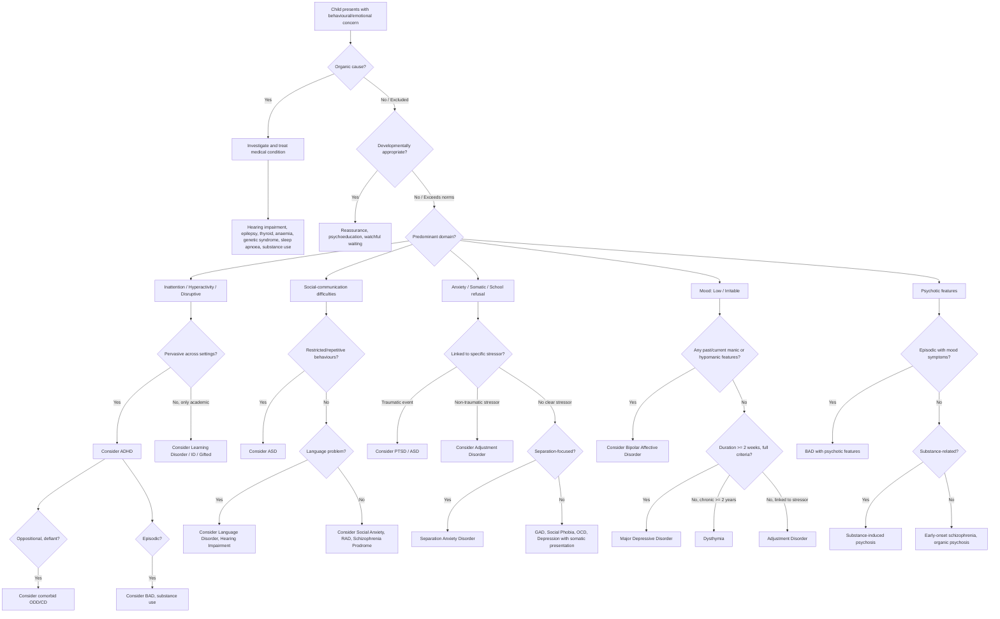

## Differential Diagnosis in Child Psychiatric Assessment

When a child or adolescent is brought for psychiatric assessment, the presenting complaint is almost never pathognomonic for a single condition. Children present with **behaviours** (aggression, school refusal, poor concentration) and **symptoms** (sadness, worry, odd behaviour) that sit at the intersection of multiple possible diagnoses. Your job during the differential diagnosis process is to systematically consider, weigh, and discriminate between these possibilities.

***The outcomes of history taking include: formulate and prioritize differential diagnoses; exclude the less likely differential diagnoses; ascertain severity of the problems and their impact on child and family.*** [4]

### Why Differential Diagnosis Is Harder in Children

1. **Developmental overlap**: Many "symptoms" are normal at certain ages (e.g., tantrums at 2, imaginary friends at 4, mood swings in early adolescence). The question is always: *is this beyond what is developmentally appropriate?* [1]
2. **High comorbidity**: Child psychiatric disorders are spectacularly comorbid. ADHD + ODD occurs in ~40–60% of cases; 70% of youth depression has comorbid anxiety; ASD frequently co-occurs with ADHD (30–50%) and intellectual disability [1]. You don't just pick one diagnosis — you often need to diagnose *several*.
3. **Limited self-report**: Young children can't tell you "I have intrusive thoughts" or "I feel anhedonia." You rely on behavioural observation and informant reports, which are inherently less specific.
4. **Phenotypic convergence**: Different underlying conditions can produce identical surface behaviours. A child who "can't sit still" might have ADHD, anxiety, mania, ASD, trauma-related hyperarousal, hyperthyroidism, or simply be in an understimulating classroom.

<Callout title="The Golden Rule of Child Psychiatric DDx">
Always ask: **"Could this presentation be explained by a different condition, a combination of conditions, or a normal developmental variant?"** Never anchor on the first diagnosis that comes to mind. The referral label (e.g., "query ADHD") is a hypothesis, not a conclusion.
</Callout>

---

### Organising Framework for Differential Diagnosis

The approach to DDx in child psychiatry can be organised by **presenting complaint** — because that is what you actually encounter clinically. Below, I present the major presenting complaint clusters with their differential diagnoses, the key distinguishing features, and the pathophysiological reasoning behind each distinction.

---

### 1. The Inattentive / Hyperactive / Disruptive Child

This is one of the commonest referral reasons. The child "can't concentrate," "is always on the go," "won't listen," or "is disruptive in class."

| Differential Diagnosis | Key Distinguishing Features | Pathophysiological Basis for Distinction |
|---|---|---|
| ***ADHD*** | ***Pervasive*** (present in ≥ 2 settings), ***onset before age 12***, chronic trait-like course. Core triad: inattention, hyperactivity, impulsivity. [1] | Fronto-striatal dopamine/noradrenaline hypoactivity → deficits in executive function (working memory, inhibition, planning). The symptoms are endogenous and stable, not situation-dependent |
| ***ODD*** | ***Negativity, hostility, defiance*** — resists work because of refusal to conform, not because of inability to sustain attention. ***Can co-occur with ADHD.*** [1] | Hypothesised to involve disrupted reward processing and impaired emotion regulation circuits (amygdala–OFC). The behaviour is volitional opposition, not cognitive inability |
| ***Conduct Disorder (CD)*** | More severe antisocial behaviours: ***aggression, stealing, truancy, delinquency, fire-setting***. Violation of societal rules and the rights of others [1] | Callous-unemotional traits linked to reduced amygdala reactivity to distress cues. Distinguished from ADHD by the intentional, antisocial nature of the acts |
| ***Learning disorder / Intellectual disability*** | ***Inattention is not pervasive — only during academic tasks.*** May appear inattentive from frustration, lack of interest, or limited cognitive ability. [1] ***Gifted children*** may also seem disruptive if under-stimulated | The "inattention" is secondary to task–ability mismatch, not a primary attentional deficit. Once the child is engaged in something within their ability range, attention is normal |
| ***ASD*** | May show ***inattention*** and ***social dysfunction***, but these arise from ***poor social skills and restricted interests*** rather than impulsivity and poor self-control. ***Normal imaginary play absent; pragmatic language often impaired.*** [1] | Atypical connectivity in social brain networks (superior temporal sulcus, mirror neuron system, medial PFC). "Inattention" reflects lack of social motivation rather than dopaminergic executive dysfunction |
| ***Anxiety disorders*** | Can appear distracted, but ***distraction is due to worrying themes*** (e.g., "What if mum doesn't pick me up?"), not external stimuli or novelty-seeking. [1] | Amygdala hyperactivation and threat-monitoring bias consume attentional resources, producing *anxiety-driven* inattention that mimics ADHD |
| ***Depression*** | ***Diminished concentration, poor motivation, indecisiveness*** — but these emerge ***only during depressive episodes*** when mood is low. ***Later onset, episodic course.*** [1] | Prefrontal hypofunction in depression affects executive and attentional function, but it is state-dependent (present only during episode), unlike the trait-like pattern of ADHD |
| ***Bipolar affective disorder (BAD)*** | ***Distractibility, impulsivity, talkativeness overlap*** with ADHD, but in BAD these are ***episodic*** and ***accompanied by elated mood, grandiosity, decreased need for sleep.*** [1] [5] | Mania involves widespread monoaminergic overactivity (especially dopamine in mesolimbic circuits), producing episodic bursts of disinhibited behaviour — contrast with chronic fronto-striatal hypofunction in ADHD |
| ***Substance use*** | ADHD-like symptoms occur ***only in the context of substance use*** — episodic, temporally linked to intoxication/withdrawal [1] | Stimulants, cannabis, and alcohol all disrupt prefrontal executive function, but the effect is pharmacologically mediated and time-limited |
| ***Hearing impairment*** | "Doesn't listen," poor language, appears inattentive — but ***responds normally to visual cues***, and inattention resolves when communication modality is changed (e.g., written instructions) | Conductive or sensorineural hearing loss prevents auditory input from reaching cortical processing centres — not an attentional deficit per se |
| ***Absence epilepsy*** | Brief "staring spells" (typically 5–15 seconds), abrupt onset/offset, may occur many times daily. ***Not associated with hyperactivity or impulsivity.*** EEG shows 3 Hz spike-and-wave | Generalised thalamocortical hypersynchrony produces transient loss of consciousness — distinct from the sustained inattention of ADHD |
| ***Obstructive sleep apnoea*** | Daytime hyperactivity and inattention secondary to ***poor sleep quality***. Look for snoring, mouth breathing, restless sleep, tonsillar hypertrophy | Fragmented sleep → daytime sleepiness → compensatory hyperactivity (paradoxical response in children, unlike adults who become somnolent) |

<Callout title="ADHD vs Bipolar in Children" type="error">
***Misdiagnosis is very common → correct diagnosis and treatment often delayed by 5–7 years on average.*** [5] ***~25% of BAD first presented as juvenile depression in their first episode.*** [1] ADHD is chronic and trait-like; BAD is episodic. ADHD does NOT feature grandiosity, decreased need for sleep, or flight of ideas. If you see episodic clusters of disinhibition with mood change, think BAD. ***Requires informants and collateral information (e.g., medical record) to confirm past history of mania/hypomania.*** [5]
</Callout>

---

### 2. The Socially Odd / Withdrawn Child

The child "doesn't have friends," "is in their own world," "behaves strangely."

| Differential Diagnosis | Key Distinguishing Features | Pathophysiological Basis |
|---|---|---|
| ***ASD*** | ***Persistent deficits in social communication + restricted, repetitive behaviours/interests.*** Onset in early developmental period. Social impairment is ***qualitative*** (not just quantitative) — deficits in reciprocity, non-verbal communication, and relationship development [1] | Atypical neural connectivity in the "social brain" (fusiform gyrus, amygdala, superior temporal sulcus, medial PFC) → impaired social cognition, theory of mind, and pragmatic language |
| ***ID / GDD*** | May have poor social skills, but these are ***developmentally appropriate for their cognitive level.*** Communication efforts are proportional to cognitive ability. ***No restricted/repetitive behaviours.*** [1] | Global neurodevelopmental impairment affects all domains proportionally. Social difficulty is a consequence of overall cognitive limitation, not a selective social-communication deficit |
| ***Language disorder*** | Difficulty with verbal communication, but ***normal non-verbal communication***, ***normal social reciprocity***, ***normal desire to communicate***, ***appropriate imaginative play***. ***No restricted/repetitive behaviours.*** [1] | Impairment is specifically in language production/comprehension circuits (Broca's/Wernicke's areas), while social cognition networks remain intact |
| ***Hearing impairment*** | Distinguished by ***normal social reciprocity, imaginative play, normal eye contact and facial expressions indicative of intention to communicate.*** [1] | Peripheral sensory deficit, not a central social-cognitive deficit. The child *wants* to interact but can't hear |
| ***Social anxiety disorder*** | Child *desires* social contact but is ***fearful*** of it — avoidance is driven by anxiety, not lack of interest. Has appropriate social skills when comfortable (e.g., with family) | Amygdala hyperreactivity to social threat cues → avoidance behaviour. Preserved social cognition (they *understand* social rules, they're just afraid of failing at them) |
| ***Selective mutism*** | Speaks normally in some settings (typically home) but ***not in others*** (typically school). Social anxiety is usually the underlying mechanism | Extreme social anxiety produces speech inhibition in specific contexts, not a global social-communication deficit |
| ***Schizophrenia (prodrome)*** | ***Social impairment and atypical interests/beliefs*** may resemble ASD. But look for ***positive symptoms of psychosis (delusions, hallucinations)*** and ***deterioration from a previous level of functioning*** [1] | Dopaminergic dysregulation (mesolimbic excess → positive symptoms; mesocortical deficit → negative symptoms). The social withdrawal is part of the negative symptom complex and represents *loss* of previously normal function |
| ***Reactive attachment disorder (RAD)*** | Results from severe early neglect/deprivation. Child shows ***emotionally withdrawn, inhibited behaviour*** with caregivers. Social deficits improve with appropriate caregiving environment | Disrupted attachment formation due to inadequate early caregiving → failure to develop normal social-emotional regulatory circuits. Distinguishable from ASD by history of deprivation and potential for improvement with environmental change |
| ***OCD*** | Behavioural features may overlap (repetitive behaviours), but in OCD these are ***experienced as distressing*** (ego-dystonic), whereas in ASD they are not. ***Social and communication skills usually normal*** in OCD [1] | OCD involves cortico-striato-thalamic loop dysfunction producing intrusive thoughts and compulsive responses. The repetitive behaviours serve to reduce anxiety, not to provide sensory satisfaction |
| ***Tic disorder / Stereotypic movement disorder*** | ***Repetitive purposeless motor behaviour*** but ***normal social, language, and communication skills*** [1] | Basal ganglia dysfunction produces involuntary movements, but social brain circuits are intact |

---

### 3. The Anxious / School-Refusing / Somatising Child

The child won't go to school, complains of headaches/stomachaches, seems worried all the time.

| Differential Diagnosis | Key Distinguishing Features | Developmental Context |
|---|---|---|
| ***Separation anxiety disorder (SAD)*** | ***Excessive fear of separation from attachment figures.*** May present with ***psychosomatic complaints*** (stomachache before school) [1]. Content is specifically about loss/harm to attachment figure | Developmentally normal in toddlers/preschool; pathological when persistent and severe beyond age 6–7 |
| ***Social phobia*** | Fear of ***social evaluation and humiliation***. Anxiety is focused on peer/teacher interactions, not on separation from parents | Emerges in early adolescence when social awareness and self-consciousness peak |
| ***Specific phobia*** | Fear of ***specific objects or situations*** (animals, blood, heights). Avoidance is limited to the phobic stimulus | Preschool/early childhood onset typical for animal/natural environment type |
| ***GAD*** | ***Excessive, uncontrollable worry about multiple domains*** — school, health, family, future. ***Unlike OCD, worries are about real-life concerns*** (not odd/magical beliefs) [1] | Late adolescence onset; resembles adult GAD |
| ***Panic disorder*** | ***Recurrent unexpected panic attacks*** with ***anticipatory anxiety*** about further attacks. Uncommon before puberty | Late adolescence; distinguished by the *unexpected* nature of the attacks (not cued by specific situations) |
| ***OCD*** | ***Intrusive thoughts*** (obsessions) that are ego-dystonic + ***rituals*** (compulsions) performed to reduce anxiety. Content may be contamination, harm, symmetry. Ruminations are ***odd, irrational, or magical*** [1] | Can present from age 6+; tic-related OCD especially in boys |
| ***Depression*** | School refusal + somatic complaints + withdrawal may be the presenting features. Look for ***irritable mood*** (may replace sadness in children), anhedonia, sleep/appetite changes [1] | In childhood: somatic complaints predominate. In adolescence: more adult-like features |
| ***PTSD*** | Anxiety symptoms are ***temporally linked to a traumatic event***. Re-experiencing (nightmares, flashbacks), avoidance of reminders, hyperarousal [1] | Can occur at any age; look for history of trauma (abuse, accident, witnessing violence) |
| ***Medical conditions*** | ***Hyperthyroidism*** (anxiety, tremor, weight loss, tachycardia), ***arrhythmias*** (palpitations mistaken for panic), ***neurological disease***, ***substance-induced anxiety*** (caffeine, drugs) [1] | Always exclude organic causes before concluding a primary psychiatric diagnosis |
| ***Adjustment disorder*** | Anxiety develops ***within 3 months of an identifiable stressor***, does not meet full criteria for another specific disorder, and typically ***resolves within 6 months*** of stressor cessation [1] | Common after school transitions, family upheaval, bereavement |
| ***Somatic symptom disorder*** | Physical symptoms with ***excessive thoughts, feelings, or behaviours related to the symptoms.*** Distinguished by the disproportionate preoccupation with somatic complaints beyond what is expected [1] | May present at any age; look for alexithymia and developmental history of poor emotional awareness |

<Callout title="School Refusal Is Not a Diagnosis" type="idea">
School refusal is a **behaviour**, not a diagnosis. It is the final common pathway of many conditions — separation anxiety, social phobia, depression, bullying, ASD (sensory overload), specific learning disorder (academic frustration), or even truancy in CD (but truancy is about doing something *more appealing*, whereas anxious school refusal is about *avoiding something frightening*). Always ask: "What is driving this child away from school?"
</Callout>

---

### 4. The Sad / Irritable / Withdrawn Adolescent

| Differential Diagnosis | Key Distinguishing Features |
|---|---|
| ***Major Depressive Disorder*** | Core symptoms of low mood/anhedonia ≥ 2 weeks + additional symptoms. In children: ***irritable mood and somatic complaints*** may predominate [1] |
| ***Bipolar Affective Disorder*** | ***Hypomanic episodes are often overlooked. Patients with BP II are misdiagnosed as having major depressive disorder.*** [5] Look for episodic mood elevation, decreased sleep need, grandiosity. ***~25% of BAD first presented as juvenile depression.*** [1] |
| ***Dysthymia*** | Chronic low-grade depressive symptoms ***not meeting full MDD criteria, lasting ≥ 2 years.*** May have "double depression" (dysthymia + superimposed MDD episodes) [1] |
| ***Adjustment disorder with depressed mood*** | Depressive symptoms temporally linked to a stressor, not meeting full MDD criteria [1] |
| ***Anxiety disorders*** | Anxiety and depression are highly comorbid in children (70% overlap). Distinguish which is primary by temporal sequence and predominant symptoms [1] |
| ***Substance use disorder*** | Substance-induced mood changes should resolve with cessation of use. Screen all adolescents |
| ***Medical conditions*** | Hypothyroidism, anaemia, chronic fatigue syndrome, epilepsy, autoimmune conditions (SLE), medications (corticosteroids, isotretinoin) |
| ***Bereavement / Grief*** | Normal grief can resemble depression but typically preserves self-esteem and is focused on the lost person. ***Prolonged grief disorder*** if symptoms persist beyond culturally normative period with functional impairment |
| ***Personality disorder (emerging)*** | ***BPD*** may present with affective instability, self-harm, identity disturbance in adolescents. ***Rapid mood shifts (hours/days) triggered by interpersonal issues*** distinguish from BAD (episodic, days-weeks, not necessarily interpersonally triggered) [1] |

---

### 5. The Child with Odd Beliefs or Unusual Experiences

Rare in pre-pubertal children, but important to consider in adolescents.

| Differential Diagnosis | Key Distinguishing Features |
|---|---|
| ***Early-onset schizophrenia*** | Onset before age 18 (very rare before 13). Positive symptoms (delusions, hallucinations) + negative symptoms (social withdrawal, flat affect, avolition) + cognitive decline. ***Must distinguish from normal childhood fantasy*** |
| ***Bipolar disorder with psychotic features*** | ***Manic episode with psychotic symptoms may be misdiagnosed as schizophrenia.*** [5] Psychotic symptoms change quickly in content and seldom outlast mood disruption in BAD [1] |
| ***ASD*** | "Odd beliefs" may actually be restricted interests expressed with unusual intensity. Social oddness reflects social-cognitive deficit, not psychosis. ***No hallucinations or formal thought disorder*** |
| ***PTSD with dissociative features*** | Flashbacks may be mistaken for hallucinations; hypervigilance may seem paranoid. Trauma history is key |
| ***OCD with poor insight*** | Obsessional beliefs may approach delusional intensity (overvalued ideas). Distinguished by preservation of other cognitive functions and absence of formal thought disorder |
| ***Substance-induced psychosis*** | Cannabis, especially high-potency forms, can induce psychotic episodes in adolescents. Should resolve with cessation |
| ***Organic causes*** | Anti-NMDA receptor encephalitis, Wilson's disease, temporal lobe epilepsy, brain tumour, metabolic disorders — always consider in first-episode psychosis |

---

### 6. ***Differential Diagnosis of Mania in Children/Adolescents*** [5]

***The differential diagnosis of a manic episode includes:*** [5]

- ***Depressive disorder with irritability and anxious distress*** [5] — Irritable depression can mimic the irritable variant of mania. Key distinguisher: in mania, there is also ↑energy, grandiosity, ↓need for sleep; in depression, energy is typically ↓
- ***Psychotic disorder or schizoaffective disorder*** [5] — Schizophrenia is the hardest to distinguish from mania [1]. In mania, psychotic symptoms change quickly and resolve with mood normalisation
- ***Substance/medication-induced/medical conditions*** [5] — e.g., stimulant use, corticosteroids, hyperthyroidism
- ***Attention deficit and hyperactivity disorder*** [5] — ADHD is chronic/trait-like; mania is episodic. ADHD should NOT feature ↑self-esteem, grandiosity, flight of ideas, ↓need for sleep [1]
- ***Personality disorder with prominent irritability*** [5] — Especially BPD. Mood shifts are rapid (hours), interpersonally triggered, without classic manic symptoms [1]

***Overdiagnosis of bipolar disorder can occur due to incorrect understanding of the term "manic" ("躁").*** [5] ***Among 180 outpatients previously diagnosed with bipolar disorder, structured interview could not confirm the diagnosis in 43 (33%) of them.*** [5] ***In another study, only 43% of 145 patients with a previous diagnosis of bipolar disorder had the condition confirmed by structured interview (retrospective recall can be inaccurate).*** [5] ***It is important to follow diagnostic criteria in making psychiatric diagnosis.*** [5]

***Underdiagnosis also occurs: hypomanic episodes are often overlooked, and patients with BP II are misdiagnosed as having major depressive disorder. Manic episodes with psychotic symptoms are misdiagnosed as schizophrenia.*** [5] ***Correct diagnosis and treatment was delayed by 5–7 years on average.*** [5]

---

### Diagnostic Decision Algorithm

The following flowchart guides the clinician through the DDx process when a child presents with a common symptom cluster:

---

### Key Cross-Cutting Principles for DDx in Children

#### Comorbidity Is the Rule, Not the Exception

In adult psychiatry, you often aim for a single parsimonious diagnosis. In child psychiatry, **you should expect comorbidity**:
- ADHD + ODD: ~40–60%
- ADHD + ASD: ~30–50% [1]
- Depression + Anxiety: ~70% [1]
- ASD + Intellectual Disability: ~30–50%
- CD + Substance Use: very common in adolescents

When conditions co-occur, diagnose **all** that meet criteria. Don't force a single label.

#### The Developmental Lens

The same underlying disorder presents differently depending on the child's developmental stage:

| Condition | Younger Child Presentation | Adolescent Presentation |
|---|---|---|
| **Depression** | Somatic complaints, irritability, behavioural problems [1] | More adult-like: sadness, anhedonia, suicidality |
| **Anxiety** | Separation anxiety, specific phobias, somatic complaints [1] | Social phobia, GAD, panic disorder [1] |
| **Bipolar** | Very rare; may present as extreme irritability, behavioural outbursts | More classic manic/depressive episodes |
| **OCD** | Rituals around bedtime, food, parents; poor insight | Clearer obsessions/compulsions, better verbalisation |
| **Psychosis** | Extremely rare; may be mistaken for developmental disorder | Prodromal symptoms, then positive/negative symptoms |

#### Organic Causes Must Always Be Considered

For every child psychiatric presentation, maintain a **low threshold for organic workup**:

| Psychiatric Presentation | Consider Organic |
|---|---|
| Inattention | Hearing loss, absence epilepsy, iron deficiency, OSA, thyroid |
| Developmental regression | Metabolic disorders, epileptic encephalopathy, Rett syndrome |
| First-episode psychosis | Anti-NMDA receptor encephalitis, Wilson's disease, TLE, substance use, brain tumour |
| New-onset mood change | Thyroid, Cushing's, medications, substance use, SLE |
| Anxiety with autonomic features | Thyrotoxicosis, phaeochromocytoma, hypoglycaemia, arrhythmia [1] |

#### Noting the Theme of Anxiety Helps Reach Diagnosis [1]

This is an elegant clinical shortcut from the senior notes:
- Worry about **gaining weight** → eating disorder
- Worry about **having a serious illness** → hypochondriacal disorder / illness anxiety
- Fear of being **poisoned or killed** → delusional beliefs (paranoid schizophrenia)
- Ruminatory thoughts of **guilt or worthlessness** → depression
- Associated with **obsessional thoughts or resisting compulsion** → OCD
- **Separation or abandonment** → separation anxiety, borderline/dependent PD
- Being **rejected or inadequate** → avoidant PD, social phobia [1]

---

<Callout title="High Yield Summary">

**Differential Diagnosis in Child Psychiatric Assessment — Key Points:**

1. **Always exclude organic causes first** — hearing loss, epilepsy, thyroid, anaemia, genetic syndromes, sleep disorders, substance use.
2. **Compare to developmental norms** — a behaviour is only a symptom if it exceeds what is expected for age and culture.
3. **Comorbidity is the rule** — expect and diagnose multiple conditions when criteria are met (ADHD+ODD, depression+anxiety, ASD+ID).
4. **Inattentive child DDx**: ADHD (pervasive, chronic) vs learning disorder (academic only) vs anxiety (worry-driven) vs depression (episodic) vs BAD (episodic with mood change) vs ASD (poor social skills, restricted interests) vs organic (hearing, epilepsy, OSA).
5. **Socially odd child DDx**: ASD (qualitative social deficit + restricted behaviours) vs ID (proportional delay) vs language disorder (normal non-verbal communication) vs social anxiety (desires but fears interaction) vs schizophrenia prodrome (deterioration from baseline + psychotic features).
6. **Bipolar DDx pitfalls**: Underdiagnosed (hypomania missed → labelled as MDD) AND overdiagnosed (incorrect use of "manic"/"躁"). Correct diagnosis delayed 5–7 years on average. Follow diagnostic criteria strictly; use collateral information.
7. **ADHD vs BAD**: ADHD is chronic/trait-like; BAD is episodic. ADHD lacks grandiosity, ↓sleep need, flight of ideas.
8. **School refusal is a behaviour, not a diagnosis** — systematically consider separation anxiety, social phobia, depression, bullying, ASD, specific learning disorder, or conduct-related truancy.
9. **Note the theme of anxiety** to guide DDx (weight → eating disorder, illness → hypochondriasis, intrusive thoughts → OCD, separation → SAD/BPD, rejection → social phobia/avoidant PD).

</Callout>

---

<ActiveRecallQuiz
  title="Active Recall - Differential Diagnosis in Child Psychiatry"
  items={[
    {
      question: "A 9-year-old boy is referred for 'cannot concentrate in class.' List five differential diagnoses and one key distinguishing feature for each.",
      markscheme: "ADHD (pervasive across settings, chronic), Learning disorder (inattention only during academic tasks), Anxiety (distraction from worrying themes), Absence epilepsy (brief staring spells with abrupt onset/offset, EEG 3Hz spike-wave), Hearing impairment (responds to visual cues, improves when communication modality changed). Also accept: ASD, depression, OSA, gifted child in understimulating environment.",
    },
    {
      question: "Explain three key features that distinguish ASD from intellectual disability when a child presents with social difficulties and language delay.",
      markscheme: "In ID: social skills are proportionate to cognitive level; communication efforts appropriate for developmental stage; no restricted/repetitive behaviours. In ASD: qualitative social communication deficit disproportionate to cognitive level; restricted/repetitive behaviours and interests present; pragmatic language impairment even if overall cognition is higher.",
    },
    {
      question: "Why is bipolar disorder both underdiagnosed AND overdiagnosed in clinical practice? Give specific reasons and the average delay in correct diagnosis.",
      markscheme: "Underdiagnosed because: hypomania is often overlooked so BP II is misdiagnosed as MDD; manic episodes with psychotic symptoms are misdiagnosed as schizophrenia. Overdiagnosed because: incorrect understanding of the term manic; structured interview cannot confirm diagnosis in up to one-third of previously labelled patients; retrospective recall is inaccurate. Average delay to correct diagnosis: 5-7 years.",
    },
    {
      question: "A 14-year-old girl refuses to attend school and complains of frequent stomachaches. List four possible psychiatric diagnoses and explain how you would differentiate between them.",
      markscheme: "Separation anxiety disorder (fear centres on separation from parents; somatic complaints before school), Social phobia (fear of social evaluation by peers/teachers; fine at home), Depression (low mood, anhedonia, irritability; somatic complaints plus mood symptoms), Adjustment disorder (onset within 3 months of identifiable stressor, does not meet full criteria for another disorder). Differentiate by: content and focus of anxiety, temporal relationship to stressors, presence/absence of core mood symptoms, pervasiveness across settings.",
    },
    {
      question: "List three organic conditions that can mimic ADHD in children and the investigation you would use to screen for each.",
      markscheme: "Hearing impairment (audiometry), Absence epilepsy (EEG showing 3Hz spike-and-wave), Iron deficiency anaemia (CBP plus ferritin). Also accept: obstructive sleep apnoea (polysomnography/sleep history), hyperthyroidism (TFTs), lead poisoning (blood lead level).",
    },
  ]}
/>

---

## References

[1] Senior notes: ryanho-psych.md (Chapter 12: Child Psychiatry, sections 12.1, 12.2, 12.3, 12.4, 12.5; Chapter 7: Mood Disorders; Chapter 8: Anxiety Disorders)
[4] Lecture slides: CFB (PAE01) Paediatric history taking.pdf (p22, Box 2.2 Outcomes of History Taking)
[5] Lecture slides: GC 163. I am a superman Bipolar disorder.pdf (p10, p12, p13)
