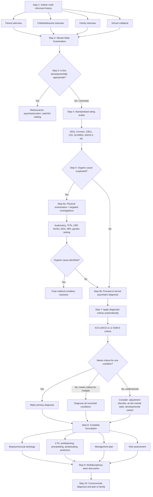

## Diagnostic Criteria, Diagnostic Algorithm, and Investigation Modalities

### Why Diagnostic Criteria Matter in Child Psychiatry

In adult psychiatry, the patient usually tells you what's wrong and you map their self-report onto diagnostic criteria. In child psychiatry, you're trying to pin a diagnostic label on a moving target — the child's behaviour changes with context, development, and who is watching. This makes rigorous use of diagnostic criteria even more important, because without structured criteria the risk of both **over-diagnosis** and **under-diagnosis** is enormous.

***It is important to follow diagnostic criteria in making psychiatric diagnosis.*** [5] ***Requires informants and collateral information (e.g., medical record) to confirm past history.*** [5] ***Among 180 outpatients previously diagnosed with bipolar disorder, structured interview could not confirm the diagnosis in 43 (33%) of them.*** [5] The lesson: clinical impression alone is insufficient. You must systematically apply criteria.

**Diagnostic criteria typically consist of** [1]:
- **Core (discriminating) symptoms**: present in the defined disorder but seldom in others
- **Associated (characteristic) symptoms**: frequent in the defined disorder but also seen in others
- **Minimal duration** of symptoms
- **Distress or impairment in functioning**
- **Exclusion criteria**

In child psychiatry, there are two additional layers:
1. **Developmental appropriateness** — the symptoms must exceed what is normal for the child's age and culture
2. **Pervasiveness** — for many conditions (especially ADHD), symptoms must be present across multiple settings (home, school, clinic)

---

### A. Diagnostic Criteria for Major Child Psychiatric Conditions

Below are the diagnostic criteria for the conditions most commonly encountered (and examined) in child psychiatry. I present both ICD (ICD-10/ICD-11, the system used in Hong Kong's Hospital Authority) and DSM-5 where relevant, highlighting key differences.

---

#### A1. Autism Spectrum Disorder (ASD)

| Feature | ICD-10 — Childhood Autism (F84.0) | DSM-5 — Autism Spectrum Disorder |
|---|---|---|
| **Domain A: Social** | Qualitative impairments in ***reciprocal social interaction*** | ***Persistent deficits in social communication and social interaction across multiple contexts***, manifest by ALL 3 of: (1) Deficits in socio-emotional reciprocity; (2) Deficits in non-verbal communicative behaviours; (3) Deficits in developing, maintaining and understanding relationships [1] |
| **Domain B: Restricted behaviours** | ***Restricted, repetitive and stereotyped patterns of behaviour, interests and activities*** | ***Restricted, repetitive patterns of behaviour, interests or activities*** manifest by ≥ 2 of: (1) Stereotyped/repetitive motor movements, use of objects, or speech; (2) Insistence on sameness, inflexible routines; (3) Highly restricted, fixated interests abnormal in intensity or focus; (4) Hyper- or hyporeactivity to sensory input [1] |
| **Domain C: Communication** | Qualitative impairments in ***communication*** (separate domain) | Merged into Domain A (social communication) — language impairment is ***no longer a separate criterion*** in DSM-5 [1] |
| **Onset** | ***Developmental abnormalities must have been present in the first 3 years*** | ***Symptoms must be present in the early developmental period*** but may not become fully manifest until social demands exceed limited capacities, or may be masked by learned strategies [1] |
| **Functional impact** | Implied | ***Symptoms cause clinically significant impairment in functioning*** [1] |
| **Exclusion** | — | ***Not better explained by ID or GDD.*** To make comorbid ASD + ID diagnosis, social communication should be ***below that expected for general developmental level*** [1] |
| **Specifiers** | Separate categories (Asperger's, PDD-NOS, etc.) | Single spectrum; specify severity level (1–3), with/without intellectual impairment, with/without language impairment [1] |

**Key conceptual difference**: DSM-5 collapsed the old ICD-10 triad (social + communication + restricted behaviours) into a **dyad** (social-communication + restricted behaviours). This reflects the recognition that social interaction and communication are inseparable constructs. DSM-5 also added **sensory hyper/hyporeactivity** as a criterion — something not explicit in ICD-10 but clinically very important (e.g., covering ears in loud environments, fascination with spinning objects). [1]

<Callout title="ASD Diagnosis in Girls" type="error">
Girls with ASD frequently "mask" or "camouflage" their social difficulties by mimicking peers. They may have superficially adequate social skills that fool structured assessments. This means the DSM-5 clause — "may not become fully manifest until social demands exceed limited capacities, or may be masked by learned strategies" — is especially relevant for late-diagnosed females. Always probe beyond surface presentation.
</Callout>

---

#### A2. Attention-Deficit Hyperactivity Disorder (ADHD)

| Feature | ICD-10 — Hyperkinetic Disorder (F90) | DSM-5 — ADHD |
|---|---|---|
| **Symptom domains** | Requires ***both*** inattention + hyperactivity-impulsivity to be present (i.e., combined type only under ICD-10) | Three presentations: (1) Predominantly inattentive; (2) Predominantly hyperactive-impulsive; (3) Combined [1] |
| **Inattention** | ≥ 6 of 9 inattention symptoms | ≥ 6 of 9 (for < 17 years); ≥ 5 of 9 (for ≥ 17 years) [1] |
| **Hyperactivity-Impulsivity** | ≥ 3 hyperactivity + ≥ 1 impulsivity symptom | ≥ 6 of 9 hyperactive-impulsive symptoms (for < 17); ≥ 5 (for ≥ 17) [1] |
| **Age of onset** | ***Before age 6 years*** ("before school age") | ***Several symptoms present prior to age 12 years*** [1] — DSM-5 raised the threshold from 7 to 12, recognising that inattention-predominant ADHD may not become evident until later academic demands increase |
| **Pervasiveness** | Must be present across situations | ***Several symptoms present in ≥ 2 settings*** [1] |
| **Functional impact** | Interference with functioning | ***Clear evidence of interference with or quality of functioning*** [1] |
| **Exclusion** | Should not occur during a psychotic episode | ***Do not occur exclusively during course of psychotic disorder, not better explained by another mental disorder*** [1] |

**DSM-5 Inattention symptoms** (need ≥ 6/9) [1]:
1. Fails to give close attention to details / makes careless mistakes
2. Difficulty sustaining attention in tasks or play
3. Does not seem to listen when spoken to directly
4. Does not follow through on instructions / fails to finish work
5. Difficulty organising tasks and activities
6. Avoids tasks requiring sustained mental effort
7. Loses things necessary for tasks
8. Easily distracted by extraneous stimuli
9. Forgetful in daily activities

**DSM-5 Hyperactivity-Impulsivity symptoms** (need ≥ 6/9) [1]:
1. ***Often fidgets with or taps hands or feet or squirms in seat*** [1]
2. ***Often leaves seat when remaining seated is expected*** [1]
3. ***Often runs about or climbs in inappropriate situations*** [1]
4. ***Often unable to play or engage in leisure activities quietly*** [1]
5. ***Often "on the go," acting as if "driven by a motor"*** [1]
6. ***Often talks excessively*** [1]
7. ***Often blurts out an answer before a question has been completed*** [1]
8. ***Often has difficulty waiting his or her turn*** [1]
9. ***Often interrupts or intrudes on others*** [1]

**Why the ICD–DSM difference matters**: ICD-10's stricter criteria (requiring both domains + onset < 6) mean it captures a narrower, more severely affected group. DSM-5's broader definition captures the "inattentive" presentation (historically called ADD), which includes many girls and older children who would be missed by ICD-10.

<Callout title="ADHD Diagnosis in the Real World">
***Associated features include disinhibition in social relationships, recklessness in dangerous situations, impulsive flouting of social rules.*** [1] However, note that ***learning disorders and motor clumsiness occur with undue frequency and should be noted separately — they should not be part of the actual diagnosis of hyperkinetic disorder.*** [1] Many children referred for "ADHD" actually have a primary learning disorder with secondary frustration mimicking inattention.
</Callout>

---

#### A3. Oppositional Defiant Disorder (ODD) — DSM-5 Criteria

| Criterion | Details |
|---|---|
| **A. Pattern of angry/irritable mood, argumentative/defiant behaviour, or vindictiveness** | Lasting ≥ 6 months, with ≥ 4 symptoms from: (1) Often loses temper; (2) Often touchy or easily annoyed; (3) Often angry and resentful; (4) Often argues with authority figures; (5) Often actively defies or refuses to comply with requests or rules; (6) Often deliberately annoys others; (7) Often blames others for mistakes; (8) Has been spiteful or vindictive ≥ 2× in past 6 months |
| **B. Disturbance in behaviour** | Associated with distress in the individual or others in their immediate social context, OR impacts negatively on social, educational, occupational functioning |
| **C. Exclusion** | Not exclusively during psychotic, substance use, depressive, or bipolar disorder; does not meet criteria for disruptive mood dysregulation disorder (DMDD) |
| **Severity** | Mild (1 setting), Moderate (2 settings), Severe (≥ 3 settings) |

Why ODD has three dimensions: Research has shown ODD symptoms cluster into **three factors** — (1) angry/irritable mood, (2) argumentative/defiant behaviour, (3) vindictiveness — and these predict different outcomes. The angry/irritable cluster predicts **emotional disorders** (depression, anxiety); the defiant/vindictive cluster predicts **conduct disorder**. This explains why ODD sits at the crossroads between emotional and behavioural pathology. [1]

---

#### A4. Conduct Disorder (CD) — DSM-5 Criteria

| Criterion | Details |
|---|---|
| **A. Pattern of behaviour violating rights of others or societal norms** | ≥ 3 of 15 criteria in past 12 months (with ≥ 1 in past 6 months), across 4 categories: (1) Aggression to people/animals; (2) Destruction of property; (3) Deceitfulness or theft; (4) Serious violations of rules |
| **B. Functional impairment** | Clinically significant impairment in social, academic, or occupational functioning |
| **C. Age exclusion** | If ≥ 18 years, criteria for antisocial personality disorder are not met |
| **Specifiers** | ***Childhood-onset type*** ( ≥ 1 symptom before age 10); ***Adolescent-onset type*** (no symptoms before 10); ***Unspecified onset***. Also: with limited prosocial emotions (callous-unemotional traits) |

**Why onset type matters**: ***Prognosis is worse for early-onset cases (antisocial behaviour in 40% early-onset cases and only 20% in adolescent-onset cases).*** [1] Early-onset CD is more strongly associated with neurobiological risk factors (low amygdala reactivity, executive dysfunction), while adolescent-onset CD may be more influenced by peer-group and social factors. [1]

---

#### A5. Depressive Disorders in Children/Adolescents

The same ICD-10 and DSM-5 criteria for depressive episode apply in children, with important modifications in presentation:

**ICD-10 Depressive Episode** [1]:
- At least 2 of 3 core symptoms (Section A): (1) Depressed mood; (2) Loss of interest/enjoyment; (3) Reduced energy
- Plus associated symptoms (Section B): reduced concentration, reduced self-esteem, ideas of guilt, pessimistic thoughts, ideas of self-harm, disturbed sleep, diminished appetite
- **Mild**: ≥ 2A + ≥ 2B; **Moderate**: ≥ 2A + ≥ 3B; **Severe**: all 3A + ≥ 4B [1]
- Duration ≥ 2 weeks

**Child-specific considerations**:
- In children, **irritable mood may substitute for depressed mood** (DSM-5 explicitly allows this)
- Somatic complaints (headache, abdominal pain, enuresis) are often the presenting feature rather than expressed sadness [1]
- Weight gain failure (rather than weight loss) may represent appetite disturbance in growing children

<Callout title="Juvenile Depression and Bipolar Risk" type="error">
***~25% of bipolar affective disorder first presented as juvenile depression in their first episode.*** [1] ***Hypomanic episodes are often overlooked. Patients with BP II are misdiagnosed as having major depressive disorder.*** [5] This means: every adolescent presenting with depression must be carefully screened for any past history of elated mood, decreased sleep need, or episodic behavioural change.
</Callout>

---

#### A6. Anxiety Disorders in Children

***Anxiety and fears can be developmentally appropriate. Diagnosis is made only when developmentally inappropriate (more severe and prolonged than usual) AND causes significant distress + functional impairment.*** [1]

Key criteria for **Separation Anxiety Disorder** (DSM-5):
- Developmentally inappropriate and excessive anxiety concerning separation from home or attachment figures
- ≥ 3 of 8 symptoms (e.g., recurrent excessive distress when separation occurs/anticipated, worry about losing/harm to attachment figures, reluctance to go out, nightmares, physical symptoms)
- Duration ≥ 4 weeks in children (6 months in adults)
- Clinically significant distress or functional impairment

---

### B. The Diagnostic Algorithm — A Systematic Approach

The diagnostic process in child psychiatry is not a single moment; it unfolds across multiple encounters. Here is the step-by-step algorithm:

#### Explanation of Each Step

**Step 1 — Multi-informant history**: As detailed in Part 1. ***Parents are the primary informants.*** [4] ***Observe the interaction between parents/carers and the child.*** [4] ***Note the chronology and severity of presenting and associated symptoms, previous consultations, explore concerns of parents and carers, and identify important medical and psychosocial problems.*** [4]

**Step 2 — Mental State Examination**: Developmentally adapted MSE. ***Observe for: sensorium and cognition (level of awareness, language abilities, spatial abilities, motor coordination or clumsiness), thought/perception (delusions, hallucinations, thought disorders), insight.*** [1]

**Step 3 — Developmental appropriateness**: Compare to same-age, same-culture norms. This is the uniquely paediatric "filter" — many referrals will be for behaviours that are within normal developmental range. [1]

**Step 4 — Standardised instruments**: These quantify severity and provide cross-situational data (separate parent and teacher ratings). ***Standardized behaviour rating scales: more objective but diagnosis should still be based on structured interview and collateral information only (rating is for reference only).*** [1]

**Step 5–6 — Organic exclusion**: A critical step. Physical examination and targeted investigations (detailed below). [1]

**Step 7 — Systematic criteria application**: Map clinical findings onto ICD/DSM criteria. Don't diagnose by gestalt — use the checklist. [5]

**Step 8 — Formulation**: ***Formulation: integrated summary/understanding including diagnosis, aetiology, management, and prognosis.*** [1]

**Step 9 — MDT discussion**: In Hong Kong's CAMHS, diagnosis is typically confirmed through multidisciplinary review. ***Day hospital assessment by multidisciplinary team using standardised assessment.*** [1] This includes psychiatrist, clinical psychologist, educational psychologist, occupational therapist, speech therapist, and medical social worker.

**Step 10 — Communication**: Explain diagnosis, prognosis, and management plan to the family in developmentally appropriate terms. Address parental guilt, stigma, and misunderstanding.

---

### C. Assessment Protocol by Condition

For efficiency, here is a condition-specific assessment summary showing which tools and assessments are indicated:

#### C1. ASD Assessment Protocol [1]

| Component | Details | Why |
|---|---|---|
| ***Clinical interview and assessment*** | ***Most important*** [1]. Multi-informant developmental history with focus on social-communication milestones, restricted interests, sensory behaviours | The core diagnostic act — no instrument replaces clinical judgment |
| ***Day hospital assessment by MDT using standardised assessment*** [1] | Child observed across structured and unstructured settings over 1–2 days by multiple professionals simultaneously | Captures behaviour across contexts; reduces single-setting bias |
| **ADOS-2** (Autism Diagnostic Observation Schedule) | Semi-structured, standardised observation. Clinician creates social "presses" (opportunities for the child to respond socially) and scores social-communication and restricted/repetitive behaviours | Gold standard observational tool; high sensitivity and specificity when combined with clinical judgment |
| **ADI-R** (Autism Diagnostic Interview-Revised) | Structured parent interview covering early development and current function in social interaction, communication, and restricted behaviours | Captures developmental trajectory and behaviours not always observable in clinic |
| ***Education assessment*** [1] | Academic attainment, learning style, classroom behaviour | Identifies comorbid learning disorders and guides school placement |
| ***IQ test*** [1] | WISC-V or equivalent | Determines intellectual functioning; required to specify "with/without intellectual impairment" in DSM-5 and to differentiate ASD from isolated ID |
| ***OT assessment*** [1] | Sensory profile, fine motor skills, adaptive daily living skills | Sensory processing differences are a diagnostic criterion in DSM-5; OT assessment quantifies these and guides intervention |
| ***Speech therapist assessment*** [1] | Receptive and expressive language, pragmatic language | Language impairment is common (though not required for DSM-5 diagnosis); pragmatic language assessment is especially important for higher-functioning individuals |
| **Theory of Mind tests** | First-order (Sally-Anne test), second-order false belief tasks [1] | Assesses perspective-taking ability — impaired in ASD. Not diagnostic alone but informative |
| **Vineland Adaptive Behavior Scales** | Parent/caregiver interview measuring adaptive functioning across communication, daily living, socialisation, motor domains | Required to assess adaptive functioning level; helps determine support needs |

#### C2. ADHD Assessment Protocol [1]

| Component | Details | Why |
|---|---|---|
| **Clinical interview** | ***Suspicion: detected at primary care (but not diagnosed).*** [1] Detailed developmental/behavioural history from parents AND teacher. Focus on onset, pervasiveness, functional impact | Core diagnostic information. Must demonstrate symptoms in ≥ 2 settings |
| **Conners Rating Scales / Vanderbilt** | Separate parent and teacher versions; quantify inattention, hyperactivity-impulsivity severity | Cross-situational severity quantification; rating discrepancy between home/school is clinically informative |
| **SDQ (Strengths and Difficulties Questionnaire)** | Brief screening tool with parent, teacher, and self-report versions | Good for initial screening; identifies hyperactivity/inattention, conduct problems, emotional symptoms, peer problems, prosocial behaviour |
| **Cognitive/IQ testing** | WISC-V | Rules out intellectual disability as primary explanation; identifies processing speed and working memory weaknesses (common cognitive profile in ADHD) |
| **Educational assessment** | Reading, writing, mathematics attainment | Rules out specific learning disorder (comorbid in ~25%) [1] |
| **Continuous Performance Test (CPT)** | Computerised test of sustained attention and impulsivity (e.g., TOVA, Conners CPT) | Objective measure of attention; useful adjunct but not diagnostic alone |
| ***Stepped approach*** [1] | ***Mild: advice, support, watchful waiting, offer group parent training. Moderate: refer to specialists at school age for behavioural therapy or medications. Severe: refer to specialists for medications as 1st choice.*** [1] | Stepped care ensures proportionate response and avoids over-medicalisation of mild cases |

---

### D. Investigation Modalities — Physical Examination and Ancillary Tests

The purpose of investigations in child psychiatry is threefold:
1. **Exclude organic mimics** of psychiatric symptoms
2. **Identify comorbid medical conditions** that modify management
3. **Establish baseline** before pharmacotherapy

***Physical examination: only indicated if concern of presence of any genetic or medical disorders.*** [1] However, in practice, a baseline physical examination (including growth parameters, dysmorphology screen, and neurological examination) is prudent at first assessment.

#### D1. Mandatory Baseline Investigations for All Children Starting Psychotropic Medication

| Investigation | Key Findings and Interpretation | Why |
|---|---|---|
| **Height, weight, BMI** (plotted on growth chart) | Baseline growth parameters | Stimulants (methylphenidate, lisdexamfetamine) suppress appetite → can reduce growth velocity. Antipsychotics (risperidone, olanzapine) cause weight gain. You need a baseline to monitor change |
| **Blood pressure, heart rate** | Hypertension, tachycardia, bradycardia | Stimulants ↑ sympathetic tone → ↑BP/HR. Must exclude pre-existing cardiovascular disease |
| **ECG** | Long QT interval, arrhythmias | ***ECG: long QT (lithium, TCA)*** [1]. Required before starting TCAs, some antipsychotics, atomoxetine (especially with family history of sudden cardiac death or congenital long QT syndrome) |

#### D2. Targeted Investigations by Clinical Indication

| Investigation | When to Order | Key Findings and Interpretation |
|---|---|---|
| **CBP (Complete Blood Picture)** | Fatigue, pallor, pica, suspected nutritional deficiency, pre-medication baseline | ***↓Hb (anaemia)*** — iron deficiency anaemia causes fatigue, poor concentration, restless legs that mimic ADHD. ***↑MCV (macrocytosis)*** — suggests B12/folate deficiency or maternal alcohol exposure. ***↑WBC*** — infection as cause of behavioural change [1] |
| **Ferritin** | Restless legs, pica, suspected iron deficiency | Ferritin < 20 µg/L in children is associated with restless legs syndrome and worsening of ADHD symptoms. Iron is a cofactor for tyrosine hydroxylase (the rate-limiting enzyme in dopamine synthesis) — low iron → low dopamine → worse inattention |
| **Thyroid function tests (TFTs)** | Mood changes, weight changes, lethargy, hyperactivity, pre-lithium baseline | ***Hypothyroidism***: fatigue, weight gain, poor concentration, depressed mood — mimics depression. ***Hyperthyroidism***: anxiety, restlessness, tremor, weight loss — mimics anxiety disorder or mania. ***Lithium-induced hypothyroidism***: must monitor [1] |
| **Renal function tests (RFT)** | Pre-medication baseline (especially lithium), suspected dehydration | ***U/Cr (renal dosing)*** [1]. Lithium is renally cleared; renal impairment → lithium toxicity. Check baseline before and regularly during lithium therapy |
| **Liver function tests (LFT)** | Pre-medication baseline (valproate, carbamazepine), suspected eating disorder, suspected substance use | ***Alb (malnutrition)*** — low in severe eating disorders, neglect. ***↑GGT*** — suggests alcohol use in adolescents. Valproate is hepatotoxic — baseline LFTs required [1] |
| **Blood glucose / HbA1c** | Pre-antipsychotic baseline, obesity, suspected metabolic syndrome | Atypical antipsychotics (especially olanzapine, clozapine) increase risk of type 2 diabetes and metabolic syndrome. Baseline glucose/HbA1c essential before starting these medications |
| **Lipid profile** | Pre-antipsychotic baseline | Same rationale — antipsychotics (especially olanzapine) cause dyslipidaemia |
| **Prolactin** | Before and during antipsychotic treatment (especially risperidone) | Risperidone strongly blocks D2 receptors in tuberoinfundibular pathway → hyperprolactinaemia → gynaecomastia, galactorrhoea, menstrual irregularity in adolescents |
| **Urine toxicology screen** | Suspected substance use, behavioural change in adolescents | ***Urine/serum toxicology (substance abuse)*** [1]. Cannabis, amphetamines, opioids, benzodiazepines. Substance-induced mood/psychotic symptoms should resolve with cessation |
| **B12 and folate** | Developmental regression, macrocytic anaemia, suspected nutritional deficiency | ***B12/folate deficiency*** [1] — can cause cognitive impairment, mood changes, neuropathy. Relevant in severe eating disorders and neglect |
| **Calcium** | Mood changes, psychosis, fatigue | ***Ca (mood changes/psychosis)*** [1]. Hypercalcaemia → depression, confusion, psychosis. Hypocalcaemia → anxiety, irritability, seizures |
| **ESR/CRP** | Suspected autoimmune or inflammatory condition (SLE, anti-NMDA receptor encephalitis) | ***ESR/CRP*** [1] — elevated in inflammatory/autoimmune conditions that can present with psychiatric symptoms |

#### D3. Neurological and Genetic Investigations

| Investigation | When to Order | Key Findings and Interpretation |
|---|---|---|
| **EEG** | Suspected seizures (staring spells, developmental regression, unusual episodic behaviours) | ***EEG for epilepsy*** [1]. Absence seizures: 3 Hz spike-and-wave. Temporal lobe epilepsy: temporal spikes/sharp waves (can cause behavioural changes, psychotic symptoms). Epileptic encephalopathies (e.g., Lennox-Gastaut): generalised slow spike-wave |
| **CT / MRI Brain** | First-episode psychosis, developmental regression, focal neurological signs, head injury, micro/macrocephaly | ***CT/MRI: head injury, neurological conditions*** [1]. Look for: structural lesions (tumour, demyelination), white matter abnormalities, cortical malformations, hydrocephalus. MRI preferred (no radiation, better resolution) |
| **Audiometry** | Suspected hearing impairment, language delay, apparent inattention | Conductive hearing loss (e.g., chronic otitis media with effusion — very common in young children) or sensorineural hearing loss can fully explain "inattention" and "language delay." This is a cheap, non-invasive test that should have a low threshold for ordering |
| **Visual assessment** | Suspected visual impairment, school difficulties | Poor vision → poor reading → school failure → frustration → behavioural problems. Squinting, sitting close to screen/board |
| **Chromosomal microarray / Karyotype** | ID with dysmorphic features, ASD with ID, suspected genetic syndrome | Detects copy number variants (CNVs) — deletions/duplications associated with neurodevelopmental conditions (e.g., 22q11.2 deletion → DiGeorge/velocardiofacial syndrome → high schizophrenia risk; 15q11-13 duplication → ASD) |
| **Fragile X testing (FMR1 gene)** | Males with unexplained ID ± ASD features, family history of ID | Fragile X syndrome is the commonest inherited cause of ID. CGG trinucleotide repeat expansion in FMR1 gene → loss of FMRP protein → abnormal synaptic plasticity. Clinical features: long face, large ears, macroorchidism (post-pubertal), intellectual disability, social anxiety, gaze avoidance |
| **Metabolic screen** | Developmental regression, unexplained neurological deterioration, consanguinity | Amino acids, organic acids, lactate, ammonia, very-long-chain fatty acids. Identifies inborn errors of metabolism (phenylketonuria, urea cycle disorders, mitochondrial disorders, lysosomal storage diseases) |
| **Anti-NMDA receptor antibodies** | First-episode psychosis (especially in adolescent girls), seizures + psychiatric symptoms, movement disorder + psychosis | Anti-NMDA receptor encephalitis: autoimmune condition presenting with psychiatric symptoms (psychosis, behavioural change), seizures, movement disorders, and autonomic instability. Often associated with ovarian teratoma. Treatable with immunotherapy — must not be missed |

<Callout title="Don't Miss Anti-NMDA Receptor Encephalitis" type="error">
In any adolescent (especially female) presenting with first-episode psychosis plus seizures, movement disorder, or rapid cognitive decline, **always test for anti-NMDA receptor antibodies**. This condition is treatable (immunotherapy, tumour removal) but fatal if missed. It was the condition behind the memoir "Brain on Fire" by Susannah Cahalan. The psychiatric symptoms precede the neurological ones, so psychiatrists are often the first to see these patients.
</Callout>

#### D4. Psychometric and Standardised Assessment Tools — Detailed Interpretation

| Tool | What It Measures | How to Interpret |
|---|---|---|
| **WISC-V** (Wechsler Intelligence Scale for Children, 5th edition) | Full-Scale IQ (FSIQ) plus five index scores: Verbal Comprehension, Visual-Spatial, Fluid Reasoning, Working Memory, Processing Speed | FSIQ < 70 with impaired adaptive function = intellectual disability. Discrepancy between indices is informative: e.g., low Working Memory + low Processing Speed with normal Verbal Comprehension → classic ADHD cognitive profile. High Verbal but low Performance → consider non-verbal learning disability |
| **Vineland Adaptive Behavior Scales (3rd ed.)** | Adaptive functioning across Communication, Daily Living Skills, Socialisation, Motor Skills | Required alongside IQ testing to diagnose intellectual disability (ID = low IQ + impaired adaptive functioning). A child with IQ 65 but good adaptive skills may not meet ID criteria |
| **ADOS-2** (Autism Diagnostic Observation Schedule) | Observed social-communication and restricted/repetitive behaviours during semi-structured interaction | Provides calibrated severity score (CSS) 1–10. CSS ≥ 4 suggests ASD; ≥ 6 suggests moderate-to-severe. Must be interpreted alongside clinical history — not diagnostic in isolation |
| **ADI-R** (Autism Diagnostic Interview-Revised) | Parent-reported developmental history and current symptoms in ASD domains | Algorithm scores compared to diagnostic cut-offs for (1) social interaction, (2) communication, (3) restricted behaviours. Meeting cut-off on all three domains + early onset = ASD positive |
| **Conners 4** | ADHD symptoms (inattention, hyperactivity-impulsivity) + comorbid domains (learning, aggression, social problems) | T-scores ≥ 65 = elevated (1.5 SD above mean). Parent AND teacher ratings must be obtained — discrepancy between raters is itself diagnostically informative (if only one rater elevated, consider environment-specific factors) |
| **SDQ** (Strengths and Difficulties Questionnaire) | Five domains: emotional, conduct, hyperactivity, peer problems, prosocial behaviour | Total score > 17 (parent/teacher) = abnormal. Profile pattern guides diagnostic direction: e.g., high hyperactivity + high conduct = consider ADHD + ODD |
| **CDI** (Children's Depression Inventory) | Self-reported depressive symptoms in children 7–17 years | Total score ≥ 20 suggests significant depressive symptoms. Subscales: negative mood, interpersonal problems, ineffectiveness, anhedonia, negative self-esteem |
| **SCARED** (Screen for Child Anxiety Related Disorders) | Self- and parent-reported anxiety across GAD, separation anxiety, social phobia, school avoidance, panic/somatic | Total score ≥ 25 suggests clinically significant anxiety. Subscale profile helps differentiate specific anxiety disorders |

---

### E. The Structured Interview in Child Psychiatry

***Reliability of diagnosis is limited by information variance (inadequate interview technique or patient inconsistencies) and criterion variance (inadequate use of diagnostic criteria). The former can be improved by use of structured interviewing schedules.*** [1]

| Structured Interview | Population | What It Does |
|---|---|---|
| **K-SADS-PL** (Kiddie Schedule for Affective Disorders and Schizophrenia, Present and Lifetime) | Children and adolescents 6–18 years | Semi-structured interview administered to parent and child separately; screens for all major Axis I disorders. Generates DSM diagnoses. Gold standard research tool also used clinically |
| **DISC** (Diagnostic Interview Schedule for Children) | Children 9–17 years (and parents of 6–17 year olds) | Highly structured interview (can be administered by trained lay interviewers); generates DSM and ICD diagnoses |
| **DAWBA** (Development and Well-Being Assessment) | Children 5–17 years | Combines structured questions with open-ended descriptions reviewed by a clinician. Computer-generated probability of diagnosis |
| **ADI-R** | Parents of children suspected of ASD | ASD-specific structured interview (detailed above) |

---

### F. Example Structure of Clinical Assessment [1]

This practical sequence was outlined in the senior notes and represents how a CAMHS assessment actually flows in Hong Kong practice:

1. ***Observation, brief introduction, and rule-setting*** [1]
2. ***Play alone to warm up; observe how the child plays and interacts with parents and clinician*** [1]
3. ***Look for any symptom manifestations*** [1]
4. ***3-step task: Chinese and English writing, drawing about family or school, short-term memory*** [1] — This informally screens for learning difficulties (handwriting quality, language level), family dynamics (family drawing is a projective tool), and working memory (relevant to ADHD)
5. ***Copying task for dyslexia*** [1] — Shape copying tests visual-motor integration; mirror writing or letter reversals persist abnormally in dyslexia
6. ***Interview child alone: look for any separation anxiety*** [1]
   - ***Talk about family — ask who they like the most, describe family members*** [1] — If descriptions are purely physical (e.g., "daddy is fat") rather than relational, this may indicate problems with attachment or emotional connection [1]
   - ***Discuss school, peer relationships, classroom behaviour, studies*** [1]
   - ***Discuss why the child has come this time and patient's own understanding*** [1] — This is the child's "insight" and affects motivation for intervention and treatment concordance
   - ***Aspirations and projective questioning on 3 wishes*** [1]
7. ***Theory of Mind tests: first-order, second-order*** [1] — Used when ASD is in the differential

---

<Callout title="High Yield Summary">

**Diagnostic Criteria, Algorithm, and Investigations in Child Psychiatry:**

1. **Always use diagnostic criteria systematically** — clinical impression alone leads to overdiagnosis and underdiagnosis. Up to 33% of BAD diagnoses could not be confirmed by structured interview.
2. **ASD**: DSM-5 dyad = social-communication deficits (all 3 needed) + restricted/repetitive behaviours (≥ 2 of 4). Onset in early developmental period. Not better explained by ID alone.
3. **ADHD**: ≥ 6/9 inattention and/or ≥ 6/9 hyperactivity-impulsivity symptoms. Present before age 12 (DSM-5) or 6 (ICD-10). Pervasive (≥ 2 settings). ICD-10 is stricter (requires both domains); DSM-5 allows inattentive-only and hyperactive-only presentations.
4. **Diagnostic algorithm**: Multi-informant history → MSE → Developmental appropriateness filter → Standardised rating scales → Organic exclusion → Systematic criteria application → Formulation → MDT discussion.
5. **Assessment is MDT-based**: Clinical interview (most important) + day hospital MDT assessment + IQ testing + educational assessment + OT + speech therapy + standardised instruments.
6. **Rating scales supplement but do not replace clinical interview.**
7. **Key investigations to exclude organic mimics**: Audiometry (hearing loss), EEG (epilepsy), TFTs (thyroid), CBP/ferritin (anaemia), MRI (structural lesions), genetic testing (fragile X, chromosomal microarray), anti-NMDA antibodies (in first-episode psychosis).
8. **Pre-medication baselines**: Height/weight/BMI, BP/HR, ECG (if TCA/antipsychotic), CBP, RFT, LFT, TFTs, glucose, lipids, prolactin (if antipsychotic).
9. **ADOS-2 + ADI-R** = gold standard ASD assessment tools. **Conners/Vanderbilt** with parent + teacher forms = key ADHD tools. **K-SADS-PL** = gold standard general child psychiatric diagnostic interview.
10. **Child-specific criteria modifications**: Irritable mood can substitute for depressed mood in depression; ODD has three-factor structure predicting different outcomes; CD onset type (childhood vs adolescent) predicts prognosis.

</Callout>

---

<ActiveRecallQuiz
  title="Active Recall - Diagnostic Criteria, Algorithm, and Investigations"
  items={[
    {
      question: "List the two domains of DSM-5 ASD diagnostic criteria and state how many criteria from each domain are required for diagnosis.",
      markscheme: "Domain A: Persistent deficits in social communication and social interaction - ALL 3 criteria required (socio-emotional reciprocity, non-verbal communication, relationships). Domain B: Restricted, repetitive patterns of behaviour - at least 2 of 4 required (stereotyped movements/speech, insistence on sameness, restricted interests, sensory hyper/hyporeactivity). Also requires: early developmental onset, functional impairment, not better explained by ID alone.",
    },
    {
      question: "State three key differences between ICD-10 Hyperkinetic Disorder and DSM-5 ADHD diagnostic criteria.",
      markscheme: "1. ICD-10 requires BOTH inattention AND hyperactivity-impulsivity (combined type only); DSM-5 allows three presentations (inattentive, hyperactive-impulsive, combined). 2. ICD-10 onset before age 6; DSM-5 onset before age 12. 3. ICD-10 captures a narrower, more severely affected group; DSM-5 is broader and includes the inattentive presentation.",
    },
    {
      question: "A 15-year-old girl presents with first-episode psychosis, seizures, and abnormal involuntary movements. What specific investigation must not be missed and why?",
      markscheme: "Anti-NMDA receptor antibodies. Anti-NMDA receptor encephalitis is an autoimmune condition that presents with psychiatric symptoms followed by seizures, movement disorders, and autonomic instability. Often associated with ovarian teratoma. Treatable with immunotherapy and tumour removal. Fatal if missed. Psychiatric symptoms precede neurological ones so psychiatrists are often first to encounter these patients.",
    },
    {
      question: "Explain why ferritin should be checked in a child referred for ADHD-like symptoms, linking the investigation to the underlying pathophysiology.",
      markscheme: "Iron is a cofactor for tyrosine hydroxylase, the rate-limiting enzyme in dopamine synthesis. Low ferritin (iron deficiency) leads to reduced dopamine production, particularly in fronto-striatal circuits, worsening inattention and restless legs symptoms that mimic ADHD. Ferritin below 20 micrograms per litre in children is associated with restless legs syndrome and worsening ADHD symptoms. Correction of iron deficiency may improve symptoms.",
    },
    {
      question: "What is the stepped approach to ADHD management based on severity, and at what level of severity is direct referral to specialists for medication recommended as first choice?",
      markscheme: "Mild: advice, support, watchful waiting, offer group parent training. Moderate: refer to specialists at school age for behavioural therapy or medications. Severe: refer to specialists for medications as first choice. Medication is first-line only in severe ADHD.",
    },
    {
      question: "State three reasons why structured diagnostic interviews improve diagnostic reliability in child psychiatry.",
      markscheme: "1. Reduce information variance by standardising questions asked, ensuring comprehensive symptom coverage. 2. Reduce criterion variance by linking responses directly to diagnostic criteria. 3. Allow systematic assessment across multiple disorders and comorbidities. 4. Enable comparison across settings and clinicians. 5. Reduce bias from clinical impression alone - structured interviews could not confirm up to one-third of previous bipolar diagnoses.",
    },
  ]}
/>

---

## References

[1] Senior notes: ryanho-psych.md (Chapter 12: Child Psychiatry sections 12.1–12.4; Chapter 2: Psychiatric Assessment sections 2.2.3–2.2.4; Chapter 1: Classification)
[4] Lecture slides: CFB (PAE01) Paediatric history taking.pdf (p14–16, p22)
[5] Lecture slides: GC 163. I am a superman Bipolar disorder.pdf (p10, p12, p13)
