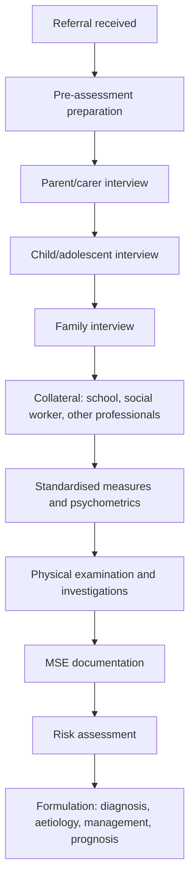

## 1. Definition and Overview

Assessment in child psychiatry is the systematic, developmentally informed process of gathering information about a child or adolescent's emotional, behavioural, cognitive, and social functioning in order to arrive at a diagnosis, formulation, and management plan. Unlike adult psychiatry — where you largely sit across from one patient and take a structured history — child psychiatry assessment is inherently **multi-informant, multi-method, and developmentally contextualized**.

The word "assessment" here is broader than just "history-taking." It encompasses:
- **Clinical interviews** (with the child, parents/carers, family together, and sometimes school staff)
- **Behavioural observation** (play, interaction patterns, developmental milestones)
- **Standardised rating scales and psychometric instruments**
- **Collateral information** (school reports, social worker notes, previous medical records)
- **Physical examination and investigations** (to exclude organic causes)
- **Formulation** — the synthesis of all gathered data into a biopsychosocial understanding

> The fundamental principle: **a child is not a small adult.** The presentation of psychiatric illness in children is shaped by developmental stage, and the child cannot be assessed in isolation from the family system and social context. [1] [2]

---

## 2. Epidemiology and Context

### Prevalence of Child Psychiatric Disorders
- Approximately **10–20%** of children and adolescents worldwide have a diagnosable mental health condition at any given time.
- In **Hong Kong**, community surveys have shown roughly **13–16%** prevalence of psychiatric morbidity in school-age children and adolescents.
- The most common categories are:
  - **Anxiety disorders** (commonest overall) [1]
  - **Behavioural disorders** (ADHD, ODD/CD)
  - **Neurodevelopmental disorders** (ASD, intellectual disability)
  - **Mood disorders** (depression increases sharply after puberty)
- Referral pathways in Hong Kong: typically via **MCHC (Maternal and Child Health Centre)**, paediatrician, school, or direct family referral to **CAMHS (Child and Adolescent Mental Health Service)** under Hospital Authority.

### Why a Dedicated Child Psychiatry Assessment Is Needed
1. **Developmental context**: A behaviour that is normal at age 3 (e.g., tantrums) is pathological at age 13. You must always compare symptoms to **same-age, same-culture norms**. [1]
2. **Limited self-report capacity**: Young children cannot articulate internal states; you rely on behavioural observation, parent report, and projective techniques.
3. **Multi-system involvement**: School, family, peer group — each is both a source of information and a potential aetiological/maintaining factor.
4. **Rapid developmental change**: The child you assess at age 5 is cognitively, emotionally, and socially very different from the same child at age 10. Assessment must be repeated longitudinally.

---

## 3. General Principles of Assessment in Child Psychiatry

### 3.1 Core Principles

***More flexible approach: difficult to follow a set routine when assessing children.*** [1] Unlike adult psychiatric interviews, which can follow a relatively standardised structure, child assessment demands improvisation. A 4-year-old will not sit still for a formal MSE; an oppositional 14-year-old may refuse to talk at all.

***Who to interview: with parents, with the whole family, and with the child alone (for older children).*** [1] The assessment is multi-layered:
- **Parents/carers first** (to get the "adult version" of the problem without the child feeling anxious or defensive)
- **Child alone** (to get the child's own perspective and look for things they won't say in front of parents, such as abuse, bullying, or self-harm)
- **Family together** (to observe interactional dynamics)
- **Other informants** (school, social worker, GP)

***Obtain collateral information: especially from school (educational, academic, behavioural).*** [1] [2] School reports are gold. They tell you about attention span in a structured setting, peer relationships, academic trajectory, and behavioural issues that parents may minimise or be unaware of.

### 3.2 The Overarching Framework

Think of child psychiatric assessment as answering **five key questions**:

1. **Is there a problem?** (compared to developmental norms)
2. **What is the problem?** (characterise symptoms, get a differential)
3. **Why has this child developed this problem now?** (predisposing, precipitating, perpetuating factors — the "3 Ps" in a biopsychosocial framework)
4. **What is the impact?** (on the child, family, school functioning)
5. **What can we do about it?** (management plan)

---

## 4. The Paediatric and Psychiatric History — Detailed Components

***The pathway to care is the first question: "Why this child and why now?"*** [1] This immediately orients you — was the referral from a worried teacher who noticed social withdrawal? A frustrated parent who can't cope with aggression? A paediatrician who found no organic cause for recurrent abdominal pain?

### 4.1 ***History of Presenting Illness (HPI)*** [1]

This parallels the adult psychiatric HPI but with crucial child-specific modifications:

| Component | Details | Why It Matters |
|---|---|---|
| ***Presenting complaint*** | Whose concern is it? (parent, teacher, child?) | Children are often brought involuntarily; the "identified patient" may not see themselves as having a problem |
| ***Ascertain whether it's truly a symptom*** | ***Compare to other children of the same age from the same culture*** [1] | Tantrums at age 2 = normal. Tantrums at age 12 = pathological. Cultural norms matter (e.g., eye contact expectations vary) |
| ***Details of CC*** | ***Onset, nature, severity, precipitating/ameliorating factors, impact, progression, and coping*** [1] | Standard characterisation, but ask who noticed first and what they tried before seeking help |
| ***Review of comorbid problems*** | Systematic screening — see below | Child psychiatric conditions are highly comorbid (e.g., 70% of youth depression has comorbid anxiety) [1] |

#### Systematic Comorbidity Screen [1]

This is crucial. Child psychiatry conditions rarely come alone. When a child presents with one problem, you **must screen** for the others:

- ***Physical symptoms***: **headache, stomachache, hearing, vision, seizures, faints** — both because somatic complaints may be the presenting feature of anxiety/depression in children, and because organic conditions (epilepsy, hearing loss) can mimic or cause psychiatric symptoms [1]
- ***ADHD symptoms***: **level of activity, attention span, concentration** — ADHD is the great comorbidity with almost everything [1]
- ***ASD symptoms***: **relationship with peers, close friends, hobbies/interests, behaviour** — ASD may present late, especially in girls who mask [1]
- ***ODD/CD symptoms***: **disobedient behaviour, response to frustration, temper tantrums, antisocial behaviour, aggression, stealing, truancy, delinquency** [1]
- ***Mood disorder symptoms***: **mood, energy level, anxiety** [1]
- ***Other behavioural disorders***: **eating, sleeping, elimination problems (enuresis, encopresis), sexual interest and behaviour** [1]

<Callout title="Clinical Pearl" type="idea">
The comorbidity screen is your safety net. A child referred for "school refusal" may actually have separation anxiety disorder, social phobia, depression, bullying, or even early-onset psychosis. Always cast a wide net before narrowing.
</Callout>

### 4.2 ***Developmental History*** [2]

This is the single biggest difference from adult psychiatry. You need a **full neurodevelopmental timeline**:

#### 4.2.1 ***Pregnancy and Birth History*** [2]

| Domain | What to Ask | Relevance |
|---|---|---|
| ***Pregnancy*** | Was the pregnancy planned/wanted? Any complications (gestational DM, pre-eclampsia, infections — TORCH)? ***Maternal alcohol and substance abuse during pregnancy*** [1] | Prenatal insults → neurodevelopmental disorders. Foetal alcohol spectrum disorder (FASD) is a specific cause of intellectual disability and ADHD-like symptoms |
| ***Delivery*** | Mode (NSD vs CS), gestational age, ***low birth weight and prematurity*** [1], APGAR scores, any birth asphyxia or NICU admission? | Prematurity and birth complications are risk factors for ADHD, ASD, intellectual disability, and cerebral palsy |
| ***Neonatal period*** | Feeding difficulties, jaundice, infections, neonatal seizures? | Neonatal complications can signal early neurological compromise |

#### 4.2.2 ***Developmental Milestones*** [2]

***Child growth and development*** is a cornerstone of the assessment. [2] You must know the normal milestones to detect deviations:

| Domain | Key Milestones | Red Flags |
|---|---|---|
| ***Gross motor*** | Head control (3–4 mo), sitting (6 mo), crawling (9 mo), walking (12–15 mo), running (18–24 mo) | Persistent hypotonia, not walking by 18 months |
| ***Fine motor*** | Palmar grasp (4–5 mo), pincer grasp (9–10 mo), scribbles (15 mo), draws circle (3 yr) | Persistent fisting, inability to hold objects |
| ***Speech/Language*** | Babbling (6 mo), first words (12 mo), two-word phrases (2 yr), sentences (3 yr) | No babbling by 12 mo, no words by 18 mo, no phrases by 24 mo — screen for ASD and hearing loss |
| ***Social/Emotional*** | Social smile (6 wk), stranger anxiety (8 mo), parallel play (2 yr), cooperative play (3–4 yr), theory of mind (4–5 yr) | No social smile by 3 mo, no joint attention by 12 mo, no pretend play by 18 mo — red flags for ASD |
| ***Cognitive/Adaptive*** | Object permanence (8–9 mo), symbolic play (18 mo), toilet training (2–3 yr) | Regression of any previously acquired skill at any age is a major red flag |

<Callout title="Developmental Regression" type="error">
***Any loss of previously acquired skills*** must be taken extremely seriously. In a toddler, think Rett syndrome, childhood disintegrative disorder, metabolic conditions (e.g., mucopolysaccharidoses), or epileptic encephalopathy. In an older child, think early-onset psychosis, neurodegenerative disease, or severe depression.
</Callout>

#### 4.2.3 ***Temperament*** [2]

Thomas and Chess described three temperament types:
- **Easy** (40%): regular, adaptable, positive mood
- **Difficult** (10%): irregular, slow to adapt, intense reactions, negative mood — at higher risk for behavioural disorders
- **Slow-to-warm-up** (15%): initially withdrawing but gradually adapting — may present as "shy" or anxious

Temperament is **not the same as psychopathology**, but it modifies risk. A difficult temperament + poor parenting = synergistic risk for ODD/CD. [1]

### 4.3 ***Family History***

| Component | What to Ask | Why |
|---|---|---|
| ***Psychiatric family history*** | Depression, bipolar, schizophrenia, anxiety, ADHD, ASD, substance abuse, suicide in 1st/2nd degree relatives | Nearly all child psychiatric conditions have heritable components (e.g., ADHD heritability ~75%, ASD ~80%) |
| ***Family structure*** | Who lives at home? Parents married/separated/divorced? Siblings and their ages and health | Parental separation is a risk factor for emotional disorders; sibling dynamics matter (e.g., sibling rivalry disorder) |
| ***Parenting style*** [1] | ***Baumrind's parenting styles: authoritarian, permissive, authoritative, neglecting*** | Authoritative (warm + firm boundaries) is protective; authoritarian or neglecting styles are risk factors for behavioural problems |
| ***Marital/parental relationship*** | Conflict, domestic violence, parental mental health | Interparental conflict is one of the strongest risk factors for child psychopathology, independent of divorce per se |
| ***Socioeconomic status*** | Housing, income, employment, social support | Poverty and social deprivation are consistently linked to higher rates of child psychiatric problems |

### 4.4 ***Personal History***

| Domain | Details |
|---|---|
| ***Educational history*** | Current school, academic performance, any special educational needs (SEN) support, grade retention, school changes |
| ***Peer relationships*** | Number and quality of friendships, bullying (victim or perpetrator), social media use |
| ***Interests and activities*** | Hobbies, screen time, sports — tells you about the child's strengths and motivation |
| ***Adverse childhood experiences (ACEs)*** | Abuse (physical, sexual, emotional), neglect, domestic violence exposure, parental incarceration, parental substance use — these are dose-dependently related to psychiatric and medical morbidity |
| ***Trauma history*** | Specific traumatic events, PTSD symptoms |
| ***Substance use*** (adolescents) | Alcohol, cannabis, other drugs — increasingly relevant from age 12+ in Hong Kong |

### 4.5 ***Medical History***

- **Chronic illnesses**: epilepsy (associated with psychiatric comorbidity in ~30%), asthma (anxiety), diabetes (depression)
- **Medications**: especially those with psychiatric side effects (e.g., corticosteroids → mood changes, beta-agonists → anxiety, anti-epileptics → behavioural changes)
- **Allergies**
- **Past hospitalisations and surgeries** (traumatic for young children)
- **Hearing and vision testing** — undiagnosed hearing loss is a common mimicker of inattention and language delay

### 4.6 ***Past Psychiatric History***

- Previous psychiatric diagnoses and treatments
- Previous contact with CAMHS, educational psychologist, clinical psychologist
- Previous psychometric testing (IQ testing, adaptive functioning assessment)

---

## 5. Conducting the Interview — Techniques and Practical Approach

### 5.1 ***Interviewing the Parents*** [1]

***Similar to history taking in adult psychiatry*** but with the following additions [1]:

- ***Obtain a complete description of main concerns/chief complaint*** [1]
- ***Obtain a complete history systematically (especially family, psychiatric, neurodevelopmental, educational, medical)*** [1]
- ***Should also indirectly evaluate the parents in terms of personality, marital relationship, and style of parenting*** [1] — this is subtle but critical. Watch how they talk about the child. Do they use warm language or hostile/critical expressed emotion? Do they agree with each other or contradict?

<Callout title="Expressed Emotion" type="idea">
**High expressed emotion (EE)** in families — characterised by criticism, hostility, and emotional over-involvement — is a well-established predictor of relapse in many psychiatric conditions (originally studied in schizophrenia, but also relevant in childhood mood and behavioural disorders). During the parent interview, you are implicitly assessing EE.
</Callout>

### 5.2 ***Interviewing the Child Alone*** [1]

This is an art. The general rules:

1. ***Developmentally appropriate terms: simplify your terminology and avoid complex questions*** [1] — Instead of "Do you experience low mood?", try "Do you feel sad a lot?"
2. ***Physical contact: be judicious, don't touch anybody for male doctors, especially cautious in patients with prior sexual abuse and physical abuse (damage rapport)*** [1] — Children who have been abused may interpret physical touch as threatening or, conversely, may show **premature sexualising behaviour** and develop inappropriate attachments if the doctor is too physically familiar. [1]
3. ***Standardised behaviour rating scales: more objective, but diagnosis should still be based on structured interview and collateral information only (rating is for reference only)*** [1]

#### Techniques by Age [1]:

| Age Group | Technique | Rationale |
|---|---|---|
| ***Younger children*** (< 7–8 years) | ***Observe kid in play*** or ask to ***express feelings in painting/drawing*** [1] | Young children communicate primarily through play, not verbal narrative. Watch themes in their drawings (violence, isolation, family composition) |
| ***Older children*** (8–12 years) | ***Start by discussion on neutral topics*** (e.g., pets, favourite games) → ***then family, school, peer relationships*** → ***presenting problem*** [1] | Gradual warm-up builds trust. Moving from safe to sensitive topics mirrors motivational interviewing principles |
| ***Adolescents*** | Treat more like adults but maintain developmental sensitivity. ***Identify any sensitive issues beforehand*** (e.g., child abuse, sexual issues) [1]. ***Confidentiality is important but risky behaviour (e.g., self-harm, harming others) should be reported*** [1] | Adolescents value autonomy and privacy; they will shut down if they feel you will tell their parents everything. Be upfront about limits of confidentiality |

#### ***Revealing Questions*** [1]:

- ***Ask for the child's aspirations for the future*** — A child who says "I don't have a future" is flagging depression/suicidality
- ***Projective questioning on 3 wishes, or 3 goals they want to achieve from MHS*** — This tells you what matters to the child, not what matters to the parents
- ***Note that children are more suggestible than adults and may try hard to give the 'desirable answer' to questions → particularly important to not use leading questions*** [1]

<Callout title="Leading Questions" type="error">
Never ask "Did your father hit you?" unless there is a specific reason. Instead, ask open questions: "What happens when your dad gets angry?" Children are highly suggestible and may provide false affirmatives to please the interviewer. This is especially critical in forensic contexts (child protection cases).
</Callout>

### 5.3 ***Interviewing the Adolescent*** [1]

- ***Discuss with the family the interview arrangements beforehand*** — who gets interviewed first matters. Some clinicians prefer to see the adolescent first to signal that their voice matters; others see parents first to get background before seeing the adolescent. **There is no fixed rule, but discuss and agree.** [1]
- ***Confidentiality***: Be explicit. "What you tell me stays between us, unless I'm worried about your safety or someone else's safety." [1]
- Screen for: substance use, self-harm, sexual activity, eating behaviour, online safety, cyberbullying

### 5.4 ***Interviewing the Family Together*** [1]

***Essential to allow assessment of family interactions and dynamics.*** [1]

***Should see the family at the first assessment or soon after it, before the interviewer has formed a close relationship with the young patient or one of the parents.*** [1] — Why? Because once you've allied with one family member, observing neutral family dynamics becomes impossible.

***Observe for:*** [1]

- ***Family hierarchy***: most dominant person? Usual spokesperson?
- ***Other family dynamics***: Any alliances? How do they communicate with each other? How do they deal with conflict?
- ***Others***: Who seems most worried about the problem? Any monopolising of the interview? (Ask other members to comment on his/her views)

<Callout title="Structural Family Assessment">
In family systems theory (Minuchin), you look for:
- **Enmeshment** (boundaries too diffuse — everyone is in everyone else's business) vs **Disengagement** (boundaries too rigid — family members are emotionally disconnected)
- **Triangulation** (child is drawn into parental conflict as a mediator or scapegoat)
- **Parentification** (child takes on a parental role, e.g., caring for siblings or even parents)
These patterns are both diagnostic clues and treatment targets.
</Callout>

---

## 6. ***Mental State Examination (MSE) in Children*** 

The adult MSE framework (Appearance → Behaviour → Speech → Mood → Thought → Perception → Cognition → Insight) still applies, but with developmental modifications:

| MSE Domain | Child-Specific Considerations |
|---|---|
| **Appearance** | Hygiene, nutritional status (neglect?), clothing appropriate to weather/context, dysmorphic features (syndromic causes of ID/ASD, e.g., Down syndrome facies, FAS facies), injuries (bruises in unusual locations → consider non-accidental injury) |
| **Behaviour** | Activity level (hyperactive?), distractibility, impulsivity, eye contact (poor in ASD, anxiety; may also be culturally mediated), separation behaviour (clings to parent? Indifferent?), quality of play (repetitive? Symbolic?), tics, stereotypies, self-stimulatory behaviour |
| **Rapport** | Ease of engagement, warmth, reciprocity — children with ASD may show limited social reciprocity; anxious children may be withdrawn; oppositional children may be hostile |
| **Speech & Language** | Rate, volume, articulation, language level (appropriate for age?), echolalia (ASD), selective mutism (speaks at home but not at school) |
| **Mood & Affect** | Self-reported mood (in age-appropriate language), observed affect (congruent? Flat? Labile?), anxiety level, irritability. Note: children may show irritability more than sadness in depression |
| **Thought Content** | Worries, fears, obsessions, preoccupations, suicidal ideation (ask directly in older children/adolescents), self-harm thoughts |
| **Thought Form** | Less commonly formally assessed in younger children; relevant in adolescents with possible psychosis (loosening of associations, tangentiality) |
| **Perceptions** | Hallucinations (note: imaginary friends in young children are developmentally normal, not psychotic). True auditory hallucinations in a child are significant and warrant investigation for early-onset psychosis or PTSD-related dissociation |
| **Cognition** | Orientation (rarely impaired unless organic cause), attention/concentration (directly observed during interview), memory, estimated intellectual functioning |
| **Insight** | Age-dependent. A 5-year-old cannot have "insight" in the adult sense. In adolescents, assess understanding of their difficulties and motivation for help |

<Callout title="Imaginary Friends vs Hallucinations" type="error">
Up to **65% of children** aged 3–7 have imaginary friends. These are **controlled by the child** (the child knows the friend isn't real and can start/stop the interaction at will), serve a **developmental function** (practicing social skills, processing emotions), and are not distressing. **Psychotic hallucinations**, by contrast, are **involuntary**, **perceived as external and real**, and typically **distressing** or commanding. Always clarify the phenomenology carefully.
</Callout>

---

## 7. ***Psychological Measures and Standardised Instruments*** [1]

***Psychological measures, e.g., intelligence tests, social and other developmental assessment tools*** are a key adjunct. [1]

| Category | Examples | When to Use |
|---|---|---|
| **Intelligence/Cognitive** | Wechsler Intelligence Scale for Children (WISC-V), Stanford-Binet | Suspected intellectual disability, uneven cognitive profile (e.g., in specific learning disorders) |
| **Developmental** | Bayley Scales of Infant Development, Griffiths Scales | Infants/toddlers with suspected developmental delay |
| **ASD-specific** | Autism Diagnostic Observation Schedule (ADOS-2), Autism Diagnostic Interview-Revised (ADI-R), M-CHAT (screening) | Suspected ASD |
| **ADHD-specific** | Conners Rating Scales, Vanderbilt ADHD Diagnostic Rating Scale | Suspected ADHD — obtains separate parent and teacher ratings |
| **Behavioural/Emotional** | Child Behavior Checklist (CBCL), Strengths and Difficulties Questionnaire (SDQ) | Broad screening for emotional/behavioural problems |
| **Mood** | Children's Depression Inventory (CDI), Screen for Child Anxiety Related Disorders (SCARED), PHQ-A | Suspected mood/anxiety disorders |
| **Adaptive functioning** | Vineland Adaptive Behavior Scales | Required for diagnosis of intellectual disability (must have impaired adaptive functioning AND low IQ) |
| **Family/Environmental** | Family Assessment Device, Parenting Stress Index | Assessment of family functioning and parenting stress |

<Callout title="Rating Scales Are Not Diagnoses" type="error">
***Diagnosis should still be based on structured interview and collateral information only (rating is for reference only).*** [1] A high score on the SDQ or Conners tells you there's a concern — it does not make a diagnosis. Many conditions share symptom profiles on rating scales (e.g., anxiety and ADHD both score high on inattention items).
</Callout>

---

## 8. ***Collateral Information*** [1] [2]

***Collateral from school: academic performance, behaviour in classroom, relationship with other classmates.*** [1]

Why school is so important:
- **Cross-situational consistency**: ADHD, by definition, must be present in ≥ 2 settings. A child who is "hyperactive" only at home but fine at school may have a behavioural/parenting issue rather than ADHD.
- **Academic trajectory**: A sudden drop in grades may signal depression, substance use, or psychosis. A longstanding pattern of underperformance may suggest specific learning disorder or intellectual disability.
- **Peer relationships**: Social difficulties reported by teachers may be the first clue to ASD (especially in girls who mask in clinical settings).
- **Behavioural observations**: Teachers see the child in a structured environment for 6–8 hours a day — far more observation time than any clinician gets.

Other collateral sources:
- **Social worker reports** (family circumstances, child protection concerns)
- **Previous medical records** (past assessments, investigations, diagnoses)
- **Other professionals** (speech therapist, occupational therapist, educational psychologist)

---

## 9. ***Physical Examination and Investigations***

### Why Physical Examination Matters in Child Psychiatry

Many psychiatric presentations in children have organic underpinnings or mimics:

| Organic Condition | Psychiatric Mimic |
|---|---|
| **Hearing impairment** | Inattention (mimics ADHD), social withdrawal (mimics ASD), language delay |
| **Epilepsy** (especially absence seizures) | "Daydreaming" and inattention (mimics ADHD) |
| **Thyroid dysfunction** | Hypothyroidism → depression, fatigue; Hyperthyroidism → anxiety, restlessness |
| **Iron deficiency anaemia** | Fatigue, poor concentration, restless legs (mimics ADHD) |
| **Lead poisoning** | Behavioural problems, developmental regression |
| **Genetic syndromes** | Fragile X (ASD features, intellectual disability), 22q11 deletion (psychosis risk), Williams syndrome (hypersociability), Prader-Willi (overeating) |
| **Obstructive sleep apnoea** | Daytime hyperactivity, inattention, poor academic performance (mimics ADHD) |
| **Brain tumour** | Personality change, headache, new-onset seizures |

### Physical Examination Checklist

- **Growth parameters**: Height, weight, head circumference (plot on growth charts — ***child growth and development*** [2])
  - Microcephaly → consider genetic/metabolic causes
  - Short stature → consider Turner syndrome, growth hormone deficiency, neglect
  - Obesity → consider Prader-Willi, hypothyroidism, medication effects
- **Dysmorphology screen**: Minor physical anomalies (facial features, hand creases, ear shape) — may suggest genetic syndrome
- **Neurological examination**: Tone, reflexes, coordination (cerebellar signs), cranial nerves, gait
  - ***Signs suggestive of neurodevelopmental impairment/delay, e.g., clumsiness, language delay, abnormalities of speech*** [1]
  - Neurological "soft signs" (mild motor coordination difficulties, mirror movements) are more common in ADHD and ASD
- **Skin**: Café-au-lait spots (neurofibromatosis), ash-leaf macules (tuberous sclerosis — associated with ASD and epilepsy), bruising in unusual locations (non-accidental injury)
- **Hearing and vision**: Basic screening; formal audiometry and ophthalmology referral if indicated

### Baseline Investigations (As Indicated)

| Investigation | Indication |
|---|---|
| **TFTs** | Mood changes, weight changes, lethargy, hyperactivity |
| **CBP, ferritin** | Fatigue, pica, restless legs |
| **Lead level** | Developmental regression, pica, high-risk environment |
| **Chromosomal microarray / karyotype** | Intellectual disability, multiple congenital anomalies, ASD with dysmorphic features |
| **Fragile X testing** | Males with intellectual disability ± ASD features |
| **Metabolic screen** | Developmental regression, unexplained neurological deterioration |
| **EEG** | Suspected seizures, staring spells, developmental regression |
| **MRI Brain** | Focal neurological signs, developmental regression, microcephaly/macrocephaly |

---

## 10. ***The Paediatric History Taking Framework*** [2]

***Paediatric history taking*** follows a structured approach that parallels but extends adult history taking [2]:

***Key components specific to paediatric history:*** [2]

- ***Birth history*** (antenatal, perinatal, postnatal)
- ***Feeding history*** (breast/bottle, weaning, current diet)
- ***Developmental history*** (milestones in all four domains)
- ***Immunisation history***
- ***Growth history*** (weight, height, head circumference — plotted on centile charts)
- ***Schooling and education***
- ***Family and social history*** (including genogram)

> ***In paediatric history taking, always approach the child in a developmentally appropriate manner and build rapport before diving into sensitive topics.*** [2]

---

## 11. ***Ethical and Legal Considerations*** [3]

### 11.1 ***Consent in Child Psychiatry***

***Consent and refusal of treatment*** in child psychiatry raises unique ethical challenges [3]:

- **Age of consent**: In Hong Kong, patients aged **≥ 18** can give independent consent. For those **< 18**, **parental/guardian consent** is generally required.
- ***Gillick competence / "mature minor" doctrine***: A child under 16 who demonstrates sufficient understanding and intelligence to fully appreciate the nature, purpose, and consequences of a proposed treatment may be considered competent to consent. This is assessed on a case-by-case basis. [3]
- ***Assent***: Even when parental consent is obtained, the child's **assent** (agreement/cooperation) should be sought in a developmentally appropriate way. This respects the child's emerging autonomy.

### 11.2 ***Involuntary Treatment and the Mental Health Ordinance (Cap. 136)***

***Why should I be locked up? Ethics in psychiatry.*** [3]

- In Hong Kong, the **Mental Health Ordinance (Cap. 136)** governs involuntary detention and treatment.
- ***For minors***: Parental consent can authorise voluntary admission. If the child/adolescent or parents refuse treatment but the clinical team believes the patient poses a significant risk to themselves or others, involuntary procedures may be initiated.
- ***Ethical principles*** [3]:
  - **Autonomy**: Respect the developing autonomy of the child while balancing protective obligations
  - **Beneficence**: Acting in the child's best interest
  - **Non-maleficence**: Avoiding harm (including harm from unnecessary detention or forced treatment)
  - **Justice**: Fair allocation of resources and equitable treatment

<Callout title="Confidentiality with Adolescents" type="error">
***Confidentiality is important, but risky behaviour (e.g., self-harm, harming others) should be reported.*** [1] Be transparent about this from the start: "What you say stays between us unless I'm worried you or someone else could get hurt." This is both ethical and practical — it maintains trust while keeping the adolescent safe.
</Callout>

### 11.3 ***Child Protection and Safeguarding***

- In Hong Kong, suspected child abuse must be reported to the **Social Welfare Department** and handled through the **Multi-disciplinary Case Conference on Protection of Child with Suspected Abuse (MDCC)** framework.
- Types of abuse: physical, sexual, emotional, neglect
- During assessment, be alert for:
  - Unexplained injuries, especially in unusual locations
  - Inconsistent history between child and parent
  - **Premature sexualising behaviour** (in sexual abuse) [1]
  - Fearfulness around specific carers
  - Excessive compliance or frozen watchfulness

---

## 12. ***Formulation in Child Psychiatry***

The formulation is the intellectual synthesis — the "so what?" of all the data you've gathered. It follows the same structure as adult psychiatry but with developmental emphasis:

### 12.1 Structure of a Child Psychiatric Formulation [1]

| Component | Content |
|---|---|
| **Summary** | Brief demographic and clinical description (age, gender, presenting complaint, duration) |
| **Provisional diagnosis** | Most likely diagnosis based on clinical features and diagnostic criteria |
| **Differential diagnosis** | Other conditions to consider |
| **Aetiology** | **Predisposing** (genetics, temperament, early adversity, developmental vulnerabilities), **Precipitating** (life events, school transition, family change, trauma), **Perpetuating** (ongoing family dysfunction, untreated comorbidity, lack of support), **Protective** (strengths, good peer relationships, caring family) — using a **biopsychosocial** framework |
| **Management plan** | Short-term and long-term, biological/psychological/social interventions, school liaison, family work, risk management |
| **Prognosis** | Based on nature of disorder, severity, protective/risk factors |

### 12.2 The 4 P's Framework (Expanded)

| Factor | Biological | Psychological | Social |
|---|---|---|---|
| **Predisposing** | Genetic loading, prenatal insults, neurodevelopmental delay | Difficult temperament, insecure attachment, low self-esteem | Poverty, parental mental illness, family dysfunction |
| **Precipitating** | Acute illness, medication change, head injury | Bullying, exam pressure, identity crisis | School transition, parental separation, bereavement |
| **Perpetuating** | Untreated medical condition, ongoing substance use | Cognitive distortions, avoidant coping, secondary gain | Ongoing family conflict, inadequate school support, peer rejection |
| **Protective** | Normal intelligence, good physical health | Resilient personality, good coping skills, secure attachment | Supportive family, good school, positive peer group |

---

## 13. ***Special Considerations for Assessment in the Hong Kong Context***

### 13.1 Cultural Factors

- **Academic pressure**: Hong Kong's highly competitive education system is a significant stressor. Children may present with anxiety, somatic complaints, or school refusal related to exam stress.
- **Stigma**: Mental health stigma remains significant in Chinese culture. Families may present late, minimise symptoms, or prefer somatic framings ("headache" rather than "depression").
- **Language**: Assessment may need to be conducted in Cantonese, Mandarin, or English depending on the family background. Interpreter use introduces additional complexity.
- **Domestic helpers**: Many HK children are primarily cared for by domestic helpers. The attachment dynamics and caregiving consistency must be explored.
- **Small living spaces**: Hong Kong's tiny apartments mean families live in extremely close proximity, which can exacerbate family conflict and reduce the child's private space.

### 13.2 Service Pathways in Hong Kong

- **MCHC (Maternal and Child Health Centre)** → developmental screening
- **Child Assessment Centre (CAC)** under Department of Health → comprehensive developmental assessment for children < 12
- **CAMHS (Child and Adolescent Mental Health Service)** under Hospital Authority → psychiatric assessment and treatment
- **School-based services**: Educational psychologists, school social workers
- **NGOs**: e.g., Caritas, Boys' and Girls' Clubs Association, HKFYG — provide counselling and support

---

## 14. ***Assessment of Specific Domains During Interview*** [1]

### 14.1 ***ODD/CD Assessment Approach*** [1]

***During the interview, get an impression of how difficult the child is and how good the parenting is:*** [1]

- ***Overall compliance to parents' commands:*** [1]
  - ***Percentage compliance: usually 70–80% (50% is bad, 90% is good)*** [1]
  - ***Non-compliance: usually on what aspect? How do you handle it?*** [1]
  - ***Find out how the parent gives commands → can be trained to give better commands*** [1]
- ***Temper:*** [1]
  - ***Worst temper/outburst? How severe or frequent is it? How do parents cope?*** [1]
  - ***Current situation*** [1]
- ***Symptom screening: ODD symptoms first → screen CD symptoms if ODD symptoms present*** [1] — This reflects the developmental progression: ODD often precedes CD, and early identification of ODD is an opportunity for intervention before it escalates.

### 14.2 Anxiety Assessment in Children [1]

The content of childhood anxiety is **influenced by developmental stage** [1]:
- ***Infants***: fear of strangers → social anxiety disorder of childhood
- ***Preschool***: fear of separation, specific objects → separation anxiety and phobic anxiety disorders
- ***Early adolescence***: fear of social situations/personal adequacy → social phobia
- ***Late adolescence***: resembles adult → GAD, panic disorders

**Key point**: ***Anxiety and fears can be developmentally appropriate. Diagnose only when developmentally inappropriate (more severe and prolonged than usual) AND causes significant distress + functional impairment.*** [1]

### 14.3 Depression Assessment in Children [1]

Childhood depression may present differently from adults:
- ***Somatic complaints*** (unexplained abdominal pain, headache, anorexia, enuresis) [1]
- ***Irritable mood*** and anxiety features (rather than classic sadness) [1]
- ***Behavioural problems*** [1]
- Always screen for **suicidality** — even in young children (suicidal ideation can occur from age 6+)
- ***Note: ~25% of bipolar affective disorder first presented as juvenile depression in their first episode*** [1] — this is why longitudinal follow-up is essential

---

## 15. ***Risk Assessment in Child Psychiatry***

Risk assessment in children follows similar principles to adults but with specific considerations:

| Risk Domain | Child-Specific Considerations |
|---|---|
| **Risk to self** | Self-harm (increasingly common from age 10+), suicidal ideation, suicide attempts. Methods may include cutting, overdose, jumping. Screen for online pro-self-harm content |
| **Risk to others** | Aggression, violence, fire-setting, sexual harmful behaviour (in conduct disorder or after sexual abuse). Animal cruelty is a red flag for severe CD |
| **Risk from others** | Abuse, neglect, exploitation, bullying, online grooming — the child may be a victim as well as (or instead of) a perpetrator |
| **Vulnerability** | Self-neglect, wandering (in ASD/ID), exploitation by peers (in ID) |

---

## 16. Summary of Assessment Structure

---

<Callout title="High Yield Summary">

**Assessment in Child Psychiatry — Key Principles:**

1. **Multi-informant**: Always interview parents, child (alone), and family together. Obtain school collateral.
2. **Developmentally contextualised**: Compare symptoms to same-age, same-culture norms. Use age-appropriate interview techniques.
3. **Developmental history is essential**: Full pregnancy/birth history, milestones (gross motor, fine motor, language, social), temperament.
4. **Systematic comorbidity screen**: ADHD, ASD, ODD/CD, mood, anxiety, eating, sleeping, elimination — child psychiatric conditions rarely come alone.
5. **MSE is modified for children**: Observe play, activity level, eye contact, separation behaviour; imaginary friends ≠ hallucinations.
6. **Rating scales supplement but do not replace** clinical interview.
7. **Physical examination and investigations** are essential to exclude organic mimics (hearing loss, epilepsy, thyroid, genetic syndromes).
8. **Risk assessment** includes risk to self, to others, FROM others (abuse/neglect), and vulnerability.
9. **Formulation** uses the 4 P's (predisposing, precipitating, perpetuating, protective) in a biopsychosocial framework.
10. **Ethical considerations**: Consent requires parental involvement for < 18; Gillick competence for mature minors; confidentiality limits must be stated upfront; safeguarding is paramount.
11. **Hong Kong context**: Academic pressure, stigma, MCHC → CAC → CAMHS referral pathways, domestic helper caregiving dynamics.

</Callout>

---

<ActiveRecallQuiz
  title="Active Recall - Assessment in Child Psychiatry"
  items={[
    {
      question: "Name the four groups of informants you should interview when assessing a child in psychiatry, and explain why each is important.",
      markscheme: "Parents/carers (main history, parenting style, developmental info), child alone (their own perspective, sensitive disclosures), family together (observe dynamics, hierarchy, alliances, communication), school/collateral (cross-situational behaviour, academic performance, peer relationships). Multi-informant approach captures different perspectives and contexts.",
    },
    {
      question: "A 5-year-old is referred for 'not listening and being disruptive'. List four organic conditions that could mimic psychiatric symptoms and the investigation you would use to screen for each.",
      markscheme: "Hearing impairment (audiometry), absence epilepsy (EEG), iron deficiency (ferritin/CBP), obstructive sleep apnoea (sleep history, polysomnography), thyroid dysfunction (TFTs), lead poisoning (blood lead level). Any four with matched investigation.",
    },
    {
      question: "Describe three specific interview techniques for younger children (under 7-8 years) in a psychiatric assessment and explain the rationale for each.",
      markscheme: "Observe in play (young children communicate through play not verbal narrative), ask to draw or paint feelings (projective expression of emotions), start with neutral topics before sensitive ones (builds rapport and trust). Avoid leading questions as children are highly suggestible.",
    },
    {
      question: "What is the key difference between a developmentally normal imaginary friend and a psychotic hallucination in a child?",
      markscheme: "Imaginary friend: controlled by child, child knows it is not real, can start/stop interaction, not distressing, serves developmental function. Psychotic hallucination: involuntary, perceived as external and real, often distressing or commanding, not under child's control.",
    },
    {
      question: "In an ODD/CD assessment, what specific aspects of parenting and child behaviour should you evaluate during the interview?",
      markscheme: "Overall compliance rate to parental commands (normal 70-80%), nature of non-compliance, how parent gives commands, worst temper outburst and frequency/severity, how parents cope, Baumrind parenting style (authoritarian/permissive/authoritative/neglecting). Screen ODD symptoms first, then CD if ODD present.",
    },
    {
      question: "State the limits of confidentiality you would explain to an adolescent at the start of a psychiatric interview and the ethical principles underlying this approach.",
      markscheme: "Confidentiality will be maintained except when risky behaviour identified (self-harm, harming others, being harmed/abused). Principles: respect for developing autonomy (adolescent voice matters), beneficence (acting in best interest), duty of care/safeguarding overrides confidentiality when safety at risk. Be transparent from the start to maintain trust.",
    },
  ]}
/>

---

## References

[1] Senior notes: ryanho-psych.md (Chapter 12: Child Psychiatry, sections 12.1, 12.5)
[2] Lecture slides: CFB (PAE01) Paediatric history taking.pdf; CFB (PAE02) Child growth and development.pdf
[3] Lecture slides: GC 173. Why should I be locked up Ethics in psychiatry, Consent and Refusal in Treatment.pdf
