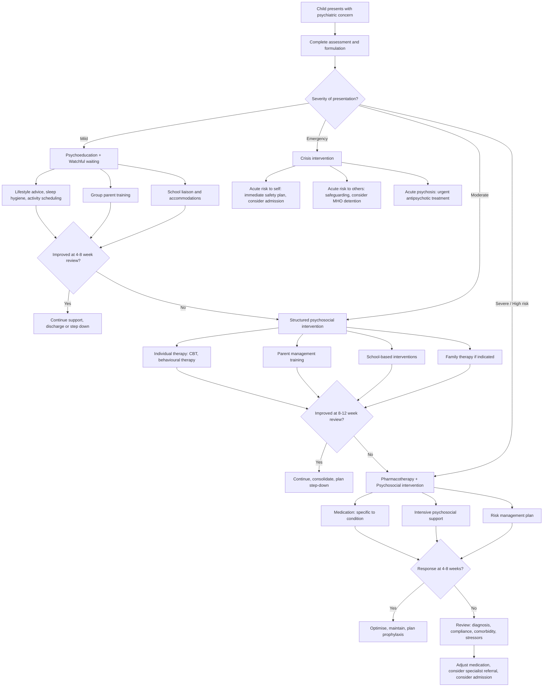

## Management Algorithm and Treatment Modalities

### Overarching Principles of Management in Child Psychiatry

Management of psychiatric conditions in children is fundamentally different from adult psychiatry in several ways:

1. **The child cannot be treated in isolation from their system.** The family, school, and peer group are both part of the problem and part of the solution. Every management plan must involve parents/carers and school.
2. **Development is ongoing.** Treatment must account for the child's developmental stage and the fact that the brain is still maturing — this affects both drug pharmacology (children metabolise differently) and psychological intervention choice.
3. **Psychosocial interventions are generally first-line.** Unlike adult psychiatry where pharmacotherapy is often the cornerstone, in child psychiatry ***behavioural therapy is the mainstay*** for many conditions, especially in younger children [1]. Medications are added when psychosocial approaches are insufficient.
4. ***Beware of polypharmacy and difference in sensitivity to medications*** in children [1]. The developing brain responds differently to psychotropics. Side-effect profiles can be more pronounced (e.g., metabolic effects of antipsychotics, growth suppression with stimulants).
5. **Multimodal approach**: The best outcomes come from ***individualised comprehensive multimodal treatment programmes*** combining biological, psychological, and social interventions [1].

---

### General Management Algorithm

---

### Condition-Specific Management

---

#### 1. ADHD Management

##### A. Overall Approach [1]

***Approach to management: individualised comprehensive multimodal treatment programme*** [1]:
- ***Pre-school: usually behaviour therapy as mainstay*** [1] — Why? Because preschool children metabolise stimulants poorly, have higher risk of side effects, and respond well to environmental modification. The developing prefrontal cortex at this age is more amenable to behavioural shaping.
- ***School age: usually a combination of medications + psychosocial therapy*** [1]
- ***Management of comorbidities, e.g., ASD, ODD/CD, mood disorder, anxiety disorders*** [1]

***Stepped approach*** [1]:
- ***Mild: advice, support, watchful waiting, offer group parent training*** [1]
- ***Moderate: refer to specialists at school age for behavioural therapy or medications*** [1]
- ***Severe: refer to specialists for medications as 1st choice*** [1]

##### B. Pharmacological Treatment

***Medications: very effective (most effective among all psychotropics) → more effective than psychosocial treatment*** [1]

This is a key point to internalise. ADHD medications have **effect sizes of ~0.7–1.0** — among the highest in all of psychiatry. The Multimodal Treatment of ADHD (MTA) study showed that medication alone was superior to behavioural therapy alone for core ADHD symptoms, though combined treatment was best for comorbid problems and functional outcomes.

| Medication | Class | Mechanism of Action | Formulations | Effect Size | Key Side Effects | Contraindications/Cautions |
|---|---|---|---|---|---|---|
| ***Methylphenidate*** | Stimulant | Blocks dopamine and noradrenaline reuptake transporters (DAT, NET) in prefrontal cortex and striatum → ↑synaptic dopamine and NA in fronto-striatal circuits → improves executive function, sustained attention, and impulse control | Short-acting (Ritalin): 4h duration; Long-acting (Concerta, Ritalin LA): 8–12h duration | ***1.0*** [1] | ***Decreased appetite***, insomnia, ***epigastric discomfort, nausea/vomiting, sedation, dizziness, mood swing*** [1]. ***Uncommon: motor tics, tachycardia, deranged liver function*** [1]. Growth suppression with chronic use | Psychosis, severe anxiety, glaucoma, phaeochromocytoma, concurrent MAOI use. Caution in tic disorders (though evidence suggests stimulants are safe and do not worsen tics in most cases), seizure disorders, cardiovascular disease |
| **Lisdexamfetamine (Vyvanse)** | Stimulant (prodrug) | Prodrug of dexamphetamine — lisdexamfetamine is pharmacologically inactive until cleaved by red blood cell enzymes to release active d-amphetamine. This prodrug mechanism provides smoother pharmacokinetics and lower abuse potential | Long-acting only: 12–14h duration | ***1.0*** [1] | Similar to methylphenidate. More potent appetite suppression | Same as methylphenidate. Lower abuse potential due to prodrug design |
| **Dexamphetamine** | Stimulant | Directly releases dopamine and NA from presynaptic terminals AND blocks reuptake → more potent monoamine elevation than methylphenidate | Short-acting | ***1.0*** [1] | Similar but ***milder*** side effect profile [1] | Same as methylphenidate. Higher abuse potential than lisdexamfetamine |
| ***Atomoxetine (Strattera)*** | Non-stimulant | Selective noradrenaline reuptake inhibitor (NRI). Blocks NET in prefrontal cortex → ↑NA and (indirectly) ↑dopamine in PFC (because PFC lacks DAT, so dopamine clearance depends on NET). Does not significantly affect dopamine in striatum/nucleus accumbens → no abuse potential | Once daily dosing; takes 4–6 weeks for full effect | ***0.7*** [1] | Nausea, decreased appetite, fatigue, mood changes. Black box warning for suicidal ideation (rare). Hepatotoxicity (rare but serious) | Concurrent MAOI use, severe cardiovascular disease, narrow-angle glaucoma. Requires ECG if cardiac risk factors |

**Why stimulants are first-line**: The pathophysiology of ADHD involves ***hypoactivity of dopamine and noradrenaline in fronto-subcortical circuits*** [1]. Stimulants directly correct this deficit by increasing monoamine availability in exactly these circuits. The paradox — why do "stimulants" calm hyperactive children? — is explained by the fact that the prefrontal cortex is under-stimulated in ADHD, and stimulants bring it to an optimal activation level, thereby enabling top-down inhibitory control over subcortical motor and reward circuits.

**Prescribing considerations**:
- **Start low, go slow**: Begin with lowest dose, titrate up based on response and tolerability
- **Drug holidays**: Some clinicians offer "medication holidays" during school vacations to assess if the child still needs medication and to allow catch-up growth. This is controversial but common practice
- **Monitoring on treatment**: Height, weight, BP, HR at each visit. ECG if cardiovascular concerns. Reassess need for medication annually

<Callout title="Stimulants and Growth">
Stimulants can suppress appetite → reduced caloric intake → slower growth velocity. Over 2–3 years, this amounts to approximately 1–3 cm reduction in expected height. Growth tends to normalise after medication cessation or in adulthood, but monitoring growth charts at every visit is essential. If growth suppression is significant, consider drug holidays, switch to atomoxetine, or adjust dosing.
</Callout>

##### C. Non-Pharmacological Interventions [1]

| Intervention | Description | Rationale and Efficacy |
|---|---|---|
| ***Parent Management Training (PMT)*** | ***Regarded as the most effective behavioural therapy*** [1]. ***Aims: identify problem situations and precipitating factors; offer strategies to enhance positive and limit negative parent-child interactions*** [1] | Based on social learning theory — children's behaviour is shaped by consequences. Teaching parents to systematically reinforce desirable behaviour and extinguish undesirable behaviour changes the contingency environment |
| **Specific PMT strategies** [1] | ***Reward system***: offer reward for desirable behaviour → positive reinforcement [1]. ***Time-out***: isolated time-out area for bad behaviour [1]. ***Response cost system***: withdrawing rewards/privileges for unwanted behaviour [1]. ***Behaviour modelling*** [1] | Each strategy targets a specific operant learning mechanism: positive reinforcement (rewards), negative punishment (response cost), extinction (time-out removes attention that maintains behaviour) |
| ***Behavioural treatment in classroom*** [1] | ***Goal: ↓inattention and disruptive behaviour*** [1]. ***ADHD is a type of special education need (SEN)*** to be provided under ***inclusion education policy*** [1] | The classroom is where ADHD causes the most functional impairment. Without school accommodations, even well-medicated children may struggle |
| ***Specific school accommodations*** [1] | ***Ensure structured and predictable routines*** [1]. ***Employ cost-response token economy systems, e.g., star charts*** [1]. ***Use of daily report cards*** [1]. ***Teach organisation and work/study skills*** [1] | Structure compensates for the child's executive function deficits. Token economies externalise motivation (the child can "see" the reward approaching) |
| **Other interventions** [1] | ***Social skills training, cognitive training, cognitive-behavioural training*** [1] | Address secondary impairments (peer rejection, poor self-esteem) that medications alone don't fix |

---

#### 2. ASD Management

There is **no cure** for ASD. Management is about **optimising function, supporting development, and managing comorbidities**.

| Modality | Details | Rationale |
|---|---|---|
| **Early intensive behavioural intervention** | Applied Behaviour Analysis (ABA), Early Start Denver Model (ESDM). 20–40 hours/week of structured intervention in preschool years | The younger developing brain has maximal neuroplasticity. Early intervention can significantly improve language, cognitive, and adaptive outcomes. Best evidence base for outcomes in ASD |
| **Speech and language therapy** | Targets receptive/expressive language, pragmatic language skills, use of augmentative and alternative communication (AAC) systems (e.g., PECS — Picture Exchange Communication System) for non-verbal children | Language impairment is common (though not required for DSM-5 diagnosis). Communication skills are the strongest predictor of long-term outcome |
| **Occupational therapy** | Sensory integration therapy, fine motor skills, activities of daily living training | Sensory hyper/hyporeactivity (a DSM-5 criterion) causes significant distress and functional impairment. OT helps the child develop coping strategies |
| **Social skills training** | Structured group programmes teaching social rules, perspective-taking, conversation skills | ASD children lack intuitive social understanding; they can learn rules explicitly (like learning a foreign language) even if it doesn't come naturally |
| **Educational placement** | Mainstream with support (SEN support in HK), special school, or specialist ASD unit depending on severity and intellectual level | Education is the largest "intervention" by hours. The right placement is crucial |
| ***Psychotropics for problem behaviour and psychiatric comorbidities*** [1] | ***Beware of polypharmacy and difference in sensitivity to medications*** [1]. Risperidone/aripiprazole for irritability and aggression; methylphenidate for comorbid ADHD; SSRIs for comorbid anxiety/OCD; melatonin for sleep | No medication treats core ASD symptoms. Medications target specific comorbid symptoms only |
| ***Behavioural therapy for maladaptive and otherwise difficult behaviour*** [1] | Functional behavioural analysis → identify triggers and reinforcers of challenging behaviour → develop alternative strategies | Challenging behaviour (aggression, self-injury, meltdowns) often serves a communicative function ("I'm overwhelmed" or "I want to escape"). Understanding the function allows targeted intervention |
| **Family support** | Parent training, respite care, sibling support, connection with NGOs and parent groups | Caring for a child with ASD is enormously stressful. Parental wellbeing directly affects the child's outcomes |

<Callout title="ASD Medications — What They Don't Do" type="error">
No medication improves the core social-communication deficits or restricted/repetitive behaviours of ASD. Risperidone and aripiprazole are FDA-approved for **irritability** associated with ASD (which includes aggression, self-injury, and tantrums), not for ASD itself. Always use behavioural strategies first and add medication only when behaviours are severe enough to impair function or safety despite environmental and behavioural interventions.
</Callout>

---

#### 3. ODD/CD Management

***Approach to management: psychosocial treatment as mainstay*** [1]

| Modality | Details | Efficacy/Evidence |
|---|---|---|
| ***Parent Management Training (PMT)*** [1] | ***Mainstay of treatment for ODD/CD*** [1]. ***Based on social learning theory (operant learning theory) and behavioural modification*** [1]. ***Manage contingencies around child social behaviour: promote desired behaviour by attention and rewards ('catch your child being good'); extinguish unwanted behaviour by selective ignoring, punishments (by withdrawal of privileges)*** [1] | Most robust evidence base for ODD. NNT ~3 for significant improvement. Works best in younger children (pre-adolescent) and when parents are engaged |
| **Multisystemic Therapy (MST)** | Intensive, home-based, family- and community-focused intervention. Therapist works with all systems (family, school, peer group, neighbourhood) | Best evidence for adolescent CD, especially severe cases with risk of out-of-home placement. Reduces reoffending, out-of-home placement, and substance use |
| **Functional Family Therapy (FFT)** | Structured family therapy targeting communication patterns, family beliefs, and problem-solving | Effective for CD in adolescents; reduces recidivism |
| **Cognitive Problem-Solving Skills Training (CPSST)** | Teaches the child to recognise and manage anger, consider consequences, generate alternative solutions | Targets the cognitive deficits (poor perspective-taking, hostile attribution bias) that underlie aggressive behaviour |
| **School-based interventions** | Behavioural programmes, consistent consequences, positive behaviour support plans | Essential because school is a major arena for disruptive behaviour |
| **Pharmacotherapy** | No medication is first-line for ODD/CD. Consider: risperidone for severe aggression unresponsive to behavioural approaches; methylphenidate for comorbid ADHD (treating ADHD often substantially improves ODD symptoms); SSRIs for comorbid depression/anxiety | Medications are adjunctive only. They treat comorbidity and severe aggression, not the core disorder |

---

#### 4. Childhood Anxiety Disorders Management

***Psychological treatment is first-line*** [1]:

| Modality | Details | Rationale |
|---|---|---|
| ***CBT*** [1] | ***First-line for all childhood anxiety disorders*** [1]. Age-adapted: uses games, stories, role-play for younger children. Core components: psychoeducation, relaxation training, cognitive restructuring, graded exposure, relapse prevention | CBT targets the maintaining mechanisms of anxiety: catastrophic cognitions (cognitive distortions), avoidance (which prevents disconfirmation of feared outcomes), and physiological hyperarousal |
| ***Relaxation training*** [1] | Progressive muscle relaxation, diaphragmatic breathing, visualisation | Directly reduces sympathetic arousal (the physiological substrate of anxiety) |
| ***Psychoeducation*** [1] | For child and parents: explain the nature of anxiety, the fight-or-flight response, the role of avoidance in maintaining fear | Understanding "anxiety is not dangerous" is itself therapeutic. Parents who understand anxiety are less likely to accommodate avoidance |
| ***Educational support*** [1] | School accommodations for anxiety-related functional impairment (e.g., graded return to school for school refusal) | School refusal requires a coordinated plan between CAMHS, school, and family |
| ***Pharmacological treatment (for severe cases)*** [1] | ***SSRIs*** [1] — first-line medication when medication is needed. Fluoxetine has best evidence in children. ***Imipramine*** [1] (TCA — used less now due to side effects and overdose risk). ***Anxiolytics (generally avoided)*** [1] — benzodiazepines are avoided in children due to dependence risk, paradoxical disinhibition, and cognitive side effects | SSRIs increase serotonin availability in the amygdala-prefrontal circuit → reduce anxiety signalling. The effect takes 2–4 weeks. Start low, go slow in children |

---

#### 5. Childhood Depression Management

***Approach parallels adult depression management but with important modifications*** [1]:

| Severity | Management |
|---|---|
| ***Mild*** | ***Watchful waiting + psychosocial intervention*** [1] [6]. Active monitoring for 2–4 weeks. Self-help strategies, exercise, sleep hygiene, stress management. Guided self-help CBT |
| ***Moderate–Severe*** | ***Antidepressant treatment + psychotherapy*** [1] [6]. Fluoxetine is the **only SSRI with robust evidence** for efficacy in child/adolescent depression (TADS trial). ***CBT and interpersonal therapy (IPT)*** are effective psychological treatments [6] |
| ***Refractory*** | ***Augmentation, combination, switch, or ECT*** [1] [6]. Options parallel adult approach but with more caution |

**Pharmacotherapy specifics**:

| Medication | Evidence/Notes | Cautions |
|---|---|---|
| **Fluoxetine** | Only SSRI with consistent evidence of efficacy in paediatric depression (NICE, AACAP guidelines). NNT ~10. Approved by FDA for children ≥ 8 years | ***Beware of suicidal risk with SSRIs*** [1] — FDA black box warning: SSRIs may increase suicidal ideation (NOT completed suicide) in the first 1–2 weeks of treatment, especially in under-25s. Mechanism: SSRIs restore energy and motivation before mood improves → "activating" a still-depressed patient. Close monitoring required in the first 4 weeks |
| **Sertraline** | Second-line; some evidence of efficacy | Same black box warning |
| **Other SSRIs (paroxetine, citalopram)** | Limited or negative evidence in paediatric depression specifically. Paroxetine had negative trials in adolescents (Trial 329 controversy) | Not recommended as first-line |
| **TCAs (imipramine, amitriptyline)** | Generally NOT effective in paediatric depression (despite efficacy in adults). More dangerous in overdose (cardiac toxicity). Require ECG monitoring [1] | Avoid in paediatric depression. May still be used for enuresis (imipramine), anxiety (clomipramine for OCD) |
| ***Avoid antidepressants if possible in bipolar; if used, limit dose and duration*** [5] | Risk of switching to mania/hypomania, especially with TCAs and venlafaxine | Always screen for bipolarity before prescribing antidepressants |

***Psychosocial treatments*** [6]:

- ***Cognitive behavioural therapy: monitor, evaluate, and modify negative dysfunctional thoughts and distorted perceptions and beliefs. Use cognitive techniques (e.g., list pros and cons, examine evidence). Increase activity scheduling*** [6]
- ***Interpersonal therapy: problems are understood in interpersonal context, e.g., facilitate grieving process, encourage role transition, explore interpersonal disputes, improve interpersonal skills*** [6]
- ***As many as 85% of patients receiving both antidepressants and psychotherapy achieve remission*** [6]

<Callout title="SSRIs and Suicidality in Children" type="error">
The FDA black box warning on SSRIs and suicidality in under-25s is one of the most examined safety signals in psychiatry. The risk is a small increase in **suicidal ideation** (from ~2% to ~4%), NOT completed suicide. The mechanism is likely that SSRIs restore energy and motivation before they lift mood, creating a window where a still-hopeless patient now has the drive to act. **Close monitoring** (weekly for first 4 weeks, then fortnightly for next 4 weeks) mitigates this risk. The benefits of treating moderate-to-severe depression far outweigh this small risk. The real danger is **not treating** depression.
</Callout>

---

#### 6. Bipolar Disorder in Children/Adolescents [5]

***Outline of management*** [5]:
- ***Correct diagnosis*** [5]
- ***Illness acceptance and treatment adherence*** [5]
- ***Family psychoeducation*** [5]
- ***Pharmacological and psychosocial treatment*** [5]

##### Acute Mania [5]

***Referral to a specialist for in- or out-patient care is necessary because of aggression, excessive spending, and disinhibited behaviour. Insight and judgment are usually impaired early.*** [5]

***Treatment of manic episode*** [5]:
1. ***Monotherapy*** — Lithium, valproate, OR atypical antipsychotic [5]
2. ***Combination: Lithium/Valproate plus atypical antipsychotics*** [5]
3. ***Re-evaluate diagnosis and consider ECT (need of rapid response, e.g., high violence risk)*** [5]

##### Acute Bipolar Depression [5]

***Because of the recognised risk of switching to manic or mixed episodes and the high risk of suicide, referral to a specialist should be considered.*** [5]

***Treatment of bipolar depressive episode*** [5]:
1. ***Monotherapy: Lithium, Lamotrigine, OR Quetiapine*** [5]
2. ***Combination: Add antidepressants (SSRI OR Venlafaxine) to monotherapy, OR combine two monotherapy agents*** [5]
3. ***Re-evaluate diagnosis and consider ECT (for patients with high suicidal risk)*** [5]

##### Prophylaxis [5]

***Indication for prophylactic treatment*** [5]:
- ***Established bipolar disorder*** [5]
- ***Recurrent episodes of mania or depression*** [5]
- ***Severe single episode with suicidal attempts, psychotic episodes, and significant functional impairment (to prevent future relapse)*** [5]
- ***Recurrence rate reduces by 50% for maintenance vs discontinuation*** [5]
- ***Gradual discontinuation better than abrupt discontinuation*** [5]

***General guidelines for prophylaxis for bipolar I*** [5]:
- ***Monotherapy: Lithium or Valproate or Quetiapine*** [5]
- ***Psychosocial (augmentation)***: ***Psychoeducation, CBT, interpersonal and social rhythm therapy, family or carer-focused treatment, peer support, intensive case management*** [5]
- ***Less hostile, more supportive, better drug compliance*** [5]

***Key summary points*** [5]:
- ***Lithium is still an important drug, given that it is the only mood stabiliser to reduce suicide*** [5]
- ***Atypical antipsychotics look promising as mood stabilisers but limited by metabolic side effects*** [5]
- ***Lamotrigine is a promising agent for treatment of bipolar depression due to its tolerability and wide therapeutic margin*** [5]
- ***Avoid antidepressants if possible; if used, limit dose and duration*** [5]
- ***Psychosocial intervention is important for prevention of relapses and overall management of bipolar disorder*** [5]

**Special considerations for children and adolescents** [5]:
- ***Treatment in special situations: childbearing-age women, pregnancy, child and adolescents, elderly*** [5] — In children/adolescents, medication evidence is extrapolated largely from adult trials. Lithium is approved for adolescents ≥ 12 in most jurisdictions. Valproate should be avoided in girls of childbearing age (teratogenic — neural tube defects). Atypical antipsychotics (especially aripiprazole, quetiapine) have emerging evidence in paediatric bipolar.

##### Lithium Prescribing Essentials [1]

Because lithium is the gold standard prophylactic agent and has unique monitoring requirements:

| Aspect | Details |
|---|---|
| ***Pre-treatment*** | ***RFT (eGFR), TFT ± ECG (if CVS risk factors) + reliable contraception*** [1] |
| ***Initiation*** | ***Usually 350–500 mg/d, titrate up 300–600 mg/d every 1–5 days until therapeutic level reached (usually 900–1800 mg/d)*** [1] |
| ***Drug level monitoring*** | ***Narrow therapeutic interval. Check Q6 months if stable; before and 7 days after any dose change. Timing: 12h after last dose (trough level). Target: 0.4 mmol/L minimum; 0.6–1.0 mmol/L for prophylaxis; > 0.8 mmol/L for acute mania*** [1] |
| ***On-treatment monitoring*** | ***Plasma Li, eGFR, TFT Q6 months ± plasma Ca yearly*** [1] |
| ***Discontinuation*** | ***Lithium should not be started unless clear intention to continue ≥ 3 years. Gradually reduce dose over ≥ 1 month*** [1] — Abrupt discontinuation causes rebound mania |
| **Key side effects** | Tremor, polyuria/polydipsia (nephrogenic DI), weight gain, hypothyroidism, renal impairment (chronic interstitial nephritis), teratogenicity (Ebstein anomaly — 1st trimester), acne. Toxicity: coarse tremor, vomiting, diarrhoea, ataxia, confusion, seizures, coma |

---

#### 7. Psychotherapy Modalities — Detailed Overview

| Modality | What It Is | Key Indications in Children | How It Works |
|---|---|---|---|
| ***Cognitive Behavioural Therapy (CBT)*** | Structured, time-limited therapy that targets the relationship between thoughts, feelings, and behaviours | Depression, anxiety, OCD, PTSD, bulimia, behavioural problems [6] | ***Monitor, evaluate, and modify negative dysfunctional thoughts and distorted perceptions and beliefs. Use cognitive techniques (e.g., list pros and cons, examine evidence). Increase activity scheduling*** [6]. In children: adapted with games, stories, worksheets |
| ***Interpersonal Therapy (IPT)*** | Focuses on interpersonal relationships as the context for psychiatric symptoms | Adolescent depression [6] | ***Problems are understood in interpersonal context, e.g., facilitate grieving process, encourage role transition, explore interpersonal disputes, improve interpersonal skills*** [6] |
| ***Parent Management Training (PMT)*** | Teaches parents operant conditioning techniques to modify child behaviour | ADHD (especially pre-school), ODD/CD [1] | Based on social learning theory: positive reinforcement of desired behaviour + extinction/negative punishment of undesired behaviour. Changes the reinforcement environment systematically |
| **Family Therapy** | Works with the whole family system to change dysfunctional interaction patterns | ASD (family support), CD, eating disorders, depression with family conflict [6] | Systems theory: the child's symptom serves a function within the family system. Changing communication patterns, boundaries, and hierarchies can resolve the symptom |
| **Play Therapy** | Uses play as the medium of therapeutic communication | Young children (< 7–8) with anxiety, trauma, attachment difficulties | Young children communicate through play. The therapist uses the child's play to understand and process emotional conflicts |
| **Social Skills Training** | Structured group teaching of social rules, conversation skills, emotion recognition | ASD, ADHD (secondary social impairment) | Explicitly teaches what neurotypical children learn implicitly. Uses role-play, video modelling, social stories |
| **Dialectical Behaviour Therapy (DBT)** | Skills-based therapy combining CBT with mindfulness and distress tolerance | Adolescent self-harm, emerging BPD | Targets emotion dysregulation — teaches four skill modules: mindfulness, distress tolerance, emotion regulation, interpersonal effectiveness |

---

### Management Summary by Condition

| Condition | First-Line | Second-Line | Key Pharmacology | Key Psychosocial |
|---|---|---|---|---|
| **ADHD (mild)** | Psychoeducation + PMT + school accommodations [1] | Behavioural therapy | None at this stage | PMT, classroom strategies |
| **ADHD (moderate–severe)** | ***Medications + psychosocial*** [1] | Atomoxetine if stimulants fail/contraindicated | Methylphenidate (1st), lisdexamfetamine, atomoxetine | PMT, school accommodations, social skills |
| **ASD** | Early intensive behavioural intervention + SLT + OT | Specific symptom-targeted medication | Risperidone/aripiprazole for irritability; MPH for ADHD; SSRIs for anxiety | ABA/ESDM, parent training, school placement |
| **ODD/CD** | ***PMT (mainstay)*** [1] | MST, FFT, CPSST | Risperidone for severe aggression; MPH for comorbid ADHD | PMT, school-based programmes |
| **Anxiety** | ***CBT (1st line)*** [1] | SSRIs for severe cases | Fluoxetine/sertraline | CBT, relaxation, psychoeducation |
| **Depression (mild)** | ***Watchful waiting + psychosocial*** [1] [6] | CBT / IPT | None initially | CBT, IPT, activity scheduling |
| **Depression (moderate–severe)** | ***Fluoxetine + CBT/IPT*** [1] [6] | Sertraline; augmentation | Fluoxetine (1st line, only robust evidence) | CBT, IPT |
| **Bipolar (mania)** | ***Monotherapy: Li/valproate/atypical AP*** [5] | ***Combination: Li/VPA + atypical AP*** [5] | Lithium (reduces suicide), aripiprazole, quetiapine | Psychoeducation, CBT, family therapy |
| **Bipolar (depression)** | ***Li / Lamotrigine / Quetiapine*** [5] | ***Add SSRI (limit dose and duration)*** [5] | Lamotrigine (good tolerability) | IPT, social rhythm therapy |
| **Bipolar (prophylaxis)** | ***Li / VPA / Quetiapine*** [5] | Psychosocial augmentation [5] | ***Lithium — only mood stabiliser to reduce suicide*** [5] | ***Psychoeducation, CBT, IPSRT, family therapy*** [5] |

---

### Special Considerations

#### ECT in Children/Adolescents

***Indications for ECT*** [1]:
- ***Emergency*** (life-threatening: severe depression with food refusal, persistent suicidal intent) [1]
- ***Catatonia*** [1]
- ***Treatment-refractory*** conditions [1]

ECT is rarely used in children but can be life-saving in adolescents with treatment-resistant depression, psychotic depression, or catatonia. ***Mechanism of action: unknown, but hypothesised to involve ↑neurotrophic signalling (e.g., ↑BDNF) → induces neurogenesis; ↑monoamine neurotransmitter release; transient ↑BBB permeability; changes in brain connectivity*** [1].

In Hong Kong, ECT in minors requires careful ethical consideration, parental consent, and typically specialist MDT approval.

#### Physical Activity [6]

***Physical activity*** is listed as a treatment modality for depression [6]. This is not trivial — exercise increases BDNF, enhances monoaminergic transmission, reduces cortisol, and provides structured social interaction. For children and adolescents, regular physical activity should be part of every management plan.

#### Hong Kong Service Context

| Service | Role |
|---|---|
| **CAMHS** (Hospital Authority) | Specialist psychiatric assessment and treatment. Provides medication, individual/group therapy, day hospital programmes |
| **Child Assessment Centre** (Dept of Health) | Comprehensive developmental assessment for < 12 years; coordinates MDT input |
| **School-based services** | Educational psychologists (psychoeducational assessment), school social workers (family support, crisis intervention), SEN coordinators (classroom accommodations under inclusion education policy) |
| **NGOs** | Parent training groups, social skills groups, after-school programmes, respite care, helplines |
| **EASY programme** | ***Early Assessment Service for Young people with psychosis*** [1] — for first-episode psychosis in 15–64 year olds. ***Duration: first 3 years. Involves: intensive follow-up with more allied health support and assignment of case managers. Efficacy: ↓suicide and hospitalisation rates, improved functioning and symptom outcome*** [1] |

---

<Callout title="High Yield Summary">

**Management in Child Psychiatry — Key Principles:**

1. **Psychosocial interventions are generally first-line** — especially PMT for ADHD/ODD/CD, CBT for anxiety/depression, and early intensive behavioural intervention for ASD.
2. **ADHD medications are the most effective psychotropics** — effect sizes ~0.7–1.0. Methylphenidate is first-line stimulant. Stepped approach: mild → PMT only; moderate → medications + psychosocial; severe → medications as first choice.
3. **PMT is the mainstay for ODD/CD** — based on social learning theory. "Catch your child being good" + systematic reinforcement/extinction.
4. **ASD has no cure** — management is MDT-based. No medication treats core symptoms; risperidone/aripiprazole for irritability only. Beware polypharmacy.
5. **Fluoxetine is the only SSRI with robust evidence for paediatric depression.** Black box warning for suicidal ideation → close monitoring in first 4 weeks. Benefits outweigh risks in moderate–severe depression.
6. **Bipolar management**: Mania → lithium/valproate/atypical AP. Depression → lithium/lamotrigine/quetiapine. Prophylaxis → lithium (only drug to reduce suicide). Avoid antidepressants if possible.
7. **Lithium monitoring**: Pre-treatment (RFT, TFT, ECG); on-treatment (Li levels, RFT, TFT Q6 months). Narrow therapeutic index. Trough level 12h post-dose.
8. **ECT** is rarely used in children but is indicated for emergency, catatonia, and treatment-refractory cases.
9. **Always manage comorbidities** — treat the ADHD in a child with ODD; treat the anxiety in a child with depression.
10. **Always involve the family and school** — no child psychiatric intervention works in isolation.

</Callout>

---

<ActiveRecallQuiz
  title="Active Recall - Management in Child Psychiatry"
  items={[
    {
      question: "Describe the stepped approach to ADHD management by severity, specifying first-line treatment at each level.",
      markscheme: "Mild: advice, support, watchful waiting, group parent training (psychosocial only). Moderate: refer to specialists for behavioural therapy OR medications. Severe: refer to specialists for medications as first choice. Pre-school: behaviour therapy as mainstay regardless of severity. School-age: combination of medications and psychosocial therapy.",
    },
    {
      question: "Explain why stimulants 'calm' hyperactive children, linking the mechanism of action to ADHD pathophysiology.",
      markscheme: "ADHD involves hypoactivity of dopamine and noradrenaline in fronto-subcortical circuits. Stimulants (methylphenidate, amphetamines) block DAT and NET, increasing synaptic dopamine and NA in the prefrontal cortex. This brings the under-activated PFC to optimal function, enabling top-down inhibitory control over subcortical motor and reward circuits. The paradox resolves because the drug is stimulating the under-functioning cortex, not the already-overactive motor output.",
    },
    {
      question: "What is the only SSRI with robust evidence for efficacy in paediatric depression, and what safety concern requires close monitoring in the first 4 weeks?",
      markscheme: "Fluoxetine. FDA black box warning: SSRIs may increase suicidal ideation (not completed suicide) in under-25s, especially in first 1-2 weeks. Mechanism: SSRIs restore energy and motivation before mood lifts, creating a window where the still-hopeless patient has the drive to act on suicidal thoughts. Monitor weekly for first 4 weeks, then fortnightly for next 4 weeks.",
    },
    {
      question: "State the three steps of acute mania treatment in bipolar disorder and the indication for ECT in this context.",
      markscheme: "Step 1: Monotherapy with lithium, valproate, or atypical antipsychotic. Step 2: Combination of lithium/valproate plus atypical antipsychotic. Step 3: Re-evaluate diagnosis and consider ECT. ECT indication: need for rapid response, e.g., high violence risk.",
    },
    {
      question: "Explain why no medication treats the core symptoms of ASD, and list two medications used for specific comorbid symptoms with their indications.",
      markscheme: "Core ASD symptoms (social-communication deficits, restricted/repetitive behaviours) arise from atypical neural connectivity in the social brain, not from a simple neurotransmitter deficit correctable by medication. Medications: (1) Risperidone or aripiprazole for irritability/aggression associated with ASD; (2) Methylphenidate for comorbid ADHD; (3) SSRIs for comorbid anxiety or OCD; (4) Melatonin for sleep disturbance. Any two with indications.",
    },
    {
      question: "What is PMT, what learning theory underpins it, and name three specific techniques it teaches parents?",
      markscheme: "PMT = Parent Management Training. Underpinned by social learning theory (operant conditioning). Techniques: (1) Reward system (positive reinforcement of desired behaviour); (2) Time-out (removing attention/reinforcement for bad behaviour); (3) Response cost system (withdrawing rewards/privileges for unwanted behaviour). Also accept: behaviour modelling, giving effective commands. It is the most effective behavioural therapy and the mainstay for ODD/CD.",
    },
  ]}
/>

---

## References

[1] Senior notes: ryanho-psych.md (Chapter 12: Child Psychiatry sections 12.1–12.5; Chapter 3: Treatment in Psychiatry sections 3.1–3.3; Chapter 7: Mood Disorders section on management)
[5] Lecture slides: GC 163. I am a superman Bipolar disorder.pdf (p36, p37, p40, p41, p44, p46, p47, p64, p65)
[6] Lecture slides: GC 164. I am depressed Mood disorders.pdf (p16, p18)
